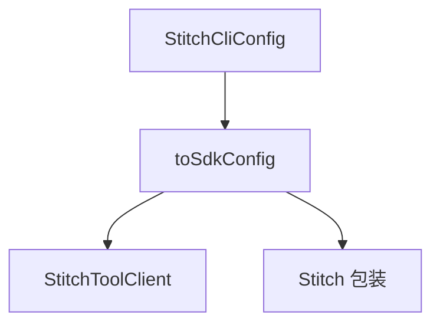

相关源文件

生成本页时使用的主要源文件：

- [src/stitch-client.ts](../../../project-repos/stitch-design-cli/src/stitch-client.ts)
- [package.json](../../../project-repos/stitch-design-cli/package.json)
- [src/cli.ts](../../../project-repos/stitch-design-cli/src/cli.ts)

# Stitch SDK 适配层

`stitch-client.ts` 是 CLI 与 `@google/stitch-sdk` 之间的唯一适配点：把 `StitchCliConfig` 映射为 `StitchConfigInput` 子集，并同时构造低层 `StitchToolClient` 与高层 `Stitch` 封装，供「直接 callTool」与「SDK 语义化 API」两种调用风格复用。

## 配置映射

`toSdkConfig` 传递 `apiKey`、`accessToken`、`projectId`、`baseUrl` 与 `timeout`（毫秒），未在 CLI 层引入额外字段，保持与官方 SDK 选项一一对应。

Sources: [src/stitch-client.ts:11-26](../../../project-repos/stitch-design-cli/src/stitch-client.ts#L11-L26)

## 鉴权存在性判断

`hasAuth` 仅在「非空 API Key」或「Access Token 与 Project Id 同时非空」时返回真；与 `inferAuthMode` 逻辑一致，供 `doctor`、`runWithSdk` 快速短路。

Sources: [src/stitch-client.ts:7-9](../../../project-repos/stitch-design-cli/src/stitch-client.ts#L7-L9)

## 依赖版本

`package.json` 将 `@google/stitch-sdk` 固定为 `^0.0.3`（发布时范围），CLI 行为随 SDK 工具名与返回结构演进需要同步回归测试。

Sources: [package.json:49-51](../../../project-repos/stitch-design-cli/package.json#L49-L51)

## 相关页面

- [认证与配置解析](auth-and-config.md)
- [响应归一化与屏幕变更结果](normalization-pipeline.md)
