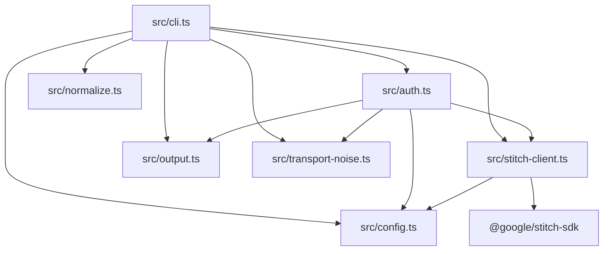

<details>
<summary>相关源文件</summary>

生成本页时使用的主要源文件：

- [src/cli.ts](https://github.com/danielgwilson/stitch-design-cli/blob/71e62a260313d7e3030f2d6a17067c455c7f4873/src/cli.ts)
- [src/config.ts](https://github.com/danielgwilson/stitch-design-cli/blob/71e62a260313d7e3030f2d6a17067c455c7f4873/src/config.ts)
- [src/stitch-client.ts](https://github.com/danielgwilson/stitch-design-cli/blob/71e62a260313d7e3030f2d6a17067c455c7f4873/src/stitch-client.ts)
- [src/output.ts](https://github.com/danielgwilson/stitch-design-cli/blob/71e62a260313d7e3030f2d6a17067c455c7f4873/src/output.ts)
- [src/normalize.ts](https://github.com/danielgwilson/stitch-design-cli/blob/71e62a260313d7e3030f2d6a17067c455c7f4873/src/normalize.ts)
- [src/auth.ts](https://github.com/danielgwilson/stitch-design-cli/blob/71e62a260313d7e3030f2d6a17067c455c7f4873/src/auth.ts)
- [src/transport-noise.ts](https://github.com/danielgwilson/stitch-design-cli/blob/71e62a260313d7e3030f2d6a17067c455c7f4873/src/transport-noise.ts)

</details>

# 系统架构与模块边界

本仓库采用「薄 CLI + 清晰横切关注点」结构：`cli.ts` 负责 Commander 路由与 I/O 策略；`config` / `auth` 负责凭据来源合并与校验；`stitch-client` 将 CLI 配置映射为官方 SDK 客户端；`normalize` 将 Stitch 返回的多形态对象压平为稳定 JSON；`output` 统一错误码与信封；`transport-noise` 抑制 SDK 传输层噪声日志。

## 模块依赖方向



Sources: [src/cli.ts:1-18](../../../project-repos/stitch-design-cli/src/cli.ts#L1-L18), [src/auth.ts:1-4](../../../project-repos/stitch-design-cli/src/auth.ts#L1-L4), [src/stitch-client.ts:1-26](../../../project-repos/stitch-design-cli/src/stitch-client.ts#L1-L26)

<details class="source-snippets">
<summary>引用源码</summary>

<!-- source-snippets:start -->

#### `src/cli.ts:1-18`

```typescript
#!/usr/bin/env node
import { createRequire } from "node:module";
import { createInterface } from "node:readline/promises";
import { Command } from "commander";
import { clearConfig, getConfigPath, redactSecret, resolveConfig, type ResolvedConfig } from "./config.js";
import { saveAndValidateConfig, validateAuth } from "./auth.js";
import {
  collectStrings,
  createScreenMutationResult,
  extractOutputMessages,
  extractScreensFromOutput,
  serializeProject,
  serializeScreen,
  splitCsv,
} from "./normalize.js";
import { createSdkContext, hasAuth, AUTH_HELP_TEXT } from "./stitch-client.js";
import { exitCodeFor, fail, makeError, ok, printJson } from "./output.js";
import { withSuppressedTransportNoise } from "./transport-noise.js";
```

#### `src/auth.ts:1-4`

```typescript
import { inferAuthMode, type ResolvedConfig, type StitchCliConfig, writeConfig } from "./config.js";
import { makeError } from "./output.js";
import { createSdkContext } from "./stitch-client.js";
import { withSuppressedTransportNoise } from "./transport-noise.js";
```

#### `src/stitch-client.ts:1-26`

```typescript
import { Stitch, StitchToolClient, type StitchConfigInput } from "@google/stitch-sdk";
import type { StitchCliConfig } from "./config.js";

export const AUTH_HELP_TEXT =
  "No Stitch credentials. Run `stitch auth set` to save an API key locally, `stitch auth set --stdin` to pipe one in, or export `STITCH_API_KEY`.";

export function hasAuth(config: StitchCliConfig): boolean {
  return Boolean(config.apiKey?.trim() || (config.accessToken?.trim() && config.projectId?.trim()));
}

function toSdkConfig(config: StitchCliConfig): Partial<StitchConfigInput> {
  return {
    apiKey: config.apiKey,
    accessToken: config.accessToken,
    projectId: config.projectId,
    baseUrl: config.baseUrl,
    timeout: config.timeoutMs,
  };
}

export function createSdkContext(config: StitchCliConfig): { client: StitchToolClient; sdk: Stitch } {
  const client = new StitchToolClient(toSdkConfig(config));
  return {
    client,
    sdk: new Stitch(client),
  };
```

<!-- source-snippets:end -->
</details>
## 核心执行路径：`runWithSdk`

多数需鉴权的子命令通过 `requireAuthConfig` 与 `runWithSdk` 包装：成功时 `--json` 走 `printJson(ok(data))`；失败走 `emitFailure`；`finally` 中关闭 `StitchToolClient`。

Sources: [src/cli.ts:86-112](../../../project-repos/stitch-design-cli/src/cli.ts#L86-L112)

<details class="source-snippets">
<summary>引用源码</summary>

<!-- source-snippets:start -->

#### `src/cli.ts:86-112`

```typescript
async function requireAuthConfig(json = false): Promise<ResolvedConfig | null> {
  const config = await resolveConfig();
  if (hasAuth(config)) return config;
  emitFailure({ code: "AUTH_MISSING", message: AUTH_HELP_TEXT }, json);
  return null;
}

async function runWithSdk<T>(
  options: CommonJsonOptions,
  task: (ctx: ReturnType<typeof createSdkContext> & { config: ResolvedConfig }) => Promise<T>,
  humanPrinter?: (data: T) => void,
): Promise<void> {
  const config = await requireAuthConfig(Boolean(options.json));
  if (!config) return;

  const ctx = createSdkContext(config);
  try {
    const data = await withSuppressedTransportNoise(() => task({ ...ctx, config }));
    if (options.json) printJson(ok(data));
    else if (humanPrinter) humanPrinter(data);
    else printHuman(data);
  } catch (error) {
    emitFailure(error, Boolean(options.json));
  } finally {
    await ctx.client.close();
  }
}
```

<!-- source-snippets:end -->
</details>
## 传输噪声抑制

`withSuppressedTransportNoise` 在任务执行期间临时替换 `console.error`，过滤以 `Stitch Transport Error:` 开头的行，避免污染代理解析 stdout/stderr 的假设。

Sources: [src/transport-noise.ts:1-12](../../../project-repos/stitch-design-cli/src/transport-noise.ts#L1-L12)

<details class="source-snippets">
<summary>引用源码</summary>

<!-- source-snippets:start -->

#### `src/transport-noise.ts:1-12`

```typescript
export async function withSuppressedTransportNoise<T>(task: () => Promise<T>): Promise<T> {
  const originalError = console.error;
  console.error = (...args: unknown[]) => {
    if (typeof args[0] === "string" && args[0].startsWith("Stitch Transport Error:")) return;
    originalError(...args);
  };
  try {
    return await task();
  } finally {
    console.error = originalError;
  }
}
```

<!-- source-snippets:end -->
</details>
## 相关页面

- [项目概览](overview.md)
- [CLI 命令面](cli-commands.md)
