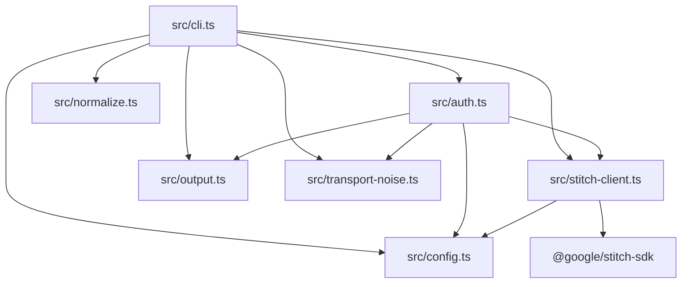

相关源文件

生成本页时使用的主要源文件：

- [src/cli.ts](../../../project-repos/stitch-design-cli/src/cli.ts)
- [src/config.ts](../../../project-repos/stitch-design-cli/src/config.ts)
- [src/stitch-client.ts](../../../project-repos/stitch-design-cli/src/stitch-client.ts)
- [src/output.ts](../../../project-repos/stitch-design-cli/src/output.ts)
- [src/normalize.ts](../../../project-repos/stitch-design-cli/src/normalize.ts)
- [src/auth.ts](../../../project-repos/stitch-design-cli/src/auth.ts)
- [src/transport-noise.ts](../../../project-repos/stitch-design-cli/src/transport-noise.ts)

# 系统架构与模块边界

本仓库采用「薄 CLI + 清晰横切关注点」结构：`cli.ts` 负责 Commander 路由与 I/O 策略；`config` / `auth` 负责凭据来源合并与校验；`stitch-client` 将 CLI 配置映射为官方 SDK 客户端；`normalize` 将 Stitch 返回的多形态对象压平为稳定 JSON；`output` 统一错误码与信封；`transport-noise` 抑制 SDK 传输层噪声日志。

## 模块依赖方向

Sources: [src/cli.ts:1-18](../../../project-repos/stitch-design-cli/src/cli.ts#L1-L18), [src/auth.ts:1-4](../../../project-repos/stitch-design-cli/src/auth.ts#L1-L4), [src/stitch-client.ts:1-26](../../../project-repos/stitch-design-cli/src/stitch-client.ts#L1-L26)

## 核心执行路径：`runWithSdk`

多数需鉴权的子命令通过 `requireAuthConfig` 与 `runWithSdk` 包装：成功时 `--json` 走 `printJson(ok(data))`；失败走 `emitFailure`；`finally` 中关闭 `StitchToolClient`。

Sources: [src/cli.ts:86-112](../../../project-repos/stitch-design-cli/src/cli.ts#L86-L112)

## 传输噪声抑制

`withSuppressedTransportNoise` 在任务执行期间临时替换 `console.error`，过滤以 `Stitch Transport Error:` 开头的行，避免污染代理解析 stdout/stderr 的假设。

Sources: [src/transport-noise.ts:1-12](../../../project-repos/stitch-design-cli/src/transport-noise.ts#L1-L12)

## 相关页面

- [项目概览](overview.md)
- [CLI 命令面](cli-commands.md)
