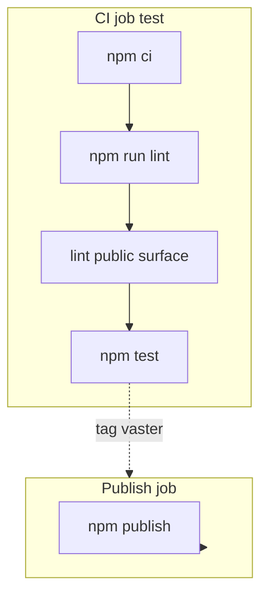

相关源文件

生成本页时使用的主要源文件：

- [.github/workflows/ci.yml](../../../project-repos/stitch-design-cli/.github/workflows/ci.yml)
- [.github/workflows/publish.yml](../../../project-repos/stitch-design-cli/.github/workflows/publish.yml)
- [package.json](../../../project-repos/stitch-design-cli/package.json)
- [scripts/public-surface-check.mjs](../../../project-repos/stitch-design-cli/scripts/public-surface-check.mjs)
- [test/config.test.ts](../../../project-repos/stitch-design-cli/test/config.test.ts)
- [test/normalize.test.ts](../../../project-repos/stitch-design-cli/test/normalize.test.ts)
- [test/output.test.ts](../../../project-repos/stitch-design-cli/test/output.test.ts)

# 测试、CI 与发布

工程质量由 **Node 内置测试运行器**（`tsx --test`）、类型检查、以及自定义 **npm pack 公共面审计** 共同把关；CI 在 push/PR 与标签发布两条流水线上复用相同门槛。

## CI 工作流

`ci.yml` 包含：

1. **secret-scan**：拒绝将 `.har`、浏览器 trace、cookies 等原始捕获物纳入版本控制，并运行 **gitleaks**。
2. **test**：在 Node **22 与 24** 矩阵上执行 `npm ci`、`npm run lint`（实为 `tsc --noEmit`）、`lint:public-surface` 与 `npm test`。

Sources: [.github/workflows/ci.yml:16-49](../../../project-repos/stitch-design-cli/.github/workflows/ci.yml#L16-L49), [package.json:36-49](../../../project-repos/stitch-design-cli/package.json#L36-L49)

## 发布工作流

`publish.yml` 在推送 `v*` 标签或手动 `workflow_dispatch` 时运行：Node 24、`npm publish --access public`，且具备 `id-token: write` 以支持 **npm trusted publishing**（与 `stitch-trusted-publishing-notes.md` 描述一致）。

Sources: [.github/workflows/publish.yml:1-33](../../../project-repos/stitch-design-cli/.github/workflows/publish.yml#L1-L33)

## `prepublishOnly` 门槛

发布前自动执行 `lint`、`lint:public-surface` 与 `test`，与 CI 主路径对齐，减少「本地未跑脚本但 tag 已推送」的失误。

Sources: [package.json:51-52](../../../project-repos/stitch-design-cli/package.json#L51-L52)

## public-surface-check 脚本职责（摘要）

脚本对仓库进行 **敏感模式扫描**、阻止将测试目录打入 npm 包、并检查 `npm pack` 结果树中是否出现可疑路径或密钥样例；具体规则见 `public-surface-check.mjs` 顶部常量数组。

Sources: [scripts/public-surface-check.mjs:1-30](../../../project-repos/stitch-design-cli/scripts/public-surface-check.mjs#L1-L30)

## 相关页面

- [项目概览](overview.md)
- [Agent Skill 与运维提示](agent-skill.md)
