<details>
<summary>相关源文件</summary>

生成本页时使用的主要源文件：

- [.github/workflows/ci.yml](https://github.com/danielgwilson/stitch-design-cli/blob/71e62a260313d7e3030f2d6a17067c455c7f4873/.github/workflows/ci.yml)
- [.github/workflows/publish.yml](https://github.com/danielgwilson/stitch-design-cli/blob/71e62a260313d7e3030f2d6a17067c455c7f4873/.github/workflows/publish.yml)
- [package.json](https://github.com/danielgwilson/stitch-design-cli/blob/71e62a260313d7e3030f2d6a17067c455c7f4873/package.json)
- [scripts/public-surface-check.mjs](https://github.com/danielgwilson/stitch-design-cli/blob/71e62a260313d7e3030f2d6a17067c455c7f4873/scripts/public-surface-check.mjs)
- [test/config.test.ts](https://github.com/danielgwilson/stitch-design-cli/blob/71e62a260313d7e3030f2d6a17067c455c7f4873/test/config.test.ts)
- [test/normalize.test.ts](https://github.com/danielgwilson/stitch-design-cli/blob/71e62a260313d7e3030f2d6a17067c455c7f4873/test/normalize.test.ts)
- [test/output.test.ts](https://github.com/danielgwilson/stitch-design-cli/blob/71e62a260313d7e3030f2d6a17067c455c7f4873/test/output.test.ts)

</details>

# 测试、CI 与发布

工程质量由 **Node 内置测试运行器**（`tsx --test`）、类型检查、以及自定义 **npm pack 公共面审计** 共同把关；CI 在 push/PR 与标签发布两条流水线上复用相同门槛。

## CI 工作流

`ci.yml` 包含：

1. **secret-scan**：拒绝将 `.har`、浏览器 trace、cookies 等原始捕获物纳入版本控制，并运行 **gitleaks**。
2. **test**：在 Node **22 与 24** 矩阵上执行 `npm ci`、`npm run lint`（实为 `tsc --noEmit`）、`lint:public-surface` 与 `npm test`。

Sources: [github/workflows/ci.yml:16-49](../../../project-repos/stitch-design-cli/.github/workflows/ci.yml#L16-L49), [package.json:36-49](../../../project-repos/stitch-design-cli/package.json#L36-L49)

<details class="source-snippets">
<summary>引用源码</summary>

<!-- source-snippets:start -->

#### `github/workflows/ci.yml:16-49`

```yaml
  secret-scan:
    runs-on: ubuntu-latest
    steps:
      - uses: actions/checkout@v6
        with:
          fetch-depth: 0
      - name: Fail on tracked raw captures
        run: |
          if git ls-files | grep -E '(^|/)\.firecrawl/|\.har$|\.har\.gz$|\.trace$|\.trace\.json$|(^|/)storage-state\.json$|(^|/)cookies\.(txt|json)$|\.session\.json$'; then
            echo "Remove raw browser capture artifacts before merging." >&2
            exit 1
          fi
      - uses: gitleaks/gitleaks-action@v2
        env:
          GITHUB_TOKEN: ${{ secrets.GITHUB_TOKEN }}
          GITLEAKS_ENABLE_COMMENTS: false
          GITLEAKS_CONFIG: .gitleaks.toml

  test:
    runs-on: ubuntu-latest
    strategy:
      fail-fast: false
      matrix:
        node: [22, 24]
    steps:
      - uses: actions/checkout@v6
      - uses: actions/setup-node@v6
        with:
          node-version: ${{ matrix.node }}
          cache: npm
      - run: npm ci
      - run: npm run lint
      - run: npm run lint:public-surface
      - run: npm test
```

#### `package.json:36-49`

```json
  "scripts": {
    "clean": "node -e \"require('node:fs').rmSync('dist',{recursive:true,force:true})\"",
    "build": "npm run clean && tsc -p tsconfig.build.json && node -e \"require('node:fs').chmodSync('dist/cli.js',0o755)\"",
    "dev": "tsx src/cli.ts",
    "typecheck": "tsc -p tsconfig.json --noEmit",
    "lint": "npm run typecheck",
    "lint:public-surface": "node scripts/public-surface-check.mjs",
    "pretest": "npm run build",
    "test": "tsx --test test/**/*.test.ts",
    "start": "node dist/cli.js",
    "prepublishOnly": "npm run lint && npm run lint:public-surface && npm test",
    "prepare": "npm run build"
  },
  "dependencies": {
```

<!-- source-snippets:end -->
</details>
## 发布工作流

`publish.yml` 在推送 `v*` 标签或手动 `workflow_dispatch` 时运行：Node 24、`npm publish --access public`，且具备 `id-token: write` 以支持 **npm trusted publishing**（与 `stitch-trusted-publishing-notes.md` 描述一致）。

Sources: [github/workflows/publish.yml:1-33](../../../project-repos/stitch-design-cli/.github/workflows/publish.yml#L1-L33)

<details class="source-snippets">
<summary>引用源码</summary>

<!-- source-snippets:start -->

#### `github/workflows/publish.yml:1-33`

```yaml
name: Publish

on:
  push:
    tags:
      - "v*"
  workflow_dispatch:

permissions:
  id-token: write
  contents: read

concurrency:
  group: publish-${{ github.ref }}
  cancel-in-progress: false

jobs:
  publish:
    runs-on: ubuntu-latest
    steps:
      - uses: actions/checkout@v6

      - uses: actions/setup-node@v6
        with:
          node-version: "24"
          registry-url: "https://registry.npmjs.org"
          cache: npm

      - run: npm ci
      - run: npm run lint
      - run: npm run lint:public-surface
      - run: npm test
      - run: npm publish --access public
```

<!-- source-snippets:end -->
</details>
## `prepublishOnly` 门槛

发布前自动执行 `lint`、`lint:public-surface` 与 `test`，与 CI 主路径对齐，减少「本地未跑脚本但 tag 已推送」的失误。

Sources: [package.json:51-52](../../../project-repos/stitch-design-cli/package.json#L51-L52)

<details class="source-snippets">
<summary>引用源码</summary>

<!-- source-snippets:start -->

#### `package.json:51-52`

```json
    "commander": "^14.0.3"
  },
```

<!-- source-snippets:end -->
</details>
## public-surface-check 脚本职责（摘要）

脚本对仓库进行 **敏感模式扫描**、阻止将测试目录打入 npm 包、并检查 `npm pack` 结果树中是否出现可疑路径或密钥样例；具体规则见 `public-surface-check.mjs` 顶部常量数组。

Sources: [scripts/public-surface-check.mjs:1-30](../../../project-repos/stitch-design-cli/scripts/public-surface-check.mjs#L1-L30)

<details class="source-snippets">
<summary>引用源码</summary>

<!-- source-snippets:start -->

#### `scripts/public-surface-check.mjs:1-30`

```javascript
import { execFileSync } from "node:child_process";
import { mkdtempSync, readFileSync, readdirSync, rmSync, statSync } from "node:fs";
import { tmpdir } from "node:os";
import { extname, join, relative } from "node:path";
import { fileURLToPath } from "node:url";

const repoRoot = process.cwd();
const selfPath = relative(repoRoot, fileURLToPath(import.meta.url)).replace(/\\/g, "/");

const trackedArtifactChecks = [
  { pattern: /(^|\/)\.firecrawl\//, reason: "tracked Firecrawl artifact" },
  { pattern: /(^|\/)\.claude\/(logs|projects)\//, reason: "tracked Claude runtime artifact" },
  { pattern: /(^|\/)\.codex\//, reason: "tracked Codex runtime artifact" },
  { pattern: /\.har(?:\.gz)?$/, reason: "tracked browser capture" },
  { pattern: /\.trace(?:\.json)?$/, reason: "tracked browser trace" },
  { pattern: /(^|\/)storage-state\.json$/, reason: "tracked browser storage state" },
  { pattern: /(^|\/)cookies\.(txt|json)$/, reason: "tracked browser cookies" },
  { pattern: /\.session\.json$/, reason: "tracked session artifact" },
];

const packArtifactChecks = [
  ...trackedArtifactChecks,
  { pattern: /^(test|tests)\//, reason: "tests included in npm package" },
];

const absolutePathPattern =
  /(?:\/Users\/[^\s"'`<>()]+|\/home\/[^\s"'`<>()]+|[A-Za-z]:\\\\Users\\\\[^\s"'`<>()]+)/;

const secretPattern =
  /(AQ\.[A-Za-z0-9._-]{20,}|eyJ[A-Za-z0-9_-]{10,}\.[A-Za-z0-9_-]{10,}\.[A-Za-z0-9_-]{10,}|AKIA[0-9A-Z]{16}|AIza[0-9A-Za-z\-_]{20,}|gh[pousr]_[A-Za-z0-9]{20,}|github_pat_[A-Za-z0-9_]{20,}|sk_(?:live|test|proj)_[A-Za-z0-9]{16,}|xox[baporsc]-[A-Za-z0-9-]{10,}|ya29\.[A-Za-z0-9\-_]+|-----BEGIN [A-Z ]*PRIVATE KEY-----)/;
```

<!-- source-snippets:end -->
</details>


```mermaid
flowchart TD
  subgraph CiJob["CI job test"]
    Install["npm ci"]
    Typecheck["npm run lint"]
    Surface["lint public surface"]
    Tests["npm test"]
  end
  subgraph PublishJob["Publish job"]
    Pub["npm publish"]
  end
  Install --> Typecheck --> Surface --> Tests
  Tests -.->|"tag vaster"| PublishJob
  PublishJob --> Pub
```

## 相关页面

- [项目概览](overview.md)
- [Agent Skill 与运维提示](agent-skill.md)
