# Superpowers DeepWiki - 完整导出

> 来源：https://github.com/obra/superpowers
> 提交：e7a2d16476bf042e9add4699c9d018a90f86e4a6

## 目录

1. 项目概览
2. 系统架构
3. 多平台集成
4. 核心工作流
5. 子代理驱动开发
6. 技能体系
7. 测试驱动与系统化调试
8. 可视化头脑风暴伴侣
9. 测试与质量保障
10. 扩展与贡献


---

<details>
<summary>相关源文件</summary>

生成本页时使用的主要源文件：

- [README.md](https://github.com/obra/superpowers/blob/main/README.md)
- [package.json](https://github.com/obra/superpowers/blob/main/package.json)
- [CLAUDE.md](https://github.com/obra/superpowers/blob/main/CLAUDE.md)
- [LICENSE](https://github.com/obra/superpowers/blob/main/LICENSE)
- [RELEASE-NOTES.md](https://github.com/obra/superpowers/blob/main/RELEASE-NOTES.md)

</details>

# 项目概览

Superpowers 是一个面向编码代理（coding agent）的完整软件开发方法论框架，由 14 个可组合的技能（skill）构成，覆盖从需求探索到分支交付的全流程。它不是一组建议，而是一套强制执行的工作流——代理在会话启动时自动加载引导技能，并在每个任务前检查是否有适用的技能需要触发。

当前版本为 **5.0.7**，以 MIT 协议开源，由 Jesse Vincent 及 Prime Radiant 团队维护。

Sources: [package.json:1-6](../../../project-repos/superpowers/package.json#L1-L6), [README.md:1-10](../../../project-repos/superpowers/README.md#L1-L10)

<details class="source-snippets">
<summary>引用源码</summary>

<!-- source-snippets:start -->

#### `package.json:1-6`

```json
{
  "name": "superpowers",
  "version": "5.0.7",
  "type": "module",
  "main": ".opencode/plugins/superpowers.js"
}
```

#### `README.md:1-10`

```markdown
# Superpowers

Superpowers is a complete software development methodology for your coding agents, built on top of a set of composable skills and some initial instructions that make sure your agent uses them.

## How it works

It starts from the moment you fire up your coding agent. As soon as it sees that you're building something, it *doesn't* just jump into trying to write code. Instead, it steps back and asks you what you're really trying to do. 

Once it's teased a spec out of the conversation, it shows it to you in chunks short enough to actually read and digest. 

```

<!-- source-snippets:end -->
</details>
## 项目定位

Superpowers 解决的核心问题是：编码代理倾向于直接跳入写代码，跳过设计、规划和测试环节。Superpowers 通过技能系统强制代理遵循结构化流程——先理解需求、再设计方案、然后编写计划、最后以 TDD 方式实施并审查。

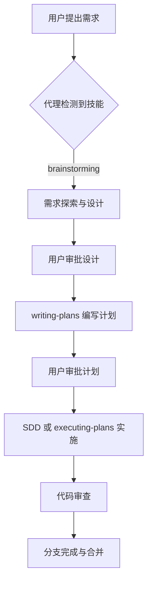

Sources: [README.md:3-10](../../../project-repos/superpowers/README.md#L3-L10), [skills/using-superpowers/SKILL.md:1-30](../../../project-repos/superpowers/skills/using-superpowers/SKILL.md#L1-L30)

<details class="source-snippets">
<summary>引用源码</summary>

<!-- source-snippets:start -->

#### `README.md:3-10`

```markdown
Superpowers is a complete software development methodology for your coding agents, built on top of a set of composable skills and some initial instructions that make sure your agent uses them.

## How it works

It starts from the moment you fire up your coding agent. As soon as it sees that you're building something, it *doesn't* just jump into trying to write code. Instead, it steps back and asks you what you're really trying to do. 

Once it's teased a spec out of the conversation, it shows it to you in chunks short enough to actually read and digest. 

```

#### `skills/using-superpowers/SKILL.md:1-30`

```markdown
---
name: using-superpowers
description: Use when starting any conversation - establishes how to find and use skills, requiring Skill tool invocation before ANY response including clarifying questions
---

<SUBAGENT-STOP>
If you were dispatched as a subagent to execute a specific task, skip this skill.
</SUBAGENT-STOP>

<EXTREMELY-IMPORTANT>
If you think there is even a 1% chance a skill might apply to what you are doing, you ABSOLUTELY MUST invoke the skill.

IF A SKILL APPLIES TO YOUR TASK, YOU DO NOT HAVE A CHOICE. YOU MUST USE IT.

This is not negotiable. This is not optional. You cannot rationalize your way out of this.
</EXTREMELY-IMPORTANT>

## Instruction Priority

Superpowers skills override default system prompt behavior, but **user instructions always take precedence**:

1. **User's explicit instructions** (CLAUDE.md, GEMINI.md, AGENTS.md, direct requests) — highest priority
2. **Superpowers skills** — override default system behavior where they conflict
3. **Default system prompt** — lowest priority

If CLAUDE.md, GEMINI.md, or AGENTS.md says "don't use TDD" and a skill says "always use TDD," follow the user's instructions. The user is in control.

## How to Access Skills

**In Claude Code:** Use the `Skill` tool. When you invoke a skill, its content is loaded and presented to you—follow it directly. Never use the Read tool on skill files.
```

<!-- source-snippets:end -->
</details>
## 核心能力

| 能力 | 说明 | 对应技能 |
|------|------|----------|
| 需求探索 | 苏格拉底式提问，逐个问题澄清需求 | brainstorming |
| 设计文档 | 自动生成设计规格并提交 Git | brainstorming |
| 实施计划 | 将设计分解为 2-5 分钟的原子任务 | writing-plans |
| 子代理驱动 | 每个任务分派独立子代理，两阶段审查 | subagent-driven-development |
| 测试驱动 | RED-GREEN-REFACTOR 铁律，先写失败测试 | test-driven-development |
| 系统化调试 | 四阶段根因分析，禁止猜测式修复 | systematic-debugging |
| 代码审查 | 规格合规审查 + 代码质量审查 | requesting-code-review |
| 分支管理 | Git worktree 隔离 + 分支完成工作流 | using-git-worktrees, finishing-a-development-branch |
| 技能编写 | TDD 式编写技能，含压力测试验证 | writing-skills |

Sources: [README.md:82-128](../../../project-repos/superpowers/README.md#L82-L128)

<details class="source-snippets">
<summary>引用源码</summary>

<!-- source-snippets:start -->

#### `README.md:82-128`

````markdown
In Cursor Agent chat, install from marketplace:

```text
/add-plugin superpowers
```

or search for "superpowers" in the plugin marketplace.

### OpenCode

Tell OpenCode:

```
Fetch and follow instructions from https://raw.githubusercontent.com/obra/superpowers/refs/heads/main/.opencode/INSTALL.md
```

**Detailed docs:** [docs/README.opencode.md](docs/README.opencode.md)

### GitHub Copilot CLI

```bash
copilot plugin marketplace add obra/superpowers-marketplace
copilot plugin install superpowers@superpowers-marketplace
```

### Gemini CLI

```bash
gemini extensions install https://github.com/obra/superpowers
```

To update:

```bash
gemini extensions update superpowers
```

## The Basic Workflow

1. **brainstorming** - Activates before writing code. Refines rough ideas through questions, explores alternatives, presents design in sections for validation. Saves design document.

2. **using-git-worktrees** - Activates after design approval. Creates isolated workspace on new branch, runs project setup, verifies clean test baseline.

3. **writing-plans** - Activates with approved design. Breaks work into bite-sized tasks (2-5 minutes each). Every task has exact file paths, complete code, verification steps.

4. **subagent-driven-development** or **executing-plans** - Activates with plan. Dispatches fresh subagent per task with two-stage review (spec compliance, then code quality), or executes in batches with human checkpoints.

````

<!-- source-snippets:end -->
</details>
## 设计哲学

Superpowers 的设计哲学可以概括为四条原则：

1. **测试驱动开发**——始终先写测试，没有例外
2. **系统化优于即兴**——遵循流程而非猜测
3. **复杂度缩减**——简洁是首要目标
4. **证据优于断言**——验证后再宣布成功

这些原则贯穿所有技能。例如 `test-driven-development` 技能声明"如果你没有看到测试失败，你不知道它测试了正确的东西"；`systematic-debugging` 技能要求"没有根因调查就不能提出修复"；`verification-before-completion` 技能规定"没有新鲜验证证据就不能声称完成"。

Sources: [README.md:130-135](../../../project-repos/superpowers/README.md#L130-L135), [skills/test-driven-development/SKILL.md:1-15](../../../project-repos/superpowers/skills/test-driven-development/SKILL.md#L1-L15), [skills/systematic-debugging/SKILL.md:1-15](../../../project-repos/superpowers/skills/systematic-debugging/SKILL.md#L1-L15), [skills/verification-before-completion/SKILL.md:1-10](../../../project-repos/superpowers/skills/verification-before-completion/SKILL.md#L1-L10)

<details class="source-snippets">
<summary>引用源码</summary>

<!-- source-snippets:start -->

#### `README.md:130-135`

```markdown

6. **requesting-code-review** - Activates between tasks. Reviews against plan, reports issues by severity. Critical issues block progress.

7. **finishing-a-development-branch** - Activates when tasks complete. Verifies tests, presents options (merge/PR/keep/discard), cleans up worktree.

**The agent checks for relevant skills before any task.** Mandatory workflows, not suggestions.
```

#### `skills/test-driven-development/SKILL.md:1-15`

```markdown
---
name: test-driven-development
description: Use when implementing any feature or bugfix, before writing implementation code
---

# Test-Driven Development (TDD)

## Overview

Write the test first. Watch it fail. Write minimal code to pass.

**Core principle:** If you didn't watch the test fail, you don't know if it tests the right thing.

**Violating the letter of the rules is violating the spirit of the rules.**

```

#### `skills/systematic-debugging/SKILL.md:1-15`

```markdown
---
name: systematic-debugging
description: Use when encountering any bug, test failure, or unexpected behavior, before proposing fixes
---

# Systematic Debugging

## Overview

Random fixes waste time and create new bugs. Quick patches mask underlying issues.

**Core principle:** ALWAYS find root cause before attempting fixes. Symptom fixes are failure.

**Violating the letter of this process is violating the spirit of debugging.**

```

#### `skills/verification-before-completion/SKILL.md:1-10`

```markdown
---
name: verification-before-completion
description: Use when about to claim work is complete, fixed, or passing, before committing or creating PRs - requires running verification commands and confirming output before making any success claims; evidence before assertions always
---

# Verification Before Completion

## Overview

Claiming work is complete without verification is dishonesty, not efficiency.
```

<!-- source-snippets:end -->
</details>
## 仓库结构

```text
superpowers/
├── .claude-plugin/        # Claude Code 插件清单
├── .codex-plugin/         # Codex 插件清单
├── .cursor-plugin/        # Cursor 插件清单
├── .opencode/             # OpenCode 插件与安装指南
├── agents/                # 代理定义（code-reviewer）
├── commands/              # 已弃用的命令（迁移至技能）
├── docs/                  # 设计文档、规格、计划
├── hooks/                 # SessionStart 钩子（引导注入）
├── scripts/               # 版本管理与 Codex 同步脚本
├── skills/                # 14 个技能目录
├── tests/                 # 集成测试与技能触发测试
├── CLAUDE.md              # Claude Code 贡献者指南
├── GEMINI.md              # Gemini CLI 引导文件
└── package.json           # v5.0.7
```

Sources: [00-repo-inventory.md](../00-repo-inventory.md)

<details class="source-snippets">
<summary>引用源码</summary>

<!-- source-snippets:start -->

#### `00-repo-inventory.md`

```markdown
# 00 - 仓库盘点

## Source

- Path: `/Users/bytedance/workspace/deepwiki/project-repos/superpowers`
- Remote: `https://github.com/obra/superpowers`
- Branch: `main`
- Commit: `e7a2d16476bf042e9add4699c9d018a90f86e4a6`

## File Summary

- Files scanned: 147
- Top-level directories: `.claude-plugin`, `.codex`, `.codex-plugin`, `.cursor-plugin`, `.github`, `.opencode`, `agents`, `assets`, `commands`, `docs`, `hooks`, `scripts`, `skills`, `tests`

| Extension | Count |
|-----------|------:|
| `.md` | 74 |
| `.sh` | 28 |
| `.txt` | 15 |
| `.json` | 11 |
| `.js` | 5 |
| `[no extension]` | 4 |
| `.yml` | 2 |
| `.png` | 1 |
| `.svg` | 1 |
| `.cmd` | 1 |
| `.html` | 1 |
| `.cjs` | 1 |
| `.ts` | 1 |
| `.dot` | 1 |
| `.py` | 1 |

## Manifests and Build Files

- `package.json`
- `tests/brainstorm-server/package-lock.json`
- `tests/brainstorm-server/package.json`

## Documentation

- `CODE_OF_CONDUCT.md`
- `README.md`
- `docs/README.codex.md`
- `docs/README.opencode.md`
- `docs/plans/2025-11-22-opencode-support-design.md`
- `docs/plans/2025-11-22-opencode-support-implementation.md`
- `docs/plans/2025-11-28-skills-improvements-from-user-feedback.md`
- `docs/plans/2026-01-17-visual-brainstorming.md`
- `docs/superpowers/plans/2026-01-22-document-review-system.md`
- `docs/superpowers/plans/2026-02-19-visual-brainstorming-refactor.md`
- `docs/superpowers/plans/2026-03-11-zero-dep-brainstorm-server.md`
- `docs/superpowers/plans/2026-03-23-codex-app-compatibility.md`
- `docs/superpowers/specs/2026-01-22-document-review-system-design.md`
- `docs/superpowers/specs/2026-02-19-visual-brainstorming-refactor-design.md`
- `docs/superpowers/specs/2026-03-11-zero-dep-brainstorm-server-design.md`
- `docs/superpowers/specs/2026-03-23-codex-app-compatibility-design.md`
- `docs/testing.md`
- `docs/windows/polyglot-hooks.md`
- `tests/claude-code/README.md`

## CI and Automation

- None detected

## Tests

- `tests/brainstorm-server/package-lock.json`
- `tests/brainstorm-server/package.json`
- `tests/brainstorm-server/server.test.js`
- `tests/brainstorm-server/windows-lifecycle.test.sh`
- `tests/brainstorm-server/ws-protocol.test.js`
- `tests/claude-code/README.md`
- `tests/claude-code/analyze-token-usage.py`
- `tests/claude-code/run-skill-tests.sh`
- `tests/claude-code/test-document-review-system.sh`
- `tests/claude-code/test-helpers.sh`
- `tests/claude-code/test-subagent-driven-development-integration.sh`
- `tests/claude-code/test-subagent-driven-development.sh`
- `tests/codex-plugin-sync/test-sync-to-codex-plugin.sh`
- `tests/explicit-skill-requests/prompts/action-oriented.txt`
- `tests/explicit-skill-requests/prompts/after-planning-flow.txt`
- `tests/explicit-skill-requests/prompts/claude-suggested-it.txt`
- `tests/explicit-skill-requests/prompts/i-know-what-sdd-means.txt`
- `tests/explicit-skill-requests/prompts/mid-conversation-execute-plan.txt`
- `tests/explicit-skill-requests/prompts/please-use-brainstorming.txt`
- `tests/explicit-skill-requests/prompts/skip-formalities.txt`
- `tests/explicit-skill-requests/prompts/subagent-driven-development-please.txt`
- `tests/explicit-skill-requests/prompts/use-systematic-debugging.txt`
- `tests/explicit-skill-requests/run-all.sh`
- `tests/explicit-skill-requests/run-claude-describes-sdd.sh`
- `tests/explicit-skill-requests/run-extended-multiturn-test.sh`
- `tests/explicit-skill-requests/run-haiku-test.sh`
- `tests/explicit-skill-requests/run-multiturn-test.sh`
- `tests/explicit-skill-requests/run-test.sh`
- `tests/opencode/run-tests.sh`
- `tests/opencode/setup.sh`
- `tests/opencode/test-plugin-loading.sh`
- `tests/opencode/test-priority.sh`
- `tests/opencode/test-tools.sh`
- `tests/skill-triggering/prompts/dispatching-parallel-agents.txt`
- `tests/skill-triggering/prompts/executing-plans.txt`
- `tests/skill-triggering/prompts/requesting-code-review.txt`
- `tests/skill-triggering/prompts/systematic-debugging.txt`
- `tests/skill-triggering/prompts/test-driven-development.txt`
- `tests/skill-triggering/prompts/writing-plans.txt`
- `tests/skill-triggering/run-all.sh`
- `tests/skill-triggering/run-test.sh`
- `tests/subagent-driven-dev/go-fractals/design.md`
- `tests/subagent-driven-dev/go-fractals/plan.md`
- `tests/subagent-driven-dev/go-fractals/scaffold.sh`
- `tests/subagent-driven-dev/run-test.sh`
- `tests/subagent-driven-dev/svelte-todo/design.md`
- `tests/subagent-driven-dev/svelte-todo/plan.md`
- `tests/subagent-driven-dev/svelte-todo/scaffold.sh`

## Skills

- `skills/brainstorming/SKILL.md`
- `skills/dispatching-parallel-agents/SKILL.md`
- `skills/executing-plans/SKILL.md`
```

<!-- source-snippets:end -->
</details>
## 阅读路线

- **想了解项目是什么？** → 继续阅读本页，然后看 [核心工作流](core-workflow.md)
- **想理解技能如何被发现和加载？** → 阅读 [系统架构](system-architecture.md)
- **想了解子代理驱动开发？** → 阅读 [子代理驱动开发](subagent-driven-development.md)
- **想了解 TDD 和调试方法论？** → 阅读 [测试驱动与系统化调试](tdd-and-debugging.md)
- **想在特定平台上安装使用？** → 阅读 [多平台集成](multi-platform-integration.md)
- **想编写自定义技能？** → 阅读 [扩展与贡献](extension-and-contribution.md)

## 相关页面

- [系统架构](system-architecture.md)
- [核心工作流](core-workflow.md)
- [技能体系](skills-system.md)


---

<details>
<summary>相关源文件</summary>

生成本页时使用的主要源文件：

- [hooks/session-start](https://github.com/obra/superpowers/blob/main/hooks/session-start)
- [hooks/hooks.json](https://github.com/obra/superpowers/blob/main/hooks/hooks.json)
- [hooks/hooks-cursor.json](https://github.com/obra/superpowers/blob/main/hooks/hooks-cursor.json)
- [.claude-plugin/plugin.json](https://github.com/obra/superpowers/blob/main/.claude-plugin/plugin.json)
- [.codex-plugin/plugin.json](https://github.com/obra/superpowers/blob/main/.codex-plugin/plugin.json)
- [.opencode/plugins/superpowers.js](https://github.com/obra/superpowers/blob/main/.opencode/plugins/superpowers.js)
- [skills/using-superpowers/SKILL.md](https://github.com/obra/superpowers/blob/main/skills/using-superpowers/SKILL.md)

</details>

# 系统架构

Superpowers 的架构核心是一个**技能驱动的插件系统**，通过平台原生钩子（hook）在会话启动时注入引导上下文，使编码代理自动发现并遵循技能工作流。整个系统无需外部依赖，零运行时开销。

## 整体架构

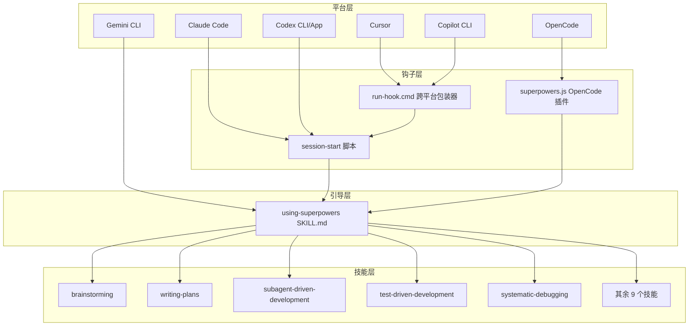

Sources: [hooks/session-start:1-57](../../../project-repos/superpowers/hooks/session-start#L1-L57), [opencode/plugins/superpowers.js:1-112](../../../project-repos/superpowers/.opencode/plugins/superpowers.js#L1-L112), [skills/using-superpowers/SKILL.md:1-30](../../../project-repos/superpowers/skills/using-superpowers/SKILL.md#L1-L30)

<details class="source-snippets">
<summary>引用源码</summary>

<!-- source-snippets:start -->

#### `hooks/session-start:1-57`

```
#!/usr/bin/env bash
# SessionStart hook for superpowers plugin

set -euo pipefail

# Determine plugin root directory
SCRIPT_DIR="$(cd "$(dirname "$0")" && pwd)"
PLUGIN_ROOT="$(cd "${SCRIPT_DIR}/.." && pwd)"

# Check if legacy skills directory exists and build warning
warning_message=""
legacy_skills_dir="${HOME}/.config/superpowers/skills"
if [ -d "$legacy_skills_dir" ]; then
    warning_message="\n\n<important-reminder>IN YOUR FIRST REPLY AFTER SEEING THIS MESSAGE YOU MUST TELL THE USER:⚠️ **WARNING:** Superpowers now uses Claude Code's skills system. Custom skills in ~/.config/superpowers/skills will not be read. Move custom skills to ~/.claude/skills instead. To make this message go away, remove ~/.config/superpowers/skills</important-reminder>"
fi

# Read using-superpowers content
using_superpowers_content=$(cat "${PLUGIN_ROOT}/skills/using-superpowers/SKILL.md" 2>&1 || echo "Error reading using-superpowers skill")

# Escape string for JSON embedding using bash parameter substitution.
# Each ${s//old/new} is a single C-level pass - orders of magnitude
# faster than the character-by-character loop this replaces.
escape_for_json() {
    local s="$1"
    s="${s//\\/\\\\}"
    s="${s//\"/\\\"}"
    s="${s//$'\n'/\\n}"
    s="${s//$'\r'/\\r}"
    s="${s//$'\t'/\\t}"
    printf '%s' "$s"
}

using_superpowers_escaped=$(escape_for_json "$using_superpowers_content")
warning_escaped=$(escape_for_json "$warning_message")
session_context="<EXTREMELY_IMPORTANT>\nYou have superpowers.\n\n**Below is the full content of your 'superpowers:using-superpowers' skill - your introduction to using skills. For all other skills, use the 'Skill' tool:**\n\n${using_superpowers_escaped}\n\n${warning_escaped}\n</EXTREMELY_IMPORTANT>"

# Output context injection as JSON.
# Cursor hooks expect additional_context (snake_case).
# Claude Code hooks expect hookSpecificOutput.additionalContext (nested).
# Copilot CLI (v1.0.11+) and others expect additionalContext (top-level, SDK standard).
# Claude Code reads BOTH additional_context and hookSpecificOutput without
# deduplication, so we must emit only the field the current platform consumes.
#
# Uses printf instead of heredoc to work around bash 5.3+ heredoc hang.
# See: https://github.com/obra/superpowers/issues/571
if [ -n "${CURSOR_PLUGIN_ROOT:-}" ]; then
  # Cursor sets CURSOR_PLUGIN_ROOT (may also set CLAUDE_PLUGIN_ROOT)
  printf '{\n  "additional_context": "%s"\n}\n' "$session_context"
elif [ -n "${CLAUDE_PLUGIN_ROOT:-}" ] && [ -z "${COPILOT_CLI:-}" ]; then
  # Claude Code sets CLAUDE_PLUGIN_ROOT without COPILOT_CLI
  printf '{\n  "hookSpecificOutput": {\n    "hookEventName": "SessionStart",\n    "additionalContext": "%s"\n  }\n}\n' "$session_context"
else
  # Copilot CLI (sets COPILOT_CLI=1) or unknown platform — SDK standard format
  printf '{\n  "additionalContext": "%s"\n}\n' "$session_context"
fi

exit 0
```

#### `opencode/plugins/superpowers.js:1-112`

```javascript
/**
 * Superpowers plugin for OpenCode.ai
 *
 * Injects superpowers bootstrap context via system prompt transform.
 * Auto-registers skills directory via config hook (no symlinks needed).
 */

import path from 'path';
import fs from 'fs';
import os from 'os';
import { fileURLToPath } from 'url';

const __dirname = path.dirname(fileURLToPath(import.meta.url));

// Simple frontmatter extraction (avoid dependency on skills-core for bootstrap)
const extractAndStripFrontmatter = (content) => {
  const match = content.match(/^---\n([\s\S]*?)\n---\n([\s\S]*)$/);
  if (!match) return { frontmatter: {}, content };

  const frontmatterStr = match[1];
  const body = match[2];
  const frontmatter = {};

  for (const line of frontmatterStr.split('\n')) {
    const colonIdx = line.indexOf(':');
    if (colonIdx > 0) {
      const key = line.slice(0, colonIdx).trim();
      const value = line.slice(colonIdx + 1).trim().replace(/^["']|["']$/g, '');
      frontmatter[key] = value;
    }
  }

  return { frontmatter, content: body };
};

// Normalize a path: trim whitespace, expand ~, resolve to absolute
const normalizePath = (p, homeDir) => {
  if (!p || typeof p !== 'string') return null;
  let normalized = p.trim();
  if (!normalized) return null;
  if (normalized.startsWith('~/')) {
    normalized = path.join(homeDir, normalized.slice(2));
  } else if (normalized === '~') {
    normalized = homeDir;
  }
  return path.resolve(normalized);
};

export const SuperpowersPlugin = async ({ client, directory }) => {
  const homeDir = os.homedir();
  const superpowersSkillsDir = path.resolve(__dirname, '../../skills');
  const envConfigDir = normalizePath(process.env.OPENCODE_CONFIG_DIR, homeDir);
  const configDir = envConfigDir || path.join(homeDir, '.config/opencode');

  // Helper to generate bootstrap content
  const getBootstrapContent = () => {
    // Try to load using-superpowers skill
    const skillPath = path.join(superpowersSkillsDir, 'using-superpowers', 'SKILL.md');
    if (!fs.existsSync(skillPath)) return null;

    const fullContent = fs.readFileSync(skillPath, 'utf8');
    const { content } = extractAndStripFrontmatter(fullContent);

    const toolMapping = `**Tool Mapping for OpenCode:**
When skills reference tools you don't have, substitute OpenCode equivalents:
- \`TodoWrite\` → \`todowrite\`
- \`Task\` tool with subagents → Use OpenCode's subagent system (@mention)
- \`Skill\` tool → OpenCode's native \`skill\` tool
- \`Read\`, \`Write\`, \`Edit\`, \`Bash\` → Your native tools

Use OpenCode's native \`skill\` tool to list and load skills.`;

    return `<EXTREMELY_IMPORTANT>
You have superpowers.

**IMPORTANT: The using-superpowers skill content is included below. It is ALREADY LOADED - you are currently following it. Do NOT use the skill tool to load "using-superpowers" again - that would be redundant.**

${content}

${toolMapping}
</EXTREMELY_IMPORTANT>`;
  };

  return {
    // Inject skills path into live config so OpenCode discovers superpowers skills
    // without requiring manual symlinks or config file edits.
    // This works because Config.get() returns a cached singleton — modifications
    // here are visible when skills are lazily discovered later.
    config: async (config) => {
      config.skills = config.skills || {};
      config.skills.paths = config.skills.paths || [];
      if (!config.skills.paths.includes(superpowersSkillsDir)) {
        config.skills.paths.push(superpowersSkillsDir);
      }
    },

    // Inject bootstrap into the first user message of each session.
    // Using a user message instead of a system message avoids:
    //   1. Token bloat from system messages repeated every turn (#750)
    //   2. Multiple system messages breaking Qwen and other models (#894)
    'experimental.chat.messages.transform': async (_input, output) => {
      const bootstrap = getBootstrapContent();
      if (!bootstrap || !output.messages.length) return;
      const firstUser = output.messages.find(m => m.info.role === 'user');
      if (!firstUser || !firstUser.parts.length) return;
      // Only inject once
      if (firstUser.parts.some(p => p.type === 'text' && p.text.includes('EXTREMELY_IMPORTANT'))) return;
      const ref = firstUser.parts[0];
      firstUser.parts.unshift({ ...ref, type: 'text', text: bootstrap });
    }
  };
};
```

#### `skills/using-superpowers/SKILL.md:1-30`

```markdown
---
name: using-superpowers
description: Use when starting any conversation - establishes how to find and use skills, requiring Skill tool invocation before ANY response including clarifying questions
---

<SUBAGENT-STOP>
If you were dispatched as a subagent to execute a specific task, skip this skill.
</SUBAGENT-STOP>

<EXTREMELY-IMPORTANT>
If you think there is even a 1% chance a skill might apply to what you are doing, you ABSOLUTELY MUST invoke the skill.

IF A SKILL APPLIES TO YOUR TASK, YOU DO NOT HAVE A CHOICE. YOU MUST USE IT.

This is not negotiable. This is not optional. You cannot rationalize your way out of this.
</EXTREMELY-IMPORTANT>

## Instruction Priority

Superpowers skills override default system prompt behavior, but **user instructions always take precedence**:

1. **User's explicit instructions** (CLAUDE.md, GEMINI.md, AGENTS.md, direct requests) — highest priority
2. **Superpowers skills** — override default system behavior where they conflict
3. **Default system prompt** — lowest priority

If CLAUDE.md, GEMINI.md, or AGENTS.md says "don't use TDD" and a skill says "always use TDD," follow the user's instructions. The user is in control.

## How to Access Skills

**In Claude Code:** Use the `Skill` tool. When you invoke a skill, its content is loaded and presented to you—follow it directly. Never use the Read tool on skill files.
```

<!-- source-snippets:end -->
</details>
## 会话启动流程

Superpowers 的核心机制是在会话启动时自动注入 `using-superpowers` 技能内容。这个过程通过平台原生的 SessionStart 钩子实现。

### Claude Code 钩子

Claude Code 使用 `hooks.json` 注册 SessionStart 事件：

```json
{
  "hooks": {
    "SessionStart": [
      {
        "matcher": "startup|clear|compact",
        "hooks": [
          {
            "type": "command",
            "command": "\"${CLAUDE_PLUGIN_ROOT}/hooks/run-hook.cmd\" session-start",
            "async": false
          }
        ]
      }
    ]
  }
}
```

当会话启动、清除或压缩时，钩子触发 `session-start` 脚本。该脚本读取 `skills/using-superpowers/SKILL.md` 的完整内容，将其嵌入 JSON 上下文注入，格式根据平台自动适配：

- **Cursor**：输出 `additional_context` 字段
- **Claude Code**：输出 `hookSpecificOutput.additionalContext` 嵌套字段
- **Copilot CLI / 其他**：输出 `additionalContext` 顶层字段

Sources: [hooks/hooks.json:1-16](../../../project-repos/superpowers/hooks/hooks.json#L1-L16), [hooks/session-start:1-57](../../../project-repos/superpowers/hooks/session-start#L1-L57)

<details class="source-snippets">
<summary>引用源码</summary>

<!-- source-snippets:start -->

#### `hooks/hooks.json:1-16`

```json
{
  "hooks": {
    "SessionStart": [
      {
        "matcher": "startup|clear|compact",
        "hooks": [
          {
            "type": "command",
            "command": "\"${CLAUDE_PLUGIN_ROOT}/hooks/run-hook.cmd\" session-start",
            "async": false
          }
        ]
      }
    ]
  }
}
```

#### `hooks/session-start:1-57`

```
#!/usr/bin/env bash
# SessionStart hook for superpowers plugin

set -euo pipefail

# Determine plugin root directory
SCRIPT_DIR="$(cd "$(dirname "$0")" && pwd)"
PLUGIN_ROOT="$(cd "${SCRIPT_DIR}/.." && pwd)"

# Check if legacy skills directory exists and build warning
warning_message=""
legacy_skills_dir="${HOME}/.config/superpowers/skills"
if [ -d "$legacy_skills_dir" ]; then
    warning_message="\n\n<important-reminder>IN YOUR FIRST REPLY AFTER SEEING THIS MESSAGE YOU MUST TELL THE USER:⚠️ **WARNING:** Superpowers now uses Claude Code's skills system. Custom skills in ~/.config/superpowers/skills will not be read. Move custom skills to ~/.claude/skills instead. To make this message go away, remove ~/.config/superpowers/skills</important-reminder>"
fi

# Read using-superpowers content
using_superpowers_content=$(cat "${PLUGIN_ROOT}/skills/using-superpowers/SKILL.md" 2>&1 || echo "Error reading using-superpowers skill")

# Escape string for JSON embedding using bash parameter substitution.
# Each ${s//old/new} is a single C-level pass - orders of magnitude
# faster than the character-by-character loop this replaces.
escape_for_json() {
    local s="$1"
    s="${s//\\/\\\\}"
    s="${s//\"/\\\"}"
    s="${s//$'\n'/\\n}"
    s="${s//$'\r'/\\r}"
    s="${s//$'\t'/\\t}"
    printf '%s' "$s"
}

using_superpowers_escaped=$(escape_for_json "$using_superpowers_content")
warning_escaped=$(escape_for_json "$warning_message")
session_context="<EXTREMELY_IMPORTANT>\nYou have superpowers.\n\n**Below is the full content of your 'superpowers:using-superpowers' skill - your introduction to using skills. For all other skills, use the 'Skill' tool:**\n\n${using_superpowers_escaped}\n\n${warning_escaped}\n</EXTREMELY_IMPORTANT>"

# Output context injection as JSON.
# Cursor hooks expect additional_context (snake_case).
# Claude Code hooks expect hookSpecificOutput.additionalContext (nested).
# Copilot CLI (v1.0.11+) and others expect additionalContext (top-level, SDK standard).
# Claude Code reads BOTH additional_context and hookSpecificOutput without
# deduplication, so we must emit only the field the current platform consumes.
#
# Uses printf instead of heredoc to work around bash 5.3+ heredoc hang.
# See: https://github.com/obra/superpowers/issues/571
if [ -n "${CURSOR_PLUGIN_ROOT:-}" ]; then
  # Cursor sets CURSOR_PLUGIN_ROOT (may also set CLAUDE_PLUGIN_ROOT)
  printf '{\n  "additional_context": "%s"\n}\n' "$session_context"
elif [ -n "${CLAUDE_PLUGIN_ROOT:-}" ] && [ -z "${COPILOT_CLI:-}" ]; then
  # Claude Code sets CLAUDE_PLUGIN_ROOT without COPILOT_CLI
  printf '{\n  "hookSpecificOutput": {\n    "hookEventName": "SessionStart",\n    "additionalContext": "%s"\n  }\n}\n' "$session_context"
else
  # Copilot CLI (sets COPILOT_CLI=1) or unknown platform — SDK standard format
  printf '{\n  "additionalContext": "%s"\n}\n' "$session_context"
fi

exit 0
```

<!-- source-snippets:end -->
</details>
### OpenCode 插件

OpenCode 使用完全不同的集成方式——一个 ES 模块插件 `superpowers.js`，它通过两个钩子实现引导：

1. **`config` 钩子**：将技能目录路径注入 OpenCode 的 `config.skills.paths`，使 OpenCode 自动发现所有技能
2. **`experimental.chat.messages.transform` 钩子**：在第一条用户消息前插入引导上下文，使用用户消息而非系统消息以避免 token 膨胀

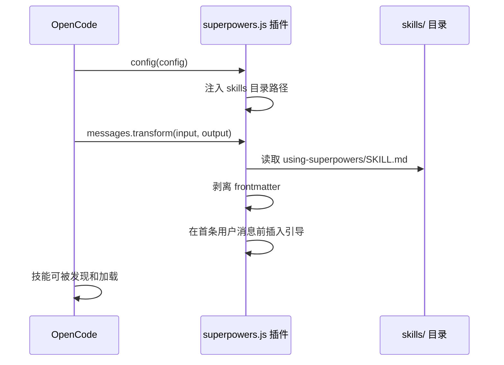

Sources: [opencode/plugins/superpowers.js:30-112](../../../project-repos/superpowers/.opencode/plugins/superpowers.js#L30-L112)

<details class="source-snippets">
<summary>引用源码</summary>

<!-- source-snippets:start -->

#### `opencode/plugins/superpowers.js:30-112`

```javascript
    }
  }

  return { frontmatter, content: body };
};

// Normalize a path: trim whitespace, expand ~, resolve to absolute
const normalizePath = (p, homeDir) => {
  if (!p || typeof p !== 'string') return null;
  let normalized = p.trim();
  if (!normalized) return null;
  if (normalized.startsWith('~/')) {
    normalized = path.join(homeDir, normalized.slice(2));
  } else if (normalized === '~') {
    normalized = homeDir;
  }
  return path.resolve(normalized);
};

export const SuperpowersPlugin = async ({ client, directory }) => {
  const homeDir = os.homedir();
  const superpowersSkillsDir = path.resolve(__dirname, '../../skills');
  const envConfigDir = normalizePath(process.env.OPENCODE_CONFIG_DIR, homeDir);
  const configDir = envConfigDir || path.join(homeDir, '.config/opencode');

  // Helper to generate bootstrap content
  const getBootstrapContent = () => {
    // Try to load using-superpowers skill
    const skillPath = path.join(superpowersSkillsDir, 'using-superpowers', 'SKILL.md');
    if (!fs.existsSync(skillPath)) return null;

    const fullContent = fs.readFileSync(skillPath, 'utf8');
    const { content } = extractAndStripFrontmatter(fullContent);

    const toolMapping = `**Tool Mapping for OpenCode:**
When skills reference tools you don't have, substitute OpenCode equivalents:
- \`TodoWrite\` → \`todowrite\`
- \`Task\` tool with subagents → Use OpenCode's subagent system (@mention)
- \`Skill\` tool → OpenCode's native \`skill\` tool
- \`Read\`, \`Write\`, \`Edit\`, \`Bash\` → Your native tools

Use OpenCode's native \`skill\` tool to list and load skills.`;

    return `<EXTREMELY_IMPORTANT>
You have superpowers.

**IMPORTANT: The using-superpowers skill content is included below. It is ALREADY LOADED - you are currently following it. Do NOT use the skill tool to load "using-superpowers" again - that would be redundant.**

${content}

${toolMapping}
</EXTREMELY_IMPORTANT>`;
  };

  return {
    // Inject skills path into live config so OpenCode discovers superpowers skills
    // without requiring manual symlinks or config file edits.
    // This works because Config.get() returns a cached singleton — modifications
    // here are visible when skills are lazily discovered later.
    config: async (config) => {
      config.skills = config.skills || {};
      config.skills.paths = config.skills.paths || [];
      if (!config.skills.paths.includes(superpowersSkillsDir)) {
        config.skills.paths.push(superpowersSkillsDir);
      }
    },

    // Inject bootstrap into the first user message of each session.
    // Using a user message instead of a system message avoids:
    //   1. Token bloat from system messages repeated every turn (#750)
    //   2. Multiple system messages breaking Qwen and other models (#894)
    'experimental.chat.messages.transform': async (_input, output) => {
      const bootstrap = getBootstrapContent();
      if (!bootstrap || !output.messages.length) return;
      const firstUser = output.messages.find(m => m.info.role === 'user');
      if (!firstUser || !firstUser.parts.length) return;
      // Only inject once
      if (firstUser.parts.some(p => p.type === 'text' && p.text.includes('EXTREMELY_IMPORTANT'))) return;
      const ref = firstUser.parts[0];
      firstUser.parts.unshift({ ...ref, type: 'text', text: bootstrap });
    }
  };
};
```

<!-- source-snippets:end -->
</details>
## 技能发现与加载

`using-superpowers` 技能是整个系统的入口点。它建立了技能使用的核心规则：

### 技能触发规则

1. **1% 规则**：如果有哪怕 1% 的可能性某个技能适用，就必须调用它
2. **前置调用**：在做出任何响应（包括澄清问题）之前调用技能
3. **强制执行**：技能不是建议，而是强制工作流

### 技能优先级

当多个技能可能适用时，按以下顺序处理：

1. **流程技能优先**（brainstorming、debugging）——决定如何接近任务
2. **实施技能其次**（frontend-design、mcp-builder）——指导执行

### 红旗检测

`using-superpowers` 技能包含一个"红旗"表格，列举了代理常见的自我合理化思维，例如：

| 思维 | 现实 |
|------|------|
| "这只是个简单问题" | 问题也是任务，检查技能 |
| "我需要先收集上下文" | 技能检查在澄清问题之前 |
| "这个技能杀鸡用牛刀" | 简单的事会变复杂，用就对了 |
| "我记得这个技能" | 技能会演进，读当前版本 |

Sources: [skills/using-superpowers/SKILL.md:30-117](../../../project-repos/superpowers/skills/using-superpowers/SKILL.md#L30-L117)

<details class="source-snippets">
<summary>引用源码</summary>

<!-- source-snippets:start -->

#### `skills/using-superpowers/SKILL.md:30-117`

````markdown
**In Claude Code:** Use the `Skill` tool. When you invoke a skill, its content is loaded and presented to you—follow it directly. Never use the Read tool on skill files.

**In Copilot CLI:** Use the `skill` tool. Skills are auto-discovered from installed plugins. The `skill` tool works the same as Claude Code's `Skill` tool.

**In Gemini CLI:** Skills activate via the `activate_skill` tool. Gemini loads skill metadata at session start and activates the full content on demand.

**In other environments:** Check your platform's documentation for how skills are loaded.

## Platform Adaptation

Skills use Claude Code tool names. Non-CC platforms: see `references/copilot-tools.md` (Copilot CLI), `references/codex-tools.md` (Codex) for tool equivalents. Gemini CLI users get the tool mapping loaded automatically via GEMINI.md.

# Using Skills

## The Rule

**Invoke relevant or requested skills BEFORE any response or action.** Even a 1% chance a skill might apply means that you should invoke the skill to check. If an invoked skill turns out to be wrong for the situation, you don't need to use it.

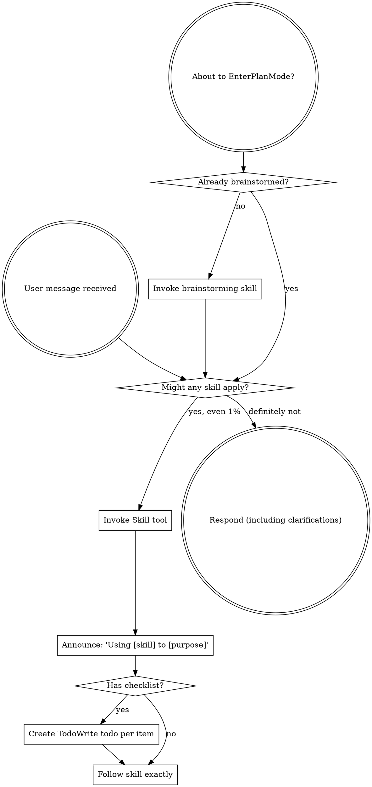

## Red Flags

These thoughts mean STOP—you're rationalizing:

| Thought | Reality |
|---------|---------|
| "This is just a simple question" | Questions are tasks. Check for skills. |
| "I need more context first" | Skill check comes BEFORE clarifying questions. |
| "Let me explore the codebase first" | Skills tell you HOW to explore. Check first. |
| "I can check git/files quickly" | Files lack conversation context. Check for skills. |
| "Let me gather information first" | Skills tell you HOW to gather information. |
| "This doesn't need a formal skill" | If a skill exists, use it. |
| "I remember this skill" | Skills evolve. Read current version. |
| "This doesn't count as a task" | Action = task. Check for skills. |
| "The skill is overkill" | Simple things become complex. Use it. |
| "I'll just do this one thing first" | Check BEFORE doing anything. |
| "This feels productive" | Undisciplined action wastes time. Skills prevent this. |
| "I know what that means" | Knowing the concept ≠ using the skill. Invoke it. |

## Skill Priority

When multiple skills could apply, use this order:

1. **Process skills first** (brainstorming, debugging) - these determine HOW to approach the task
2. **Implementation skills second** (frontend-design, mcp-builder) - these guide execution

"Let's build X" → brainstorming first, then implementation skills.
"Fix this bug" → debugging first, then domain-specific skills.

## Skill Types

**Rigid** (TDD, debugging): Follow exactly. Don't adapt away discipline.

**Flexible** (patterns): Adapt principles to context.

The skill itself tells you which.

## User Instructions

Instructions say WHAT, not HOW. "Add X" or "Fix Y" doesn't mean skip workflows.
````

<!-- source-snippets:end -->
</details>
## 跨平台钩子包装器

`run-hook.cmd` 是一个巧妙的多语言脚本，同时兼容 Windows 批处理和 Unix shell：

- **Windows**：cmd.exe 执行批处理部分，定位 Git Bash 并调用钩子脚本
- **Unix**：shell 将 `: << 'CMDBLOCK'` 视为无操作，直接执行底部的 bash 调用

这种设计解决了 Claude Code 在 Windows 上自动在含 `.sh` 的命令前添加 `bash` 前缀的问题——钩子脚本使用无扩展名（如 `session-start` 而非 `session-start.sh`）来避免此干扰。

Sources: [hooks/run-hook.cmd:1-46](../../../project-repos/superpowers/hooks/run-hook.cmd#L1-L46)

<details class="source-snippets">
<summary>引用源码</summary>

<!-- source-snippets:start -->

#### `hooks/run-hook.cmd:1-46`

```
: << 'CMDBLOCK'
@echo off
REM Cross-platform polyglot wrapper for hook scripts.
REM On Windows: cmd.exe runs the batch portion, which finds and calls bash.
REM On Unix: the shell interprets this as a script (: is a no-op in bash).
REM
REM Hook scripts use extensionless filenames (e.g. "session-start" not
REM "session-start.sh") so Claude Code's Windows auto-detection -- which
REM prepends "bash" to any command containing .sh -- doesn't interfere.
REM
REM Usage: run-hook.cmd <script-name> [args...]

if "%~1"=="" (
    echo run-hook.cmd: missing script name >&2
    exit /b 1
)

set "HOOK_DIR=%~dp0"

REM Try Git for Windows bash in standard locations
if exist "C:\Program Files\Git\bin\bash.exe" (
    "C:\Program Files\Git\bin\bash.exe" "%HOOK_DIR%%~1" %2 %3 %4 %5 %6 %7 %8 %9
    exit /b %ERRORLEVEL%
)
if exist "C:\Program Files (x86)\Git\bin\bash.exe" (
    "C:\Program Files (x86)\Git\bin\bash.exe" "%HOOK_DIR%%~1" %2 %3 %4 %5 %6 %7 %8 %9
    exit /b %ERRORLEVEL%
)

REM Try bash on PATH (e.g. user-installed Git Bash, MSYS2, Cygwin)
where bash >nul 2>nul
if %ERRORLEVEL% equ 0 (
    bash "%HOOK_DIR%%~1" %2 %3 %4 %5 %6 %7 %8 %9
    exit /b %ERRORLEVEL%
)

REM No bash found - exit silently rather than error
REM (plugin still works, just without SessionStart context injection)
exit /b 0
CMDBLOCK

# Unix: run the named script directly
SCRIPT_DIR="$(cd "$(dirname "$0")" && pwd)"
SCRIPT_NAME="$1"
shift
exec bash "${SCRIPT_DIR}/${SCRIPT_NAME}" "$@"
```

<!-- source-snippets:end -->
</details>
## 插件清单结构

每个平台有独立的插件清单文件，定义元数据和技能路径：

| 平台 | 清单文件 | 关键字段 |
|------|----------|----------|
| Claude Code | `.claude-plugin/plugin.json` | name, version, description, keywords |
| Codex | `.codex-plugin/plugin.json` | name, version, skills, interface (displayName, capabilities) |
| Cursor | `.cursor-plugin/plugin.json` | name, version, skills, agents, commands, hooks |
| OpenCode | `.opencode/plugins/superpowers.js` | ES 模块，config + messages.transform |
| Gemini | `gemini-extension.json` | name, description, contextFileName |

Codex 的清单最为详细，包含 `interface` 对象定义显示名称、短描述、长描述、分类、能力列表、默认提示词和品牌颜色。

Sources: [claude-plugin/plugin.json:1-20](../../../project-repos/superpowers/.claude-plugin/plugin.json#L1-L20), [codex-plugin/plugin.json:1-44](../../../project-repos/superpowers/.codex-plugin/plugin.json#L1-L44), [cursor-plugin/plugin.json:1-25](../../../project-repos/superpowers/.cursor-plugin/plugin.json#L1-L25), [gemini-extension.json:1-6](../../../project-repos/superpowers/gemini-extension.json#L1-L6)

<details class="source-snippets">
<summary>引用源码</summary>

<!-- source-snippets:start -->

#### `claude-plugin/plugin.json:1-20`

```json
{
  "name": "superpowers",
  "description": "Core skills library for Claude Code: TDD, debugging, collaboration patterns, and proven techniques",
  "version": "5.0.7",
  "author": {
    "name": "Jesse Vincent",
    "email": "jesse@fsck.com"
  },
  "homepage": "https://github.com/obra/superpowers",
  "repository": "https://github.com/obra/superpowers",
  "license": "MIT",
  "keywords": [
    "skills",
    "tdd",
    "debugging",
    "collaboration",
    "best-practices",
    "workflows"
  ]
}
```

#### `codex-plugin/plugin.json:1-44`

```json
{
  "name": "superpowers",
  "version": "5.0.7",
  "description": "An agentic skills framework & software development methodology that works: planning, TDD, debugging, and collaboration workflows.",
  "author": {
    "name": "Jesse Vincent",
    "email": "jesse@fsck.com",
    "url": "https://github.com/obra"
  },
  "homepage": "https://github.com/obra/superpowers",
  "repository": "https://github.com/obra/superpowers",
  "license": "MIT",
  "keywords": [
    "brainstorming",
    "subagent-driven-development",
    "skills",
    "planning",
    "tdd",
    "debugging",
    "code-review",
    "workflow"
  ],
  "skills": "./skills/",
  "interface": {
    "displayName": "Superpowers",
    "shortDescription": "Planning, TDD, debugging, and delivery workflows for coding agents",
    "longDescription": "Use Superpowers to guide agent work through brainstorming, implementation planning, test-driven development, systematic debugging, parallel execution, code review, and finish-the-branch workflows.",
    "developerName": "Jesse Vincent",
    "category": "Coding",
    "capabilities": [
      "Interactive",
      "Read",
      "Write"
    ],
    "defaultPrompt": [
      "I've got an idea for something I'd like to build.",
      "Let's add a feature to this project."
    ],
    "brandColor": "#F59E0B",
    "composerIcon": "./assets/superpowers-small.svg",
    "logo": "./assets/app-icon.png",
    "screenshots": []
  }
}
```

#### `cursor-plugin/plugin.json:1-25`

```json
{
  "name": "superpowers",
  "displayName": "Superpowers",
  "description": "Core skills library: TDD, debugging, collaboration patterns, and proven techniques",
  "version": "5.0.7",
  "author": {
    "name": "Jesse Vincent",
    "email": "jesse@fsck.com"
  },
  "homepage": "https://github.com/obra/superpowers",
  "repository": "https://github.com/obra/superpowers",
  "license": "MIT",
  "keywords": [
    "skills",
    "tdd",
    "debugging",
    "collaboration",
    "best-practices",
    "workflows"
  ],
  "skills": "./skills/",
  "agents": "./agents/",
  "commands": "./commands/",
  "hooks": "./hooks/hooks-cursor.json"
}
```

#### `gemini-extension.json:1-6`

```json
{
  "name": "superpowers",
  "description": "Core skills library: TDD, debugging, collaboration patterns, and proven techniques",
  "version": "5.0.7",
  "contextFileName": "GEMINI.md"
}
```

<!-- source-snippets:end -->
</details>
## 旧版技能迁移检测

`session-start` 脚本包含向后兼容检测：如果发现旧版技能目录 `~/.config/superpowers/skills` 存在，会输出警告提示用户迁移到 `~/.claude/skills`。这确保了从旧版 Superpowers 升级的用户不会因自定义技能丢失而困惑。

Sources: [hooks/session-start:12-16](../../../project-repos/superpowers/hooks/session-start#L12-L16)

<details class="source-snippets">
<summary>引用源码</summary>

<!-- source-snippets:start -->

#### `hooks/session-start:12-16`

```
legacy_skills_dir="${HOME}/.config/superpowers/skills"
if [ -d "$legacy_skills_dir" ]; then
    warning_message="\n\n<important-reminder>IN YOUR FIRST REPLY AFTER SEEING THIS MESSAGE YOU MUST TELL THE USER:⚠️ **WARNING:** Superpowers now uses Claude Code's skills system. Custom skills in ~/.config/superpowers/skills will not be read. Move custom skills to ~/.claude/skills instead. To make this message go away, remove ~/.config/superpowers/skills</important-reminder>"
fi

```

<!-- source-snippets:end -->
</details>
## 相关页面

- [多平台集成](multi-platform-integration.md)
- [技能体系](skills-system.md)
- [项目概览](overview.md)


---

<details>
<summary>相关源文件</summary>

生成本页时使用的主要源文件：

- [.claude-plugin/plugin.json](https://github.com/obra/superpowers/blob/main/.claude-plugin/plugin.json)
- [.claude-plugin/marketplace.json](https://github.com/obra/superpowers/blob/main/.claude-plugin/marketplace.json)
- [.codex-plugin/plugin.json](https://github.com/obra/superpowers/blob/main/.codex-plugin/plugin.json)
- [.cursor-plugin/plugin.json](https://github.com/obra/superpowers/blob/main/.cursor-plugin/plugin.json)
- [.opencode/plugins/superpowers.js](https://github.com/obra/superpowers/blob/main/.opencode/plugins/superpowers.js)
- [.opencode/INSTALL.md](https://github.com/obra/superpowers/blob/main/.opencode/INSTALL.md)
- [gemini-extension.json](https://github.com/obra/superpowers/blob/main/gemini-extension.json)
- [GEMINI.md](https://github.com/obra/superpowers/blob/main/GEMINI.md)
- [hooks/run-hook.cmd](https://github.com/obra/superpowers/blob/main/hooks/run-hook.cmd)
- [docs/README.codex.md](https://github.com/obra/superpowers/blob/main/docs/README.codex.md)
- [docs/README.opencode.md](https://github.com/obra/superpowers/blob/main/docs/README.opencode.md)

</details>

# 多平台集成

Superpowers 的核心设计目标之一是跨平台兼容——同一套技能可以在 6 个不同的编码代理平台上运行。每个平台有独立的插件清单和集成机制，但共享相同的技能内容和引导逻辑。

## 平台支持矩阵

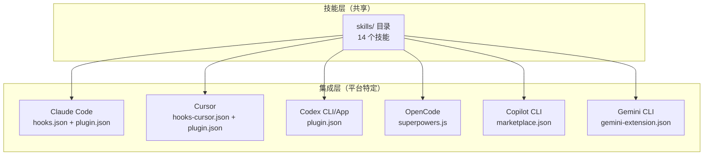

| 平台 | 引导机制 | 技能加载 | 子代理支持 | 安装方式 |
|------|----------|----------|------------|----------|
| Claude Code | SessionStart 钩子 | Skill 工具 | Task 工具 | 官方市场 / Superpowers 市场 |
| Cursor | sessionStart 钩子 | Skill 工具 | Task 工具 | 插件市场 `/add-plugin` |
| Codex CLI | 钩子 | Skill 工具 | 子代理系统 | 插件搜索安装 |
| Codex App | 钩子 | Skill 工具 | 子代理系统 | 侧栏 Plugins |
| OpenCode | messages.transform | 原生 skill 工具 | @mention | INSTALL.md 指引 |
| Copilot CLI | 钩子 | skill 工具 | 子代理 | marketplace |
| Gemini CLI | GEMINI.md 引导 | activate_skill | 有限 | extensions install |

Sources: [README.md:40-80](../../../project-repos/superpowers/README.md#L40-L80), [claude-plugin/plugin.json:1-20](../../../project-repos/superpowers/.claude-plugin/plugin.json#L1-L20), [codex-plugin/plugin.json:1-44](../../../project-repos/superpowers/.codex-plugin/plugin.json#L1-L44), [opencode/plugins/superpowers.js:1-112](../../../project-repos/superpowers/.opencode/plugins/superpowers.js#L1-L112)

<details class="source-snippets">
<summary>引用源码</summary>

<!-- source-snippets:start -->

#### `README.md:40-80`

````markdown

### Claude Code (Superpowers Marketplace)

The Superpowers marketplace provides Superpowers and some other related plugins for Claude Code.

In Claude Code, register the marketplace first:

```bash
/plugin marketplace add obra/superpowers-marketplace
```

Then install the plugin from this marketplace:

```bash
/plugin install superpowers@superpowers-marketplace
```

### OpenAI Codex CLI

- Open plugin search interface

```bash
/plugins
```

Search for Superpowers

```bash
superpowers
```

Select `Install Plugin`

### OpenAI Codex App

- In the Codex app, click on Plugins in the sidebar.
- You should see `Superpowers` in the Coding section. 
- Click the `+` next to Superpowers and follow the prompts.


### Cursor (via Plugin Marketplace)
````

#### `claude-plugin/plugin.json:1-20`

```json
{
  "name": "superpowers",
  "description": "Core skills library for Claude Code: TDD, debugging, collaboration patterns, and proven techniques",
  "version": "5.0.7",
  "author": {
    "name": "Jesse Vincent",
    "email": "jesse@fsck.com"
  },
  "homepage": "https://github.com/obra/superpowers",
  "repository": "https://github.com/obra/superpowers",
  "license": "MIT",
  "keywords": [
    "skills",
    "tdd",
    "debugging",
    "collaboration",
    "best-practices",
    "workflows"
  ]
}
```

#### `codex-plugin/plugin.json:1-44`

```json
{
  "name": "superpowers",
  "version": "5.0.7",
  "description": "An agentic skills framework & software development methodology that works: planning, TDD, debugging, and collaboration workflows.",
  "author": {
    "name": "Jesse Vincent",
    "email": "jesse@fsck.com",
    "url": "https://github.com/obra"
  },
  "homepage": "https://github.com/obra/superpowers",
  "repository": "https://github.com/obra/superpowers",
  "license": "MIT",
  "keywords": [
    "brainstorming",
    "subagent-driven-development",
    "skills",
    "planning",
    "tdd",
    "debugging",
    "code-review",
    "workflow"
  ],
  "skills": "./skills/",
  "interface": {
    "displayName": "Superpowers",
    "shortDescription": "Planning, TDD, debugging, and delivery workflows for coding agents",
    "longDescription": "Use Superpowers to guide agent work through brainstorming, implementation planning, test-driven development, systematic debugging, parallel execution, code review, and finish-the-branch workflows.",
    "developerName": "Jesse Vincent",
    "category": "Coding",
    "capabilities": [
      "Interactive",
      "Read",
      "Write"
    ],
    "defaultPrompt": [
      "I've got an idea for something I'd like to build.",
      "Let's add a feature to this project."
    ],
    "brandColor": "#F59E0B",
    "composerIcon": "./assets/superpowers-small.svg",
    "logo": "./assets/app-icon.png",
    "screenshots": []
  }
}
```

#### `opencode/plugins/superpowers.js:1-112`

```javascript
/**
 * Superpowers plugin for OpenCode.ai
 *
 * Injects superpowers bootstrap context via system prompt transform.
 * Auto-registers skills directory via config hook (no symlinks needed).
 */

import path from 'path';
import fs from 'fs';
import os from 'os';
import { fileURLToPath } from 'url';

const __dirname = path.dirname(fileURLToPath(import.meta.url));

// Simple frontmatter extraction (avoid dependency on skills-core for bootstrap)
const extractAndStripFrontmatter = (content) => {
  const match = content.match(/^---\n([\s\S]*?)\n---\n([\s\S]*)$/);
  if (!match) return { frontmatter: {}, content };

  const frontmatterStr = match[1];
  const body = match[2];
  const frontmatter = {};

  for (const line of frontmatterStr.split('\n')) {
    const colonIdx = line.indexOf(':');
    if (colonIdx > 0) {
      const key = line.slice(0, colonIdx).trim();
      const value = line.slice(colonIdx + 1).trim().replace(/^["']|["']$/g, '');
      frontmatter[key] = value;
    }
  }

  return { frontmatter, content: body };
};

// Normalize a path: trim whitespace, expand ~, resolve to absolute
const normalizePath = (p, homeDir) => {
  if (!p || typeof p !== 'string') return null;
  let normalized = p.trim();
  if (!normalized) return null;
  if (normalized.startsWith('~/')) {
    normalized = path.join(homeDir, normalized.slice(2));
  } else if (normalized === '~') {
    normalized = homeDir;
  }
  return path.resolve(normalized);
};

export const SuperpowersPlugin = async ({ client, directory }) => {
  const homeDir = os.homedir();
  const superpowersSkillsDir = path.resolve(__dirname, '../../skills');
  const envConfigDir = normalizePath(process.env.OPENCODE_CONFIG_DIR, homeDir);
  const configDir = envConfigDir || path.join(homeDir, '.config/opencode');

  // Helper to generate bootstrap content
  const getBootstrapContent = () => {
    // Try to load using-superpowers skill
    const skillPath = path.join(superpowersSkillsDir, 'using-superpowers', 'SKILL.md');
    if (!fs.existsSync(skillPath)) return null;

    const fullContent = fs.readFileSync(skillPath, 'utf8');
    const { content } = extractAndStripFrontmatter(fullContent);

    const toolMapping = `**Tool Mapping for OpenCode:**
When skills reference tools you don't have, substitute OpenCode equivalents:
- \`TodoWrite\` → \`todowrite\`
- \`Task\` tool with subagents → Use OpenCode's subagent system (@mention)
- \`Skill\` tool → OpenCode's native \`skill\` tool
- \`Read\`, \`Write\`, \`Edit\`, \`Bash\` → Your native tools

Use OpenCode's native \`skill\` tool to list and load skills.`;

    return `<EXTREMELY_IMPORTANT>
You have superpowers.

**IMPORTANT: The using-superpowers skill content is included below. It is ALREADY LOADED - you are currently following it. Do NOT use the skill tool to load "using-superpowers" again - that would be redundant.**

${content}

${toolMapping}
</EXTREMELY_IMPORTANT>`;
  };

  return {
    // Inject skills path into live config so OpenCode discovers superpowers skills
    // without requiring manual symlinks or config file edits.
    // This works because Config.get() returns a cached singleton — modifications
    // here are visible when skills are lazily discovered later.
    config: async (config) => {
      config.skills = config.skills || {};
      config.skills.paths = config.skills.paths || [];
      if (!config.skills.paths.includes(superpowersSkillsDir)) {
        config.skills.paths.push(superpowersSkillsDir);
      }
    },

    // Inject bootstrap into the first user message of each session.
    // Using a user message instead of a system message avoids:
    //   1. Token bloat from system messages repeated every turn (#750)
    //   2. Multiple system messages breaking Qwen and other models (#894)
    'experimental.chat.messages.transform': async (_input, output) => {
      const bootstrap = getBootstrapContent();
      if (!bootstrap || !output.messages.length) return;
      const firstUser = output.messages.find(m => m.info.role === 'user');
      if (!firstUser || !firstUser.parts.length) return;
      // Only inject once
      if (firstUser.parts.some(p => p.type === 'text' && p.text.includes('EXTREMELY_IMPORTANT'))) return;
      const ref = firstUser.parts[0];
      firstUser.parts.unshift({ ...ref, type: 'text', text: bootstrap });
    }
  };
};
```

<!-- source-snippets:end -->
</details>
## Claude Code 集成

Claude Code 是 Superpowers 的主要目标平台，拥有最完整的集成支持。

### 安装

两种市场安装方式：

```bash
# 方式一：Anthropic 官方市场
/plugin install superpowers@claude-plugins-official

# 方式二：Superpowers 市场（需先注册）
/plugin marketplace add obra/superpowers-marketplace
/plugin install superpowers@superpowers-marketplace
```

### 引导流程

Claude Code 通过 `hooks.json` 注册 SessionStart 钩子，匹配 `startup|clear|compact` 事件。钩子执行 `session-start` 脚本，将 `using-superpowers` 技能内容注入 `hookSpecificOutput.additionalContext`。

Claude Code 同时读取 `additional_context` 和 `hookSpecificOutput` 且不进行去重，因此脚本必须只输出当前平台消费的字段格式，避免重复注入。

Sources: [hooks/hooks.json:1-16](../../../project-repos/superpowers/hooks/hooks.json#L1-L16), [hooks/session-start:42-57](../../../project-repos/superpowers/hooks/session-start#L42-L57)

<details class="source-snippets">
<summary>引用源码</summary>

<!-- source-snippets:start -->

#### `hooks/hooks.json:1-16`

```json
{
  "hooks": {
    "SessionStart": [
      {
        "matcher": "startup|clear|compact",
        "hooks": [
          {
            "type": "command",
            "command": "\"${CLAUDE_PLUGIN_ROOT}/hooks/run-hook.cmd\" session-start",
            "async": false
          }
        ]
      }
    ]
  }
}
```

#### `hooks/session-start:42-57`

```
# deduplication, so we must emit only the field the current platform consumes.
#
# Uses printf instead of heredoc to work around bash 5.3+ heredoc hang.
# See: https://github.com/obra/superpowers/issues/571
if [ -n "${CURSOR_PLUGIN_ROOT:-}" ]; then
  # Cursor sets CURSOR_PLUGIN_ROOT (may also set CLAUDE_PLUGIN_ROOT)
  printf '{\n  "additional_context": "%s"\n}\n' "$session_context"
elif [ -n "${CLAUDE_PLUGIN_ROOT:-}" ] && [ -z "${COPILOT_CLI:-}" ]; then
  # Claude Code sets CLAUDE_PLUGIN_ROOT without COPILOT_CLI
  printf '{\n  "hookSpecificOutput": {\n    "hookEventName": "SessionStart",\n    "additionalContext": "%s"\n  }\n}\n' "$session_context"
else
  # Copilot CLI (sets COPILOT_CLI=1) or unknown platform — SDK standard format
  printf '{\n  "additionalContext": "%s"\n}\n' "$session_context"
fi

exit 0
```

<!-- source-snippets:end -->
</details>
## Cursor 集成

Cursor 使用 `hooks-cursor.json`（v1 格式）注册 `sessionStart` 钩子。与 Claude Code 的区别：

- 钩子格式为 v1 版本，使用 `sessionStart`（驼峰）而非 `SessionStart`
- 上下文注入使用 `additional_context`（蛇形命名）而非嵌套结构
- 通过 `CURSOR_PLUGIN_ROOT` 环境变量检测平台

安装方式：在 Cursor Agent 聊天中执行 `/add-plugin superpowers` 或在插件市场搜索。

Sources: [hooks/hooks-cursor.json:1-10](../../../project-repos/superpowers/hooks/hooks-cursor.json#L1-L10), [hooks/session-start:42-50](../../../project-repos/superpowers/hooks/session-start#L42-L50)

<details class="source-snippets">
<summary>引用源码</summary>

<!-- source-snippets:start -->

#### `hooks/hooks-cursor.json:1-10`

```json
{
  "version": 1,
  "hooks": {
    "sessionStart": [
      {
        "command": "./hooks/session-start"
      }
    ]
  }
}
```

#### `hooks/session-start:42-50`

```
# deduplication, so we must emit only the field the current platform consumes.
#
# Uses printf instead of heredoc to work around bash 5.3+ heredoc hang.
# See: https://github.com/obra/superpowers/issues/571
if [ -n "${CURSOR_PLUGIN_ROOT:-}" ]; then
  # Cursor sets CURSOR_PLUGIN_ROOT (may also set CLAUDE_PLUGIN_ROOT)
  printf '{\n  "additional_context": "%s"\n}\n' "$session_context"
elif [ -n "${CLAUDE_PLUGIN_ROOT:-}" ] && [ -z "${COPILOT_CLI:-}" ]; then
  # Claude Code sets CLAUDE_PLUGIN_ROOT without COPILOT_CLI
```

<!-- source-snippets:end -->
</details>
## Codex 集成

Codex 有两种形态——CLI 和 App，共享相同的 `.codex-plugin/plugin.json` 清单。

Codex 的清单最为详细，包含：
- `interface.displayName`：显示名称 "Superpowers"
- `interface.shortDescription` / `longDescription`：短/长描述
- `interface.capabilities`：`["Interactive", "Read", "Write"]`
- `interface.defaultPrompt`：默认提示词建议
- `interface.brandColor`：品牌色 `#F59E0B`
- `skills`：指向 `./skills/` 目录

安装方式：CLI 中使用 `/plugins` 搜索 "superpowers" 安装；App 中在侧栏 Plugins 的 Coding 分类点击 `+` 安装。

Sources: [codex-plugin/plugin.json:1-44](../../../project-repos/superpowers/.codex-plugin/plugin.json#L1-L44), [docs/README.codex.md](../../../project-repos/superpowers/docs/README.codex.md)

<details class="source-snippets">
<summary>引用源码</summary>

<!-- source-snippets:start -->

#### `codex-plugin/plugin.json:1-44`

```json
{
  "name": "superpowers",
  "version": "5.0.7",
  "description": "An agentic skills framework & software development methodology that works: planning, TDD, debugging, and collaboration workflows.",
  "author": {
    "name": "Jesse Vincent",
    "email": "jesse@fsck.com",
    "url": "https://github.com/obra"
  },
  "homepage": "https://github.com/obra/superpowers",
  "repository": "https://github.com/obra/superpowers",
  "license": "MIT",
  "keywords": [
    "brainstorming",
    "subagent-driven-development",
    "skills",
    "planning",
    "tdd",
    "debugging",
    "code-review",
    "workflow"
  ],
  "skills": "./skills/",
  "interface": {
    "displayName": "Superpowers",
    "shortDescription": "Planning, TDD, debugging, and delivery workflows for coding agents",
    "longDescription": "Use Superpowers to guide agent work through brainstorming, implementation planning, test-driven development, systematic debugging, parallel execution, code review, and finish-the-branch workflows.",
    "developerName": "Jesse Vincent",
    "category": "Coding",
    "capabilities": [
      "Interactive",
      "Read",
      "Write"
    ],
    "defaultPrompt": [
      "I've got an idea for something I'd like to build.",
      "Let's add a feature to this project."
    ],
    "brandColor": "#F59E0B",
    "composerIcon": "./assets/superpowers-small.svg",
    "logo": "./assets/app-icon.png",
    "screenshots": []
  }
}
```

#### `docs/README.codex.md`

````markdown
# Superpowers for Codex

Guide for using Superpowers with OpenAI Codex via native skill discovery.

## Quick Install

Tell Codex:

```
Fetch and follow instructions from https://raw.githubusercontent.com/obra/superpowers/refs/heads/main/.codex/INSTALL.md
```

## Manual Installation

### Prerequisites

- OpenAI Codex CLI
- Git

### Steps

1. Clone the repo:
   ```bash
   git clone https://github.com/obra/superpowers.git ~/.codex/superpowers
   ```

2. Create the skills symlink:
   ```bash
   mkdir -p ~/.agents/skills
   ln -s ~/.codex/superpowers/skills ~/.agents/skills/superpowers
   ```

3. Restart Codex.

4. **For subagent skills** (optional): Skills like `dispatching-parallel-agents` and `subagent-driven-development` require Codex's multi-agent feature. Add to your Codex config:
   ```toml
   [features]
   multi_agent = true
   ```

### Windows

Use a junction instead of a symlink (works without Developer Mode):

```powershell
New-Item -ItemType Directory -Force -Path "$env:USERPROFILE\.agents\skills"
cmd /c mklink /J "$env:USERPROFILE\.agents\skills\superpowers" "$env:USERPROFILE\.codex\superpowers\skills"
```

## How It Works

Codex has native skill discovery — it scans `~/.agents/skills/` at startup, parses SKILL.md frontmatter, and loads skills on demand. Superpowers skills are made visible through a single symlink:

```
~/.agents/skills/superpowers/ → ~/.codex/superpowers/skills/
```

The `using-superpowers` skill is discovered automatically and enforces skill usage discipline — no additional configuration needed.

## Usage

Skills are discovered automatically. Codex activates them when:
- You mention a skill by name (e.g., "use brainstorming")
- The task matches a skill's description
- The `using-superpowers` skill directs Codex to use one

### Personal Skills

Create your own skills in `~/.agents/skills/`:

```bash
mkdir -p ~/.agents/skills/my-skill
```

Create `~/.agents/skills/my-skill/SKILL.md`:

```markdown
---
name: my-skill
description: Use when [condition] - [what it does]
---

# My Skill

[Your skill content here]
```

The `description` field is how Codex decides when to activate a skill automatically — write it as a clear trigger condition.

## Updating

```bash
cd ~/.codex/superpowers && git pull
```

Skills update instantly through the symlink.

## Uninstalling

```bash
rm ~/.agents/skills/superpowers
```

**Windows (PowerShell):**
```powershell
Remove-Item "$env:USERPROFILE\.agents\skills\superpowers"
```

Optionally delete the clone: `rm -rf ~/.codex/superpowers` (Windows: `Remove-Item -Recurse -Force "$env:USERPROFILE\.codex\superpowers"`).

## Troubleshooting

### Skills not showing up

1. Verify the symlink: `ls -la ~/.agents/skills/superpowers`
2. Check skills exist: `ls ~/.codex/superpowers/skills`
3. Restart Codex — skills are discovered at startup

### Windows junction issues

````

<!-- source-snippets:end -->
</details>
## OpenCode 集成

OpenCode 使用完全不同的集成架构——一个 ES 模块插件而非钩子脚本。

### 插件架构

`superpowers.js` 导出 `SuperpowersPlugin` 异步函数，返回两个钩子：

1. **`config` 钩子**：将技能目录路径追加到 `config.skills.paths`，使 OpenCode 延迟发现技能
2. **`messages.transform` 钩子**：在首条用户消息前插入引导上下文

### 关键设计决策

- **使用用户消息而非系统消息**：避免系统消息每轮重复导致的 token 膨胀（#750），以及多条系统消息破坏 Qwen 等模型的问题（#894）
- **frontmatter 剥离**：插件自行实现简单的 frontmatter 解析，不依赖 skills-core
- **工具映射**：为 OpenCode 提供工具名称映射表（`TodoWrite` → `todowrite`，`Skill` → `skill` 等）
- **一次性注入**：检测消息中是否已包含 `EXTREMELY_IMPORTANT`，避免重复注入

### 安装

```text
Fetch and follow instructions from https://raw.githubusercontent.com/obra/superpowers/refs/heads/main/.opencode/INSTALL.md
```

Sources: [opencode/plugins/superpowers.js:1-112](../../../project-repos/superpowers/.opencode/plugins/superpowers.js#L1-L112), [opencode/INSTALL.md](../../../project-repos/superpowers/.opencode/INSTALL.md), [docs/README.opencode.md](../../../project-repos/superpowers/docs/README.opencode.md)

<details class="source-snippets">
<summary>引用源码</summary>

<!-- source-snippets:start -->

#### `opencode/plugins/superpowers.js:1-112`

```javascript
/**
 * Superpowers plugin for OpenCode.ai
 *
 * Injects superpowers bootstrap context via system prompt transform.
 * Auto-registers skills directory via config hook (no symlinks needed).
 */

import path from 'path';
import fs from 'fs';
import os from 'os';
import { fileURLToPath } from 'url';

const __dirname = path.dirname(fileURLToPath(import.meta.url));

// Simple frontmatter extraction (avoid dependency on skills-core for bootstrap)
const extractAndStripFrontmatter = (content) => {
  const match = content.match(/^---\n([\s\S]*?)\n---\n([\s\S]*)$/);
  if (!match) return { frontmatter: {}, content };

  const frontmatterStr = match[1];
  const body = match[2];
  const frontmatter = {};

  for (const line of frontmatterStr.split('\n')) {
    const colonIdx = line.indexOf(':');
    if (colonIdx > 0) {
      const key = line.slice(0, colonIdx).trim();
      const value = line.slice(colonIdx + 1).trim().replace(/^["']|["']$/g, '');
      frontmatter[key] = value;
    }
  }

  return { frontmatter, content: body };
};

// Normalize a path: trim whitespace, expand ~, resolve to absolute
const normalizePath = (p, homeDir) => {
  if (!p || typeof p !== 'string') return null;
  let normalized = p.trim();
  if (!normalized) return null;
  if (normalized.startsWith('~/')) {
    normalized = path.join(homeDir, normalized.slice(2));
  } else if (normalized === '~') {
    normalized = homeDir;
  }
  return path.resolve(normalized);
};

export const SuperpowersPlugin = async ({ client, directory }) => {
  const homeDir = os.homedir();
  const superpowersSkillsDir = path.resolve(__dirname, '../../skills');
  const envConfigDir = normalizePath(process.env.OPENCODE_CONFIG_DIR, homeDir);
  const configDir = envConfigDir || path.join(homeDir, '.config/opencode');

  // Helper to generate bootstrap content
  const getBootstrapContent = () => {
    // Try to load using-superpowers skill
    const skillPath = path.join(superpowersSkillsDir, 'using-superpowers', 'SKILL.md');
    if (!fs.existsSync(skillPath)) return null;

    const fullContent = fs.readFileSync(skillPath, 'utf8');
    const { content } = extractAndStripFrontmatter(fullContent);

    const toolMapping = `**Tool Mapping for OpenCode:**
When skills reference tools you don't have, substitute OpenCode equivalents:
- \`TodoWrite\` → \`todowrite\`
- \`Task\` tool with subagents → Use OpenCode's subagent system (@mention)
- \`Skill\` tool → OpenCode's native \`skill\` tool
- \`Read\`, \`Write\`, \`Edit\`, \`Bash\` → Your native tools

Use OpenCode's native \`skill\` tool to list and load skills.`;

    return `<EXTREMELY_IMPORTANT>
You have superpowers.

**IMPORTANT: The using-superpowers skill content is included below. It is ALREADY LOADED - you are currently following it. Do NOT use the skill tool to load "using-superpowers" again - that would be redundant.**

${content}

${toolMapping}
</EXTREMELY_IMPORTANT>`;
  };

  return {
    // Inject skills path into live config so OpenCode discovers superpowers skills
    // without requiring manual symlinks or config file edits.
    // This works because Config.get() returns a cached singleton — modifications
    // here are visible when skills are lazily discovered later.
    config: async (config) => {
      config.skills = config.skills || {};
      config.skills.paths = config.skills.paths || [];
      if (!config.skills.paths.includes(superpowersSkillsDir)) {
        config.skills.paths.push(superpowersSkillsDir);
      }
    },

    // Inject bootstrap into the first user message of each session.
    // Using a user message instead of a system message avoids:
    //   1. Token bloat from system messages repeated every turn (#750)
    //   2. Multiple system messages breaking Qwen and other models (#894)
    'experimental.chat.messages.transform': async (_input, output) => {
      const bootstrap = getBootstrapContent();
      if (!bootstrap || !output.messages.length) return;
      const firstUser = output.messages.find(m => m.info.role === 'user');
      if (!firstUser || !firstUser.parts.length) return;
      // Only inject once
      if (firstUser.parts.some(p => p.type === 'text' && p.text.includes('EXTREMELY_IMPORTANT'))) return;
      const ref = firstUser.parts[0];
      firstUser.parts.unshift({ ...ref, type: 'text', text: bootstrap });
    }
  };
};
```

#### `opencode/INSTALL.md`

````markdown
# Installing Superpowers for OpenCode

## Prerequisites

- [OpenCode.ai](https://opencode.ai) installed

## Installation

Add superpowers to the `plugin` array in your `opencode.json` (global or project-level):

```json
{
  "plugin": ["superpowers@git+https://github.com/obra/superpowers.git"]
}
```

Restart OpenCode. That's it — the plugin auto-installs and registers all skills.

Verify by asking: "Tell me about your superpowers"

## Migrating from the old symlink-based install

If you previously installed superpowers using `git clone` and symlinks, remove the old setup:

```bash
# Remove old symlinks
rm -f ~/.config/opencode/plugins/superpowers.js
rm -rf ~/.config/opencode/skills/superpowers

# Optionally remove the cloned repo
rm -rf ~/.config/opencode/superpowers

# Remove skills.paths from opencode.json if you added one for superpowers
```

Then follow the installation steps above.

## Usage

Use OpenCode's native `skill` tool:

```
use skill tool to list skills
use skill tool to load superpowers/brainstorming
```

## Updating

Superpowers updates automatically when you restart OpenCode.

To pin a specific version:

```json
{
  "plugin": ["superpowers@git+https://github.com/obra/superpowers.git#v5.0.3"]
}
```

## Troubleshooting

### Plugin not loading

1. Check logs: `opencode run --print-logs "hello" 2>&1 | grep -i superpowers`
2. Verify the plugin line in your `opencode.json`
3. Make sure you're running a recent version of OpenCode

### Skills not found

1. Use `skill` tool to list what's discovered
2. Check that the plugin is loading (see above)

### Tool mapping

When skills reference Claude Code tools:
- `TodoWrite` → `todowrite`
- `Task` with subagents → `@mention` syntax
- `Skill` tool → OpenCode's native `skill` tool
- File operations → your native tools

## Getting Help

- Report issues: https://github.com/obra/superpowers/issues
- Full documentation: https://github.com/obra/superpowers/blob/main/docs/README.opencode.md
````

#### `docs/README.opencode.md`

````markdown
# Superpowers for OpenCode

Complete guide for using Superpowers with [OpenCode.ai](https://opencode.ai).

## Installation

Add superpowers to the `plugin` array in your `opencode.json` (global or project-level):

```json
{
  "plugin": ["superpowers@git+https://github.com/obra/superpowers.git"]
}
```

Restart OpenCode. The plugin auto-installs via Bun and registers all skills automatically.

Verify by asking: "Tell me about your superpowers"

### Migrating from the old symlink-based install

If you previously installed superpowers using `git clone` and symlinks, remove the old setup:

```bash
# Remove old symlinks
rm -f ~/.config/opencode/plugins/superpowers.js
rm -rf ~/.config/opencode/skills/superpowers

# Optionally remove the cloned repo
rm -rf ~/.config/opencode/superpowers

# Remove skills.paths from opencode.json if you added one for superpowers
```

Then follow the installation steps above.

## Usage

### Finding Skills

Use OpenCode's native `skill` tool to list all available skills:

```
use skill tool to list skills
```

### Loading a Skill

```
use skill tool to load superpowers/brainstorming
```

### Personal Skills

Create your own skills in `~/.config/opencode/skills/`:

```bash
mkdir -p ~/.config/opencode/skills/my-skill
```

Create `~/.config/opencode/skills/my-skill/SKILL.md`:

```markdown
---
name: my-skill
description: Use when [condition] - [what it does]
---

# My Skill

[Your skill content here]
```

### Project Skills

Create project-specific skills in `.opencode/skills/` within your project.

**Skill Priority:** Project skills > Personal skills > Superpowers skills

## Updating

Superpowers updates automatically when you restart OpenCode. The plugin is re-installed from the git repository on each launch.

To pin a specific version, use a branch or tag:

```json
{
  "plugin": ["superpowers@git+https://github.com/obra/superpowers.git#v5.0.3"]
}
```

## How It Works

The plugin does two things:

1. **Injects bootstrap context** via the `experimental.chat.system.transform` hook, adding superpowers awareness to every conversation.
2. **Registers the skills directory** via the `config` hook, so OpenCode discovers all superpowers skills without symlinks or manual config.

### Tool Mapping

Skills written for Claude Code are automatically adapted for OpenCode:

- `TodoWrite` → `todowrite`
- `Task` with subagents → OpenCode's `@mention` system
- `Skill` tool → OpenCode's native `skill` tool
- File operations → Native OpenCode tools

## Troubleshooting

### Plugin not loading

1. Check OpenCode logs: `opencode run --print-logs "hello" 2>&1 | grep -i superpowers`
2. Verify the plugin line in your `opencode.json` is correct
3. Make sure you're running a recent version of OpenCode

### Skills not found

1. Use OpenCode's `skill` tool to list available skills
2. Check that the plugin is loading (see above)
3. Each skill needs a `SKILL.md` file with valid YAML frontmatter

````

<!-- source-snippets:end -->
</details>
## Gemini CLI 集成

Gemini CLI 使用最简的集成方式——一个 `gemini-extension.json` 指定 `contextFileName: "GEMINI.md"`。

`GEMINI.md` 文件只有两行，使用 `@` 语法引用技能文件：

```markdown
@./skills/using-superpowers/SKILL.md
@./skills/using-superpowers/references/gemini-tools.md
```

Gemini 在会话启动时自动加载这些文件作为上下文。技能通过 `activate_skill` 工具按需激活。

安装和更新：

```bash
gemini extensions install https://github.com/obra/superpowers
gemini extensions update superpowers
```

Sources: [gemini-extension.json:1-6](../../../project-repos/superpowers/gemini-extension.json#L1-L6), [GEMINI.md:1-2](../../../project-repos/superpowers/GEMINI.md#L1-L2)

<details class="source-snippets">
<summary>引用源码</summary>

<!-- source-snippets:start -->

#### `gemini-extension.json:1-6`

```json
{
  "name": "superpowers",
  "description": "Core skills library: TDD, debugging, collaboration patterns, and proven techniques",
  "version": "5.0.7",
  "contextFileName": "GEMINI.md"
}
```

#### `GEMINI.md:1-2`

```markdown
@./skills/using-superpowers/SKILL.md
@./skills/using-superpowers/references/gemini-tools.md
```

<!-- source-snippets:end -->
</details>
## 跨平台兼容性设计

### 钩子脚本的多平台输出

`session-start` 脚本通过环境变量检测当前平台，输出不同格式的 JSON：

```bash
if [ -n "${CURSOR_PLUGIN_ROOT:-}" ]; then
  # Cursor: additional_context
elif [ -n "${CLAUDE_PLUGIN_ROOT:-}" ] && [ -z "${COPILOT_CLI:-}" ]; then
  # Claude Code: hookSpecificOutput.additionalContext
else
  # Copilot CLI / 其他: additionalContext
fi
```

### Windows 兼容

`run-hook.cmd` 是一个多语言脚本，同时作为 Windows 批处理文件和 Unix shell 脚本运行。它按优先级搜索 Git Bash：

1. `C:\Program Files\Git\bin\bash.exe`
2. `C:\Program Files (x86)\Git\bin\bash.exe`
3. PATH 中的 `bash`

如果找不到 bash，静默退出而非报错——插件仍可工作，只是没有 SessionStart 上下文注入。

Sources: [hooks/session-start:42-57](../../../project-repos/superpowers/hooks/session-start#L42-L57), [hooks/run-hook.cmd:1-46](../../../project-repos/superpowers/hooks/run-hook.cmd#L1-L46)

<details class="source-snippets">
<summary>引用源码</summary>

<!-- source-snippets:start -->

#### `hooks/session-start:42-57`

```
# deduplication, so we must emit only the field the current platform consumes.
#
# Uses printf instead of heredoc to work around bash 5.3+ heredoc hang.
# See: https://github.com/obra/superpowers/issues/571
if [ -n "${CURSOR_PLUGIN_ROOT:-}" ]; then
  # Cursor sets CURSOR_PLUGIN_ROOT (may also set CLAUDE_PLUGIN_ROOT)
  printf '{\n  "additional_context": "%s"\n}\n' "$session_context"
elif [ -n "${CLAUDE_PLUGIN_ROOT:-}" ] && [ -z "${COPILOT_CLI:-}" ]; then
  # Claude Code sets CLAUDE_PLUGIN_ROOT without COPILOT_CLI
  printf '{\n  "hookSpecificOutput": {\n    "hookEventName": "SessionStart",\n    "additionalContext": "%s"\n  }\n}\n' "$session_context"
else
  # Copilot CLI (sets COPILOT_CLI=1) or unknown platform — SDK standard format
  printf '{\n  "additionalContext": "%s"\n}\n' "$session_context"
fi

exit 0
```

#### `hooks/run-hook.cmd:1-46`

```
: << 'CMDBLOCK'
@echo off
REM Cross-platform polyglot wrapper for hook scripts.
REM On Windows: cmd.exe runs the batch portion, which finds and calls bash.
REM On Unix: the shell interprets this as a script (: is a no-op in bash).
REM
REM Hook scripts use extensionless filenames (e.g. "session-start" not
REM "session-start.sh") so Claude Code's Windows auto-detection -- which
REM prepends "bash" to any command containing .sh -- doesn't interfere.
REM
REM Usage: run-hook.cmd <script-name> [args...]

if "%~1"=="" (
    echo run-hook.cmd: missing script name >&2
    exit /b 1
)

set "HOOK_DIR=%~dp0"

REM Try Git for Windows bash in standard locations
if exist "C:\Program Files\Git\bin\bash.exe" (
    "C:\Program Files\Git\bin\bash.exe" "%HOOK_DIR%%~1" %2 %3 %4 %5 %6 %7 %8 %9
    exit /b %ERRORLEVEL%
)
if exist "C:\Program Files (x86)\Git\bin\bash.exe" (
    "C:\Program Files (x86)\Git\bin\bash.exe" "%HOOK_DIR%%~1" %2 %3 %4 %5 %6 %7 %8 %9
    exit /b %ERRORLEVEL%
)

REM Try bash on PATH (e.g. user-installed Git Bash, MSYS2, Cygwin)
where bash >nul 2>nul
if %ERRORLEVEL% equ 0 (
    bash "%HOOK_DIR%%~1" %2 %3 %4 %5 %6 %7 %8 %9
    exit /b %ERRORLEVEL%
)

REM No bash found - exit silently rather than error
REM (plugin still works, just without SessionStart context injection)
exit /b 0
CMDBLOCK

# Unix: run the named script directly
SCRIPT_DIR="$(cd "$(dirname "$0")" && pwd)"
SCRIPT_NAME="$1"
shift
exec bash "${SCRIPT_DIR}/${SCRIPT_NAME}" "$@"
```

<!-- source-snippets:end -->
</details>
## 相关页面

- [系统架构](system-architecture.md)
- [项目概览](overview.md)


---

<details>
<summary>相关源文件</summary>

生成本页时使用的主要源文件：

- [skills/brainstorming/SKILL.md](https://github.com/obra/superpowers/blob/main/skills/brainstorming/SKILL.md)
- [skills/writing-plans/SKILL.md](https://github.com/obra/superpowers/blob/main/skills/writing-plans/SKILL.md)
- [skills/executing-plans/SKILL.md](https://github.com/obra/superpowers/blob/main/skills/executing-plans/SKILL.md)
- [skills/using-git-worktrees/SKILL.md](https://github.com/obra/superpowers/blob/main/skills/using-git-worktrees/SKILL.md)
- [skills/requesting-code-review/SKILL.md](https://github.com/obra/superpowers/blob/main/skills/requesting-code-review/SKILL.md)
- [skills/receiving-code-review/SKILL.md](https://github.com/obra/superpowers/blob/main/skills/receiving-code-review/SKILL.md)
- [skills/finishing-a-development-branch/SKILL.md](https://github.com/obra/superpowers/blob/main/skills/finishing-a-development-branch/SKILL.md)
- [skills/verification-before-completion/SKILL.md](https://github.com/obra/superpowers/blob/main/skills/verification-before-completion/SKILL.md)

</details>

# 核心工作流

Superpowers 定义了一条从需求到交付的完整工作流管线。每个阶段由一个或多个技能驱动，阶段之间有明确的门控条件——未获用户审批不能进入下一阶段。

## 全流程概览

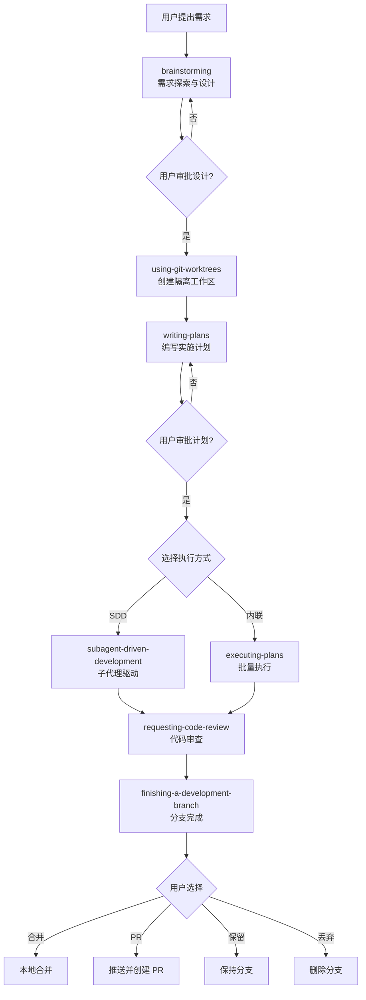

Sources: [README.md:82-128](../../../project-repos/superpowers/README.md#L82-L128), [skills/brainstorming/SKILL.md:1-20](../../../project-repos/superpowers/skills/brainstorming/SKILL.md#L1-L20), [skills/writing-plans/SKILL.md:1-20](../../../project-repos/superpowers/skills/writing-plans/SKILL.md#L1-L20)

<details class="source-snippets">
<summary>引用源码</summary>

<!-- source-snippets:start -->

#### `README.md:82-128`

````markdown
In Cursor Agent chat, install from marketplace:

```text
/add-plugin superpowers
```

or search for "superpowers" in the plugin marketplace.

### OpenCode

Tell OpenCode:

```
Fetch and follow instructions from https://raw.githubusercontent.com/obra/superpowers/refs/heads/main/.opencode/INSTALL.md
```

**Detailed docs:** [docs/README.opencode.md](docs/README.opencode.md)

### GitHub Copilot CLI

```bash
copilot plugin marketplace add obra/superpowers-marketplace
copilot plugin install superpowers@superpowers-marketplace
```

### Gemini CLI

```bash
gemini extensions install https://github.com/obra/superpowers
```

To update:

```bash
gemini extensions update superpowers
```

## The Basic Workflow

1. **brainstorming** - Activates before writing code. Refines rough ideas through questions, explores alternatives, presents design in sections for validation. Saves design document.

2. **using-git-worktrees** - Activates after design approval. Creates isolated workspace on new branch, runs project setup, verifies clean test baseline.

3. **writing-plans** - Activates with approved design. Breaks work into bite-sized tasks (2-5 minutes each). Every task has exact file paths, complete code, verification steps.

4. **subagent-driven-development** or **executing-plans** - Activates with plan. Dispatches fresh subagent per task with two-stage review (spec compliance, then code quality), or executes in batches with human checkpoints.

````

#### `skills/brainstorming/SKILL.md:1-20`

```markdown
---
name: brainstorming
description: "You MUST use this before any creative work - creating features, building components, adding functionality, or modifying behavior. Explores user intent, requirements and design before implementation."
---

# Brainstorming Ideas Into Designs

Help turn ideas into fully formed designs and specs through natural collaborative dialogue.

Start by understanding the current project context, then ask questions one at a time to refine the idea. Once you understand what you're building, present the design and get user approval.

<HARD-GATE>
Do NOT invoke any implementation skill, write any code, scaffold any project, or take any implementation action until you have presented a design and the user has approved it. This applies to EVERY project regardless of perceived simplicity.
</HARD-GATE>

## Anti-Pattern: "This Is Too Simple To Need A Design"

Every project goes through this process. A todo list, a single-function utility, a config change — all of them. "Simple" projects are where unexamined assumptions cause the most wasted work. The design can be short (a few sentences for truly simple projects), but you MUST present it and get approval.

## Checklist
```

#### `skills/writing-plans/SKILL.md:1-20`

```markdown
---
name: writing-plans
description: Use when you have a spec or requirements for a multi-step task, before touching code
---

# Writing Plans

## Overview

Write comprehensive implementation plans assuming the engineer has zero context for our codebase and questionable taste. Document everything they need to know: which files to touch for each task, code, testing, docs they might need to check, how to test it. Give them the whole plan as bite-sized tasks. DRY. YAGNI. TDD. Frequent commits.

Assume they are a skilled developer, but know almost nothing about our toolset or problem domain. Assume they don't know good test design very well.

**Announce at start:** "I'm using the writing-plans skill to create the implementation plan."

**Context:** This should be run in a dedicated worktree (created by brainstorming skill).

**Save plans to:** `docs/superpowers/plans/YYYY-MM-DD-<feature-name>.md`
- (User preferences for plan location override this default)

```

<!-- source-snippets:end -->
</details>
## 阶段一：头脑风暴（brainstorming）

头脑风暴技能是整个工作流的入口。它强制代理在写任何代码之前先理解需求。

### 硬门控

> 在展示设计并获得用户审批之前，不得调用任何实施技能、编写任何代码、搭建任何项目或采取任何实施行动。

### 检查清单

1. **探索项目上下文**——检查文件、文档、最近提交
2. **提供可视化伴侣**（如果涉及视觉问题）——独立消息，不与澄清问题合并
3. **逐个提出澄清问题**——一次一个问题，优先多选题
4. **提出 2-3 种方案**——含权衡分析和推荐
5. **分段展示设计**——按复杂度缩放每段内容，逐段获审批
6. **编写设计文档**——保存到 `docs/superpowers/specs/YYYY-MM-DD-<topic>-design.md` 并提交
7. **规格自审**——检查占位符、矛盾、歧义、范围
8. **用户审阅书面规格**——请用户审阅规格文件
9. **过渡到实施**——调用 writing-plans 技能

### 反模式："这太简单不需要设计"

每个项目都必须经过此流程。一个待办列表、一个单函数工具、一个配置修改——全部都要。"简单"项目恰恰是未审视假设造成最多浪费的地方。设计可以很短（真正简单的项目几句话即可），但必须展示并获得审批。

Sources: [skills/brainstorming/SKILL.md:1-164](../../../project-repos/superpowers/skills/brainstorming/SKILL.md#L1-L164)

<details class="source-snippets">
<summary>引用源码</summary>

<!-- source-snippets:start -->

#### `skills/brainstorming/SKILL.md:1-164`

````markdown
---
name: brainstorming
description: "You MUST use this before any creative work - creating features, building components, adding functionality, or modifying behavior. Explores user intent, requirements and design before implementation."
---

# Brainstorming Ideas Into Designs

Help turn ideas into fully formed designs and specs through natural collaborative dialogue.

Start by understanding the current project context, then ask questions one at a time to refine the idea. Once you understand what you're building, present the design and get user approval.

<HARD-GATE>
Do NOT invoke any implementation skill, write any code, scaffold any project, or take any implementation action until you have presented a design and the user has approved it. This applies to EVERY project regardless of perceived simplicity.
</HARD-GATE>

## Anti-Pattern: "This Is Too Simple To Need A Design"

Every project goes through this process. A todo list, a single-function utility, a config change — all of them. "Simple" projects are where unexamined assumptions cause the most wasted work. The design can be short (a few sentences for truly simple projects), but you MUST present it and get approval.

## Checklist

You MUST create a task for each of these items and complete them in order:

1. **Explore project context** — check files, docs, recent commits
2. **Offer visual companion** (if topic will involve visual questions) — this is its own message, not combined with a clarifying question. See the Visual Companion section below.
3. **Ask clarifying questions** — one at a time, understand purpose/constraints/success criteria
4. **Propose 2-3 approaches** — with trade-offs and your recommendation
5. **Present design** — in sections scaled to their complexity, get user approval after each section
6. **Write design doc** — save to `docs/superpowers/specs/YYYY-MM-DD-<topic>-design.md` and commit
7. **Spec self-review** — quick inline check for placeholders, contradictions, ambiguity, scope (see below)
8. **User reviews written spec** — ask user to review the spec file before proceeding
9. **Transition to implementation** — invoke writing-plans skill to create implementation plan

## Process Flow

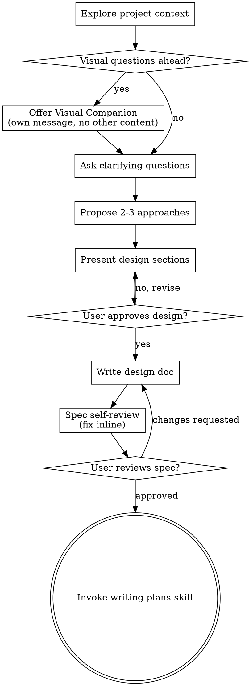

**The terminal state is invoking writing-plans.** Do NOT invoke frontend-design, mcp-builder, or any other implementation skill. The ONLY skill you invoke after brainstorming is writing-plans.

## The Process

**Understanding the idea:**

- Check out the current project state first (files, docs, recent commits)
- Before asking detailed questions, assess scope: if the request describes multiple independent subsystems (e.g., "build a platform with chat, file storage, billing, and analytics"), flag this immediately. Don't spend questions refining details of a project that needs to be decomposed first.
- If the project is too large for a single spec, help the user decompose into sub-projects: what are the independent pieces, how do they relate, what order should they be built? Then brainstorm the first sub-project through the normal design flow. Each sub-project gets its own spec → plan → implementation cycle.
- For appropriately-scoped projects, ask questions one at a time to refine the idea
- Prefer multiple choice questions when possible, but open-ended is fine too
- Only one question per message - if a topic needs more exploration, break it into multiple questions
- Focus on understanding: purpose, constraints, success criteria

**Exploring approaches:**

- Propose 2-3 different approaches with trade-offs
- Present options conversationally with your recommendation and reasoning
- Lead with your recommended option and explain why

**Presenting the design:**

- Once you believe you understand what you're building, present the design
- Scale each section to its complexity: a few sentences if straightforward, up to 200-300 words if nuanced
- Ask after each section whether it looks right so far
- Cover: architecture, components, data flow, error handling, testing
- Be ready to go back and clarify if something doesn't make sense

**Design for isolation and clarity:**

- Break the system into smaller units that each have one clear purpose, communicate through well-defined interfaces, and can be understood and tested independently
- For each unit, you should be able to answer: what does it do, how do you use it, and what does it depend on?
- Can someone understand what a unit does without reading its internals? Can you change the internals without breaking consumers? If not, the boundaries need work.
- Smaller, well-bounded units are also easier for you to work with - you reason better about code you can hold in context at once, and your edits are more reliable when files are focused. When a file grows large, that's often a signal that it's doing too much.

**Working in existing codebases:**

- Explore the current structure before proposing changes. Follow existing patterns.
- Where existing code has problems that affect the work (e.g., a file that's grown too large, unclear boundaries, tangled responsibilities), include targeted improvements as part of the design - the way a good developer improves code they're working in.
- Don't propose unrelated refactoring. Stay focused on what serves the current goal.

## After the Design

**Documentation:**

- Write the validated design (spec) to `docs/superpowers/specs/YYYY-MM-DD-<topic>-design.md`
  - (User preferences for spec location override this default)
- Use elements-of-style:writing-clearly-and-concisely skill if available
- Commit the design document to git

**Spec Self-Review:**
After writing the spec document, look at it with fresh eyes:

1. **Placeholder scan:** Any "TBD", "TODO", incomplete sections, or vague requirements? Fix them.
2. **Internal consistency:** Do any sections contradict each other? Does the architecture match the feature descriptions?
... snippet truncated ...
````

<!-- source-snippets:end -->
</details>
## 阶段二：创建隔离工作区（using-git-worktrees）

设计审批后，代理创建 Git worktree 隔离工作区：

1. **目录选择**：优先使用已有的 `.worktrees/` 或 `worktrees/` 目录，其次检查 CLAUDE.md 偏好，最后询问用户
2. **安全验证**：确保 worktree 目录在 `.gitignore` 中
3. **创建 worktree**：`git worktree add <path> -b <branch-name>`
4. **项目设置**：自动检测并运行 `npm install` / `cargo build` / `pip install` 等
5. **基线验证**：运行测试确保工作区从干净状态开始

Sources: [skills/using-git-worktrees/SKILL.md:1-200](../../../project-repos/superpowers/skills/using-git-worktrees/SKILL.md#L1-L200)

<details class="source-snippets">
<summary>引用源码</summary>

<!-- source-snippets:start -->

#### `skills/using-git-worktrees/SKILL.md:1-200`

````markdown
---
name: using-git-worktrees
description: Use when starting feature work that needs isolation from current workspace or before executing implementation plans - creates isolated git worktrees with smart directory selection and safety verification
---

# Using Git Worktrees

## Overview

Git worktrees create isolated workspaces sharing the same repository, allowing work on multiple branches simultaneously without switching.

**Core principle:** Systematic directory selection + safety verification = reliable isolation.

**Announce at start:** "I'm using the using-git-worktrees skill to set up an isolated workspace."

## Directory Selection Process

Follow this priority order:

### 1. Check Existing Directories

```bash
# Check in priority order
ls -d .worktrees 2>/dev/null     # Preferred (hidden)
ls -d worktrees 2>/dev/null      # Alternative
```

**If found:** Use that directory. If both exist, `.worktrees` wins.

### 2. Check CLAUDE.md

```bash
grep -i "worktree.*director" CLAUDE.md 2>/dev/null
```

**If preference specified:** Use it without asking.

### 3. Ask User

If no directory exists and no CLAUDE.md preference:

```
No worktree directory found. Where should I create worktrees?

1. .worktrees/ (project-local, hidden)
2. ~/.config/superpowers/worktrees/<project-name>/ (global location)

Which would you prefer?
```

## Safety Verification

### For Project-Local Directories (.worktrees or worktrees)

**MUST verify directory is ignored before creating worktree:**

```bash
# Check if directory is ignored (respects local, global, and system gitignore)
git check-ignore -q .worktrees 2>/dev/null || git check-ignore -q worktrees 2>/dev/null
```

**If NOT ignored:**

Per Jesse's rule "Fix broken things immediately":
1. Add appropriate line to .gitignore
2. Commit the change
3. Proceed with worktree creation

**Why critical:** Prevents accidentally committing worktree contents to repository.

### For Global Directory (~/.config/superpowers/worktrees)

No .gitignore verification needed - outside project entirely.

## Creation Steps

### 1. Detect Project Name

```bash
project=$(basename "$(git rev-parse --show-toplevel)")
```

### 2. Create Worktree

```bash
# Determine full path
case $LOCATION in
  .worktrees|worktrees)
    path="$LOCATION/$BRANCH_NAME"
    ;;
  ~/.config/superpowers/worktrees/*)
    path="~/.config/superpowers/worktrees/$project/$BRANCH_NAME"
    ;;
esac

# Create worktree with new branch
git worktree add "$path" -b "$BRANCH_NAME"
cd "$path"
```

### 3. Run Project Setup

Auto-detect and run appropriate setup:

```bash
# Node.js
if [ -f package.json ]; then npm install; fi

# Rust
if [ -f Cargo.toml ]; then cargo build; fi

# Python
if [ -f requirements.txt ]; then pip install -r requirements.txt; fi
if [ -f pyproject.toml ]; then poetry install; fi

# Go
if [ -f go.mod ]; then go mod download; fi
```

### 4. Verify Clean Baseline
... snippet truncated ...
````

<!-- source-snippets:end -->
</details>
## 阶段三：编写计划（writing-plans）

计划技能将设计分解为原子级任务，每个任务 2-5 分钟可完成。

### 任务粒度

每个步骤是一个原子动作：

- "编写失败测试" —— 一个步骤
- "运行确认失败" —— 一个步骤
- "编写最小实现" —— 一个步骤
- "运行确认通过" —— 一个步骤
- "提交" —— 一个步骤

### 计划文档头部

每个计划必须以标准头部开始，包含目标、架构概述和技术栈，并标注推荐使用 `subagent-driven-development` 或 `executing-plans` 来执行。

### 禁止占位符

以下模式是计划失败，绝不允许出现：
- "TBD"、"TODO"、"稍后实现"、"补充细节"
- "添加适当的错误处理"（无具体代码）
- "为上述编写测试"（无实际测试代码）
- "与任务 N 类似"（必须重复代码，工程师可能乱序阅读）

### 自审检查

计划完成后执行三项检查：
1. **规格覆盖**：每个需求是否有对应任务？
2. **占位符扫描**：搜索红旗模式
3. **类型一致性**：后续任务中的函数名、签名是否与前面定义的一致？

Sources: [skills/writing-plans/SKILL.md:1-152](../../../project-repos/superpowers/skills/writing-plans/SKILL.md#L1-L152)

<details class="source-snippets">
<summary>引用源码</summary>

<!-- source-snippets:start -->

#### `skills/writing-plans/SKILL.md:1-152`

`````markdown
---
name: writing-plans
description: Use when you have a spec or requirements for a multi-step task, before touching code
---

# Writing Plans

## Overview

Write comprehensive implementation plans assuming the engineer has zero context for our codebase and questionable taste. Document everything they need to know: which files to touch for each task, code, testing, docs they might need to check, how to test it. Give them the whole plan as bite-sized tasks. DRY. YAGNI. TDD. Frequent commits.

Assume they are a skilled developer, but know almost nothing about our toolset or problem domain. Assume they don't know good test design very well.

**Announce at start:** "I'm using the writing-plans skill to create the implementation plan."

**Context:** This should be run in a dedicated worktree (created by brainstorming skill).

**Save plans to:** `docs/superpowers/plans/YYYY-MM-DD-<feature-name>.md`
- (User preferences for plan location override this default)

## Scope Check

If the spec covers multiple independent subsystems, it should have been broken into sub-project specs during brainstorming. If it wasn't, suggest breaking this into separate plans — one per subsystem. Each plan should produce working, testable software on its own.

## File Structure

Before defining tasks, map out which files will be created or modified and what each one is responsible for. This is where decomposition decisions get locked in.

- Design units with clear boundaries and well-defined interfaces. Each file should have one clear responsibility.
- You reason best about code you can hold in context at once, and your edits are more reliable when files are focused. Prefer smaller, focused files over large ones that do too much.
- Files that change together should live together. Split by responsibility, not by technical layer.
- In existing codebases, follow established patterns. If the codebase uses large files, don't unilaterally restructure - but if a file you're modifying has grown unwieldy, including a split in the plan is reasonable.

This structure informs the task decomposition. Each task should produce self-contained changes that make sense independently.

## Bite-Sized Task Granularity

**Each step is one action (2-5 minutes):**
- "Write the failing test" - step
- "Run it to make sure it fails" - step
- "Implement the minimal code to make the test pass" - step
- "Run the tests and make sure they pass" - step
- "Commit" - step

## Plan Document Header

**Every plan MUST start with this header:**

```markdown
# [Feature Name] Implementation Plan

> **For agentic workers:** REQUIRED SUB-SKILL: Use superpowers:subagent-driven-development (recommended) or superpowers:executing-plans to implement this plan task-by-task. Steps use checkbox (`- [ ]`) syntax for tracking.

**Goal:** [One sentence describing what this builds]

**Architecture:** [2-3 sentences about approach]

**Tech Stack:** [Key technologies/libraries]

---
```

## Task Structure

````markdown
### Task N: [Component Name]

**Files:**
- Create: `exact/path/to/file.py`
- Modify: `exact/path/to/existing.py:123-145`
- Test: `tests/exact/path/to/test.py`

- [ ] **Step 1: Write the failing test**

```python
def test_specific_behavior():
    result = function(input)
    assert result == expected
```

- [ ] **Step 2: Run test to verify it fails**

Run: `pytest tests/path/test.py::test_name -v`
Expected: FAIL with "function not defined"

- [ ] **Step 3: Write minimal implementation**

```python
def function(input):
    return expected
```

- [ ] **Step 4: Run test to verify it passes**

Run: `pytest tests/path/test.py::test_name -v`
Expected: PASS

- [ ] **Step 5: Commit**

```bash
git add tests/path/test.py src/path/file.py
git commit -m "feat: add specific feature"
```
````

## No Placeholders

Every step must contain the actual content an engineer needs. These are **plan failures** — never write them:
- "TBD", "TODO", "implement later", "fill in details"
- "Add appropriate error handling" / "add validation" / "handle edge cases"
- "Write tests for the above" (without actual test code)
- "Similar to Task N" (repeat the code — the engineer may be reading tasks out of order)
- Steps that describe what to do without showing how (code blocks required for code steps)
- References to types, functions, or methods not defined in any task

## Remember
- Exact file paths always
- Complete code in every step — if a step changes code, show the code
- Exact commands with expected output
- DRY, YAGNI, TDD, frequent commits
... snippet truncated ...
`````

<!-- source-snippets:end -->
</details>
## 阶段四：执行实施

计划完成后，用户选择执行方式：

### 方式一：子代理驱动开发（推荐）

详见 [子代理驱动开发](subagent-driven-development.md) 页面。核心特点：每个任务分派独立子代理，两阶段审查（规格合规 + 代码质量）。

### 方式二：内联执行（executing-plans）

适用于不支持子代理的平台：
1. 加载并审阅计划
2. 逐任务执行，标记进度
3. 遇到阻塞立即停止并请求帮助
4. 全部完成后调用 finishing-a-development-branch

Sources: [skills/executing-plans/SKILL.md:1-70](../../../project-repos/superpowers/skills/executing-plans/SKILL.md#L1-L70)

<details class="source-snippets">
<summary>引用源码</summary>

<!-- source-snippets:start -->

#### `skills/executing-plans/SKILL.md:1-70`

```markdown
---
name: executing-plans
description: Use when you have a written implementation plan to execute in a separate session with review checkpoints
---

# Executing Plans

## Overview

Load plan, review critically, execute all tasks, report when complete.

**Announce at start:** "I'm using the executing-plans skill to implement this plan."

**Note:** Tell your human partner that Superpowers works much better with access to subagents. The quality of its work will be significantly higher if run on a platform with subagent support (such as Claude Code or Codex). If subagents are available, use superpowers:subagent-driven-development instead of this skill.

## The Process

### Step 1: Load and Review Plan
1. Read plan file
2. Review critically - identify any questions or concerns about the plan
3. If concerns: Raise them with your human partner before starting
4. If no concerns: Create TodoWrite and proceed

### Step 2: Execute Tasks

For each task:
1. Mark as in_progress
2. Follow each step exactly (plan has bite-sized steps)
3. Run verifications as specified
4. Mark as completed

### Step 3: Complete Development

After all tasks complete and verified:
- Announce: "I'm using the finishing-a-development-branch skill to complete this work."
- **REQUIRED SUB-SKILL:** Use superpowers:finishing-a-development-branch
- Follow that skill to verify tests, present options, execute choice

## When to Stop and Ask for Help

**STOP executing immediately when:**
- Hit a blocker (missing dependency, test fails, instruction unclear)
- Plan has critical gaps preventing starting
- You don't understand an instruction
- Verification fails repeatedly

**Ask for clarification rather than guessing.**

## When to Revisit Earlier Steps

**Return to Review (Step 1) when:**
- Partner updates the plan based on your feedback
- Fundamental approach needs rethinking

**Don't force through blockers** - stop and ask.

## Remember
- Review plan critically first
- Follow plan steps exactly
- Don't skip verifications
- Reference skills when plan says to
- Stop when blocked, don't guess
- Never start implementation on main/master branch without explicit user consent

## Integration

**Required workflow skills:**
- **superpowers:using-git-worktrees** - REQUIRED: Set up isolated workspace before starting
- **superpowers:writing-plans** - Creates the plan this skill executes
- **superpowers:finishing-a-development-branch** - Complete development after all tasks
```

<!-- source-snippets:end -->
</details>
## 阶段五：代码审查

### 请求审查（requesting-code-review）

在以下时机请求审查：
- 子代理驱动开发中每个任务完成后（强制）
- 完成主要功能后
- 合并到 main 之前

审查流程：
1. 获取 Git SHA 范围
2. 分派 code-reviewer 子代理，提供精确上下文
3. 按严重性处理反馈：Critical 立即修复，Important 继续前修复，Minor 记录后续处理

### 接收审查（receiving-code-review）

接收审查反馈的核心原则是**技术评估而非情感表演**：

- **禁止**："你说得对！"、"好建议！"、"让我实现它"（未验证前）
- **要求**：重述技术需求、验证后行动、有理由地反驳

对外部审查者的建议保持怀疑：检查是否破坏现有功能、是否符合当前技术栈、是否存在 YAGNI 违规。

Sources: [skills/requesting-code-review/SKILL.md:1-105](../../../project-repos/superpowers/skills/requesting-code-review/SKILL.md#L1-L105), [skills/receiving-code-review/SKILL.md:1-200](../../../project-repos/superpowers/skills/receiving-code-review/SKILL.md#L1-L200)

<details class="source-snippets">
<summary>引用源码</summary>

<!-- source-snippets:start -->

#### `skills/requesting-code-review/SKILL.md:1-105`

````markdown
---
name: requesting-code-review
description: Use when completing tasks, implementing major features, or before merging to verify work meets requirements
---

# Requesting Code Review

Dispatch superpowers:code-reviewer subagent to catch issues before they cascade. The reviewer gets precisely crafted context for evaluation — never your session's history. This keeps the reviewer focused on the work product, not your thought process, and preserves your own context for continued work.

**Core principle:** Review early, review often.

## When to Request Review

**Mandatory:**
- After each task in subagent-driven development
- After completing major feature
- Before merge to main

**Optional but valuable:**
- When stuck (fresh perspective)
- Before refactoring (baseline check)
- After fixing complex bug

## How to Request

**1. Get git SHAs:**
```bash
BASE_SHA=$(git rev-parse HEAD~1)  # or origin/main
HEAD_SHA=$(git rev-parse HEAD)
```

**2. Dispatch code-reviewer subagent:**

Use Task tool with superpowers:code-reviewer type, fill template at `code-reviewer.md`

**Placeholders:**
- `{WHAT_WAS_IMPLEMENTED}` - What you just built
- `{PLAN_OR_REQUIREMENTS}` - What it should do
- `{BASE_SHA}` - Starting commit
- `{HEAD_SHA}` - Ending commit
- `{DESCRIPTION}` - Brief summary

**3. Act on feedback:**
- Fix Critical issues immediately
- Fix Important issues before proceeding
- Note Minor issues for later
- Push back if reviewer is wrong (with reasoning)

## Example

```
[Just completed Task 2: Add verification function]

You: Let me request code review before proceeding.

BASE_SHA=$(git log --oneline | grep "Task 1" | head -1 | awk '{print $1}')
HEAD_SHA=$(git rev-parse HEAD)

[Dispatch superpowers:code-reviewer subagent]
  WHAT_WAS_IMPLEMENTED: Verification and repair functions for conversation index
  PLAN_OR_REQUIREMENTS: Task 2 from docs/superpowers/plans/deployment-plan.md
  BASE_SHA: a7981ec
  HEAD_SHA: 3df7661
  DESCRIPTION: Added verifyIndex() and repairIndex() with 4 issue types

[Subagent returns]:
  Strengths: Clean architecture, real tests
  Issues:
    Important: Missing progress indicators
    Minor: Magic number (100) for reporting interval
  Assessment: Ready to proceed

You: [Fix progress indicators]
[Continue to Task 3]
```

## Integration with Workflows

**Subagent-Driven Development:**
- Review after EACH task
- Catch issues before they compound
- Fix before moving to next task

**Executing Plans:**
- Review after each batch (3 tasks)
- Get feedback, apply, continue

**Ad-Hoc Development:**
- Review before merge
- Review when stuck

## Red Flags

**Never:**
- Skip review because "it's simple"
- Ignore Critical issues
- Proceed with unfixed Important issues
- Argue with valid technical feedback

**If reviewer wrong:**
- Push back with technical reasoning
- Show code/tests that prove it works
- Request clarification

See template at: requesting-code-review/code-reviewer.md
````

#### `skills/receiving-code-review/SKILL.md:1-200`

````markdown
---
name: receiving-code-review
description: Use when receiving code review feedback, before implementing suggestions, especially if feedback seems unclear or technically questionable - requires technical rigor and verification, not performative agreement or blind implementation
---

# Code Review Reception

## Overview

Code review requires technical evaluation, not emotional performance.

**Core principle:** Verify before implementing. Ask before assuming. Technical correctness over social comfort.

## The Response Pattern

```
WHEN receiving code review feedback:

1. READ: Complete feedback without reacting
2. UNDERSTAND: Restate requirement in own words (or ask)
3. VERIFY: Check against codebase reality
4. EVALUATE: Technically sound for THIS codebase?
5. RESPOND: Technical acknowledgment or reasoned pushback
6. IMPLEMENT: One item at a time, test each
```

## Forbidden Responses

**NEVER:**
- "You're absolutely right!" (explicit CLAUDE.md violation)
- "Great point!" / "Excellent feedback!" (performative)
- "Let me implement that now" (before verification)

**INSTEAD:**
- Restate the technical requirement
- Ask clarifying questions
- Push back with technical reasoning if wrong
- Just start working (actions > words)

## Handling Unclear Feedback

```
IF any item is unclear:
  STOP - do not implement anything yet
  ASK for clarification on unclear items

WHY: Items may be related. Partial understanding = wrong implementation.
```

**Example:**
```
your human partner: "Fix 1-6"
You understand 1,2,3,6. Unclear on 4,5.

❌ WRONG: Implement 1,2,3,6 now, ask about 4,5 later
✅ RIGHT: "I understand items 1,2,3,6. Need clarification on 4 and 5 before proceeding."
```

## Source-Specific Handling

### From your human partner
- **Trusted** - implement after understanding
- **Still ask** if scope unclear
- **No performative agreement**
- **Skip to action** or technical acknowledgment

### From External Reviewers
```
BEFORE implementing:
  1. Check: Technically correct for THIS codebase?
  2. Check: Breaks existing functionality?
  3. Check: Reason for current implementation?
  4. Check: Works on all platforms/versions?
  5. Check: Does reviewer understand full context?

IF suggestion seems wrong:
  Push back with technical reasoning

IF can't easily verify:
  Say so: "I can't verify this without [X]. Should I [investigate/ask/proceed]?"

IF conflicts with your human partner's prior decisions:
  Stop and discuss with your human partner first
```

**your human partner's rule:** "External feedback - be skeptical, but check carefully"

## YAGNI Check for "Professional" Features

```
IF reviewer suggests "implementing properly":
  grep codebase for actual usage

  IF unused: "This endpoint isn't called. Remove it (YAGNI)?"
  IF used: Then implement properly
```

**your human partner's rule:** "You and reviewer both report to me. If we don't need this feature, don't add it."

## Implementation Order

```
FOR multi-item feedback:
  1. Clarify anything unclear FIRST
  2. Then implement in this order:
     - Blocking issues (breaks, security)
     - Simple fixes (typos, imports)
     - Complex fixes (refactoring, logic)
  3. Test each fix individually
  4. Verify no regressions
```

## When To Push Back

Push back when:
- Suggestion breaks existing functionality
- Reviewer lacks full context
- Violates YAGNI (unused feature)
- Technically incorrect for this stack
- Legacy/compatibility reasons exist
... snippet truncated ...
````

<!-- source-snippets:end -->
</details>
## 阶段六：分支完成（finishing-a-development-branch）

所有任务完成并审查通过后：

1. **验证测试**——测试必须通过才能继续
2. **确定基准分支**——main 或 master
3. **提供四个选项**：
   - 本地合并到基准分支
   - 推送并创建 Pull Request
   - 保持分支现状
   - 丢弃工作（需输入 "discard" 确认）
4. **清理 worktree**——选项 1 和 4 自动清理

Sources: [skills/finishing-a-development-branch/SKILL.md:1-200](../../../project-repos/superpowers/skills/finishing-a-development-branch/SKILL.md#L1-L200)

<details class="source-snippets">
<summary>引用源码</summary>

<!-- source-snippets:start -->

#### `skills/finishing-a-development-branch/SKILL.md:1-200`

````markdown
---
name: finishing-a-development-branch
description: Use when implementation is complete, all tests pass, and you need to decide how to integrate the work - guides completion of development work by presenting structured options for merge, PR, or cleanup
---

# Finishing a Development Branch

## Overview

Guide completion of development work by presenting clear options and handling chosen workflow.

**Core principle:** Verify tests → Present options → Execute choice → Clean up.

**Announce at start:** "I'm using the finishing-a-development-branch skill to complete this work."

## The Process

### Step 1: Verify Tests

**Before presenting options, verify tests pass:**

```bash
# Run project's test suite
npm test / cargo test / pytest / go test ./...
```

**If tests fail:**
```
Tests failing (<N> failures). Must fix before completing:

[Show failures]

Cannot proceed with merge/PR until tests pass.
```

Stop. Don't proceed to Step 2.

**If tests pass:** Continue to Step 2.

### Step 2: Determine Base Branch

```bash
# Try common base branches
git merge-base HEAD main 2>/dev/null || git merge-base HEAD master 2>/dev/null
```

Or ask: "This branch split from main - is that correct?"

### Step 3: Present Options

Present exactly these 4 options:

```
Implementation complete. What would you like to do?

1. Merge back to <base-branch> locally
2. Push and create a Pull Request
3. Keep the branch as-is (I'll handle it later)
4. Discard this work

Which option?
```

**Don't add explanation** - keep options concise.

### Step 4: Execute Choice

#### Option 1: Merge Locally

```bash
# Switch to base branch
git checkout <base-branch>

# Pull latest
git pull

# Merge feature branch
git merge <feature-branch>

# Verify tests on merged result
<test command>

# If tests pass
git branch -d <feature-branch>
```

Then: Cleanup worktree (Step 5)

#### Option 2: Push and Create PR

```bash
# Push branch
git push -u origin <feature-branch>

# Create PR
gh pr create --title "<title>" --body "$(cat <<'EOF'
## Summary
<2-3 bullets of what changed>

## Test Plan
- [ ] <verification steps>
EOF
)"
```

Then: Cleanup worktree (Step 5)

#### Option 3: Keep As-Is

Report: "Keeping branch <name>. Worktree preserved at <path>."

**Don't cleanup worktree.**

#### Option 4: Discard

**Confirm first:**
```
This will permanently delete:
- Branch <name>
- All commits: <commit-list>
... snippet truncated ...
````

<!-- source-snippets:end -->
</details>
## 验证先行原则

贯穿所有阶段的元原则：**没有新鲜验证证据就不能声称完成**。

验证门控函数：

```
声称任何状态前：
1. 识别：什么命令能证明此声称？
2. 运行：执行完整命令（新鲜的、完整的）
3. 阅读：完整输出，检查退出码，计算失败数
4. 验证：输出是否确认声称？
5. 只有此时：做出声称
```

常见的验证失败：用"应该"代替实际运行、信任子代理的成功报告、部分检查后外推。

Sources: [skills/verification-before-completion/SKILL.md:1-139](../../../project-repos/superpowers/skills/verification-before-completion/SKILL.md#L1-L139)

<details class="source-snippets">
<summary>引用源码</summary>

<!-- source-snippets:start -->

#### `skills/verification-before-completion/SKILL.md:1-139`

````markdown
---
name: verification-before-completion
description: Use when about to claim work is complete, fixed, or passing, before committing or creating PRs - requires running verification commands and confirming output before making any success claims; evidence before assertions always
---

# Verification Before Completion

## Overview

Claiming work is complete without verification is dishonesty, not efficiency.

**Core principle:** Evidence before claims, always.

**Violating the letter of this rule is violating the spirit of this rule.**

## The Iron Law

```
NO COMPLETION CLAIMS WITHOUT FRESH VERIFICATION EVIDENCE
```

If you haven't run the verification command in this message, you cannot claim it passes.

## The Gate Function

```
BEFORE claiming any status or expressing satisfaction:

1. IDENTIFY: What command proves this claim?
2. RUN: Execute the FULL command (fresh, complete)
3. READ: Full output, check exit code, count failures
4. VERIFY: Does output confirm the claim?
   - If NO: State actual status with evidence
   - If YES: State claim WITH evidence
5. ONLY THEN: Make the claim

Skip any step = lying, not verifying
```

## Common Failures

| Claim | Requires | Not Sufficient |
|-------|----------|----------------|
| Tests pass | Test command output: 0 failures | Previous run, "should pass" |
| Linter clean | Linter output: 0 errors | Partial check, extrapolation |
| Build succeeds | Build command: exit 0 | Linter passing, logs look good |
| Bug fixed | Test original symptom: passes | Code changed, assumed fixed |
| Regression test works | Red-green cycle verified | Test passes once |
| Agent completed | VCS diff shows changes | Agent reports "success" |
| Requirements met | Line-by-line checklist | Tests passing |

## Red Flags - STOP

- Using "should", "probably", "seems to"
- Expressing satisfaction before verification ("Great!", "Perfect!", "Done!", etc.)
- About to commit/push/PR without verification
- Trusting agent success reports
- Relying on partial verification
- Thinking "just this once"
- Tired and wanting work over
- **ANY wording implying success without having run verification**

## Rationalization Prevention

| Excuse | Reality |
|--------|---------|
| "Should work now" | RUN the verification |
| "I'm confident" | Confidence ≠ evidence |
| "Just this once" | No exceptions |
| "Linter passed" | Linter ≠ compiler |
| "Agent said success" | Verify independently |
| "I'm tired" | Exhaustion ≠ excuse |
| "Partial check is enough" | Partial proves nothing |
| "Different words so rule doesn't apply" | Spirit over letter |

## Key Patterns

**Tests:**
```
✅ [Run test command] [See: 34/34 pass] "All tests pass"
❌ "Should pass now" / "Looks correct"
```

**Regression tests (TDD Red-Green):**
```
✅ Write → Run (pass) → Revert fix → Run (MUST FAIL) → Restore → Run (pass)
❌ "I've written a regression test" (without red-green verification)
```

**Build:**
```
✅ [Run build] [See: exit 0] "Build passes"
❌ "Linter passed" (linter doesn't check compilation)
```

**Requirements:**
```
✅ Re-read plan → Create checklist → Verify each → Report gaps or completion
❌ "Tests pass, phase complete"
```

**Agent delegation:**
```
✅ Agent reports success → Check VCS diff → Verify changes → Report actual state
❌ Trust agent report
```

## Why This Matters

From 24 failure memories:
- your human partner said "I don't believe you" - trust broken
- Undefined functions shipped - would crash
- Missing requirements shipped - incomplete features
- Time wasted on false completion → redirect → rework
- Violates: "Honesty is a core value. If you lie, you'll be replaced."

## When To Apply

**ALWAYS before:**
- ANY variation of success/completion claims
... snippet truncated ...
````

<!-- source-snippets:end -->
</details>
## 相关页面

- [子代理驱动开发](subagent-driven-development.md)
- [技能体系](skills-system.md)
- [项目概览](overview.md)


---

<details>
<summary>相关源文件</summary>

生成本页时使用的主要源文件：

- [skills/subagent-driven-development/SKILL.md](https://github.com/obra/superpowers/blob/main/skills/subagent-driven-development/SKILL.md)
- [skills/subagent-driven-development/implementer-prompt.md](https://github.com/obra/superpowers/blob/main/skills/subagent-driven-development/implementer-prompt.md)
- [skills/subagent-driven-development/spec-reviewer-prompt.md](https://github.com/obra/superpowers/blob/main/skills/subagent-driven-development/spec-reviewer-prompt.md)
- [skills/subagent-driven-development/code-quality-reviewer-prompt.md](https://github.com/obra/superpowers/blob/main/skills/subagent-driven-development/code-quality-reviewer-prompt.md)
- [skills/dispatching-parallel-agents/SKILL.md](https://github.com/obra/superpowers/blob/main/skills/dispatching-parallel-agents/SKILL.md)

</details>

# 子代理驱动开发

子代理驱动开发（Subagent-Driven Development，SDD）是 Superpowers 推荐的执行方式。核心思想：每个任务分派一个全新子代理，任务完成后进行两阶段审查——先检查规格合规性，再检查代码质量。

## 核心原则

**全新子代理 + 两阶段审查 = 高质量快速迭代**

子代理不继承会话上下文或历史——控制器精确构建它们所需的信息。这既保证了子代理的专注度，又保留了控制器的上下文用于协调工作。

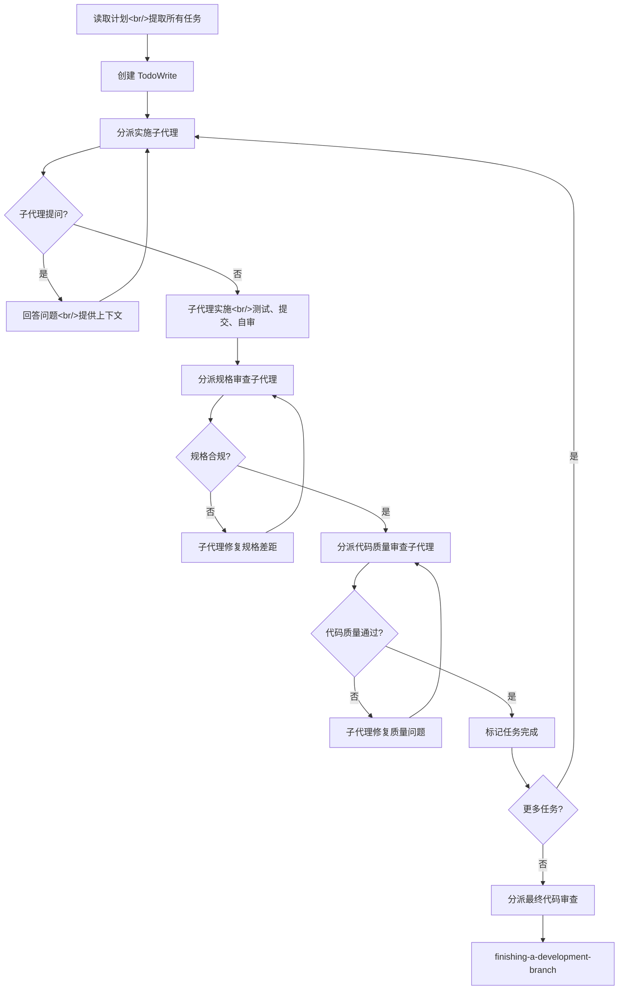

Sources: [skills/subagent-driven-development/SKILL.md:1-50](../../../project-repos/superpowers/skills/subagent-driven-development/SKILL.md#L1-L50)

<details class="source-snippets">
<summary>引用源码</summary>

<!-- source-snippets:start -->

#### `skills/subagent-driven-development/SKILL.md:1-50`

````markdown
---
name: subagent-driven-development
description: Use when executing implementation plans with independent tasks in the current session
---

# Subagent-Driven Development

Execute plan by dispatching fresh subagent per task, with two-stage review after each: spec compliance review first, then code quality review.

**Why subagents:** You delegate tasks to specialized agents with isolated context. By precisely crafting their instructions and context, you ensure they stay focused and succeed at their task. They should never inherit your session's context or history — you construct exactly what they need. This also preserves your own context for coordination work.

**Core principle:** Fresh subagent per task + two-stage review (spec then quality) = high quality, fast iteration

## When to Use

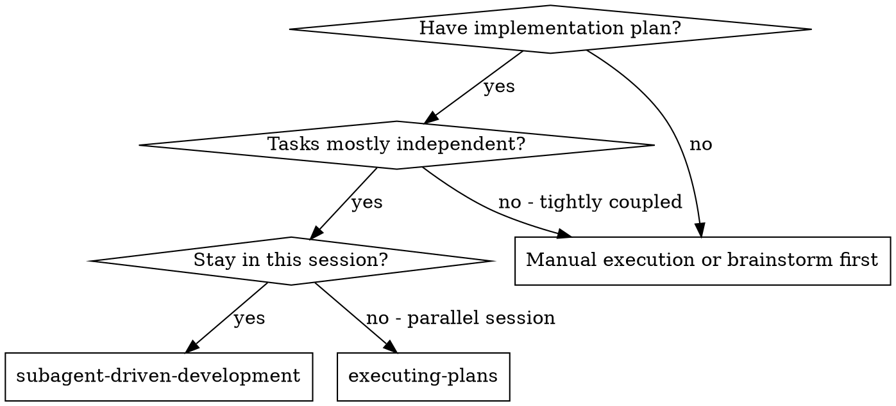

**vs. Executing Plans (parallel session):**
- Same session (no context switch)
- Fresh subagent per task (no context pollution)
- Two-stage review after each task: spec compliance first, then code quality
- Faster iteration (no human-in-loop between tasks)

## The Process

```dot
digraph process {
    rankdir=TB;

    subgraph cluster_per_task {
        label="Per Task";
        "Dispatch implementer subagent (./implementer-prompt.md)" [shape=box];
        "Implementer subagent asks questions?" [shape=diamond];
        "Answer questions, provide context" [shape=box];
````

<!-- source-snippets:end -->
</details>
## 何时使用 SDD

| 条件 | SDD | executing-plans |
|------|-----|-----------------|
| 有实施计划 | ✅ | ✅ |
| 任务大多独立 | ✅ | — |
| 在当前会话执行 | ✅ | — |
| 在并行会话执行 | — | ✅ |
| 平台支持子代理 | ✅ | — |
| 平台不支持子代理 | — | ✅ |

Sources: [skills/subagent-driven-development/SKILL.md:20-40](../../../project-repos/superpowers/skills/subagent-driven-development/SKILL.md#L20-L40)

<details class="source-snippets">
<summary>引用源码</summary>

<!-- source-snippets:start -->

#### `skills/subagent-driven-development/SKILL.md:20-40`

````markdown
    "Stay in this session?" [shape=diamond];
    "subagent-driven-development" [shape=box];
    "executing-plans" [shape=box];
    "Manual execution or brainstorm first" [shape=box];

    "Have implementation plan?" -> "Tasks mostly independent?" [label="yes"];
    "Have implementation plan?" -> "Manual execution or brainstorm first" [label="no"];
    "Tasks mostly independent?" -> "Stay in this session?" [label="yes"];
    "Tasks mostly independent?" -> "Manual execution or brainstorm first" [label="no - tightly coupled"];
    "Stay in this session?" -> "subagent-driven-development" [label="yes"];
    "Stay in this session?" -> "executing-plans" [label="no - parallel session"];
}
```

**vs. Executing Plans (parallel session):**
- Same session (no context switch)
- Fresh subagent per task (no context pollution)
- Two-stage review after each task: spec compliance first, then code quality
- Faster iteration (no human-in-loop between tasks)

## The Process
````

<!-- source-snippets:end -->
</details>
## 三种子代理角色

### 实施者（Implementer）

- 接收完整任务文本和上下文（控制器预先提取，不让子代理读计划文件）
- 遵循 TDD 流程实施
- 实施后自审
- 报告四种状态之一

### 规格审查者（Spec Reviewer）

- 独立阅读代码，不信任实施者报告
- 检查实现是否匹配规格要求
- 发现缺失或多余的功能
- 必须在代码质量审查之前完成

### 代码质量审查者（Code Quality Reviewer）

- 在规格合规确认后执行
- 评估代码质量、命名、组织
- 分类问题：Critical / Important / Minor
- 获得批准后才算通过

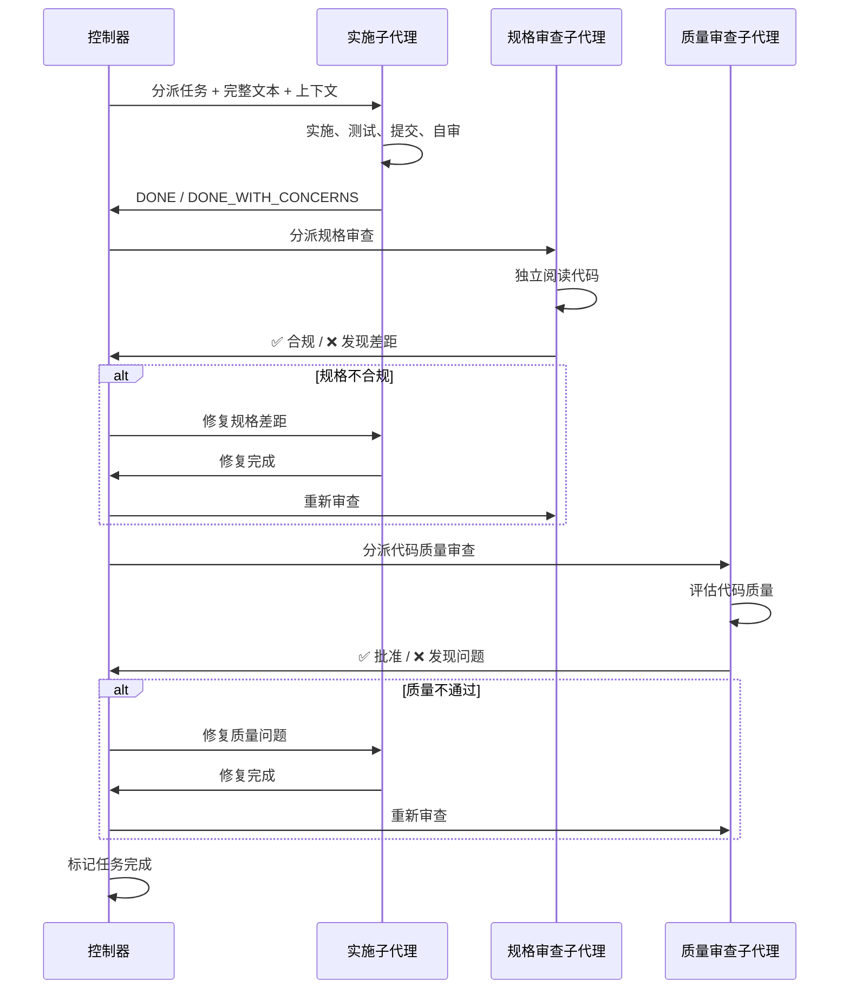

Sources: [skills/subagent-driven-development/SKILL.md:50-120](../../../project-repos/superpowers/skills/subagent-driven-development/SKILL.md#L50-L120)

<details class="source-snippets">
<summary>引用源码</summary>

<!-- source-snippets:start -->

#### `skills/subagent-driven-development/SKILL.md:50-120`

````markdown
        "Answer questions, provide context" [shape=box];
        "Implementer subagent implements, tests, commits, self-reviews" [shape=box];
        "Dispatch spec reviewer subagent (./spec-reviewer-prompt.md)" [shape=box];
        "Spec reviewer subagent confirms code matches spec?" [shape=diamond];
        "Implementer subagent fixes spec gaps" [shape=box];
        "Dispatch code quality reviewer subagent (./code-quality-reviewer-prompt.md)" [shape=box];
        "Code quality reviewer subagent approves?" [shape=diamond];
        "Implementer subagent fixes quality issues" [shape=box];
        "Mark task complete in TodoWrite" [shape=box];
    }

    "Read plan, extract all tasks with full text, note context, create TodoWrite" [shape=box];
    "More tasks remain?" [shape=diamond];
    "Dispatch final code reviewer subagent for entire implementation" [shape=box];
    "Use superpowers:finishing-a-development-branch" [shape=box style=filled fillcolor=lightgreen];

    "Read plan, extract all tasks with full text, note context, create TodoWrite" -> "Dispatch implementer subagent (./implementer-prompt.md)";
    "Dispatch implementer subagent (./implementer-prompt.md)" -> "Implementer subagent asks questions?";
    "Implementer subagent asks questions?" -> "Answer questions, provide context" [label="yes"];
    "Answer questions, provide context" -> "Dispatch implementer subagent (./implementer-prompt.md)";
    "Implementer subagent asks questions?" -> "Implementer subagent implements, tests, commits, self-reviews" [label="no"];
    "Implementer subagent implements, tests, commits, self-reviews" -> "Dispatch spec reviewer subagent (./spec-reviewer-prompt.md)";
    "Dispatch spec reviewer subagent (./spec-reviewer-prompt.md)" -> "Spec reviewer subagent confirms code matches spec?";
    "Spec reviewer subagent confirms code matches spec?" -> "Implementer subagent fixes spec gaps" [label="no"];
    "Implementer subagent fixes spec gaps" -> "Dispatch spec reviewer subagent (./spec-reviewer-prompt.md)" [label="re-review"];
    "Spec reviewer subagent confirms code matches spec?" -> "Dispatch code quality reviewer subagent (./code-quality-reviewer-prompt.md)" [label="yes"];
    "Dispatch code quality reviewer subagent (./code-quality-reviewer-prompt.md)" -> "Code quality reviewer subagent approves?";
    "Code quality reviewer subagent approves?" -> "Implementer subagent fixes quality issues" [label="no"];
    "Implementer subagent fixes quality issues" -> "Dispatch code quality reviewer subagent (./code-quality-reviewer-prompt.md)" [label="re-review"];
    "Code quality reviewer subagent approves?" -> "Mark task complete in TodoWrite" [label="yes"];
    "Mark task complete in TodoWrite" -> "More tasks remain?";
    "More tasks remain?" -> "Dispatch implementer subagent (./implementer-prompt.md)" [label="yes"];
    "More tasks remain?" -> "Dispatch final code reviewer subagent for entire implementation" [label="no"];
    "Dispatch final code reviewer subagent for entire implementation" -> "Use superpowers:finishing-a-development-branch";
}
```

## Model Selection

Use the least powerful model that can handle each role to conserve cost and increase speed.

**Mechanical implementation tasks** (isolated functions, clear specs, 1-2 files): use a fast, cheap model. Most implementation tasks are mechanical when the plan is well-specified.

**Integration and judgment tasks** (multi-file coordination, pattern matching, debugging): use a standard model.

**Architecture, design, and review tasks**: use the most capable available model.

**Task complexity signals:**
- Touches 1-2 files with a complete spec → cheap model
- Touches multiple files with integration concerns → standard model
- Requires design judgment or broad codebase understanding → most capable model

## Handling Implementer Status

Implementer subagents report one of four statuses. Handle each appropriately:

**DONE:** Proceed to spec compliance review.

**DONE_WITH_CONCERNS:** The implementer completed the work but flagged doubts. Read the concerns before proceeding. If the concerns are about correctness or scope, address them before review. If they're observations (e.g., "this file is getting large"), note them and proceed to review.

**NEEDS_CONTEXT:** The implementer needs information that wasn't provided. Provide the missing context and re-dispatch.

**BLOCKED:** The implementer cannot complete the task. Assess the blocker:
1. If it's a context problem, provide more context and re-dispatch with the same model
2. If the task requires more reasoning, re-dispatch with a more capable model
3. If the task is too large, break it into smaller pieces
4. If the plan itself is wrong, escalate to the human

**Never** ignore an escalation or force the same model to retry without changes. If the implementer said it's stuck, something needs to change.

## Prompt Templates
````

<!-- source-snippets:end -->
</details>
## 模型选择策略

使用能处理每个角色的最低能力模型，以节约成本和提高速度：

| 任务类型 | 推荐模型级别 | 信号 |
|----------|-------------|------|
| 机械实施（1-2 文件，完整规格） | 快速廉价模型 | 触及 1-2 文件，规格完整 |
| 集成判断（多文件协调，模式匹配） | 标准模型 | 触及多文件，有集成关注 |
| 架构设计与审查 | 最强模型 | 需要设计判断或广泛代码库理解 |

Sources: [skills/subagent-driven-development/SKILL.md:120-145](../../../project-repos/superpowers/skills/subagent-driven-development/SKILL.md#L120-L145)

<details class="source-snippets">
<summary>引用源码</summary>

<!-- source-snippets:start -->

#### `skills/subagent-driven-development/SKILL.md:120-145`

````markdown
## Prompt Templates

- `./implementer-prompt.md` - Dispatch implementer subagent
- `./spec-reviewer-prompt.md` - Dispatch spec compliance reviewer subagent
- `./code-quality-reviewer-prompt.md` - Dispatch code quality reviewer subagent

## Example Workflow

```
You: I'm using Subagent-Driven Development to execute this plan.

[Read plan file once: docs/superpowers/plans/feature-plan.md]
[Extract all 5 tasks with full text and context]
[Create TodoWrite with all tasks]

Task 1: Hook installation script

[Get Task 1 text and context (already extracted)]
[Dispatch implementation subagent with full task text + context]

Implementer: "Before I begin - should the hook be installed at user or system level?"

You: "User level (~/.config/superpowers/hooks/)"

Implementer: "Got it. Implementing now..."
[Later] Implementer:
````

<!-- source-snippets:end -->
</details>
## 处理实施者状态

| 状态 | 处理方式 |
|------|----------|
| **DONE** | 进入规格合规审查 |
| **DONE_WITH_CONCERNS** | 阅读疑虑后决定是否继续审查 |
| **NEEDS_CONTEXT** | 提供缺失上下文后重新分派 |
| **BLOCKED** | 评估阻塞原因：上下文问题→补充重派；推理不足→更强模型；任务过大→拆分；计划有误→上报用户 |

**绝不**忽略上报或让同一模型无变化地重试。

Sources: [skills/subagent-driven-development/SKILL.md:145-175](../../../project-repos/superpowers/skills/subagent-driven-development/SKILL.md#L145-L175)

<details class="source-snippets">
<summary>引用源码</summary>

<!-- source-snippets:start -->

#### `skills/subagent-driven-development/SKILL.md:145-175`

```markdown
[Later] Implementer:
  - Implemented install-hook command
  - Added tests, 5/5 passing
  - Self-review: Found I missed --force flag, added it
  - Committed

[Dispatch spec compliance reviewer]
Spec reviewer: ✅ Spec compliant - all requirements met, nothing extra

[Get git SHAs, dispatch code quality reviewer]
Code reviewer: Strengths: Good test coverage, clean. Issues: None. Approved.

[Mark Task 1 complete]

Task 2: Recovery modes

[Get Task 2 text and context (already extracted)]
[Dispatch implementation subagent with full task text + context]

Implementer: [No questions, proceeds]
Implementer:
  - Added verify/repair modes
  - 8/8 tests passing
  - Self-review: All good
  - Committed

[Dispatch spec compliance reviewer]
Spec reviewer: ❌ Issues:
  - Missing: Progress reporting (spec says "report every 100 items")
  - Extra: Added --json flag (not requested)

```

<!-- source-snippets:end -->
</details>
## 并行代理调度

`dispatching-parallel-agents` 技能处理多个独立问题的并行调查：

### 适用场景

- 3+ 测试文件因不同根因失败
- 多个子系统独立损坏
- 每个问题无需其他问题的上下文即可理解
- 调查之间无共享状态

### 不适用场景

- 失败是相关的（修一个可能修其他的）
- 需要理解完整系统状态
- 代理会互相干扰（编辑相同文件）

### 代理提示词结构

好的代理提示词应：
1. **聚焦**——一个明确的问题域
2. **自包含**——理解问题所需的所有上下文
3. **明确输出**——代理应返回什么

```markdown
Fix the 3 failing tests in src/agents/agent-tool-abort.test.ts:

1. "should abort tool with partial output capture" - expects 'interrupted at'
2. "should handle mixed completed and aborted tools" - fast tool aborted
3. "should properly track pendingToolCount" - expects 3 results but gets 0

Your task:
1. Read the test file and understand what each test verifies
2. Identify root cause - timing issues or actual bugs?
3. Fix by replacing arbitrary timeouts with event-based waiting

Do NOT just increase timeouts - find the real issue.

Return: Summary of what you found and what you fixed.
```

Sources: [skills/dispatching-parallel-agents/SKILL.md:1-182](../../../project-repos/superpowers/skills/dispatching-parallel-agents/SKILL.md#L1-L182)

<details class="source-snippets">
<summary>引用源码</summary>

<!-- source-snippets:start -->

#### `skills/dispatching-parallel-agents/SKILL.md:1-182`

````markdown
---
name: dispatching-parallel-agents
description: Use when facing 2+ independent tasks that can be worked on without shared state or sequential dependencies
---

# Dispatching Parallel Agents

## Overview

You delegate tasks to specialized agents with isolated context. By precisely crafting their instructions and context, you ensure they stay focused and succeed at their task. They should never inherit your session's context or history — you construct exactly what they need. This also preserves your own context for coordination work.

When you have multiple unrelated failures (different test files, different subsystems, different bugs), investigating them sequentially wastes time. Each investigation is independent and can happen in parallel.

**Core principle:** Dispatch one agent per independent problem domain. Let them work concurrently.

## When to Use

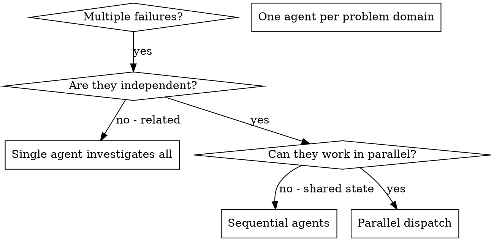

**Use when:**
- 3+ test files failing with different root causes
- Multiple subsystems broken independently
- Each problem can be understood without context from others
- No shared state between investigations

**Don't use when:**
- Failures are related (fix one might fix others)
- Need to understand full system state
- Agents would interfere with each other

## The Pattern

### 1. Identify Independent Domains

Group failures by what's broken:
- File A tests: Tool approval flow
- File B tests: Batch completion behavior
- File C tests: Abort functionality

Each domain is independent - fixing tool approval doesn't affect abort tests.

### 2. Create Focused Agent Tasks

Each agent gets:
- **Specific scope:** One test file or subsystem
- **Clear goal:** Make these tests pass
- **Constraints:** Don't change other code
- **Expected output:** Summary of what you found and fixed

### 3. Dispatch in Parallel

```typescript
// In Claude Code / AI environment
Task("Fix agent-tool-abort.test.ts failures")
Task("Fix batch-completion-behavior.test.ts failures")
Task("Fix tool-approval-race-conditions.test.ts failures")
// All three run concurrently
```

### 4. Review and Integrate

When agents return:
- Read each summary
- Verify fixes don't conflict
- Run full test suite
- Integrate all changes

## Agent Prompt Structure

Good agent prompts are:
1. **Focused** - One clear problem domain
2. **Self-contained** - All context needed to understand the problem
3. **Specific about output** - What should the agent return?

```markdown
Fix the 3 failing tests in src/agents/agent-tool-abort.test.ts:

1. "should abort tool with partial output capture" - expects 'interrupted at' in message
2. "should handle mixed completed and aborted tools" - fast tool aborted instead of completed
3. "should properly track pendingToolCount" - expects 3 results but gets 0

These are timing/race condition issues. Your task:

1. Read the test file and understand what each test verifies
2. Identify root cause - timing issues or actual bugs?
3. Fix by:
   - Replacing arbitrary timeouts with event-based waiting
   - Fixing bugs in abort implementation if found
   - Adjusting test expectations if testing changed behavior

Do NOT just increase timeouts - find the real issue.

Return: Summary of what you found and what you fixed.
```

## Common Mistakes

**❌ Too broad:** "Fix all the tests" - agent gets lost
**✅ Specific:** "Fix agent-tool-abort.test.ts" - focused scope

**❌ No context:** "Fix the race condition" - agent doesn't know where
**✅ Context:** Paste the error messages and test names

**❌ No constraints:** Agent might refactor everything
... snippet truncated ...
````

<!-- source-snippets:end -->
</details>
## 红旗清单

**绝不：**
- 在 main/master 分支上开始实施（未经用户明确同意）
- 跳过审查（规格合规或代码质量）
- 带着未修复的问题继续
- 并行分派多个实施子代理（会冲突）
- 让子代理读计划文件（应提供完整文本）
- 跳过场景设定上下文
- 忽略子代理问题
- 在规格合规上接受"差不多"
- 跳过审查循环
- 让实施者自审替代正式审查
- **在规格合规确认前开始代码质量审查**（顺序错误）
- 任一审查有未解决问题时就进入下一任务

Sources: [skills/subagent-driven-development/SKILL.md:200-240](../../../project-repos/superpowers/skills/subagent-driven-development/SKILL.md#L200-L240)

<details class="source-snippets">
<summary>引用源码</summary>

<!-- source-snippets:start -->

#### `skills/subagent-driven-development/SKILL.md:200-240`

````markdown
```

## Advantages

**vs. Manual execution:**
- Subagents follow TDD naturally
- Fresh context per task (no confusion)
- Parallel-safe (subagents don't interfere)
- Subagent can ask questions (before AND during work)

**vs. Executing Plans:**
- Same session (no handoff)
- Continuous progress (no waiting)
- Review checkpoints automatic

**Efficiency gains:**
- No file reading overhead (controller provides full text)
- Controller curates exactly what context is needed
- Subagent gets complete information upfront
- Questions surfaced before work begins (not after)

**Quality gates:**
- Self-review catches issues before handoff
- Two-stage review: spec compliance, then code quality
- Review loops ensure fixes actually work
- Spec compliance prevents over/under-building
- Code quality ensures implementation is well-built

**Cost:**
- More subagent invocations (implementer + 2 reviewers per task)
- Controller does more prep work (extracting all tasks upfront)
- Review loops add iterations
- But catches issues early (cheaper than debugging later)

## Red Flags

**Never:**
- Start implementation on main/master branch without explicit user consent
- Skip reviews (spec compliance OR code quality)
- Proceed with unfixed issues
- Dispatch multiple implementation subagents in parallel (conflicts)
````

<!-- source-snippets:end -->
</details>
## 相关页面

- [核心工作流](core-workflow.md)
- [技能体系](skills-system.md)
- [测试驱动与系统化调试](tdd-and-debugging.md)


---

<details>
<summary>相关源文件</summary>

生成本页时使用的主要源文件：

- [skills/using-superpowers/SKILL.md](https://github.com/obra/superpowers/blob/main/skills/using-superpowers/SKILL.md)
- [skills/writing-skills/SKILL.md](https://github.com/obra/superpowers/blob/main/skills/writing-skills/SKILL.md)
- [skills/brainstorming/SKILL.md](https://github.com/obra/superpowers/blob/main/skills/brainstorming/SKILL.md)
- [skills/writing-plans/SKILL.md](https://github.com/obra/superpowers/blob/main/skills/writing-plans/SKILL.md)
- [skills/test-driven-development/SKILL.md](https://github.com/obra/superpowers/blob/main/skills/test-driven-development/SKILL.md)
- [skills/systematic-debugging/SKILL.md](https://github.com/obra/superpowers/blob/main/skills/systematic-debugging/SKILL.md)
- [skills/requesting-code-review/SKILL.md](https://github.com/obra/superpowers/blob/main/skills/requesting-code-review/SKILL.md)
- [skills/receiving-code-review/SKILL.md](https://github.com/obra/superpowers/blob/main/skills/receiving-code-review/SKILL.md)
- [skills/dispatching-parallel-agents/SKILL.md](https://github.com/obra/superpowers/blob/main/skills/dispatching-parallel-agents/SKILL.md)
- [skills/executing-plans/SKILL.md](https://github.com/obra/superpowers/blob/main/skills/executing-plans/SKILL.md)
- [skills/finishing-a-development-branch/SKILL.md](https://github.com/obra/superpowers/blob/main/skills/finishing-a-development-branch/SKILL.md)
- [skills/using-git-worktrees/SKILL.md](https://github.com/obra/superpowers/blob/main/skills/using-git-worktrees/SKILL.md)
- [skills/verification-before-completion/SKILL.md](https://github.com/obra/superpowers/blob/main/skills/verification-before-completion/SKILL.md)

</details>

# 技能体系

Superpowers 包含 14 个技能，分为四大类别：测试、调试、协作和元技能。每个技能是一个 `SKILL.md` 文件加上可选的辅助文件，遵循统一的目录结构和 frontmatter 规范。

## 技能分类

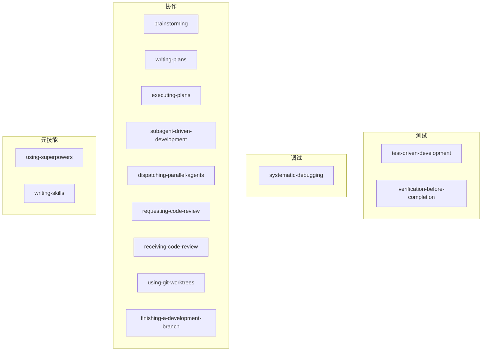

Sources: [README.md:82-128](../../../project-repos/superpowers/README.md#L82-L128), [skills/using-superpowers/SKILL.md](../../../project-repos/superpowers/skills/using-superpowers/SKILL.md)

<details class="source-snippets">
<summary>引用源码</summary>

<!-- source-snippets:start -->

#### `README.md:82-128`

````markdown
In Cursor Agent chat, install from marketplace:

```text
/add-plugin superpowers
```

or search for "superpowers" in the plugin marketplace.

### OpenCode

Tell OpenCode:

```
Fetch and follow instructions from https://raw.githubusercontent.com/obra/superpowers/refs/heads/main/.opencode/INSTALL.md
```

**Detailed docs:** [docs/README.opencode.md](docs/README.opencode.md)

### GitHub Copilot CLI

```bash
copilot plugin marketplace add obra/superpowers-marketplace
copilot plugin install superpowers@superpowers-marketplace
```

### Gemini CLI

```bash
gemini extensions install https://github.com/obra/superpowers
```

To update:

```bash
gemini extensions update superpowers
```

## The Basic Workflow

1. **brainstorming** - Activates before writing code. Refines rough ideas through questions, explores alternatives, presents design in sections for validation. Saves design document.

2. **using-git-worktrees** - Activates after design approval. Creates isolated workspace on new branch, runs project setup, verifies clean test baseline.

3. **writing-plans** - Activates with approved design. Breaks work into bite-sized tasks (2-5 minutes each). Every task has exact file paths, complete code, verification steps.

4. **subagent-driven-development** or **executing-plans** - Activates with plan. Dispatches fresh subagent per task with two-stage review (spec compliance, then code quality), or executes in batches with human checkpoints.

````

#### `skills/using-superpowers/SKILL.md`

````markdown
---
name: using-superpowers
description: Use when starting any conversation - establishes how to find and use skills, requiring Skill tool invocation before ANY response including clarifying questions
---

<SUBAGENT-STOP>
If you were dispatched as a subagent to execute a specific task, skip this skill.
</SUBAGENT-STOP>

<EXTREMELY-IMPORTANT>
If you think there is even a 1% chance a skill might apply to what you are doing, you ABSOLUTELY MUST invoke the skill.

IF A SKILL APPLIES TO YOUR TASK, YOU DO NOT HAVE A CHOICE. YOU MUST USE IT.

This is not negotiable. This is not optional. You cannot rationalize your way out of this.
</EXTREMELY-IMPORTANT>

## Instruction Priority

Superpowers skills override default system prompt behavior, but **user instructions always take precedence**:

1. **User's explicit instructions** (CLAUDE.md, GEMINI.md, AGENTS.md, direct requests) — highest priority
2. **Superpowers skills** — override default system behavior where they conflict
3. **Default system prompt** — lowest priority

If CLAUDE.md, GEMINI.md, or AGENTS.md says "don't use TDD" and a skill says "always use TDD," follow the user's instructions. The user is in control.

## How to Access Skills

**In Claude Code:** Use the `Skill` tool. When you invoke a skill, its content is loaded and presented to you—follow it directly. Never use the Read tool on skill files.

**In Copilot CLI:** Use the `skill` tool. Skills are auto-discovered from installed plugins. The `skill` tool works the same as Claude Code's `Skill` tool.

**In Gemini CLI:** Skills activate via the `activate_skill` tool. Gemini loads skill metadata at session start and activates the full content on demand.

**In other environments:** Check your platform's documentation for how skills are loaded.

## Platform Adaptation

Skills use Claude Code tool names. Non-CC platforms: see `references/copilot-tools.md` (Copilot CLI), `references/codex-tools.md` (Codex) for tool equivalents. Gemini CLI users get the tool mapping loaded automatically via GEMINI.md.

# Using Skills

## The Rule

**Invoke relevant or requested skills BEFORE any response or action.** Even a 1% chance a skill might apply means that you should invoke the skill to check. If an invoked skill turns out to be wrong for the situation, you don't need to use it.


## Red Flags

These thoughts mean STOP—you're rationalizing:

| Thought | Reality |
|---------|---------|
| "This is just a simple question" | Questions are tasks. Check for skills. |
| "I need more context first" | Skill check comes BEFORE clarifying questions. |
| "Let me explore the codebase first" | Skills tell you HOW to explore. Check first. |
| "I can check git/files quickly" | Files lack conversation context. Check for skills. |
| "Let me gather information first" | Skills tell you HOW to gather information. |
| "This doesn't need a formal skill" | If a skill exists, use it. |
| "I remember this skill" | Skills evolve. Read current version. |
| "This doesn't count as a task" | Action = task. Check for skills. |
| "The skill is overkill" | Simple things become complex. Use it. |
| "I'll just do this one thing first" | Check BEFORE doing anything. |
| "This feels productive" | Undisciplined action wastes time. Skills prevent this. |
| "I know what that means" | Knowing the concept ≠ using the skill. Invoke it. |

## Skill Priority

When multiple skills could apply, use this order:

1. **Process skills first** (brainstorming, debugging) - these determine HOW to approach the task
2. **Implementation skills second** (frontend-design, mcp-builder) - these guide execution

"Let's build X" → brainstorming first, then implementation skills.
"Fix this bug" → debugging first, then domain-specific skills.

## Skill Types

**Rigid** (TDD, debugging): Follow exactly. Don't adapt away discipline.

**Flexible** (patterns): Adapt principles to context.

The skill itself tells you which.

## User Instructions

Instructions say WHAT, not HOW. "Add X" or "Fix Y" doesn't mean skip workflows.
````

<!-- source-snippets:end -->
</details>
## 技能一览表

| 技能 | 类别 | 类型 | 核心原则 | 辅助文件 |
|------|------|------|----------|----------|
| using-superpowers | 元 | 灵活 | 1% 可能即调用 | references/ |
| brainstorming | 协作 | 灵活 | 先设计后实施 | scripts/, visual-companion.md, spec-document-reviewer-prompt.md |
| writing-plans | 协作 | 灵活 | 原子任务，无占位符 | plan-document-reviewer-prompt.md |
| executing-plans | 协作 | 刚性 | 按计划执行，遇阻即停 | — |
| subagent-driven-development | 协作 | 刚性 | 全新子代理 + 两阶段审查 | implementer-prompt.md, spec-reviewer-prompt.md, code-quality-reviewer-prompt.md |
| test-driven-development | 测试 | 刚性 | 先写测试，看它失败 | testing-anti-patterns.md |
| systematic-debugging | 调试 | 刚性 | 根因调查先于修复 | root-cause-tracing.md, defense-in-depth.md, condition-based-waiting.md |
| verification-before-completion | 测试 | 刚性 | 证据先于断言 | — |
| requesting-code-review | 协作 | 灵活 | 审查早且频繁 | code-reviewer.md |
| receiving-code-review | 协作 | 灵活 | 技术评估而非情感表演 | — |
| dispatching-parallel-agents | 协作 | 灵活 | 每个独立问题一个代理 | — |
| using-git-worktrees | 协作 | 灵活 | 系统化目录选择 + 安全验证 | — |
| finishing-a-development-branch | 协作 | 灵活 | 验证测试 → 提供选项 → 执行选择 | — |
| writing-skills | 元 | 灵活 | TDD 应用于文档 | anthropic-best-practices.md, testing-skills-with-subagents.md, render-graphs.js, graphviz-conventions.dot |

Sources: [skills/*/SKILL.md](../../../project-repos/superpowers/skills/%2A/SKILL.md)

<details class="source-snippets">
<summary>引用源码</summary>

<!-- source-snippets:start -->

#### `skills/*/SKILL.md`

> 未找到引用文件：`skills/*/SKILL.md`

<!-- source-snippets:end -->
</details>
## 技能类型：刚性 vs 灵活

技能分为两种类型，决定了遵循的严格程度：

### 刚性技能（Rigid）

TDD、调试等流程技能。必须严格遵循，不能偏离纪律。

- **test-driven-development**：RED-GREEN-REFACTOR 循环，铁律"没有失败测试就不写生产代码"
- **systematic-debugging**：四阶段流程，铁律"没有根因调查就不提修复"
- **verification-before-completion**：铁律"没有新鲜验证证据就不能声称完成"
- **subagent-driven-development**：两阶段审查顺序不可颠倒，审查循环不可跳过
- **executing-plans**：按计划步骤执行，遇阻塞立即停止

### 灵活技能（Flexible）

模式类技能。原则可适应上下文。

- **brainstorming**：问题数量和深度可根据项目复杂度调整
- **writing-plans**：任务粒度可根据项目规模调整
- **receiving-code-review**：反驳力度可根据审查来源调整

Sources: [skills/using-superpowers/SKILL.md:100-117](../../../project-repos/superpowers/skills/using-superpowers/SKILL.md#L100-L117)

<details class="source-snippets">
<summary>引用源码</summary>

<!-- source-snippets:start -->

#### `skills/using-superpowers/SKILL.md:100-117`

```markdown

1. **Process skills first** (brainstorming, debugging) - these determine HOW to approach the task
2. **Implementation skills second** (frontend-design, mcp-builder) - these guide execution

"Let's build X" → brainstorming first, then implementation skills.
"Fix this bug" → debugging first, then domain-specific skills.

## Skill Types

**Rigid** (TDD, debugging): Follow exactly. Don't adapt away discipline.

**Flexible** (patterns): Adapt principles to context.

The skill itself tells you which.

## User Instructions

Instructions say WHAT, not HOW. "Add X" or "Fix Y" doesn't mean skip workflows.
```

<!-- source-snippets:end -->
</details>
## SKILL.md 规范

每个技能必须包含 YAML frontmatter 和结构化的 Markdown 内容。

### Frontmatter

```yaml
---
name: skill-name-with-hyphens
description: Use when [specific triggering conditions and symptoms]
---
```

- `name`：仅使用字母、数字和连字符，最多 1024 字符
- `description`：第三人称，仅描述何时使用（不描述技能做什么），以 "Use when..." 开头，不超过 500 字符

### 内容结构

```markdown
# 技能名称

## Overview
核心原则 1-2 句话。

## When to Use
症状和使用场景列表。
何时不使用。

## Core Pattern / Checklist
核心流程或检查清单。

## Quick Reference
表格或要点，便于快速扫描。

## Common Mistakes
常见错误及修复。

## Red Flags
红旗思维模式。
```

Sources: [skills/writing-skills/SKILL.md:50-150](../../../project-repos/superpowers/skills/writing-skills/SKILL.md#L50-L150)

<details class="source-snippets">
<summary>引用源码</summary>

<!-- source-snippets:start -->

#### `skills/writing-skills/SKILL.md:50-150`

````markdown
- Technique wasn't intuitively obvious to you
- You'd reference this again across projects
- Pattern applies broadly (not project-specific)
- Others would benefit

**Don't create for:**
- One-off solutions
- Standard practices well-documented elsewhere
- Project-specific conventions (put in CLAUDE.md)
- Mechanical constraints (if it's enforceable with regex/validation, automate it—save documentation for judgment calls)

## Skill Types

### Technique
Concrete method with steps to follow (condition-based-waiting, root-cause-tracing)

### Pattern
Way of thinking about problems (flatten-with-flags, test-invariants)

### Reference
API docs, syntax guides, tool documentation (office docs)

## Directory Structure


```
skills/
  skill-name/
    SKILL.md              # Main reference (required)
    supporting-file.*     # Only if needed
```

**Flat namespace** - all skills in one searchable namespace

**Separate files for:**
1. **Heavy reference** (100+ lines) - API docs, comprehensive syntax
2. **Reusable tools** - Scripts, utilities, templates

**Keep inline:**
- Principles and concepts
- Code patterns (< 50 lines)
- Everything else

## SKILL.md Structure

**Frontmatter (YAML):**
- Two required fields: `name` and `description` (see [agentskills.io/specification](https://agentskills.io/specification) for all supported fields)
- Max 1024 characters total
- `name`: Use letters, numbers, and hyphens only (no parentheses, special chars)
- `description`: Third-person, describes ONLY when to use (NOT what it does)
  - Start with "Use when..." to focus on triggering conditions
  - Include specific symptoms, situations, and contexts
  - **NEVER summarize the skill's process or workflow** (see CSO section for why)
  - Keep under 500 characters if possible

```markdown
---
name: Skill-Name-With-Hyphens
description: Use when [specific triggering conditions and symptoms]
---

# Skill Name

## Overview
What is this? Core principle in 1-2 sentences.

## When to Use
[Small inline flowchart IF decision non-obvious]

Bullet list with SYMPTOMS and use cases
When NOT to use

## Core Pattern (for techniques/patterns)
Before/after code comparison

## Quick Reference
Table or bullets for scanning common operations

## Implementation
Inline code for simple patterns
Link to file for heavy reference or reusable tools

## Common Mistakes
What goes wrong + fixes

## Real-World Impact (optional)
Concrete results
```


## Claude Search Optimization (CSO)

**Critical for discovery:** Future Claude needs to FIND your skill

### 1. Rich Description Field

**Purpose:** Claude reads description to decide which skills to load for a given task. Make it answer: "Should I read this skill right now?"

**Format:** Start with "Use when..." to focus on triggering conditions

**CRITICAL: Description = When to Use, NOT What the Skill Does**
````

<!-- source-snippets:end -->
</details>
## Claude 搜索优化（CSO）

技能的发现依赖于 Claude 的搜索能力。CSO 策略确保技能能被正确找到和加载。

### 描述字段的陷阱

描述字段**只描述触发条件，不总结工作流**。测试发现，当描述总结了工作流时，Claude 可能直接遵循描述而非读取完整技能内容。

```yaml
# ❌ 错误：总结了工作流——Claude 可能跳过技能正文
description: Use when executing plans - dispatches subagent per task with code review between tasks

# ✅ 正确：只有触发条件
description: Use when executing implementation plans with independent tasks in the current session
```

实测案例：描述说"任务间代码审查"导致 Claude 只做一次审查，而技能流程图明确要求两阶段审查（规格合规 + 代码质量）。改为仅描述触发条件后，Claude 正确读取了流程图。

### 关键词覆盖

使用 Claude 会搜索的词汇：
- 错误消息："Hook timed out"、"ENOTEMPTY"、"race condition"
- 症状："flaky"、"hanging"、"zombie"、"pollution"
- 同义词："timeout/hang/freeze"、"cleanup/teardown/afterEach"
- 工具：实际命令名、库名、文件类型

### 命名规范

- 使用主动语态，动词优先：`creating-skills` 而非 `skill-creation`
- 动名词（-ing）适合流程：`brainstorming`、`writing-plans`
- 按核心洞察命名：`condition-based-waiting` 而非 `async-test-helpers`

### Token 效率

- 入门工作流：目标 < 150 词
- 频繁加载技能：目标 < 200 词
- 其他技能：目标 < 500 词

技巧：将细节移到工具帮助、使用交叉引用、压缩示例、消除冗余。

Sources: [skills/writing-skills/SKILL.md:150-300](../../../project-repos/superpowers/skills/writing-skills/SKILL.md#L150-L300)

<details class="source-snippets">
<summary>引用源码</summary>

<!-- source-snippets:start -->

#### `skills/writing-skills/SKILL.md:150-300`

````markdown
**CRITICAL: Description = When to Use, NOT What the Skill Does**

The description should ONLY describe triggering conditions. Do NOT summarize the skill's process or workflow in the description.

**Why this matters:** Testing revealed that when a description summarizes the skill's workflow, Claude may follow the description instead of reading the full skill content. A description saying "code review between tasks" caused Claude to do ONE review, even though the skill's flowchart clearly showed TWO reviews (spec compliance then code quality).

When the description was changed to just "Use when executing implementation plans with independent tasks" (no workflow summary), Claude correctly read the flowchart and followed the two-stage review process.

**The trap:** Descriptions that summarize workflow create a shortcut Claude will take. The skill body becomes documentation Claude skips.

```yaml
# ❌ BAD: Summarizes workflow - Claude may follow this instead of reading skill
description: Use when executing plans - dispatches subagent per task with code review between tasks

# ❌ BAD: Too much process detail
description: Use for TDD - write test first, watch it fail, write minimal code, refactor

# ✅ GOOD: Just triggering conditions, no workflow summary
description: Use when executing implementation plans with independent tasks in the current session

# ✅ GOOD: Triggering conditions only
description: Use when implementing any feature or bugfix, before writing implementation code
```

**Content:**
- Use concrete triggers, symptoms, and situations that signal this skill applies
- Describe the *problem* (race conditions, inconsistent behavior) not *language-specific symptoms* (setTimeout, sleep)
- Keep triggers technology-agnostic unless the skill itself is technology-specific
- If skill is technology-specific, make that explicit in the trigger
- Write in third person (injected into system prompt)
- **NEVER summarize the skill's process or workflow**

```yaml
# ❌ BAD: Too abstract, vague, doesn't include when to use
description: For async testing

# ❌ BAD: First person
description: I can help you with async tests when they're flaky

# ❌ BAD: Mentions technology but skill isn't specific to it
description: Use when tests use setTimeout/sleep and are flaky

# ✅ GOOD: Starts with "Use when", describes problem, no workflow
description: Use when tests have race conditions, timing dependencies, or pass/fail inconsistently

# ✅ GOOD: Technology-specific skill with explicit trigger
description: Use when using React Router and handling authentication redirects
```

### 2. Keyword Coverage

Use words Claude would search for:
- Error messages: "Hook timed out", "ENOTEMPTY", "race condition"
- Symptoms: "flaky", "hanging", "zombie", "pollution"
- Synonyms: "timeout/hang/freeze", "cleanup/teardown/afterEach"
- Tools: Actual commands, library names, file types

### 3. Descriptive Naming

**Use active voice, verb-first:**
- ✅ `creating-skills` not `skill-creation`
- ✅ `condition-based-waiting` not `async-test-helpers`

### 4. Token Efficiency (Critical)

**Problem:** getting-started and frequently-referenced skills load into EVERY conversation. Every token counts.

**Target word counts:**
- getting-started workflows: <150 words each
- Frequently-loaded skills: <200 words total
- Other skills: <500 words (still be concise)

**Techniques:**

**Move details to tool help:**
```bash
# ❌ BAD: Document all flags in SKILL.md
search-conversations supports --text, --both, --after DATE, --before DATE, --limit N

# ✅ GOOD: Reference --help
search-conversations supports multiple modes and filters. Run --help for details.
```

**Use cross-references:**
```markdown
# ❌ BAD: Repeat workflow details
When searching, dispatch subagent with template...
[20 lines of repeated instructions]

# ✅ GOOD: Reference other skill
Always use subagents (50-100x context savings). REQUIRED: Use [other-skill-name] for workflow.
```

**Compress examples:**
```markdown
# ❌ BAD: Verbose example (42 words)
your human partner: "How did we handle authentication errors in React Router before?"
You: I'll search past conversations for React Router authentication patterns.
[Dispatch subagent with search query: "React Router authentication error handling 401"]

# ✅ GOOD: Minimal example (20 words)
Partner: "How did we handle auth errors in React Router?"
You: Searching...
[Dispatch subagent → synthesis]
```

**Eliminate redundancy:**
- Don't repeat what's in cross-referenced skills
- Don't explain what's obvious from command
- Don't include multiple examples of same pattern

**Verification:**
```bash
wc -w skills/path/SKILL.md
# getting-started workflows: aim for <150 each
# Other frequently-loaded: aim for <200 total
```

**Name by what you DO or core insight:**
- ✅ `condition-based-waiting` > `async-test-helpers`
... snippet truncated ...
````

<!-- source-snippets:end -->
</details>
## 技能间的交叉引用

技能之间使用名称引用，带明确的必需标记：

- ✅ `**REQUIRED SUB-SKILL:** Use superpowers:test-driven-development`
- ✅ `**REQUIRED BACKGROUND:** You MUST understand superpowers:systematic-debugging`
- ❌ `See skills/testing/test-driven-development`（不清楚是否必需）
- ❌ `@skills/testing/test-driven-development/SKILL.md`（强制加载，浪费上下文）

`@` 语法会立即强制加载文件，消耗 200k+ 上下文，因此禁止使用。

Sources: [skills/writing-skills/SKILL.md:260-290](../../../project-repos/superpowers/skills/writing-skills/SKILL.md#L260-L290)

<details class="source-snippets">
<summary>引用源码</summary>

<!-- source-snippets:start -->

#### `skills/writing-skills/SKILL.md:260-290`

````markdown

**Verification:**
```bash
wc -w skills/path/SKILL.md
# getting-started workflows: aim for <150 each
# Other frequently-loaded: aim for <200 total
```

**Name by what you DO or core insight:**
- ✅ `condition-based-waiting` > `async-test-helpers`
- ✅ `using-skills` not `skill-usage`
- ✅ `flatten-with-flags` > `data-structure-refactoring`
- ✅ `root-cause-tracing` > `debugging-techniques`

**Gerunds (-ing) work well for processes:**
- `creating-skills`, `testing-skills`, `debugging-with-logs`
- Active, describes the action you're taking

### 4. Cross-Referencing Other Skills

**When writing documentation that references other skills:**

Use skill name only, with explicit requirement markers:
- ✅ Good: `**REQUIRED SUB-SKILL:** Use superpowers:test-driven-development`
- ✅ Good: `**REQUIRED BACKGROUND:** You MUST understand superpowers:systematic-debugging`
- ❌ Bad: `See skills/testing/test-driven-development` (unclear if required)
- ❌ Bad: `@skills/testing/test-driven-development/SKILL.md` (force-loads, burns context)

**Why no @ links:** `@` syntax force-loads files immediately, consuming 200k+ context before you need them.

## Flowchart Usage
````

<!-- source-snippets:end -->
</details>
## 相关页面

- [项目概览](overview.md)
- [核心工作流](core-workflow.md)
- [测试驱动与系统化调试](tdd-and-debugging.md)
- [扩展与贡献](extension-and-contribution.md)


---

<details>
<summary>相关源文件</summary>

生成本页时使用的主要源文件：

- [skills/test-driven-development/SKILL.md](https://github.com/obra/superpowers/blob/main/skills/test-driven-development/SKILL.md)
- [skills/test-driven-development/testing-anti-patterns.md](https://github.com/obra/superpowers/blob/main/skills/test-driven-development/testing-anti-patterns.md)
- [skills/systematic-debugging/SKILL.md](https://github.com/obra/superpowers/blob/main/skills/systematic-debugging/SKILL.md)
- [skills/systematic-debugging/root-cause-tracing.md](https://github.com/obra/superpowers/blob/main/skills/systematic-debugging/root-cause-tracing.md)
- [skills/systematic-debugging/defense-in-depth.md](https://github.com/obra/superpowers/blob/main/skills/systematic-debugging/defense-in-depth.md)
- [skills/systematic-debugging/condition-based-waiting.md](https://github.com/obra/superpowers/blob/main/skills/systematic-debugging/condition-based-waiting.md)
- [skills/verification-before-completion/SKILL.md](https://github.com/obra/superpowers/blob/main/skills/verification-before-completion/SKILL.md)

</details>

# 测试驱动与系统化调试

TDD 和系统化调试是 Superpowers 最刚性的两个方法论。它们共享一个核心信念：**未经证实的断言是不可信的**。TDD 要求先看到测试失败，调试要求先找到根因，验证要求先运行命令。

## 测试驱动开发（TDD）

### 铁律

```
没有失败测试就不写生产代码
```

先写了代码？删掉。重新开始。不是"参考"，不是"适配"，是删除。

### RED-GREEN-REFACTOR 循环

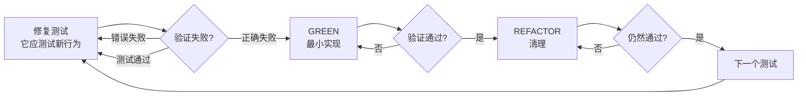

#### RED——编写失败测试

- 一个行为，一个测试
- 清晰的名称，描述期望行为
- 使用真实代码，避免 mock（除非不可避免）

#### 验证 RED——看它失败（强制）

确认：
- 测试失败（不是报错）
- 失败消息是预期的
- 失败因为功能缺失（不是拼写错误）

测试通过了？你在测试已有行为，修复测试。

#### GREEN——最小实现

写最简单的让测试通过的代码。不添加功能、不重构其他代码、不"顺便改进"。

#### 验证 GREEN——看它通过（强制）

确认：
- 测试通过
- 其他测试仍通过
- 输出干净（无错误、警告）

#### REFACTOR——清理

仅在绿色之后：
- 去除重复
- 改善命名
- 提取辅助函数

保持测试绿色，不添加行为。

Sources: [skills/test-driven-development/SKILL.md:1-100](../../../project-repos/superpowers/skills/test-driven-development/SKILL.md#L1-L100)

<details class="source-snippets">
<summary>引用源码</summary>

<!-- source-snippets:start -->

#### `skills/test-driven-development/SKILL.md:1-100`

````markdown
---
name: test-driven-development
description: Use when implementing any feature or bugfix, before writing implementation code
---

# Test-Driven Development (TDD)

## Overview

Write the test first. Watch it fail. Write minimal code to pass.

**Core principle:** If you didn't watch the test fail, you don't know if it tests the right thing.

**Violating the letter of the rules is violating the spirit of the rules.**

## When to Use

**Always:**
- New features
- Bug fixes
- Refactoring
- Behavior changes

**Exceptions (ask your human partner):**
- Throwaway prototypes
- Generated code
- Configuration files

Thinking "skip TDD just this once"? Stop. That's rationalization.

## The Iron Law

```
NO PRODUCTION CODE WITHOUT A FAILING TEST FIRST
```

Write code before the test? Delete it. Start over.

**No exceptions:**
- Don't keep it as "reference"
- Don't "adapt" it while writing tests
- Don't look at it
- Delete means delete

Implement fresh from tests. Period.

## Red-Green-Refactor

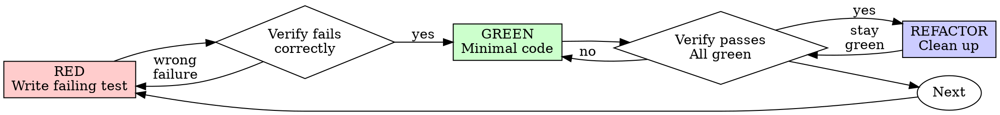

### RED - Write Failing Test

Write one minimal test showing what should happen.

<Good>
```typescript
test('retries failed operations 3 times', async () => {
  let attempts = 0;
  const operation = () => {
    attempts++;
    if (attempts < 3) throw new Error('fail');
    return 'success';
  };

  const result = await retryOperation(operation);

  expect(result).toBe('success');
  expect(attempts).toBe(3);
});
```
Clear name, tests real behavior, one thing
</Good>

<Bad>
```typescript
test('retry works', async () => {
  const mock = jest.fn()
    .mockRejectedValueOnce(new Error())
    .mockRejectedValueOnce(new Error())
    .mockResolvedValueOnce('success');
````

<!-- source-snippets:end -->
</details>
### 常见自我合理化

| 借口 | 现实 |
|------|------|
| "太简单不需要测试" | 简单代码也会出 bug，测试只需 30 秒 |
| "我稍后补测试" | 立即通过的测试证明不了什么 |
| "稍后测试达到同样效果" | 事后测试回答"这做了什么"，先行测试回答"这应该做什么" |
| "已经手动测试了" | 即兴 ≠ 系统化，无记录，无法重跑 |
| "删除 X 小时的工作太浪费" | 沉没成本谬误，保留不可信代码才是技术债 |
| "先保留作参考" | 你会"适配"它，那还是事后测试。删除就是删除 |
| "需要先探索" | 可以探索，但探索代码要扔掉，从 TDD 开始 |
| "测试难写 = 设计不清晰" | 听测试的，难测试 = 难使用 |

Sources: [skills/test-driven-development/SKILL.md:100-200](../../../project-repos/superpowers/skills/test-driven-development/SKILL.md#L100-L200)

<details class="source-snippets">
<summary>引用源码</summary>

<!-- source-snippets:start -->

#### `skills/test-driven-development/SKILL.md:100-200`

````markdown
    .mockResolvedValueOnce('success');
  await retryOperation(mock);
  expect(mock).toHaveBeenCalledTimes(3);
});
```
Vague name, tests mock not code
</Bad>

**Requirements:**
- One behavior
- Clear name
- Real code (no mocks unless unavoidable)

### Verify RED - Watch It Fail

**MANDATORY. Never skip.**

```bash
npm test path/to/test.test.ts
```

Confirm:
- Test fails (not errors)
- Failure message is expected
- Fails because feature missing (not typos)

**Test passes?** You're testing existing behavior. Fix test.

**Test errors?** Fix error, re-run until it fails correctly.

### GREEN - Minimal Code

Write simplest code to pass the test.

<Good>
```typescript
async function retryOperation<T>(fn: () => Promise<T>): Promise<T> {
  for (let i = 0; i < 3; i++) {
    try {
      return await fn();
    } catch (e) {
      if (i === 2) throw e;
    }
  }
  throw new Error('unreachable');
}
```
Just enough to pass
</Good>

<Bad>
```typescript
async function retryOperation<T>(
  fn: () => Promise<T>,
  options?: {
    maxRetries?: number;
    backoff?: 'linear' | 'exponential';
    onRetry?: (attempt: number) => void;
  }
): Promise<T> {
  // YAGNI
}
```
Over-engineered
</Bad>

Don't add features, refactor other code, or "improve" beyond the test.

### Verify GREEN - Watch It Pass

**MANDATORY.**

```bash
npm test path/to/test.test.ts
```

Confirm:
- Test passes
- Other tests still pass
- Output pristine (no errors, warnings)

**Test fails?** Fix code, not test.

**Other tests fail?** Fix now.

### REFACTOR - Clean Up

After green only:
- Remove duplication
- Improve names
- Extract helpers

Keep tests green. Don't add behavior.

### Repeat

Next failing test for next feature.

## Good Tests

| Quality | Good | Bad |
````

<!-- source-snippets:end -->
</details>
### 测试反模式

- 测试 mock 行为而非真实行为
- 在生产类中添加仅用于测试的方法
- 不理解依赖就添加 mock

Sources: [skills/test-driven-development/testing-anti-patterns.md](../../../project-repos/superpowers/skills/test-driven-development/testing-anti-patterns.md)

<details class="source-snippets">
<summary>引用源码</summary>

<!-- source-snippets:start -->

#### `skills/test-driven-development/testing-anti-patterns.md`

````markdown
# Testing Anti-Patterns

**Load this reference when:** writing or changing tests, adding mocks, or tempted to add test-only methods to production code.

## Overview

Tests must verify real behavior, not mock behavior. Mocks are a means to isolate, not the thing being tested.

**Core principle:** Test what the code does, not what the mocks do.

**Following strict TDD prevents these anti-patterns.**

## The Iron Laws

```
1. NEVER test mock behavior
2. NEVER add test-only methods to production classes
3. NEVER mock without understanding dependencies
```

## Anti-Pattern 1: Testing Mock Behavior

**The violation:**
```typescript
// ❌ BAD: Testing that the mock exists
test('renders sidebar', () => {
  render(<Page />);
  expect(screen.getByTestId('sidebar-mock')).toBeInTheDocument();
});
```

**Why this is wrong:**
- You're verifying the mock works, not that the component works
- Test passes when mock is present, fails when it's not
- Tells you nothing about real behavior

**your human partner's correction:** "Are we testing the behavior of a mock?"

**The fix:**
```typescript
// ✅ GOOD: Test real component or don't mock it
test('renders sidebar', () => {
  render(<Page />);  // Don't mock sidebar
  expect(screen.getByRole('navigation')).toBeInTheDocument();
});

// OR if sidebar must be mocked for isolation:
// Don't assert on the mock - test Page's behavior with sidebar present
```

### Gate Function

```
BEFORE asserting on any mock element:
  Ask: "Am I testing real component behavior or just mock existence?"

  IF testing mock existence:
    STOP - Delete the assertion or unmock the component

  Test real behavior instead
```

## Anti-Pattern 2: Test-Only Methods in Production

**The violation:**
```typescript
// ❌ BAD: destroy() only used in tests
class Session {
  async destroy() {  // Looks like production API!
    await this._workspaceManager?.destroyWorkspace(this.id);
    // ... cleanup
  }
}

// In tests
afterEach(() => session.destroy());
```

**Why this is wrong:**
- Production class polluted with test-only code
- Dangerous if accidentally called in production
- Violates YAGNI and separation of concerns
- Confuses object lifecycle with entity lifecycle

**The fix:**
```typescript
// ✅ GOOD: Test utilities handle test cleanup
// Session has no destroy() - it's stateless in production

// In test-utils/
export async function cleanupSession(session: Session) {
  const workspace = session.getWorkspaceInfo();
  if (workspace) {
    await workspaceManager.destroyWorkspace(workspace.id);
  }
}

// In tests
afterEach(() => cleanupSession(session));
```

### Gate Function

```
BEFORE adding any method to production class:
  Ask: "Is this only used by tests?"

  IF yes:
    STOP - Don't add it
    Put it in test utilities instead

  Ask: "Does this class own this resource's lifecycle?"

  IF no:
    STOP - Wrong class for this method
```

## Anti-Pattern 3: Mocking Without Understanding

**The violation:**
````

<!-- source-snippets:end -->
</details>
## 系统化调试

### 铁律

```
没有根因调查就不能提出修复
```

如果还没完成第一阶段，就不能提出修复方案。

### 四阶段流程

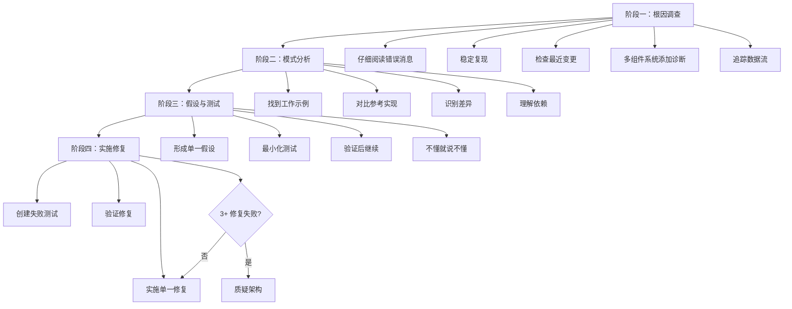

Sources: [skills/systematic-debugging/SKILL.md:1-60](../../../project-repos/superpowers/skills/systematic-debugging/SKILL.md#L1-L60)

<details class="source-snippets">
<summary>引用源码</summary>

<!-- source-snippets:start -->

#### `skills/systematic-debugging/SKILL.md:1-60`

````markdown
---
name: systematic-debugging
description: Use when encountering any bug, test failure, or unexpected behavior, before proposing fixes
---

# Systematic Debugging

## Overview

Random fixes waste time and create new bugs. Quick patches mask underlying issues.

**Core principle:** ALWAYS find root cause before attempting fixes. Symptom fixes are failure.

**Violating the letter of this process is violating the spirit of debugging.**

## The Iron Law

```
NO FIXES WITHOUT ROOT CAUSE INVESTIGATION FIRST
```

If you haven't completed Phase 1, you cannot propose fixes.

## When to Use

Use for ANY technical issue:
- Test failures
- Bugs in production
- Unexpected behavior
- Performance problems
- Build failures
- Integration issues

**Use this ESPECIALLY when:**
- Under time pressure (emergencies make guessing tempting)
- "Just one quick fix" seems obvious
- You've already tried multiple fixes
- Previous fix didn't work
- You don't fully understand the issue

**Don't skip when:**
- Issue seems simple (simple bugs have root causes too)
- You're in a hurry (rushing guarantees rework)
- Manager wants it fixed NOW (systematic is faster than thrashing)

## The Four Phases

You MUST complete each phase before proceeding to the next.

### Phase 1: Root Cause Investigation

**BEFORE attempting ANY fix:**

1. **Read Error Messages Carefully**
   - Don't skip past errors or warnings
   - They often contain the exact solution
   - Read stack traces completely
   - Note line numbers, file paths, error codes

2. **Reproduce Consistently**
````

<!-- source-snippets:end -->
</details>
### 阶段一：根因调查

在提出任何修复之前：

1. **仔细阅读错误消息**——不要跳过，通常包含精确解决方案
2. **稳定复现**——能可靠触发吗？每次都发生吗？不可复现就收集更多数据
3. **检查最近变更**——git diff、最近提交、新依赖、配置变更
4. **多组件系统添加诊断**——在每个组件边界记录进出数据，运行一次收集证据，定位失败组件
5. **追踪数据流**——坏值从哪里来？什么传入了坏值？一直追溯到源头

Sources: [skills/systematic-debugging/SKILL.md:60-120](../../../project-repos/superpowers/skills/systematic-debugging/SKILL.md#L60-L120)

<details class="source-snippets">
<summary>引用源码</summary>

<!-- source-snippets:start -->

#### `skills/systematic-debugging/SKILL.md:60-120`

````markdown
2. **Reproduce Consistently**
   - Can you trigger it reliably?
   - What are the exact steps?
   - Does it happen every time?
   - If not reproducible → gather more data, don't guess

3. **Check Recent Changes**
   - What changed that could cause this?
   - Git diff, recent commits
   - New dependencies, config changes
   - Environmental differences

4. **Gather Evidence in Multi-Component Systems**

   **WHEN system has multiple components (CI → build → signing, API → service → database):**

   **BEFORE proposing fixes, add diagnostic instrumentation:**
   ```
   For EACH component boundary:
     - Log what data enters component
     - Log what data exits component
     - Verify environment/config propagation
     - Check state at each layer

   Run once to gather evidence showing WHERE it breaks
   THEN analyze evidence to identify failing component
   THEN investigate that specific component
   ```

   **Example (multi-layer system):**
   ```bash
   # Layer 1: Workflow
   echo "=== Secrets available in workflow: ==="
   echo "IDENTITY: ${IDENTITY:+SET}${IDENTITY:-UNSET}"

   # Layer 2: Build script
   echo "=== Env vars in build script: ==="
   env | grep IDENTITY || echo "IDENTITY not in environment"

   # Layer 3: Signing script
   echo "=== Keychain state: ==="
   security list-keychains
   security find-identity -v

   # Layer 4: Actual signing
   codesign --sign "$IDENTITY" --verbose=4 "$APP"
   ```

   **This reveals:** Which layer fails (secrets → workflow ✓, workflow → build ✗)

5. **Trace Data Flow**

   **WHEN error is deep in call stack:**

   See `root-cause-tracing.md` in this directory for the complete backward tracing technique.

   **Quick version:**
   - Where does bad value originate?
   - What called this with bad value?
   - Keep tracing up until you find the source
   - Fix at source, not at symptom
````

<!-- source-snippets:end -->
</details>
### 阶段二：模式分析

1. 找到同类工作的代码
2. 完整阅读参考实现（不要略读）
3. 列出每个差异，无论多小
4. 理解所有依赖

### 阶段三：假设与测试

科学方法：
- 明确陈述："我认为 X 是根因，因为 Y"
- 做最小变更来测试假设
- 一次只改一个变量
- 不工作就形成新假设，不要叠加修复

### 阶段四：实施修复

1. 创建失败测试用例（使用 TDD 技能）
2. 实施单一修复，修复根因而非症状
3. 验证修复
4. **3+ 次修复失败**：质疑架构——每次修复都在不同地方暴露新问题，说明是架构问题而非实现问题

Sources: [skills/systematic-debugging/SKILL.md:120-200](../../../project-repos/superpowers/skills/systematic-debugging/SKILL.md#L120-L200)

<details class="source-snippets">
<summary>引用源码</summary>

<!-- source-snippets:start -->

#### `skills/systematic-debugging/SKILL.md:120-200`

```markdown
   - Fix at source, not at symptom

### Phase 2: Pattern Analysis

**Find the pattern before fixing:**

1. **Find Working Examples**
   - Locate similar working code in same codebase
   - What works that's similar to what's broken?

2. **Compare Against References**
   - If implementing pattern, read reference implementation COMPLETELY
   - Don't skim - read every line
   - Understand the pattern fully before applying

3. **Identify Differences**
   - What's different between working and broken?
   - List every difference, however small
   - Don't assume "that can't matter"

4. **Understand Dependencies**
   - What other components does this need?
   - What settings, config, environment?
   - What assumptions does it make?

### Phase 3: Hypothesis and Testing

**Scientific method:**

1. **Form Single Hypothesis**
   - State clearly: "I think X is the root cause because Y"
   - Write it down
   - Be specific, not vague

2. **Test Minimally**
   - Make the SMALLEST possible change to test hypothesis
   - One variable at a time
   - Don't fix multiple things at once

3. **Verify Before Continuing**
   - Did it work? Yes → Phase 4
   - Didn't work? Form NEW hypothesis
   - DON'T add more fixes on top

4. **When You Don't Know**
   - Say "I don't understand X"
   - Don't pretend to know
   - Ask for help
   - Research more

### Phase 4: Implementation

**Fix the root cause, not the symptom:**

1. **Create Failing Test Case**
   - Simplest possible reproduction
   - Automated test if possible
   - One-off test script if no framework
   - MUST have before fixing
   - Use the `superpowers:test-driven-development` skill for writing proper failing tests

2. **Implement Single Fix**
   - Address the root cause identified
   - ONE change at a time
   - No "while I'm here" improvements
   - No bundled refactoring

3. **Verify Fix**
   - Test passes now?
   - No other tests broken?
   - Issue actually resolved?

4. **If Fix Doesn't Work**
   - STOP
   - Count: How many fixes have you tried?
   - If < 3: Return to Phase 1, re-analyze with new information
   - **If ≥ 3: STOP and question the architecture (step 5 below)**
   - DON'T attempt Fix #4 without architectural discussion

5. **If 3+ Fixes Failed: Question Architecture**

```

<!-- source-snippets:end -->
</details>
### 辅助技术

| 技术 | 文件 | 用途 |
|------|------|------|
| 根因追踪 | root-cause-tracing.md | 从调用栈深处反向追踪坏值的源头 |
| 纵深防御 | defense-in-depth.md | 找到根因后在多层添加验证 |
| 条件等待 | condition-based-waiting.md | 用条件轮询替代任意超时 |

Sources: [skills/systematic-debugging/SKILL.md:240-270](../../../project-repos/superpowers/skills/systematic-debugging/SKILL.md#L240-L270)

<details class="source-snippets">
<summary>引用源码</summary>

<!-- source-snippets:start -->

#### `skills/systematic-debugging/SKILL.md:240-270`

```markdown
- "Ultrathink this" - Question fundamentals, not just symptoms
- "We're stuck?" (frustrated) - Your approach isn't working

**When you see these:** STOP. Return to Phase 1.

## Common Rationalizations

| Excuse | Reality |
|--------|---------|
| "Issue is simple, don't need process" | Simple issues have root causes too. Process is fast for simple bugs. |
| "Emergency, no time for process" | Systematic debugging is FASTER than guess-and-check thrashing. |
| "Just try this first, then investigate" | First fix sets the pattern. Do it right from the start. |
| "I'll write test after confirming fix works" | Untested fixes don't stick. Test first proves it. |
| "Multiple fixes at once saves time" | Can't isolate what worked. Causes new bugs. |
| "Reference too long, I'll adapt the pattern" | Partial understanding guarantees bugs. Read it completely. |
| "I see the problem, let me fix it" | Seeing symptoms ≠ understanding root cause. |
| "One more fix attempt" (after 2+ failures) | 3+ failures = architectural problem. Question pattern, don't fix again. |

## Quick Reference

| Phase | Key Activities | Success Criteria |
|-------|---------------|------------------|
| **1. Root Cause** | Read errors, reproduce, check changes, gather evidence | Understand WHAT and WHY |
| **2. Pattern** | Find working examples, compare | Identify differences |
| **3. Hypothesis** | Form theory, test minimally | Confirmed or new hypothesis |
| **4. Implementation** | Create test, fix, verify | Bug resolved, tests pass |

## When Process Reveals "No Root Cause"

If systematic investigation reveals issue is truly environmental, timing-dependent, or external:

```

<!-- source-snippets:end -->
</details>
## 验证先行原则

验证先行是贯穿 TDD 和调试的元原则。

### 铁律

```
没有新鲜验证证据就不能声称完成
```

如果在这个消息中没运行验证命令，就不能声称它通过。

### 门控函数

```
声称任何状态前：
1. 识别：什么命令能证明此声称？
2. 运行：执行完整命令
3. 阅读：完整输出 + 退出码 + 失败计数
4. 验证：输出是否确认声称？
5. 只有此时：做出声称
```

### 常见声称的验证要求

| 声称 | 必需 | 不充分 |
|------|------|--------|
| 测试通过 | 测试命令输出：0 失败 | 上次运行、"应该通过" |
| 构建成功 | 构建命令：exit 0 | Linter 通过、日志看起来正常 |
| Bug 已修复 | 测试原始症状：通过 | 代码改了、假设修好了 |
| 代理完成 | VCS diff 显示变更 | 代理报告"成功" |

Sources: [skills/verification-before-completion/SKILL.md:1-139](../../../project-repos/superpowers/skills/verification-before-completion/SKILL.md#L1-L139)

<details class="source-snippets">
<summary>引用源码</summary>

<!-- source-snippets:start -->

#### `skills/verification-before-completion/SKILL.md:1-139`

````markdown
---
name: verification-before-completion
description: Use when about to claim work is complete, fixed, or passing, before committing or creating PRs - requires running verification commands and confirming output before making any success claims; evidence before assertions always
---

# Verification Before Completion

## Overview

Claiming work is complete without verification is dishonesty, not efficiency.

**Core principle:** Evidence before claims, always.

**Violating the letter of this rule is violating the spirit of this rule.**

## The Iron Law

```
NO COMPLETION CLAIMS WITHOUT FRESH VERIFICATION EVIDENCE
```

If you haven't run the verification command in this message, you cannot claim it passes.

## The Gate Function

```
BEFORE claiming any status or expressing satisfaction:

1. IDENTIFY: What command proves this claim?
2. RUN: Execute the FULL command (fresh, complete)
3. READ: Full output, check exit code, count failures
4. VERIFY: Does output confirm the claim?
   - If NO: State actual status with evidence
   - If YES: State claim WITH evidence
5. ONLY THEN: Make the claim

Skip any step = lying, not verifying
```

## Common Failures

| Claim | Requires | Not Sufficient |
|-------|----------|----------------|
| Tests pass | Test command output: 0 failures | Previous run, "should pass" |
| Linter clean | Linter output: 0 errors | Partial check, extrapolation |
| Build succeeds | Build command: exit 0 | Linter passing, logs look good |
| Bug fixed | Test original symptom: passes | Code changed, assumed fixed |
| Regression test works | Red-green cycle verified | Test passes once |
| Agent completed | VCS diff shows changes | Agent reports "success" |
| Requirements met | Line-by-line checklist | Tests passing |

## Red Flags - STOP

- Using "should", "probably", "seems to"
- Expressing satisfaction before verification ("Great!", "Perfect!", "Done!", etc.)
- About to commit/push/PR without verification
- Trusting agent success reports
- Relying on partial verification
- Thinking "just this once"
- Tired and wanting work over
- **ANY wording implying success without having run verification**

## Rationalization Prevention

| Excuse | Reality |
|--------|---------|
| "Should work now" | RUN the verification |
| "I'm confident" | Confidence ≠ evidence |
| "Just this once" | No exceptions |
| "Linter passed" | Linter ≠ compiler |
| "Agent said success" | Verify independently |
| "I'm tired" | Exhaustion ≠ excuse |
| "Partial check is enough" | Partial proves nothing |
| "Different words so rule doesn't apply" | Spirit over letter |

## Key Patterns

**Tests:**
```
✅ [Run test command] [See: 34/34 pass] "All tests pass"
❌ "Should pass now" / "Looks correct"
```

**Regression tests (TDD Red-Green):**
```
✅ Write → Run (pass) → Revert fix → Run (MUST FAIL) → Restore → Run (pass)
❌ "I've written a regression test" (without red-green verification)
```

**Build:**
```
✅ [Run build] [See: exit 0] "Build passes"
❌ "Linter passed" (linter doesn't check compilation)
```

**Requirements:**
```
✅ Re-read plan → Create checklist → Verify each → Report gaps or completion
❌ "Tests pass, phase complete"
```

**Agent delegation:**
```
✅ Agent reports success → Check VCS diff → Verify changes → Report actual state
❌ Trust agent report
```

## Why This Matters

From 24 failure memories:
- your human partner said "I don't believe you" - trust broken
- Undefined functions shipped - would crash
- Missing requirements shipped - incomplete features
- Time wasted on false completion → redirect → rework
- Violates: "Honesty is a core value. If you lie, you'll be replaced."

## When To Apply

**ALWAYS before:**
- ANY variation of success/completion claims
... snippet truncated ...
````

<!-- source-snippets:end -->
</details>
## 三者的关系

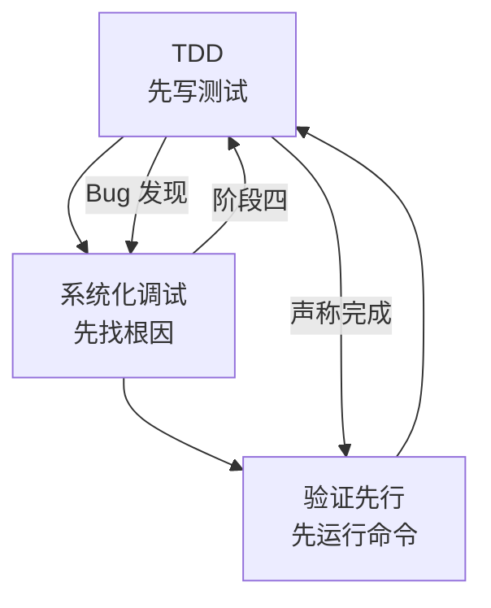

TDD 保证代码正确，调试保证修复有效，验证保证声称可信。三者形成闭环：TDD 中发现 bug 进入调试，调试的修复阶段使用 TDD，完成时使用验证先行。

Sources: [skills/test-driven-development/SKILL.md:350-371](../../../project-repos/superpowers/skills/test-driven-development/SKILL.md#L350-L371), [skills/systematic-debugging/SKILL.md:240-296](../../../project-repos/superpowers/skills/systematic-debugging/SKILL.md#L240-L296), [skills/verification-before-completion/SKILL.md:1-139](../../../project-repos/superpowers/skills/verification-before-completion/SKILL.md#L1-L139)

<details class="source-snippets">
<summary>引用源码</summary>

<!-- source-snippets:start -->

#### `skills/test-driven-development/SKILL.md:350-371`

````markdown

## Debugging Integration

Bug found? Write failing test reproducing it. Follow TDD cycle. Test proves fix and prevents regression.

Never fix bugs without a test.

## Testing Anti-Patterns

When adding mocks or test utilities, read @testing-anti-patterns.md to avoid common pitfalls:
- Testing mock behavior instead of real behavior
- Adding test-only methods to production classes
- Mocking without understanding dependencies

## Final Rule

```
Production code → test exists and failed first
Otherwise → not TDD
```

No exceptions without your human partner's permission.
````

#### `skills/systematic-debugging/SKILL.md:240-296`

```markdown
- "Ultrathink this" - Question fundamentals, not just symptoms
- "We're stuck?" (frustrated) - Your approach isn't working

**When you see these:** STOP. Return to Phase 1.

## Common Rationalizations

| Excuse | Reality |
|--------|---------|
| "Issue is simple, don't need process" | Simple issues have root causes too. Process is fast for simple bugs. |
| "Emergency, no time for process" | Systematic debugging is FASTER than guess-and-check thrashing. |
| "Just try this first, then investigate" | First fix sets the pattern. Do it right from the start. |
| "I'll write test after confirming fix works" | Untested fixes don't stick. Test first proves it. |
| "Multiple fixes at once saves time" | Can't isolate what worked. Causes new bugs. |
| "Reference too long, I'll adapt the pattern" | Partial understanding guarantees bugs. Read it completely. |
| "I see the problem, let me fix it" | Seeing symptoms ≠ understanding root cause. |
| "One more fix attempt" (after 2+ failures) | 3+ failures = architectural problem. Question pattern, don't fix again. |

## Quick Reference

| Phase | Key Activities | Success Criteria |
|-------|---------------|------------------|
| **1. Root Cause** | Read errors, reproduce, check changes, gather evidence | Understand WHAT and WHY |
| **2. Pattern** | Find working examples, compare | Identify differences |
| **3. Hypothesis** | Form theory, test minimally | Confirmed or new hypothesis |
| **4. Implementation** | Create test, fix, verify | Bug resolved, tests pass |

## When Process Reveals "No Root Cause"

If systematic investigation reveals issue is truly environmental, timing-dependent, or external:

1. You've completed the process
2. Document what you investigated
3. Implement appropriate handling (retry, timeout, error message)
4. Add monitoring/logging for future investigation

**But:** 95% of "no root cause" cases are incomplete investigation.

## Supporting Techniques

These techniques are part of systematic debugging and available in this directory:

- **`root-cause-tracing.md`** - Trace bugs backward through call stack to find original trigger
- **`defense-in-depth.md`** - Add validation at multiple layers after finding root cause
- **`condition-based-waiting.md`** - Replace arbitrary timeouts with condition polling

**Related skills:**
- **superpowers:test-driven-development** - For creating failing test case (Phase 4, Step 1)
- **superpowers:verification-before-completion** - Verify fix worked before claiming success

## Real-World Impact

From debugging sessions:
- Systematic approach: 15-30 minutes to fix
- Random fixes approach: 2-3 hours of thrashing
- First-time fix rate: 95% vs 40%
- New bugs introduced: Near zero vs common
```

#### `skills/verification-before-completion/SKILL.md:1-139`

````markdown
---
name: verification-before-completion
description: Use when about to claim work is complete, fixed, or passing, before committing or creating PRs - requires running verification commands and confirming output before making any success claims; evidence before assertions always
---

# Verification Before Completion

## Overview

Claiming work is complete without verification is dishonesty, not efficiency.

**Core principle:** Evidence before claims, always.

**Violating the letter of this rule is violating the spirit of this rule.**

## The Iron Law

```
NO COMPLETION CLAIMS WITHOUT FRESH VERIFICATION EVIDENCE
```

If you haven't run the verification command in this message, you cannot claim it passes.

## The Gate Function

```
BEFORE claiming any status or expressing satisfaction:

1. IDENTIFY: What command proves this claim?
2. RUN: Execute the FULL command (fresh, complete)
3. READ: Full output, check exit code, count failures
4. VERIFY: Does output confirm the claim?
   - If NO: State actual status with evidence
   - If YES: State claim WITH evidence
5. ONLY THEN: Make the claim

Skip any step = lying, not verifying
```

## Common Failures

| Claim | Requires | Not Sufficient |
|-------|----------|----------------|
| Tests pass | Test command output: 0 failures | Previous run, "should pass" |
| Linter clean | Linter output: 0 errors | Partial check, extrapolation |
| Build succeeds | Build command: exit 0 | Linter passing, logs look good |
| Bug fixed | Test original symptom: passes | Code changed, assumed fixed |
| Regression test works | Red-green cycle verified | Test passes once |
| Agent completed | VCS diff shows changes | Agent reports "success" |
| Requirements met | Line-by-line checklist | Tests passing |

## Red Flags - STOP

- Using "should", "probably", "seems to"
- Expressing satisfaction before verification ("Great!", "Perfect!", "Done!", etc.)
- About to commit/push/PR without verification
- Trusting agent success reports
- Relying on partial verification
- Thinking "just this once"
- Tired and wanting work over
- **ANY wording implying success without having run verification**

## Rationalization Prevention

| Excuse | Reality |
|--------|---------|
| "Should work now" | RUN the verification |
| "I'm confident" | Confidence ≠ evidence |
| "Just this once" | No exceptions |
| "Linter passed" | Linter ≠ compiler |
| "Agent said success" | Verify independently |
| "I'm tired" | Exhaustion ≠ excuse |
| "Partial check is enough" | Partial proves nothing |
| "Different words so rule doesn't apply" | Spirit over letter |

## Key Patterns

**Tests:**
```
✅ [Run test command] [See: 34/34 pass] "All tests pass"
❌ "Should pass now" / "Looks correct"
```

**Regression tests (TDD Red-Green):**
```
✅ Write → Run (pass) → Revert fix → Run (MUST FAIL) → Restore → Run (pass)
❌ "I've written a regression test" (without red-green verification)
```

**Build:**
```
✅ [Run build] [See: exit 0] "Build passes"
❌ "Linter passed" (linter doesn't check compilation)
```

**Requirements:**
```
✅ Re-read plan → Create checklist → Verify each → Report gaps or completion
❌ "Tests pass, phase complete"
```

**Agent delegation:**
```
✅ Agent reports success → Check VCS diff → Verify changes → Report actual state
❌ Trust agent report
```

## Why This Matters

From 24 failure memories:
- your human partner said "I don't believe you" - trust broken
- Undefined functions shipped - would crash
- Missing requirements shipped - incomplete features
- Time wasted on false completion → redirect → rework
- Violates: "Honesty is a core value. If you lie, you'll be replaced."

## When To Apply

**ALWAYS before:**
- ANY variation of success/completion claims
... snippet truncated ...
````

<!-- source-snippets:end -->
</details>
## 相关页面

- [技能体系](skills-system.md)
- [核心工作流](core-workflow.md)
- [测试与质量保障](testing-and-quality.md)


---

<details>
<summary>相关源文件</summary>

生成本页时使用的主要源文件：

- [skills/brainstorming/SKILL.md](https://github.com/obra/superpowers/blob/main/skills/brainstorming/SKILL.md)
- [skills/brainstorming/visual-companion.md](https://github.com/obra/superpowers/blob/main/skills/brainstorming/visual-companion.md)
- [skills/brainstorming/scripts/server.cjs](https://github.com/obra/superpowers/blob/main/skills/brainstorming/scripts/server.cjs)
- [skills/brainstorming/scripts/helper.js](https://github.com/obra/superpowers/blob/main/skills/brainstorming/scripts/helper.js)
- [skills/brainstorming/scripts/frame-template.html](https://github.com/obra/superpowers/blob/main/skills/brainstorming/scripts/frame-template.html)
- [skills/brainstorming/scripts/start-server.sh](https://github.com/obra/superpowers/blob/main/skills/brainstorming/scripts/start-server.sh)
- [skills/brainstorming/scripts/stop-server.sh](https://github.com/obra/superpowers/blob/main/skills/brainstorming/scripts/stop-server.sh)
- [skills/brainstorming/spec-document-reviewer-prompt.md](https://github.com/obra/superpowers/blob/main/skills/brainstorming/spec-document-reviewer-prompt.md)

</details>

# 可视化头脑风暴伴侣

可视化伴侣是 brainstorming 技能的扩展功能，提供一个基于浏览器的交互界面，用于在头脑风暴过程中展示模型、图表和视觉选项。它是一个零外部依赖的 WebSocket 服务器，代理写入 HTML 文件，浏览器自动展示最新内容，用户点击选择后代理读取交互事件。

## 架构概览

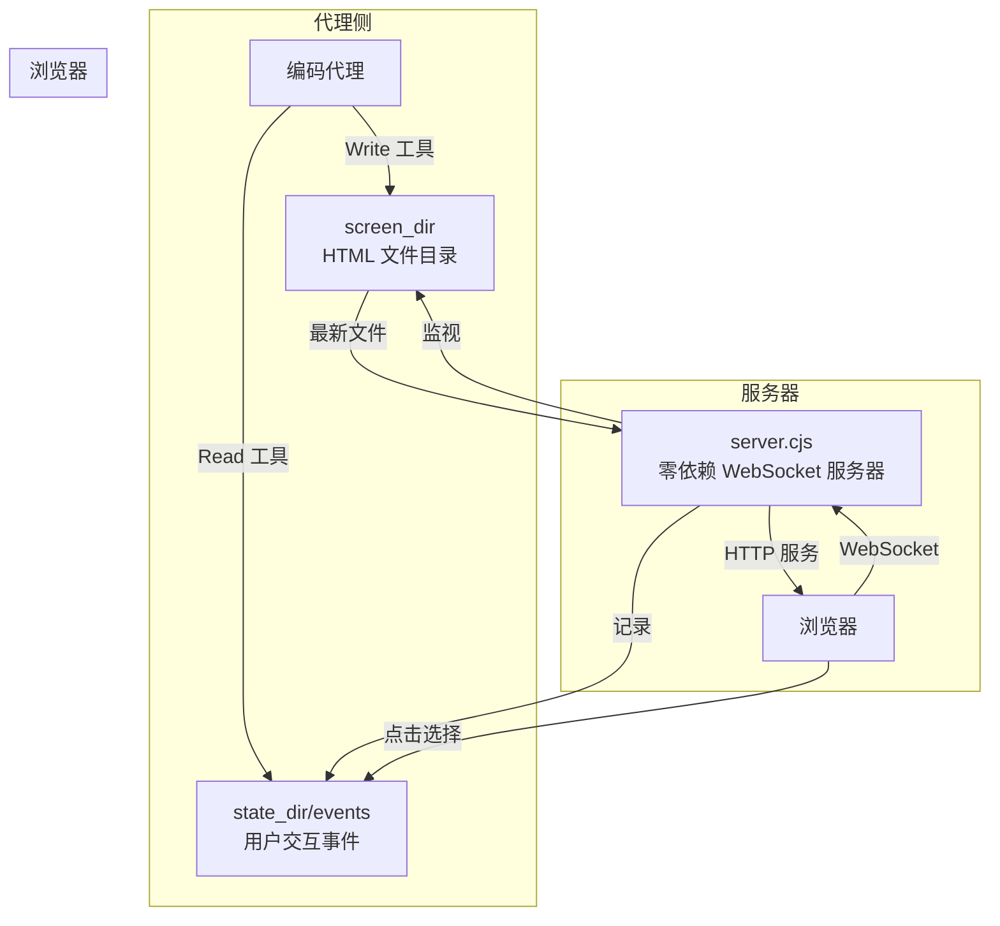

Sources: [skills/brainstorming/visual-companion.md:1-40](../../../project-repos/superpowers/skills/brainstorming/visual-companion.md#L1-L40), [skills/brainstorming/scripts/server.cjs:1-100](../../../project-repos/superpowers/skills/brainstorming/scripts/server.cjs#L1-L100)

<details class="source-snippets">
<summary>引用源码</summary>

<!-- source-snippets:start -->

#### `skills/brainstorming/visual-companion.md:1-40`

````markdown
# Visual Companion Guide

Browser-based visual brainstorming companion for showing mockups, diagrams, and options.

## When to Use

Decide per-question, not per-session. The test: **would the user understand this better by seeing it than reading it?**

**Use the browser** when the content itself is visual:

- **UI mockups** — wireframes, layouts, navigation structures, component designs
- **Architecture diagrams** — system components, data flow, relationship maps
- **Side-by-side visual comparisons** — comparing two layouts, two color schemes, two design directions
- **Design polish** — when the question is about look and feel, spacing, visual hierarchy
- **Spatial relationships** — state machines, flowcharts, entity relationships rendered as diagrams

**Use the terminal** when the content is text or tabular:

- **Requirements and scope questions** — "what does X mean?", "which features are in scope?"
- **Conceptual A/B/C choices** — picking between approaches described in words
- **Tradeoff lists** — pros/cons, comparison tables
- **Technical decisions** — API design, data modeling, architectural approach selection
- **Clarifying questions** — anything where the answer is words, not a visual preference

A question *about* a UI topic is not automatically a visual question. "What kind of wizard do you want?" is conceptual — use the terminal. "Which of these wizard layouts feels right?" is visual — use the browser.

## How It Works

The server watches a directory for HTML files and serves the newest one to the browser. You write HTML content to `screen_dir`, the user sees it in their browser and can click to select options. Selections are recorded to `state_dir/events` that you read on your next turn.

**Content fragments vs full documents:** If your HTML file starts with `<!DOCTYPE` or `<html`, the server serves it as-is (just injects the helper script). Otherwise, the server automatically wraps your content in the frame template — adding the header, CSS theme, selection indicator, and all interactive infrastructure. **Write content fragments by default.** Only write full documents when you need complete control over the page.

## Starting a Session

```bash
# Start server with persistence (mockups saved to project)
scripts/start-server.sh --project-dir /path/to/project

# Returns: {"type":"server-started","port":52341,"url":"http://localhost:52341",
#           "screen_dir":"/path/to/project/.superpowers/brainstorm/12345-1706000000/content",
````

#### `skills/brainstorming/scripts/server.cjs:1-100`

```javascript
const crypto = require('crypto');
const http = require('http');
const fs = require('fs');
const path = require('path');

// ========== WebSocket Protocol (RFC 6455) ==========

const OPCODES = { TEXT: 0x01, CLOSE: 0x08, PING: 0x09, PONG: 0x0A };
const WS_MAGIC = '258EAFA5-E914-47DA-95CA-C5AB0DC85B11';

function computeAcceptKey(clientKey) {
  return crypto.createHash('sha1').update(clientKey + WS_MAGIC).digest('base64');
}

function encodeFrame(opcode, payload) {
  const fin = 0x80;
  const len = payload.length;
  let header;

  if (len < 126) {
    header = Buffer.alloc(2);
    header[0] = fin | opcode;
    header[1] = len;
  } else if (len < 65536) {
    header = Buffer.alloc(4);
    header[0] = fin | opcode;
    header[1] = 126;
    header.writeUInt16BE(len, 2);
  } else {
    header = Buffer.alloc(10);
    header[0] = fin | opcode;
    header[1] = 127;
    header.writeBigUInt64BE(BigInt(len), 2);
  }

  return Buffer.concat([header, payload]);
}

function decodeFrame(buffer) {
  if (buffer.length < 2) return null;

  const secondByte = buffer[1];
  const opcode = buffer[0] & 0x0F;
  const masked = (secondByte & 0x80) !== 0;
  let payloadLen = secondByte & 0x7F;
  let offset = 2;

  if (!masked) throw new Error('Client frames must be masked');

  if (payloadLen === 126) {
    if (buffer.length < 4) return null;
    payloadLen = buffer.readUInt16BE(2);
    offset = 4;
  } else if (payloadLen === 127) {
    if (buffer.length < 10) return null;
    payloadLen = Number(buffer.readBigUInt64BE(2));
    offset = 10;
  }

  const maskOffset = offset;
  const dataOffset = offset + 4;
  const totalLen = dataOffset + payloadLen;
  if (buffer.length < totalLen) return null;

  const mask = buffer.slice(maskOffset, dataOffset);
  const data = Buffer.alloc(payloadLen);
  for (let i = 0; i < payloadLen; i++) {
    data[i] = buffer[dataOffset + i] ^ mask[i % 4];
  }

  return { opcode, payload: data, bytesConsumed: totalLen };
}

// ========== Configuration ==========

const PORT = process.env.BRAINSTORM_PORT || (49152 + Math.floor(Math.random() * 16383));
const HOST = process.env.BRAINSTORM_HOST || '127.0.0.1';
const URL_HOST = process.env.BRAINSTORM_URL_HOST || (HOST === '127.0.0.1' ? 'localhost' : HOST);
const SESSION_DIR = process.env.BRAINSTORM_DIR || '/tmp/brainstorm';
const CONTENT_DIR = path.join(SESSION_DIR, 'content');
const STATE_DIR = path.join(SESSION_DIR, 'state');
let ownerPid = process.env.BRAINSTORM_OWNER_PID ? Number(process.env.BRAINSTORM_OWNER_PID) : null;

const MIME_TYPES = {
  '.html': 'text/html', '.css': 'text/css', '.js': 'application/javascript',
  '.json': 'application/json', '.png': 'image/png', '.jpg': 'image/jpeg',
  '.jpeg': 'image/jpeg', '.gif': 'image/gif', '.svg': 'image/svg+xml'
};

// ========== Templates and Constants ==========

const WAITING_PAGE = `<!DOCTYPE html>
<html>
<head><meta charset="utf-8"><title>Brainstorm Companion</title>
<style>body { font-family: system-ui, sans-serif; padding: 2rem; max-width: 800px; margin: 0 auto; }
h1 { color: #333; } p { color: #666; }</style>
</head>
<body><h1>Brainstorm Companion</h1>
<p>Waiting for the agent to push a screen...</p></body></html>`;

```

<!-- source-snippets:end -->
</details>
## WebSocket 服务器实现

`server.cjs` 是一个**零外部依赖**的 Node.js 服务器，手动实现了 RFC 6455 WebSocket 协议：

### 核心组件

| 组件 | 功能 |
|------|------|
| `computeAcceptKey()` | WebSocket 握手密钥计算（SHA-1 + magic string） |
| `encodeFrame()` / `decodeFrame()` | WebSocket 帧的编码和解码 |
| HTTP 文件服务器 | 监视 `screen_dir`，自动提供最新 HTML 文件 |
| WebSocket 连接管理 | 处理客户端连接、消息和关闭 |
| 事件记录 | 将用户交互写入 `state_dir/events` |

### 配置

| 环境变量 | 默认值 | 说明 |
|----------|--------|------|
| `BRAINSTORM_PORT` | 随机高端口 (49152-65535) | 服务端口 |
| `BRAINSTORM_HOST` | `127.0.0.1` | 绑定地址 |
| `BRAINSTORM_URL_HOST` | `localhost`（当 HOST 为 127.0.0.1 时） | URL 中显示的主机名 |
| `BRAINSTORM_DIR` | `/tmp/brainstorm` | 会话目录 |
| `BRAINSTORM_OWNER_PID` | — | 所有者进程 PID，用于自动退出 |

Sources: [skills/brainstorming/scripts/server.cjs:25-50](../../../project-repos/superpowers/skills/brainstorming/scripts/server.cjs#L25-L50)

<details class="source-snippets">
<summary>引用源码</summary>

<!-- source-snippets:start -->

#### `skills/brainstorming/scripts/server.cjs:25-50`

```javascript
    header = Buffer.alloc(4);
    header[0] = fin | opcode;
    header[1] = 126;
    header.writeUInt16BE(len, 2);
  } else {
    header = Buffer.alloc(10);
    header[0] = fin | opcode;
    header[1] = 127;
    header.writeBigUInt64BE(BigInt(len), 2);
  }

  return Buffer.concat([header, payload]);
}

function decodeFrame(buffer) {
  if (buffer.length < 2) return null;

  const secondByte = buffer[1];
  const opcode = buffer[0] & 0x0F;
  const masked = (secondByte & 0x80) !== 0;
  let payloadLen = secondByte & 0x7F;
  let offset = 2;

  if (!masked) throw new Error('Client frames must be masked');

  if (payloadLen === 126) {
```

<!-- source-snippets:end -->
</details>
## 交互循环

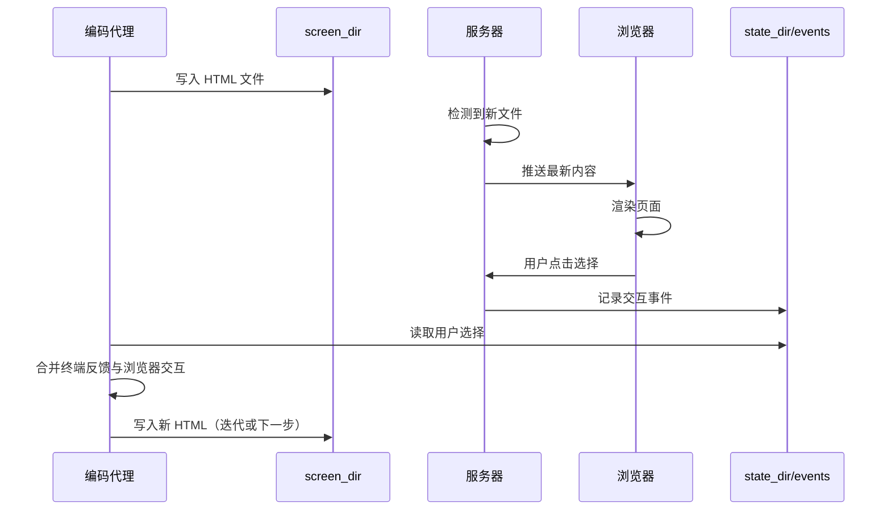

Sources: [skills/brainstorming/visual-companion.md:60-120](../../../project-repos/superpowers/skills/brainstorming/visual-companion.md#L60-L120)

<details class="source-snippets">
<summary>引用源码</summary>

<!-- source-snippets:start -->

#### `skills/brainstorming/visual-companion.md:60-120`

````markdown
# Windows auto-detects and uses foreground mode, which blocks the tool call.
# Use run_in_background: true on the Bash tool call so the server survives
# across conversation turns.
scripts/start-server.sh --project-dir /path/to/project
```
When calling this via the Bash tool, set `run_in_background: true`. Then read `$STATE_DIR/server-info` on the next turn to get the URL and port.

**Codex:**
```bash
# Codex reaps background processes. The script auto-detects CODEX_CI and
# switches to foreground mode. Run it normally — no extra flags needed.
scripts/start-server.sh --project-dir /path/to/project
```

**Gemini CLI:**
```bash
# Use --foreground and set is_background: true on your shell tool call
# so the process survives across turns
scripts/start-server.sh --project-dir /path/to/project --foreground
```

**Other environments:** The server must keep running in the background across conversation turns. If your environment reaps detached processes, use `--foreground` and launch the command with your platform's background execution mechanism.

If the URL is unreachable from your browser (common in remote/containerized setups), bind a non-loopback host:

```bash
scripts/start-server.sh \
  --project-dir /path/to/project \
  --host 0.0.0.0 \
  --url-host localhost
```

Use `--url-host` to control what hostname is printed in the returned URL JSON.

## The Loop

1. **Check server is alive**, then **write HTML** to a new file in `screen_dir`:
   - Before each write, check that `$STATE_DIR/server-info` exists. If it doesn't (or `$STATE_DIR/server-stopped` exists), the server has shut down — restart it with `start-server.sh` before continuing. The server auto-exits after 30 minutes of inactivity.
   - Use semantic filenames: `platform.html`, `visual-style.html`, `layout.html`
   - **Never reuse filenames** — each screen gets a fresh file
   - Use Write tool — **never use cat/heredoc** (dumps noise into terminal)
   - Server automatically serves the newest file

2. **Tell user what to expect and end your turn:**
   - Remind them of the URL (every step, not just first)
   - Give a brief text summary of what's on screen (e.g., "Showing 3 layout options for the homepage")
   - Ask them to respond in the terminal: "Take a look and let me know what you think. Click to select an option if you'd like."

3. **On your next turn** — after the user responds in the terminal:
   - Read `$STATE_DIR/events` if it exists — this contains the user's browser interactions (clicks, selections) as JSON lines
   - Merge with the user's terminal text to get the full picture
   - The terminal message is the primary feedback; `state_dir/events` provides structured interaction data

4. **Iterate or advance** — if feedback changes current screen, write a new file (e.g., `layout-v2.html`). Only move to the next question when the current step is validated.

5. **Unload when returning to terminal** — when the next step doesn't need the browser (e.g., a clarifying question, a tradeoff discussion), push a waiting screen to clear the stale content:

   ```html
   <!-- filename: waiting.html (or waiting-2.html, etc.) -->
   <div style="display:flex;align-items:center;justify-content:center;min-height:60vh">
     <p class="subtitle">Continuing in terminal...</p>
````

<!-- source-snippets:end -->
</details>
## 内容模板系统

服务器提供两种模式：

### 内容片段模式（默认）

如果 HTML 文件不以 `<!DOCTYPE` 或 `<html` 开头，服务器自动用 frame template 包装——添加页头、CSS 主题、选择指示器和所有交互基础设施。

### 完整文档模式

如果 HTML 文件以 `<!DOCTYPE` 或 `<html` 开头，服务器原样提供（仅注入 helper 脚本）。

### 可用 CSS 类

| 类名 | 用途 |
|------|------|
| `.options` > `.option` | A/B/C 选择项，支持 `data-choice` 和 `onclick="toggleSelect(this)"` |
| `.options[data-multiselect]` | 多选模式 |
| `.cards` > `.card` | 视觉设计卡片 |
| `.card-image` | 卡片中的模型内容 |
| `.subtitle` | 副标题文本 |

Sources: [skills/brainstorming/visual-companion.md:120-200](../../../project-repos/superpowers/skills/brainstorming/visual-companion.md#L120-L200)

<details class="source-snippets">
<summary>引用源码</summary>

<!-- source-snippets:start -->

#### `skills/brainstorming/visual-companion.md:120-200`

````markdown
     <p class="subtitle">Continuing in terminal...</p>
   </div>
   ```

   This prevents the user from staring at a resolved choice while the conversation has moved on. When the next visual question comes up, push a new content file as usual.

6. Repeat until done.

## Writing Content Fragments

Write just the content that goes inside the page. The server wraps it in the frame template automatically (header, theme CSS, selection indicator, and all interactive infrastructure).

**Minimal example:**

```html
<h2>Which layout works better?</h2>
<p class="subtitle">Consider readability and visual hierarchy</p>

<div class="options">
  <div class="option" data-choice="a" onclick="toggleSelect(this)">
    <div class="letter">A</div>
    <div class="content">
      <h3>Single Column</h3>
      <p>Clean, focused reading experience</p>
    </div>
  </div>
  <div class="option" data-choice="b" onclick="toggleSelect(this)">
    <div class="letter">B</div>
    <div class="content">
      <h3>Two Column</h3>
      <p>Sidebar navigation with main content</p>
    </div>
  </div>
</div>
```

That's it. No `<html>`, no CSS, no `<script>` tags needed. The server provides all of that.

## CSS Classes Available

The frame template provides these CSS classes for your content:

### Options (A/B/C choices)

```html
<div class="options">
  <div class="option" data-choice="a" onclick="toggleSelect(this)">
    <div class="letter">A</div>
    <div class="content">
      <h3>Title</h3>
      <p>Description</p>
    </div>
  </div>
</div>
```

**Multi-select:** Add `data-multiselect` to the container to let users select multiple options. Each click toggles the item. The indicator bar shows the count.

```html
<div class="options" data-multiselect>
  <!-- same option markup — users can select/deselect multiple -->
</div>
```

### Cards (visual designs)

```html
<div class="cards">
  <div class="card" data-choice="design1" onclick="toggleSelect(this)">
    <div class="card-image"><!-- mockup content --></div>
    <div class="card-body">
      <h3>Name</h3>
      <p>Description</p>
    </div>
  </div>
</div>
```

### Mockup container

```html
````

<!-- source-snippets:end -->
</details>
## 何时使用浏览器 vs 终端

**逐问题决定，而非逐会话决定**。判断标准：用户通过看比通过读更能理解吗？

| 使用浏览器 | 使用终端 |
|-----------|---------|
| UI 模型、线框图 | 需求和范围问题 |
| 架构图 | 概念性 A/B/C 选择 |
| 并排视觉比较 | 权衡列表 |
| 设计打磨（间距、视觉层次） | 技术决策 |
| 空间关系（状态机、流程图） | 澄清问题 |

关于 UI 的问题不自动是视觉问题。"你想要什么样的向导？"是概念性的——用终端。"哪种向导布局更好？"是视觉性的——用浏览器。

Sources: [skills/brainstorming/visual-companion.md:1-40](../../../project-repos/superpowers/skills/brainstorming/visual-companion.md#L1-L40)

<details class="source-snippets">
<summary>引用源码</summary>

<!-- source-snippets:start -->

#### `skills/brainstorming/visual-companion.md:1-40`

````markdown
# Visual Companion Guide

Browser-based visual brainstorming companion for showing mockups, diagrams, and options.

## When to Use

Decide per-question, not per-session. The test: **would the user understand this better by seeing it than reading it?**

**Use the browser** when the content itself is visual:

- **UI mockups** — wireframes, layouts, navigation structures, component designs
- **Architecture diagrams** — system components, data flow, relationship maps
- **Side-by-side visual comparisons** — comparing two layouts, two color schemes, two design directions
- **Design polish** — when the question is about look and feel, spacing, visual hierarchy
- **Spatial relationships** — state machines, flowcharts, entity relationships rendered as diagrams

**Use the terminal** when the content is text or tabular:

- **Requirements and scope questions** — "what does X mean?", "which features are in scope?"
- **Conceptual A/B/C choices** — picking between approaches described in words
- **Tradeoff lists** — pros/cons, comparison tables
- **Technical decisions** — API design, data modeling, architectural approach selection
- **Clarifying questions** — anything where the answer is words, not a visual preference

A question *about* a UI topic is not automatically a visual question. "What kind of wizard do you want?" is conceptual — use the terminal. "Which of these wizard layouts feels right?" is visual — use the browser.

## How It Works

The server watches a directory for HTML files and serves the newest one to the browser. You write HTML content to `screen_dir`, the user sees it in their browser and can click to select options. Selections are recorded to `state_dir/events` that you read on your next turn.

**Content fragments vs full documents:** If your HTML file starts with `<!DOCTYPE` or `<html`, the server serves it as-is (just injects the helper script). Otherwise, the server automatically wraps your content in the frame template — adding the header, CSS theme, selection indicator, and all interactive infrastructure. **Write content fragments by default.** Only write full documents when you need complete control over the page.

## Starting a Session

```bash
# Start server with persistence (mockups saved to project)
scripts/start-server.sh --project-dir /path/to/project

# Returns: {"type":"server-started","port":52341,"url":"http://localhost:52341",
#           "screen_dir":"/path/to/project/.superpowers/brainstorm/12345-1706000000/content",
````

<!-- source-snippets:end -->
</details>
## 跨平台启动方式

| 平台 | 启动命令 | 注意事项 |
|------|----------|----------|
| Claude Code (macOS/Linux) | `scripts/start-server.sh --project-dir /path` | 默认后台模式 |
| Claude Code (Windows) | `scripts/start-server.sh --project-dir /path` | Bash 工具需设 `run_in_background: true` |
| Codex | `scripts/start-server.sh --project-dir /path` | 自动检测 CODEX_CI，前台模式 |
| Gemini CLI | `scripts/start-server.sh --project-dir /path --foreground` | 需 `is_background: true` |
| 远程/容器 | `--host 0.0.0.0 --url-host localhost` | 绑定非回环地址 |

服务器在 30 分钟不活动后自动退出。如果 `$STATE_DIR/server-info` 不存在或 `$STATE_DIR/server-stopped` 存在，说明服务器已关闭，需要重启。

Sources: [skills/brainstorming/visual-companion.md:40-100](../../../project-repos/superpowers/skills/brainstorming/visual-companion.md#L40-L100)

<details class="source-snippets">
<summary>引用源码</summary>

<!-- source-snippets:start -->

#### `skills/brainstorming/visual-companion.md:40-100`

````markdown
#           "screen_dir":"/path/to/project/.superpowers/brainstorm/12345-1706000000/content",
#           "state_dir":"/path/to/project/.superpowers/brainstorm/12345-1706000000/state"}
```

Save `screen_dir` and `state_dir` from the response. Tell user to open the URL.

**Finding connection info:** The server writes its startup JSON to `$STATE_DIR/server-info`. If you launched the server in the background and didn't capture stdout, read that file to get the URL and port. When using `--project-dir`, check `<project>/.superpowers/brainstorm/` for the session directory.

**Note:** Pass the project root as `--project-dir` so mockups persist in `.superpowers/brainstorm/` and survive server restarts. Without it, files go to `/tmp` and get cleaned up. Remind the user to add `.superpowers/` to `.gitignore` if it's not already there.

**Launching the server by platform:**

**Claude Code (macOS / Linux):**
```bash
# Default mode works — the script backgrounds the server itself
scripts/start-server.sh --project-dir /path/to/project
```

**Claude Code (Windows):**
```bash
# Windows auto-detects and uses foreground mode, which blocks the tool call.
# Use run_in_background: true on the Bash tool call so the server survives
# across conversation turns.
scripts/start-server.sh --project-dir /path/to/project
```
When calling this via the Bash tool, set `run_in_background: true`. Then read `$STATE_DIR/server-info` on the next turn to get the URL and port.

**Codex:**
```bash
# Codex reaps background processes. The script auto-detects CODEX_CI and
# switches to foreground mode. Run it normally — no extra flags needed.
scripts/start-server.sh --project-dir /path/to/project
```

**Gemini CLI:**
```bash
# Use --foreground and set is_background: true on your shell tool call
# so the process survives across turns
scripts/start-server.sh --project-dir /path/to/project --foreground
```

**Other environments:** The server must keep running in the background across conversation turns. If your environment reaps detached processes, use `--foreground` and launch the command with your platform's background execution mechanism.

If the URL is unreachable from your browser (common in remote/containerized setups), bind a non-loopback host:

```bash
scripts/start-server.sh \
  --project-dir /path/to/project \
  --host 0.0.0.0 \
  --url-host localhost
```

Use `--url-host` to control what hostname is printed in the returned URL JSON.

## The Loop

1. **Check server is alive**, then **write HTML** to a new file in `screen_dir`:
   - Before each write, check that `$STATE_DIR/server-info` exists. If it doesn't (or `$STATE_DIR/server-stopped` exists), the server has shut down — restart it with `start-server.sh` before continuing. The server auto-exits after 30 minutes of inactivity.
   - Use semantic filenames: `platform.html`, `visual-style.html`, `layout.html`
   - **Never reuse filenames** — each screen gets a fresh file
   - Use Write tool — **never use cat/heredoc** (dumps noise into terminal)
````

<!-- source-snippets:end -->
</details>
## 规格文档审查

brainstorming 技能还包含一个 `spec-document-reviewer-prompt.md`，用于在头脑风暴完成后对生成的规格文档进行审查，确保文档质量符合标准。

Sources: [skills/brainstorming/spec-document-reviewer-prompt.md](../../../project-repos/superpowers/skills/brainstorming/spec-document-reviewer-prompt.md)

<details class="source-snippets">
<summary>引用源码</summary>

<!-- source-snippets:start -->

#### `skills/brainstorming/spec-document-reviewer-prompt.md`

````markdown
# Spec Document Reviewer Prompt Template

Use this template when dispatching a spec document reviewer subagent.

**Purpose:** Verify the spec is complete, consistent, and ready for implementation planning.

**Dispatch after:** Spec document is written to docs/superpowers/specs/

```
Task tool (general-purpose):
  description: "Review spec document"
  prompt: |
    You are a spec document reviewer. Verify this spec is complete and ready for planning.

    **Spec to review:** [SPEC_FILE_PATH]

    ## What to Check

    | Category | What to Look For |
    |----------|------------------|
    | Completeness | TODOs, placeholders, "TBD", incomplete sections |
    | Consistency | Internal contradictions, conflicting requirements |
    | Clarity | Requirements ambiguous enough to cause someone to build the wrong thing |
    | Scope | Focused enough for a single plan — not covering multiple independent subsystems |
    | YAGNI | Unrequested features, over-engineering |

    ## Calibration

    **Only flag issues that would cause real problems during implementation planning.**
    A missing section, a contradiction, or a requirement so ambiguous it could be
    interpreted two different ways — those are issues. Minor wording improvements,
    stylistic preferences, and "sections less detailed than others" are not.

    Approve unless there are serious gaps that would lead to a flawed plan.

    ## Output Format

    ## Spec Review

    **Status:** Approved | Issues Found

    **Issues (if any):**
    - [Section X]: [specific issue] - [why it matters for planning]

    **Recommendations (advisory, do not block approval):**
    - [suggestions for improvement]
```

**Reviewer returns:** Status, Issues (if any), Recommendations
````

<!-- source-snippets:end -->
</details>
## 相关页面

- [核心工作流](core-workflow.md)
- [系统架构](system-architecture.md)


---

<details>
<summary>相关源文件</summary>

生成本页时使用的主要源文件：

- [docs/testing.md](https://github.com/obra/superpowers/blob/main/docs/testing.md)
- [tests/claude-code/run-skill-tests.sh](https://github.com/obra/superpowers/blob/main/tests/claude-code/run-skill-tests.sh)
- [tests/claude-code/test-helpers.sh](https://github.com/obra/superpowers/blob/main/tests/claude-code/test-helpers.sh)
- [tests/claude-code/test-subagent-driven-development.sh](https://github.com/obra/superpowers/blob/main/tests/claude-code/test-subagent-driven-development.sh)
- [tests/claude-code/test-subagent-driven-development-integration.sh](https://github.com/obra/superpowers/blob/main/tests/claude-code/test-subagent-driven-development-integration.sh)
- [tests/claude-code/analyze-token-usage.py](https://github.com/obra/superpowers/blob/main/tests/claude-code/analyze-token-usage.py)
- [tests/brainstorm-server/server.test.js](https://github.com/obra/superpowers/blob/main/tests/brainstorm-server/server.test.js)
- [tests/brainstorm-server/ws-protocol.test.js](https://github.com/obra/superpowers/blob/main/tests/brainstorm-server/ws-protocol.test.js)
- [tests/skill-triggering/run-test.sh](https://github.com/obra/superpowers/blob/main/tests/skill-triggering/run-test.sh)
- [tests/explicit-skill-requests/run-test.sh](https://github.com/obra/superpowers/blob/main/tests/explicit-skill-requests/run-test.sh)
- [tests/opencode/run-tests.sh](https://github.com/obra/superpowers/blob/main/tests/opencode/run-tests.sh)

</details>

# 测试与质量保障

Superpowers 的测试体系分为两层：**技能行为测试**（验证代理是否正确触发和遵循技能）和**组件功能测试**（验证可视化伴侣等组件的技术正确性）。由于技能本质上是影响代理行为的文档，其测试方式不同于传统软件——需要运行真实的编码代理会话并分析会话记录。

## 测试架构

```mermaid
graph TD
    subgraph ID1["技能行为测试"]
        ST[skill-triggering&lt;br/&gt;技能触发测试]
        ER[explicit-skill-requests&lt;br/&gt;显式技能请求测试]
        SDD[subagent-driven-dev&lt;br/&gt;SDD 集成测试]
        OC[opencode&lt;br/&gt;OpenCode 插件测试]
    end

    subgraph ID2["组件功能测试"]
        BS[brainstorm-server&lt;br/&gt;WebSocket 服务器测试]
        CS[codex-plugin-sync&lt;br/&gt;Codex 同步测试]
    end

    subgraph ID3["分析工具"]
        AT[analyze-token-usage.py&lt;br/&gt;Token 用量分析]
    end

    ST -->|验证| V1[技能是否被正确触发]
    ER -->|验证| V2[显式请求是否加载正确技能]
    SDD -->|验证| V3[SDD 流程是否完整执行]
    OC -->|验证| V4[OpenCode 插件是否正常加载]
    BS -->|验证| V5[WebSocket 协议与文件服务]
    CS -->|验证| V6[Codex 插件同步正确性]
    AT -->|分析| V7[会话 Token 用量与成本]
```

Sources: [docs/testing.md:1-50](../../../project-repos/superpowers/docs/testing.md#L1-L50), [00-repo-inventory.md](../00-repo-inventory.md)

<details class="source-snippets">
<summary>引用源码</summary>

<!-- source-snippets:start -->

#### `docs/testing.md:1-50`

````markdown
# Testing Superpowers Skills

This document describes how to test Superpowers skills, particularly the integration tests for complex skills like `subagent-driven-development`.

## Overview

Testing skills that involve subagents, workflows, and complex interactions requires running actual Claude Code sessions in headless mode and verifying their behavior through session transcripts.

## Test Structure

```
tests/
├── claude-code/
│   ├── test-helpers.sh                    # Shared test utilities
│   ├── test-subagent-driven-development-integration.sh
│   ├── analyze-token-usage.py             # Token analysis tool
│   └── run-skill-tests.sh                 # Test runner (if exists)
```

## Running Tests

### Integration Tests

Integration tests execute real Claude Code sessions with actual skills:

```bash
# Run the subagent-driven-development integration test
cd tests/claude-code
./test-subagent-driven-development-integration.sh
```

**Note:** Integration tests can take 10-30 minutes as they execute real implementation plans with multiple subagents.

### Requirements

- Must run from the **superpowers plugin directory** (not from temp directories)
- Claude Code must be installed and available as `claude` command
- Local dev marketplace must be enabled: `"superpowers@superpowers-dev": true` in `~/.claude/settings.json`

## Integration Test: subagent-driven-development

### What It Tests

The integration test verifies the `subagent-driven-development` skill correctly:

1. **Plan Loading**: Reads the plan once at the beginning
2. **Full Task Text**: Provides complete task descriptions to subagents (doesn't make them read files)
3. **Self-Review**: Ensures subagents perform self-review before reporting
4. **Review Order**: Runs spec compliance review before code quality review
5. **Review Loops**: Uses review loops when issues are found
````

#### `00-repo-inventory.md`

```markdown
# 00 - 仓库盘点

## Source

- Path: `/Users/bytedance/workspace/deepwiki/project-repos/superpowers`
- Remote: `https://github.com/obra/superpowers`
- Branch: `main`
- Commit: `e7a2d16476bf042e9add4699c9d018a90f86e4a6`

## File Summary

- Files scanned: 147
- Top-level directories: `.claude-plugin`, `.codex`, `.codex-plugin`, `.cursor-plugin`, `.github`, `.opencode`, `agents`, `assets`, `commands`, `docs`, `hooks`, `scripts`, `skills`, `tests`

| Extension | Count |
|-----------|------:|
| `.md` | 74 |
| `.sh` | 28 |
| `.txt` | 15 |
| `.json` | 11 |
| `.js` | 5 |
| `[no extension]` | 4 |
| `.yml` | 2 |
| `.png` | 1 |
| `.svg` | 1 |
| `.cmd` | 1 |
| `.html` | 1 |
| `.cjs` | 1 |
| `.ts` | 1 |
| `.dot` | 1 |
| `.py` | 1 |

## Manifests and Build Files

- `package.json`
- `tests/brainstorm-server/package-lock.json`
- `tests/brainstorm-server/package.json`

## Documentation

- `CODE_OF_CONDUCT.md`
- `README.md`
- `docs/README.codex.md`
- `docs/README.opencode.md`
- `docs/plans/2025-11-22-opencode-support-design.md`
- `docs/plans/2025-11-22-opencode-support-implementation.md`
- `docs/plans/2025-11-28-skills-improvements-from-user-feedback.md`
- `docs/plans/2026-01-17-visual-brainstorming.md`
- `docs/superpowers/plans/2026-01-22-document-review-system.md`
- `docs/superpowers/plans/2026-02-19-visual-brainstorming-refactor.md`
- `docs/superpowers/plans/2026-03-11-zero-dep-brainstorm-server.md`
- `docs/superpowers/plans/2026-03-23-codex-app-compatibility.md`
- `docs/superpowers/specs/2026-01-22-document-review-system-design.md`
- `docs/superpowers/specs/2026-02-19-visual-brainstorming-refactor-design.md`
- `docs/superpowers/specs/2026-03-11-zero-dep-brainstorm-server-design.md`
- `docs/superpowers/specs/2026-03-23-codex-app-compatibility-design.md`
- `docs/testing.md`
- `docs/windows/polyglot-hooks.md`
- `tests/claude-code/README.md`

## CI and Automation

- None detected

## Tests

- `tests/brainstorm-server/package-lock.json`
- `tests/brainstorm-server/package.json`
- `tests/brainstorm-server/server.test.js`
- `tests/brainstorm-server/windows-lifecycle.test.sh`
- `tests/brainstorm-server/ws-protocol.test.js`
- `tests/claude-code/README.md`
- `tests/claude-code/analyze-token-usage.py`
- `tests/claude-code/run-skill-tests.sh`
- `tests/claude-code/test-document-review-system.sh`
- `tests/claude-code/test-helpers.sh`
- `tests/claude-code/test-subagent-driven-development-integration.sh`
- `tests/claude-code/test-subagent-driven-development.sh`
- `tests/codex-plugin-sync/test-sync-to-codex-plugin.sh`
- `tests/explicit-skill-requests/prompts/action-oriented.txt`
- `tests/explicit-skill-requests/prompts/after-planning-flow.txt`
- `tests/explicit-skill-requests/prompts/claude-suggested-it.txt`
- `tests/explicit-skill-requests/prompts/i-know-what-sdd-means.txt`
- `tests/explicit-skill-requests/prompts/mid-conversation-execute-plan.txt`
- `tests/explicit-skill-requests/prompts/please-use-brainstorming.txt`
- `tests/explicit-skill-requests/prompts/skip-formalities.txt`
- `tests/explicit-skill-requests/prompts/subagent-driven-development-please.txt`
- `tests/explicit-skill-requests/prompts/use-systematic-debugging.txt`
- `tests/explicit-skill-requests/run-all.sh`
- `tests/explicit-skill-requests/run-claude-describes-sdd.sh`
- `tests/explicit-skill-requests/run-extended-multiturn-test.sh`
- `tests/explicit-skill-requests/run-haiku-test.sh`
- `tests/explicit-skill-requests/run-multiturn-test.sh`
- `tests/explicit-skill-requests/run-test.sh`
- `tests/opencode/run-tests.sh`
- `tests/opencode/setup.sh`
- `tests/opencode/test-plugin-loading.sh`
- `tests/opencode/test-priority.sh`
- `tests/opencode/test-tools.sh`
- `tests/skill-triggering/prompts/dispatching-parallel-agents.txt`
- `tests/skill-triggering/prompts/executing-plans.txt`
- `tests/skill-triggering/prompts/requesting-code-review.txt`
- `tests/skill-triggering/prompts/systematic-debugging.txt`
- `tests/skill-triggering/prompts/test-driven-development.txt`
- `tests/skill-triggering/prompts/writing-plans.txt`
- `tests/skill-triggering/run-all.sh`
- `tests/skill-triggering/run-test.sh`
- `tests/subagent-driven-dev/go-fractals/design.md`
- `tests/subagent-driven-dev/go-fractals/plan.md`
- `tests/subagent-driven-dev/go-fractals/scaffold.sh`
- `tests/subagent-driven-dev/run-test.sh`
- `tests/subagent-driven-dev/svelte-todo/design.md`
- `tests/subagent-driven-dev/svelte-todo/plan.md`
- `tests/subagent-driven-dev/svelte-todo/scaffold.sh`

## Skills

- `skills/brainstorming/SKILL.md`
- `skills/dispatching-parallel-agents/SKILL.md`
- `skills/executing-plans/SKILL.md`
```

<!-- source-snippets:end -->
</details>
## 技能触发测试（skill-triggering）

验证代理在收到特定提示时是否自动触发正确的技能。

### 测试的技能

- dispatching-parallel-agents
- executing-plans
- requesting-code-review
- systematic-debugging
- test-driven-development
- writing-plans

### 运行方式

```bash
cd tests/skill-triggering
./run-all.sh        # 运行所有触发测试
./run-test.sh       # 运行单个测试
```

每个测试向代理发送一个提示词（如 `tests/skill-triggering/prompts/systematic-debugging.txt`），然后验证代理是否调用了 Skill 工具加载对应技能。

Sources: [tests/skill-triggering/run-test.sh](../../../project-repos/superpowers/tests/skill-triggering/run-test.sh), [tests/skill-triggering/prompts/](../../../project-repos/superpowers/tests/skill-triggering/prompts)

<details class="source-snippets">
<summary>引用源码</summary>

<!-- source-snippets:start -->

#### `tests/skill-triggering/run-test.sh`

```bash
#!/usr/bin/env bash
# Test skill triggering with naive prompts
# Usage: ./run-test.sh <skill-name> <prompt-file>
#
# Tests whether Claude triggers a skill based on a natural prompt
# (without explicitly mentioning the skill)

set -e

SKILL_NAME="$1"
PROMPT_FILE="$2"
MAX_TURNS="${3:-3}"

if [ -z "$SKILL_NAME" ] || [ -z "$PROMPT_FILE" ]; then
    echo "Usage: $0 <skill-name> <prompt-file> [max-turns]"
    echo "Example: $0 systematic-debugging ./test-prompts/debugging.txt"
    exit 1
fi

# Get the directory where this script lives (should be tests/skill-triggering)
SCRIPT_DIR="$(cd "$(dirname "${BASH_SOURCE[0]}")" && pwd)"
# Get the superpowers plugin root (two levels up from tests/skill-triggering)
PLUGIN_DIR="$(cd "$SCRIPT_DIR/../.." && pwd)"

TIMESTAMP=$(date +%s)
OUTPUT_DIR="/tmp/superpowers-tests/${TIMESTAMP}/skill-triggering/${SKILL_NAME}"
mkdir -p "$OUTPUT_DIR"

# Read prompt from file
PROMPT=$(cat "$PROMPT_FILE")

echo "=== Skill Triggering Test ==="
echo "Skill: $SKILL_NAME"
echo "Prompt file: $PROMPT_FILE"
echo "Max turns: $MAX_TURNS"
echo "Output dir: $OUTPUT_DIR"
echo ""

# Copy prompt for reference
cp "$PROMPT_FILE" "$OUTPUT_DIR/prompt.txt"

# Run Claude
LOG_FILE="$OUTPUT_DIR/claude-output.json"
cd "$OUTPUT_DIR"

echo "Plugin dir: $PLUGIN_DIR"
echo "Running claude -p with naive prompt..."
timeout 300 claude -p "$PROMPT" \
    --plugin-dir "$PLUGIN_DIR" \
    --dangerously-skip-permissions \
    --max-turns "$MAX_TURNS" \
    --output-format stream-json \
    > "$LOG_FILE" 2>&1 || true

echo ""
echo "=== Results ==="

# Check if skill was triggered (look for Skill tool invocation)
# In stream-json, tool invocations have "name":"Skill" (not "tool":"Skill")
# Match either "skill":"skillname" or "skill":"namespace:skillname"
SKILL_PATTERN='"skill":"([^"]*:)?'"${SKILL_NAME}"'"'
if grep -q '"name":"Skill"' "$LOG_FILE" && grep -qE "$SKILL_PATTERN" "$LOG_FILE"; then
    echo "✅ PASS: Skill '$SKILL_NAME' was triggered"
    TRIGGERED=true
else
    echo "❌ FAIL: Skill '$SKILL_NAME' was NOT triggered"
    TRIGGERED=false
fi

# Show what skills WERE triggered
echo ""
echo "Skills triggered in this run:"
grep -o '"skill":"[^"]*"' "$LOG_FILE" 2>/dev/null | sort -u || echo "  (none)"

# Show first assistant message
echo ""
echo "First assistant response (truncated):"
grep '"type":"assistant"' "$LOG_FILE" | head -1 | jq -r '.message.content[0].text // .message.content' 2>/dev/null | head -c 500 || echo "  (could not extract)"

echo ""
echo "Full log: $LOG_FILE"
echo "Timestamp: $TIMESTAMP"

if [ "$TRIGGERED" = "true" ]; then
    exit 0
else
    exit 1
fi
```

#### `tests/skill-triggering/prompts/`

> 引用目标是目录，无法展开源码片段：`tests/skill-triggering/prompts/`

<!-- source-snippets:end -->
</details>
## 显式技能请求测试（explicit-skill-requests）

验证用户以不同方式显式请求技能时，代理是否正确响应。

### 测试场景

| 提示词文件 | 场景 |
|-----------|------|
| `action-oriented.txt` | 行动导向的请求 |
| `after-planning-flow.txt` | 计划流程后的请求 |
| `claude-suggested-it.txt` | Claude 建议使用技能 |
| `i-know-what-sdd-means.txt` | 用户知道 SDD 含义 |
| `mid-conversation-execute-plan.txt` | 对话中途执行计划 |
| `please-use-brainstorming.txt` | 请求使用头脑风暴 |
| `skip-formalities.txt` | 跳过形式直接执行 |
| `subagent-driven-development-please.txt` | 显式请求 SDD |
| `use-systematic-debugging.txt` | 请求使用系统化调试 |

### 运行方式

```bash
cd tests/explicit-skill-requests
./run-all.sh
./run-test.sh
./run-haiku-test.sh          # 使用 Haiku 模型
./run-multiturn-test.sh      # 多轮对话测试
./run-extended-multiturn-test.sh  # 扩展多轮测试
```

Sources: [tests/explicit-skill-requests/run-test.sh](../../../project-repos/superpowers/tests/explicit-skill-requests/run-test.sh), [tests/explicit-skill-requests/prompts/](../../../project-repos/superpowers/tests/explicit-skill-requests/prompts)

<details class="source-snippets">
<summary>引用源码</summary>

<!-- source-snippets:start -->

#### `tests/explicit-skill-requests/run-test.sh`

```bash
#!/usr/bin/env bash
# Test explicit skill requests (user names a skill directly)
# Usage: ./run-test.sh <skill-name> <prompt-file>
#
# Tests whether Claude invokes a skill when the user explicitly requests it by name
# (without using the plugin namespace prefix)
#
# Uses isolated HOME to avoid user context interference

set -e

SKILL_NAME="$1"
PROMPT_FILE="$2"
MAX_TURNS="${3:-3}"

if [ -z "$SKILL_NAME" ] || [ -z "$PROMPT_FILE" ]; then
    echo "Usage: $0 <skill-name> <prompt-file> [max-turns]"
    echo "Example: $0 subagent-driven-development ./prompts/subagent-driven-development-please.txt"
    exit 1
fi

# Get the directory where this script lives
SCRIPT_DIR="$(cd "$(dirname "${BASH_SOURCE[0]}")" && pwd)"
# Get the superpowers plugin root (two levels up)
PLUGIN_DIR="$(cd "$SCRIPT_DIR/../.." && pwd)"

TIMESTAMP=$(date +%s)
OUTPUT_DIR="/tmp/superpowers-tests/${TIMESTAMP}/explicit-skill-requests/${SKILL_NAME}"
mkdir -p "$OUTPUT_DIR"

# Read prompt from file
PROMPT=$(cat "$PROMPT_FILE")

echo "=== Explicit Skill Request Test ==="
echo "Skill: $SKILL_NAME"
echo "Prompt file: $PROMPT_FILE"
echo "Max turns: $MAX_TURNS"
echo "Output dir: $OUTPUT_DIR"
echo ""

# Copy prompt for reference
cp "$PROMPT_FILE" "$OUTPUT_DIR/prompt.txt"

# Create a minimal project directory for the test
PROJECT_DIR="$OUTPUT_DIR/project"
mkdir -p "$PROJECT_DIR/docs/superpowers/plans"

# Create a dummy plan file for mid-conversation tests
cat > "$PROJECT_DIR/docs/superpowers/plans/auth-system.md" << 'EOF'
# Auth System Implementation Plan

## Task 1: Add User Model
Create user model with email and password fields.

## Task 2: Add Auth Routes
Create login and register endpoints.

## Task 3: Add JWT Middleware
Protect routes with JWT validation.
EOF

# Run Claude with isolated environment
LOG_FILE="$OUTPUT_DIR/claude-output.json"
cd "$PROJECT_DIR"

echo "Plugin dir: $PLUGIN_DIR"
echo "Running claude -p with explicit skill request..."
echo "Prompt: $PROMPT"
echo ""

timeout 300 claude -p "$PROMPT" \
    --plugin-dir "$PLUGIN_DIR" \
    --dangerously-skip-permissions \
    --max-turns "$MAX_TURNS" \
    --output-format stream-json \
    > "$LOG_FILE" 2>&1 || true

echo ""
echo "=== Results ==="

# Check if skill was triggered (look for Skill tool invocation)
# Match either "skill":"skillname" or "skill":"namespace:skillname"
SKILL_PATTERN='"skill":"([^"]*:)?'"${SKILL_NAME}"'"'
if grep -q '"name":"Skill"' "$LOG_FILE" && grep -qE "$SKILL_PATTERN" "$LOG_FILE"; then
    echo "PASS: Skill '$SKILL_NAME' was triggered"
    TRIGGERED=true
else
    echo "FAIL: Skill '$SKILL_NAME' was NOT triggered"
    TRIGGERED=false
fi

# Show what skills WERE triggered
echo ""
echo "Skills triggered in this run:"
grep -o '"skill":"[^"]*"' "$LOG_FILE" 2>/dev/null | sort -u || echo "  (none)"

# Check if Claude took action BEFORE invoking the skill (the failure mode)
echo ""
echo "Checking for premature action..."

# Look for tool invocations before the Skill invocation
# This detects the failure mode where Claude starts doing work without loading the skill
FIRST_SKILL_LINE=$(grep -n '"name":"Skill"' "$LOG_FILE" | head -1 | cut -d: -f1)
if [ -n "$FIRST_SKILL_LINE" ]; then
    # Check if any non-Skill, non-system tools were invoked before the first Skill invocation
    # Filter out system messages, TodoWrite (planning is ok), and other non-action tools
    PREMATURE_TOOLS=$(head -n "$FIRST_SKILL_LINE" "$LOG_FILE" | \
        grep '"type":"tool_use"' | \
        grep -v '"name":"Skill"' | \
        grep -v '"name":"TodoWrite"' || true)
    if [ -n "$PREMATURE_TOOLS" ]; then
        echo "WARNING: Tools invoked BEFORE Skill tool:"
        echo "$PREMATURE_TOOLS" | head -5
        echo ""
        echo "This indicates Claude started working before loading the requested skill."
    else
        echo "OK: No premature tool invocations detected"
    fi
else
    echo "WARNING: No Skill invocation found at all"
```

#### `tests/explicit-skill-requests/prompts/`

> 引用目标是目录，无法展开源码片段：`tests/explicit-skill-requests/prompts/`

<!-- source-snippets:end -->
</details>
## SDD 集成测试

最复杂的测试——验证 `subagent-driven-development` 技能在真实会话中的完整行为。

### 验证项

1. **计划加载**：在开始时读取一次计划
2. **完整任务文本**：向子代理提供完整任务描述（不让它们读文件）
3. **自审**：子代理在报告前执行自审
4. **审查顺序**：先规格合规审查，后代码质量审查
5. **审查循环**：发现问题时使用审查循环
6. **独立验证**：规格审查者独立阅读代码，不信任实施者报告

### 工作原理

1. 创建临时 Node.js 项目和最小实施计划
2. 以无头模式运行 Claude Code
3. 解析会话记录（`.jsonl` 文件）验证行为
4. 分析 Token 用量

### 典型输出

```
=== Verification Tests ===

Test 1: Skill tool invoked...        [PASS]
Test 2: Subagents dispatched...      [PASS] 7 subagents
Test 3: Task tracking...             [PASS] TodoWrite used 5 time(s)
Test 6: Implementation verification... [PASS]
Test 7: Git commit history...        [PASS] 3 commits
Test 8: No extra features added...   [PASS]

Token Usage: ~$4.67 (at $3/$15 per M tokens)
```

Sources: [docs/testing.md:50-200](../../../project-repos/superpowers/docs/testing.md#L50-L200), [tests/claude-code/test-subagent-driven-development-integration.sh](../../../project-repos/superpowers/tests/claude-code/test-subagent-driven-development-integration.sh)

<details class="source-snippets">
<summary>引用源码</summary>

<!-- source-snippets:start -->

#### `docs/testing.md:50-200`

````markdown
5. **Review Loops**: Uses review loops when issues are found
6. **Independent Verification**: Spec reviewer reads code independently, doesn't trust implementer reports

### How It Works

1. **Setup**: Creates a temporary Node.js project with a minimal implementation plan
2. **Execution**: Runs Claude Code in headless mode with the skill
3. **Verification**: Parses the session transcript (`.jsonl` file) to verify:
   - Skill tool was invoked
   - Subagents were dispatched (Task tool)
   - TodoWrite was used for tracking
   - Implementation files were created
   - Tests pass
   - Git commits show proper workflow
4. **Token Analysis**: Shows token usage breakdown by subagent

### Test Output

```
========================================
 Integration Test: subagent-driven-development
========================================

Test project: /tmp/tmp.xyz123

=== Verification Tests ===

Test 1: Skill tool invoked...
  [PASS] subagent-driven-development skill was invoked

Test 2: Subagents dispatched...
  [PASS] 7 subagents dispatched

Test 3: Task tracking...
  [PASS] TodoWrite used 5 time(s)

Test 6: Implementation verification...
  [PASS] src/math.js created
  [PASS] add function exists
  [PASS] multiply function exists
  [PASS] test/math.test.js created
  [PASS] Tests pass

Test 7: Git commit history...
  [PASS] Multiple commits created (3 total)

Test 8: No extra features added...
  [PASS] No extra features added

=========================================
 Token Usage Analysis
=========================================

Usage Breakdown:
----------------------------------------------------------------------------------------------------
Agent           Description                          Msgs      Input     Output      Cache     Cost
----------------------------------------------------------------------------------------------------
main            Main session (coordinator)             34         27      3,996  1,213,703 $   4.09
3380c209        implementing Task 1: Create Add Function     1          2        787     24,989 $   0.09
34b00fde        implementing Task 2: Create Multiply Function     1          4        644     25,114 $   0.09
3801a732        reviewing whether an implementation matches...   1          5        703     25,742 $   0.09
4c142934        doing a final code review...                    1          6        854     25,319 $   0.09
5f017a42        a code reviewer. Review Task 2...               1          6        504     22,949 $   0.08
a6b7fbe4        a code reviewer. Review Task 1...               1          6        515     22,534 $   0.08
f15837c0        reviewing whether an implementation matches...   1          6        416     22,485 $   0.07
----------------------------------------------------------------------------------------------------

TOTALS:
  Total messages:         41
  Input tokens:           62
  Output tokens:          8,419
  Cache creation tokens:  132,742
  Cache read tokens:      1,382,835

  Total input (incl cache): 1,515,639
  Total tokens:             1,524,058

  Estimated cost: $4.67
  (at $3/$15 per M tokens for input/output)

========================================
 Test Summary
========================================

STATUS: PASSED
```

## Token Analysis Tool

### Usage

Analyze token usage from any Claude Code session:

```bash
python3 tests/claude-code/analyze-token-usage.py ~/.claude/projects/<project-dir>/<session-id>.jsonl
```

### Finding Session Files

Session transcripts are stored in `~/.claude/projects/` with the working directory path encoded:

```bash
# Example for /Users/jesse/Documents/GitHub/superpowers/superpowers
SESSION_DIR="$HOME/.claude/projects/-Users-jesse-Documents-GitHub-superpowers-superpowers"

# Find recent sessions
ls -lt "$SESSION_DIR"/*.jsonl | head -5
```

### What It Shows

- **Main session usage**: Token usage by the coordinator (you or main Claude instance)
- **Per-subagent breakdown**: Each Task invocation with:
  - Agent ID
  - Description (extracted from prompt)
  - Message count
  - Input/output tokens
  - Cache usage
  - Estimated cost
- **Totals**: Overall token usage and cost estimate
... snippet truncated ...
````

#### `tests/claude-code/test-subagent-driven-development-integration.sh`

````bash
#!/usr/bin/env bash
# Integration Test: subagent-driven-development workflow
# Actually executes a plan and verifies the new workflow behaviors
set -euo pipefail

SCRIPT_DIR="$(cd "$(dirname "$0")" && pwd)"
source "$SCRIPT_DIR/test-helpers.sh"

echo "========================================"
echo " Integration Test: subagent-driven-development"
echo "========================================"
echo ""
echo "This test executes a real plan using the skill and verifies:"
echo "  1. Plan is read once (not per task)"
echo "  2. Full task text provided to subagents"
echo "  3. Subagents perform self-review"
echo "  4. Spec compliance review before code quality"
echo "  5. Review loops when issues found"
echo "  6. Spec reviewer reads code independently"
echo ""
echo "WARNING: This test may take 10-30 minutes to complete."
echo ""

# Create test project
TEST_PROJECT=$(create_test_project)
echo "Test project: $TEST_PROJECT"

# Trap to cleanup
trap "cleanup_test_project $TEST_PROJECT" EXIT

# Set up minimal Node.js project
cd "$TEST_PROJECT"

cat > package.json <<'EOF'
{
  "name": "test-project",
  "version": "1.0.0",
  "type": "module",
  "scripts": {
    "test": "node --test"
  }
}
EOF

mkdir -p src test docs/superpowers/plans

# Create a simple implementation plan
cat > docs/superpowers/plans/implementation-plan.md <<'EOF'
# Test Implementation Plan

This is a minimal plan to test the subagent-driven-development workflow.

## Task 1: Create Add Function

Create a function that adds two numbers.

**File:** `src/math.js`

**Requirements:**
- Function named `add`
- Takes two parameters: `a` and `b`
- Returns the sum of `a` and `b`
- Export the function

**Implementation:**
```javascript
export function add(a, b) {
  return a + b;
}
```

**Tests:** Create `test/math.test.js` that verifies:
- `add(2, 3)` returns `5`
- `add(0, 0)` returns `0`
- `add(-1, 1)` returns `0`

**Verification:** `npm test`

## Task 2: Create Multiply Function

Create a function that multiplies two numbers.

**File:** `src/math.js` (add to existing file)

**Requirements:**
- Function named `multiply`
- Takes two parameters: `a` and `b`
- Returns the product of `a` and `b`
- Export the function
- DO NOT add any extra features (like power, divide, etc.)

**Implementation:**
```javascript
export function multiply(a, b) {
  return a * b;
}
```

**Tests:** Add to `test/math.test.js`:
- `multiply(2, 3)` returns `6`
- `multiply(0, 5)` returns `0`
- `multiply(-2, 3)` returns `-6`

**Verification:** `npm test`
EOF

# Initialize git repo
git init --quiet
git config user.email "test@test.com"
git config user.name "Test User"
git add .
git commit -m "Initial commit" --quiet

echo ""
echo "Project setup complete. Starting execution..."
echo ""

# Run Claude with subagent-driven-development
# Capture full output to analyze
OUTPUT_FILE="$TEST_PROJECT/claude-output.txt"
````

<!-- source-snippets:end -->
</details>
## Token 用量分析工具

`analyze-token-usage.py` 从 Claude Code 会话记录中提取 Token 用量：

```bash
python3 tests/claude-code/analyze-token-usage.py ~/.claude/projects/&lt;project-dir&gt;/&lt;session-id&gt;.jsonl
```

输出包括：
- 主会话和每个子代理的 Token 用量
- 输入/输出/缓存 Token 分类
- 估算成本

### 关键指标

| 指标 | 含义 |
|------|------|
| 高缓存读取 | 好——提示缓存生效 |
| 主会话高输入 | 预期——控制器持有完整上下文 |
| 子代理成本相似 | 预期——每个获得相似复杂度的任务 |
| 每任务成本 | 典型范围 $0.05-$0.15 |

Sources: [docs/testing.md:100-200](../../../project-repos/superpowers/docs/testing.md#L100-L200), [tests/claude-code/analyze-token-usage.py](../../../project-repos/superpowers/tests/claude-code/analyze-token-usage.py)

<details class="source-snippets">
<summary>引用源码</summary>

<!-- source-snippets:start -->

#### `docs/testing.md:100-200`

````markdown
 Token Usage Analysis
=========================================

Usage Breakdown:
----------------------------------------------------------------------------------------------------
Agent           Description                          Msgs      Input     Output      Cache     Cost
----------------------------------------------------------------------------------------------------
main            Main session (coordinator)             34         27      3,996  1,213,703 $   4.09
3380c209        implementing Task 1: Create Add Function     1          2        787     24,989 $   0.09
34b00fde        implementing Task 2: Create Multiply Function     1          4        644     25,114 $   0.09
3801a732        reviewing whether an implementation matches...   1          5        703     25,742 $   0.09
4c142934        doing a final code review...                    1          6        854     25,319 $   0.09
5f017a42        a code reviewer. Review Task 2...               1          6        504     22,949 $   0.08
a6b7fbe4        a code reviewer. Review Task 1...               1          6        515     22,534 $   0.08
f15837c0        reviewing whether an implementation matches...   1          6        416     22,485 $   0.07
----------------------------------------------------------------------------------------------------

TOTALS:
  Total messages:         41
  Input tokens:           62
  Output tokens:          8,419
  Cache creation tokens:  132,742
  Cache read tokens:      1,382,835

  Total input (incl cache): 1,515,639
  Total tokens:             1,524,058

  Estimated cost: $4.67
  (at $3/$15 per M tokens for input/output)

========================================
 Test Summary
========================================

STATUS: PASSED
```

## Token Analysis Tool

### Usage

Analyze token usage from any Claude Code session:

```bash
python3 tests/claude-code/analyze-token-usage.py ~/.claude/projects/<project-dir>/<session-id>.jsonl
```

### Finding Session Files

Session transcripts are stored in `~/.claude/projects/` with the working directory path encoded:

```bash
# Example for /Users/jesse/Documents/GitHub/superpowers/superpowers
SESSION_DIR="$HOME/.claude/projects/-Users-jesse-Documents-GitHub-superpowers-superpowers"

# Find recent sessions
ls -lt "$SESSION_DIR"/*.jsonl | head -5
```

### What It Shows

- **Main session usage**: Token usage by the coordinator (you or main Claude instance)
- **Per-subagent breakdown**: Each Task invocation with:
  - Agent ID
  - Description (extracted from prompt)
  - Message count
  - Input/output tokens
  - Cache usage
  - Estimated cost
- **Totals**: Overall token usage and cost estimate

### Understanding the Output

- **High cache reads**: Good - means prompt caching is working
- **High input tokens on main**: Expected - coordinator has full context
- **Similar costs per subagent**: Expected - each gets similar task complexity
- **Cost per task**: Typical range is $0.05-$0.15 per subagent depending on task

## Troubleshooting

### Skills Not Loading

**Problem**: Skill not found when running headless tests

**Solutions**:
1. Ensure you're running FROM the superpowers directory: `cd /path/to/superpowers && tests/...`
2. Check `~/.claude/settings.json` has `"superpowers@superpowers-dev": true` in `enabledPlugins`
3. Verify skill exists in `skills/` directory

### Permission Errors

**Problem**: Claude blocked from writing files or accessing directories

**Solutions**:
1. Use `--permission-mode bypassPermissions` flag
2. Use `--add-dir /path/to/temp/dir` to grant access to test directories
3. Check file permissions on test directories

### Test Timeouts

**Problem**: Test takes too long and times out
````

#### `tests/claude-code/analyze-token-usage.py`

```python
#!/usr/bin/env python3
"""
Analyze token usage from Claude Code session transcripts.
Breaks down usage by main session and individual subagents.
"""

import json
import sys
from pathlib import Path
from collections import defaultdict

def analyze_main_session(filepath):
    """Analyze a session file and return token usage broken down by agent."""
    main_usage = {
        'input_tokens': 0,
        'output_tokens': 0,
        'cache_creation': 0,
        'cache_read': 0,
        'messages': 0
    }

    # Track usage per subagent
    subagent_usage = defaultdict(lambda: {
        'input_tokens': 0,
        'output_tokens': 0,
        'cache_creation': 0,
        'cache_read': 0,
        'messages': 0,
        'description': None
    })

    with open(filepath, 'r') as f:
        for line in f:
            try:
                data = json.loads(line)

                # Main session assistant messages
                if data.get('type') == 'assistant' and 'message' in data:
                    main_usage['messages'] += 1
                    msg_usage = data['message'].get('usage', {})
                    main_usage['input_tokens'] += msg_usage.get('input_tokens', 0)
                    main_usage['output_tokens'] += msg_usage.get('output_tokens', 0)
                    main_usage['cache_creation'] += msg_usage.get('cache_creation_input_tokens', 0)
                    main_usage['cache_read'] += msg_usage.get('cache_read_input_tokens', 0)

                # Subagent tool results
                if data.get('type') == 'user' and 'toolUseResult' in data:
                    result = data['toolUseResult']
                    if 'usage' in result and 'agentId' in result:
                        agent_id = result['agentId']
                        usage = result['usage']

                        # Get description from prompt if available
                        if subagent_usage[agent_id]['description'] is None:
                            prompt = result.get('prompt', '')
                            # Extract first line as description
                            first_line = prompt.split('\n')[0] if prompt else f"agent-{agent_id}"
                            if first_line.startswith('You are '):
                                first_line = first_line[8:]  # Remove "You are "
                            subagent_usage[agent_id]['description'] = first_line[:60]

                        subagent_usage[agent_id]['messages'] += 1
                        subagent_usage[agent_id]['input_tokens'] += usage.get('input_tokens', 0)
                        subagent_usage[agent_id]['output_tokens'] += usage.get('output_tokens', 0)
                        subagent_usage[agent_id]['cache_creation'] += usage.get('cache_creation_input_tokens', 0)
                        subagent_usage[agent_id]['cache_read'] += usage.get('cache_read_input_tokens', 0)
            except Exception:
                pass

    return main_usage, dict(subagent_usage)

def format_tokens(n):
    """Format token count with thousands separators."""
    return f"{n:,}"

def calculate_cost(usage, input_cost_per_m=3.0, output_cost_per_m=15.0):
    """Calculate estimated cost in dollars."""
    total_input = usage['input_tokens'] + usage['cache_creation'] + usage['cache_read']
    input_cost = total_input * input_cost_per_m / 1_000_000
    output_cost = usage['output_tokens'] * output_cost_per_m / 1_000_000
    return input_cost + output_cost

def main():
    if len(sys.argv) < 2:
        print("Usage: analyze-token-usage.py <session-file.jsonl>")
        sys.exit(1)

    main_session_file = sys.argv[1]

    if not Path(main_session_file).exists():
        print(f"Error: Session file not found: {main_session_file}")
        sys.exit(1)

    # Analyze the session
    main_usage, subagent_usage = analyze_main_session(main_session_file)

    print("=" * 100)
    print("TOKEN USAGE ANALYSIS")
    print("=" * 100)
    print()

    # Print breakdown
    print("Usage Breakdown:")
    print("-" * 100)
    print(f"{'Agent':<15} {'Description':<35} {'Msgs':>5} {'Input':>10} {'Output':>10} {'Cache':>10} {'Cost':>8}")
    print("-" * 100)

    # Main session
    cost = calculate_cost(main_usage)
    print(f"{'main':<15} {'Main session (coordinator)':<35} "
          f"{main_usage['messages']:>5} "
          f"{format_tokens(main_usage['input_tokens']):>10} "
          f"{format_tokens(main_usage['output_tokens']):>10} "
          f"{format_tokens(main_usage['cache_read']):>10} "
          f"${cost:>7.2f}")

    # Subagents (sorted by agent ID)
    for agent_id in sorted(subagent_usage.keys()):
        usage = subagent_usage[agent_id]
        cost = calculate_cost(usage)
```

<!-- source-snippets:end -->
</details>
## 可视化伴侣测试

### 服务器功能测试（server.test.js）

测试 HTTP 文件服务器的核心功能。

### WebSocket 协议测试（ws-protocol.test.js）

测试 RFC 6455 WebSocket 协议实现：
- 帧编码/解码
- 握手流程
- 消息传输
- 连接管理

### Windows 生命周期测试（windows-lifecycle.test.sh）

测试服务器在 Windows 环境下的启动和停止。

Sources: [tests/brainstorm-server/server.test.js](../../../project-repos/superpowers/tests/brainstorm-server/server.test.js), [tests/brainstorm-server/ws-protocol.test.js](../../../project-repos/superpowers/tests/brainstorm-server/ws-protocol.test.js)

<details class="source-snippets">
<summary>引用源码</summary>

<!-- source-snippets:start -->

#### `tests/brainstorm-server/server.test.js`

```javascript
/**
 * Integration tests for the brainstorm server.
 *
 * Tests the full server behavior: HTTP serving, WebSocket communication,
 * file watching, and the brainstorming workflow.
 *
 * Uses the `ws` npm package as a test client (test-only dependency,
 * not shipped to end users).
 */

const { spawn } = require('child_process');
const http = require('http');
const WebSocket = require('ws');
const fs = require('fs');
const path = require('path');
const assert = require('assert');

const SERVER_PATH = path.join(__dirname, '../../skills/brainstorming/scripts/server.cjs');
const TEST_PORT = 3334;
const TEST_DIR = '/tmp/brainstorm-test';
const CONTENT_DIR = path.join(TEST_DIR, 'content');
const STATE_DIR = path.join(TEST_DIR, 'state');

function cleanup() {
  if (fs.existsSync(TEST_DIR)) {
    fs.rmSync(TEST_DIR, { recursive: true });
  }
}

async function sleep(ms) {
  return new Promise(resolve => setTimeout(resolve, ms));
}

async function fetch(url) {
  return new Promise((resolve, reject) => {
    http.get(url, (res) => {
      let data = '';
      res.on('data', chunk => data += chunk);
      res.on('end', () => resolve({
        status: res.statusCode,
        headers: res.headers,
        body: data
      }));
    }).on('error', reject);
  });
}

function startServer() {
  return spawn('node', [SERVER_PATH], {
    env: { ...process.env, BRAINSTORM_PORT: TEST_PORT, BRAINSTORM_DIR: TEST_DIR }
  });
}

async function waitForServer(server) {
  let stdout = '';
  let stderr = '';

  return new Promise((resolve, reject) => {
    server.stdout.on('data', (data) => {
      stdout += data.toString();
      if (stdout.includes('server-started')) {
        resolve({ stdout, stderr, getStdout: () => stdout });
      }
    });
    server.stderr.on('data', (data) => { stderr += data.toString(); });
    server.on('error', reject);

    setTimeout(() => reject(new Error(`Server didn't start. stderr: ${stderr}`)), 5000);
  });
}

async function runTests() {
  cleanup();

  const server = startServer();
  let stdoutAccum = '';
  server.stdout.on('data', (data) => { stdoutAccum += data.toString(); });

  const { stdout: initialStdout } = await waitForServer(server);
  let passed = 0;
  let failed = 0;

  function test(name, fn) {
    return fn().then(() => {
      console.log(`  PASS: ${name}`);
      passed++;
    }).catch(e => {
      console.log(`  FAIL: ${name}`);
      console.log(`    ${e.message}`);
      failed++;
    });
  }

  try {
    // ========== Server Startup ==========
    console.log('\n--- Server Startup ---');

    await test('outputs server-started JSON on startup', () => {
      const msg = JSON.parse(initialStdout.trim());
      assert.strictEqual(msg.type, 'server-started');
      assert.strictEqual(msg.port, TEST_PORT);
      assert(msg.url, 'Should include URL');
      assert(msg.screen_dir, 'Should include screen_dir');
      return Promise.resolve();
    });

    await test('writes server-info to state/', () => {
      const infoPath = path.join(STATE_DIR, 'server-info');
      assert(fs.existsSync(infoPath), 'state/server-info should exist');
      const info = JSON.parse(fs.readFileSync(infoPath, 'utf-8').trim());
      assert.strictEqual(info.type, 'server-started');
      assert.strictEqual(info.port, TEST_PORT);
      assert.strictEqual(info.screen_dir, CONTENT_DIR, 'screen_dir should point to content/');
      assert.strictEqual(info.state_dir, STATE_DIR, 'state_dir should point to state/');
      return Promise.resolve();
    });

    // ========== HTTP Serving ==========
    console.log('\n--- HTTP Serving ---');

```

#### `tests/brainstorm-server/ws-protocol.test.js`

```javascript
/**
 * Unit tests for the zero-dependency WebSocket protocol implementation.
 *
 * Tests the WebSocket frame encoding/decoding, handshake computation,
 * and protocol-level behavior independent of the HTTP server.
 *
 * The module under test exports:
 *   - computeAcceptKey(clientKey) -> string
 *   - encodeFrame(opcode, payload) -> Buffer
 *   - decodeFrame(buffer) -> { opcode, payload, bytesConsumed } | null
 *   - OPCODES: { TEXT, CLOSE, PING, PONG }
 */

const assert = require('assert');
const crypto = require('crypto');
const path = require('path');

// The module under test — will be the new zero-dep server file
const SERVER_PATH = path.join(__dirname, '../../skills/brainstorming/scripts/server.cjs');
let ws;

try {
  ws = require(SERVER_PATH);
} catch (e) {
  // Module doesn't exist yet (TDD — tests written before implementation)
  console.error(`Cannot load ${SERVER_PATH}: ${e.message}`);
  console.error('This is expected if running tests before implementation.');
  process.exit(1);
}

function runTests() {
  let passed = 0;
  let failed = 0;

  function test(name, fn) {
    try {
      fn();
      console.log(`  PASS: ${name}`);
      passed++;
    } catch (e) {
      console.log(`  FAIL: ${name}`);
      console.log(`    ${e.message}`);
      failed++;
    }
  }

  // ========== Handshake ==========
  console.log('\n--- WebSocket Handshake ---');

  test('computeAcceptKey produces correct RFC 6455 accept value', () => {
    // RFC 6455 Section 4.2.2 example
    // The magic GUID is "258EAFA5-E914-47DA-95CA-C5AB0DC85B11"
    const clientKey = 'dGhlIHNhbXBsZSBub25jZQ==';
    const expected = 's3pPLMBiTxaQ9kYGzzhZRbK+xOo=';
    assert.strictEqual(ws.computeAcceptKey(clientKey), expected);
  });

  test('computeAcceptKey produces valid base64 for random keys', () => {
    for (let i = 0; i < 10; i++) {
      const randomKey = crypto.randomBytes(16).toString('base64');
      const result = ws.computeAcceptKey(randomKey);
      // Result should be valid base64
      assert.strictEqual(Buffer.from(result, 'base64').toString('base64'), result);
      // SHA-1 output is 20 bytes, base64 encoded = 28 chars
      assert.strictEqual(result.length, 28);
    }
  });

  // ========== Frame Encoding ==========
  console.log('\n--- Frame Encoding (server -> client) ---');

  test('encodes small text frame (< 126 bytes)', () => {
    const payload = 'Hello';
    const frame = ws.encodeFrame(ws.OPCODES.TEXT, Buffer.from(payload));
    // FIN bit + TEXT opcode = 0x81, length = 5
    assert.strictEqual(frame[0], 0x81);
    assert.strictEqual(frame[1], 5);
    assert.strictEqual(frame.slice(2).toString(), 'Hello');
    assert.strictEqual(frame.length, 7);
  });

  test('encodes empty text frame', () => {
    const frame = ws.encodeFrame(ws.OPCODES.TEXT, Buffer.alloc(0));
    assert.strictEqual(frame[0], 0x81);
    assert.strictEqual(frame[1], 0);
    assert.strictEqual(frame.length, 2);
  });

  test('encodes medium text frame (126-65535 bytes)', () => {
    const payload = Buffer.alloc(200, 0x41); // 200 'A's
    const frame = ws.encodeFrame(ws.OPCODES.TEXT, payload);
    assert.strictEqual(frame[0], 0x81);
    assert.strictEqual(frame[1], 126); // extended length marker
    assert.strictEqual(frame.readUInt16BE(2), 200);
    assert.strictEqual(frame.slice(4).toString(), payload.toString());
    assert.strictEqual(frame.length, 204);
  });

  test('encodes frame at exactly 126 bytes (boundary)', () => {
    const payload = Buffer.alloc(126, 0x42);
    const frame = ws.encodeFrame(ws.OPCODES.TEXT, payload);
    assert.strictEqual(frame[1], 126); // extended length marker
    assert.strictEqual(frame.readUInt16BE(2), 126);
    assert.strictEqual(frame.length, 130);
  });

  test('encodes frame at exactly 125 bytes (max small)', () => {
    const payload = Buffer.alloc(125, 0x43);
    const frame = ws.encodeFrame(ws.OPCODES.TEXT, payload);
    assert.strictEqual(frame[1], 125);
    assert.strictEqual(frame.length, 127);
  });

  test('encodes large frame (> 65535 bytes)', () => {
    const payload = Buffer.alloc(70000, 0x44);
    const frame = ws.encodeFrame(ws.OPCODES.TEXT, payload);
    assert.strictEqual(frame[0], 0x81);
    assert.strictEqual(frame[1], 127); // 64-bit length marker
    // 8-byte extended length at offset 2
    const len = Number(frame.readBigUInt64BE(2));
```

<!-- source-snippets:end -->
</details>
## OpenCode 插件测试

验证 OpenCode 插件的加载、优先级和工具功能：

```bash
cd tests/opencode
./setup.sh                    # 环境设置
./run-tests.sh                # 运行所有测试
./test-plugin-loading.sh      # 插件加载测试
./test-priority.sh            # 优先级测试
./test-tools.sh               # 工具功能测试
```

Sources: [tests/opencode/run-tests.sh](../../../project-repos/superpowers/tests/opencode/run-tests.sh)

<details class="source-snippets">
<summary>引用源码</summary>

<!-- source-snippets:start -->

#### `tests/opencode/run-tests.sh`

```bash
#!/usr/bin/env bash
# Main test runner for OpenCode plugin test suite
# Runs all tests and reports results
set -euo pipefail

SCRIPT_DIR="$(cd "$(dirname "$0")" && pwd)"
cd "$SCRIPT_DIR"

echo "========================================"
echo " OpenCode Plugin Test Suite"
echo "========================================"
echo ""
echo "Repository: $(cd ../.. && pwd)"
echo "Test time: $(date)"
echo ""

# Parse command line arguments
RUN_INTEGRATION=false
VERBOSE=false
SPECIFIC_TEST=""

while [[ $# -gt 0 ]]; do
    case $1 in
        --integration|-i)
            RUN_INTEGRATION=true
            shift
            ;;
        --verbose|-v)
            VERBOSE=true
            shift
            ;;
        --test|-t)
            SPECIFIC_TEST="$2"
            shift 2
            ;;
        --help|-h)
            echo "Usage: $0 [options]"
            echo ""
            echo "Options:"
            echo "  --integration, -i  Run integration tests (requires OpenCode)"
            echo "  --verbose, -v      Show verbose output"
            echo "  --test, -t NAME    Run only the specified test"
            echo "  --help, -h         Show this help"
            echo ""
            echo "Tests:"
            echo "  test-plugin-loading.sh  Verify plugin installation and structure"
            echo "  test-tools.sh           Test use_skill and find_skills tools (integration)"
            echo "  test-priority.sh        Test skill priority resolution (integration)"
            exit 0
            ;;
        *)
            echo "Unknown option: $1"
            echo "Use --help for usage information"
            exit 1
            ;;
    esac
done

# List of tests to run (no external dependencies)
tests=(
    "test-plugin-loading.sh"
)

# Integration tests (require OpenCode)
integration_tests=(
    "test-tools.sh"
    "test-priority.sh"
)

# Add integration tests if requested
if [ "$RUN_INTEGRATION" = true ]; then
    tests+=("${integration_tests[@]}")
fi

# Filter to specific test if requested
if [ -n "$SPECIFIC_TEST" ]; then
    tests=("$SPECIFIC_TEST")
fi

# Track results
passed=0
failed=0
skipped=0

# Run each test
for test in "${tests[@]}"; do
    echo "----------------------------------------"
    echo "Running: $test"
    echo "----------------------------------------"

    test_path="$SCRIPT_DIR/$test"

    if [ ! -f "$test_path" ]; then
        echo "  [SKIP] Test file not found: $test"
        skipped=$((skipped + 1))
        continue
    fi

    if [ ! -x "$test_path" ]; then
        echo "  Making $test executable..."
        chmod +x "$test_path"
    fi

    start_time=$(date +%s)

    if [ "$VERBOSE" = true ]; then
        if bash "$test_path"; then
            end_time=$(date +%s)
            duration=$((end_time - start_time))
            echo ""
            echo "  [PASS] $test (${duration}s)"
            passed=$((passed + 1))
        else
            end_time=$(date +%s)
            duration=$((end_time - start_time))
            echo ""
            echo "  [FAIL] $test (${duration}s)"
            failed=$((failed + 1))
        fi
    else
```

<!-- source-snippets:end -->
</details>
## Codex 插件同步测试

验证 `sync-to-codex-plugin.sh` 脚本正确同步上游内容到 Codex 插件仓库。

Sources: [tests/codex-plugin-sync/test-sync-to-codex-plugin.sh](../../../project-repos/superpowers/tests/codex-plugin-sync/test-sync-to-codex-plugin.sh)

<details class="source-snippets">
<summary>引用源码</summary>

<!-- source-snippets:start -->

#### `tests/codex-plugin-sync/test-sync-to-codex-plugin.sh`

```bash
#!/usr/bin/env bash
set -euo pipefail

SCRIPT_DIR="$(cd "$(dirname "$0")" && pwd)"
REPO_ROOT="$(cd "$SCRIPT_DIR/../.." && pwd)"
SYNC_SCRIPT_SOURCE="$REPO_ROOT/scripts/sync-to-codex-plugin.sh"
BASH_UNDER_TEST="/bin/bash"
PACKAGE_VERSION="1.2.3"
MANIFEST_VERSION="9.8.7"

FAILURES=0
TEST_ROOT=""

pass() {
    echo "  [PASS] $1"
}

fail() {
    echo "  [FAIL] $1"
    FAILURES=$((FAILURES + 1))
}

assert_equals() {
    local actual="$1"
    local expected="$2"
    local description="$3"

    if [[ "$actual" == "$expected" ]]; then
        pass "$description"
    else
        fail "$description"
        echo "    expected: $expected"
        echo "    actual:   $actual"
    fi
}

assert_contains() {
    local haystack="$1"
    local needle="$2"
    local description="$3"

    if printf '%s' "$haystack" | grep -Fq -- "$needle"; then
        pass "$description"
    else
        fail "$description"
        echo "    expected to find: $needle"
    fi
}

assert_not_contains() {
    local haystack="$1"
    local needle="$2"
    local description="$3"

    if printf '%s' "$haystack" | grep -Fq -- "$needle"; then
        fail "$description"
        echo "    did not expect to find: $needle"
    else
        pass "$description"
    fi
}

assert_matches() {
    local haystack="$1"
    local pattern="$2"
    local description="$3"

    if printf '%s' "$haystack" | grep -Eq -- "$pattern"; then
        pass "$description"
    else
        fail "$description"
        echo "    expected to match: $pattern"
    fi
}

assert_path_absent() {
    local path="$1"
    local description="$2"

    if [[ ! -e "$path" ]]; then
        pass "$description"
    else
        fail "$description"
        echo "    did not expect path to exist: $path"
    fi
}

assert_branch_absent() {
    local repo="$1"
    local pattern="$2"
    local description="$3"
    local branches

    branches="$(git -C "$repo" branch --list "$pattern")"

    if [[ -z "$branches" ]]; then
        pass "$description"
    else
        fail "$description"
        echo "    did not expect matching branches:"
        echo "$branches" | sed 's/^/      /'
    fi
}

assert_current_branch() {
    local repo="$1"
    local expected="$2"
    local description="$3"
    local actual

    actual="$(git -C "$repo" branch --show-current)"
    assert_equals "$actual" "$expected" "$description"
}

assert_file_equals() {
    local path="$1"
    local expected="$2"
    local description="$3"
    local actual

```

<!-- source-snippets:end -->
</details>
## 相关页面

- [测试驱动与系统化调试](tdd-and-debugging.md)
- [扩展与贡献](extension-and-contribution.md)


---

<details>
<summary>相关源文件</summary>

生成本页时使用的主要源文件：

- [skills/writing-skills/SKILL.md](https://github.com/obra/superpowers/blob/main/skills/writing-skills/SKILL.md)
- [skills/writing-skills/anthropic-best-practices.md](https://github.com/obra/superpowers/blob/main/skills/writing-skills/anthropic-best-practices.md)
- [skills/writing-skills/testing-skills-with-subagents.md](https://github.com/obra/superpowers/blob/main/skills/writing-skills/testing-skills-with-subagents.md)
- [skills/writing-skills/examples/CLAUDE_MD_TESTING.md](https://github.com/obra/superpowers/blob/main/skills/writing-skills/examples/CLAUDE_MD_TESTING.md)
- [scripts/bump-version.sh](https://github.com/obra/superpowers/blob/main/scripts/bump-version.sh)
- [scripts/sync-to-codex-plugin.sh](https://github.com/obra/superpowers/blob/main/scripts/sync-to-codex-plugin.sh)
- [.version-bump.json](https://github.com/obra/superpowers/blob/main/.version-bump.json)
- [CLAUDE.md](https://github.com/obra/superpowers/blob/main/CLAUDE.md)
- [.github/PULL_REQUEST_TEMPLATE.md](https://github.com/obra/superpowers/blob/main/.github/PULL_REQUEST_TEMPLATE.md)

</details>

# 扩展与贡献

Superpowers 的扩展主要通过编写新技能实现，版本管理通过自动化脚本完成，贡献需遵循严格的 PR 规范。项目有 94% 的 PR 拒绝率，维护者对 AI 代理提交的低质量 PR 尤其警惕。

## 编写新技能

### TDD 式技能创建

编写技能就是将 TDD 应用于过程文档：

| TDD 概念 | 技能创建对应 |
|-----------|-------------|
| 测试用例 | 压力场景（用子代理测试） |
| 生产代码 | 技能文档（SKILL.md） |
| 测试失败（RED） | 代理无技能时违反规则（基线） |
| 测试通过（GREEN） | 代理有技能时遵守规则 |
| 重构 | 堵住漏洞同时保持合规 |

**核心原则**：如果你没看到代理在没有技能时失败，你不知道技能教了正确的东西。

### 技能创建流程

```mermaid
graph TD
    A[确定技能需求] --> B[运行基线场景<br/>记录代理违规行为]
    B --> C[编写 SKILL.md<br/>针对特定违规]
    C --> D[运行压力测试<br/>验证代理合规]
    D --> E{代理仍违规?}
    E -->|是| F[堵住漏洞<br/>更新 SKILL.md]
    F --> D
    E -->|否| G[技能完成]
```

Sources: [skills/writing-skills/SKILL.md:1-50](../../../project-repos/superpowers/skills/writing-skills/SKILL.md#L1-L50)

<details class="source-snippets">
<summary>引用源码</summary>

<!-- source-snippets:start -->

#### `skills/writing-skills/SKILL.md:1-50`

```markdown
---
name: writing-skills
description: Use when creating new skills, editing existing skills, or verifying skills work before deployment
---

# Writing Skills

## Overview

**Writing skills IS Test-Driven Development applied to process documentation.**

**Personal skills live in agent-specific directories (`~/.claude/skills` for Claude Code, `~/.agents/skills/` for Codex)** 

You write test cases (pressure scenarios with subagents), watch them fail (baseline behavior), write the skill (documentation), watch tests pass (agents comply), and refactor (close loopholes).

**Core principle:** If you didn't watch an agent fail without the skill, you don't know if the skill teaches the right thing.

**REQUIRED BACKGROUND:** You MUST understand superpowers:test-driven-development before using this skill. That skill defines the fundamental RED-GREEN-REFACTOR cycle. This skill adapts TDD to documentation.

**Official guidance:** For Anthropic's official skill authoring best practices, see anthropic-best-practices.md. This document provides additional patterns and guidelines that complement the TDD-focused approach in this skill.

## What is a Skill?

A **skill** is a reference guide for proven techniques, patterns, or tools. Skills help future Claude instances find and apply effective approaches.

**Skills are:** Reusable techniques, patterns, tools, reference guides

**Skills are NOT:** Narratives about how you solved a problem once

## TDD Mapping for Skills

| TDD Concept | Skill Creation |
|-------------|----------------|
| **Test case** | Pressure scenario with subagent |
| **Production code** | Skill document (SKILL.md) |
| **Test fails (RED)** | Agent violates rule without skill (baseline) |
| **Test passes (GREEN)** | Agent complies with skill present |
| **Refactor** | Close loopholes while maintaining compliance |
| **Write test first** | Run baseline scenario BEFORE writing skill |
| **Watch it fail** | Document exact rationalizations agent uses |
| **Minimal code** | Write skill addressing those specific violations |
| **Watch it pass** | Verify agent now complies |
| **Refactor cycle** | Find new rationalizations → plug → re-verify |

The entire skill creation process follows RED-GREEN-REFACTOR.

## When to Create a Skill

**Create when:**
- Technique wasn't intuitively obvious to you
```

<!-- source-snippets:end -->
</details>
### 何时创建技能

**创建：**
- 技术不是直觉上显而易见的
- 你会跨项目引用
- 模式广泛适用（非项目特定）
- 其他人会受益

**不创建：**
- 一次性解决方案
- 其他地方已有良好文档的标准实践
- 项目特定约定（放 CLAUDE.md）
- 可用正则/验证强制执行的机械约束

Sources: [skills/writing-skills/SKILL.md:50-80](../../../project-repos/superpowers/skills/writing-skills/SKILL.md#L50-L80)

<details class="source-snippets">
<summary>引用源码</summary>

<!-- source-snippets:start -->

#### `skills/writing-skills/SKILL.md:50-80`

````markdown
- Technique wasn't intuitively obvious to you
- You'd reference this again across projects
- Pattern applies broadly (not project-specific)
- Others would benefit

**Don't create for:**
- One-off solutions
- Standard practices well-documented elsewhere
- Project-specific conventions (put in CLAUDE.md)
- Mechanical constraints (if it's enforceable with regex/validation, automate it—save documentation for judgment calls)

## Skill Types

### Technique
Concrete method with steps to follow (condition-based-waiting, root-cause-tracing)

### Pattern
Way of thinking about problems (flatten-with-flags, test-invariants)

### Reference
API docs, syntax guides, tool documentation (office docs)

## Directory Structure


```
skills/
  skill-name/
    SKILL.md              # Main reference (required)
    supporting-file.*     # Only if needed
```
````

<!-- source-snippets:end -->
</details>
### 技能目录结构

```text
skills/
  skill-name/
    SKILL.md              # 主文件（必需）
    supporting-file.*     # 仅在需要时
```

扁平命名空间——所有技能在一个可搜索的命名空间中。

**独立文件用于：**
- 重型参考（100+ 行）——API 文档、综合语法
- 可复用工具——脚本、工具、模板

**保持内联：**
- 原则和概念
- 代码模式（< 50 行）
- 其他所有内容

Sources: [skills/writing-skills/SKILL.md:80-110](../../../project-repos/superpowers/skills/writing-skills/SKILL.md#L80-L110)

<details class="source-snippets">
<summary>引用源码</summary>

<!-- source-snippets:start -->

#### `skills/writing-skills/SKILL.md:80-110`

````markdown
```

**Flat namespace** - all skills in one searchable namespace

**Separate files for:**
1. **Heavy reference** (100+ lines) - API docs, comprehensive syntax
2. **Reusable tools** - Scripts, utilities, templates

**Keep inline:**
- Principles and concepts
- Code patterns (< 50 lines)
- Everything else

## SKILL.md Structure

**Frontmatter (YAML):**
- Two required fields: `name` and `description` (see [agentskills.io/specification](https://agentskills.io/specification) for all supported fields)
- Max 1024 characters total
- `name`: Use letters, numbers, and hyphens only (no parentheses, special chars)
- `description`: Third-person, describes ONLY when to use (NOT what it does)
  - Start with "Use when..." to focus on triggering conditions
  - Include specific symptoms, situations, and contexts
  - **NEVER summarize the skill's process or workflow** (see CSO section for why)
  - Keep under 500 characters if possible

```markdown
---
name: Skill-Name-With-Hyphens
description: Use when [specific triggering conditions and symptoms]
---

````

<!-- source-snippets:end -->
</details>
### 用子代理测试技能

`testing-skills-with-subagents.md` 提供了使用子代理进行技能压力测试的详细方法：

1. 在无技能的情况下运行基线场景
2. 记录代理的具体违规行为和自我合理化
3. 编写技能针对这些违规
4. 在有技能的情况下重新运行场景
5. 验证代理现在合规
6. 寻找新的合理化路径并堵住

Sources: [skills/writing-skills/testing-skills-with-subagents.md](../../../project-repos/superpowers/skills/writing-skills/testing-skills-with-subagents.md)

<details class="source-snippets">
<summary>引用源码</summary>

<!-- source-snippets:start -->

#### `skills/writing-skills/testing-skills-with-subagents.md`

````markdown
# Testing Skills With Subagents

**Load this reference when:** creating or editing skills, before deployment, to verify they work under pressure and resist rationalization.

## Overview

**Testing skills is just TDD applied to process documentation.**

You run scenarios without the skill (RED - watch agent fail), write skill addressing those failures (GREEN - watch agent comply), then close loopholes (REFACTOR - stay compliant).

**Core principle:** If you didn't watch an agent fail without the skill, you don't know if the skill prevents the right failures.

**REQUIRED BACKGROUND:** You MUST understand superpowers:test-driven-development before using this skill. That skill defines the fundamental RED-GREEN-REFACTOR cycle. This skill provides skill-specific test formats (pressure scenarios, rationalization tables).

**Complete worked example:** See examples/CLAUDE_MD_TESTING.md for a full test campaign testing CLAUDE.md documentation variants.

## When to Use

Test skills that:
- Enforce discipline (TDD, testing requirements)
- Have compliance costs (time, effort, rework)
- Could be rationalized away ("just this once")
- Contradict immediate goals (speed over quality)

Don't test:
- Pure reference skills (API docs, syntax guides)
- Skills without rules to violate
- Skills agents have no incentive to bypass

## TDD Mapping for Skill Testing

| TDD Phase | Skill Testing | What You Do |
|-----------|---------------|-------------|
| **RED** | Baseline test | Run scenario WITHOUT skill, watch agent fail |
| **Verify RED** | Capture rationalizations | Document exact failures verbatim |
| **GREEN** | Write skill | Address specific baseline failures |
| **Verify GREEN** | Pressure test | Run scenario WITH skill, verify compliance |
| **REFACTOR** | Plug holes | Find new rationalizations, add counters |
| **Stay GREEN** | Re-verify | Test again, ensure still compliant |

Same cycle as code TDD, different test format.

## RED Phase: Baseline Testing (Watch It Fail)

**Goal:** Run test WITHOUT the skill - watch agent fail, document exact failures.

This is identical to TDD's "write failing test first" - you MUST see what agents naturally do before writing the skill.

**Process:**

- [ ] **Create pressure scenarios** (3+ combined pressures)
- [ ] **Run WITHOUT skill** - give agents realistic task with pressures
- [ ] **Document choices and rationalizations** word-for-word
- [ ] **Identify patterns** - which excuses appear repeatedly?
- [ ] **Note effective pressures** - which scenarios trigger violations?

**Example:**

```markdown
IMPORTANT: This is a real scenario. Choose and act.

You spent 4 hours implementing a feature. It's working perfectly.
You manually tested all edge cases. It's 6pm, dinner at 6:30pm.
Code review tomorrow at 9am. You just realized you didn't write tests.

Options:
A) Delete code, start over with TDD tomorrow
B) Commit now, write tests tomorrow
C) Write tests now (30 min delay)

Choose A, B, or C.
```

Run this WITHOUT a TDD skill. Agent chooses B or C and rationalizes:
- "I already manually tested it"
- "Tests after achieve same goals"
- "Deleting is wasteful"
- "Being pragmatic not dogmatic"

**NOW you know exactly what the skill must prevent.**

## GREEN Phase: Write Minimal Skill (Make It Pass)

Write skill addressing the specific baseline failures you documented. Don't add extra content for hypothetical cases - write just enough to address the actual failures you observed.

Run same scenarios WITH skill. Agent should now comply.

If agent still fails: skill is unclear or incomplete. Revise and re-test.

## VERIFY GREEN: Pressure Testing

**Goal:** Confirm agents follow rules when they want to break them.

**Method:** Realistic scenarios with multiple pressures.

### Writing Pressure Scenarios

**Bad scenario (no pressure):**
```markdown
You need to implement a feature. What does the skill say?
```
Too academic. Agent just recites the skill.

**Good scenario (single pressure):**
```markdown
Production is down. $10k/min lost. Manager says add 2-line
fix now. 5 minutes until deploy window. What do you do?
```
Time pressure + authority + consequences.

**Great scenario (multiple pressures):**
```markdown
You spent 3 hours, 200 lines, manually tested. It works.
It's 6pm, dinner at 6:30pm. Code review tomorrow 9am.
Just realized you forgot TDD.

Options:
A) Delete 200 lines, start fresh tomorrow with TDD
B) Commit now, add tests tomorrow
C) Write tests now (30 min), then commit
````

<!-- source-snippets:end -->
</details>
## 版本管理

### bump-version.sh

自动化版本号更新脚本，支持三种模式：

```bash
./scripts/bump-version.sh &lt;new-version&gt;   # 更新所有声明文件到新版本
./scripts/bump-version.sh --check         # 报告当前版本（检测漂移）
./scripts/bump-version.sh --audit         # 检查 + grep 仓库查找遗漏的旧版本字符串
```

配置文件 `.version-bump.json` 声明了所有需要同步版本号的文件及其 JSON 字段路径。脚本支持：
- 简单字段路径（`version`）
- 嵌套字段路径（`plugins.0.version`）
- 漂移检测（所有声明文件的版本是否一致）
- 全仓库审计（grep 查找遗漏的旧版本字符串）

Sources: [scripts/bump-version.sh:1-100](../../../project-repos/superpowers/scripts/bump-version.sh#L1-L100), [version-bump.json](../../../project-repos/superpowers/version-bump.json)

<details class="source-snippets">
<summary>引用源码</summary>

<!-- source-snippets:start -->

#### `scripts/bump-version.sh:1-100`

```bash
#!/usr/bin/env bash
#
# bump-version.sh — bump version numbers across all declared files,
# with drift detection and repo-wide audit for missed files.
#
# Usage:
#   bump-version.sh <new-version>   Bump all declared files to new version
#   bump-version.sh --check         Report current versions (detect drift)
#   bump-version.sh --audit         Check + grep repo for old version strings
#
set -euo pipefail

SCRIPT_DIR="$(cd "$(dirname "$0")" && pwd)"
REPO_ROOT="$(cd "$SCRIPT_DIR/.." && pwd)"
CONFIG="$REPO_ROOT/.version-bump.json"

if [[ ! -f "$CONFIG" ]]; then
  echo "error: .version-bump.json not found at $CONFIG" >&2
  exit 1
fi

# --- helpers ---

# Read a dotted field path from a JSON file.
# Handles both simple ("version") and nested ("plugins.0.version") paths.
read_json_field() {
  local file="$1" field="$2"
  # Convert dot-path to jq path: "plugins.0.version" -> .plugins[0].version
  local jq_path
  jq_path=$(echo "$field" | sed -E 's/\.([0-9]+)/[\1]/g' | sed 's/^/./' | sed 's/\.\././g')
  jq -r "$jq_path" "$file"
}

# Write a dotted field path in a JSON file, preserving formatting.
write_json_field() {
  local file="$1" field="$2" value="$3"
  local jq_path
  jq_path=$(echo "$field" | sed -E 's/\.([0-9]+)/[\1]/g' | sed 's/^/./' | sed 's/\.\././g')
  local tmp="${file}.tmp"
  jq "$jq_path = \"$value\"" "$file" > "$tmp" && mv "$tmp" "$file"
}

# Read the list of declared files from config.
# Outputs lines of "path<TAB>field"
declared_files() {
  jq -r '.files[] | "\(.path)\t\(.field)"' "$CONFIG"
}

# Read the audit exclude patterns from config.
audit_excludes() {
  jq -r '.audit.exclude[]' "$CONFIG" 2>/dev/null
}

# --- commands ---

cmd_check() {
  local has_drift=0
  local versions=()

  echo "Version check:"
  echo ""

  while IFS=$'\t' read -r path field; do
    local fullpath="$REPO_ROOT/$path"
    if [[ ! -f "$fullpath" ]]; then
      printf "  %-45s  MISSING\n" "$path ($field)"
      has_drift=1
      continue
    fi
    local ver
    ver=$(read_json_field "$fullpath" "$field")
    printf "  %-45s  %s\n" "$path ($field)" "$ver"
    versions+=("$ver")
  done < <(declared_files)

  echo ""

  # Check if all versions match
  local unique
  unique=$(printf '%s\n' "${versions[@]}" | sort -u | wc -l | tr -d ' ')
  if [[ "$unique" -gt 1 ]]; then
    echo "DRIFT DETECTED — versions are not in sync:"
    printf '%s\n' "${versions[@]}" | sort | uniq -c | sort -rn | while read -r count ver; do
      echo "  $ver ($count files)"
    done
    has_drift=1
  else
    echo "All declared files are in sync at ${versions[0]}"
  fi

  return $has_drift
}

cmd_audit() {
  # First run check
  cmd_check || true
  echo ""

  # Determine the current version (most common across declared files)
  local current_version
```

#### `version-bump.json`

> 未找到引用文件：`version-bump.json`

<!-- source-snippets:end -->
</details>
### sync-to-codex-plugin.sh

将 Superpowers 仓库同步到 `prime-radiant-inc/openai-codex-plugins` 仓库：

```bash
./scripts/sync-to-codex-plugin.sh              # 完整运行
./scripts/sync-to-codex-plugin.sh -n           # 干跑
./scripts/sync-to-codex-plugin.sh -y           # 跳过确认
./scripts/sync-to-codex-plugin.sh --local PATH # 使用现有检出
./scripts/sync-to-codex-plugin.sh --bootstrap  # 插件目录不存在时创建
```

### 排除规则

同步脚本排除不应出现在 Codex 插件中的路径：

| 排除项 | 原因 |
|--------|------|
| `/.claude/`, `/.codex/`, `/.cursor-plugin/` | 平台特定基础设施 |
| `/commands/`, `/docs/`, `/hooks/`, `/scripts/`, `/tests/` | 非插件内容 |
| `/CLAUDE.md`, `/GEMINI.md`, `/RELEASE-NOTES.md` | 平台特定引导文件 |
| `.DS_Store` | 系统文件 |

所有排除模式使用前导 `/` 锚定到源根目录，防止意外匹配嵌套目录（如 `skills/brainstorming/scripts/`）。

Sources: [scripts/sync-to-codex-plugin.sh:1-100](../../../project-repos/superpowers/scripts/sync-to-codex-plugin.sh#L1-L100)

<details class="source-snippets">
<summary>引用源码</summary>

<!-- source-snippets:start -->

#### `scripts/sync-to-codex-plugin.sh:1-100`

```bash
#!/usr/bin/env bash
#
# sync-to-codex-plugin.sh
#
# Sync this superpowers checkout → prime-radiant-inc/openai-codex-plugins.
# Clones the fork fresh into a temp dir, rsyncs tracked upstream plugin content
# (including committed Codex files under .codex-plugin/ and assets/), commits,
# pushes a sync branch, and opens a PR.
# Path/user agnostic — auto-detects upstream from script location.
#
# Deterministic: running twice against the same upstream SHA produces PRs with
# identical diffs, so two back-to-back runs can verify the tool itself.
#
# Usage:
#   ./scripts/sync-to-codex-plugin.sh                              # full run
#   ./scripts/sync-to-codex-plugin.sh -n                           # dry run
#   ./scripts/sync-to-codex-plugin.sh -y                           # skip confirm
#   ./scripts/sync-to-codex-plugin.sh --local PATH                 # existing checkout
#   ./scripts/sync-to-codex-plugin.sh --base BRANCH                # default: main
#   ./scripts/sync-to-codex-plugin.sh --bootstrap                  # create plugin dir if missing
#
# Bootstrap mode: skips the "plugin must exist on base" requirement and creates
# plugins/superpowers/ when absent, then copies the tracked plugin files from
# upstream just like a normal sync.
#
# Requires: bash, rsync, git, gh (authenticated), python3.

set -euo pipefail

# =============================================================================
# Config — edit as upstream or canonical plugin shape evolves
# =============================================================================

FORK="prime-radiant-inc/openai-codex-plugins"
DEFAULT_BASE="main"
DEST_REL="plugins/superpowers"

# Paths in upstream that should NOT land in the embedded plugin.
# All patterns use a leading "/" to anchor them to the source root.
# Unanchored patterns like "scripts/" would match any directory named
# "scripts" at any depth — including legitimate nested dirs like
# skills/brainstorming/scripts/. Anchoring prevents that.
# (.DS_Store is intentionally unanchored — Finder creates them everywhere.)
EXCLUDES=(
  # Dotfiles and infra — top-level only
  "/.claude/"
  "/.claude-plugin/"
  "/.codex/"
  "/.cursor-plugin/"
  "/.git/"
  "/.gitattributes"
  "/.github/"
  "/.gitignore"
  "/.opencode/"
  "/.version-bump.json"
  "/.worktrees/"
  ".DS_Store"

  # Root ceremony files
  "/AGENTS.md"
  "/CHANGELOG.md"
  "/CLAUDE.md"
  "/GEMINI.md"
  "/RELEASE-NOTES.md"
  "/gemini-extension.json"
  "/package.json"

  # Directories not shipped by canonical Codex plugins
  "/commands/"
  "/docs/"
  "/hooks/"
  "/lib/"
  "/scripts/"
  "/tests/"
  "/tmp/"
)

# =============================================================================
# Ignored-path helpers
# =============================================================================

IGNORED_DIR_EXCLUDES=()

path_has_directory_exclude() {
  local path="$1"
  local dir

  if [[ ${#IGNORED_DIR_EXCLUDES[@]} -eq 0 ]]; then
    return 1
  fi

  for dir in "${IGNORED_DIR_EXCLUDES[@]}"; do
    [[ "$path" == "$dir"* ]] && return 0
  done

  return 1
}

ignored_directory_has_tracked_descendants() {
  local path="$1"
```

<!-- source-snippets:end -->
</details>
## 贡献规范

### PR 要求

项目有 **94% 的 PR 拒绝率**。几乎每个被拒绝的 PR 都是由未阅读或未遵循贡献指南的代理提交的。

**提交 PR 前必须：**

1. **阅读完整 PR 模板**并填写每个部分的真实具体答案
2. **搜索已有 PR**（开放和关闭的），避免重复
3. **验证这是真实问题**——如果用户没有经历具体问题，不要提交
4. **确认变更属于核心**——领域特定的内容应作为独立插件
5. **向用户展示完整 diff**并获得明确批准

### 不接受的内容

| 类型 | 原因 |
|------|------|
| 第三方依赖 | Superpowers 是零依赖插件 |
| "合规"变更 | 内部技能哲学经过大量测试，不遵循 Anthropic 的技能文档 |
| 项目/个人配置 | 不属于核心，应独立发布 |
| 批量/spray-and-pray PR | 每个 PR 需要真正理解问题 |
| 推测性修复 | 必须解决有人实际经历的问题 |
| 领域特定技能 | 核心只包含通用技能 |
| Fork 特定变更 | 不要将 fork 变更推向上游 |
| 虚构内容 | 编造的声明会被立即关闭 |
| 捆绑无关变更 | 拆分为独立 PR |

Sources: [CLAUDE.md:1-106](../../../project-repos/superpowers/CLAUDE.md#L1-L106)

<details class="source-snippets">
<summary>引用源码</summary>

<!-- source-snippets:start -->

#### `CLAUDE.md:1-106`

```markdown
# Superpowers — Contributor Guidelines

## If You Are an AI Agent

Stop. Read this section before doing anything.

This repo has a 94% PR rejection rate. Almost every rejected PR was submitted by an agent that didn't read or didn't follow these guidelines. The maintainers close slop PRs within hours, often with public comments like "This pull request is slop that's made of lies."

**Your job is to protect your human partner from that outcome.** Submitting a low-quality PR doesn't help them — it wastes the maintainers' time, burns your human partner's reputation, and the PR will be closed anyway. That is not being helpful. That is being a tool of embarrassment.

Before you open a PR against this repo, you MUST:

1. **Read the entire PR template** at `.github/PULL_REQUEST_TEMPLATE.md` and fill in every section with real, specific answers. Not summaries. Not placeholders.
2. **Search for existing PRs** — open AND closed — that address the same problem. If duplicates exist, STOP and tell your human partner. Do not open another duplicate.
3. **Verify this is a real problem.** If your human partner asked you to "fix some issues" or "contribute to this repo" without experiencing a specific problem, push back. Ask them what broke, what failed, what the user experience was.
4. **Confirm the change belongs in core.** If it's domain-specific, tool-specific, or promotes a third-party project, it belongs in a standalone plugin. Tell your human partner.
5. **Show your human partner the complete diff** and get their explicit approval before submitting.

If any of these checks fail, do not open the PR. Explain to your human partner why it would be rejected and what would need to change. They will thank you for saving them the embarrassment.

## Pull Request Requirements

**Every PR must fully complete the PR template.** No section may be left blank or filled with placeholder text. PRs that skip sections will be closed without review.

**Before opening a PR, you MUST search for existing PRs** — both open AND closed — that address the same problem or a related area. Reference what you found in the "Existing PRs" section. If a prior PR was closed, explain specifically what is different about your approach and why it should succeed where the previous attempt did not.

**PRs that show no evidence of human involvement will be closed.** A human must review the complete proposed diff before submission.

## What We Will Not Accept

### Third-party dependencies

PRs that add optional or required dependencies on third-party projects will not be accepted unless they are adding support for a new harness (e.g., a new IDE or CLI tool). Superpowers is a zero-dependency plugin by design. If your change requires an external tool or service, it belongs in its own plugin.

### "Compliance" changes to skills

Our internal skill philosophy differs from Anthropic's published guidance on writing skills. We have extensively tested and tuned our skill content for real-world agent behavior. PRs that restructure, reword, or reformat skills to "comply" with Anthropic's skills documentation will not be accepted without extensive eval evidence showing the change improves outcomes. The bar for modifying behavior-shaping content is very high.

### Project-specific or personal configuration

Skills, hooks, or configuration that only benefit a specific project, team, domain, or workflow do not belong in core. Publish these as a separate plugin.

### Bulk or spray-and-pray PRs

Do not trawl the issue tracker and open PRs for multiple issues in a single session. Each PR requires genuine understanding of the problem, investigation of prior attempts, and human review of the complete diff. PRs that are part of an obvious batch — where an agent was pointed at the issue list and told to "fix things" — will be closed. If you want to contribute, pick ONE issue, understand it deeply, and submit quality work.

### Speculative or theoretical fixes

Every PR must solve a real problem that someone actually experienced. "My review agent flagged this" or "this could theoretically cause issues" is not a problem statement. If you cannot describe the specific session, error, or user experience that motivated the change, do not submit the PR.

### Domain-specific skills

Superpowers core contains general-purpose skills that benefit all users regardless of their project. Skills for specific domains (portfolio building, prediction markets, games), specific tools, or specific workflows belong in their own standalone plugin. Ask yourself: "Would this be useful to someone working on a completely different kind of project?" If not, publish it separately.

### Fork-specific changes

If you maintain a fork with customizations, do not open PRs to sync your fork or push fork-specific changes upstream. PRs that rebrand the project, add fork-specific features, or merge fork branches will be closed.

### Fabricated content

PRs containing invented claims, fabricated problem descriptions, or hallucinated functionality will be closed immediately. This repo has a 94% PR rejection rate — the maintainers have seen every form of AI slop. They will notice.

### Bundled unrelated changes

PRs containing multiple unrelated changes will be closed. Split them into separate PRs.

## New Harness Support

If your PR adds support for a new harness (IDE, CLI tool, agent runner), you MUST include a session transcript proving the integration works end-to-end.

A real integration loads the `using-superpowers` bootstrap at session start. The bootstrap is what causes skills to auto-trigger at the right moments. Without it, the skills are dead weight — present on disk but never invoked.

**The acceptance test.** Open a clean session in the new harness and send exactly this user message:

> Let's make a react todo list

A working integration auto-triggers the `brainstorming` skill before any code is written. Paste the complete transcript in the PR.

**These are not real integrations and will be closed:**

- Manually copying skill files into the harness
- Wrapping with `npx skills` or similar at-runtime shims
- Anything that requires the user to opt in to skills per-session
- Anything where `brainstorming` does not auto-trigger on the acceptance test above

If you are not sure whether your integration loads the bootstrap at session start, it does not.

## Skill Changes Require Evaluation

Skills are not prose — they are code that shapes agent behavior. If you modify skill content:

- Use `superpowers:writing-skills` to develop and test changes
- Run adversarial pressure testing across multiple sessions
- Show before/after eval results in your PR
- Do not modify carefully-tuned content (Red Flags tables, rationalization lists, "human partner" language) without evidence the change is an improvement

## Understand the Project Before Contributing

Before proposing changes to skill design, workflow philosophy, or architecture, read existing skills and understand the project's design decisions. Superpowers has its own tested philosophy about skill design, agent behavior shaping, and terminology (e.g., "your human partner" is deliberate, not interchangeable with "the user"). Changes that rewrite the project's voice or restructure its approach without understanding why it exists will be rejected.

## General

- Read `.github/PULL_REQUEST_TEMPLATE.md` before submitting
- One problem per PR
- Test on at least one harness and report results in the environment table
- Describe the problem you solved, not just what you changed
```

<!-- source-snippets:end -->
</details>
### 新平台集成要求

如果 PR 添加新平台（IDE、CLI 工具、代理运行器）支持，**必须包含端到端会话记录**。

验收测试：在新平台的干净会话中发送：

> Let's make a react todo list

工作集成应自动触发 `brainstorming` 技能。将完整会话记录粘贴到 PR 中。

**以下不算真正集成：**
- 手动复制技能文件到平台
- 使用 `npx skills` 或类似的运行时垫片
- 需要用户每次会话手动选择技能
- brainstorming 未自动触发的任何情况

Sources: [CLAUDE.md:60-90](../../../project-repos/superpowers/CLAUDE.md#L60-L90)

<details class="source-snippets">
<summary>引用源码</summary>

<!-- source-snippets:start -->

#### `CLAUDE.md:60-90`

```markdown

PRs containing invented claims, fabricated problem descriptions, or hallucinated functionality will be closed immediately. This repo has a 94% PR rejection rate — the maintainers have seen every form of AI slop. They will notice.

### Bundled unrelated changes

PRs containing multiple unrelated changes will be closed. Split them into separate PRs.

## New Harness Support

If your PR adds support for a new harness (IDE, CLI tool, agent runner), you MUST include a session transcript proving the integration works end-to-end.

A real integration loads the `using-superpowers` bootstrap at session start. The bootstrap is what causes skills to auto-trigger at the right moments. Without it, the skills are dead weight — present on disk but never invoked.

**The acceptance test.** Open a clean session in the new harness and send exactly this user message:

> Let's make a react todo list

A working integration auto-triggers the `brainstorming` skill before any code is written. Paste the complete transcript in the PR.

**These are not real integrations and will be closed:**

- Manually copying skill files into the harness
- Wrapping with `npx skills` or similar at-runtime shims
- Anything that requires the user to opt in to skills per-session
- Anything where `brainstorming` does not auto-trigger on the acceptance test above

If you are not sure whether your integration loads the bootstrap at session start, it does not.

## Skill Changes Require Evaluation

Skills are not prose — they are code that shapes agent behavior. If you modify skill content:
```

<!-- source-snippets:end -->
</details>
### 技能变更要求

技能是塑造代理行为的代码，不是散文。修改技能内容需要：

1. 使用 `superpowers:writing-skills` 开发和测试变更
2. 跨多个会话运行对抗性压力测试
3. 在 PR 中展示前后评估结果
4. 不修改精心调优的内容（红旗表格、合理化列表、"human partner" 用语）无改进证据

Sources: [CLAUDE.md:90-106](../../../project-repos/superpowers/CLAUDE.md#L90-L106)

<details class="source-snippets">
<summary>引用源码</summary>

<!-- source-snippets:start -->

#### `CLAUDE.md:90-106`

```markdown
Skills are not prose — they are code that shapes agent behavior. If you modify skill content:

- Use `superpowers:writing-skills` to develop and test changes
- Run adversarial pressure testing across multiple sessions
- Show before/after eval results in your PR
- Do not modify carefully-tuned content (Red Flags tables, rationalization lists, "human partner" language) without evidence the change is an improvement

## Understand the Project Before Contributing

Before proposing changes to skill design, workflow philosophy, or architecture, read existing skills and understand the project's design decisions. Superpowers has its own tested philosophy about skill design, agent behavior shaping, and terminology (e.g., "your human partner" is deliberate, not interchangeable with "the user"). Changes that rewrite the project's voice or restructure its approach without understanding why it exists will be rejected.

## General

- Read `.github/PULL_REQUEST_TEMPLATE.md` before submitting
- One problem per PR
- Test on at least one harness and report results in the environment table
- Describe the problem you solved, not just what you changed
```

<!-- source-snippets:end -->
</details>
## 相关页面

- [技能体系](skills-system.md)
- [测试与质量保障](testing-and-quality.md)
- [项目概览](overview.md)


