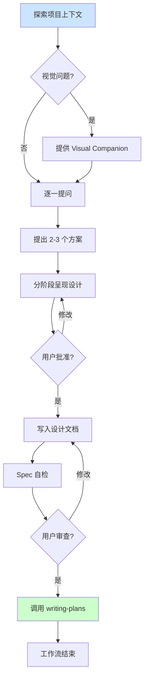

<details>
<summary>相关源文件</summary>

生成本页时使用的主要源文件：

- [skills/brainstorming/SKILL.md:1-120](../../../project-repos/superpowers/skills/brainstorming/SKILL.md#L1-L120)
- [skills/brainstorming/visual-companion.md:1-30](../../../project-repos/superpowers/skills/brainstorming/visual-companion.md#L1-L30)

</details>

# Brainstorming 工作流

Brainstorming 是 Superpowers 工作流的入口——在写任何代码之前，智能体必须通过 Socratic 对话探索需求的真实意图、约束和成功标准，并将设计分阶段呈现给用户确认。

**为什么这个技能存在？** AI 智能体最常见的浪费来源不是写代码慢，而是在错误的方向上快速前进。Brainstorming 通过强制"设计先行"来解决这个问题——不是"问几个问题就开始"，而是"直到用户明确批准设计，否则不触碰实现"。

## 核心流程



**一个关键设计决策**：提问必须一次一个，且优先使用多选题。这防止了"一次问一堆问题导致信息过载"的情况，也使对话更聚焦、更易于用户跟进。

Sources: [skills/brainstorming/SKILL.md:40-80](../../../project-repos/superpowers/skills/brainstorming/SKILL.md#L40-L80)

<details class="source-snippets">
<summary>引用源码</summary>

<!-- source-snippets:start -->

#### `skills/brainstorming/SKILL.md:40-80`

````markdown
    "Offer Visual Companion\n(own message, no other content)" [shape=box];
    "Ask clarifying questions" [shape=box];
    "Propose 2-3 approaches" [shape=box];
    "Present design sections" [shape=box];
    "User approves design?" [shape=diamond];
    "Write design doc" [shape=box];
    "Spec self-review\n(fix inline)" [shape=box];
    "User reviews spec?" [shape=diamond];
    "Invoke writing-plans skill" [shape=doublecircle];

    "Explore project context" -> "Visual questions ahead?";
    "Visual questions ahead?" -> "Offer Visual Companion\n(own message, no other content)" [label="yes"];
    "Visual questions ahead?" -> "Ask clarifying questions" [label="no"];
    "Offer Visual Companion\n(own message, no other content)" -> "Ask clarifying questions";
    "Ask clarifying questions" -> "Propose 2-3 approaches";
    "Propose 2-3 approaches" -> "Present design sections";
    "Present design sections" -> "User approves design?";
    "User approves design?" -> "Present design sections" [label="no, revise"];
    "User approves design?" -> "Write design doc" [label="yes"];
    "Write design doc" -> "Spec self-review\n(fix inline)";
    "Spec self-review\n(fix inline)" -> "User reviews spec?";
    "User reviews spec?" -> "Write design doc" [label="changes requested"];
    "User reviews spec?" -> "Invoke writing-plans skill" [label="approved"];
}
```

**The terminal state is invoking writing-plans.** Do NOT invoke frontend-design, mcp-builder, or any other implementation skill. The ONLY skill you invoke after brainstorming is writing-plans.

## The Process

**Understanding the idea:**

- Check out the current project state first (files, docs, recent commits)
- Before asking detailed questions, assess scope: if the request describes multiple independent subsystems (e.g., "build a platform with chat, file storage, billing, and analytics"), flag this immediately. Don't spend questions refining details of a project that needs to be decomposed first.
- If the project is too large for a single spec, help the user decompose into sub-projects: what are the independent pieces, how do they relate, what order should they be built? Then brainstorm the first sub-project through the normal design flow. Each sub-project gets its own spec → plan → implementation cycle.
- For appropriately-scoped projects, ask questions one at a time to refine the idea
- Prefer multiple choice questions when possible, but open-ended is fine too
- Only one question per message - if a topic needs more exploration, break it into multiple questions
- Focus on understanding: purpose, constraints, success criteria

**Exploring approaches:**
````

<!-- source-snippets:end -->
</details>

## HARD-GATE 机制

Brainstorming 技能以 `<HARD-GATE>` 标签开头，这是一个不可绕过的硬门禁：

```markdown
<HARD-GATE>
Do NOT invoke any implementation skill, write any code,
scaffold any project, or take any implementation action
until you have presented a design and the user has approved it.
</HARD-GATE>
```

`HARD-GATE` 与普通警告的区别在于它使用 HTML 标签语法，在所有渲染环境下都保持可见，不依赖 Markdown 强调规则。

## 逐阶段设计确认

设计不是一次性全部呈现然后等批准——而是**分阶段呈现，每阶段确认后再继续**：

1. 架构概览 → 用户确认方向正确
2. 数据模型 → 用户确认数据结构合理
3. 错误处理 → 用户确认边界情况覆盖
4. 测试策略 → 用户确认验收标准清晰

这个设计防止了"整体设计复杂但某关键细节未确认导致返工"的问题。每个阶段的批准都为后续工作建立了清晰的约束边界。

## Visual Companion（可视化伴侣）

当设计涉及视觉内容（UI 布局、流程图、方案比较）时，Brainstorming 技能要求智能体主动提供 Visual Companion——一个基于浏览器的小工具，可以在对话中实时呈现 mockup、图表和方案对比。

关键约束：Visual Companion 的使用是**按需决策**的——不是"视觉话题就用浏览器"，而是"这个具体问题看图比读文字更清楚才用浏览器"。一个关于"界面上应该有几个按钮"的文字讨论应该用终端；一个"这个布局方案 A/B 哪个更好"的比较才用浏览器。

Sources: [skills/brainstorming/visual-companion.md:1-30](../../../project-repos/superpowers/skills/brainstorming/visual-companion.md#L1-L30)

<details class="source-snippets">
<summary>引用源码</summary>

<!-- source-snippets:start -->

#### `skills/brainstorming/visual-companion.md:1-30`

```markdown
# Visual Companion Guide

Browser-based visual brainstorming companion for showing mockups, diagrams, and options.

## When to Use

Decide per-question, not per-session. The test: **would the user understand this better by seeing it than reading it?**

**Use the browser** when the content itself is visual:

- **UI mockups** — wireframes, layouts, navigation structures, component designs
- **Architecture diagrams** — system components, data flow, relationship maps
- **Side-by-side visual comparisons** — comparing two layouts, two color schemes, two design directions
- **Design polish** — when the question is about look and feel, spacing, visual hierarchy
- **Spatial relationships** — state machines, flowcharts, entity relationships rendered as diagrams

**Use the terminal** when the content is text or tabular:

- **Requirements and scope questions** — "what does X mean?", "which features are in scope?"
- **Conceptual A/B/C choices** — picking between approaches described in words
- **Tradeoff lists** — pros/cons, comparison tables
- **Technical decisions** — API design, data modeling, architectural approach selection
- **Clarifying questions** — anything where the answer is words, not a visual preference

A question *about* a UI topic is not automatically a visual question. "What kind of wizard do you want?" is conceptual — use the terminal. "Which of these wizard layouts feels right?" is visual — use the browser.

## How It Works

The server watches a directory for HTML files and serves the newest one to the browser. You write HTML content to `screen_dir`, the user sees it in their browser and can click to select options. Selections are recorded to `state_dir/events` that you read on your next turn.

```

<!-- source-snippets:end -->
</details>

## Spec 自检（Spec Self-Review）

设计文档完成后，在提交给用户之前，智能体必须进行内联自检：

1. **占位符扫描**：是否有 TBD、TODO、未完成的章节？
2. **内部一致性**：各章节是否互相矛盾？
3. **范围检查**：是否聚焦于单一实现计划，还是需要进一步分解？
4. **歧义检查**：是否有可以两种方式解释的需求？

发现问题就立即修复，不需要重新走一遍完整的评审流程。

## 与其他技能的衔接

Brainstorming 的终止状态是调用 `writing-plans` 技能——不是直接开始实现，也不是调用其他任何实现技能。这是工作流的强制顺序：设计 → 计划 → 实现，不能跳过。

**触发 `using-git-worktrees`**：当设计被批准后，在实际编写计划之前，智能体应该已经处于一个隔离的 Worktree 中（由 `using-git-worktrees` 技能管理）。

## 相关页面

- [Writing Plans](writing-plans) — 如何将设计拆解为原子化任务卡片
- [Git Worktrees](git-worktrees) — 隔离工作区的创建与验证
- [Subagent-Driven Development](subagent-driven-development) — 计划执行与两阶段评审
