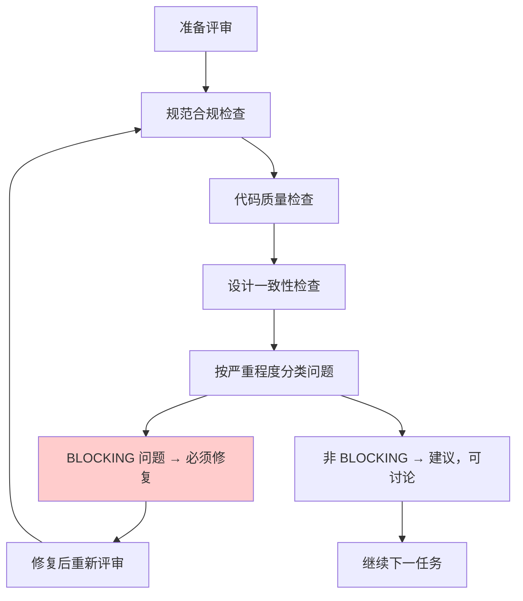

<details>
<summary>相关源文件</summary>

生成本页时使用的主要源文件：

- [skills/requesting-code-review/SKILL.md:1-60](../../../project-repos/superpowers/skills/requesting-code-review/SKILL.md#L1-L60)
- [skills/receiving-code-review/SKILL.md:1-50](../../../project-repos/superpowers/skills/receiving-code-review/SKILL.md#L1-L50)

</details>

# 代码评审

Superpowers 的代码评审由两个技能组成：**Requesting-Code-Review**（发起评审）和 **Receiving-Code-Review**（接收评审反馈）。两者构成一个双人机协作的评审闭环。

**为什么评审流程需要两个技能？** 评审的发起方和接收方有完全不同的目标：发起方需要结构化的检查清单来系统性地覆盖评审面，接收方需要区分有效反馈与过度批评、知道何时坚守设计决策何时接受修改。

## Requesting-Code-Review

评审发起方使用结构化检查清单，覆盖三个维度：

**规范合规**：实现是否符合计划中定义的需求？有没有超出范围或遗漏的功能？

**代码质量**：测试覆盖是否充分？是否有重复代码？命名是否清晰？

**设计一致性**：是否遵循项目现有的代码风格和设计模式？



**关键原则**：BLOCKING 问题必须修复才能继续，非 BLOCKING 问题可以讨论但不是强制。

Sources: [skills/requesting-code-review/SKILL.md:20-50](../../../project-repos/superpowers/skills/requesting-code-review/SKILL.md#L20-L50)

<details class="source-snippets">
<summary>引用源码</summary>

<!-- source-snippets:start -->

#### `skills/requesting-code-review/SKILL.md:20-50`

````markdown
- When stuck (fresh perspective)
- Before refactoring (baseline check)
- After fixing complex bug

## How to Request

**1. Get git SHAs:**
```bash
BASE_SHA=$(git rev-parse HEAD~1)  # or origin/main
HEAD_SHA=$(git rev-parse HEAD)
```

**2. Dispatch code-reviewer subagent:**

Use Task tool with superpowers:code-reviewer type, fill template at `code-reviewer.md`

**Placeholders:**
- `{WHAT_WAS_IMPLEMENTED}` - What you just built
- `{PLAN_OR_REQUIREMENTS}` - What it should do
- `{BASE_SHA}` - Starting commit
- `{HEAD_SHA}` - Ending commit
- `{DESCRIPTION}` - Brief summary

**3. Act on feedback:**
- Fix Critical issues immediately
- Fix Important issues before proceeding
- Note Minor issues for later
- Push back if reviewer is wrong (with reasoning)

## Example

````

<!-- source-snippets:end -->
</details>

## Receiving-Code-Review

接收到评审反馈时，智能体面临不同的挑战：如何在不防御的情况下处理反馈，如何区分"这是有效问题"和"这只是风格偏好"。

**有效反馈的特征**：
- 指出具体问题（命名不清、测试覆盖不足、边界情况遗漏）
- 提供修复方向或建议
- 引用了具体的代码行或文件

**不是有效反馈的特征**：
- "我觉得这样更好"（无具体理由的风格偏好）
- "这个设计有问题"（无具体问题描述）
- 引用模糊的"最佳实践"（无上下文）

## 评审与 SDD 的关系

在 Subagent-Driven Development 中，Code Review 已经是两阶段评审流程的一部分。SDD 中的 Spec Reviewer 负责规范合规，Code Quality Reviewer 负责代码质量。

这里的 Requesting-Code-Review 更类似于任务间的交叉评审，或在 Subagent-Driven Development 完成后、由人类伙伴或最终评审者发起的完整代码审查。

## 相关页面

- [Subagent-Driven Development](subagent-driven-development) — SDD 中的两阶段评审
- [Finishing Branch](finishing-branch) — 分支完成后的评审选项
- [Verification](verification) — 评审后如何验证修复
