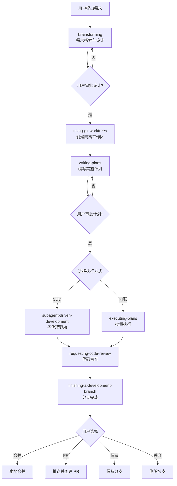
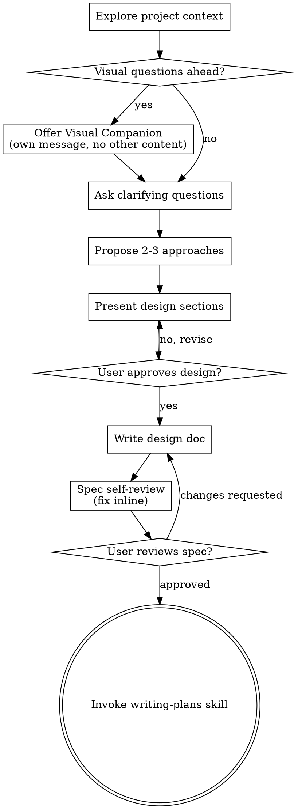

<details>
<summary>相关源文件</summary>

生成本页时使用的主要源文件：

- [skills/brainstorming/SKILL.md](https://github.com/obra/superpowers/blob/main/skills/brainstorming/SKILL.md)
- [skills/writing-plans/SKILL.md](https://github.com/obra/superpowers/blob/main/skills/writing-plans/SKILL.md)
- [skills/executing-plans/SKILL.md](https://github.com/obra/superpowers/blob/main/skills/executing-plans/SKILL.md)
- [skills/using-git-worktrees/SKILL.md](https://github.com/obra/superpowers/blob/main/skills/using-git-worktrees/SKILL.md)
- [skills/requesting-code-review/SKILL.md](https://github.com/obra/superpowers/blob/main/skills/requesting-code-review/SKILL.md)
- [skills/receiving-code-review/SKILL.md](https://github.com/obra/superpowers/blob/main/skills/receiving-code-review/SKILL.md)
- [skills/finishing-a-development-branch/SKILL.md](https://github.com/obra/superpowers/blob/main/skills/finishing-a-development-branch/SKILL.md)
- [skills/verification-before-completion/SKILL.md](https://github.com/obra/superpowers/blob/main/skills/verification-before-completion/SKILL.md)

</details>

# 核心工作流

Superpowers 定义了一条从需求到交付的完整工作流管线。每个阶段由一个或多个技能驱动，阶段之间有明确的门控条件——未获用户审批不能进入下一阶段。

## 全流程概览



Sources: [README.md:82-128](../../../project-repos/superpowers/README.md#L82-L128), [skills/brainstorming/SKILL.md:1-20](../../../project-repos/superpowers/skills/brainstorming/SKILL.md#L1-L20), [skills/writing-plans/SKILL.md:1-20](../../../project-repos/superpowers/skills/writing-plans/SKILL.md#L1-L20)

<details class="source-snippets">
<summary>引用源码</summary>

<!-- source-snippets:start -->

#### `README.md:82-128`

````markdown
In Cursor Agent chat, install from marketplace:

```text
/add-plugin superpowers
```

or search for "superpowers" in the plugin marketplace.

### OpenCode

Tell OpenCode:

```
Fetch and follow instructions from https://raw.githubusercontent.com/obra/superpowers/refs/heads/main/.opencode/INSTALL.md
```

**Detailed docs:** [docs/README.opencode.md](docs/README.opencode.md)

### GitHub Copilot CLI

```bash
copilot plugin marketplace add obra/superpowers-marketplace
copilot plugin install superpowers@superpowers-marketplace
```

### Gemini CLI

```bash
gemini extensions install https://github.com/obra/superpowers
```

To update:

```bash
gemini extensions update superpowers
```

## The Basic Workflow

1. **brainstorming** - Activates before writing code. Refines rough ideas through questions, explores alternatives, presents design in sections for validation. Saves design document.

2. **using-git-worktrees** - Activates after design approval. Creates isolated workspace on new branch, runs project setup, verifies clean test baseline.

3. **writing-plans** - Activates with approved design. Breaks work into bite-sized tasks (2-5 minutes each). Every task has exact file paths, complete code, verification steps.

4. **subagent-driven-development** or **executing-plans** - Activates with plan. Dispatches fresh subagent per task with two-stage review (spec compliance, then code quality), or executes in batches with human checkpoints.

````

#### `skills/brainstorming/SKILL.md:1-20`

```markdown
---
name: brainstorming
description: "You MUST use this before any creative work - creating features, building components, adding functionality, or modifying behavior. Explores user intent, requirements and design before implementation."
---

# Brainstorming Ideas Into Designs

Help turn ideas into fully formed designs and specs through natural collaborative dialogue.

Start by understanding the current project context, then ask questions one at a time to refine the idea. Once you understand what you're building, present the design and get user approval.

<HARD-GATE>
Do NOT invoke any implementation skill, write any code, scaffold any project, or take any implementation action until you have presented a design and the user has approved it. This applies to EVERY project regardless of perceived simplicity.
</HARD-GATE>

## Anti-Pattern: "This Is Too Simple To Need A Design"

Every project goes through this process. A todo list, a single-function utility, a config change — all of them. "Simple" projects are where unexamined assumptions cause the most wasted work. The design can be short (a few sentences for truly simple projects), but you MUST present it and get approval.

## Checklist
```

#### `skills/writing-plans/SKILL.md:1-20`

```markdown
---
name: writing-plans
description: Use when you have a spec or requirements for a multi-step task, before touching code
---

# Writing Plans

## Overview

Write comprehensive implementation plans assuming the engineer has zero context for our codebase and questionable taste. Document everything they need to know: which files to touch for each task, code, testing, docs they might need to check, how to test it. Give them the whole plan as bite-sized tasks. DRY. YAGNI. TDD. Frequent commits.

Assume they are a skilled developer, but know almost nothing about our toolset or problem domain. Assume they don't know good test design very well.

**Announce at start:** "I'm using the writing-plans skill to create the implementation plan."

**Context:** This should be run in a dedicated worktree (created by brainstorming skill).

**Save plans to:** `docs/superpowers/plans/YYYY-MM-DD-<feature-name>.md`
- (User preferences for plan location override this default)

```

<!-- source-snippets:end -->
</details>
## 阶段一：头脑风暴（brainstorming）

头脑风暴技能是整个工作流的入口。它强制代理在写任何代码之前先理解需求。

### 硬门控

> 在展示设计并获得用户审批之前，不得调用任何实施技能、编写任何代码、搭建任何项目或采取任何实施行动。

### 检查清单

1. **探索项目上下文**——检查文件、文档、最近提交
2. **提供可视化伴侣**（如果涉及视觉问题）——独立消息，不与澄清问题合并
3. **逐个提出澄清问题**——一次一个问题，优先多选题
4. **提出 2-3 种方案**——含权衡分析和推荐
5. **分段展示设计**——按复杂度缩放每段内容，逐段获审批
6. **编写设计文档**——保存到 `docs/superpowers/specs/YYYY-MM-DD-<topic>-design.md` 并提交
7. **规格自审**——检查占位符、矛盾、歧义、范围
8. **用户审阅书面规格**——请用户审阅规格文件
9. **过渡到实施**——调用 writing-plans 技能

### 反模式："这太简单不需要设计"

每个项目都必须经过此流程。一个待办列表、一个单函数工具、一个配置修改——全部都要。"简单"项目恰恰是未审视假设造成最多浪费的地方。设计可以很短（真正简单的项目几句话即可），但必须展示并获得审批。

Sources: [skills/brainstorming/SKILL.md:1-164](../../../project-repos/superpowers/skills/brainstorming/SKILL.md#L1-L164)

<details class="source-snippets">
<summary>引用源码</summary>

<!-- source-snippets:start -->

#### `skills/brainstorming/SKILL.md:1-164`

````markdown
---
name: brainstorming
description: "You MUST use this before any creative work - creating features, building components, adding functionality, or modifying behavior. Explores user intent, requirements and design before implementation."
---

# Brainstorming Ideas Into Designs

Help turn ideas into fully formed designs and specs through natural collaborative dialogue.

Start by understanding the current project context, then ask questions one at a time to refine the idea. Once you understand what you're building, present the design and get user approval.

<HARD-GATE>
Do NOT invoke any implementation skill, write any code, scaffold any project, or take any implementation action until you have presented a design and the user has approved it. This applies to EVERY project regardless of perceived simplicity.
</HARD-GATE>

## Anti-Pattern: "This Is Too Simple To Need A Design"

Every project goes through this process. A todo list, a single-function utility, a config change — all of them. "Simple" projects are where unexamined assumptions cause the most wasted work. The design can be short (a few sentences for truly simple projects), but you MUST present it and get approval.

## Checklist

You MUST create a task for each of these items and complete them in order:

1. **Explore project context** — check files, docs, recent commits
2. **Offer visual companion** (if topic will involve visual questions) — this is its own message, not combined with a clarifying question. See the Visual Companion section below.
3. **Ask clarifying questions** — one at a time, understand purpose/constraints/success criteria
4. **Propose 2-3 approaches** — with trade-offs and your recommendation
5. **Present design** — in sections scaled to their complexity, get user approval after each section
6. **Write design doc** — save to `docs/superpowers/specs/YYYY-MM-DD-<topic>-design.md` and commit
7. **Spec self-review** — quick inline check for placeholders, contradictions, ambiguity, scope (see below)
8. **User reviews written spec** — ask user to review the spec file before proceeding
9. **Transition to implementation** — invoke writing-plans skill to create implementation plan

## Process Flow



**The terminal state is invoking writing-plans.** Do NOT invoke frontend-design, mcp-builder, or any other implementation skill. The ONLY skill you invoke after brainstorming is writing-plans.

## The Process

**Understanding the idea:**

- Check out the current project state first (files, docs, recent commits)
- Before asking detailed questions, assess scope: if the request describes multiple independent subsystems (e.g., "build a platform with chat, file storage, billing, and analytics"), flag this immediately. Don't spend questions refining details of a project that needs to be decomposed first.
- If the project is too large for a single spec, help the user decompose into sub-projects: what are the independent pieces, how do they relate, what order should they be built? Then brainstorm the first sub-project through the normal design flow. Each sub-project gets its own spec → plan → implementation cycle.
- For appropriately-scoped projects, ask questions one at a time to refine the idea
- Prefer multiple choice questions when possible, but open-ended is fine too
- Only one question per message - if a topic needs more exploration, break it into multiple questions
- Focus on understanding: purpose, constraints, success criteria

**Exploring approaches:**

- Propose 2-3 different approaches with trade-offs
- Present options conversationally with your recommendation and reasoning
- Lead with your recommended option and explain why

**Presenting the design:**

- Once you believe you understand what you're building, present the design
- Scale each section to its complexity: a few sentences if straightforward, up to 200-300 words if nuanced
- Ask after each section whether it looks right so far
- Cover: architecture, components, data flow, error handling, testing
- Be ready to go back and clarify if something doesn't make sense

**Design for isolation and clarity:**

- Break the system into smaller units that each have one clear purpose, communicate through well-defined interfaces, and can be understood and tested independently
- For each unit, you should be able to answer: what does it do, how do you use it, and what does it depend on?
- Can someone understand what a unit does without reading its internals? Can you change the internals without breaking consumers? If not, the boundaries need work.
- Smaller, well-bounded units are also easier for you to work with - you reason better about code you can hold in context at once, and your edits are more reliable when files are focused. When a file grows large, that's often a signal that it's doing too much.

**Working in existing codebases:**

- Explore the current structure before proposing changes. Follow existing patterns.
- Where existing code has problems that affect the work (e.g., a file that's grown too large, unclear boundaries, tangled responsibilities), include targeted improvements as part of the design - the way a good developer improves code they're working in.
- Don't propose unrelated refactoring. Stay focused on what serves the current goal.

## After the Design

**Documentation:**

- Write the validated design (spec) to `docs/superpowers/specs/YYYY-MM-DD-<topic>-design.md`
  - (User preferences for spec location override this default)
- Use elements-of-style:writing-clearly-and-concisely skill if available
- Commit the design document to git

**Spec Self-Review:**
After writing the spec document, look at it with fresh eyes:

1. **Placeholder scan:** Any "TBD", "TODO", incomplete sections, or vague requirements? Fix them.
2. **Internal consistency:** Do any sections contradict each other? Does the architecture match the feature descriptions?
... snippet truncated ...
````

<!-- source-snippets:end -->
</details>
## 阶段二：创建隔离工作区（using-git-worktrees）

设计审批后，代理创建 Git worktree 隔离工作区：

1. **目录选择**：优先使用已有的 `.worktrees/` 或 `worktrees/` 目录，其次检查 CLAUDE.md 偏好，最后询问用户
2. **安全验证**：确保 worktree 目录在 `.gitignore` 中
3. **创建 worktree**：`git worktree add <path> -b <branch-name>`
4. **项目设置**：自动检测并运行 `npm install` / `cargo build` / `pip install` 等
5. **基线验证**：运行测试确保工作区从干净状态开始

Sources: [skills/using-git-worktrees/SKILL.md:1-200](../../../project-repos/superpowers/skills/using-git-worktrees/SKILL.md#L1-L200)

<details class="source-snippets">
<summary>引用源码</summary>

<!-- source-snippets:start -->

#### `skills/using-git-worktrees/SKILL.md:1-200`

````markdown
---
name: using-git-worktrees
description: Use when starting feature work that needs isolation from current workspace or before executing implementation plans - creates isolated git worktrees with smart directory selection and safety verification
---

# Using Git Worktrees

## Overview

Git worktrees create isolated workspaces sharing the same repository, allowing work on multiple branches simultaneously without switching.

**Core principle:** Systematic directory selection + safety verification = reliable isolation.

**Announce at start:** "I'm using the using-git-worktrees skill to set up an isolated workspace."

## Directory Selection Process

Follow this priority order:

### 1. Check Existing Directories

```bash
# Check in priority order
ls -d .worktrees 2>/dev/null     # Preferred (hidden)
ls -d worktrees 2>/dev/null      # Alternative
```

**If found:** Use that directory. If both exist, `.worktrees` wins.

### 2. Check CLAUDE.md

```bash
grep -i "worktree.*director" CLAUDE.md 2>/dev/null
```

**If preference specified:** Use it without asking.

### 3. Ask User

If no directory exists and no CLAUDE.md preference:

```
No worktree directory found. Where should I create worktrees?

1. .worktrees/ (project-local, hidden)
2. ~/.config/superpowers/worktrees/<project-name>/ (global location)

Which would you prefer?
```

## Safety Verification

### For Project-Local Directories (.worktrees or worktrees)

**MUST verify directory is ignored before creating worktree:**

```bash
# Check if directory is ignored (respects local, global, and system gitignore)
git check-ignore -q .worktrees 2>/dev/null || git check-ignore -q worktrees 2>/dev/null
```

**If NOT ignored:**

Per Jesse's rule "Fix broken things immediately":
1. Add appropriate line to .gitignore
2. Commit the change
3. Proceed with worktree creation

**Why critical:** Prevents accidentally committing worktree contents to repository.

### For Global Directory (~/.config/superpowers/worktrees)

No .gitignore verification needed - outside project entirely.

## Creation Steps

### 1. Detect Project Name

```bash
project=$(basename "$(git rev-parse --show-toplevel)")
```

### 2. Create Worktree

```bash
# Determine full path
case $LOCATION in
  .worktrees|worktrees)
    path="$LOCATION/$BRANCH_NAME"
    ;;
  ~/.config/superpowers/worktrees/*)
    path="~/.config/superpowers/worktrees/$project/$BRANCH_NAME"
    ;;
esac

# Create worktree with new branch
git worktree add "$path" -b "$BRANCH_NAME"
cd "$path"
```

### 3. Run Project Setup

Auto-detect and run appropriate setup:

```bash
# Node.js
if [ -f package.json ]; then npm install; fi

# Rust
if [ -f Cargo.toml ]; then cargo build; fi

# Python
if [ -f requirements.txt ]; then pip install -r requirements.txt; fi
if [ -f pyproject.toml ]; then poetry install; fi

# Go
if [ -f go.mod ]; then go mod download; fi
```

### 4. Verify Clean Baseline
... snippet truncated ...
````

<!-- source-snippets:end -->
</details>
## 阶段三：编写计划（writing-plans）

计划技能将设计分解为原子级任务，每个任务 2-5 分钟可完成。

### 任务粒度

每个步骤是一个原子动作：

- "编写失败测试" —— 一个步骤
- "运行确认失败" —— 一个步骤
- "编写最小实现" —— 一个步骤
- "运行确认通过" —— 一个步骤
- "提交" —— 一个步骤

### 计划文档头部

每个计划必须以标准头部开始，包含目标、架构概述和技术栈，并标注推荐使用 `subagent-driven-development` 或 `executing-plans` 来执行。

### 禁止占位符

以下模式是计划失败，绝不允许出现：
- "TBD"、"TODO"、"稍后实现"、"补充细节"
- "添加适当的错误处理"（无具体代码）
- "为上述编写测试"（无实际测试代码）
- "与任务 N 类似"（必须重复代码，工程师可能乱序阅读）

### 自审检查

计划完成后执行三项检查：
1. **规格覆盖**：每个需求是否有对应任务？
2. **占位符扫描**：搜索红旗模式
3. **类型一致性**：后续任务中的函数名、签名是否与前面定义的一致？

Sources: [skills/writing-plans/SKILL.md:1-152](../../../project-repos/superpowers/skills/writing-plans/SKILL.md#L1-L152)

<details class="source-snippets">
<summary>引用源码</summary>

<!-- source-snippets:start -->

#### `skills/writing-plans/SKILL.md:1-152`

`````markdown
---
name: writing-plans
description: Use when you have a spec or requirements for a multi-step task, before touching code
---

# Writing Plans

## Overview

Write comprehensive implementation plans assuming the engineer has zero context for our codebase and questionable taste. Document everything they need to know: which files to touch for each task, code, testing, docs they might need to check, how to test it. Give them the whole plan as bite-sized tasks. DRY. YAGNI. TDD. Frequent commits.

Assume they are a skilled developer, but know almost nothing about our toolset or problem domain. Assume they don't know good test design very well.

**Announce at start:** "I'm using the writing-plans skill to create the implementation plan."

**Context:** This should be run in a dedicated worktree (created by brainstorming skill).

**Save plans to:** `docs/superpowers/plans/YYYY-MM-DD-<feature-name>.md`
- (User preferences for plan location override this default)

## Scope Check

If the spec covers multiple independent subsystems, it should have been broken into sub-project specs during brainstorming. If it wasn't, suggest breaking this into separate plans — one per subsystem. Each plan should produce working, testable software on its own.

## File Structure

Before defining tasks, map out which files will be created or modified and what each one is responsible for. This is where decomposition decisions get locked in.

- Design units with clear boundaries and well-defined interfaces. Each file should have one clear responsibility.
- You reason best about code you can hold in context at once, and your edits are more reliable when files are focused. Prefer smaller, focused files over large ones that do too much.
- Files that change together should live together. Split by responsibility, not by technical layer.
- In existing codebases, follow established patterns. If the codebase uses large files, don't unilaterally restructure - but if a file you're modifying has grown unwieldy, including a split in the plan is reasonable.

This structure informs the task decomposition. Each task should produce self-contained changes that make sense independently.

## Bite-Sized Task Granularity

**Each step is one action (2-5 minutes):**
- "Write the failing test" - step
- "Run it to make sure it fails" - step
- "Implement the minimal code to make the test pass" - step
- "Run the tests and make sure they pass" - step
- "Commit" - step

## Plan Document Header

**Every plan MUST start with this header:**

```markdown
# [Feature Name] Implementation Plan

> **For agentic workers:** REQUIRED SUB-SKILL: Use superpowers:subagent-driven-development (recommended) or superpowers:executing-plans to implement this plan task-by-task. Steps use checkbox (`- [ ]`) syntax for tracking.

**Goal:** [One sentence describing what this builds]

**Architecture:** [2-3 sentences about approach]

**Tech Stack:** [Key technologies/libraries]

---
```

## Task Structure

````markdown
### Task N: [Component Name]

**Files:**
- Create: `exact/path/to/file.py`
- Modify: `exact/path/to/existing.py:123-145`
- Test: `tests/exact/path/to/test.py`

- [ ] **Step 1: Write the failing test**

```python
def test_specific_behavior():
    result = function(input)
    assert result == expected
```

- [ ] **Step 2: Run test to verify it fails**

Run: `pytest tests/path/test.py::test_name -v`
Expected: FAIL with "function not defined"

- [ ] **Step 3: Write minimal implementation**

```python
def function(input):
    return expected
```

- [ ] **Step 4: Run test to verify it passes**

Run: `pytest tests/path/test.py::test_name -v`
Expected: PASS

- [ ] **Step 5: Commit**

```bash
git add tests/path/test.py src/path/file.py
git commit -m "feat: add specific feature"
```
````

## No Placeholders

Every step must contain the actual content an engineer needs. These are **plan failures** — never write them:
- "TBD", "TODO", "implement later", "fill in details"
- "Add appropriate error handling" / "add validation" / "handle edge cases"
- "Write tests for the above" (without actual test code)
- "Similar to Task N" (repeat the code — the engineer may be reading tasks out of order)
- Steps that describe what to do without showing how (code blocks required for code steps)
- References to types, functions, or methods not defined in any task

## Remember
- Exact file paths always
- Complete code in every step — if a step changes code, show the code
- Exact commands with expected output
- DRY, YAGNI, TDD, frequent commits
... snippet truncated ...
`````

<!-- source-snippets:end -->
</details>
## 阶段四：执行实施

计划完成后，用户选择执行方式：

### 方式一：子代理驱动开发（推荐）

详见 [子代理驱动开发](subagent-driven-development.md) 页面。核心特点：每个任务分派独立子代理，两阶段审查（规格合规 + 代码质量）。

### 方式二：内联执行（executing-plans）

适用于不支持子代理的平台：
1. 加载并审阅计划
2. 逐任务执行，标记进度
3. 遇到阻塞立即停止并请求帮助
4. 全部完成后调用 finishing-a-development-branch

Sources: [skills/executing-plans/SKILL.md:1-70](../../../project-repos/superpowers/skills/executing-plans/SKILL.md#L1-L70)

<details class="source-snippets">
<summary>引用源码</summary>

<!-- source-snippets:start -->

#### `skills/executing-plans/SKILL.md:1-70`

```markdown
---
name: executing-plans
description: Use when you have a written implementation plan to execute in a separate session with review checkpoints
---

# Executing Plans

## Overview

Load plan, review critically, execute all tasks, report when complete.

**Announce at start:** "I'm using the executing-plans skill to implement this plan."

**Note:** Tell your human partner that Superpowers works much better with access to subagents. The quality of its work will be significantly higher if run on a platform with subagent support (such as Claude Code or Codex). If subagents are available, use superpowers:subagent-driven-development instead of this skill.

## The Process

### Step 1: Load and Review Plan
1. Read plan file
2. Review critically - identify any questions or concerns about the plan
3. If concerns: Raise them with your human partner before starting
4. If no concerns: Create TodoWrite and proceed

### Step 2: Execute Tasks

For each task:
1. Mark as in_progress
2. Follow each step exactly (plan has bite-sized steps)
3. Run verifications as specified
4. Mark as completed

### Step 3: Complete Development

After all tasks complete and verified:
- Announce: "I'm using the finishing-a-development-branch skill to complete this work."
- **REQUIRED SUB-SKILL:** Use superpowers:finishing-a-development-branch
- Follow that skill to verify tests, present options, execute choice

## When to Stop and Ask for Help

**STOP executing immediately when:**
- Hit a blocker (missing dependency, test fails, instruction unclear)
- Plan has critical gaps preventing starting
- You don't understand an instruction
- Verification fails repeatedly

**Ask for clarification rather than guessing.**

## When to Revisit Earlier Steps

**Return to Review (Step 1) when:**
- Partner updates the plan based on your feedback
- Fundamental approach needs rethinking

**Don't force through blockers** - stop and ask.

## Remember
- Review plan critically first
- Follow plan steps exactly
- Don't skip verifications
- Reference skills when plan says to
- Stop when blocked, don't guess
- Never start implementation on main/master branch without explicit user consent

## Integration

**Required workflow skills:**
- **superpowers:using-git-worktrees** - REQUIRED: Set up isolated workspace before starting
- **superpowers:writing-plans** - Creates the plan this skill executes
- **superpowers:finishing-a-development-branch** - Complete development after all tasks
```

<!-- source-snippets:end -->
</details>
## 阶段五：代码审查

### 请求审查（requesting-code-review）

在以下时机请求审查：
- 子代理驱动开发中每个任务完成后（强制）
- 完成主要功能后
- 合并到 main 之前

审查流程：
1. 获取 Git SHA 范围
2. 分派 code-reviewer 子代理，提供精确上下文
3. 按严重性处理反馈：Critical 立即修复，Important 继续前修复，Minor 记录后续处理

### 接收审查（receiving-code-review）

接收审查反馈的核心原则是**技术评估而非情感表演**：

- **禁止**："你说得对！"、"好建议！"、"让我实现它"（未验证前）
- **要求**：重述技术需求、验证后行动、有理由地反驳

对外部审查者的建议保持怀疑：检查是否破坏现有功能、是否符合当前技术栈、是否存在 YAGNI 违规。

Sources: [skills/requesting-code-review/SKILL.md:1-105](../../../project-repos/superpowers/skills/requesting-code-review/SKILL.md#L1-L105), [skills/receiving-code-review/SKILL.md:1-200](../../../project-repos/superpowers/skills/receiving-code-review/SKILL.md#L1-L200)

<details class="source-snippets">
<summary>引用源码</summary>

<!-- source-snippets:start -->

#### `skills/requesting-code-review/SKILL.md:1-105`

````markdown
---
name: requesting-code-review
description: Use when completing tasks, implementing major features, or before merging to verify work meets requirements
---

# Requesting Code Review

Dispatch superpowers:code-reviewer subagent to catch issues before they cascade. The reviewer gets precisely crafted context for evaluation — never your session's history. This keeps the reviewer focused on the work product, not your thought process, and preserves your own context for continued work.

**Core principle:** Review early, review often.

## When to Request Review

**Mandatory:**
- After each task in subagent-driven development
- After completing major feature
- Before merge to main

**Optional but valuable:**
- When stuck (fresh perspective)
- Before refactoring (baseline check)
- After fixing complex bug

## How to Request

**1. Get git SHAs:**
```bash
BASE_SHA=$(git rev-parse HEAD~1)  # or origin/main
HEAD_SHA=$(git rev-parse HEAD)
```

**2. Dispatch code-reviewer subagent:**

Use Task tool with superpowers:code-reviewer type, fill template at `code-reviewer.md`

**Placeholders:**
- `{WHAT_WAS_IMPLEMENTED}` - What you just built
- `{PLAN_OR_REQUIREMENTS}` - What it should do
- `{BASE_SHA}` - Starting commit
- `{HEAD_SHA}` - Ending commit
- `{DESCRIPTION}` - Brief summary

**3. Act on feedback:**
- Fix Critical issues immediately
- Fix Important issues before proceeding
- Note Minor issues for later
- Push back if reviewer is wrong (with reasoning)

## Example

```
[Just completed Task 2: Add verification function]

You: Let me request code review before proceeding.

BASE_SHA=$(git log --oneline | grep "Task 1" | head -1 | awk '{print $1}')
HEAD_SHA=$(git rev-parse HEAD)

[Dispatch superpowers:code-reviewer subagent]
  WHAT_WAS_IMPLEMENTED: Verification and repair functions for conversation index
  PLAN_OR_REQUIREMENTS: Task 2 from docs/superpowers/plans/deployment-plan.md
  BASE_SHA: a7981ec
  HEAD_SHA: 3df7661
  DESCRIPTION: Added verifyIndex() and repairIndex() with 4 issue types

[Subagent returns]:
  Strengths: Clean architecture, real tests
  Issues:
    Important: Missing progress indicators
    Minor: Magic number (100) for reporting interval
  Assessment: Ready to proceed

You: [Fix progress indicators]
[Continue to Task 3]
```

## Integration with Workflows

**Subagent-Driven Development:**
- Review after EACH task
- Catch issues before they compound
- Fix before moving to next task

**Executing Plans:**
- Review after each batch (3 tasks)
- Get feedback, apply, continue

**Ad-Hoc Development:**
- Review before merge
- Review when stuck

## Red Flags

**Never:**
- Skip review because "it's simple"
- Ignore Critical issues
- Proceed with unfixed Important issues
- Argue with valid technical feedback

**If reviewer wrong:**
- Push back with technical reasoning
- Show code/tests that prove it works
- Request clarification

See template at: requesting-code-review/code-reviewer.md
````

#### `skills/receiving-code-review/SKILL.md:1-200`

````markdown
---
name: receiving-code-review
description: Use when receiving code review feedback, before implementing suggestions, especially if feedback seems unclear or technically questionable - requires technical rigor and verification, not performative agreement or blind implementation
---

# Code Review Reception

## Overview

Code review requires technical evaluation, not emotional performance.

**Core principle:** Verify before implementing. Ask before assuming. Technical correctness over social comfort.

## The Response Pattern

```
WHEN receiving code review feedback:

1. READ: Complete feedback without reacting
2. UNDERSTAND: Restate requirement in own words (or ask)
3. VERIFY: Check against codebase reality
4. EVALUATE: Technically sound for THIS codebase?
5. RESPOND: Technical acknowledgment or reasoned pushback
6. IMPLEMENT: One item at a time, test each
```

## Forbidden Responses

**NEVER:**
- "You're absolutely right!" (explicit CLAUDE.md violation)
- "Great point!" / "Excellent feedback!" (performative)
- "Let me implement that now" (before verification)

**INSTEAD:**
- Restate the technical requirement
- Ask clarifying questions
- Push back with technical reasoning if wrong
- Just start working (actions > words)

## Handling Unclear Feedback

```
IF any item is unclear:
  STOP - do not implement anything yet
  ASK for clarification on unclear items

WHY: Items may be related. Partial understanding = wrong implementation.
```

**Example:**
```
your human partner: "Fix 1-6"
You understand 1,2,3,6. Unclear on 4,5.

❌ WRONG: Implement 1,2,3,6 now, ask about 4,5 later
✅ RIGHT: "I understand items 1,2,3,6. Need clarification on 4 and 5 before proceeding."
```

## Source-Specific Handling

### From your human partner
- **Trusted** - implement after understanding
- **Still ask** if scope unclear
- **No performative agreement**
- **Skip to action** or technical acknowledgment

### From External Reviewers
```
BEFORE implementing:
  1. Check: Technically correct for THIS codebase?
  2. Check: Breaks existing functionality?
  3. Check: Reason for current implementation?
  4. Check: Works on all platforms/versions?
  5. Check: Does reviewer understand full context?

IF suggestion seems wrong:
  Push back with technical reasoning

IF can't easily verify:
  Say so: "I can't verify this without [X]. Should I [investigate/ask/proceed]?"

IF conflicts with your human partner's prior decisions:
  Stop and discuss with your human partner first
```

**your human partner's rule:** "External feedback - be skeptical, but check carefully"

## YAGNI Check for "Professional" Features

```
IF reviewer suggests "implementing properly":
  grep codebase for actual usage

  IF unused: "This endpoint isn't called. Remove it (YAGNI)?"
  IF used: Then implement properly
```

**your human partner's rule:** "You and reviewer both report to me. If we don't need this feature, don't add it."

## Implementation Order

```
FOR multi-item feedback:
  1. Clarify anything unclear FIRST
  2. Then implement in this order:
     - Blocking issues (breaks, security)
     - Simple fixes (typos, imports)
     - Complex fixes (refactoring, logic)
  3. Test each fix individually
  4. Verify no regressions
```

## When To Push Back

Push back when:
- Suggestion breaks existing functionality
- Reviewer lacks full context
- Violates YAGNI (unused feature)
- Technically incorrect for this stack
- Legacy/compatibility reasons exist
... snippet truncated ...
````

<!-- source-snippets:end -->
</details>
## 阶段六：分支完成（finishing-a-development-branch）

所有任务完成并审查通过后：

1. **验证测试**——测试必须通过才能继续
2. **确定基准分支**——main 或 master
3. **提供四个选项**：
   - 本地合并到基准分支
   - 推送并创建 Pull Request
   - 保持分支现状
   - 丢弃工作（需输入 "discard" 确认）
4. **清理 worktree**——选项 1 和 4 自动清理

Sources: [skills/finishing-a-development-branch/SKILL.md:1-200](../../../project-repos/superpowers/skills/finishing-a-development-branch/SKILL.md#L1-L200)

<details class="source-snippets">
<summary>引用源码</summary>

<!-- source-snippets:start -->

#### `skills/finishing-a-development-branch/SKILL.md:1-200`

````markdown
---
name: finishing-a-development-branch
description: Use when implementation is complete, all tests pass, and you need to decide how to integrate the work - guides completion of development work by presenting structured options for merge, PR, or cleanup
---

# Finishing a Development Branch

## Overview

Guide completion of development work by presenting clear options and handling chosen workflow.

**Core principle:** Verify tests → Present options → Execute choice → Clean up.

**Announce at start:** "I'm using the finishing-a-development-branch skill to complete this work."

## The Process

### Step 1: Verify Tests

**Before presenting options, verify tests pass:**

```bash
# Run project's test suite
npm test / cargo test / pytest / go test ./...
```

**If tests fail:**
```
Tests failing (<N> failures). Must fix before completing:

[Show failures]

Cannot proceed with merge/PR until tests pass.
```

Stop. Don't proceed to Step 2.

**If tests pass:** Continue to Step 2.

### Step 2: Determine Base Branch

```bash
# Try common base branches
git merge-base HEAD main 2>/dev/null || git merge-base HEAD master 2>/dev/null
```

Or ask: "This branch split from main - is that correct?"

### Step 3: Present Options

Present exactly these 4 options:

```
Implementation complete. What would you like to do?

1. Merge back to <base-branch> locally
2. Push and create a Pull Request
3. Keep the branch as-is (I'll handle it later)
4. Discard this work

Which option?
```

**Don't add explanation** - keep options concise.

### Step 4: Execute Choice

#### Option 1: Merge Locally

```bash
# Switch to base branch
git checkout <base-branch>

# Pull latest
git pull

# Merge feature branch
git merge <feature-branch>

# Verify tests on merged result
<test command>

# If tests pass
git branch -d <feature-branch>
```

Then: Cleanup worktree (Step 5)

#### Option 2: Push and Create PR

```bash
# Push branch
git push -u origin <feature-branch>

# Create PR
gh pr create --title "<title>" --body "$(cat <<'EOF'
## Summary
<2-3 bullets of what changed>

## Test Plan
- [ ] <verification steps>
EOF
)"
```

Then: Cleanup worktree (Step 5)

#### Option 3: Keep As-Is

Report: "Keeping branch <name>. Worktree preserved at <path>."

**Don't cleanup worktree.**

#### Option 4: Discard

**Confirm first:**
```
This will permanently delete:
- Branch <name>
- All commits: <commit-list>
... snippet truncated ...
````

<!-- source-snippets:end -->
</details>
## 验证先行原则

贯穿所有阶段的元原则：**没有新鲜验证证据就不能声称完成**。

验证门控函数：

```
声称任何状态前：
1. 识别：什么命令能证明此声称？
2. 运行：执行完整命令（新鲜的、完整的）
3. 阅读：完整输出，检查退出码，计算失败数
4. 验证：输出是否确认声称？
5. 只有此时：做出声称
```

常见的验证失败：用"应该"代替实际运行、信任子代理的成功报告、部分检查后外推。

Sources: [skills/verification-before-completion/SKILL.md:1-139](../../../project-repos/superpowers/skills/verification-before-completion/SKILL.md#L1-L139)

<details class="source-snippets">
<summary>引用源码</summary>

<!-- source-snippets:start -->

#### `skills/verification-before-completion/SKILL.md:1-139`

````markdown
---
name: verification-before-completion
description: Use when about to claim work is complete, fixed, or passing, before committing or creating PRs - requires running verification commands and confirming output before making any success claims; evidence before assertions always
---

# Verification Before Completion

## Overview

Claiming work is complete without verification is dishonesty, not efficiency.

**Core principle:** Evidence before claims, always.

**Violating the letter of this rule is violating the spirit of this rule.**

## The Iron Law

```
NO COMPLETION CLAIMS WITHOUT FRESH VERIFICATION EVIDENCE
```

If you haven't run the verification command in this message, you cannot claim it passes.

## The Gate Function

```
BEFORE claiming any status or expressing satisfaction:

1. IDENTIFY: What command proves this claim?
2. RUN: Execute the FULL command (fresh, complete)
3. READ: Full output, check exit code, count failures
4. VERIFY: Does output confirm the claim?
   - If NO: State actual status with evidence
   - If YES: State claim WITH evidence
5. ONLY THEN: Make the claim

Skip any step = lying, not verifying
```

## Common Failures

| Claim | Requires | Not Sufficient |
|-------|----------|----------------|
| Tests pass | Test command output: 0 failures | Previous run, "should pass" |
| Linter clean | Linter output: 0 errors | Partial check, extrapolation |
| Build succeeds | Build command: exit 0 | Linter passing, logs look good |
| Bug fixed | Test original symptom: passes | Code changed, assumed fixed |
| Regression test works | Red-green cycle verified | Test passes once |
| Agent completed | VCS diff shows changes | Agent reports "success" |
| Requirements met | Line-by-line checklist | Tests passing |

## Red Flags - STOP

- Using "should", "probably", "seems to"
- Expressing satisfaction before verification ("Great!", "Perfect!", "Done!", etc.)
- About to commit/push/PR without verification
- Trusting agent success reports
- Relying on partial verification
- Thinking "just this once"
- Tired and wanting work over
- **ANY wording implying success without having run verification**

## Rationalization Prevention

| Excuse | Reality |
|--------|---------|
| "Should work now" | RUN the verification |
| "I'm confident" | Confidence ≠ evidence |
| "Just this once" | No exceptions |
| "Linter passed" | Linter ≠ compiler |
| "Agent said success" | Verify independently |
| "I'm tired" | Exhaustion ≠ excuse |
| "Partial check is enough" | Partial proves nothing |
| "Different words so rule doesn't apply" | Spirit over letter |

## Key Patterns

**Tests:**
```
✅ [Run test command] [See: 34/34 pass] "All tests pass"
❌ "Should pass now" / "Looks correct"
```

**Regression tests (TDD Red-Green):**
```
✅ Write → Run (pass) → Revert fix → Run (MUST FAIL) → Restore → Run (pass)
❌ "I've written a regression test" (without red-green verification)
```

**Build:**
```
✅ [Run build] [See: exit 0] "Build passes"
❌ "Linter passed" (linter doesn't check compilation)
```

**Requirements:**
```
✅ Re-read plan → Create checklist → Verify each → Report gaps or completion
❌ "Tests pass, phase complete"
```

**Agent delegation:**
```
✅ Agent reports success → Check VCS diff → Verify changes → Report actual state
❌ Trust agent report
```

## Why This Matters

From 24 failure memories:
- your human partner said "I don't believe you" - trust broken
- Undefined functions shipped - would crash
- Missing requirements shipped - incomplete features
- Time wasted on false completion → redirect → rework
- Violates: "Honesty is a core value. If you lie, you'll be replaced."

## When To Apply

**ALWAYS before:**
- ANY variation of success/completion claims
... snippet truncated ...
````

<!-- source-snippets:end -->
</details>
## 相关页面

- [子代理驱动开发](subagent-driven-development.md)
- [技能体系](skills-system.md)
- [项目概览](overview.md)
