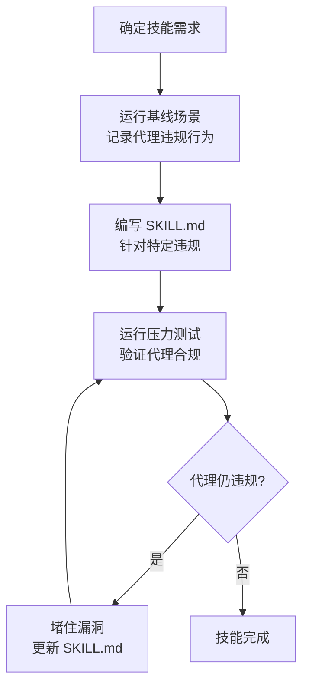

<details>
<summary>相关源文件</summary>

生成本页时使用的主要源文件：

- [skills/writing-skills/SKILL.md](https://github.com/obra/superpowers/blob/main/skills/writing-skills/SKILL.md)
- [skills/writing-skills/anthropic-best-practices.md](https://github.com/obra/superpowers/blob/main/skills/writing-skills/anthropic-best-practices.md)
- [skills/writing-skills/testing-skills-with-subagents.md](https://github.com/obra/superpowers/blob/main/skills/writing-skills/testing-skills-with-subagents.md)
- [skills/writing-skills/examples/CLAUDE_MD_TESTING.md](https://github.com/obra/superpowers/blob/main/skills/writing-skills/examples/CLAUDE_MD_TESTING.md)
- [scripts/bump-version.sh](https://github.com/obra/superpowers/blob/main/scripts/bump-version.sh)
- [scripts/sync-to-codex-plugin.sh](https://github.com/obra/superpowers/blob/main/scripts/sync-to-codex-plugin.sh)
- [.version-bump.json](https://github.com/obra/superpowers/blob/main/.version-bump.json)
- [CLAUDE.md](https://github.com/obra/superpowers/blob/main/CLAUDE.md)
- [.github/PULL_REQUEST_TEMPLATE.md](https://github.com/obra/superpowers/blob/main/.github/PULL_REQUEST_TEMPLATE.md)

</details>

# 扩展与贡献

Superpowers 的扩展主要通过编写新技能实现，版本管理通过自动化脚本完成，贡献需遵循严格的 PR 规范。项目有 94% 的 PR 拒绝率，维护者对 AI 代理提交的低质量 PR 尤其警惕。

## 编写新技能

### TDD 式技能创建

编写技能就是将 TDD 应用于过程文档：

| TDD 概念 | 技能创建对应 |
|-----------|-------------|
| 测试用例 | 压力场景（用子代理测试） |
| 生产代码 | 技能文档（SKILL.md） |
| 测试失败（RED） | 代理无技能时违反规则（基线） |
| 测试通过（GREEN） | 代理有技能时遵守规则 |
| 重构 | 堵住漏洞同时保持合规 |

**核心原则**：如果你没看到代理在没有技能时失败，你不知道技能教了正确的东西。

### 技能创建流程



Sources: [skills/writing-skills/SKILL.md:1-50](../../../project-repos/superpowers/skills/writing-skills/SKILL.md#L1-L50)

<details class="source-snippets">
<summary>引用源码</summary>

<!-- source-snippets:start -->

#### `skills/writing-skills/SKILL.md:1-50`

```markdown
---
name: writing-skills
description: Use when creating new skills, editing existing skills, or verifying skills work before deployment
---

# Writing Skills

## Overview

**Writing skills IS Test-Driven Development applied to process documentation.**

**Personal skills live in agent-specific directories (`~/.claude/skills` for Claude Code, `~/.agents/skills/` for Codex)** 

You write test cases (pressure scenarios with subagents), watch them fail (baseline behavior), write the skill (documentation), watch tests pass (agents comply), and refactor (close loopholes).

**Core principle:** If you didn't watch an agent fail without the skill, you don't know if the skill teaches the right thing.

**REQUIRED BACKGROUND:** You MUST understand superpowers:test-driven-development before using this skill. That skill defines the fundamental RED-GREEN-REFACTOR cycle. This skill adapts TDD to documentation.

**Official guidance:** For Anthropic's official skill authoring best practices, see anthropic-best-practices.md. This document provides additional patterns and guidelines that complement the TDD-focused approach in this skill.

## What is a Skill?

A **skill** is a reference guide for proven techniques, patterns, or tools. Skills help future Claude instances find and apply effective approaches.

**Skills are:** Reusable techniques, patterns, tools, reference guides

**Skills are NOT:** Narratives about how you solved a problem once

## TDD Mapping for Skills

| TDD Concept | Skill Creation |
|-------------|----------------|
| **Test case** | Pressure scenario with subagent |
| **Production code** | Skill document (SKILL.md) |
| **Test fails (RED)** | Agent violates rule without skill (baseline) |
| **Test passes (GREEN)** | Agent complies with skill present |
| **Refactor** | Close loopholes while maintaining compliance |
| **Write test first** | Run baseline scenario BEFORE writing skill |
| **Watch it fail** | Document exact rationalizations agent uses |
| **Minimal code** | Write skill addressing those specific violations |
| **Watch it pass** | Verify agent now complies |
| **Refactor cycle** | Find new rationalizations → plug → re-verify |

The entire skill creation process follows RED-GREEN-REFACTOR.

## When to Create a Skill

**Create when:**
- Technique wasn't intuitively obvious to you
```

<!-- source-snippets:end -->
</details>
### 何时创建技能

**创建：**
- 技术不是直觉上显而易见的
- 你会跨项目引用
- 模式广泛适用（非项目特定）
- 其他人会受益

**不创建：**
- 一次性解决方案
- 其他地方已有良好文档的标准实践
- 项目特定约定（放 CLAUDE.md）
- 可用正则/验证强制执行的机械约束

Sources: [skills/writing-skills/SKILL.md:50-80](../../../project-repos/superpowers/skills/writing-skills/SKILL.md#L50-L80)

<details class="source-snippets">
<summary>引用源码</summary>

<!-- source-snippets:start -->

#### `skills/writing-skills/SKILL.md:50-80`

````markdown
- Technique wasn't intuitively obvious to you
- You'd reference this again across projects
- Pattern applies broadly (not project-specific)
- Others would benefit

**Don't create for:**
- One-off solutions
- Standard practices well-documented elsewhere
- Project-specific conventions (put in CLAUDE.md)
- Mechanical constraints (if it's enforceable with regex/validation, automate it—save documentation for judgment calls)

## Skill Types

### Technique
Concrete method with steps to follow (condition-based-waiting, root-cause-tracing)

### Pattern
Way of thinking about problems (flatten-with-flags, test-invariants)

### Reference
API docs, syntax guides, tool documentation (office docs)

## Directory Structure


```
skills/
  skill-name/
    SKILL.md              # Main reference (required)
    supporting-file.*     # Only if needed
```
````

<!-- source-snippets:end -->
</details>
### 技能目录结构

```text
skills/
  skill-name/
    SKILL.md              # 主文件（必需）
    supporting-file.*     # 仅在需要时
```

扁平命名空间——所有技能在一个可搜索的命名空间中。

**独立文件用于：**
- 重型参考（100+ 行）——API 文档、综合语法
- 可复用工具——脚本、工具、模板

**保持内联：**
- 原则和概念
- 代码模式（< 50 行）
- 其他所有内容

Sources: [skills/writing-skills/SKILL.md:80-110](../../../project-repos/superpowers/skills/writing-skills/SKILL.md#L80-L110)

<details class="source-snippets">
<summary>引用源码</summary>

<!-- source-snippets:start -->

#### `skills/writing-skills/SKILL.md:80-110`

````markdown
```

**Flat namespace** - all skills in one searchable namespace

**Separate files for:**
1. **Heavy reference** (100+ lines) - API docs, comprehensive syntax
2. **Reusable tools** - Scripts, utilities, templates

**Keep inline:**
- Principles and concepts
- Code patterns (< 50 lines)
- Everything else

## SKILL.md Structure

**Frontmatter (YAML):**
- Two required fields: `name` and `description` (see [agentskills.io/specification](https://agentskills.io/specification) for all supported fields)
- Max 1024 characters total
- `name`: Use letters, numbers, and hyphens only (no parentheses, special chars)
- `description`: Third-person, describes ONLY when to use (NOT what it does)
  - Start with "Use when..." to focus on triggering conditions
  - Include specific symptoms, situations, and contexts
  - **NEVER summarize the skill's process or workflow** (see CSO section for why)
  - Keep under 500 characters if possible

```markdown
---
name: Skill-Name-With-Hyphens
description: Use when [specific triggering conditions and symptoms]
---

````

<!-- source-snippets:end -->
</details>
### 用子代理测试技能

`testing-skills-with-subagents.md` 提供了使用子代理进行技能压力测试的详细方法：

1. 在无技能的情况下运行基线场景
2. 记录代理的具体违规行为和自我合理化
3. 编写技能针对这些违规
4. 在有技能的情况下重新运行场景
5. 验证代理现在合规
6. 寻找新的合理化路径并堵住

Sources: [skills/writing-skills/testing-skills-with-subagents.md](../../../project-repos/superpowers/skills/writing-skills/testing-skills-with-subagents.md)

<details class="source-snippets">
<summary>引用源码</summary>

<!-- source-snippets:start -->

#### `skills/writing-skills/testing-skills-with-subagents.md`

````markdown
# Testing Skills With Subagents

**Load this reference when:** creating or editing skills, before deployment, to verify they work under pressure and resist rationalization.

## Overview

**Testing skills is just TDD applied to process documentation.**

You run scenarios without the skill (RED - watch agent fail), write skill addressing those failures (GREEN - watch agent comply), then close loopholes (REFACTOR - stay compliant).

**Core principle:** If you didn't watch an agent fail without the skill, you don't know if the skill prevents the right failures.

**REQUIRED BACKGROUND:** You MUST understand superpowers:test-driven-development before using this skill. That skill defines the fundamental RED-GREEN-REFACTOR cycle. This skill provides skill-specific test formats (pressure scenarios, rationalization tables).

**Complete worked example:** See examples/CLAUDE_MD_TESTING.md for a full test campaign testing CLAUDE.md documentation variants.

## When to Use

Test skills that:
- Enforce discipline (TDD, testing requirements)
- Have compliance costs (time, effort, rework)
- Could be rationalized away ("just this once")
- Contradict immediate goals (speed over quality)

Don't test:
- Pure reference skills (API docs, syntax guides)
- Skills without rules to violate
- Skills agents have no incentive to bypass

## TDD Mapping for Skill Testing

| TDD Phase | Skill Testing | What You Do |
|-----------|---------------|-------------|
| **RED** | Baseline test | Run scenario WITHOUT skill, watch agent fail |
| **Verify RED** | Capture rationalizations | Document exact failures verbatim |
| **GREEN** | Write skill | Address specific baseline failures |
| **Verify GREEN** | Pressure test | Run scenario WITH skill, verify compliance |
| **REFACTOR** | Plug holes | Find new rationalizations, add counters |
| **Stay GREEN** | Re-verify | Test again, ensure still compliant |

Same cycle as code TDD, different test format.

## RED Phase: Baseline Testing (Watch It Fail)

**Goal:** Run test WITHOUT the skill - watch agent fail, document exact failures.

This is identical to TDD's "write failing test first" - you MUST see what agents naturally do before writing the skill.

**Process:**

- [ ] **Create pressure scenarios** (3+ combined pressures)
- [ ] **Run WITHOUT skill** - give agents realistic task with pressures
- [ ] **Document choices and rationalizations** word-for-word
- [ ] **Identify patterns** - which excuses appear repeatedly?
- [ ] **Note effective pressures** - which scenarios trigger violations?

**Example:**

```markdown
IMPORTANT: This is a real scenario. Choose and act.

You spent 4 hours implementing a feature. It's working perfectly.
You manually tested all edge cases. It's 6pm, dinner at 6:30pm.
Code review tomorrow at 9am. You just realized you didn't write tests.

Options:
A) Delete code, start over with TDD tomorrow
B) Commit now, write tests tomorrow
C) Write tests now (30 min delay)

Choose A, B, or C.
```

Run this WITHOUT a TDD skill. Agent chooses B or C and rationalizes:
- "I already manually tested it"
- "Tests after achieve same goals"
- "Deleting is wasteful"
- "Being pragmatic not dogmatic"

**NOW you know exactly what the skill must prevent.**

## GREEN Phase: Write Minimal Skill (Make It Pass)

Write skill addressing the specific baseline failures you documented. Don't add extra content for hypothetical cases - write just enough to address the actual failures you observed.

Run same scenarios WITH skill. Agent should now comply.

If agent still fails: skill is unclear or incomplete. Revise and re-test.

## VERIFY GREEN: Pressure Testing

**Goal:** Confirm agents follow rules when they want to break them.

**Method:** Realistic scenarios with multiple pressures.

### Writing Pressure Scenarios

**Bad scenario (no pressure):**
```markdown
You need to implement a feature. What does the skill say?
```
Too academic. Agent just recites the skill.

**Good scenario (single pressure):**
```markdown
Production is down. $10k/min lost. Manager says add 2-line
fix now. 5 minutes until deploy window. What do you do?
```
Time pressure + authority + consequences.

**Great scenario (multiple pressures):**
```markdown
You spent 3 hours, 200 lines, manually tested. It works.
It's 6pm, dinner at 6:30pm. Code review tomorrow 9am.
Just realized you forgot TDD.

Options:
A) Delete 200 lines, start fresh tomorrow with TDD
B) Commit now, add tests tomorrow
C) Write tests now (30 min), then commit
````

<!-- source-snippets:end -->
</details>
## 版本管理

### bump-version.sh

自动化版本号更新脚本，支持三种模式：

```bash
./scripts/bump-version.sh <new-version>   # 更新所有声明文件到新版本
./scripts/bump-version.sh --check         # 报告当前版本（检测漂移）
./scripts/bump-version.sh --audit         # 检查 + grep 仓库查找遗漏的旧版本字符串
```

配置文件 `.version-bump.json` 声明了所有需要同步版本号的文件及其 JSON 字段路径。脚本支持：
- 简单字段路径（`version`）
- 嵌套字段路径（`plugins.0.version`）
- 漂移检测（所有声明文件的版本是否一致）
- 全仓库审计（grep 查找遗漏的旧版本字符串）

Sources: [scripts/bump-version.sh:1-100](../../../project-repos/superpowers/scripts/bump-version.sh#L1-L100), [version-bump.json](../../../project-repos/superpowers/version-bump.json)

<details class="source-snippets">
<summary>引用源码</summary>

<!-- source-snippets:start -->

#### `scripts/bump-version.sh:1-100`

```bash
#!/usr/bin/env bash
#
# bump-version.sh — bump version numbers across all declared files,
# with drift detection and repo-wide audit for missed files.
#
# Usage:
#   bump-version.sh <new-version>   Bump all declared files to new version
#   bump-version.sh --check         Report current versions (detect drift)
#   bump-version.sh --audit         Check + grep repo for old version strings
#
set -euo pipefail

SCRIPT_DIR="$(cd "$(dirname "$0")" && pwd)"
REPO_ROOT="$(cd "$SCRIPT_DIR/.." && pwd)"
CONFIG="$REPO_ROOT/.version-bump.json"

if [[ ! -f "$CONFIG" ]]; then
  echo "error: .version-bump.json not found at $CONFIG" >&2
  exit 1
fi

# --- helpers ---

# Read a dotted field path from a JSON file.
# Handles both simple ("version") and nested ("plugins.0.version") paths.
read_json_field() {
  local file="$1" field="$2"
  # Convert dot-path to jq path: "plugins.0.version" -> .plugins[0].version
  local jq_path
  jq_path=$(echo "$field" | sed -E 's/\.([0-9]+)/[\1]/g' | sed 's/^/./' | sed 's/\.\././g')
  jq -r "$jq_path" "$file"
}

# Write a dotted field path in a JSON file, preserving formatting.
write_json_field() {
  local file="$1" field="$2" value="$3"
  local jq_path
  jq_path=$(echo "$field" | sed -E 's/\.([0-9]+)/[\1]/g' | sed 's/^/./' | sed 's/\.\././g')
  local tmp="${file}.tmp"
  jq "$jq_path = \"$value\"" "$file" > "$tmp" && mv "$tmp" "$file"
}

# Read the list of declared files from config.
# Outputs lines of "path<TAB>field"
declared_files() {
  jq -r '.files[] | "\(.path)\t\(.field)"' "$CONFIG"
}

# Read the audit exclude patterns from config.
audit_excludes() {
  jq -r '.audit.exclude[]' "$CONFIG" 2>/dev/null
}

# --- commands ---

cmd_check() {
  local has_drift=0
  local versions=()

  echo "Version check:"
  echo ""

  while IFS=$'\t' read -r path field; do
    local fullpath="$REPO_ROOT/$path"
    if [[ ! -f "$fullpath" ]]; then
      printf "  %-45s  MISSING\n" "$path ($field)"
      has_drift=1
      continue
    fi
    local ver
    ver=$(read_json_field "$fullpath" "$field")
    printf "  %-45s  %s\n" "$path ($field)" "$ver"
    versions+=("$ver")
  done < <(declared_files)

  echo ""

  # Check if all versions match
  local unique
  unique=$(printf '%s\n' "${versions[@]}" | sort -u | wc -l | tr -d ' ')
  if [[ "$unique" -gt 1 ]]; then
    echo "DRIFT DETECTED — versions are not in sync:"
    printf '%s\n' "${versions[@]}" | sort | uniq -c | sort -rn | while read -r count ver; do
      echo "  $ver ($count files)"
    done
    has_drift=1
  else
    echo "All declared files are in sync at ${versions[0]}"
  fi

  return $has_drift
}

cmd_audit() {
  # First run check
  cmd_check || true
  echo ""

  # Determine the current version (most common across declared files)
  local current_version
```

#### `version-bump.json`

> 未找到引用文件：`version-bump.json`

<!-- source-snippets:end -->
</details>
### sync-to-codex-plugin.sh

将 Superpowers 仓库同步到 `prime-radiant-inc/openai-codex-plugins` 仓库：

```bash
./scripts/sync-to-codex-plugin.sh              # 完整运行
./scripts/sync-to-codex-plugin.sh -n           # 干跑
./scripts/sync-to-codex-plugin.sh -y           # 跳过确认
./scripts/sync-to-codex-plugin.sh --local PATH # 使用现有检出
./scripts/sync-to-codex-plugin.sh --bootstrap  # 插件目录不存在时创建
```

### 排除规则

同步脚本排除不应出现在 Codex 插件中的路径：

| 排除项 | 原因 |
|--------|------|
| `/.claude/`, `/.codex/`, `/.cursor-plugin/` | 平台特定基础设施 |
| `/commands/`, `/docs/`, `/hooks/`, `/scripts/`, `/tests/` | 非插件内容 |
| `/CLAUDE.md`, `/GEMINI.md`, `/RELEASE-NOTES.md` | 平台特定引导文件 |
| `.DS_Store` | 系统文件 |

所有排除模式使用前导 `/` 锚定到源根目录，防止意外匹配嵌套目录（如 `skills/brainstorming/scripts/`）。

Sources: [scripts/sync-to-codex-plugin.sh:1-100](../../../project-repos/superpowers/scripts/sync-to-codex-plugin.sh#L1-L100)

<details class="source-snippets">
<summary>引用源码</summary>

<!-- source-snippets:start -->

#### `scripts/sync-to-codex-plugin.sh:1-100`

```bash
#!/usr/bin/env bash
#
# sync-to-codex-plugin.sh
#
# Sync this superpowers checkout → prime-radiant-inc/openai-codex-plugins.
# Clones the fork fresh into a temp dir, rsyncs tracked upstream plugin content
# (including committed Codex files under .codex-plugin/ and assets/), commits,
# pushes a sync branch, and opens a PR.
# Path/user agnostic — auto-detects upstream from script location.
#
# Deterministic: running twice against the same upstream SHA produces PRs with
# identical diffs, so two back-to-back runs can verify the tool itself.
#
# Usage:
#   ./scripts/sync-to-codex-plugin.sh                              # full run
#   ./scripts/sync-to-codex-plugin.sh -n                           # dry run
#   ./scripts/sync-to-codex-plugin.sh -y                           # skip confirm
#   ./scripts/sync-to-codex-plugin.sh --local PATH                 # existing checkout
#   ./scripts/sync-to-codex-plugin.sh --base BRANCH                # default: main
#   ./scripts/sync-to-codex-plugin.sh --bootstrap                  # create plugin dir if missing
#
# Bootstrap mode: skips the "plugin must exist on base" requirement and creates
# plugins/superpowers/ when absent, then copies the tracked plugin files from
# upstream just like a normal sync.
#
# Requires: bash, rsync, git, gh (authenticated), python3.

set -euo pipefail

# =============================================================================
# Config — edit as upstream or canonical plugin shape evolves
# =============================================================================

FORK="prime-radiant-inc/openai-codex-plugins"
DEFAULT_BASE="main"
DEST_REL="plugins/superpowers"

# Paths in upstream that should NOT land in the embedded plugin.
# All patterns use a leading "/" to anchor them to the source root.
# Unanchored patterns like "scripts/" would match any directory named
# "scripts" at any depth — including legitimate nested dirs like
# skills/brainstorming/scripts/. Anchoring prevents that.
# (.DS_Store is intentionally unanchored — Finder creates them everywhere.)
EXCLUDES=(
  # Dotfiles and infra — top-level only
  "/.claude/"
  "/.claude-plugin/"
  "/.codex/"
  "/.cursor-plugin/"
  "/.git/"
  "/.gitattributes"
  "/.github/"
  "/.gitignore"
  "/.opencode/"
  "/.version-bump.json"
  "/.worktrees/"
  ".DS_Store"

  # Root ceremony files
  "/AGENTS.md"
  "/CHANGELOG.md"
  "/CLAUDE.md"
  "/GEMINI.md"
  "/RELEASE-NOTES.md"
  "/gemini-extension.json"
  "/package.json"

  # Directories not shipped by canonical Codex plugins
  "/commands/"
  "/docs/"
  "/hooks/"
  "/lib/"
  "/scripts/"
  "/tests/"
  "/tmp/"
)

# =============================================================================
# Ignored-path helpers
# =============================================================================

IGNORED_DIR_EXCLUDES=()

path_has_directory_exclude() {
  local path="$1"
  local dir

  if [[ ${#IGNORED_DIR_EXCLUDES[@]} -eq 0 ]]; then
    return 1
  fi

  for dir in "${IGNORED_DIR_EXCLUDES[@]}"; do
    [[ "$path" == "$dir"* ]] && return 0
  done

  return 1
}

ignored_directory_has_tracked_descendants() {
  local path="$1"
```

<!-- source-snippets:end -->
</details>
## 贡献规范

### PR 要求

项目有 **94% 的 PR 拒绝率**。几乎每个被拒绝的 PR 都是由未阅读或未遵循贡献指南的代理提交的。

**提交 PR 前必须：**

1. **阅读完整 PR 模板**并填写每个部分的真实具体答案
2. **搜索已有 PR**（开放和关闭的），避免重复
3. **验证这是真实问题**——如果用户没有经历具体问题，不要提交
4. **确认变更属于核心**——领域特定的内容应作为独立插件
5. **向用户展示完整 diff**并获得明确批准

### 不接受的内容

| 类型 | 原因 |
|------|------|
| 第三方依赖 | Superpowers 是零依赖插件 |
| "合规"变更 | 内部技能哲学经过大量测试，不遵循 Anthropic 的技能文档 |
| 项目/个人配置 | 不属于核心，应独立发布 |
| 批量/spray-and-pray PR | 每个 PR 需要真正理解问题 |
| 推测性修复 | 必须解决有人实际经历的问题 |
| 领域特定技能 | 核心只包含通用技能 |
| Fork 特定变更 | 不要将 fork 变更推向上游 |
| 虚构内容 | 编造的声明会被立即关闭 |
| 捆绑无关变更 | 拆分为独立 PR |

Sources: [CLAUDE.md:1-106](../../../project-repos/superpowers/CLAUDE.md#L1-L106)

<details class="source-snippets">
<summary>引用源码</summary>

<!-- source-snippets:start -->

#### `CLAUDE.md:1-106`

```markdown
# Superpowers — Contributor Guidelines

## If You Are an AI Agent

Stop. Read this section before doing anything.

This repo has a 94% PR rejection rate. Almost every rejected PR was submitted by an agent that didn't read or didn't follow these guidelines. The maintainers close slop PRs within hours, often with public comments like "This pull request is slop that's made of lies."

**Your job is to protect your human partner from that outcome.** Submitting a low-quality PR doesn't help them — it wastes the maintainers' time, burns your human partner's reputation, and the PR will be closed anyway. That is not being helpful. That is being a tool of embarrassment.

Before you open a PR against this repo, you MUST:

1. **Read the entire PR template** at `.github/PULL_REQUEST_TEMPLATE.md` and fill in every section with real, specific answers. Not summaries. Not placeholders.
2. **Search for existing PRs** — open AND closed — that address the same problem. If duplicates exist, STOP and tell your human partner. Do not open another duplicate.
3. **Verify this is a real problem.** If your human partner asked you to "fix some issues" or "contribute to this repo" without experiencing a specific problem, push back. Ask them what broke, what failed, what the user experience was.
4. **Confirm the change belongs in core.** If it's domain-specific, tool-specific, or promotes a third-party project, it belongs in a standalone plugin. Tell your human partner.
5. **Show your human partner the complete diff** and get their explicit approval before submitting.

If any of these checks fail, do not open the PR. Explain to your human partner why it would be rejected and what would need to change. They will thank you for saving them the embarrassment.

## Pull Request Requirements

**Every PR must fully complete the PR template.** No section may be left blank or filled with placeholder text. PRs that skip sections will be closed without review.

**Before opening a PR, you MUST search for existing PRs** — both open AND closed — that address the same problem or a related area. Reference what you found in the "Existing PRs" section. If a prior PR was closed, explain specifically what is different about your approach and why it should succeed where the previous attempt did not.

**PRs that show no evidence of human involvement will be closed.** A human must review the complete proposed diff before submission.

## What We Will Not Accept

### Third-party dependencies

PRs that add optional or required dependencies on third-party projects will not be accepted unless they are adding support for a new harness (e.g., a new IDE or CLI tool). Superpowers is a zero-dependency plugin by design. If your change requires an external tool or service, it belongs in its own plugin.

### "Compliance" changes to skills

Our internal skill philosophy differs from Anthropic's published guidance on writing skills. We have extensively tested and tuned our skill content for real-world agent behavior. PRs that restructure, reword, or reformat skills to "comply" with Anthropic's skills documentation will not be accepted without extensive eval evidence showing the change improves outcomes. The bar for modifying behavior-shaping content is very high.

### Project-specific or personal configuration

Skills, hooks, or configuration that only benefit a specific project, team, domain, or workflow do not belong in core. Publish these as a separate plugin.

### Bulk or spray-and-pray PRs

Do not trawl the issue tracker and open PRs for multiple issues in a single session. Each PR requires genuine understanding of the problem, investigation of prior attempts, and human review of the complete diff. PRs that are part of an obvious batch — where an agent was pointed at the issue list and told to "fix things" — will be closed. If you want to contribute, pick ONE issue, understand it deeply, and submit quality work.

### Speculative or theoretical fixes

Every PR must solve a real problem that someone actually experienced. "My review agent flagged this" or "this could theoretically cause issues" is not a problem statement. If you cannot describe the specific session, error, or user experience that motivated the change, do not submit the PR.

### Domain-specific skills

Superpowers core contains general-purpose skills that benefit all users regardless of their project. Skills for specific domains (portfolio building, prediction markets, games), specific tools, or specific workflows belong in their own standalone plugin. Ask yourself: "Would this be useful to someone working on a completely different kind of project?" If not, publish it separately.

### Fork-specific changes

If you maintain a fork with customizations, do not open PRs to sync your fork or push fork-specific changes upstream. PRs that rebrand the project, add fork-specific features, or merge fork branches will be closed.

### Fabricated content

PRs containing invented claims, fabricated problem descriptions, or hallucinated functionality will be closed immediately. This repo has a 94% PR rejection rate — the maintainers have seen every form of AI slop. They will notice.

### Bundled unrelated changes

PRs containing multiple unrelated changes will be closed. Split them into separate PRs.

## New Harness Support

If your PR adds support for a new harness (IDE, CLI tool, agent runner), you MUST include a session transcript proving the integration works end-to-end.

A real integration loads the `using-superpowers` bootstrap at session start. The bootstrap is what causes skills to auto-trigger at the right moments. Without it, the skills are dead weight — present on disk but never invoked.

**The acceptance test.** Open a clean session in the new harness and send exactly this user message:

> Let's make a react todo list

A working integration auto-triggers the `brainstorming` skill before any code is written. Paste the complete transcript in the PR.

**These are not real integrations and will be closed:**

- Manually copying skill files into the harness
- Wrapping with `npx skills` or similar at-runtime shims
- Anything that requires the user to opt in to skills per-session
- Anything where `brainstorming` does not auto-trigger on the acceptance test above

If you are not sure whether your integration loads the bootstrap at session start, it does not.

## Skill Changes Require Evaluation

Skills are not prose — they are code that shapes agent behavior. If you modify skill content:

- Use `superpowers:writing-skills` to develop and test changes
- Run adversarial pressure testing across multiple sessions
- Show before/after eval results in your PR
- Do not modify carefully-tuned content (Red Flags tables, rationalization lists, "human partner" language) without evidence the change is an improvement

## Understand the Project Before Contributing

Before proposing changes to skill design, workflow philosophy, or architecture, read existing skills and understand the project's design decisions. Superpowers has its own tested philosophy about skill design, agent behavior shaping, and terminology (e.g., "your human partner" is deliberate, not interchangeable with "the user"). Changes that rewrite the project's voice or restructure its approach without understanding why it exists will be rejected.

## General

- Read `.github/PULL_REQUEST_TEMPLATE.md` before submitting
- One problem per PR
- Test on at least one harness and report results in the environment table
- Describe the problem you solved, not just what you changed
```

<!-- source-snippets:end -->
</details>
### 新平台集成要求

如果 PR 添加新平台（IDE、CLI 工具、代理运行器）支持，**必须包含端到端会话记录**。

验收测试：在新平台的干净会话中发送：

> Let's make a react todo list

工作集成应自动触发 `brainstorming` 技能。将完整会话记录粘贴到 PR 中。

**以下不算真正集成：**
- 手动复制技能文件到平台
- 使用 `npx skills` 或类似的运行时垫片
- 需要用户每次会话手动选择技能
- brainstorming 未自动触发的任何情况

Sources: [CLAUDE.md:60-90](../../../project-repos/superpowers/CLAUDE.md#L60-L90)

<details class="source-snippets">
<summary>引用源码</summary>

<!-- source-snippets:start -->

#### `CLAUDE.md:60-90`

```markdown

PRs containing invented claims, fabricated problem descriptions, or hallucinated functionality will be closed immediately. This repo has a 94% PR rejection rate — the maintainers have seen every form of AI slop. They will notice.

### Bundled unrelated changes

PRs containing multiple unrelated changes will be closed. Split them into separate PRs.

## New Harness Support

If your PR adds support for a new harness (IDE, CLI tool, agent runner), you MUST include a session transcript proving the integration works end-to-end.

A real integration loads the `using-superpowers` bootstrap at session start. The bootstrap is what causes skills to auto-trigger at the right moments. Without it, the skills are dead weight — present on disk but never invoked.

**The acceptance test.** Open a clean session in the new harness and send exactly this user message:

> Let's make a react todo list

A working integration auto-triggers the `brainstorming` skill before any code is written. Paste the complete transcript in the PR.

**These are not real integrations and will be closed:**

- Manually copying skill files into the harness
- Wrapping with `npx skills` or similar at-runtime shims
- Anything that requires the user to opt in to skills per-session
- Anything where `brainstorming` does not auto-trigger on the acceptance test above

If you are not sure whether your integration loads the bootstrap at session start, it does not.

## Skill Changes Require Evaluation

Skills are not prose — they are code that shapes agent behavior. If you modify skill content:
```

<!-- source-snippets:end -->
</details>
### 技能变更要求

技能是塑造代理行为的代码，不是散文。修改技能内容需要：

1. 使用 `superpowers:writing-skills` 开发和测试变更
2. 跨多个会话运行对抗性压力测试
3. 在 PR 中展示前后评估结果
4. 不修改精心调优的内容（红旗表格、合理化列表、"human partner" 用语）无改进证据

Sources: [CLAUDE.md:90-106](../../../project-repos/superpowers/CLAUDE.md#L90-L106)

<details class="source-snippets">
<summary>引用源码</summary>

<!-- source-snippets:start -->

#### `CLAUDE.md:90-106`

```markdown
Skills are not prose — they are code that shapes agent behavior. If you modify skill content:

- Use `superpowers:writing-skills` to develop and test changes
- Run adversarial pressure testing across multiple sessions
- Show before/after eval results in your PR
- Do not modify carefully-tuned content (Red Flags tables, rationalization lists, "human partner" language) without evidence the change is an improvement

## Understand the Project Before Contributing

Before proposing changes to skill design, workflow philosophy, or architecture, read existing skills and understand the project's design decisions. Superpowers has its own tested philosophy about skill design, agent behavior shaping, and terminology (e.g., "your human partner" is deliberate, not interchangeable with "the user"). Changes that rewrite the project's voice or restructure its approach without understanding why it exists will be rejected.

## General

- Read `.github/PULL_REQUEST_TEMPLATE.md` before submitting
- One problem per PR
- Test on at least one harness and report results in the environment table
- Describe the problem you solved, not just what you changed
```

<!-- source-snippets:end -->
</details>
## 相关页面

- [技能体系](skills-system.md)
- [测试与质量保障](testing-and-quality.md)
- [项目概览](overview.md)
