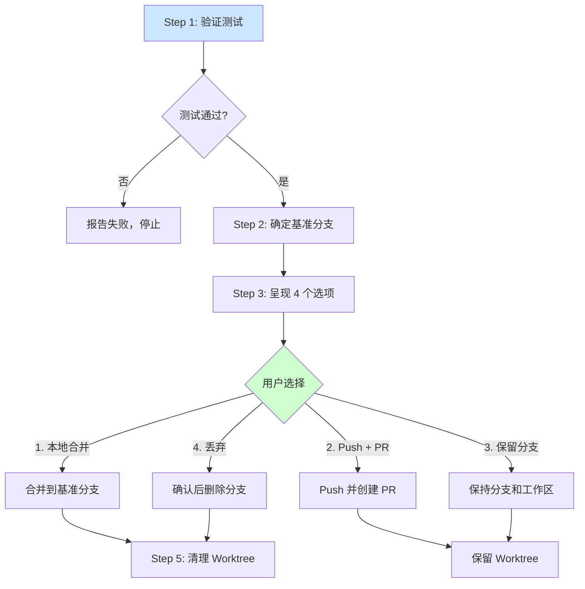

<details>
<summary>相关源文件</summary>

生成本页时使用的主要源文件：

- [skills/finishing-a-development-branch/SKILL.md:1-80](../../../project-repos/superpowers/skills/finishing-a-development-branch/SKILL.md#L1-L80)

</details>

# 结束开发分支

Finishing-a-Development-Branch 是工作流的收尾环节——当所有任务完成后，智能体验证测试通过，呈现 4 个明确的整合选项，让用户选择如何处理完成的工作。

**为什么需要这个技能？** 很多工作流在"代码写完"就结束了，但实际工程中还有重要步骤：验证测试、决定合并策略、清理工作区。这些步骤如果留给智能体自行决定，容易出现未验证就合并、worktree 未清理等问题。Finishing-a-Development-Branch 通过强制结构化确保这些步骤不会被跳过。

## 流程



**Option 4（丢弃）需要显式确认**：必须输入 "discard" 才能执行，防止误操作导致工作丢失。

Sources: [skills/finishing-a-development-branch/SKILL.md:20-50](../../../project-repos/superpowers/skills/finishing-a-development-branch/SKILL.md#L20-L50)

<details class="source-snippets">
<summary>引用源码</summary>

<!-- source-snippets:start -->

#### `skills/finishing-a-development-branch/SKILL.md:20-50`

````markdown
**Before presenting options, verify tests pass:**

```bash
# Run project's test suite
npm test / cargo test / pytest / go test ./...
```

**If tests fail:**
```
Tests failing (<N> failures). Must fix before completing:

[Show failures]

Cannot proceed with merge/PR until tests pass.
```

Stop. Don't proceed to Step 2.

**If tests pass:** Continue to Step 2.

### Step 2: Determine Base Branch

```bash
# Try common base branches
git merge-base HEAD main 2>/dev/null || git merge-base HEAD master 2>/dev/null
```

Or ask: "This branch split from main - is that correct?"

### Step 3: Present Options

````

<!-- source-snippets:end -->
</details>

## 四个选项详解

| 选项 | 操作 | Worktree 清理 | 适用场景 |
|------|------|--------------|---------|
| 1. 本地合并 | `git checkout` + `git merge` | ✅ 清理 | 快速验证后直接合并 |
| 2. Push + PR | `git push -u origin` + `gh pr create` | ❌ 保留 | 需要团队评审 |
| 3. 保留分支 | 不操作 | ❌ 保留 | 稍后继续或有其他考虑 |
| 4. 丢弃 | `git branch -D` | ✅ 清理 | 工作不符合预期，放弃 |

## 与 Using-Git-Worktrees 的配对

`finishing-a-development-branch` 清理 `using-git-worktrees` 创建的 Worktree：

```bash
# 检查当前是否在 Worktree 中
git worktree list | grep $(git branch --show-current)

# 清理
git worktree remove <worktree-path>
```

Option 2（Push + PR）保留 Worktree 是合理的——PR 可能需要修改，保留 Worktree 方便后续工作。其他选项（1、4）都应清理。

## 相关页面

- [Git Worktrees](git-worktrees) — Worktree 的创建与安全验证
- [Subagent-Driven Development](subagent-driven-development) — 执行阶段与分支创建
- [Code Review](code-review) — Option 2（PR）触发的评审流程
