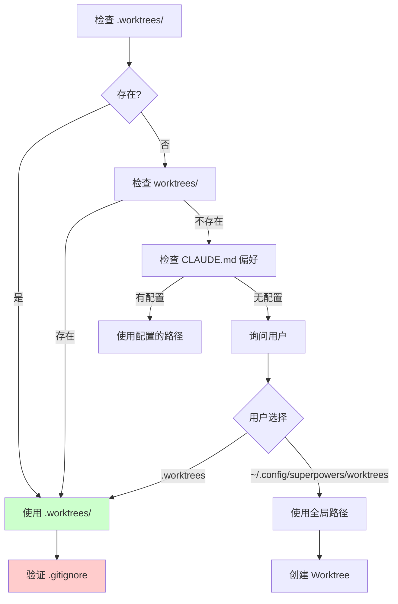

<details>
<summary>相关源文件</summary>

生成本页时使用的主要源文件：

- [skills/using-git-worktrees/SKILL.md:1-100](../../../project-repos/superpowers/skills/using-git-worktrees/SKILL.md#L1-L100)

</details>

# Git Worktrees 隔离工作区

Git Worktree 隔离是 Superpowers 工作流的第二个关键环节——在设计被批准、计划被编写后，实际编码工作在一个独立的 Git Worktree 中进行，与主分支完全隔离。

**为什么需要隔离？** 在主分支上开发会导致几个问题：未完成的代码可能被意外提交、切换分支会丢失上下文、工作区状态不干净导致难以做基线验证。Worktree 隔离解决了所有这些问题，同时避免了"完全独立 clone 仓库"的同步负担。

## 工作目录选择策略

Worktree 位置的选择有明确的优先级：



**关键安全检查**：如果选择项目本地目录（`.worktrees` 或 `worktrees`），必须先验证该目录是否被 `.gitignore` 忽略。未被忽略的 Worktree 目录内容会被意外提交到仓库，这是 Superpowers 明确要防止的。

Sources: [skills/using-git-worktrees/SKILL.md:20-40](../../../project-repos/superpowers/skills/using-git-worktrees/SKILL.md#L20-L40)

<details class="source-snippets">
<summary>引用源码</summary>

<!-- source-snippets:start -->

#### `skills/using-git-worktrees/SKILL.md:20-40`

````markdown
### 1. Check Existing Directories

```bash
# Check in priority order
ls -d .worktrees 2>/dev/null     # Preferred (hidden)
ls -d worktrees 2>/dev/null      # Alternative
```

**If found:** Use that directory. If both exist, `.worktrees` wins.

### 2. Check CLAUDE.md

```bash
grep -i "worktree.*director" CLAUDE.md 2>/dev/null
```

**If preference specified:** Use it without asking.

### 3. Ask User

If no directory exists and no CLAUDE.md preference:
````

<!-- source-snippets:end -->
</details>

## 自动化项目检测

创建 Worktree 后，技能会自动检测并运行项目的依赖安装：

```bash
# Node.js
if [ -f package.json ]; then npm install; fi

# Rust
if [ -f Cargo.toml ]; then cargo build; fi

# Python
if [ -f requirements.txt ]; then pip install -r requirements.txt; fi
if [ -f pyproject.toml ]; then poetry install; fi

# Go
if [ -f go.mod ]; then go mod download; fi
```

这是另一个 YAGNI 的体现——不假设特定项目结构，而是根据实际存在的文件做决策。

## 基线测试验证

安装完依赖后，技能必须运行测试套件验证 Worktree 处于干净的基线状态：

```bash
npm test / cargo test / pytest / go test ./...
```

如果测试失败，工作流停止——不能带着失败的基线进入实现阶段，否则无法区分新引入的 bug 和已有的问题。

## 与其他技能的衔接

`using-git-worktrees` 不是独立使用的——它被其他技能作为前置步骤调用：

- **brainstorming**（设计被批准后）→ 必须创建 Worktree 再进入计划编写
- **subagent-driven-development** → 每个任务的执行都在 Worktree 中进行
- **executing-plans** → 同上

**finishing-a-development-branch** 在工作完成后负责清理 Worktree，与这个技能形成配对。

## 相关页面

- [Subagent-Driven Development](subagent-driven-development) — 在 Worktree 中执行任务
- [Finishing Branch](finishing-branch) — 工作完成后的分支收尾与 Worktree 清理
- [Writing Plans](writing-plans) — 在 Worktree 中创建实现计划
