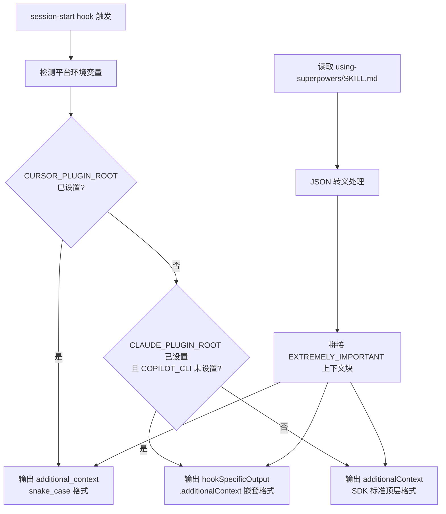

<details>
<summary>相关源文件</summary>

生成本页时使用的主要源文件：

- [hooks/hooks.json](../../../project-repos/superpowers/hooks/hooks.json)
- [hooks/session-start](../../../project-repos/superpowers/hooks/session-start)
- [hooks/run-hook.cmd](../../../project-repos/superpowers/hooks/run-hook.cmd)
- [skills/using-superpowers/SKILL.md:1-80](../../../project-repos/superpowers/skills/using-superpowers/SKILL.md#L1-L80)

</details>

# Hook 机制

Hook 机制是 Superpowers 的"神经系统"——它负责在每次会话启动时将技能上下文注入智能体，使技能触发从"被动建议"变成"强制执行"。

## Hook 配置

`hooks/hooks.json` 是平台无关的 Hook 注册配置：

```json
{
  "hooks": {
    "SessionStart": [
      {
        "matcher": "startup|clear|compact",
        "hooks": [
          {
            "type": "command",
            "command": "\"${CLAUDE_PLUGIN_ROOT}/hooks/run-hook.cmd\" session-start",
            "async": false
          }
        ]
      }
    ]
  }
}
```

**关键设计**：使用 `matcher` 字段过滤触发条件。`startup|clear|compact` 意味着 Hook 只在会话真正启动时触发，不会在每次用户消息时重复执行——避免了重复上下文注入，也保证了性能。

Sources: [hooks/hooks.json:1-15](../../../project-repos/superpowers/hooks/hooks.json#L1-L15)

<details class="source-snippets">
<summary>引用源码</summary>

<!-- source-snippets:start -->

#### `hooks/hooks.json:1-15`

```json
{
  "hooks": {
    "SessionStart": [
      {
        "matcher": "startup|clear|compact",
        "hooks": [
          {
            "type": "command",
            "command": "\"${CLAUDE_PLUGIN_ROOT}/hooks/run-hook.cmd\" session-start",
            "async": false
          }
        ]
      }
    ]
  }
```

<!-- source-snippets:end -->
</details>

## SessionStart 执行流程



**JSON 转义的特殊处理**：Hook 脚本使用 Bash 参数替换进行高效 JSON 转义，而非逐字符循环。这是性能优化的关键决策——在大型技能文件（`using-superpowers` 本身就有数百行）上，逐字符转义会显著拖慢会话启动速度。

Sources: [hooks/session-start:28-44](../../../project-repos/superpowers/hooks/session-start#L28-L44)

<details class="source-snippets">
<summary>引用源码</summary>

<!-- source-snippets:start -->

#### `hooks/session-start:28-44`

```
    s="${s//$'\r'/\\r}"
    s="${s//$'\t'/\\t}"
    printf '%s' "$s"
}

using_superpowers_escaped=$(escape_for_json "$using_superpowers_content")
warning_escaped=$(escape_for_json "$warning_message")
session_context="<EXTREMELY_IMPORTANT>\nYou have superpowers.\n\n**Below is the full content of your 'superpowers:using-superpowers' skill - your introduction to using skills. For all other skills, use the 'Skill' tool:**\n\n${using_superpowers_escaped}\n\n${warning_escaped}\n</EXTREMELY_IMPORTANT>"

# Output context injection as JSON.
# Cursor hooks expect additional_context (snake_case).
# Claude Code hooks expect hookSpecificOutput.additionalContext (nested).
# Copilot CLI (v1.0.11+) and others expect additionalContext (top-level, SDK standard).
# Claude Code reads BOTH additional_context and hookSpecificOutput without
# deduplication, so we must emit only the field the current platform consumes.
#
# Uses printf instead of heredoc to work around bash 5.3+ heredoc hang.
```

<!-- source-snippets:end -->
</details>

## 迁移警告机制

Hook 脚本包含一个向后兼容的警告机制：

```bash
legacy_skills_dir="${HOME}/.config/superpowers/skills"
if [ -d "$legacy_skills_dir" ]; then
    warning_message="⚠️ WARNING: Superpowers now uses Claude Code's skills system..."
fi
```

当检测到旧版安装路径 `~/.config/superpowers/skills` 仍然存在时，注入上下文会在下一次响应中显示迁移警告。这个警告机制保证了用户从旧版本升级时不会静默失效，而是得到明确的行动指引。

## 强制技能检查的机制

注入的 `using-superpowers` 技能内容包含以下关键指令：

```markdown
<EXTREMELY-IMPORTANT>
If you think there is even a 1% chance a skill might apply,
you ABSOLUTELY MUST invoke the skill.

IF A SKILL APPLIES TO YOUR TASK, YOU DO NOT HAVE A CHOICE.
YOU MUST USE IT.

This is not negotiable. This is not optional.
You cannot rationalize your way out of this.
</EXTREMELY-IMPORTANT>
```

这个 `<EXTREMELY-IMPORTANT>` 块是整个技能触发机制的核心。它使用 `<>` 而非 Markdown 强调符号，确保在所有平台的渲染环境中保持可见性。同时配合"Red Flags"表格，列举了智能体常见的自我合理化行为（如"这只是简单问题"、"我需要先了解更多上下文"），作为强制触发检查的认知锚点。

Sources: [skills/using-superpowers/SKILL.md:7-30](../../../project-repos/superpowers/skills/using-superpowers/SKILL.md#L7-L30)

<details class="source-snippets">
<summary>引用源码</summary>

<!-- source-snippets:start -->

#### `skills/using-superpowers/SKILL.md:7-30`

```markdown
If you were dispatched as a subagent to execute a specific task, skip this skill.
</SUBAGENT-STOP>

<EXTREMELY-IMPORTANT>
If you think there is even a 1% chance a skill might apply to what you are doing, you ABSOLUTELY MUST invoke the skill.

IF A SKILL APPLIES TO YOUR TASK, YOU DO NOT HAVE A CHOICE. YOU MUST USE IT.

This is not negotiable. This is not optional. You cannot rationalize your way out of this.
</EXTREMELY-IMPORTANT>

## Instruction Priority

Superpowers skills override default system prompt behavior, but **user instructions always take precedence**:

1. **User's explicit instructions** (CLAUDE.md, GEMINI.md, AGENTS.md, direct requests) — highest priority
2. **Superpowers skills** — override default system behavior where they conflict
3. **Default system prompt** — lowest priority

If CLAUDE.md, GEMINI.md, or AGENTS.md says "don't use TDD" and a skill says "always use TDD," follow the user's instructions. The user is in control.

## How to Access Skills

**In Claude Code:** Use the `Skill` tool. When you invoke a skill, its content is loaded and presented to you—follow it directly. Never use the Read tool on skill files.
```

<!-- source-snippets:end -->
</details>

## 相关页面

- [系统架构](system-architecture) — Hook 层在整体架构中的位置
- [插件系统](plugin-system) — 插件如何注册 Hook
- [技能框架](skills-system) — 技能内容的组织规范
