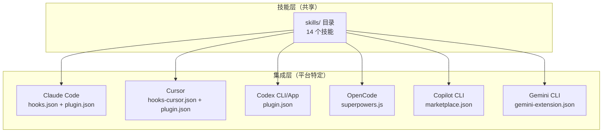

<details>
<summary>相关源文件</summary>

生成本页时使用的主要源文件：

- [.claude-plugin/plugin.json](https://github.com/obra/superpowers/blob/main/.claude-plugin/plugin.json)
- [.claude-plugin/marketplace.json](https://github.com/obra/superpowers/blob/main/.claude-plugin/marketplace.json)
- [.codex-plugin/plugin.json](https://github.com/obra/superpowers/blob/main/.codex-plugin/plugin.json)
- [.cursor-plugin/plugin.json](https://github.com/obra/superpowers/blob/main/.cursor-plugin/plugin.json)
- [.opencode/plugins/superpowers.js](https://github.com/obra/superpowers/blob/main/.opencode/plugins/superpowers.js)
- [.opencode/INSTALL.md](https://github.com/obra/superpowers/blob/main/.opencode/INSTALL.md)
- [gemini-extension.json](https://github.com/obra/superpowers/blob/main/gemini-extension.json)
- [GEMINI.md](https://github.com/obra/superpowers/blob/main/GEMINI.md)
- [hooks/run-hook.cmd](https://github.com/obra/superpowers/blob/main/hooks/run-hook.cmd)
- [docs/README.codex.md](https://github.com/obra/superpowers/blob/main/docs/README.codex.md)
- [docs/README.opencode.md](https://github.com/obra/superpowers/blob/main/docs/README.opencode.md)

</details>

# 多平台集成

Superpowers 的核心设计目标之一是跨平台兼容——同一套技能可以在 6 个不同的编码代理平台上运行。每个平台有独立的插件清单和集成机制，但共享相同的技能内容和引导逻辑。

## 平台支持矩阵



| 平台 | 引导机制 | 技能加载 | 子代理支持 | 安装方式 |
|------|----------|----------|------------|----------|
| Claude Code | SessionStart 钩子 | Skill 工具 | Task 工具 | 官方市场 / Superpowers 市场 |
| Cursor | sessionStart 钩子 | Skill 工具 | Task 工具 | 插件市场 `/add-plugin` |
| Codex CLI | 钩子 | Skill 工具 | 子代理系统 | 插件搜索安装 |
| Codex App | 钩子 | Skill 工具 | 子代理系统 | 侧栏 Plugins |
| OpenCode | messages.transform | 原生 skill 工具 | @mention | INSTALL.md 指引 |
| Copilot CLI | 钩子 | skill 工具 | 子代理 | marketplace |
| Gemini CLI | GEMINI.md 引导 | activate_skill | 有限 | extensions install |

Sources: [README.md:40-80](../../../project-repos/superpowers/README.md#L40-L80), [claude-plugin/plugin.json:1-20](../../../project-repos/superpowers/.claude-plugin/plugin.json#L1-L20), [codex-plugin/plugin.json:1-44](../../../project-repos/superpowers/.codex-plugin/plugin.json#L1-L44), [opencode/plugins/superpowers.js:1-112](../../../project-repos/superpowers/.opencode/plugins/superpowers.js#L1-L112)

<details class="source-snippets">
<summary>引用源码</summary>

<!-- source-snippets:start -->

#### `README.md:40-80`

````markdown

### Claude Code (Superpowers Marketplace)

The Superpowers marketplace provides Superpowers and some other related plugins for Claude Code.

In Claude Code, register the marketplace first:

```bash
/plugin marketplace add obra/superpowers-marketplace
```

Then install the plugin from this marketplace:

```bash
/plugin install superpowers@superpowers-marketplace
```

### OpenAI Codex CLI

- Open plugin search interface

```bash
/plugins
```

Search for Superpowers

```bash
superpowers
```

Select `Install Plugin`

### OpenAI Codex App

- In the Codex app, click on Plugins in the sidebar.
- You should see `Superpowers` in the Coding section. 
- Click the `+` next to Superpowers and follow the prompts.


### Cursor (via Plugin Marketplace)
````

#### `claude-plugin/plugin.json:1-20`

```json
{
  "name": "superpowers",
  "description": "Core skills library for Claude Code: TDD, debugging, collaboration patterns, and proven techniques",
  "version": "5.0.7",
  "author": {
    "name": "Jesse Vincent",
    "email": "jesse@fsck.com"
  },
  "homepage": "https://github.com/obra/superpowers",
  "repository": "https://github.com/obra/superpowers",
  "license": "MIT",
  "keywords": [
    "skills",
    "tdd",
    "debugging",
    "collaboration",
    "best-practices",
    "workflows"
  ]
}
```

#### `codex-plugin/plugin.json:1-44`

```json
{
  "name": "superpowers",
  "version": "5.0.7",
  "description": "An agentic skills framework & software development methodology that works: planning, TDD, debugging, and collaboration workflows.",
  "author": {
    "name": "Jesse Vincent",
    "email": "jesse@fsck.com",
    "url": "https://github.com/obra"
  },
  "homepage": "https://github.com/obra/superpowers",
  "repository": "https://github.com/obra/superpowers",
  "license": "MIT",
  "keywords": [
    "brainstorming",
    "subagent-driven-development",
    "skills",
    "planning",
    "tdd",
    "debugging",
    "code-review",
    "workflow"
  ],
  "skills": "./skills/",
  "interface": {
    "displayName": "Superpowers",
    "shortDescription": "Planning, TDD, debugging, and delivery workflows for coding agents",
    "longDescription": "Use Superpowers to guide agent work through brainstorming, implementation planning, test-driven development, systematic debugging, parallel execution, code review, and finish-the-branch workflows.",
    "developerName": "Jesse Vincent",
    "category": "Coding",
    "capabilities": [
      "Interactive",
      "Read",
      "Write"
    ],
    "defaultPrompt": [
      "I've got an idea for something I'd like to build.",
      "Let's add a feature to this project."
    ],
    "brandColor": "#F59E0B",
    "composerIcon": "./assets/superpowers-small.svg",
    "logo": "./assets/app-icon.png",
    "screenshots": []
  }
}
```

#### `opencode/plugins/superpowers.js:1-112`

```javascript
/**
 * Superpowers plugin for OpenCode.ai
 *
 * Injects superpowers bootstrap context via system prompt transform.
 * Auto-registers skills directory via config hook (no symlinks needed).
 */

import path from 'path';
import fs from 'fs';
import os from 'os';
import { fileURLToPath } from 'url';

const __dirname = path.dirname(fileURLToPath(import.meta.url));

// Simple frontmatter extraction (avoid dependency on skills-core for bootstrap)
const extractAndStripFrontmatter = (content) => {
  const match = content.match(/^---\n([\s\S]*?)\n---\n([\s\S]*)$/);
  if (!match) return { frontmatter: {}, content };

  const frontmatterStr = match[1];
  const body = match[2];
  const frontmatter = {};

  for (const line of frontmatterStr.split('\n')) {
    const colonIdx = line.indexOf(':');
    if (colonIdx > 0) {
      const key = line.slice(0, colonIdx).trim();
      const value = line.slice(colonIdx + 1).trim().replace(/^["']|["']$/g, '');
      frontmatter[key] = value;
    }
  }

  return { frontmatter, content: body };
};

// Normalize a path: trim whitespace, expand ~, resolve to absolute
const normalizePath = (p, homeDir) => {
  if (!p || typeof p !== 'string') return null;
  let normalized = p.trim();
  if (!normalized) return null;
  if (normalized.startsWith('~/')) {
    normalized = path.join(homeDir, normalized.slice(2));
  } else if (normalized === '~') {
    normalized = homeDir;
  }
  return path.resolve(normalized);
};

export const SuperpowersPlugin = async ({ client, directory }) => {
  const homeDir = os.homedir();
  const superpowersSkillsDir = path.resolve(__dirname, '../../skills');
  const envConfigDir = normalizePath(process.env.OPENCODE_CONFIG_DIR, homeDir);
  const configDir = envConfigDir || path.join(homeDir, '.config/opencode');

  // Helper to generate bootstrap content
  const getBootstrapContent = () => {
    // Try to load using-superpowers skill
    const skillPath = path.join(superpowersSkillsDir, 'using-superpowers', 'SKILL.md');
    if (!fs.existsSync(skillPath)) return null;

    const fullContent = fs.readFileSync(skillPath, 'utf8');
    const { content } = extractAndStripFrontmatter(fullContent);

    const toolMapping = `**Tool Mapping for OpenCode:**
When skills reference tools you don't have, substitute OpenCode equivalents:
- \`TodoWrite\` → \`todowrite\`
- \`Task\` tool with subagents → Use OpenCode's subagent system (@mention)
- \`Skill\` tool → OpenCode's native \`skill\` tool
- \`Read\`, \`Write\`, \`Edit\`, \`Bash\` → Your native tools

Use OpenCode's native \`skill\` tool to list and load skills.`;

    return `<EXTREMELY_IMPORTANT>
You have superpowers.

**IMPORTANT: The using-superpowers skill content is included below. It is ALREADY LOADED - you are currently following it. Do NOT use the skill tool to load "using-superpowers" again - that would be redundant.**

${content}

${toolMapping}
</EXTREMELY_IMPORTANT>`;
  };

  return {
    // Inject skills path into live config so OpenCode discovers superpowers skills
    // without requiring manual symlinks or config file edits.
    // This works because Config.get() returns a cached singleton — modifications
    // here are visible when skills are lazily discovered later.
    config: async (config) => {
      config.skills = config.skills || {};
      config.skills.paths = config.skills.paths || [];
      if (!config.skills.paths.includes(superpowersSkillsDir)) {
        config.skills.paths.push(superpowersSkillsDir);
      }
    },

    // Inject bootstrap into the first user message of each session.
    // Using a user message instead of a system message avoids:
    //   1. Token bloat from system messages repeated every turn (#750)
    //   2. Multiple system messages breaking Qwen and other models (#894)
    'experimental.chat.messages.transform': async (_input, output) => {
      const bootstrap = getBootstrapContent();
      if (!bootstrap || !output.messages.length) return;
      const firstUser = output.messages.find(m => m.info.role === 'user');
      if (!firstUser || !firstUser.parts.length) return;
      // Only inject once
      if (firstUser.parts.some(p => p.type === 'text' && p.text.includes('EXTREMELY_IMPORTANT'))) return;
      const ref = firstUser.parts[0];
      firstUser.parts.unshift({ ...ref, type: 'text', text: bootstrap });
    }
  };
};
```

<!-- source-snippets:end -->
</details>

## Claude Code 集成

Claude Code 是 Superpowers 的主要目标平台，拥有最完整的集成支持。

### 安装

两种市场安装方式：

```bash
# 方式一：Anthropic 官方市场
/plugin install superpowers@claude-plugins-official

# 方式二：Superpowers 市场（需先注册）
/plugin marketplace add obra/superpowers-marketplace
/plugin install superpowers@superpowers-marketplace
```

### 引导流程

Claude Code 通过 `hooks.json` 注册 SessionStart 钩子，匹配 `startup|clear|compact` 事件。钩子执行 `session-start` 脚本，将 `using-superpowers` 技能内容注入 `hookSpecificOutput.additionalContext`。

Claude Code 同时读取 `additional_context` 和 `hookSpecificOutput` 且不进行去重，因此脚本必须只输出当前平台消费的字段格式，避免重复注入。

Sources: [hooks/hooks.json:1-16](../../../project-repos/superpowers/hooks/hooks.json#L1-L16), [hooks/session-start:42-57](../../../project-repos/superpowers/hooks/session-start#L42-L57)

<details class="source-snippets">
<summary>引用源码</summary>

<!-- source-snippets:start -->

#### `hooks/hooks.json:1-16`

```json
{
  "hooks": {
    "SessionStart": [
      {
        "matcher": "startup|clear|compact",
        "hooks": [
          {
            "type": "command",
            "command": "\"${CLAUDE_PLUGIN_ROOT}/hooks/run-hook.cmd\" session-start",
            "async": false
          }
        ]
      }
    ]
  }
}
```

#### `hooks/session-start:42-57`

```
# deduplication, so we must emit only the field the current platform consumes.
#
# Uses printf instead of heredoc to work around bash 5.3+ heredoc hang.
# See: https://github.com/obra/superpowers/issues/571
if [ -n "${CURSOR_PLUGIN_ROOT:-}" ]; then
  # Cursor sets CURSOR_PLUGIN_ROOT (may also set CLAUDE_PLUGIN_ROOT)
  printf '{\n  "additional_context": "%s"\n}\n' "$session_context"
elif [ -n "${CLAUDE_PLUGIN_ROOT:-}" ] && [ -z "${COPILOT_CLI:-}" ]; then
  # Claude Code sets CLAUDE_PLUGIN_ROOT without COPILOT_CLI
  printf '{\n  "hookSpecificOutput": {\n    "hookEventName": "SessionStart",\n    "additionalContext": "%s"\n  }\n}\n' "$session_context"
else
  # Copilot CLI (sets COPILOT_CLI=1) or unknown platform — SDK standard format
  printf '{\n  "additionalContext": "%s"\n}\n' "$session_context"
fi

exit 0
```

<!-- source-snippets:end -->
</details>

## Cursor 集成

Cursor 使用 `hooks-cursor.json`（v1 格式）注册 `sessionStart` 钩子。与 Claude Code 的区别：

- 钩子格式为 v1 版本，使用 `sessionStart`（驼峰）而非 `SessionStart`
- 上下文注入使用 `additional_context`（蛇形命名）而非嵌套结构
- 通过 `CURSOR_PLUGIN_ROOT` 环境变量检测平台

安装方式：在 Cursor Agent 聊天中执行 `/add-plugin superpowers` 或在插件市场搜索。

Sources: [hooks/hooks-cursor.json:1-10](../../../project-repos/superpowers/hooks/hooks-cursor.json#L1-L10), [hooks/session-start:42-50](../../../project-repos/superpowers/hooks/session-start#L42-L50)

<details class="source-snippets">
<summary>引用源码</summary>

<!-- source-snippets:start -->

#### `hooks/hooks-cursor.json:1-10`

```json
{
  "version": 1,
  "hooks": {
    "sessionStart": [
      {
        "command": "./hooks/session-start"
      }
    ]
  }
}
```

#### `hooks/session-start:42-50`

```
# deduplication, so we must emit only the field the current platform consumes.
#
# Uses printf instead of heredoc to work around bash 5.3+ heredoc hang.
# See: https://github.com/obra/superpowers/issues/571
if [ -n "${CURSOR_PLUGIN_ROOT:-}" ]; then
  # Cursor sets CURSOR_PLUGIN_ROOT (may also set CLAUDE_PLUGIN_ROOT)
  printf '{\n  "additional_context": "%s"\n}\n' "$session_context"
elif [ -n "${CLAUDE_PLUGIN_ROOT:-}" ] && [ -z "${COPILOT_CLI:-}" ]; then
  # Claude Code sets CLAUDE_PLUGIN_ROOT without COPILOT_CLI
```

<!-- source-snippets:end -->
</details>

## Codex 集成

Codex 有两种形态——CLI 和 App，共享相同的 `.codex-plugin/plugin.json` 清单。

Codex 的清单最为详细，包含：
- `interface.displayName`：显示名称 "Superpowers"
- `interface.shortDescription` / `longDescription`：短/长描述
- `interface.capabilities`：`["Interactive", "Read", "Write"]`
- `interface.defaultPrompt`：默认提示词建议
- `interface.brandColor`：品牌色 `#F59E0B`
- `skills`：指向 `./skills/` 目录

安装方式：CLI 中使用 `/plugins` 搜索 "superpowers" 安装；App 中在侧栏 Plugins 的 Coding 分类点击 `+` 安装。

Sources: [codex-plugin/plugin.json:1-44](../../../project-repos/superpowers/.codex-plugin/plugin.json#L1-L44), [docs/README.codex.md](../../../project-repos/superpowers/docs/README.codex.md)

<details class="source-snippets">
<summary>引用源码</summary>

<!-- source-snippets:start -->

#### `codex-plugin/plugin.json:1-44`

```json
{
  "name": "superpowers",
  "version": "5.0.7",
  "description": "An agentic skills framework & software development methodology that works: planning, TDD, debugging, and collaboration workflows.",
  "author": {
    "name": "Jesse Vincent",
    "email": "jesse@fsck.com",
    "url": "https://github.com/obra"
  },
  "homepage": "https://github.com/obra/superpowers",
  "repository": "https://github.com/obra/superpowers",
  "license": "MIT",
  "keywords": [
    "brainstorming",
    "subagent-driven-development",
    "skills",
    "planning",
    "tdd",
    "debugging",
    "code-review",
    "workflow"
  ],
  "skills": "./skills/",
  "interface": {
    "displayName": "Superpowers",
    "shortDescription": "Planning, TDD, debugging, and delivery workflows for coding agents",
    "longDescription": "Use Superpowers to guide agent work through brainstorming, implementation planning, test-driven development, systematic debugging, parallel execution, code review, and finish-the-branch workflows.",
    "developerName": "Jesse Vincent",
    "category": "Coding",
    "capabilities": [
      "Interactive",
      "Read",
      "Write"
    ],
    "defaultPrompt": [
      "I've got an idea for something I'd like to build.",
      "Let's add a feature to this project."
    ],
    "brandColor": "#F59E0B",
    "composerIcon": "./assets/superpowers-small.svg",
    "logo": "./assets/app-icon.png",
    "screenshots": []
  }
}
```

#### `docs/README.codex.md`

````markdown
# Superpowers for Codex

Guide for using Superpowers with OpenAI Codex via native skill discovery.

## Quick Install

Tell Codex:

```
Fetch and follow instructions from https://raw.githubusercontent.com/obra/superpowers/refs/heads/main/.codex/INSTALL.md
```

## Manual Installation

### Prerequisites

- OpenAI Codex CLI
- Git

### Steps

1. Clone the repo:
   ```bash
   git clone https://github.com/obra/superpowers.git ~/.codex/superpowers
   ```

2. Create the skills symlink:
   ```bash
   mkdir -p ~/.agents/skills
   ln -s ~/.codex/superpowers/skills ~/.agents/skills/superpowers
   ```

3. Restart Codex.

4. **For subagent skills** (optional): Skills like `dispatching-parallel-agents` and `subagent-driven-development` require Codex's multi-agent feature. Add to your Codex config:
   ```toml
   [features]
   multi_agent = true
   ```

### Windows

Use a junction instead of a symlink (works without Developer Mode):

```powershell
New-Item -ItemType Directory -Force -Path "$env:USERPROFILE\.agents\skills"
cmd /c mklink /J "$env:USERPROFILE\.agents\skills\superpowers" "$env:USERPROFILE\.codex\superpowers\skills"
```

## How It Works

Codex has native skill discovery — it scans `~/.agents/skills/` at startup, parses SKILL.md frontmatter, and loads skills on demand. Superpowers skills are made visible through a single symlink:

```
~/.agents/skills/superpowers/ → ~/.codex/superpowers/skills/
```

The `using-superpowers` skill is discovered automatically and enforces skill usage discipline — no additional configuration needed.

## Usage

Skills are discovered automatically. Codex activates them when:
- You mention a skill by name (e.g., "use brainstorming")
- The task matches a skill's description
- The `using-superpowers` skill directs Codex to use one

### Personal Skills

Create your own skills in `~/.agents/skills/`:

```bash
mkdir -p ~/.agents/skills/my-skill
```

Create `~/.agents/skills/my-skill/SKILL.md`:

```markdown
---
name: my-skill
description: Use when [condition] - [what it does]
---

# My Skill

[Your skill content here]
```

The `description` field is how Codex decides when to activate a skill automatically — write it as a clear trigger condition.

## Updating

```bash
cd ~/.codex/superpowers && git pull
```

Skills update instantly through the symlink.

## Uninstalling

```bash
rm ~/.agents/skills/superpowers
```

**Windows (PowerShell):**
```powershell
Remove-Item "$env:USERPROFILE\.agents\skills\superpowers"
```

Optionally delete the clone: `rm -rf ~/.codex/superpowers` (Windows: `Remove-Item -Recurse -Force "$env:USERPROFILE\.codex\superpowers"`).

## Troubleshooting

### Skills not showing up

1. Verify the symlink: `ls -la ~/.agents/skills/superpowers`
2. Check skills exist: `ls ~/.codex/superpowers/skills`
3. Restart Codex — skills are discovered at startup

### Windows junction issues

````

<!-- source-snippets:end -->
</details>

## OpenCode 集成

OpenCode 使用完全不同的集成架构——一个 ES 模块插件而非钩子脚本。

### 插件架构

`superpowers.js` 导出 `SuperpowersPlugin` 异步函数，返回两个钩子：

1. **`config` 钩子**：将技能目录路径追加到 `config.skills.paths`，使 OpenCode 延迟发现技能
2. **`messages.transform` 钩子**：在首条用户消息前插入引导上下文

### 关键设计决策

- **使用用户消息而非系统消息**：避免系统消息每轮重复导致的 token 膨胀（#750），以及多条系统消息破坏 Qwen 等模型的问题（#894）
- **frontmatter 剥离**：插件自行实现简单的 frontmatter 解析，不依赖 skills-core
- **工具映射**：为 OpenCode 提供工具名称映射表（`TodoWrite` → `todowrite`，`Skill` → `skill` 等）
- **一次性注入**：检测消息中是否已包含 `EXTREMELY_IMPORTANT`，避免重复注入

### 安装

```text
Fetch and follow instructions from https://raw.githubusercontent.com/obra/superpowers/refs/heads/main/.opencode/INSTALL.md
```

Sources: [opencode/plugins/superpowers.js:1-112](../../../project-repos/superpowers/.opencode/plugins/superpowers.js#L1-L112), [opencode/INSTALL.md](../../../project-repos/superpowers/.opencode/INSTALL.md), [docs/README.opencode.md](../../../project-repos/superpowers/docs/README.opencode.md)

<details class="source-snippets">
<summary>引用源码</summary>

<!-- source-snippets:start -->

#### `opencode/plugins/superpowers.js:1-112`

```javascript
/**
 * Superpowers plugin for OpenCode.ai
 *
 * Injects superpowers bootstrap context via system prompt transform.
 * Auto-registers skills directory via config hook (no symlinks needed).
 */

import path from 'path';
import fs from 'fs';
import os from 'os';
import { fileURLToPath } from 'url';

const __dirname = path.dirname(fileURLToPath(import.meta.url));

// Simple frontmatter extraction (avoid dependency on skills-core for bootstrap)
const extractAndStripFrontmatter = (content) => {
  const match = content.match(/^---\n([\s\S]*?)\n---\n([\s\S]*)$/);
  if (!match) return { frontmatter: {}, content };

  const frontmatterStr = match[1];
  const body = match[2];
  const frontmatter = {};

  for (const line of frontmatterStr.split('\n')) {
    const colonIdx = line.indexOf(':');
    if (colonIdx > 0) {
      const key = line.slice(0, colonIdx).trim();
      const value = line.slice(colonIdx + 1).trim().replace(/^["']|["']$/g, '');
      frontmatter[key] = value;
    }
  }

  return { frontmatter, content: body };
};

// Normalize a path: trim whitespace, expand ~, resolve to absolute
const normalizePath = (p, homeDir) => {
  if (!p || typeof p !== 'string') return null;
  let normalized = p.trim();
  if (!normalized) return null;
  if (normalized.startsWith('~/')) {
    normalized = path.join(homeDir, normalized.slice(2));
  } else if (normalized === '~') {
    normalized = homeDir;
  }
  return path.resolve(normalized);
};

export const SuperpowersPlugin = async ({ client, directory }) => {
  const homeDir = os.homedir();
  const superpowersSkillsDir = path.resolve(__dirname, '../../skills');
  const envConfigDir = normalizePath(process.env.OPENCODE_CONFIG_DIR, homeDir);
  const configDir = envConfigDir || path.join(homeDir, '.config/opencode');

  // Helper to generate bootstrap content
  const getBootstrapContent = () => {
    // Try to load using-superpowers skill
    const skillPath = path.join(superpowersSkillsDir, 'using-superpowers', 'SKILL.md');
    if (!fs.existsSync(skillPath)) return null;

    const fullContent = fs.readFileSync(skillPath, 'utf8');
    const { content } = extractAndStripFrontmatter(fullContent);

    const toolMapping = `**Tool Mapping for OpenCode:**
When skills reference tools you don't have, substitute OpenCode equivalents:
- \`TodoWrite\` → \`todowrite\`
- \`Task\` tool with subagents → Use OpenCode's subagent system (@mention)
- \`Skill\` tool → OpenCode's native \`skill\` tool
- \`Read\`, \`Write\`, \`Edit\`, \`Bash\` → Your native tools

Use OpenCode's native \`skill\` tool to list and load skills.`;

    return `<EXTREMELY_IMPORTANT>
You have superpowers.

**IMPORTANT: The using-superpowers skill content is included below. It is ALREADY LOADED - you are currently following it. Do NOT use the skill tool to load "using-superpowers" again - that would be redundant.**

${content}

${toolMapping}
</EXTREMELY_IMPORTANT>`;
  };

  return {
    // Inject skills path into live config so OpenCode discovers superpowers skills
    // without requiring manual symlinks or config file edits.
    // This works because Config.get() returns a cached singleton — modifications
    // here are visible when skills are lazily discovered later.
    config: async (config) => {
      config.skills = config.skills || {};
      config.skills.paths = config.skills.paths || [];
      if (!config.skills.paths.includes(superpowersSkillsDir)) {
        config.skills.paths.push(superpowersSkillsDir);
      }
    },

    // Inject bootstrap into the first user message of each session.
    // Using a user message instead of a system message avoids:
    //   1. Token bloat from system messages repeated every turn (#750)
    //   2. Multiple system messages breaking Qwen and other models (#894)
    'experimental.chat.messages.transform': async (_input, output) => {
      const bootstrap = getBootstrapContent();
      if (!bootstrap || !output.messages.length) return;
      const firstUser = output.messages.find(m => m.info.role === 'user');
      if (!firstUser || !firstUser.parts.length) return;
      // Only inject once
      if (firstUser.parts.some(p => p.type === 'text' && p.text.includes('EXTREMELY_IMPORTANT'))) return;
      const ref = firstUser.parts[0];
      firstUser.parts.unshift({ ...ref, type: 'text', text: bootstrap });
    }
  };
};
```

#### `opencode/INSTALL.md`

````markdown
# Installing Superpowers for OpenCode

## Prerequisites

- [OpenCode.ai](https://opencode.ai) installed

## Installation

Add superpowers to the `plugin` array in your `opencode.json` (global or project-level):

```json
{
  "plugin": ["superpowers@git+https://github.com/obra/superpowers.git"]
}
```

Restart OpenCode. That's it — the plugin auto-installs and registers all skills.

Verify by asking: "Tell me about your superpowers"

## Migrating from the old symlink-based install

If you previously installed superpowers using `git clone` and symlinks, remove the old setup:

```bash
# Remove old symlinks
rm -f ~/.config/opencode/plugins/superpowers.js
rm -rf ~/.config/opencode/skills/superpowers

# Optionally remove the cloned repo
rm -rf ~/.config/opencode/superpowers

# Remove skills.paths from opencode.json if you added one for superpowers
```

Then follow the installation steps above.

## Usage

Use OpenCode's native `skill` tool:

```
use skill tool to list skills
use skill tool to load superpowers/brainstorming
```

## Updating

Superpowers updates automatically when you restart OpenCode.

To pin a specific version:

```json
{
  "plugin": ["superpowers@git+https://github.com/obra/superpowers.git#v5.0.3"]
}
```

## Troubleshooting

### Plugin not loading

1. Check logs: `opencode run --print-logs "hello" 2>&1 | grep -i superpowers`
2. Verify the plugin line in your `opencode.json`
3. Make sure you're running a recent version of OpenCode

### Skills not found

1. Use `skill` tool to list what's discovered
2. Check that the plugin is loading (see above)

### Tool mapping

When skills reference Claude Code tools:
- `TodoWrite` → `todowrite`
- `Task` with subagents → `@mention` syntax
- `Skill` tool → OpenCode's native `skill` tool
- File operations → your native tools

## Getting Help

- Report issues: https://github.com/obra/superpowers/issues
- Full documentation: https://github.com/obra/superpowers/blob/main/docs/README.opencode.md
````

#### `docs/README.opencode.md`

````markdown
# Superpowers for OpenCode

Complete guide for using Superpowers with [OpenCode.ai](https://opencode.ai).

## Installation

Add superpowers to the `plugin` array in your `opencode.json` (global or project-level):

```json
{
  "plugin": ["superpowers@git+https://github.com/obra/superpowers.git"]
}
```

Restart OpenCode. The plugin auto-installs via Bun and registers all skills automatically.

Verify by asking: "Tell me about your superpowers"

### Migrating from the old symlink-based install

If you previously installed superpowers using `git clone` and symlinks, remove the old setup:

```bash
# Remove old symlinks
rm -f ~/.config/opencode/plugins/superpowers.js
rm -rf ~/.config/opencode/skills/superpowers

# Optionally remove the cloned repo
rm -rf ~/.config/opencode/superpowers

# Remove skills.paths from opencode.json if you added one for superpowers
```

Then follow the installation steps above.

## Usage

### Finding Skills

Use OpenCode's native `skill` tool to list all available skills:

```
use skill tool to list skills
```

### Loading a Skill

```
use skill tool to load superpowers/brainstorming
```

### Personal Skills

Create your own skills in `~/.config/opencode/skills/`:

```bash
mkdir -p ~/.config/opencode/skills/my-skill
```

Create `~/.config/opencode/skills/my-skill/SKILL.md`:

```markdown
---
name: my-skill
description: Use when [condition] - [what it does]
---

# My Skill

[Your skill content here]
```

### Project Skills

Create project-specific skills in `.opencode/skills/` within your project.

**Skill Priority:** Project skills > Personal skills > Superpowers skills

## Updating

Superpowers updates automatically when you restart OpenCode. The plugin is re-installed from the git repository on each launch.

To pin a specific version, use a branch or tag:

```json
{
  "plugin": ["superpowers@git+https://github.com/obra/superpowers.git#v5.0.3"]
}
```

## How It Works

The plugin does two things:

1. **Injects bootstrap context** via the `experimental.chat.system.transform` hook, adding superpowers awareness to every conversation.
2. **Registers the skills directory** via the `config` hook, so OpenCode discovers all superpowers skills without symlinks or manual config.

### Tool Mapping

Skills written for Claude Code are automatically adapted for OpenCode:

- `TodoWrite` → `todowrite`
- `Task` with subagents → OpenCode's `@mention` system
- `Skill` tool → OpenCode's native `skill` tool
- File operations → Native OpenCode tools

## Troubleshooting

### Plugin not loading

1. Check OpenCode logs: `opencode run --print-logs "hello" 2>&1 | grep -i superpowers`
2. Verify the plugin line in your `opencode.json` is correct
3. Make sure you're running a recent version of OpenCode

### Skills not found

1. Use OpenCode's `skill` tool to list available skills
2. Check that the plugin is loading (see above)
3. Each skill needs a `SKILL.md` file with valid YAML frontmatter

````

<!-- source-snippets:end -->
</details>

## Gemini CLI 集成

Gemini CLI 使用最简的集成方式——一个 `gemini-extension.json` 指定 `contextFileName: "GEMINI.md"`。

`GEMINI.md` 文件只有两行，使用 `@` 语法引用技能文件：

```markdown
@./skills/using-superpowers/SKILL.md
@./skills/using-superpowers/references/gemini-tools.md
```

Gemini 在会话启动时自动加载这些文件作为上下文。技能通过 `activate_skill` 工具按需激活。

安装和更新：

```bash
gemini extensions install https://github.com/obra/superpowers
gemini extensions update superpowers
```

Sources: [gemini-extension.json:1-6](../../../project-repos/superpowers/gemini-extension.json#L1-L6), [GEMINI.md:1-2](../../../project-repos/superpowers/GEMINI.md#L1-L2)

<details class="source-snippets">
<summary>引用源码</summary>

<!-- source-snippets:start -->

#### `gemini-extension.json:1-6`

```json
{
  "name": "superpowers",
  "description": "Core skills library: TDD, debugging, collaboration patterns, and proven techniques",
  "version": "5.0.7",
  "contextFileName": "GEMINI.md"
}
```

#### `GEMINI.md:1-2`

```markdown
@./skills/using-superpowers/SKILL.md
@./skills/using-superpowers/references/gemini-tools.md
```

<!-- source-snippets:end -->
</details>

## 跨平台兼容性设计

### 钩子脚本的多平台输出

`session-start` 脚本通过环境变量检测当前平台，输出不同格式的 JSON：

```bash
if [ -n "${CURSOR_PLUGIN_ROOT:-}" ]; then
  # Cursor: additional_context
elif [ -n "${CLAUDE_PLUGIN_ROOT:-}" ] && [ -z "${COPILOT_CLI:-}" ]; then
  # Claude Code: hookSpecificOutput.additionalContext
else
  # Copilot CLI / 其他: additionalContext
fi
```

### Windows 兼容

`run-hook.cmd` 是一个多语言脚本，同时作为 Windows 批处理文件和 Unix shell 脚本运行。它按优先级搜索 Git Bash：

1. `C:\Program Files\Git\bin\bash.exe`
2. `C:\Program Files (x86)\Git\bin\bash.exe`
3. PATH 中的 `bash`

如果找不到 bash，静默退出而非报错——插件仍可工作，只是没有 SessionStart 上下文注入。

Sources: [hooks/session-start:42-57](../../../project-repos/superpowers/hooks/session-start#L42-L57), [hooks/run-hook.cmd:1-46](../../../project-repos/superpowers/hooks/run-hook.cmd#L1-L46)

<details class="source-snippets">
<summary>引用源码</summary>

<!-- source-snippets:start -->

#### `hooks/session-start:42-57`

```
# deduplication, so we must emit only the field the current platform consumes.
#
# Uses printf instead of heredoc to work around bash 5.3+ heredoc hang.
# See: https://github.com/obra/superpowers/issues/571
if [ -n "${CURSOR_PLUGIN_ROOT:-}" ]; then
  # Cursor sets CURSOR_PLUGIN_ROOT (may also set CLAUDE_PLUGIN_ROOT)
  printf '{\n  "additional_context": "%s"\n}\n' "$session_context"
elif [ -n "${CLAUDE_PLUGIN_ROOT:-}" ] && [ -z "${COPILOT_CLI:-}" ]; then
  # Claude Code sets CLAUDE_PLUGIN_ROOT without COPILOT_CLI
  printf '{\n  "hookSpecificOutput": {\n    "hookEventName": "SessionStart",\n    "additionalContext": "%s"\n  }\n}\n' "$session_context"
else
  # Copilot CLI (sets COPILOT_CLI=1) or unknown platform — SDK standard format
  printf '{\n  "additionalContext": "%s"\n}\n' "$session_context"
fi

exit 0
```

#### `hooks/run-hook.cmd:1-46`

```
: << 'CMDBLOCK'
@echo off
REM Cross-platform polyglot wrapper for hook scripts.
REM On Windows: cmd.exe runs the batch portion, which finds and calls bash.
REM On Unix: the shell interprets this as a script (: is a no-op in bash).
REM
REM Hook scripts use extensionless filenames (e.g. "session-start" not
REM "session-start.sh") so Claude Code's Windows auto-detection -- which
REM prepends "bash" to any command containing .sh -- doesn't interfere.
REM
REM Usage: run-hook.cmd <script-name> [args...]

if "%~1"=="" (
    echo run-hook.cmd: missing script name >&2
    exit /b 1
)

set "HOOK_DIR=%~dp0"

REM Try Git for Windows bash in standard locations
if exist "C:\Program Files\Git\bin\bash.exe" (
    "C:\Program Files\Git\bin\bash.exe" "%HOOK_DIR%%~1" %2 %3 %4 %5 %6 %7 %8 %9
    exit /b %ERRORLEVEL%
)
if exist "C:\Program Files (x86)\Git\bin\bash.exe" (
    "C:\Program Files (x86)\Git\bin\bash.exe" "%HOOK_DIR%%~1" %2 %3 %4 %5 %6 %7 %8 %9
    exit /b %ERRORLEVEL%
)

REM Try bash on PATH (e.g. user-installed Git Bash, MSYS2, Cygwin)
where bash >nul 2>nul
if %ERRORLEVEL% equ 0 (
    bash "%HOOK_DIR%%~1" %2 %3 %4 %5 %6 %7 %8 %9
    exit /b %ERRORLEVEL%
)

REM No bash found - exit silently rather than error
REM (plugin still works, just without SessionStart context injection)
exit /b 0
CMDBLOCK

# Unix: run the named script directly
SCRIPT_DIR="$(cd "$(dirname "$0")" && pwd)"
SCRIPT_NAME="$1"
shift
exec bash "${SCRIPT_DIR}/${SCRIPT_NAME}" "$@"
```

<!-- source-snippets:end -->
</details>

## 相关页面

- [系统架构](system-architecture.md)
- [项目概览](overview.md)
