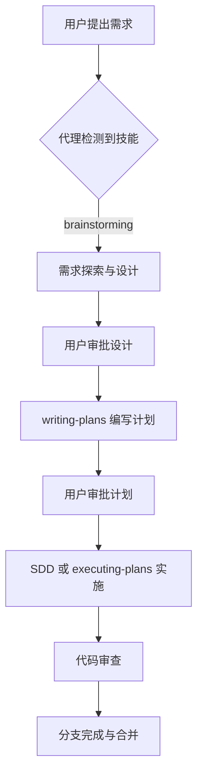

<details>
<summary>相关源文件</summary>

生成本页时使用的主要源文件：

- [README.md](https://github.com/obra/superpowers/blob/main/README.md)
- [package.json](https://github.com/obra/superpowers/blob/main/package.json)
- [CLAUDE.md](https://github.com/obra/superpowers/blob/main/CLAUDE.md)
- [LICENSE](https://github.com/obra/superpowers/blob/main/LICENSE)
- [RELEASE-NOTES.md](https://github.com/obra/superpowers/blob/main/RELEASE-NOTES.md)

</details>

# 项目概览

Superpowers 是一个面向编码代理（coding agent）的完整软件开发方法论框架，由 14 个可组合的技能（skill）构成，覆盖从需求探索到分支交付的全流程。它不是一组建议，而是一套强制执行的工作流——代理在会话启动时自动加载引导技能，并在每个任务前检查是否有适用的技能需要触发。

当前版本为 **5.0.7**，以 MIT 协议开源，由 Jesse Vincent 及 Prime Radiant 团队维护。

Sources: [package.json:1-6](../../../project-repos/superpowers/package.json#L1-L6), [README.md:1-10](../../../project-repos/superpowers/README.md#L1-L10)

<details class="source-snippets">
<summary>引用源码</summary>

<!-- source-snippets:start -->

#### `package.json:1-6`

```json
{
  "name": "superpowers",
  "version": "5.0.7",
  "type": "module",
  "main": ".opencode/plugins/superpowers.js"
}
```

#### `README.md:1-10`

```markdown
# Superpowers

Superpowers is a complete software development methodology for your coding agents, built on top of a set of composable skills and some initial instructions that make sure your agent uses them.

## How it works

It starts from the moment you fire up your coding agent. As soon as it sees that you're building something, it *doesn't* just jump into trying to write code. Instead, it steps back and asks you what you're really trying to do. 

Once it's teased a spec out of the conversation, it shows it to you in chunks short enough to actually read and digest. 

```

<!-- source-snippets:end -->
</details>

## 项目定位

Superpowers 解决的核心问题是：编码代理倾向于直接跳入写代码，跳过设计、规划和测试环节。Superpowers 通过技能系统强制代理遵循结构化流程——先理解需求、再设计方案、然后编写计划、最后以 TDD 方式实施并审查。



Sources: [README.md:3-10](../../../project-repos/superpowers/README.md#L3-L10), [skills/using-superpowers/SKILL.md:1-30](../../../project-repos/superpowers/skills/using-superpowers/SKILL.md#L1-L30)

<details class="source-snippets">
<summary>引用源码</summary>

<!-- source-snippets:start -->

#### `README.md:3-10`

```markdown
Superpowers is a complete software development methodology for your coding agents, built on top of a set of composable skills and some initial instructions that make sure your agent uses them.

## How it works

It starts from the moment you fire up your coding agent. As soon as it sees that you're building something, it *doesn't* just jump into trying to write code. Instead, it steps back and asks you what you're really trying to do. 

Once it's teased a spec out of the conversation, it shows it to you in chunks short enough to actually read and digest. 

```

#### `skills/using-superpowers/SKILL.md:1-30`

```markdown
---
name: using-superpowers
description: Use when starting any conversation - establishes how to find and use skills, requiring Skill tool invocation before ANY response including clarifying questions
---

<SUBAGENT-STOP>
If you were dispatched as a subagent to execute a specific task, skip this skill.
</SUBAGENT-STOP>

<EXTREMELY-IMPORTANT>
If you think there is even a 1% chance a skill might apply to what you are doing, you ABSOLUTELY MUST invoke the skill.

IF A SKILL APPLIES TO YOUR TASK, YOU DO NOT HAVE A CHOICE. YOU MUST USE IT.

This is not negotiable. This is not optional. You cannot rationalize your way out of this.
</EXTREMELY-IMPORTANT>

## Instruction Priority

Superpowers skills override default system prompt behavior, but **user instructions always take precedence**:

1. **User's explicit instructions** (CLAUDE.md, GEMINI.md, AGENTS.md, direct requests) — highest priority
2. **Superpowers skills** — override default system behavior where they conflict
3. **Default system prompt** — lowest priority

If CLAUDE.md, GEMINI.md, or AGENTS.md says "don't use TDD" and a skill says "always use TDD," follow the user's instructions. The user is in control.

## How to Access Skills

**In Claude Code:** Use the `Skill` tool. When you invoke a skill, its content is loaded and presented to you—follow it directly. Never use the Read tool on skill files.
```

<!-- source-snippets:end -->
</details>

## 核心能力

| 能力 | 说明 | 对应技能 |
|------|------|----------|
| 需求探索 | 苏格拉底式提问，逐个问题澄清需求 | brainstorming |
| 设计文档 | 自动生成设计规格并提交 Git | brainstorming |
| 实施计划 | 将设计分解为 2-5 分钟的原子任务 | writing-plans |
| 子代理驱动 | 每个任务分派独立子代理，两阶段审查 | subagent-driven-development |
| 测试驱动 | RED-GREEN-REFACTOR 铁律，先写失败测试 | test-driven-development |
| 系统化调试 | 四阶段根因分析，禁止猜测式修复 | systematic-debugging |
| 代码审查 | 规格合规审查 + 代码质量审查 | requesting-code-review |
| 分支管理 | Git worktree 隔离 + 分支完成工作流 | using-git-worktrees, finishing-a-development-branch |
| 技能编写 | TDD 式编写技能，含压力测试验证 | writing-skills |

Sources: [README.md:82-128](../../../project-repos/superpowers/README.md#L82-L128)

<details class="source-snippets">
<summary>引用源码</summary>

<!-- source-snippets:start -->

#### `README.md:82-128`

````markdown
In Cursor Agent chat, install from marketplace:

```text
/add-plugin superpowers
```

or search for "superpowers" in the plugin marketplace.

### OpenCode

Tell OpenCode:

```
Fetch and follow instructions from https://raw.githubusercontent.com/obra/superpowers/refs/heads/main/.opencode/INSTALL.md
```

**Detailed docs:** [docs/README.opencode.md](docs/README.opencode.md)

### GitHub Copilot CLI

```bash
copilot plugin marketplace add obra/superpowers-marketplace
copilot plugin install superpowers@superpowers-marketplace
```

### Gemini CLI

```bash
gemini extensions install https://github.com/obra/superpowers
```

To update:

```bash
gemini extensions update superpowers
```

## The Basic Workflow

1. **brainstorming** - Activates before writing code. Refines rough ideas through questions, explores alternatives, presents design in sections for validation. Saves design document.

2. **using-git-worktrees** - Activates after design approval. Creates isolated workspace on new branch, runs project setup, verifies clean test baseline.

3. **writing-plans** - Activates with approved design. Breaks work into bite-sized tasks (2-5 minutes each). Every task has exact file paths, complete code, verification steps.

4. **subagent-driven-development** or **executing-plans** - Activates with plan. Dispatches fresh subagent per task with two-stage review (spec compliance, then code quality), or executes in batches with human checkpoints.

````

<!-- source-snippets:end -->
</details>

## 设计哲学

Superpowers 的设计哲学可以概括为四条原则：

1. **测试驱动开发**——始终先写测试，没有例外
2. **系统化优于即兴**——遵循流程而非猜测
3. **复杂度缩减**——简洁是首要目标
4. **证据优于断言**——验证后再宣布成功

这些原则贯穿所有技能。例如 `test-driven-development` 技能声明"如果你没有看到测试失败，你不知道它测试了正确的东西"；`systematic-debugging` 技能要求"没有根因调查就不能提出修复"；`verification-before-completion` 技能规定"没有新鲜验证证据就不能声称完成"。

Sources: [README.md:130-135](../../../project-repos/superpowers/README.md#L130-L135), [skills/test-driven-development/SKILL.md:1-15](../../../project-repos/superpowers/skills/test-driven-development/SKILL.md#L1-L15), [skills/systematic-debugging/SKILL.md:1-15](../../../project-repos/superpowers/skills/systematic-debugging/SKILL.md#L1-L15), [skills/verification-before-completion/SKILL.md:1-10](../../../project-repos/superpowers/skills/verification-before-completion/SKILL.md#L1-L10)

<details class="source-snippets">
<summary>引用源码</summary>

<!-- source-snippets:start -->

#### `README.md:130-135`

```markdown

6. **requesting-code-review** - Activates between tasks. Reviews against plan, reports issues by severity. Critical issues block progress.

7. **finishing-a-development-branch** - Activates when tasks complete. Verifies tests, presents options (merge/PR/keep/discard), cleans up worktree.

**The agent checks for relevant skills before any task.** Mandatory workflows, not suggestions.
```

#### `skills/test-driven-development/SKILL.md:1-15`

```markdown
---
name: test-driven-development
description: Use when implementing any feature or bugfix, before writing implementation code
---

# Test-Driven Development (TDD)

## Overview

Write the test first. Watch it fail. Write minimal code to pass.

**Core principle:** If you didn't watch the test fail, you don't know if it tests the right thing.

**Violating the letter of the rules is violating the spirit of the rules.**

```

#### `skills/systematic-debugging/SKILL.md:1-15`

```markdown
---
name: systematic-debugging
description: Use when encountering any bug, test failure, or unexpected behavior, before proposing fixes
---

# Systematic Debugging

## Overview

Random fixes waste time and create new bugs. Quick patches mask underlying issues.

**Core principle:** ALWAYS find root cause before attempting fixes. Symptom fixes are failure.

**Violating the letter of this process is violating the spirit of debugging.**

```

#### `skills/verification-before-completion/SKILL.md:1-10`

```markdown
---
name: verification-before-completion
description: Use when about to claim work is complete, fixed, or passing, before committing or creating PRs - requires running verification commands and confirming output before making any success claims; evidence before assertions always
---

# Verification Before Completion

## Overview

Claiming work is complete without verification is dishonesty, not efficiency.
```

<!-- source-snippets:end -->
</details>

## 仓库结构

```text
superpowers/
├── .claude-plugin/        # Claude Code 插件清单
├── .codex-plugin/         # Codex 插件清单
├── .cursor-plugin/        # Cursor 插件清单
├── .opencode/             # OpenCode 插件与安装指南
├── agents/                # 代理定义（code-reviewer）
├── commands/              # 已弃用的命令（迁移至技能）
├── docs/                  # 设计文档、规格、计划
├── hooks/                 # SessionStart 钩子（引导注入）
├── scripts/               # 版本管理与 Codex 同步脚本
├── skills/                # 14 个技能目录
├── tests/                 # 集成测试与技能触发测试
├── CLAUDE.md              # Claude Code 贡献者指南
├── GEMINI.md              # Gemini CLI 引导文件
└── package.json           # v5.0.7
```

Sources: [00-repo-inventory.md](../00-repo-inventory.md)

<details class="source-snippets">
<summary>引用源码</summary>

<!-- source-snippets:start -->

#### `00-repo-inventory.md`

```markdown
# 00 - 仓库盘点

## Source

- Path: `/Users/bytedance/workspace/deepwiki/project-repos/superpowers`
- Remote: `https://github.com/obra/superpowers`
- Branch: `main`
- Commit: `e7a2d16476bf042e9add4699c9d018a90f86e4a6`

## File Summary

- Files scanned: 147
- Top-level directories: `.claude-plugin`, `.codex`, `.codex-plugin`, `.cursor-plugin`, `.github`, `.opencode`, `agents`, `assets`, `commands`, `docs`, `hooks`, `scripts`, `skills`, `tests`

| Extension | Count |
|-----------|------:|
| `.md` | 74 |
| `.sh` | 28 |
| `.txt` | 15 |
| `.json` | 11 |
| `.js` | 5 |
| `[no extension]` | 4 |
| `.yml` | 2 |
| `.png` | 1 |
| `.svg` | 1 |
| `.cmd` | 1 |
| `.html` | 1 |
| `.cjs` | 1 |
| `.ts` | 1 |
| `.dot` | 1 |
| `.py` | 1 |

## Manifests and Build Files

- `package.json`
- `tests/brainstorm-server/package-lock.json`
- `tests/brainstorm-server/package.json`

## Documentation

- `CODE_OF_CONDUCT.md`
- `README.md`
- `docs/README.codex.md`
- `docs/README.opencode.md`
- `docs/plans/2025-11-22-opencode-support-design.md`
- `docs/plans/2025-11-22-opencode-support-implementation.md`
- `docs/plans/2025-11-28-skills-improvements-from-user-feedback.md`
- `docs/plans/2026-01-17-visual-brainstorming.md`
- `docs/superpowers/plans/2026-01-22-document-review-system.md`
- `docs/superpowers/plans/2026-02-19-visual-brainstorming-refactor.md`
- `docs/superpowers/plans/2026-03-11-zero-dep-brainstorm-server.md`
- `docs/superpowers/plans/2026-03-23-codex-app-compatibility.md`
- `docs/superpowers/specs/2026-01-22-document-review-system-design.md`
- `docs/superpowers/specs/2026-02-19-visual-brainstorming-refactor-design.md`
- `docs/superpowers/specs/2026-03-11-zero-dep-brainstorm-server-design.md`
- `docs/superpowers/specs/2026-03-23-codex-app-compatibility-design.md`
- `docs/testing.md`
- `docs/windows/polyglot-hooks.md`
- `tests/claude-code/README.md`

## CI and Automation

- None detected

## Tests

- `tests/brainstorm-server/package-lock.json`
- `tests/brainstorm-server/package.json`
- `tests/brainstorm-server/server.test.js`
- `tests/brainstorm-server/windows-lifecycle.test.sh`
- `tests/brainstorm-server/ws-protocol.test.js`
- `tests/claude-code/README.md`
- `tests/claude-code/analyze-token-usage.py`
- `tests/claude-code/run-skill-tests.sh`
- `tests/claude-code/test-document-review-system.sh`
- `tests/claude-code/test-helpers.sh`
- `tests/claude-code/test-subagent-driven-development-integration.sh`
- `tests/claude-code/test-subagent-driven-development.sh`
- `tests/codex-plugin-sync/test-sync-to-codex-plugin.sh`
- `tests/explicit-skill-requests/prompts/action-oriented.txt`
- `tests/explicit-skill-requests/prompts/after-planning-flow.txt`
- `tests/explicit-skill-requests/prompts/claude-suggested-it.txt`
- `tests/explicit-skill-requests/prompts/i-know-what-sdd-means.txt`
- `tests/explicit-skill-requests/prompts/mid-conversation-execute-plan.txt`
- `tests/explicit-skill-requests/prompts/please-use-brainstorming.txt`
- `tests/explicit-skill-requests/prompts/skip-formalities.txt`
- `tests/explicit-skill-requests/prompts/subagent-driven-development-please.txt`
- `tests/explicit-skill-requests/prompts/use-systematic-debugging.txt`
- `tests/explicit-skill-requests/run-all.sh`
- `tests/explicit-skill-requests/run-claude-describes-sdd.sh`
- `tests/explicit-skill-requests/run-extended-multiturn-test.sh`
- `tests/explicit-skill-requests/run-haiku-test.sh`
- `tests/explicit-skill-requests/run-multiturn-test.sh`
- `tests/explicit-skill-requests/run-test.sh`
- `tests/opencode/run-tests.sh`
- `tests/opencode/setup.sh`
- `tests/opencode/test-plugin-loading.sh`
- `tests/opencode/test-priority.sh`
- `tests/opencode/test-tools.sh`
- `tests/skill-triggering/prompts/dispatching-parallel-agents.txt`
- `tests/skill-triggering/prompts/executing-plans.txt`
- `tests/skill-triggering/prompts/requesting-code-review.txt`
- `tests/skill-triggering/prompts/systematic-debugging.txt`
- `tests/skill-triggering/prompts/test-driven-development.txt`
- `tests/skill-triggering/prompts/writing-plans.txt`
- `tests/skill-triggering/run-all.sh`
- `tests/skill-triggering/run-test.sh`
- `tests/subagent-driven-dev/go-fractals/design.md`
- `tests/subagent-driven-dev/go-fractals/plan.md`
- `tests/subagent-driven-dev/go-fractals/scaffold.sh`
- `tests/subagent-driven-dev/run-test.sh`
- `tests/subagent-driven-dev/svelte-todo/design.md`
- `tests/subagent-driven-dev/svelte-todo/plan.md`
- `tests/subagent-driven-dev/svelte-todo/scaffold.sh`

## Skills

- `skills/brainstorming/SKILL.md`
- `skills/dispatching-parallel-agents/SKILL.md`
- `skills/executing-plans/SKILL.md`
```

<!-- source-snippets:end -->
</details>

## 阅读路线

- **想了解项目是什么？** → 继续阅读本页，然后看 [核心工作流](core-workflow.md)
- **想理解技能如何被发现和加载？** → 阅读 [系统架构](system-architecture.md)
- **想了解子代理驱动开发？** → 阅读 [子代理驱动开发](subagent-driven-development.md)
- **想了解 TDD 和调试方法论？** → 阅读 [测试驱动与系统化调试](tdd-and-debugging.md)
- **想在特定平台上安装使用？** → 阅读 [多平台集成](multi-platform-integration.md)
- **想编写自定义技能？** → 阅读 [扩展与贡献](extension-and-contribution.md)

## 相关页面

- [系统架构](system-architecture.md)
- [核心工作流](core-workflow.md)
- [技能体系](skills-system.md)
