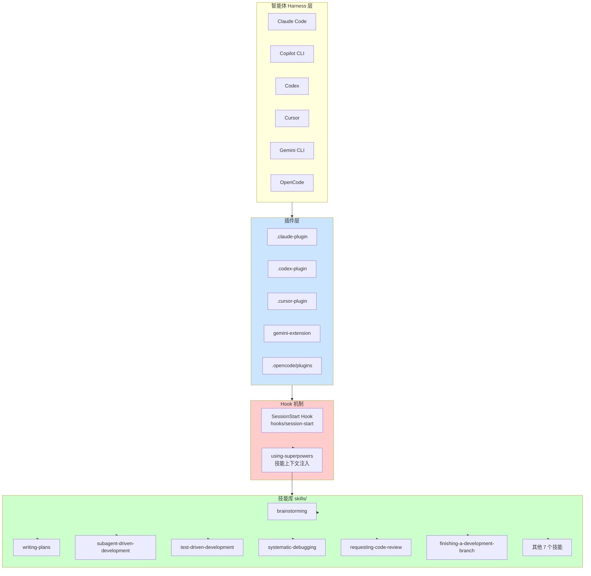

<details>
<summary>相关源文件</summary>

生成本页时使用的主要源文件：

- [README.md](../../../project-repos/superpowers/README.md)
- [AGENTS.md](../../../project-repos/superpowers/AGENTS.md)
- [package.json](../../../project-repos/superpowers/package.json)
- [skills/using-superpowers/SKILL.md](../../../project-repos/superpowers/skills/using-superpowers/SKILL.md)

</details>

# 项目概览

Superpowers 是一个 AI 编码智能体的完整开发方法论，以一组可组合的技能（Skills）为载体，解决了一个根本问题：**AI 智能体在没有结构化流程约束时，容易直接跳进写代码，导致返工、浪费算力、输出质量不稳定。**

它的核心思路是：智能体在动手之前必须经历"需求澄清 → 设计确认 → 计划拆分 → 执行与评审"的完整链路。每个环节由对应技能强制触发，而不是靠智能体的"自觉"。

**这个项目解决了什么问题？** 真实痛点是：AI 编程工具越来越强，但智能体的工作方式仍然是"接需求就写代码"。这在简单任务上没问题，但在复杂系统里导致返工、架构不一致、测试被跳过。Superpowers 把人类工程师在真实项目中积累的工程纪律（TDD、设计先行、小步提交）注入到智能体的工作流程里。

**核心创新是什么？** 它不是又一个"提示词模板"，而是一套技能触发机制——智能体在特定上下文下自动调用对应技能，强制执行流程约束。这与直接将流程规则写入系统提示词有本质区别：技能可以被独立测试、迭代和跨平台复用。

## 能力全景

**多智能体统一工作流**：覆盖从需求到代码的完整链路——Brainstorming（设计探索）→ Writing Plans（任务拆分）→ Subagent-Driven Development（子任务分派与两阶段评审）→ TDD（红绿重构）→ 代码评审 → 分支结束。

**零依赖插件架构**：Superpowers 本身是零外部依赖的 JSON + Markdown 文件集，通过各平台的原生插件接口注入上下文，对智能体工作没有任何运行时侵入性。

**14 个专项技能库**：涵盖测试驱动开发、系统化调试、Git Worktree 隔离工作区、子任务并行执行、代码评审等工程实践，每个技能都有独立的触发条件和执行规范。

**多平台统一支持**：同一套技能系统通过不同的插件封装，同时支持 Claude Code、GitHub Copilot CLI、OpenAI Codex、Cursor、 Gemini CLI 和 OpenCode 六个主流 AI 编程平台。

**技能可被 TDD 验证**：技能的编写遵循与 TDD 相同的 RED-GREEN-REFACTOR 循环——先观察智能体在无技能约束下的行为失败，再编写技能规则使其合规。

## 架构鸟瞰



Hook 机制是整个系统的神经中枢：每次会话启动时，`session-start` 脚本将 `using-superpowers` 技能的完整内容注入智能体上下文，智能体在每次响应前检查是否有适用的技能——这实现了"强制触发"而非"建议使用"。

## 技术栈

Superpowers 是**零外部依赖**的设计典范：整个项目是纯 JSON + Markdown 文件集，唯一一个 JavaScript 文件是 `.opencode/plugins/superpowers.js` 作为 OpenCode 的入口。

```text
superpowers/
├── skills/                    # 14 个技能子目录
│   ├── brainstorming/
│   ├── test-driven-development/
│   ├── systematic-debugging/
│   ├── writing-plans/
│   ├── subagent-driven-development/
│   ├── requesting-code-review/
│   ├── finishing-a-development-branch/
│   ├── using-git-worktrees/
│   ├── receiving-code-review/
│   ├── verification-before-completion/
│   ├── executing-plans/
│   ├── dispatching-parallel-agents/
│   ├── writing-skills/
│   └── using-superpowers/
├── hooks/                    # SessionStart Hook 脚本
├── .claude-plugin/          # Claude Code 插件
├── .codex-plugin/            # OpenAI Codex 插件
├── .cursor-plugin/          # Cursor 插件
├── gemini-extension.json     # Gemini CLI 扩展
└── .opencode/plugins/       # OpenCode 插件
```

## 阅读路线推荐

| 读者目标 | 推荐页面顺序 |
|----------|-------------|
| **了解 Superpowers 是什么** | 项目概览 → 设计哲学 → 技能目录 |
| **研究插件系统实现** | 系统架构 → 插件系统 → Hook 机制 → 多平台支持 |
| **应用在工作流程** | Brainstorming → Writing Plans → Subagent-Driven Dev → TDD |
| **改进或新增技能** | 技能框架 → TDD → 设计哲学 → 技能目录 |
| **修复 bug / 调试** | 系统架构 → Hook 机制 → Verification 调试 |

## 相关页面

- [系统架构](system-architecture) — 插件层、Hook 机制与目录结构
- [设计哲学](philosophy) — TDD、系统化、证据优先的工程价值观
