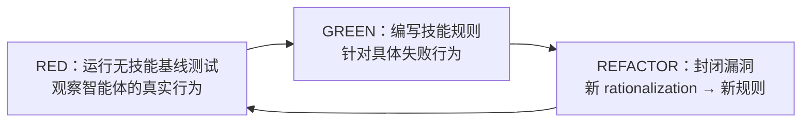

<details>
<summary>相关源文件</summary>

生成本页时使用的主要源文件：

- [skills/test-driven-development/SKILL.md:1-80](../../../project-repos/superpowers/skills/test-driven-development/SKILL.md#L1-L80)
- [skills/systematic-debugging/SKILL.md:1-60](../../../project-repos/superpowers/skills/systematic-debugging/SKILL.md#L1-L60)
- [skills/writing-skills/SKILL.md:1-80](../../../project-repos/superpowers/skills/writing-skills/SKILL.md#L1-L80)
- [skills/subagent-driven-development/SKILL.md:1-50](../../../project-repos/superpowers/skills/subagent-driven-development/SKILL.md#L1-L50)

</details>

# 设计哲学

Superpowers 的工程哲学建立在三个支柱上：**TDD（测试驱动开发）**、**系统化（Systematic over ad-hoc）**、**证据优先（Evidence over claims）**。这三个原则不只是写在文档里的口号，而是被编码进每个技能的行为约束里。

## TDD 作为元方法论

Superpowers 把 TDD 不仅应用于软件开发，还应用于技能开发本身。这是其设计哲学中最反直觉的一点：**技能的编写遵循与代码开发相同的 RED-GREEN-REFACTOR 循环**。



**为什么这很重要？** 技能是行为约束，不是散文描述。如果不通过实际运行来验证，一个技能可能看起来合理但实际上会被智能体在压力下绕过。TDD 循环确保技能能抵御真实的 rationalization（自我合理化）攻击。

Sources: [skills/writing-skills/SKILL.md:30-50](../../../project-repos/superpowers/skills/writing-skills/SKILL.md#L30-L50)

<details class="source-snippets">
<summary>引用源码</summary>

<!-- source-snippets:start -->

#### `skills/writing-skills/SKILL.md:30-50`

```markdown
## TDD Mapping for Skills

| TDD Concept | Skill Creation |
|-------------|----------------|
| **Test case** | Pressure scenario with subagent |
| **Production code** | Skill document (SKILL) |
| **Test fails (RED)** | Agent violates rule without skill (baseline) |
| **Test passes (GREEN)** | Agent complies with skill present |
| **Refactor** | Close loopholes while maintaining compliance |
| **Write test first** | Run baseline scenario BEFORE writing skill |
| **Watch it fail** | Document exact rationalizations agent uses |
| **Minimal code** | Write skill addressing those specific violations |
| **Watch it pass** | Verify agent now complies |
| **Refactor cycle** | Find new rationalizations → plug → re-verify |

The entire skill creation process follows RED-GREEN-REFACTOR.

## When to Create a Skill

**Create when:**
- Technique wasn't intuitively obvious to you
```

<!-- source-snippets:end -->
</details>

## 铁律原则（Iron Law）

Superpowers 的每个核心技能都包含一个"Iron Law"条款，明确禁止任何绕过流程的尝试：

- **TDD 铁律**：`NO PRODUCTION CODE WITHOUT A FAILING TEST FIRST`——先写测试，看它失败，再写最小代码。
- **调试铁律**：`NO FIXES WITHOUT ROOT CAUSE INVESTIGATION FIRST`——找到根因才能修复，不能凭直觉打补丁。
- **Brainstorming 铁律**：`<HARD-GATE>`——在呈现设计并获得用户批准之前，不调用任何实现技能。

铁律后面跟着具体的"No exceptions"列表，说明哪些常见的"例外"实际上不是例外。这直接针对智能体在压力下（时间紧迫、任务看似简单）自我放松纪律的倾向。

## Rationalization 防御表

Superpowers 在每个纪律性技能中包含一个 Rationalization（自我合理化）防御表，列举智能体常见的自我合理化借口和对应的现实反击：

| 智能体的想法 | 现实 |
|------------|------|
| "这太简单了，不需要测试" | 简单代码也会坏。测试只需要 30 秒。 |
| "我之后再测" | 测试通过立刻证明不了什么。 |
| "手动测试足够了" | 手动测试是随机的。没有记录，不能重跑。 |
| "删掉这几小时的工作太浪费了" | 沉没成本谬误。保留无法信任的代码是技术债务。 |
| "这只是精神层面的，不是仪式" | 违反规则的文字就是违反规则的精神。 |

这些表格不是泛泛的心理建议，而是从实际测试场景中积累的真实行为模式。

## YAGNI 和 DRY

Superpowers 的 Writing Plans 和 Writing Skills 技能强调两个核心工程原则：

- **YAGNI（You Aren't Gonna Need It）**：从设计中删除不必要的功能。Superpowers 的 Brainstorming 技能要求在设计阶段就严格削减范围——简单项目可能有很短的设计，复杂的系统才需要更详细的文档，但所有项目都要经历这个设计→确认的流程。
- **DRY（Don't Repeat Yourself）**：任务卡片中不引用其他任务的内容。每个任务的步骤必须完整自足，因为智能体可能不按顺序读取任务。

## 证据优先

Systematic Debugging 技能的核心原则是：**找到根因前不提议修复**。症状修复是失败。

这与很多 AI 智能体的工作方式直接冲突——智能体天然倾向于快速给出"看起来合理的修复"。调试铁律通过四阶段流程（Root Cause → Pattern Analysis → Hypothesis → Implementation）强制改变这个行为模式。

## "Human Partner" 术语

Superpowers 坚持使用"your human partner"（你的人类伙伴）而非"user"（用户）。这是一个有意识的设计选择，反映了它对 AI 智能体与人类关系的认知：智能体不是独立运作的工具，而是人类合作伙伴的助手。语言的选择影响智能体的行为——把人类视为"合作伙伴"而非"使用者"会导致更尊重、更协作的交互模式。

这个术语选择还被编码进了 AGENTS.md 中的贡献指南，明确指出不要随意将"human partner"替换为"user"——这是经过测试验证的行为塑造用语。

## 相关页面

- [项目概览](overview) — Superpowers 的定位与核心能力
- [TDD](test-driven-development) — RED-GREEN-REFACTOR 铁律详解
- [系统调试](verification) — 四阶段根因分析方法
- [技能框架](skills-system) — TDD 方法论如何应用于技能开发
