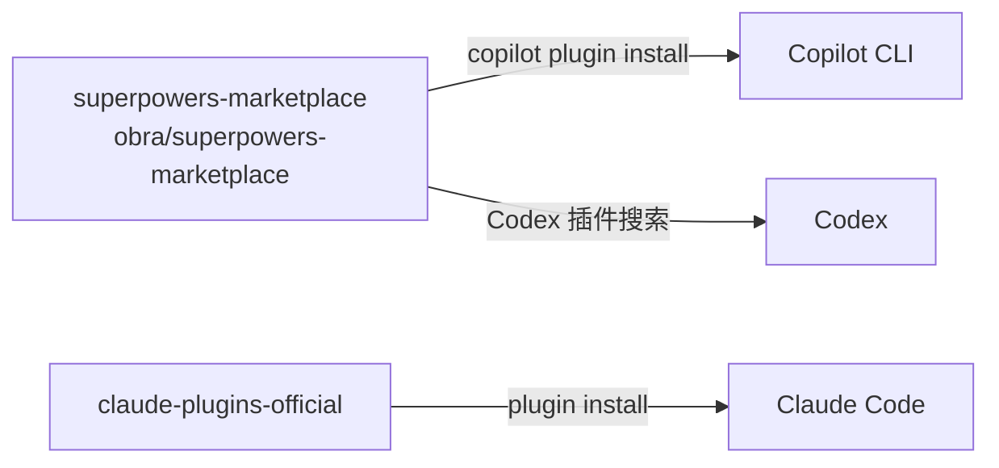

<details>
<summary>相关源文件</summary>

生成本页时使用的主要源文件：

- [.claude-plugin/plugin.json](../../../project-repos/superpowers/.claude-plugin/plugin.json)
- [.claude-plugin/marketplace.json](../../../project-repos/superpowers/.claude-plugin/marketplace.json)
- [.codex-plugin/plugin.json](../../../project-repos/superpowers/.codex-plugin/plugin.json)
- [.cursor-plugin/plugin.json](../../../project-repos/superpowers/.cursor-plugin/plugin.json)
- [gemini-extension.json](../../../project-repos/superpowers/gemini-extension.json)
- [.opencode/plugins/superpowers.js](../../../project-repos/superpowers/.opencode/plugins/superpowers.js)
- [README.md:installation章节](../../../project-repos/superpowers/README.md#L1-L20)

</details>

# 插件系统

Superpowers 为 6 个主流 AI 编程平台各自提供了一套插件注册文件。这些插件文件的职责高度一致：**声明元数据（名称、版本、描述）和注册 Hook 配置**，实际的技能注入逻辑由统一的 `hooks/` 脚本处理。

## 各平台插件对比

| 平台 | 插件文件 | 安装方式 | 特点 |
|------|---------|---------|------|
| Claude Code | `.claude-plugin/plugin.json` | `/plugin install superpowers@claude-plugins-official` | 官方 marketplace + 自建 marketplace |
| GitHub Copilot CLI | `.codex-plugin/plugin.json` | `copilot plugin install superpowers@superpowers-marketplace` | 与 Codex 共用同一套插件 |
| OpenAI Codex | `.codex-plugin/plugin.json` | 插件搜索界面安装 | 与 Copilot CLI 共用 |
| Cursor | `.cursor-plugin/plugin.json` | `/add-plugin superpowers` | 命令式安装 |
| Gemini CLI | `gemini-extension.json` | `gemini extensions install` | 扩展格式 |
| OpenCode | `.opencode/plugins/superpowers.js` | `FETCH ... INSTALL.md` | JavaScript 入口文件 |

## Claude Code 插件注册

```json
{
  "name": "superpowers",
  "description": "Core skills library for Claude Code: TDD, debugging, collaboration patterns, and proven techniques",
  "version": "5.0.7",
  "author": { "name": "Jesse Vincent", "email": "jesse@fsck.com" },
  "homepage": "https://github.com/obra/superpowers",
  "license": "MIT",
  "keywords": ["skills", "tdd", "debugging", "collaboration", "best-practices", "workflows"]
}
```

描述字段是技能被发现的关键——Claude Code 的技能系统在会话启动时扫描所有已安装插件的元数据，用描述字段作为语义匹配的依据。Superpowers 的描述明确列出了 "TDD"、"debugging"、"collaboration patterns"，确保智能体在相关任务上下文中能正确触发。

Sources: [claude-plugin/plugin.json:1-12](../../../project-repos/superpowers/.claude-plugin/plugin.json#L1-L12)

<details class="source-snippets">
<summary>引用源码</summary>

<!-- source-snippets:start -->

#### `claude-plugin/plugin.json:1-12`

```json
{
  "name": "superpowers",
  "description": "Core skills library for Claude Code: TDD, debugging, collaboration patterns, and proven techniques",
  "version": "5.0.7",
  "author": {
    "name": "Jesse Vincent",
    "email": "jesse@fsck.com"
  },
  "homepage": "https://github.com/obra/superpowers",
  "repository": "https://github.com/obra/superpowers",
  "license": "MIT",
  "keywords": [
```

<!-- source-snippets:end -->
</details>

## OpenCode JavaScript 插件

OpenCode 使用 JavaScript 入口文件而非 JSON：

```javascript
// .opencode/plugins/superpowers.js
// 这是唯一的运行时 .js 文件，也是项目中唯一的外部依赖引用
```

OpenCode 的安装方式与其他平台不同——不是通过包管理器，而是要求用户告知 OpenCode 去抓取远程的 `INSTALL.md`：

```
Fetch and follow instructions from https://raw.githubusercontent.com/obra/superpowers/refs/heads/main/.opencode/INSTALL.md
```

这体现了 Superpowers 的另一个设计哲学：**信任但验证的渐进式加载**。INSTALL.md 中包含完整的安装步骤，OpenCode 用户通过这个方式手动触发安装流程。

Sources: [opencode/INSTALL.md:1-20](../../../project-repos/superpowers/.opencode/INSTALL.md#L1-L20)

<details class="source-snippets">
<summary>引用源码</summary>

<!-- source-snippets:start -->

#### `opencode/INSTALL.md:1-20`

````markdown
# Installing Superpowers for OpenCode

## Prerequisites

- [OpenCode.ai](https://opencode.ai) installed

## Installation

Add superpowers to the `plugin` array in your `opencode.json` (global or project-level):

```json
{
  "plugin": ["superpowers@git+https://github.com/obra/superpowers.git"]
}
```

Restart OpenCode. That's it — the plugin auto-installs and registers all skills.

Verify by asking: "Tell me about your superpowers"

````

<!-- source-snippets:end -->
</details>

## 多平台 marketplace 架构

Claude Code、Copilot CLI 和 Codex 共享 `obra/superpowers-marketplace` 作为分发渠道：



marketplace 本质上是一个插件注册表，声明了可用的插件包和版本。Superpowers 的 marketplace 同时托管在 `obra/superpowers-marketplace`，允许非官方用户分发修改版本（需要 fork 并创建自己的 marketplace）。

**重要约束**：AGENTS.md 中明确规定，如果 PR 添加了对新 harness（新的 IDE 或 CLI 工具）的支持，必须包含端到端集成测试的会话记录。手动复制技能文件到 harness 或使用运行时包装脚本的方案不被接受。

Sources: [AGENTS.md:70-100](../../../project-repos/superpowers/AGENTS.md#L70-L100)

<details class="source-snippets">
<summary>引用源码</summary>

<!-- source-snippets:start -->

#### `AGENTS.md:70-100`

```markdown

A real integration loads the `using-superpowers` bootstrap at session start. The bootstrap is what causes skills to auto-trigger at the right moments. Without it, the skills are dead weight — present on disk but never invoked.

**The acceptance test.** Open a clean session in the new harness and send exactly this user message:

> Let's make a react todo list

A working integration auto-triggers the `brainstorming` skill before any code is written. Paste the complete transcript in the PR.

**These are not real integrations and will be closed:**

- Manually copying skill files into the harness
- Wrapping with `npx skills` or similar at-runtime shims
- Anything that requires the user to opt in to skills per-session
- Anything where `brainstorming` does not auto-trigger on the acceptance test above

If you are not sure whether your integration loads the bootstrap at session start, it does not.

## Skill Changes Require Evaluation

Skills are not prose — they are code that shapes agent behavior. If you modify skill content:

- Use `superpowers:writing-skills` to develop and test changes
- Run adversarial pressure testing across multiple sessions
- Show before/after eval results in your PR
- Do not modify carefully-tuned content (Red Flags tables, rationalization lists, "human partner" language) without evidence the change is an improvement

## Understand the Project Before Contributing

Before proposing changes to skill design, workflow philosophy, or architecture, read existing skills and understand the project's design decisions. Superpowers has its own tested philosophy about skill design, agent behavior shaping, and terminology (e.g., "your human partner" is deliberate, not interchangeable with "the user"). Changes that rewrite the project's voice or restructure its approach without understanding why it exists will be rejected.

```

<!-- source-snippets:end -->
</details>

## 相关页面

- [系统架构](system-architecture) — 插件层在整个架构中的位置
- [Hook 机制](hook-system) — 插件注册后如何通过 Hook 注入上下文
- [多平台支持](multi-platform) — 各平台的具体安装与配置步骤
