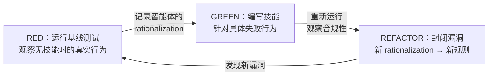

<details>
<summary>相关源文件</summary>

生成本页时使用的主要源文件：

- [skills/writing-skills/SKILL.md:1-100](../../../project-repos/superpowers/skills/writing-skills/SKILL.md#L1-L100)
- [skills/writing-skills/anthropic-best-practices.md:1-30](../../../project-repos/superpowers/skills/writing-skills/anthropic-best-practices.md#L1-L30)
- [skills/writing-skills/testing-skills-with-subagents.md:1-50](../../../project-repos/superpowers/skills/writing-skills/testing-skills-with-subagents.md#L1-L50)

</details>

# 技能框架

Superpowers 的技能（Skills）不是普通文档——它们是**经过行为测试的行为塑造工具**。每个技能的编写遵循与代码相同的 TDD 循环：先观察智能体在无约束下的行为失败，再编写技能规则使其合规。

## SKILL.md 结构

每个技能的 `SKILL.md` 包含以下标准章节：

```yaml
---
name: skill-name-with-hyphens    # 小写字母和连字符，无括号或特殊字符
description: Use when [具体触发条件]  # 必须是"Use when..."开头，描述触发情境
---
```

**YAML Frontmatter 要求**：
- `name`：仅使用字母、数字和连字符
- `description`：以 "Use when" 开头，描述触发条件而非工作流程

**关键约束**：`description` 字段只能描述触发条件，不能描述工作流程。如果描述中包含了工作流程摘要，智能体会走描述的捷径而跳过阅读完整的技能内容。

Sources: [skills/writing-skills/SKILL.md:40-60](../../../project-repos/superpowers/skills/writing-skills/SKILL.md#L40-L60)

<details class="source-snippets">
<summary>引用源码</summary>

<!-- source-snippets:start -->

#### `skills/writing-skills/SKILL.md:40-60`

```markdown
| **Watch it fail** | Document exact rationalizations agent uses |
| **Minimal code** | Write skill addressing those specific violations |
| **Watch it pass** | Verify agent now complies |
| **Refactor cycle** | Find new rationalizations → plug → re-verify |

The entire skill creation process follows RED-GREEN-REFACTOR.

## When to Create a Skill

**Create when:**
- Technique wasn't intuitively obvious to you
- You'd reference this again across projects
- Pattern applies broadly (not project-specific)
- Others would benefit

**Don't create for:**
- One-off solutions
- Standard practices well-documented elsewhere
- Project-specific conventions (put in CLAUDE)
- Mechanical constraints (if it's enforceable with regex/validation, automate it—save documentation for judgment calls)

```

<!-- source-snippets:end -->
</details>

## TDD 驱动的技能开发



**这是 Superpowers 设计哲学的核心体现**：技能不是"写出来感觉合理"的文档，而是经过对抗性测试的行为规则。Rationalization 防御表、Red Flags 列表和"No exceptions"条款都来自实际观察到的智能体绕过行为。

Sources: [skills/writing-skills/SKILL.md:80-100](../../../project-repos/superpowers/skills/writing-skills/SKILL.md#L80-L100)

<details class="source-snippets">
<summary>引用源码</summary>

<!-- source-snippets:start -->

#### `skills/writing-skills/SKILL.md:80-100`

````markdown
```

**Flat namespace** - all skills in one searchable namespace

**Separate files for:**
1. **Heavy reference** (100+ lines) - API docs, comprehensive syntax
2. **Reusable tools** - Scripts, utilities, templates

**Keep inline:**
- Principles and concepts
- Code patterns (< 50 lines)
- Everything else

## SKILL.md Structure

**Frontmatter (YAML):**
- Two required fields: `name` and `description` (see [agentskills.io/specification](https://agentskills.io/specification) for all supported fields)
- Max 1024 characters total
- `name`: Use letters, numbers, and hyphens only (no parentheses, special chars)
- `description`: Third-person, describes ONLY when to use (NOT what it does)
  - Start with "Use when..." to focus on triggering conditions
````

<!-- source-snippets:end -->
</details>

## 技能类型

| 类型 | 特征 | 示例 | 测试方式 |
|------|------|------|---------|
| **Discipline（纪律性）** | 强制执行规则 | TDD、Debugging | 压力场景测试，验证在压力下是否遵守 |
| **Technique（技术性）** | 步骤指南 | Condition-based-waiting | 应用场景测试 |
| **Pattern（模式）** | 思维框架 | Flatten-with-flags | 识别和应用场景测试 |
| **Reference（参考）** | API/工具文档 | Office docs | 检索和应用场景测试 |

## 命名规范

- **动词优先，使用动名词形式**：`creating-skills` 而非 `skill-creation`
- **一个技能一个核心动作**：`condition-based-waiting` 而非 `async-test-helpers`
- **与实际命令名一致**：保持与工具名称的对齐

## Token 效率

频繁加载的技能需要控制 token 消耗：

- **入门级工作流技能**：< 150 words
- **常用技能**：< 200 words
- **其他技能**：< 500 words

超长技能应该将重型参考内容移到单独的文件中。

## 交叉引用规范

引用其他技能时使用技能名，不使用 `@` 路径链接：

```markdown
**REQUIRED SUB-SKILL:** Use superpowers:test-driven-development
**REQUIRED BACKGROUND:** You MUST understand superpowers:systematic-debugging
```

使用 `@` 路径会强制立即加载整个文件，消耗大量上下文。

Sources: [skills/writing-skills/testing-skills-with-subagents.md:1-50](../../../project-repos/superpowers/skills/writing-skills/testing-skills-with-subagents.md#L1-L50)

<details class="source-snippets">
<summary>引用源码</summary>

<!-- source-snippets:start -->

#### `skills/writing-skills/testing-skills-with-subagents.md:1-50`

```markdown
# Testing Skills With Subagents

**Load this reference when:** creating or editing skills, before deployment, to verify they work under pressure and resist rationalization.

## Overview

**Testing skills is just TDD applied to process documentation.**

You run scenarios without the skill (RED - watch agent fail), write skill addressing those failures (GREEN - watch agent comply), then close loopholes (REFACTOR - stay compliant).

**Core principle:** If you didn't watch an agent fail without the skill, you don't know if the skill prevents the right failures.

**REQUIRED BACKGROUND:** You MUST understand superpowers:test-driven-development before using this skill. That skill defines the fundamental RED-GREEN-REFACTOR cycle. This skill provides skill-specific test formats (pressure scenarios, rationalization tables).

**Complete worked example:** See examples/CLAUDE_MD_TESTING.md for a full test campaign testing CLAUDE.md documentation variants.

## When to Use

Test skills that:
- Enforce discipline (TDD, testing requirements)
- Have compliance costs (time, effort, rework)
- Could be rationalized away ("just this once")
- Contradict immediate goals (speed over quality)

Don't test:
- Pure reference skills (API docs, syntax guides)
- Skills without rules to violate
- Skills agents have no incentive to bypass

## TDD Mapping for Skill Testing

| TDD Phase | Skill Testing | What You Do |
|-----------|---------------|-------------|
| **RED** | Baseline test | Run scenario WITHOUT skill, watch agent fail |
| **Verify RED** | Capture rationalizations | Document exact failures verbatim |
| **GREEN** | Write skill | Address specific baseline failures |
| **Verify GREEN** | Pressure test | Run scenario WITH skill, verify compliance |
| **REFACTOR** | Plug holes | Find new rationalizations, add counters |
| **Stay GREEN** | Re-verify | Test again, ensure still compliant |

Same cycle as code TDD, different test format.

## RED Phase: Baseline Testing (Watch It Fail)

**Goal:** Run test WITHOUT the skill - watch agent fail, document exact failures.

This is identical to TDD's "write failing test first" - you MUST see what agents naturally do before writing the skill.

**Process:**

```

<!-- source-snippets:end -->
</details>

## 相关页面

- [Skills Catalog](skills-catalog) — 14 个技能的具体索引
- [Philosophy](philosophy) — TDD 作为元方法论的设计哲学
