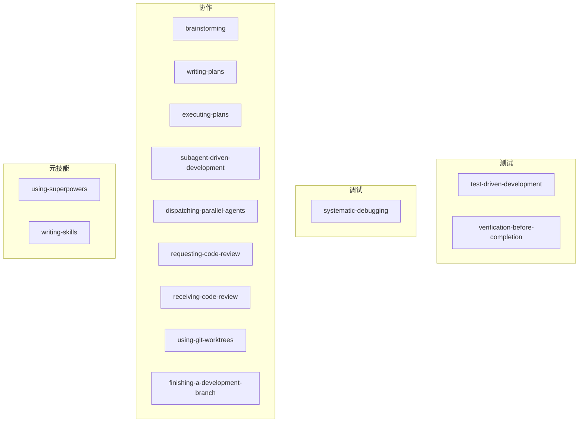
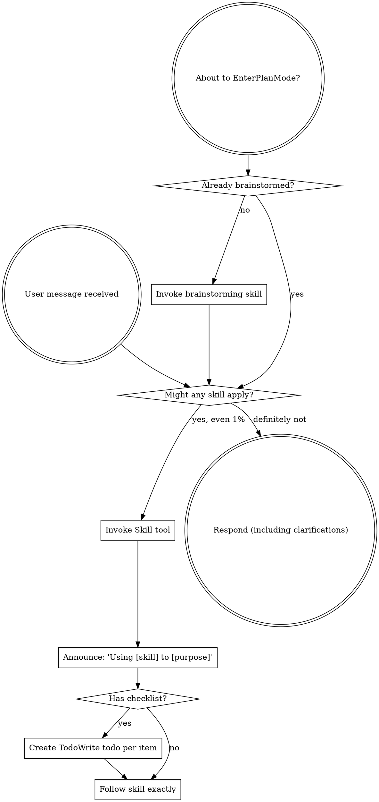

<details>
<summary>相关源文件</summary>

生成本页时使用的主要源文件：

- [skills/using-superpowers/SKILL.md](https://github.com/obra/superpowers/blob/main/skills/using-superpowers/SKILL.md)
- [skills/writing-skills/SKILL.md](https://github.com/obra/superpowers/blob/main/skills/writing-skills/SKILL.md)
- [skills/brainstorming/SKILL.md](https://github.com/obra/superpowers/blob/main/skills/brainstorming/SKILL.md)
- [skills/writing-plans/SKILL.md](https://github.com/obra/superpowers/blob/main/skills/writing-plans/SKILL.md)
- [skills/test-driven-development/SKILL.md](https://github.com/obra/superpowers/blob/main/skills/test-driven-development/SKILL.md)
- [skills/systematic-debugging/SKILL.md](https://github.com/obra/superpowers/blob/main/skills/systematic-debugging/SKILL.md)
- [skills/requesting-code-review/SKILL.md](https://github.com/obra/superpowers/blob/main/skills/requesting-code-review/SKILL.md)
- [skills/receiving-code-review/SKILL.md](https://github.com/obra/superpowers/blob/main/skills/receiving-code-review/SKILL.md)
- [skills/dispatching-parallel-agents/SKILL.md](https://github.com/obra/superpowers/blob/main/skills/dispatching-parallel-agents/SKILL.md)
- [skills/executing-plans/SKILL.md](https://github.com/obra/superpowers/blob/main/skills/executing-plans/SKILL.md)
- [skills/finishing-a-development-branch/SKILL.md](https://github.com/obra/superpowers/blob/main/skills/finishing-a-development-branch/SKILL.md)
- [skills/using-git-worktrees/SKILL.md](https://github.com/obra/superpowers/blob/main/skills/using-git-worktrees/SKILL.md)
- [skills/verification-before-completion/SKILL.md](https://github.com/obra/superpowers/blob/main/skills/verification-before-completion/SKILL.md)

</details>

# 技能体系

Superpowers 包含 14 个技能，分为四大类别：测试、调试、协作和元技能。每个技能是一个 `SKILL.md` 文件加上可选的辅助文件，遵循统一的目录结构和 frontmatter 规范。

## 技能分类



Sources: [README.md:82-128](../../../project-repos/superpowers/README.md#L82-L128), [skills/using-superpowers/SKILL.md](../../../project-repos/superpowers/skills/using-superpowers/SKILL.md)

<details class="source-snippets">
<summary>引用源码</summary>

<!-- source-snippets:start -->

#### `README.md:82-128`

````markdown
In Cursor Agent chat, install from marketplace:

```text
/add-plugin superpowers
```

or search for "superpowers" in the plugin marketplace.

### OpenCode

Tell OpenCode:

```
Fetch and follow instructions from https://raw.githubusercontent.com/obra/superpowers/refs/heads/main/.opencode/INSTALL.md
```

**Detailed docs:** [docs/README.opencode.md](docs/README.opencode.md)

### GitHub Copilot CLI

```bash
copilot plugin marketplace add obra/superpowers-marketplace
copilot plugin install superpowers@superpowers-marketplace
```

### Gemini CLI

```bash
gemini extensions install https://github.com/obra/superpowers
```

To update:

```bash
gemini extensions update superpowers
```

## The Basic Workflow

1. **brainstorming** - Activates before writing code. Refines rough ideas through questions, explores alternatives, presents design in sections for validation. Saves design document.

2. **using-git-worktrees** - Activates after design approval. Creates isolated workspace on new branch, runs project setup, verifies clean test baseline.

3. **writing-plans** - Activates with approved design. Breaks work into bite-sized tasks (2-5 minutes each). Every task has exact file paths, complete code, verification steps.

4. **subagent-driven-development** or **executing-plans** - Activates with plan. Dispatches fresh subagent per task with two-stage review (spec compliance, then code quality), or executes in batches with human checkpoints.

````

#### `skills/using-superpowers/SKILL.md`

````markdown
---
name: using-superpowers
description: Use when starting any conversation - establishes how to find and use skills, requiring Skill tool invocation before ANY response including clarifying questions
---

<SUBAGENT-STOP>
If you were dispatched as a subagent to execute a specific task, skip this skill.
</SUBAGENT-STOP>

<EXTREMELY-IMPORTANT>
If you think there is even a 1% chance a skill might apply to what you are doing, you ABSOLUTELY MUST invoke the skill.

IF A SKILL APPLIES TO YOUR TASK, YOU DO NOT HAVE A CHOICE. YOU MUST USE IT.

This is not negotiable. This is not optional. You cannot rationalize your way out of this.
</EXTREMELY-IMPORTANT>

## Instruction Priority

Superpowers skills override default system prompt behavior, but **user instructions always take precedence**:

1. **User's explicit instructions** (CLAUDE.md, GEMINI.md, AGENTS.md, direct requests) — highest priority
2. **Superpowers skills** — override default system behavior where they conflict
3. **Default system prompt** — lowest priority

If CLAUDE.md, GEMINI.md, or AGENTS.md says "don't use TDD" and a skill says "always use TDD," follow the user's instructions. The user is in control.

## How to Access Skills

**In Claude Code:** Use the `Skill` tool. When you invoke a skill, its content is loaded and presented to you—follow it directly. Never use the Read tool on skill files.

**In Copilot CLI:** Use the `skill` tool. Skills are auto-discovered from installed plugins. The `skill` tool works the same as Claude Code's `Skill` tool.

**In Gemini CLI:** Skills activate via the `activate_skill` tool. Gemini loads skill metadata at session start and activates the full content on demand.

**In other environments:** Check your platform's documentation for how skills are loaded.

## Platform Adaptation

Skills use Claude Code tool names. Non-CC platforms: see `references/copilot-tools.md` (Copilot CLI), `references/codex-tools.md` (Codex) for tool equivalents. Gemini CLI users get the tool mapping loaded automatically via GEMINI.md.

# Using Skills

## The Rule

**Invoke relevant or requested skills BEFORE any response or action.** Even a 1% chance a skill might apply means that you should invoke the skill to check. If an invoked skill turns out to be wrong for the situation, you don't need to use it.



## Red Flags

These thoughts mean STOP—you're rationalizing:

| Thought | Reality |
|---------|---------|
| "This is just a simple question" | Questions are tasks. Check for skills. |
| "I need more context first" | Skill check comes BEFORE clarifying questions. |
| "Let me explore the codebase first" | Skills tell you HOW to explore. Check first. |
| "I can check git/files quickly" | Files lack conversation context. Check for skills. |
| "Let me gather information first" | Skills tell you HOW to gather information. |
| "This doesn't need a formal skill" | If a skill exists, use it. |
| "I remember this skill" | Skills evolve. Read current version. |
| "This doesn't count as a task" | Action = task. Check for skills. |
| "The skill is overkill" | Simple things become complex. Use it. |
| "I'll just do this one thing first" | Check BEFORE doing anything. |
| "This feels productive" | Undisciplined action wastes time. Skills prevent this. |
| "I know what that means" | Knowing the concept ≠ using the skill. Invoke it. |

## Skill Priority

When multiple skills could apply, use this order:

1. **Process skills first** (brainstorming, debugging) - these determine HOW to approach the task
2. **Implementation skills second** (frontend-design, mcp-builder) - these guide execution

"Let's build X" → brainstorming first, then implementation skills.
"Fix this bug" → debugging first, then domain-specific skills.

## Skill Types

**Rigid** (TDD, debugging): Follow exactly. Don't adapt away discipline.

**Flexible** (patterns): Adapt principles to context.

The skill itself tells you which.

## User Instructions

Instructions say WHAT, not HOW. "Add X" or "Fix Y" doesn't mean skip workflows.
````

<!-- source-snippets:end -->
</details>
## 技能一览表

| 技能 | 类别 | 类型 | 核心原则 | 辅助文件 |
|------|------|------|----------|----------|
| using-superpowers | 元 | 灵活 | 1% 可能即调用 | references/ |
| brainstorming | 协作 | 灵活 | 先设计后实施 | scripts/, visual-companion.md, spec-document-reviewer-prompt.md |
| writing-plans | 协作 | 灵活 | 原子任务，无占位符 | plan-document-reviewer-prompt.md |
| executing-plans | 协作 | 刚性 | 按计划执行，遇阻即停 | — |
| subagent-driven-development | 协作 | 刚性 | 全新子代理 + 两阶段审查 | implementer-prompt.md, spec-reviewer-prompt.md, code-quality-reviewer-prompt.md |
| test-driven-development | 测试 | 刚性 | 先写测试，看它失败 | testing-anti-patterns.md |
| systematic-debugging | 调试 | 刚性 | 根因调查先于修复 | root-cause-tracing.md, defense-in-depth.md, condition-based-waiting.md |
| verification-before-completion | 测试 | 刚性 | 证据先于断言 | — |
| requesting-code-review | 协作 | 灵活 | 审查早且频繁 | code-reviewer.md |
| receiving-code-review | 协作 | 灵活 | 技术评估而非情感表演 | — |
| dispatching-parallel-agents | 协作 | 灵活 | 每个独立问题一个代理 | — |
| using-git-worktrees | 协作 | 灵活 | 系统化目录选择 + 安全验证 | — |
| finishing-a-development-branch | 协作 | 灵活 | 验证测试 → 提供选项 → 执行选择 | — |
| writing-skills | 元 | 灵活 | TDD 应用于文档 | anthropic-best-practices.md, testing-skills-with-subagents.md, render-graphs.js, graphviz-conventions.dot |

Sources: [skills/*/SKILL.md](../../../project-repos/superpowers/skills/%2A/SKILL.md)

<details class="source-snippets">
<summary>引用源码</summary>

<!-- source-snippets:start -->

#### `skills/*/SKILL.md`

> 未找到引用文件：`skills/*/SKILL.md`

<!-- source-snippets:end -->
</details>
## 技能类型：刚性 vs 灵活

技能分为两种类型，决定了遵循的严格程度：

### 刚性技能（Rigid）

TDD、调试等流程技能。必须严格遵循，不能偏离纪律。

- **test-driven-development**：RED-GREEN-REFACTOR 循环，铁律"没有失败测试就不写生产代码"
- **systematic-debugging**：四阶段流程，铁律"没有根因调查就不提修复"
- **verification-before-completion**：铁律"没有新鲜验证证据就不能声称完成"
- **subagent-driven-development**：两阶段审查顺序不可颠倒，审查循环不可跳过
- **executing-plans**：按计划步骤执行，遇阻塞立即停止

### 灵活技能（Flexible）

模式类技能。原则可适应上下文。

- **brainstorming**：问题数量和深度可根据项目复杂度调整
- **writing-plans**：任务粒度可根据项目规模调整
- **receiving-code-review**：反驳力度可根据审查来源调整

Sources: [skills/using-superpowers/SKILL.md:100-117](../../../project-repos/superpowers/skills/using-superpowers/SKILL.md#L100-L117)

<details class="source-snippets">
<summary>引用源码</summary>

<!-- source-snippets:start -->

#### `skills/using-superpowers/SKILL.md:100-117`

```markdown

1. **Process skills first** (brainstorming, debugging) - these determine HOW to approach the task
2. **Implementation skills second** (frontend-design, mcp-builder) - these guide execution

"Let's build X" → brainstorming first, then implementation skills.
"Fix this bug" → debugging first, then domain-specific skills.

## Skill Types

**Rigid** (TDD, debugging): Follow exactly. Don't adapt away discipline.

**Flexible** (patterns): Adapt principles to context.

The skill itself tells you which.

## User Instructions

Instructions say WHAT, not HOW. "Add X" or "Fix Y" doesn't mean skip workflows.
```

<!-- source-snippets:end -->
</details>
## SKILL.md 规范

每个技能必须包含 YAML frontmatter 和结构化的 Markdown 内容。

### Frontmatter

```yaml
---
name: skill-name-with-hyphens
description: Use when [specific triggering conditions and symptoms]
---
```

- `name`：仅使用字母、数字和连字符，最多 1024 字符
- `description`：第三人称，仅描述何时使用（不描述技能做什么），以 "Use when..." 开头，不超过 500 字符

### 内容结构

```markdown
# 技能名称

## Overview
核心原则 1-2 句话。

## When to Use
症状和使用场景列表。
何时不使用。

## Core Pattern / Checklist
核心流程或检查清单。

## Quick Reference
表格或要点，便于快速扫描。

## Common Mistakes
常见错误及修复。

## Red Flags
红旗思维模式。
```

Sources: [skills/writing-skills/SKILL.md:50-150](../../../project-repos/superpowers/skills/writing-skills/SKILL.md#L50-L150)

<details class="source-snippets">
<summary>引用源码</summary>

<!-- source-snippets:start -->

#### `skills/writing-skills/SKILL.md:50-150`

````markdown
- Technique wasn't intuitively obvious to you
- You'd reference this again across projects
- Pattern applies broadly (not project-specific)
- Others would benefit

**Don't create for:**
- One-off solutions
- Standard practices well-documented elsewhere
- Project-specific conventions (put in CLAUDE.md)
- Mechanical constraints (if it's enforceable with regex/validation, automate it—save documentation for judgment calls)

## Skill Types

### Technique
Concrete method with steps to follow (condition-based-waiting, root-cause-tracing)

### Pattern
Way of thinking about problems (flatten-with-flags, test-invariants)

### Reference
API docs, syntax guides, tool documentation (office docs)

## Directory Structure


```
skills/
  skill-name/
    SKILL.md              # Main reference (required)
    supporting-file.*     # Only if needed
```

**Flat namespace** - all skills in one searchable namespace

**Separate files for:**
1. **Heavy reference** (100+ lines) - API docs, comprehensive syntax
2. **Reusable tools** - Scripts, utilities, templates

**Keep inline:**
- Principles and concepts
- Code patterns (< 50 lines)
- Everything else

## SKILL.md Structure

**Frontmatter (YAML):**
- Two required fields: `name` and `description` (see [agentskills.io/specification](https://agentskills.io/specification) for all supported fields)
- Max 1024 characters total
- `name`: Use letters, numbers, and hyphens only (no parentheses, special chars)
- `description`: Third-person, describes ONLY when to use (NOT what it does)
  - Start with "Use when..." to focus on triggering conditions
  - Include specific symptoms, situations, and contexts
  - **NEVER summarize the skill's process or workflow** (see CSO section for why)
  - Keep under 500 characters if possible

```markdown
---
name: Skill-Name-With-Hyphens
description: Use when [specific triggering conditions and symptoms]
---

# Skill Name

## Overview
What is this? Core principle in 1-2 sentences.

## When to Use
[Small inline flowchart IF decision non-obvious]

Bullet list with SYMPTOMS and use cases
When NOT to use

## Core Pattern (for techniques/patterns)
Before/after code comparison

## Quick Reference
Table or bullets for scanning common operations

## Implementation
Inline code for simple patterns
Link to file for heavy reference or reusable tools

## Common Mistakes
What goes wrong + fixes

## Real-World Impact (optional)
Concrete results
```


## Claude Search Optimization (CSO)

**Critical for discovery:** Future Claude needs to FIND your skill

### 1. Rich Description Field

**Purpose:** Claude reads description to decide which skills to load for a given task. Make it answer: "Should I read this skill right now?"

**Format:** Start with "Use when..." to focus on triggering conditions

**CRITICAL: Description = When to Use, NOT What the Skill Does**
````

<!-- source-snippets:end -->
</details>
## Claude 搜索优化（CSO）

技能的发现依赖于 Claude 的搜索能力。CSO 策略确保技能能被正确找到和加载。

### 描述字段的陷阱

描述字段**只描述触发条件，不总结工作流**。测试发现，当描述总结了工作流时，Claude 可能直接遵循描述而非读取完整技能内容。

```yaml
# ❌ 错误：总结了工作流——Claude 可能跳过技能正文
description: Use when executing plans - dispatches subagent per task with code review between tasks

# ✅ 正确：只有触发条件
description: Use when executing implementation plans with independent tasks in the current session
```

实测案例：描述说"任务间代码审查"导致 Claude 只做一次审查，而技能流程图明确要求两阶段审查（规格合规 + 代码质量）。改为仅描述触发条件后，Claude 正确读取了流程图。

### 关键词覆盖

使用 Claude 会搜索的词汇：
- 错误消息："Hook timed out"、"ENOTEMPTY"、"race condition"
- 症状："flaky"、"hanging"、"zombie"、"pollution"
- 同义词："timeout/hang/freeze"、"cleanup/teardown/afterEach"
- 工具：实际命令名、库名、文件类型

### 命名规范

- 使用主动语态，动词优先：`creating-skills` 而非 `skill-creation`
- 动名词（-ing）适合流程：`brainstorming`、`writing-plans`
- 按核心洞察命名：`condition-based-waiting` 而非 `async-test-helpers`

### Token 效率

- 入门工作流：目标 < 150 词
- 频繁加载技能：目标 < 200 词
- 其他技能：目标 < 500 词

技巧：将细节移到工具帮助、使用交叉引用、压缩示例、消除冗余。

Sources: [skills/writing-skills/SKILL.md:150-300](../../../project-repos/superpowers/skills/writing-skills/SKILL.md#L150-L300)

<details class="source-snippets">
<summary>引用源码</summary>

<!-- source-snippets:start -->

#### `skills/writing-skills/SKILL.md:150-300`

````markdown
**CRITICAL: Description = When to Use, NOT What the Skill Does**

The description should ONLY describe triggering conditions. Do NOT summarize the skill's process or workflow in the description.

**Why this matters:** Testing revealed that when a description summarizes the skill's workflow, Claude may follow the description instead of reading the full skill content. A description saying "code review between tasks" caused Claude to do ONE review, even though the skill's flowchart clearly showed TWO reviews (spec compliance then code quality).

When the description was changed to just "Use when executing implementation plans with independent tasks" (no workflow summary), Claude correctly read the flowchart and followed the two-stage review process.

**The trap:** Descriptions that summarize workflow create a shortcut Claude will take. The skill body becomes documentation Claude skips.

```yaml
# ❌ BAD: Summarizes workflow - Claude may follow this instead of reading skill
description: Use when executing plans - dispatches subagent per task with code review between tasks

# ❌ BAD: Too much process detail
description: Use for TDD - write test first, watch it fail, write minimal code, refactor

# ✅ GOOD: Just triggering conditions, no workflow summary
description: Use when executing implementation plans with independent tasks in the current session

# ✅ GOOD: Triggering conditions only
description: Use when implementing any feature or bugfix, before writing implementation code
```

**Content:**
- Use concrete triggers, symptoms, and situations that signal this skill applies
- Describe the *problem* (race conditions, inconsistent behavior) not *language-specific symptoms* (setTimeout, sleep)
- Keep triggers technology-agnostic unless the skill itself is technology-specific
- If skill is technology-specific, make that explicit in the trigger
- Write in third person (injected into system prompt)
- **NEVER summarize the skill's process or workflow**

```yaml
# ❌ BAD: Too abstract, vague, doesn't include when to use
description: For async testing

# ❌ BAD: First person
description: I can help you with async tests when they're flaky

# ❌ BAD: Mentions technology but skill isn't specific to it
description: Use when tests use setTimeout/sleep and are flaky

# ✅ GOOD: Starts with "Use when", describes problem, no workflow
description: Use when tests have race conditions, timing dependencies, or pass/fail inconsistently

# ✅ GOOD: Technology-specific skill with explicit trigger
description: Use when using React Router and handling authentication redirects
```

### 2. Keyword Coverage

Use words Claude would search for:
- Error messages: "Hook timed out", "ENOTEMPTY", "race condition"
- Symptoms: "flaky", "hanging", "zombie", "pollution"
- Synonyms: "timeout/hang/freeze", "cleanup/teardown/afterEach"
- Tools: Actual commands, library names, file types

### 3. Descriptive Naming

**Use active voice, verb-first:**
- ✅ `creating-skills` not `skill-creation`
- ✅ `condition-based-waiting` not `async-test-helpers`

### 4. Token Efficiency (Critical)

**Problem:** getting-started and frequently-referenced skills load into EVERY conversation. Every token counts.

**Target word counts:**
- getting-started workflows: <150 words each
- Frequently-loaded skills: <200 words total
- Other skills: <500 words (still be concise)

**Techniques:**

**Move details to tool help:**
```bash
# ❌ BAD: Document all flags in SKILL.md
search-conversations supports --text, --both, --after DATE, --before DATE, --limit N

# ✅ GOOD: Reference --help
search-conversations supports multiple modes and filters. Run --help for details.
```

**Use cross-references:**
```markdown
# ❌ BAD: Repeat workflow details
When searching, dispatch subagent with template...
[20 lines of repeated instructions]

# ✅ GOOD: Reference other skill
Always use subagents (50-100x context savings). REQUIRED: Use [other-skill-name] for workflow.
```

**Compress examples:**
```markdown
# ❌ BAD: Verbose example (42 words)
your human partner: "How did we handle authentication errors in React Router before?"
You: I'll search past conversations for React Router authentication patterns.
[Dispatch subagent with search query: "React Router authentication error handling 401"]

# ✅ GOOD: Minimal example (20 words)
Partner: "How did we handle auth errors in React Router?"
You: Searching...
[Dispatch subagent → synthesis]
```

**Eliminate redundancy:**
- Don't repeat what's in cross-referenced skills
- Don't explain what's obvious from command
- Don't include multiple examples of same pattern

**Verification:**
```bash
wc -w skills/path/SKILL.md
# getting-started workflows: aim for <150 each
# Other frequently-loaded: aim for <200 total
```

**Name by what you DO or core insight:**
- ✅ `condition-based-waiting` > `async-test-helpers`
... snippet truncated ...
````

<!-- source-snippets:end -->
</details>
## 技能间的交叉引用

技能之间使用名称引用，带明确的必需标记：

- ✅ `**REQUIRED SUB-SKILL:** Use superpowers:test-driven-development`
- ✅ `**REQUIRED BACKGROUND:** You MUST understand superpowers:systematic-debugging`
- ❌ `See skills/testing/test-driven-development`（不清楚是否必需）
- ❌ `@skills/testing/test-driven-development/SKILL.md`（强制加载，浪费上下文）

`@` 语法会立即强制加载文件，消耗 200k+ 上下文，因此禁止使用。

Sources: [skills/writing-skills/SKILL.md:260-290](../../../project-repos/superpowers/skills/writing-skills/SKILL.md#L260-L290)

<details class="source-snippets">
<summary>引用源码</summary>

<!-- source-snippets:start -->

#### `skills/writing-skills/SKILL.md:260-290`

````markdown

**Verification:**
```bash
wc -w skills/path/SKILL.md
# getting-started workflows: aim for <150 each
# Other frequently-loaded: aim for <200 total
```

**Name by what you DO or core insight:**
- ✅ `condition-based-waiting` > `async-test-helpers`
- ✅ `using-skills` not `skill-usage`
- ✅ `flatten-with-flags` > `data-structure-refactoring`
- ✅ `root-cause-tracing` > `debugging-techniques`

**Gerunds (-ing) work well for processes:**
- `creating-skills`, `testing-skills`, `debugging-with-logs`
- Active, describes the action you're taking

### 4. Cross-Referencing Other Skills

**When writing documentation that references other skills:**

Use skill name only, with explicit requirement markers:
- ✅ Good: `**REQUIRED SUB-SKILL:** Use superpowers:test-driven-development`
- ✅ Good: `**REQUIRED BACKGROUND:** You MUST understand superpowers:systematic-debugging`
- ❌ Bad: `See skills/testing/test-driven-development` (unclear if required)
- ❌ Bad: `@skills/testing/test-driven-development/SKILL.md` (force-loads, burns context)

**Why no @ links:** `@` syntax force-loads files immediately, consuming 200k+ context before you need them.

## Flowchart Usage
````

<!-- source-snippets:end -->
</details>
## 相关页面

- [项目概览](overview.md)
- [核心工作流](core-workflow.md)
- [测试驱动与系统化调试](tdd-and-debugging.md)
- [扩展与贡献](extension-and-contribution.md)
