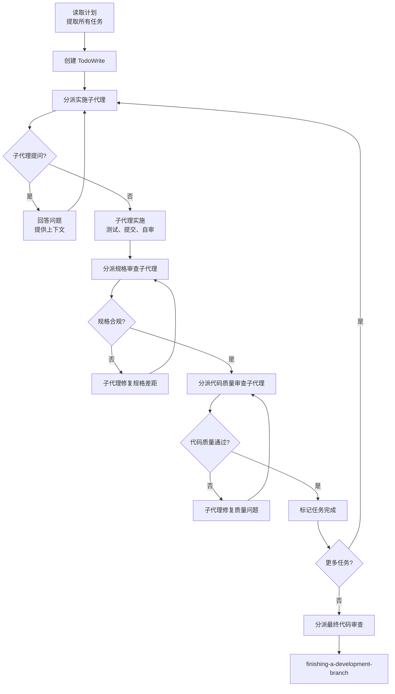
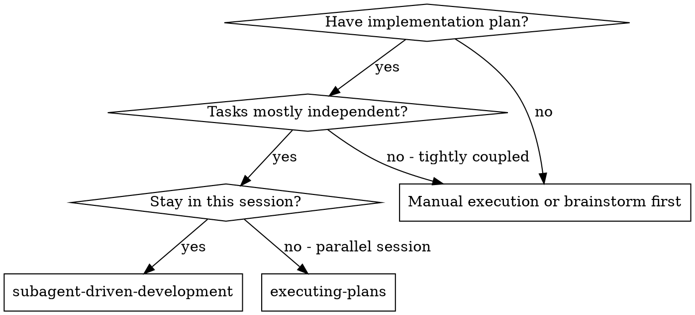
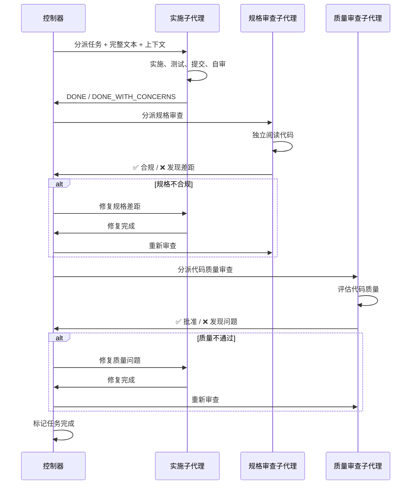
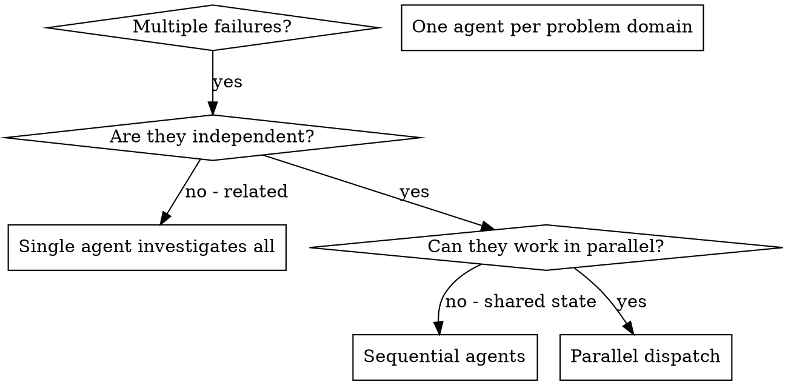

<details>
<summary>相关源文件</summary>

生成本页时使用的主要源文件：

- [skills/subagent-driven-development/SKILL.md](https://github.com/obra/superpowers/blob/main/skills/subagent-driven-development/SKILL.md)
- [skills/subagent-driven-development/implementer-prompt.md](https://github.com/obra/superpowers/blob/main/skills/subagent-driven-development/implementer-prompt.md)
- [skills/subagent-driven-development/spec-reviewer-prompt.md](https://github.com/obra/superpowers/blob/main/skills/subagent-driven-development/spec-reviewer-prompt.md)
- [skills/subagent-driven-development/code-quality-reviewer-prompt.md](https://github.com/obra/superpowers/blob/main/skills/subagent-driven-development/code-quality-reviewer-prompt.md)
- [skills/dispatching-parallel-agents/SKILL.md](https://github.com/obra/superpowers/blob/main/skills/dispatching-parallel-agents/SKILL.md)

</details>

# 子代理驱动开发

子代理驱动开发（Subagent-Driven Development，SDD）是 Superpowers 推荐的执行方式。核心思想：每个任务分派一个全新子代理，任务完成后进行两阶段审查——先检查规格合规性，再检查代码质量。

## 核心原则

**全新子代理 + 两阶段审查 = 高质量快速迭代**

子代理不继承会话上下文或历史——控制器精确构建它们所需的信息。这既保证了子代理的专注度，又保留了控制器的上下文用于协调工作。



Sources: [skills/subagent-driven-development/SKILL.md:1-50](../../../project-repos/superpowers/skills/subagent-driven-development/SKILL.md#L1-L50)

<details class="source-snippets">
<summary>引用源码</summary>

<!-- source-snippets:start -->

#### `skills/subagent-driven-development/SKILL.md:1-50`

````markdown
---
name: subagent-driven-development
description: Use when executing implementation plans with independent tasks in the current session
---

# Subagent-Driven Development

Execute plan by dispatching fresh subagent per task, with two-stage review after each: spec compliance review first, then code quality review.

**Why subagents:** You delegate tasks to specialized agents with isolated context. By precisely crafting their instructions and context, you ensure they stay focused and succeed at their task. They should never inherit your session's context or history — you construct exactly what they need. This also preserves your own context for coordination work.

**Core principle:** Fresh subagent per task + two-stage review (spec then quality) = high quality, fast iteration

## When to Use



**vs. Executing Plans (parallel session):**
- Same session (no context switch)
- Fresh subagent per task (no context pollution)
- Two-stage review after each task: spec compliance first, then code quality
- Faster iteration (no human-in-loop between tasks)

## The Process

```dot
digraph process {
    rankdir=TB;

    subgraph cluster_per_task {
        label="Per Task";
        "Dispatch implementer subagent (./implementer-prompt.md)" [shape=box];
        "Implementer subagent asks questions?" [shape=diamond];
        "Answer questions, provide context" [shape=box];
````

<!-- source-snippets:end -->
</details>
## 何时使用 SDD

| 条件 | SDD | executing-plans |
|------|-----|-----------------|
| 有实施计划 | ✅ | ✅ |
| 任务大多独立 | ✅ | — |
| 在当前会话执行 | ✅ | — |
| 在并行会话执行 | — | ✅ |
| 平台支持子代理 | ✅ | — |
| 平台不支持子代理 | — | ✅ |

Sources: [skills/subagent-driven-development/SKILL.md:20-40](../../../project-repos/superpowers/skills/subagent-driven-development/SKILL.md#L20-L40)

<details class="source-snippets">
<summary>引用源码</summary>

<!-- source-snippets:start -->

#### `skills/subagent-driven-development/SKILL.md:20-40`

````markdown
    "Stay in this session?" [shape=diamond];
    "subagent-driven-development" [shape=box];
    "executing-plans" [shape=box];
    "Manual execution or brainstorm first" [shape=box];

    "Have implementation plan?" -> "Tasks mostly independent?" [label="yes"];
    "Have implementation plan?" -> "Manual execution or brainstorm first" [label="no"];
    "Tasks mostly independent?" -> "Stay in this session?" [label="yes"];
    "Tasks mostly independent?" -> "Manual execution or brainstorm first" [label="no - tightly coupled"];
    "Stay in this session?" -> "subagent-driven-development" [label="yes"];
    "Stay in this session?" -> "executing-plans" [label="no - parallel session"];
}
```

**vs. Executing Plans (parallel session):**
- Same session (no context switch)
- Fresh subagent per task (no context pollution)
- Two-stage review after each task: spec compliance first, then code quality
- Faster iteration (no human-in-loop between tasks)

## The Process
````

<!-- source-snippets:end -->
</details>
## 三种子代理角色

### 实施者（Implementer）

- 接收完整任务文本和上下文（控制器预先提取，不让子代理读计划文件）
- 遵循 TDD 流程实施
- 实施后自审
- 报告四种状态之一

### 规格审查者（Spec Reviewer）

- 独立阅读代码，不信任实施者报告
- 检查实现是否匹配规格要求
- 发现缺失或多余的功能
- 必须在代码质量审查之前完成

### 代码质量审查者（Code Quality Reviewer）

- 在规格合规确认后执行
- 评估代码质量、命名、组织
- 分类问题：Critical / Important / Minor
- 获得批准后才算通过



Sources: [skills/subagent-driven-development/SKILL.md:50-120](../../../project-repos/superpowers/skills/subagent-driven-development/SKILL.md#L50-L120)

<details class="source-snippets">
<summary>引用源码</summary>

<!-- source-snippets:start -->

#### `skills/subagent-driven-development/SKILL.md:50-120`

````markdown
        "Answer questions, provide context" [shape=box];
        "Implementer subagent implements, tests, commits, self-reviews" [shape=box];
        "Dispatch spec reviewer subagent (./spec-reviewer-prompt.md)" [shape=box];
        "Spec reviewer subagent confirms code matches spec?" [shape=diamond];
        "Implementer subagent fixes spec gaps" [shape=box];
        "Dispatch code quality reviewer subagent (./code-quality-reviewer-prompt.md)" [shape=box];
        "Code quality reviewer subagent approves?" [shape=diamond];
        "Implementer subagent fixes quality issues" [shape=box];
        "Mark task complete in TodoWrite" [shape=box];
    }

    "Read plan, extract all tasks with full text, note context, create TodoWrite" [shape=box];
    "More tasks remain?" [shape=diamond];
    "Dispatch final code reviewer subagent for entire implementation" [shape=box];
    "Use superpowers:finishing-a-development-branch" [shape=box style=filled fillcolor=lightgreen];

    "Read plan, extract all tasks with full text, note context, create TodoWrite" -> "Dispatch implementer subagent (./implementer-prompt.md)";
    "Dispatch implementer subagent (./implementer-prompt.md)" -> "Implementer subagent asks questions?";
    "Implementer subagent asks questions?" -> "Answer questions, provide context" [label="yes"];
    "Answer questions, provide context" -> "Dispatch implementer subagent (./implementer-prompt.md)";
    "Implementer subagent asks questions?" -> "Implementer subagent implements, tests, commits, self-reviews" [label="no"];
    "Implementer subagent implements, tests, commits, self-reviews" -> "Dispatch spec reviewer subagent (./spec-reviewer-prompt.md)";
    "Dispatch spec reviewer subagent (./spec-reviewer-prompt.md)" -> "Spec reviewer subagent confirms code matches spec?";
    "Spec reviewer subagent confirms code matches spec?" -> "Implementer subagent fixes spec gaps" [label="no"];
    "Implementer subagent fixes spec gaps" -> "Dispatch spec reviewer subagent (./spec-reviewer-prompt.md)" [label="re-review"];
    "Spec reviewer subagent confirms code matches spec?" -> "Dispatch code quality reviewer subagent (./code-quality-reviewer-prompt.md)" [label="yes"];
    "Dispatch code quality reviewer subagent (./code-quality-reviewer-prompt.md)" -> "Code quality reviewer subagent approves?";
    "Code quality reviewer subagent approves?" -> "Implementer subagent fixes quality issues" [label="no"];
    "Implementer subagent fixes quality issues" -> "Dispatch code quality reviewer subagent (./code-quality-reviewer-prompt.md)" [label="re-review"];
    "Code quality reviewer subagent approves?" -> "Mark task complete in TodoWrite" [label="yes"];
    "Mark task complete in TodoWrite" -> "More tasks remain?";
    "More tasks remain?" -> "Dispatch implementer subagent (./implementer-prompt.md)" [label="yes"];
    "More tasks remain?" -> "Dispatch final code reviewer subagent for entire implementation" [label="no"];
    "Dispatch final code reviewer subagent for entire implementation" -> "Use superpowers:finishing-a-development-branch";
}
```

## Model Selection

Use the least powerful model that can handle each role to conserve cost and increase speed.

**Mechanical implementation tasks** (isolated functions, clear specs, 1-2 files): use a fast, cheap model. Most implementation tasks are mechanical when the plan is well-specified.

**Integration and judgment tasks** (multi-file coordination, pattern matching, debugging): use a standard model.

**Architecture, design, and review tasks**: use the most capable available model.

**Task complexity signals:**
- Touches 1-2 files with a complete spec → cheap model
- Touches multiple files with integration concerns → standard model
- Requires design judgment or broad codebase understanding → most capable model

## Handling Implementer Status

Implementer subagents report one of four statuses. Handle each appropriately:

**DONE:** Proceed to spec compliance review.

**DONE_WITH_CONCERNS:** The implementer completed the work but flagged doubts. Read the concerns before proceeding. If the concerns are about correctness or scope, address them before review. If they're observations (e.g., "this file is getting large"), note them and proceed to review.

**NEEDS_CONTEXT:** The implementer needs information that wasn't provided. Provide the missing context and re-dispatch.

**BLOCKED:** The implementer cannot complete the task. Assess the blocker:
1. If it's a context problem, provide more context and re-dispatch with the same model
2. If the task requires more reasoning, re-dispatch with a more capable model
3. If the task is too large, break it into smaller pieces
4. If the plan itself is wrong, escalate to the human

**Never** ignore an escalation or force the same model to retry without changes. If the implementer said it's stuck, something needs to change.

## Prompt Templates
````

<!-- source-snippets:end -->
</details>
## 模型选择策略

使用能处理每个角色的最低能力模型，以节约成本和提高速度：

| 任务类型 | 推荐模型级别 | 信号 |
|----------|-------------|------|
| 机械实施（1-2 文件，完整规格） | 快速廉价模型 | 触及 1-2 文件，规格完整 |
| 集成判断（多文件协调，模式匹配） | 标准模型 | 触及多文件，有集成关注 |
| 架构设计与审查 | 最强模型 | 需要设计判断或广泛代码库理解 |

Sources: [skills/subagent-driven-development/SKILL.md:120-145](../../../project-repos/superpowers/skills/subagent-driven-development/SKILL.md#L120-L145)

<details class="source-snippets">
<summary>引用源码</summary>

<!-- source-snippets:start -->

#### `skills/subagent-driven-development/SKILL.md:120-145`

````markdown
## Prompt Templates

- `./implementer-prompt.md` - Dispatch implementer subagent
- `./spec-reviewer-prompt.md` - Dispatch spec compliance reviewer subagent
- `./code-quality-reviewer-prompt.md` - Dispatch code quality reviewer subagent

## Example Workflow

```
You: I'm using Subagent-Driven Development to execute this plan.

[Read plan file once: docs/superpowers/plans/feature-plan.md]
[Extract all 5 tasks with full text and context]
[Create TodoWrite with all tasks]

Task 1: Hook installation script

[Get Task 1 text and context (already extracted)]
[Dispatch implementation subagent with full task text + context]

Implementer: "Before I begin - should the hook be installed at user or system level?"

You: "User level (~/.config/superpowers/hooks/)"

Implementer: "Got it. Implementing now..."
[Later] Implementer:
````

<!-- source-snippets:end -->
</details>
## 处理实施者状态

| 状态 | 处理方式 |
|------|----------|
| **DONE** | 进入规格合规审查 |
| **DONE_WITH_CONCERNS** | 阅读疑虑后决定是否继续审查 |
| **NEEDS_CONTEXT** | 提供缺失上下文后重新分派 |
| **BLOCKED** | 评估阻塞原因：上下文问题→补充重派；推理不足→更强模型；任务过大→拆分；计划有误→上报用户 |

**绝不**忽略上报或让同一模型无变化地重试。

Sources: [skills/subagent-driven-development/SKILL.md:145-175](../../../project-repos/superpowers/skills/subagent-driven-development/SKILL.md#L145-L175)

<details class="source-snippets">
<summary>引用源码</summary>

<!-- source-snippets:start -->

#### `skills/subagent-driven-development/SKILL.md:145-175`

```markdown
[Later] Implementer:
  - Implemented install-hook command
  - Added tests, 5/5 passing
  - Self-review: Found I missed --force flag, added it
  - Committed

[Dispatch spec compliance reviewer]
Spec reviewer: ✅ Spec compliant - all requirements met, nothing extra

[Get git SHAs, dispatch code quality reviewer]
Code reviewer: Strengths: Good test coverage, clean. Issues: None. Approved.

[Mark Task 1 complete]

Task 2: Recovery modes

[Get Task 2 text and context (already extracted)]
[Dispatch implementation subagent with full task text + context]

Implementer: [No questions, proceeds]
Implementer:
  - Added verify/repair modes
  - 8/8 tests passing
  - Self-review: All good
  - Committed

[Dispatch spec compliance reviewer]
Spec reviewer: ❌ Issues:
  - Missing: Progress reporting (spec says "report every 100 items")
  - Extra: Added --json flag (not requested)

```

<!-- source-snippets:end -->
</details>
## 并行代理调度

`dispatching-parallel-agents` 技能处理多个独立问题的并行调查：

### 适用场景

- 3+ 测试文件因不同根因失败
- 多个子系统独立损坏
- 每个问题无需其他问题的上下文即可理解
- 调查之间无共享状态

### 不适用场景

- 失败是相关的（修一个可能修其他的）
- 需要理解完整系统状态
- 代理会互相干扰（编辑相同文件）

### 代理提示词结构

好的代理提示词应：
1. **聚焦**——一个明确的问题域
2. **自包含**——理解问题所需的所有上下文
3. **明确输出**——代理应返回什么

```markdown
Fix the 3 failing tests in src/agents/agent-tool-abort.test.ts:

1. "should abort tool with partial output capture" - expects 'interrupted at'
2. "should handle mixed completed and aborted tools" - fast tool aborted
3. "should properly track pendingToolCount" - expects 3 results but gets 0

Your task:
1. Read the test file and understand what each test verifies
2. Identify root cause - timing issues or actual bugs?
3. Fix by replacing arbitrary timeouts with event-based waiting

Do NOT just increase timeouts - find the real issue.

Return: Summary of what you found and what you fixed.
```

Sources: [skills/dispatching-parallel-agents/SKILL.md:1-182](../../../project-repos/superpowers/skills/dispatching-parallel-agents/SKILL.md#L1-L182)

<details class="source-snippets">
<summary>引用源码</summary>

<!-- source-snippets:start -->

#### `skills/dispatching-parallel-agents/SKILL.md:1-182`

````markdown
---
name: dispatching-parallel-agents
description: Use when facing 2+ independent tasks that can be worked on without shared state or sequential dependencies
---

# Dispatching Parallel Agents

## Overview

You delegate tasks to specialized agents with isolated context. By precisely crafting their instructions and context, you ensure they stay focused and succeed at their task. They should never inherit your session's context or history — you construct exactly what they need. This also preserves your own context for coordination work.

When you have multiple unrelated failures (different test files, different subsystems, different bugs), investigating them sequentially wastes time. Each investigation is independent and can happen in parallel.

**Core principle:** Dispatch one agent per independent problem domain. Let them work concurrently.

## When to Use



**Use when:**
- 3+ test files failing with different root causes
- Multiple subsystems broken independently
- Each problem can be understood without context from others
- No shared state between investigations

**Don't use when:**
- Failures are related (fix one might fix others)
- Need to understand full system state
- Agents would interfere with each other

## The Pattern

### 1. Identify Independent Domains

Group failures by what's broken:
- File A tests: Tool approval flow
- File B tests: Batch completion behavior
- File C tests: Abort functionality

Each domain is independent - fixing tool approval doesn't affect abort tests.

### 2. Create Focused Agent Tasks

Each agent gets:
- **Specific scope:** One test file or subsystem
- **Clear goal:** Make these tests pass
- **Constraints:** Don't change other code
- **Expected output:** Summary of what you found and fixed

### 3. Dispatch in Parallel

```typescript
// In Claude Code / AI environment
Task("Fix agent-tool-abort.test.ts failures")
Task("Fix batch-completion-behavior.test.ts failures")
Task("Fix tool-approval-race-conditions.test.ts failures")
// All three run concurrently
```

### 4. Review and Integrate

When agents return:
- Read each summary
- Verify fixes don't conflict
- Run full test suite
- Integrate all changes

## Agent Prompt Structure

Good agent prompts are:
1. **Focused** - One clear problem domain
2. **Self-contained** - All context needed to understand the problem
3. **Specific about output** - What should the agent return?

```markdown
Fix the 3 failing tests in src/agents/agent-tool-abort.test.ts:

1. "should abort tool with partial output capture" - expects 'interrupted at' in message
2. "should handle mixed completed and aborted tools" - fast tool aborted instead of completed
3. "should properly track pendingToolCount" - expects 3 results but gets 0

These are timing/race condition issues. Your task:

1. Read the test file and understand what each test verifies
2. Identify root cause - timing issues or actual bugs?
3. Fix by:
   - Replacing arbitrary timeouts with event-based waiting
   - Fixing bugs in abort implementation if found
   - Adjusting test expectations if testing changed behavior

Do NOT just increase timeouts - find the real issue.

Return: Summary of what you found and what you fixed.
```

## Common Mistakes

**❌ Too broad:** "Fix all the tests" - agent gets lost
**✅ Specific:** "Fix agent-tool-abort.test.ts" - focused scope

**❌ No context:** "Fix the race condition" - agent doesn't know where
**✅ Context:** Paste the error messages and test names

**❌ No constraints:** Agent might refactor everything
... snippet truncated ...
````

<!-- source-snippets:end -->
</details>
## 红旗清单

**绝不：**
- 在 main/master 分支上开始实施（未经用户明确同意）
- 跳过审查（规格合规或代码质量）
- 带着未修复的问题继续
- 并行分派多个实施子代理（会冲突）
- 让子代理读计划文件（应提供完整文本）
- 跳过场景设定上下文
- 忽略子代理问题
- 在规格合规上接受"差不多"
- 跳过审查循环
- 让实施者自审替代正式审查
- **在规格合规确认前开始代码质量审查**（顺序错误）
- 任一审查有未解决问题时就进入下一任务

Sources: [skills/subagent-driven-development/SKILL.md:200-240](../../../project-repos/superpowers/skills/subagent-driven-development/SKILL.md#L200-L240)

<details class="source-snippets">
<summary>引用源码</summary>

<!-- source-snippets:start -->

#### `skills/subagent-driven-development/SKILL.md:200-240`

````markdown
```

## Advantages

**vs. Manual execution:**
- Subagents follow TDD naturally
- Fresh context per task (no confusion)
- Parallel-safe (subagents don't interfere)
- Subagent can ask questions (before AND during work)

**vs. Executing Plans:**
- Same session (no handoff)
- Continuous progress (no waiting)
- Review checkpoints automatic

**Efficiency gains:**
- No file reading overhead (controller provides full text)
- Controller curates exactly what context is needed
- Subagent gets complete information upfront
- Questions surfaced before work begins (not after)

**Quality gates:**
- Self-review catches issues before handoff
- Two-stage review: spec compliance, then code quality
- Review loops ensure fixes actually work
- Spec compliance prevents over/under-building
- Code quality ensures implementation is well-built

**Cost:**
- More subagent invocations (implementer + 2 reviewers per task)
- Controller does more prep work (extracting all tasks upfront)
- Review loops add iterations
- But catches issues early (cheaper than debugging later)

## Red Flags

**Never:**
- Start implementation on main/master branch without explicit user consent
- Skip reviews (spec compliance OR code quality)
- Proceed with unfixed issues
- Dispatch multiple implementation subagents in parallel (conflicts)
````

<!-- source-snippets:end -->
</details>
## 相关页面

- [核心工作流](core-workflow.md)
- [技能体系](skills-system.md)
- [测试驱动与系统化调试](tdd-and-debugging.md)
