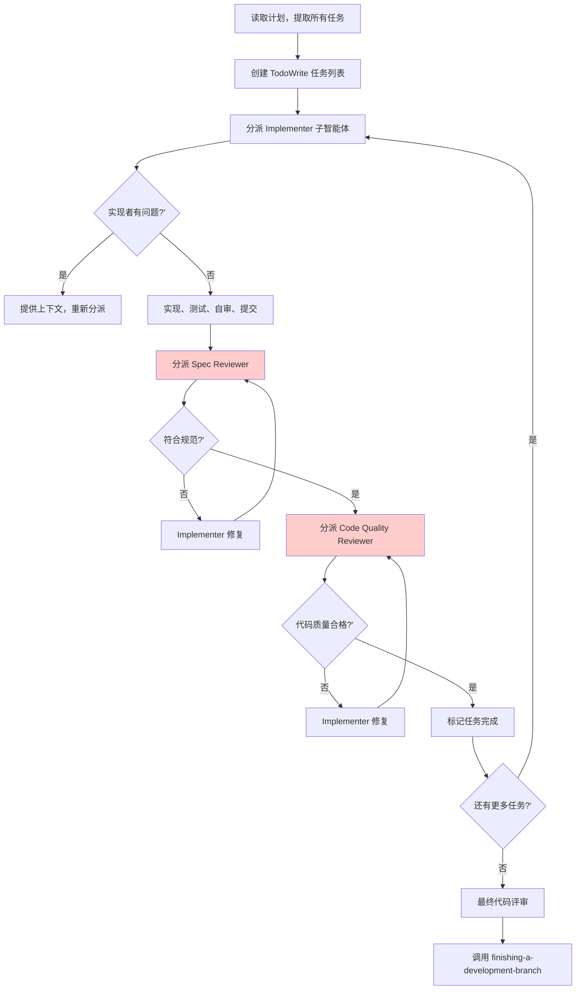

<details>
<summary>相关源文件</summary>

生成本页时使用的主要源文件：

- [skills/subagent-driven-development/SKILL.md:1-150](../../../project-repos/superpowers/skills/subagent-driven-development/SKILL.md#L1-L150)
- [skills/subagent-driven-development/implementer-prompt.md:1-30](../../../project-repos/superpowers/skills/subagent-driven-development/implementer-prompt.md#L1-L30)
- [skills/subagent-driven-development/spec-reviewer-prompt.md:1-20](../../../project-repos/superpowers/skills/subagent-driven-development/spec-reviewer-prompt.md#L1-L20)
- [skills/subagent-driven-development/code-quality-reviewer-prompt.md:1-20](../../../project-repos/superpowers/skills/subagent-driven-development/code-quality-reviewer-prompt.md#L1-L20)

</details>

# Subagent-Driven Development

Subagent-Driven Development（SDD）是 Superpowers 工作流中的主要执行模式——将实现计划拆解为独立任务，逐个分派给子智能体处理，每个任务完成后经历两阶段评审（Spec 合规 → 代码质量）。

**为什么需要两阶段评审？** 一个评审者同时检查"是否符合规范"和"代码质量如何"容易导致审查疲劳和优先级混乱。SDD 将这两个目标分离：第一个评审者（Spec Reviewer）确保实现与规范完全一致，第二个评审者（Code Quality Reviewer）负责代码可读性、测试覆盖和设计模式。

## 核心流程



**关键约束**：实现者不能跳过任何一个评审阶段；Reviewer 发现问题时必须由原来的 Implementer 修复后重新审查，不能直接接受或忽略问题。

Sources: [skills/subagent-driven-development/SKILL.md:20-80](../../../project-repos/superpowers/skills/subagent-driven-development/SKILL.md#L20-L80)

<details class="source-snippets">
<summary>引用源码</summary>

<!-- source-snippets:start -->

#### `skills/subagent-driven-development/SKILL.md:20-80`

````markdown
    "Stay in this session?" [shape=diamond];
    "subagent-driven-development" [shape=box];
    "executing-plans" [shape=box];
    "Manual execution or brainstorm first" [shape=box];

    "Have implementation plan?" -> "Tasks mostly independent?" [label="yes"];
    "Have implementation plan?" -> "Manual execution or brainstorm first" [label="no"];
    "Tasks mostly independent?" -> "Stay in this session?" [label="yes"];
    "Tasks mostly independent?" -> "Manual execution or brainstorm first" [label="no - tightly coupled"];
    "Stay in this session?" -> "subagent-driven-development" [label="yes"];
    "Stay in this session?" -> "executing-plans" [label="no - parallel session"];
}
```

**vs. Executing Plans (parallel session):**
- Same session (no context switch)
- Fresh subagent per task (no context pollution)
- Two-stage review after each task: spec compliance first, then code quality
- Faster iteration (no human-in-loop between tasks)

## The Process

```dot
digraph process {
    rankdir=TB;

    subgraph cluster_per_task {
        label="Per Task";
        "Dispatch implementer subagent (./implementer-prompt)" [shape=box];
        "Implementer subagent asks questions?" [shape=diamond];
        "Answer questions, provide context" [shape=box];
        "Implementer subagent implements, tests, commits, self-reviews" [shape=box];
        "Dispatch spec reviewer subagent (./spec-reviewer-prompt)" [shape=box];
        "Spec reviewer subagent confirms code matches spec?" [shape=diamond];
        "Implementer subagent fixes spec gaps" [shape=box];
        "Dispatch code quality reviewer subagent (./code-quality-reviewer-prompt)" [shape=box];
        "Code quality reviewer subagent approves?" [shape=diamond];
        "Implementer subagent fixes quality issues" [shape=box];
        "Mark task complete in TodoWrite" [shape=box];
    }

    "Read plan, extract all tasks with full text, note context, create TodoWrite" [shape=box];
    "More tasks remain?" [shape=diamond];
    "Dispatch final code reviewer subagent for entire implementation" [shape=box];
    "Use superpowers:finishing-a-development-branch" [shape=box style=filled fillcolor=lightgreen];

    "Read plan, extract all tasks with full text, note context, create TodoWrite" -> "Dispatch implementer subagent (./implementer-prompt)";
    "Dispatch implementer subagent (./implementer-prompt)" -> "Implementer subagent asks questions?";
    "Implementer subagent asks questions?" -> "Answer questions, provide context" [label="yes"];
    "Answer questions, provide context" -> "Dispatch implementer subagent (./implementer-prompt)";
    "Implementer subagent asks questions?" -> "Implementer subagent implements, tests, commits, self-reviews" [label="no"];
    "Implementer subagent implements, tests, commits, self-reviews" -> "Dispatch spec reviewer subagent (./spec-reviewer-prompt)";
    "Dispatch spec reviewer subagent (./spec-reviewer-prompt)" -> "Spec reviewer subagent confirms code matches spec?";
    "Spec reviewer subagent confirms code matches spec?" -> "Implementer subagent fixes spec gaps" [label="no"];
    "Implementer subagent fixes spec gaps" -> "Dispatch spec reviewer subagent (./spec-reviewer-prompt)" [label="re-review"];
    "Spec reviewer subagent confirms code matches spec?" -> "Dispatch code quality reviewer subagent (./code-quality-reviewer-prompt)" [label="yes"];
    "Dispatch code quality reviewer subagent (./code-quality-reviewer-prompt)" -> "Code quality reviewer subagent approves?";
    "Code quality reviewer subagent approves?" -> "Implementer subagent fixes quality issues" [label="no"];
    "Implementer subagent fixes quality issues" -> "Dispatch code quality reviewer subagent (./code-quality-reviewer-prompt)" [label="re-review"];
    "Code quality reviewer subagent approves?" -> "Mark task complete in TodoWrite" [label="yes"];
    "Mark task complete in TodoWrite" -> "More tasks remain?";
````

<!-- source-snippets:end -->
</details>

## 模型选择策略

SDD 根据任务复杂度选择不同能力的模型：

| 任务类型 | 模型选择 | 理由 |
|---------|---------|------|
| 机械性实现（1-2 个文件，规格清晰） | 快速/便宜模型 | 大多数实现任务在规格清晰时是机械性的 |
| 集成与判断（多文件协调） | 标准模型 | 需要更多推理能力 |
| 架构/设计/评审 | 最强可用模型 | 需要广泛理解代码库 |

**关键洞察**：大多数实现任务不需要最强的模型。当计划足够详细时，规格本身就是实现指南，智能体只需精确执行。

## Implementer 状态处理

Implementer 子智能体报告四种状态，处理方式各异：

- **DONE**：进入 Spec Review
- **DONE_WITH_CONCERNS**：在继续前先阅读关注点，判断是正确性问题还是观察性意见
- **NEEDS_CONTEXT**：提供缺失的上下文并重新分派
- **BLOCKED**：评估阻塞原因——如果是上下文问题提供更多信息；如果是推理能力不足换更强模型；如果是任务太大则拆分

## 两阶段评审顺序不可调换

**顺序是关键**：必须先完成 Spec Review（确认符合规范），才能进入 Code Quality Review。

原因：Spec Review 失败意味着实现的功能与需求不符，此时讨论代码质量是浪费时间。只有在功能正确的前提下，代码质量才有意义。

违反这一顺序是 SDD 中的 Red Flag——意味着评审流程被绕过了。

Sources: [skills/subagent-driven-development/SKILL.md:100-110](../../../project-repos/superpowers/skills/subagent-driven-development/SKILL.md#L100-L110)

<details class="source-snippets">
<summary>引用源码</summary>

<!-- source-snippets:start -->

#### `skills/subagent-driven-development/SKILL.md:100-110`

```markdown
- Requires design judgment or broad codebase understanding → most capable model

## Handling Implementer Status

Implementer subagents report one of four statuses. Handle each appropriately:

**DONE:** Proceed to spec compliance review.

**DONE_WITH_CONCERNS:** The implementer completed the work but flagged doubts. Read the concerns before proceeding. If the concerns are about correctness or scope, address them before review. If they're observations (e.g., "this file is getting large"), note them and proceed to review.

**NEEDS_CONTEXT:** The implementer needs information that wasn't provided. Provide the missing context and re-dispatch.
```

<!-- source-snippets:end -->
</details>

## Red Flags

- 在主分支（main/master）上开始实现，未获得用户明确同意
- 跳过评审（Spec 或 Code Quality）
- 在问题未修复时继续下一个任务
- 并行分派多个实现子智能体（会冲突）
- 在 Spec Review 完成前开始 Code Quality Review
- 接受"差不多符合"（Reviewer 发现问题 = 未完成）

## 与其他技能的集成

**必需的前置技能**：`using-git-worktrees`（隔离工作区）
**必需的后置技能**：`finishing-a-development-branch`（分支收尾）
**子任务使用**：`test-driven-development`

## 相关页面

- [Writing Plans](writing-plans) — SDD 执行的输入
- [TDD](test-driven-development) — 子任务实现中强制执行的测试流程
- [Code Review](code-review) — 最终代码评审的评审流程
- [Finishing Branch](finishing-branch) — 任务完成后的分支处理选项
