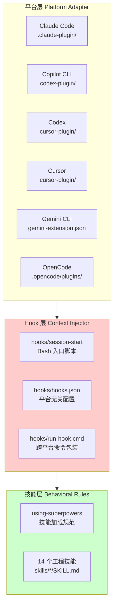
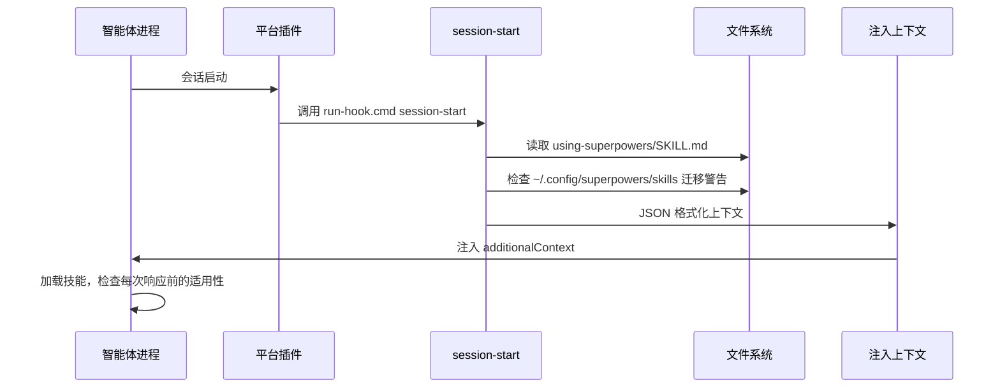

<details>
<summary>相关源文件</summary>

生成本页时使用的主要源文件：

- [.claude-plugin/plugin.json](../../../project-repos/superpowers/.claude-plugin/plugin.json)
- [.claude-plugin/marketplace.json](../../../project-repos/superpowers/.claude-plugin/marketplace.json)
- [.codex-plugin/plugin.json](../../../project-repos/superpowers/.codex-plugin/plugin.json)
- [.cursor-plugin/plugin.json](../../../project-repos/superpowers/.cursor-plugin/plugin.json)
- [gemini-extension.json](../../../project-repos/superpowers/gemini-extension.json)
- [.opencode/plugins/superpowers.js](../../../project-repos/superpowers/.opencode/plugins/superpowers.js)
- [hooks/hooks.json](../../../project-repos/superpowers/hooks/hooks.json)
- [hooks/session-start](../../../project-repos/superpowers/hooks/session-start)
- [package.json](../../../project-repos/superpowers/package.json)

</details>

# 系统架构

Superpowers 的架构设计遵循一个核心原则：**零依赖注入，多平台统一覆盖**。整个系统由三层构成：插件层（Platform Adapter）、Hook 机制（Context Injector）、技能库（Behavioral Rules）。没有运行时服务，没有构建步骤，只有静态文件。

## 三层架构



**平台适配层**负责各平台的插件注册与元数据；**Hook 层**负责在会话启动时将技能上下文注入智能体；**技能层**定义具体的工程行为规范。

## 平台层：多插件架构

每个平台有独立的插件目录，遵循各平台的插件规范：

| 平台 | 插件目录 | 注册机制 | 版本 |
|------|---------|---------|------|
| Claude Code | `.claude-plugin/` | 官方 marketplace + 自建 marketplace | 5.0.7 |
| Copilot CLI | `.codex-plugin/` | `copilot plugin marketplace` | 5.0.7 |
| Codex | `.codex-plugin/` | OpenAI Codex 插件搜索 | 5.0.7 |
| Cursor | `.cursor-plugin/` | `/add-plugin` 命令 | 5.0.7 |
| Gemini CLI | `gemini-extension.json` | `gemini extensions install` | 5.0.7 |
| OpenCode | `.opencode/plugins/` | 内置插件加载 | 5.0.7 |

关键设计决策：各平台插件只包含平台特定的注册元数据，不包含技能实现本身。技能实现统一放在 `skills/` 目录中，通过 Hook 层统一注入——这保证了 14 个技能在所有平台上的行为一致性。

## Hook 层：会话启动上下文注入

Hook 层是整个系统的"神经系统"。它的职责是在每次会话启动时，将 `using-superpowers` 技能的完整内容注入智能体的上下文。



**跨平台兼容的核心设计**：Hook 脚本检测环境变量（`CURSOR_PLUGIN_ROOT`、`CLAUDE_PLUGIN_ROOT`、`COPILOT_CLI`），输出符合各平台期望的 JSON 字段格式。这是通过三个不同字段实现的：

- Claude Code（非 Copilot）：`hookSpecificOutput.additionalContext`（嵌套格式）
- Cursor：`additional_context`（snake_case）
- 其他平台（Copilot CLI / SDK 标准）：`additionalContext`（顶层字段）

Sources: [hooks/session-start:45-76](../../../project-repos/superpowers/hooks/session-start#L45-L76)

<details class="source-snippets">
<summary>引用源码</summary>

<!-- source-snippets:start -->

#### `hooks/session-start:45-76`

```
# See: https://github.com/obra/superpowers/issues/571
if [ -n "${CURSOR_PLUGIN_ROOT:-}" ]; then
  # Cursor sets CURSOR_PLUGIN_ROOT (may also set CLAUDE_PLUGIN_ROOT)
  printf '{\n  "additional_context": "%s"\n}\n' "$session_context"
elif [ -n "${CLAUDE_PLUGIN_ROOT:-}" ] && [ -z "${COPILOT_CLI:-}" ]; then
  # Claude Code sets CLAUDE_PLUGIN_ROOT without COPILOT_CLI
  printf '{\n  "hookSpecificOutput": {\n    "hookEventName": "SessionStart",\n    "additionalContext": "%s"\n  }\n}\n' "$session_context"
else
  # Copilot CLI (sets COPILOT_CLI=1) or unknown platform — SDK standard format
  printf '{\n  "additionalContext": "%s"\n}\n' "$session_context"
fi

exit 0
```

<!-- source-snippets:end -->
</details>

## 技能层：目录结构

```
skills/
├── using-superpowers/          # 入口技能：技能查找与加载规范
├── brainstorming/              # 设计前：Socratic 需求探索
├── writing-plans/              # 计划：原子化任务卡片
├── subagent-driven-development/ # 执行：子任务分派 + 两阶段评审
│   ├── implementer-prompt.md
│   ├── spec-reviewer-prompt.md
│   └── code-quality-reviewer-prompt.md
├── test-driven-development/    # 测试：RED-GREEN-REFACTOR 铁律
│   └── testing-anti-patterns.md
├── systematic-debugging/       # 调试：四阶段根因分析
│   ├── root-cause-tracing.md
│   ├── defense-in-depth.md
│   └── condition-based-waiting.md
├── verification-before-completion/ # 验证：确保修复真正有效
├── requesting-code-review/     # 评审发起
├── receiving-code-review/      # 评审接收
├── finishing-a-development-branch/ # 分支收尾
├── using-git-worktrees/       # Git Worktree 隔离
├── executing-plans/            # 批量执行（备选工作流）
├── dispatching-parallel-agents/ # 并行子任务
└── writing-skills/            # 技能编写规范（meta 技能）
```

**关键设计约束**：零依赖。没有任何 npm 包、Python 库或外部服务依赖。技能文件是纯 Markdown，Hook 脚本是纯 Bash。这意味着安装即用，不需要网络、无需配置代理、不存在依赖冲突。

## 版本管理

项目使用 `.version-bump.json` 配合 `scripts/bump-version.sh` 脚本管理版本。所有平台插件共享同一个版本号（当前 5.0.7），保证了跨平台行为的一致性。

Sources: [package.json:1-5](../../../project-repos/superpowers/package.json#L1-L5), [version-bump.json:1-10](../../../project-repos/superpowers/version-bump.json#L1-L10)

<details class="source-snippets">
<summary>引用源码</summary>

<!-- source-snippets:start -->

#### `package.json:1-5`

```json
{
  "name": "superpowers",
  "version": "5.0.7",
  "type": "module",
  "main": ".opencode/plugins/superpowers.js"
```

#### `version-bump.json:1-10`

> 未找到引用文件：`version-bump.json`

<!-- source-snippets:end -->
</details>

## 相关页面

- [插件系统](plugin-system) — 各平台插件的详细注册机制
- [Hook 机制](hook-system) — SessionStart 的完整执行流程与跨平台适配
- [项目概览](overview) — 项目定位与核心能力
