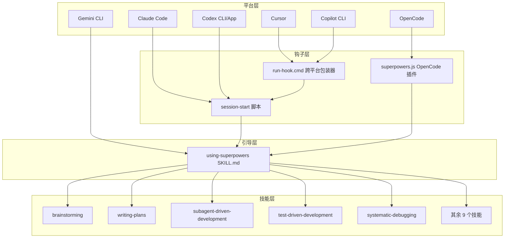
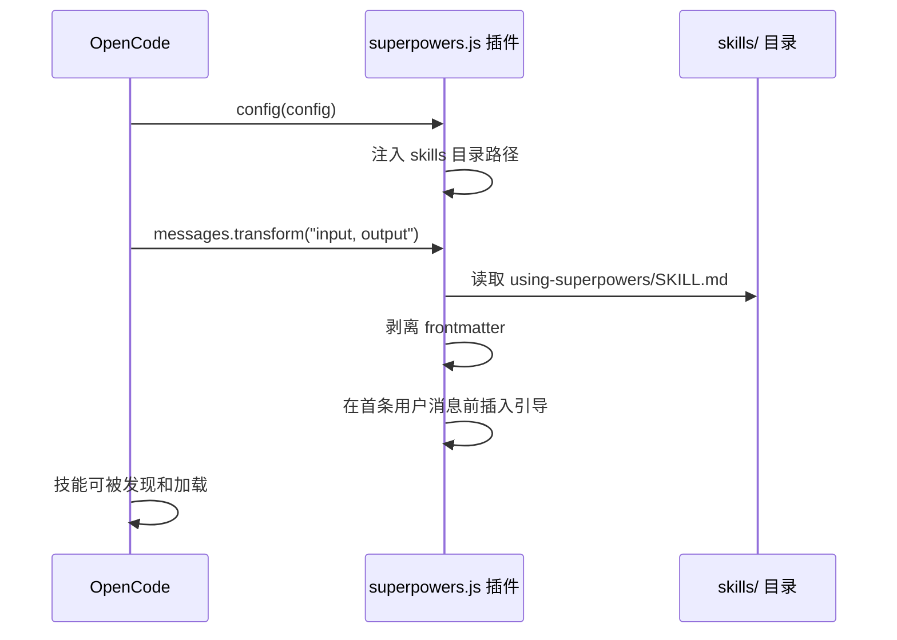
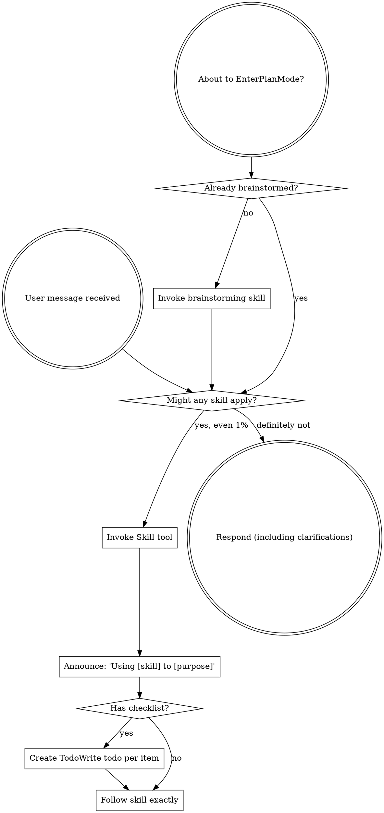

<details>
<summary>相关源文件</summary>

生成本页时使用的主要源文件：

- [hooks/session-start](https://github.com/obra/superpowers/blob/main/hooks/session-start)
- [hooks/hooks.json](https://github.com/obra/superpowers/blob/main/hooks/hooks.json)
- [hooks/hooks-cursor.json](https://github.com/obra/superpowers/blob/main/hooks/hooks-cursor.json)
- [.claude-plugin/plugin.json](https://github.com/obra/superpowers/blob/main/.claude-plugin/plugin.json)
- [.codex-plugin/plugin.json](https://github.com/obra/superpowers/blob/main/.codex-plugin/plugin.json)
- [.opencode/plugins/superpowers.js](https://github.com/obra/superpowers/blob/main/.opencode/plugins/superpowers.js)
- [skills/using-superpowers/SKILL.md](https://github.com/obra/superpowers/blob/main/skills/using-superpowers/SKILL.md)

</details>

# 系统架构

Superpowers 的架构核心是一个**技能驱动的插件系统**，通过平台原生钩子（hook）在会话启动时注入引导上下文，使编码代理自动发现并遵循技能工作流。整个系统无需外部依赖，零运行时开销。

## 整体架构



Sources: [hooks/session-start:1-57](../../../project-repos/superpowers/hooks/session-start#L1-L57), [opencode/plugins/superpowers.js:1-112](../../../project-repos/superpowers/.opencode/plugins/superpowers.js#L1-L112), [skills/using-superpowers/SKILL.md:1-30](../../../project-repos/superpowers/skills/using-superpowers/SKILL.md#L1-L30)

<details class="source-snippets">
<summary>引用源码</summary>

<!-- source-snippets:start -->

#### `hooks/session-start:1-57`

```
#!/usr/bin/env bash
# SessionStart hook for superpowers plugin

set -euo pipefail

# Determine plugin root directory
SCRIPT_DIR="$(cd "$(dirname "$0")" && pwd)"
PLUGIN_ROOT="$(cd "${SCRIPT_DIR}/.." && pwd)"

# Check if legacy skills directory exists and build warning
warning_message=""
legacy_skills_dir="${HOME}/.config/superpowers/skills"
if [ -d "$legacy_skills_dir" ]; then
    warning_message="\n\n<important-reminder>IN YOUR FIRST REPLY AFTER SEEING THIS MESSAGE YOU MUST TELL THE USER:⚠️ **WARNING:** Superpowers now uses Claude Code's skills system. Custom skills in ~/.config/superpowers/skills will not be read. Move custom skills to ~/.claude/skills instead. To make this message go away, remove ~/.config/superpowers/skills</important-reminder>"
fi

# Read using-superpowers content
using_superpowers_content=$(cat "${PLUGIN_ROOT}/skills/using-superpowers/SKILL.md" 2>&1 || echo "Error reading using-superpowers skill")

# Escape string for JSON embedding using bash parameter substitution.
# Each ${s//old/new} is a single C-level pass - orders of magnitude
# faster than the character-by-character loop this replaces.
escape_for_json() {
    local s="$1"
    s="${s//\\/\\\\}"
    s="${s//\"/\\\"}"
    s="${s//$'\n'/\\n}"
    s="${s//$'\r'/\\r}"
    s="${s//$'\t'/\\t}"
    printf '%s' "$s"
}

using_superpowers_escaped=$(escape_for_json "$using_superpowers_content")
warning_escaped=$(escape_for_json "$warning_message")
session_context="<EXTREMELY_IMPORTANT>\nYou have superpowers.\n\n**Below is the full content of your 'superpowers:using-superpowers' skill - your introduction to using skills. For all other skills, use the 'Skill' tool:**\n\n${using_superpowers_escaped}\n\n${warning_escaped}\n</EXTREMELY_IMPORTANT>"

# Output context injection as JSON.
# Cursor hooks expect additional_context (snake_case).
# Claude Code hooks expect hookSpecificOutput.additionalContext (nested).
# Copilot CLI (v1.0.11+) and others expect additionalContext (top-level, SDK standard).
# Claude Code reads BOTH additional_context and hookSpecificOutput without
# deduplication, so we must emit only the field the current platform consumes.
#
# Uses printf instead of heredoc to work around bash 5.3+ heredoc hang.
# See: https://github.com/obra/superpowers/issues/571
if [ -n "${CURSOR_PLUGIN_ROOT:-}" ]; then
  # Cursor sets CURSOR_PLUGIN_ROOT (may also set CLAUDE_PLUGIN_ROOT)
  printf '{\n  "additional_context": "%s"\n}\n' "$session_context"
elif [ -n "${CLAUDE_PLUGIN_ROOT:-}" ] && [ -z "${COPILOT_CLI:-}" ]; then
  # Claude Code sets CLAUDE_PLUGIN_ROOT without COPILOT_CLI
  printf '{\n  "hookSpecificOutput": {\n    "hookEventName": "SessionStart",\n    "additionalContext": "%s"\n  }\n}\n' "$session_context"
else
  # Copilot CLI (sets COPILOT_CLI=1) or unknown platform — SDK standard format
  printf '{\n  "additionalContext": "%s"\n}\n' "$session_context"
fi

exit 0
```

#### `opencode/plugins/superpowers.js:1-112`

```javascript
/**
 * Superpowers plugin for OpenCode.ai
 *
 * Injects superpowers bootstrap context via system prompt transform.
 * Auto-registers skills directory via config hook (no symlinks needed).
 */

import path from 'path';
import fs from 'fs';
import os from 'os';
import { fileURLToPath } from 'url';

const __dirname = path.dirname(fileURLToPath(import.meta.url));

// Simple frontmatter extraction (avoid dependency on skills-core for bootstrap)
const extractAndStripFrontmatter = (content) => {
  const match = content.match(/^---\n([\s\S]*?)\n---\n([\s\S]*)$/);
  if (!match) return { frontmatter: {}, content };

  const frontmatterStr = match[1];
  const body = match[2];
  const frontmatter = {};

  for (const line of frontmatterStr.split('\n')) {
    const colonIdx = line.indexOf(':');
    if (colonIdx > 0) {
      const key = line.slice(0, colonIdx).trim();
      const value = line.slice(colonIdx + 1).trim().replace(/^["']|["']$/g, '');
      frontmatter[key] = value;
    }
  }

  return { frontmatter, content: body };
};

// Normalize a path: trim whitespace, expand ~, resolve to absolute
const normalizePath = (p, homeDir) => {
  if (!p || typeof p !== 'string') return null;
  let normalized = p.trim();
  if (!normalized) return null;
  if (normalized.startsWith('~/')) {
    normalized = path.join(homeDir, normalized.slice(2));
  } else if (normalized === '~') {
    normalized = homeDir;
  }
  return path.resolve(normalized);
};

export const SuperpowersPlugin = async ({ client, directory }) => {
  const homeDir = os.homedir();
  const superpowersSkillsDir = path.resolve(__dirname, '../../skills');
  const envConfigDir = normalizePath(process.env.OPENCODE_CONFIG_DIR, homeDir);
  const configDir = envConfigDir || path.join(homeDir, '.config/opencode');

  // Helper to generate bootstrap content
  const getBootstrapContent = () => {
    // Try to load using-superpowers skill
    const skillPath = path.join(superpowersSkillsDir, 'using-superpowers', 'SKILL.md');
    if (!fs.existsSync(skillPath)) return null;

    const fullContent = fs.readFileSync(skillPath, 'utf8');
    const { content } = extractAndStripFrontmatter(fullContent);

    const toolMapping = `**Tool Mapping for OpenCode:**
When skills reference tools you don't have, substitute OpenCode equivalents:
- \`TodoWrite\` → \`todowrite\`
- \`Task\` tool with subagents → Use OpenCode's subagent system (@mention)
- \`Skill\` tool → OpenCode's native \`skill\` tool
- \`Read\`, \`Write\`, \`Edit\`, \`Bash\` → Your native tools

Use OpenCode's native \`skill\` tool to list and load skills.`;

    return `<EXTREMELY_IMPORTANT>
You have superpowers.

**IMPORTANT: The using-superpowers skill content is included below. It is ALREADY LOADED - you are currently following it. Do NOT use the skill tool to load "using-superpowers" again - that would be redundant.**

${content}

${toolMapping}
</EXTREMELY_IMPORTANT>`;
  };

  return {
    // Inject skills path into live config so OpenCode discovers superpowers skills
    // without requiring manual symlinks or config file edits.
    // This works because Config.get() returns a cached singleton — modifications
    // here are visible when skills are lazily discovered later.
    config: async (config) => {
      config.skills = config.skills || {};
      config.skills.paths = config.skills.paths || [];
      if (!config.skills.paths.includes(superpowersSkillsDir)) {
        config.skills.paths.push(superpowersSkillsDir);
      }
    },

    // Inject bootstrap into the first user message of each session.
    // Using a user message instead of a system message avoids:
    //   1. Token bloat from system messages repeated every turn (#750)
    //   2. Multiple system messages breaking Qwen and other models (#894)
    'experimental.chat.messages.transform': async (_input, output) => {
      const bootstrap = getBootstrapContent();
      if (!bootstrap || !output.messages.length) return;
      const firstUser = output.messages.find(m => m.info.role === 'user');
      if (!firstUser || !firstUser.parts.length) return;
      // Only inject once
      if (firstUser.parts.some(p => p.type === 'text' && p.text.includes('EXTREMELY_IMPORTANT'))) return;
      const ref = firstUser.parts[0];
      firstUser.parts.unshift({ ...ref, type: 'text', text: bootstrap });
    }
  };
};
```

#### `skills/using-superpowers/SKILL.md:1-30`

```markdown
---
name: using-superpowers
description: Use when starting any conversation - establishes how to find and use skills, requiring Skill tool invocation before ANY response including clarifying questions
---

<SUBAGENT-STOP>
If you were dispatched as a subagent to execute a specific task, skip this skill.
</SUBAGENT-STOP>

<EXTREMELY-IMPORTANT>
If you think there is even a 1% chance a skill might apply to what you are doing, you ABSOLUTELY MUST invoke the skill.

IF A SKILL APPLIES TO YOUR TASK, YOU DO NOT HAVE A CHOICE. YOU MUST USE IT.

This is not negotiable. This is not optional. You cannot rationalize your way out of this.
</EXTREMELY-IMPORTANT>

## Instruction Priority

Superpowers skills override default system prompt behavior, but **user instructions always take precedence**:

1. **User's explicit instructions** (CLAUDE.md, GEMINI.md, AGENTS.md, direct requests) — highest priority
2. **Superpowers skills** — override default system behavior where they conflict
3. **Default system prompt** — lowest priority

If CLAUDE.md, GEMINI.md, or AGENTS.md says "don't use TDD" and a skill says "always use TDD," follow the user's instructions. The user is in control.

## How to Access Skills

**In Claude Code:** Use the `Skill` tool. When you invoke a skill, its content is loaded and presented to you—follow it directly. Never use the Read tool on skill files.
```

<!-- source-snippets:end -->
</details>
## 会话启动流程

Superpowers 的核心机制是在会话启动时自动注入 `using-superpowers` 技能内容。这个过程通过平台原生的 SessionStart 钩子实现。

### Claude Code 钩子

Claude Code 使用 `hooks.json` 注册 SessionStart 事件：

```json
{
  "hooks": {
    "SessionStart": [
      {
        "matcher": "startup|clear|compact",
        "hooks": [
          {
            "type": "command",
            "command": "\"${CLAUDE_PLUGIN_ROOT}/hooks/run-hook.cmd\" session-start",
            "async": false
          }
        ]
      }
    ]
  }
}
```

当会话启动、清除或压缩时，钩子触发 `session-start` 脚本。该脚本读取 `skills/using-superpowers/SKILL.md` 的完整内容，将其嵌入 JSON 上下文注入，格式根据平台自动适配：

- **Cursor**：输出 `additional_context` 字段
- **Claude Code**：输出 `hookSpecificOutput.additionalContext` 嵌套字段
- **Copilot CLI / 其他**：输出 `additionalContext` 顶层字段

Sources: [hooks/hooks.json:1-16](../../../project-repos/superpowers/hooks/hooks.json#L1-L16), [hooks/session-start:1-57](../../../project-repos/superpowers/hooks/session-start#L1-L57)

<details class="source-snippets">
<summary>引用源码</summary>

<!-- source-snippets:start -->

#### `hooks/hooks.json:1-16`

```json
{
  "hooks": {
    "SessionStart": [
      {
        "matcher": "startup|clear|compact",
        "hooks": [
          {
            "type": "command",
            "command": "\"${CLAUDE_PLUGIN_ROOT}/hooks/run-hook.cmd\" session-start",
            "async": false
          }
        ]
      }
    ]
  }
}
```

#### `hooks/session-start:1-57`

```
#!/usr/bin/env bash
# SessionStart hook for superpowers plugin

set -euo pipefail

# Determine plugin root directory
SCRIPT_DIR="$(cd "$(dirname "$0")" && pwd)"
PLUGIN_ROOT="$(cd "${SCRIPT_DIR}/.." && pwd)"

# Check if legacy skills directory exists and build warning
warning_message=""
legacy_skills_dir="${HOME}/.config/superpowers/skills"
if [ -d "$legacy_skills_dir" ]; then
    warning_message="\n\n<important-reminder>IN YOUR FIRST REPLY AFTER SEEING THIS MESSAGE YOU MUST TELL THE USER:⚠️ **WARNING:** Superpowers now uses Claude Code's skills system. Custom skills in ~/.config/superpowers/skills will not be read. Move custom skills to ~/.claude/skills instead. To make this message go away, remove ~/.config/superpowers/skills</important-reminder>"
fi

# Read using-superpowers content
using_superpowers_content=$(cat "${PLUGIN_ROOT}/skills/using-superpowers/SKILL.md" 2>&1 || echo "Error reading using-superpowers skill")

# Escape string for JSON embedding using bash parameter substitution.
# Each ${s//old/new} is a single C-level pass - orders of magnitude
# faster than the character-by-character loop this replaces.
escape_for_json() {
    local s="$1"
    s="${s//\\/\\\\}"
    s="${s//\"/\\\"}"
    s="${s//$'\n'/\\n}"
    s="${s//$'\r'/\\r}"
    s="${s//$'\t'/\\t}"
    printf '%s' "$s"
}

using_superpowers_escaped=$(escape_for_json "$using_superpowers_content")
warning_escaped=$(escape_for_json "$warning_message")
session_context="<EXTREMELY_IMPORTANT>\nYou have superpowers.\n\n**Below is the full content of your 'superpowers:using-superpowers' skill - your introduction to using skills. For all other skills, use the 'Skill' tool:**\n\n${using_superpowers_escaped}\n\n${warning_escaped}\n</EXTREMELY_IMPORTANT>"

# Output context injection as JSON.
# Cursor hooks expect additional_context (snake_case).
# Claude Code hooks expect hookSpecificOutput.additionalContext (nested).
# Copilot CLI (v1.0.11+) and others expect additionalContext (top-level, SDK standard).
# Claude Code reads BOTH additional_context and hookSpecificOutput without
# deduplication, so we must emit only the field the current platform consumes.
#
# Uses printf instead of heredoc to work around bash 5.3+ heredoc hang.
# See: https://github.com/obra/superpowers/issues/571
if [ -n "${CURSOR_PLUGIN_ROOT:-}" ]; then
  # Cursor sets CURSOR_PLUGIN_ROOT (may also set CLAUDE_PLUGIN_ROOT)
  printf '{\n  "additional_context": "%s"\n}\n' "$session_context"
elif [ -n "${CLAUDE_PLUGIN_ROOT:-}" ] && [ -z "${COPILOT_CLI:-}" ]; then
  # Claude Code sets CLAUDE_PLUGIN_ROOT without COPILOT_CLI
  printf '{\n  "hookSpecificOutput": {\n    "hookEventName": "SessionStart",\n    "additionalContext": "%s"\n  }\n}\n' "$session_context"
else
  # Copilot CLI (sets COPILOT_CLI=1) or unknown platform — SDK standard format
  printf '{\n  "additionalContext": "%s"\n}\n' "$session_context"
fi

exit 0
```

<!-- source-snippets:end -->
</details>
### OpenCode 插件

OpenCode 使用完全不同的集成方式——一个 ES 模块插件 `superpowers.js`，它通过两个钩子实现引导：

1. **`config` 钩子**：将技能目录路径注入 OpenCode 的 `config.skills.paths`，使 OpenCode 自动发现所有技能
2. **`experimental.chat.messages.transform` 钩子**：在第一条用户消息前插入引导上下文，使用用户消息而非系统消息以避免 token 膨胀



Sources: [opencode/plugins/superpowers.js:30-112](../../../project-repos/superpowers/.opencode/plugins/superpowers.js#L30-L112)

<details class="source-snippets">
<summary>引用源码</summary>

<!-- source-snippets:start -->

#### `opencode/plugins/superpowers.js:30-112`

```javascript
    }
  }

  return { frontmatter, content: body };
};

// Normalize a path: trim whitespace, expand ~, resolve to absolute
const normalizePath = (p, homeDir) => {
  if (!p || typeof p !== 'string') return null;
  let normalized = p.trim();
  if (!normalized) return null;
  if (normalized.startsWith('~/')) {
    normalized = path.join(homeDir, normalized.slice(2));
  } else if (normalized === '~') {
    normalized = homeDir;
  }
  return path.resolve(normalized);
};

export const SuperpowersPlugin = async ({ client, directory }) => {
  const homeDir = os.homedir();
  const superpowersSkillsDir = path.resolve(__dirname, '../../skills');
  const envConfigDir = normalizePath(process.env.OPENCODE_CONFIG_DIR, homeDir);
  const configDir = envConfigDir || path.join(homeDir, '.config/opencode');

  // Helper to generate bootstrap content
  const getBootstrapContent = () => {
    // Try to load using-superpowers skill
    const skillPath = path.join(superpowersSkillsDir, 'using-superpowers', 'SKILL.md');
    if (!fs.existsSync(skillPath)) return null;

    const fullContent = fs.readFileSync(skillPath, 'utf8');
    const { content } = extractAndStripFrontmatter(fullContent);

    const toolMapping = `**Tool Mapping for OpenCode:**
When skills reference tools you don't have, substitute OpenCode equivalents:
- \`TodoWrite\` → \`todowrite\`
- \`Task\` tool with subagents → Use OpenCode's subagent system (@mention)
- \`Skill\` tool → OpenCode's native \`skill\` tool
- \`Read\`, \`Write\`, \`Edit\`, \`Bash\` → Your native tools

Use OpenCode's native \`skill\` tool to list and load skills.`;

    return `<EXTREMELY_IMPORTANT>
You have superpowers.

**IMPORTANT: The using-superpowers skill content is included below. It is ALREADY LOADED - you are currently following it. Do NOT use the skill tool to load "using-superpowers" again - that would be redundant.**

${content}

${toolMapping}
</EXTREMELY_IMPORTANT>`;
  };

  return {
    // Inject skills path into live config so OpenCode discovers superpowers skills
    // without requiring manual symlinks or config file edits.
    // This works because Config.get() returns a cached singleton — modifications
    // here are visible when skills are lazily discovered later.
    config: async (config) => {
      config.skills = config.skills || {};
      config.skills.paths = config.skills.paths || [];
      if (!config.skills.paths.includes(superpowersSkillsDir)) {
        config.skills.paths.push(superpowersSkillsDir);
      }
    },

    // Inject bootstrap into the first user message of each session.
    // Using a user message instead of a system message avoids:
    //   1. Token bloat from system messages repeated every turn (#750)
    //   2. Multiple system messages breaking Qwen and other models (#894)
    'experimental.chat.messages.transform': async (_input, output) => {
      const bootstrap = getBootstrapContent();
      if (!bootstrap || !output.messages.length) return;
      const firstUser = output.messages.find(m => m.info.role === 'user');
      if (!firstUser || !firstUser.parts.length) return;
      // Only inject once
      if (firstUser.parts.some(p => p.type === 'text' && p.text.includes('EXTREMELY_IMPORTANT'))) return;
      const ref = firstUser.parts[0];
      firstUser.parts.unshift({ ...ref, type: 'text', text: bootstrap });
    }
  };
};
```

<!-- source-snippets:end -->
</details>
## 技能发现与加载

`using-superpowers` 技能是整个系统的入口点。它建立了技能使用的核心规则：

### 技能触发规则

1. **1% 规则**：如果有哪怕 1% 的可能性某个技能适用，就必须调用它
2. **前置调用**：在做出任何响应（包括澄清问题）之前调用技能
3. **强制执行**：技能不是建议，而是强制工作流

### 技能优先级

当多个技能可能适用时，按以下顺序处理：

1. **流程技能优先**（brainstorming、debugging）——决定如何接近任务
2. **实施技能其次**（frontend-design、mcp-builder）——指导执行

### 红旗检测

`using-superpowers` 技能包含一个"红旗"表格，列举了代理常见的自我合理化思维，例如：

| 思维 | 现实 |
|------|------|
| "这只是个简单问题" | 问题也是任务，检查技能 |
| "我需要先收集上下文" | 技能检查在澄清问题之前 |
| "这个技能杀鸡用牛刀" | 简单的事会变复杂，用就对了 |
| "我记得这个技能" | 技能会演进，读当前版本 |

Sources: [skills/using-superpowers/SKILL.md:30-117](../../../project-repos/superpowers/skills/using-superpowers/SKILL.md#L30-L117)

<details class="source-snippets">
<summary>引用源码</summary>

<!-- source-snippets:start -->

#### `skills/using-superpowers/SKILL.md:30-117`

````markdown
**In Claude Code:** Use the `Skill` tool. When you invoke a skill, its content is loaded and presented to you—follow it directly. Never use the Read tool on skill files.

**In Copilot CLI:** Use the `skill` tool. Skills are auto-discovered from installed plugins. The `skill` tool works the same as Claude Code's `Skill` tool.

**In Gemini CLI:** Skills activate via the `activate_skill` tool. Gemini loads skill metadata at session start and activates the full content on demand.

**In other environments:** Check your platform's documentation for how skills are loaded.

## Platform Adaptation

Skills use Claude Code tool names. Non-CC platforms: see `references/copilot-tools.md` (Copilot CLI), `references/codex-tools.md` (Codex) for tool equivalents. Gemini CLI users get the tool mapping loaded automatically via GEMINI.md.

# Using Skills

## The Rule

**Invoke relevant or requested skills BEFORE any response or action.** Even a 1% chance a skill might apply means that you should invoke the skill to check. If an invoked skill turns out to be wrong for the situation, you don't need to use it.



## Red Flags

These thoughts mean STOP—you're rationalizing:

| Thought | Reality |
|---------|---------|
| "This is just a simple question" | Questions are tasks. Check for skills. |
| "I need more context first" | Skill check comes BEFORE clarifying questions. |
| "Let me explore the codebase first" | Skills tell you HOW to explore. Check first. |
| "I can check git/files quickly" | Files lack conversation context. Check for skills. |
| "Let me gather information first" | Skills tell you HOW to gather information. |
| "This doesn't need a formal skill" | If a skill exists, use it. |
| "I remember this skill" | Skills evolve. Read current version. |
| "This doesn't count as a task" | Action = task. Check for skills. |
| "The skill is overkill" | Simple things become complex. Use it. |
| "I'll just do this one thing first" | Check BEFORE doing anything. |
| "This feels productive" | Undisciplined action wastes time. Skills prevent this. |
| "I know what that means" | Knowing the concept ≠ using the skill. Invoke it. |

## Skill Priority

When multiple skills could apply, use this order:

1. **Process skills first** (brainstorming, debugging) - these determine HOW to approach the task
2. **Implementation skills second** (frontend-design, mcp-builder) - these guide execution

"Let's build X" → brainstorming first, then implementation skills.
"Fix this bug" → debugging first, then domain-specific skills.

## Skill Types

**Rigid** (TDD, debugging): Follow exactly. Don't adapt away discipline.

**Flexible** (patterns): Adapt principles to context.

The skill itself tells you which.

## User Instructions

Instructions say WHAT, not HOW. "Add X" or "Fix Y" doesn't mean skip workflows.
````

<!-- source-snippets:end -->
</details>
## 跨平台钩子包装器

`run-hook.cmd` 是一个巧妙的多语言脚本，同时兼容 Windows 批处理和 Unix shell：

- **Windows**：cmd.exe 执行批处理部分，定位 Git Bash 并调用钩子脚本
- **Unix**：shell 将 `: << 'CMDBLOCK'` 视为无操作，直接执行底部的 bash 调用

这种设计解决了 Claude Code 在 Windows 上自动在含 `.sh` 的命令前添加 `bash` 前缀的问题——钩子脚本使用无扩展名（如 `session-start` 而非 `session-start.sh`）来避免此干扰。

Sources: [hooks/run-hook.cmd:1-46](../../../project-repos/superpowers/hooks/run-hook.cmd#L1-L46)

<details class="source-snippets">
<summary>引用源码</summary>

<!-- source-snippets:start -->

#### `hooks/run-hook.cmd:1-46`

```
: << 'CMDBLOCK'
@echo off
REM Cross-platform polyglot wrapper for hook scripts.
REM On Windows: cmd.exe runs the batch portion, which finds and calls bash.
REM On Unix: the shell interprets this as a script (: is a no-op in bash).
REM
REM Hook scripts use extensionless filenames (e.g. "session-start" not
REM "session-start.sh") so Claude Code's Windows auto-detection -- which
REM prepends "bash" to any command containing .sh -- doesn't interfere.
REM
REM Usage: run-hook.cmd <script-name> [args...]

if "%~1"=="" (
    echo run-hook.cmd: missing script name >&2
    exit /b 1
)

set "HOOK_DIR=%~dp0"

REM Try Git for Windows bash in standard locations
if exist "C:\Program Files\Git\bin\bash.exe" (
    "C:\Program Files\Git\bin\bash.exe" "%HOOK_DIR%%~1" %2 %3 %4 %5 %6 %7 %8 %9
    exit /b %ERRORLEVEL%
)
if exist "C:\Program Files (x86)\Git\bin\bash.exe" (
    "C:\Program Files (x86)\Git\bin\bash.exe" "%HOOK_DIR%%~1" %2 %3 %4 %5 %6 %7 %8 %9
    exit /b %ERRORLEVEL%
)

REM Try bash on PATH (e.g. user-installed Git Bash, MSYS2, Cygwin)
where bash >nul 2>nul
if %ERRORLEVEL% equ 0 (
    bash "%HOOK_DIR%%~1" %2 %3 %4 %5 %6 %7 %8 %9
    exit /b %ERRORLEVEL%
)

REM No bash found - exit silently rather than error
REM (plugin still works, just without SessionStart context injection)
exit /b 0
CMDBLOCK

# Unix: run the named script directly
SCRIPT_DIR="$(cd "$(dirname "$0")" && pwd)"
SCRIPT_NAME="$1"
shift
exec bash "${SCRIPT_DIR}/${SCRIPT_NAME}" "$@"
```

<!-- source-snippets:end -->
</details>
## 插件清单结构

每个平台有独立的插件清单文件，定义元数据和技能路径：

| 平台 | 清单文件 | 关键字段 |
|------|----------|----------|
| Claude Code | `.claude-plugin/plugin.json` | name, version, description, keywords |
| Codex | `.codex-plugin/plugin.json` | name, version, skills, interface (displayName, capabilities) |
| Cursor | `.cursor-plugin/plugin.json` | name, version, skills, agents, commands, hooks |
| OpenCode | `.opencode/plugins/superpowers.js` | ES 模块，config + messages.transform |
| Gemini | `gemini-extension.json` | name, description, contextFileName |

Codex 的清单最为详细，包含 `interface` 对象定义显示名称、短描述、长描述、分类、能力列表、默认提示词和品牌颜色。

Sources: [claude-plugin/plugin.json:1-20](../../../project-repos/superpowers/.claude-plugin/plugin.json#L1-L20), [codex-plugin/plugin.json:1-44](../../../project-repos/superpowers/.codex-plugin/plugin.json#L1-L44), [cursor-plugin/plugin.json:1-25](../../../project-repos/superpowers/.cursor-plugin/plugin.json#L1-L25), [gemini-extension.json:1-6](../../../project-repos/superpowers/gemini-extension.json#L1-L6)

<details class="source-snippets">
<summary>引用源码</summary>

<!-- source-snippets:start -->

#### `claude-plugin/plugin.json:1-20`

```json
{
  "name": "superpowers",
  "description": "Core skills library for Claude Code: TDD, debugging, collaboration patterns, and proven techniques",
  "version": "5.0.7",
  "author": {
    "name": "Jesse Vincent",
    "email": "jesse@fsck.com"
  },
  "homepage": "https://github.com/obra/superpowers",
  "repository": "https://github.com/obra/superpowers",
  "license": "MIT",
  "keywords": [
    "skills",
    "tdd",
    "debugging",
    "collaboration",
    "best-practices",
    "workflows"
  ]
}
```

#### `codex-plugin/plugin.json:1-44`

```json
{
  "name": "superpowers",
  "version": "5.0.7",
  "description": "An agentic skills framework & software development methodology that works: planning, TDD, debugging, and collaboration workflows.",
  "author": {
    "name": "Jesse Vincent",
    "email": "jesse@fsck.com",
    "url": "https://github.com/obra"
  },
  "homepage": "https://github.com/obra/superpowers",
  "repository": "https://github.com/obra/superpowers",
  "license": "MIT",
  "keywords": [
    "brainstorming",
    "subagent-driven-development",
    "skills",
    "planning",
    "tdd",
    "debugging",
    "code-review",
    "workflow"
  ],
  "skills": "./skills/",
  "interface": {
    "displayName": "Superpowers",
    "shortDescription": "Planning, TDD, debugging, and delivery workflows for coding agents",
    "longDescription": "Use Superpowers to guide agent work through brainstorming, implementation planning, test-driven development, systematic debugging, parallel execution, code review, and finish-the-branch workflows.",
    "developerName": "Jesse Vincent",
    "category": "Coding",
    "capabilities": [
      "Interactive",
      "Read",
      "Write"
    ],
    "defaultPrompt": [
      "I've got an idea for something I'd like to build.",
      "Let's add a feature to this project."
    ],
    "brandColor": "#F59E0B",
    "composerIcon": "./assets/superpowers-small.svg",
    "logo": "./assets/app-icon.png",
    "screenshots": []
  }
}
```

#### `cursor-plugin/plugin.json:1-25`

```json
{
  "name": "superpowers",
  "displayName": "Superpowers",
  "description": "Core skills library: TDD, debugging, collaboration patterns, and proven techniques",
  "version": "5.0.7",
  "author": {
    "name": "Jesse Vincent",
    "email": "jesse@fsck.com"
  },
  "homepage": "https://github.com/obra/superpowers",
  "repository": "https://github.com/obra/superpowers",
  "license": "MIT",
  "keywords": [
    "skills",
    "tdd",
    "debugging",
    "collaboration",
    "best-practices",
    "workflows"
  ],
  "skills": "./skills/",
  "agents": "./agents/",
  "commands": "./commands/",
  "hooks": "./hooks/hooks-cursor.json"
}
```

#### `gemini-extension.json:1-6`

```json
{
  "name": "superpowers",
  "description": "Core skills library: TDD, debugging, collaboration patterns, and proven techniques",
  "version": "5.0.7",
  "contextFileName": "GEMINI.md"
}
```

<!-- source-snippets:end -->
</details>
## 旧版技能迁移检测

`session-start` 脚本包含向后兼容检测：如果发现旧版技能目录 `~/.config/superpowers/skills` 存在，会输出警告提示用户迁移到 `~/.claude/skills`。这确保了从旧版 Superpowers 升级的用户不会因自定义技能丢失而困惑。

Sources: [hooks/session-start:12-16](../../../project-repos/superpowers/hooks/session-start#L12-L16)

<details class="source-snippets">
<summary>引用源码</summary>

<!-- source-snippets:start -->

#### `hooks/session-start:12-16`

```
legacy_skills_dir="${HOME}/.config/superpowers/skills"
if [ -d "$legacy_skills_dir" ]; then
    warning_message="\n\n<important-reminder>IN YOUR FIRST REPLY AFTER SEEING THIS MESSAGE YOU MUST TELL THE USER:⚠️ **WARNING:** Superpowers now uses Claude Code's skills system. Custom skills in ~/.config/superpowers/skills will not be read. Move custom skills to ~/.claude/skills instead. To make this message go away, remove ~/.config/superpowers/skills</important-reminder>"
fi

```

<!-- source-snippets:end -->
</details>
## 相关页面

- [多平台集成](multi-platform-integration.md)
- [技能体系](skills-system.md)
- [项目概览](overview.md)
