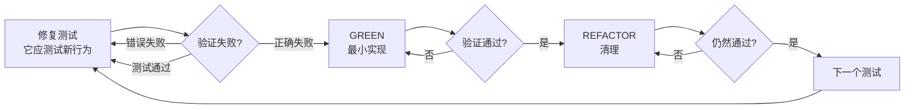
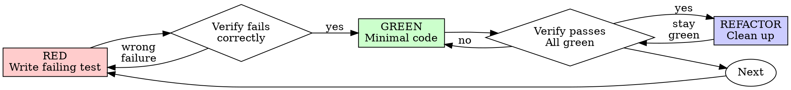
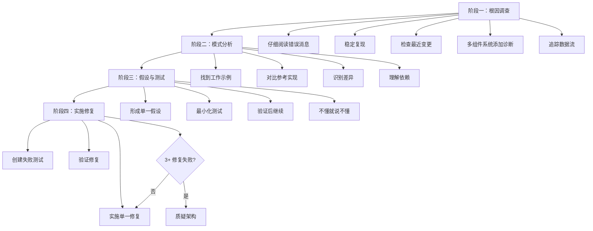
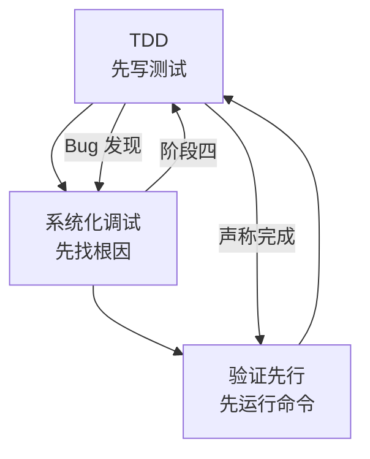

<details>
<summary>相关源文件</summary>

生成本页时使用的主要源文件：

- [skills/test-driven-development/SKILL.md](https://github.com/obra/superpowers/blob/main/skills/test-driven-development/SKILL.md)
- [skills/test-driven-development/testing-anti-patterns.md](https://github.com/obra/superpowers/blob/main/skills/test-driven-development/testing-anti-patterns.md)
- [skills/systematic-debugging/SKILL.md](https://github.com/obra/superpowers/blob/main/skills/systematic-debugging/SKILL.md)
- [skills/systematic-debugging/root-cause-tracing.md](https://github.com/obra/superpowers/blob/main/skills/systematic-debugging/root-cause-tracing.md)
- [skills/systematic-debugging/defense-in-depth.md](https://github.com/obra/superpowers/blob/main/skills/systematic-debugging/defense-in-depth.md)
- [skills/systematic-debugging/condition-based-waiting.md](https://github.com/obra/superpowers/blob/main/skills/systematic-debugging/condition-based-waiting.md)
- [skills/verification-before-completion/SKILL.md](https://github.com/obra/superpowers/blob/main/skills/verification-before-completion/SKILL.md)

</details>

# 测试驱动与系统化调试

TDD 和系统化调试是 Superpowers 最刚性的两个方法论。它们共享一个核心信念：**未经证实的断言是不可信的**。TDD 要求先看到测试失败，调试要求先找到根因，验证要求先运行命令。

## 测试驱动开发（TDD）

### 铁律

```
没有失败测试就不写生产代码
```

先写了代码？删掉。重新开始。不是"参考"，不是"适配"，是删除。

### RED-GREEN-REFACTOR 循环



#### RED——编写失败测试

- 一个行为，一个测试
- 清晰的名称，描述期望行为
- 使用真实代码，避免 mock（除非不可避免）

#### 验证 RED——看它失败（强制）

确认：
- 测试失败（不是报错）
- 失败消息是预期的
- 失败因为功能缺失（不是拼写错误）

测试通过了？你在测试已有行为，修复测试。

#### GREEN——最小实现

写最简单的让测试通过的代码。不添加功能、不重构其他代码、不"顺便改进"。

#### 验证 GREEN——看它通过（强制）

确认：
- 测试通过
- 其他测试仍通过
- 输出干净（无错误、警告）

#### REFACTOR——清理

仅在绿色之后：
- 去除重复
- 改善命名
- 提取辅助函数

保持测试绿色，不添加行为。

Sources: [skills/test-driven-development/SKILL.md:1-100](../../../project-repos/superpowers/skills/test-driven-development/SKILL.md#L1-L100)

<details class="source-snippets">
<summary>引用源码</summary>

<!-- source-snippets:start -->

#### `skills/test-driven-development/SKILL.md:1-100`

````markdown
---
name: test-driven-development
description: Use when implementing any feature or bugfix, before writing implementation code
---

# Test-Driven Development (TDD)

## Overview

Write the test first. Watch it fail. Write minimal code to pass.

**Core principle:** If you didn't watch the test fail, you don't know if it tests the right thing.

**Violating the letter of the rules is violating the spirit of the rules.**

## When to Use

**Always:**
- New features
- Bug fixes
- Refactoring
- Behavior changes

**Exceptions (ask your human partner):**
- Throwaway prototypes
- Generated code
- Configuration files

Thinking "skip TDD just this once"? Stop. That's rationalization.

## The Iron Law

```
NO PRODUCTION CODE WITHOUT A FAILING TEST FIRST
```

Write code before the test? Delete it. Start over.

**No exceptions:**
- Don't keep it as "reference"
- Don't "adapt" it while writing tests
- Don't look at it
- Delete means delete

Implement fresh from tests. Period.

## Red-Green-Refactor



### RED - Write Failing Test

Write one minimal test showing what should happen.

<Good>
```typescript
test('retries failed operations 3 times', async () => {
  let attempts = 0;
  const operation = () => {
    attempts++;
    if (attempts < 3) throw new Error('fail');
    return 'success';
  };

  const result = await retryOperation(operation);

  expect(result).toBe('success');
  expect(attempts).toBe(3);
});
```
Clear name, tests real behavior, one thing
</Good>

<Bad>
```typescript
test('retry works', async () => {
  const mock = jest.fn()
    .mockRejectedValueOnce(new Error())
    .mockRejectedValueOnce(new Error())
    .mockResolvedValueOnce('success');
````

<!-- source-snippets:end -->
</details>

### 常见自我合理化

| 借口 | 现实 |
|------|------|
| "太简单不需要测试" | 简单代码也会出 bug，测试只需 30 秒 |
| "我稍后补测试" | 立即通过的测试证明不了什么 |
| "稍后测试达到同样效果" | 事后测试回答"这做了什么"，先行测试回答"这应该做什么" |
| "已经手动测试了" | 即兴 ≠ 系统化，无记录，无法重跑 |
| "删除 X 小时的工作太浪费" | 沉没成本谬误，保留不可信代码才是技术债 |
| "先保留作参考" | 你会"适配"它，那还是事后测试。删除就是删除 |
| "需要先探索" | 可以探索，但探索代码要扔掉，从 TDD 开始 |
| "测试难写 = 设计不清晰" | 听测试的，难测试 = 难使用 |

Sources: [skills/test-driven-development/SKILL.md:100-200](../../../project-repos/superpowers/skills/test-driven-development/SKILL.md#L100-L200)

<details class="source-snippets">
<summary>引用源码</summary>

<!-- source-snippets:start -->

#### `skills/test-driven-development/SKILL.md:100-200`

````markdown
    .mockResolvedValueOnce('success');
  await retryOperation(mock);
  expect(mock).toHaveBeenCalledTimes(3);
});
```
Vague name, tests mock not code
</Bad>

**Requirements:**
- One behavior
- Clear name
- Real code (no mocks unless unavoidable)

### Verify RED - Watch It Fail

**MANDATORY. Never skip.**

```bash
npm test path/to/test.test.ts
```

Confirm:
- Test fails (not errors)
- Failure message is expected
- Fails because feature missing (not typos)

**Test passes?** You're testing existing behavior. Fix test.

**Test errors?** Fix error, re-run until it fails correctly.

### GREEN - Minimal Code

Write simplest code to pass the test.

<Good>
```typescript
async function retryOperation&lt;T&gt;(fn: () => Promise&lt;T&gt;): Promise&lt;T&gt; {
  for (let i = 0; i < 3; i++) {
    try {
      return await fn();
    } catch (e) {
      if (i === 2) throw e;
    }
  }
  throw new Error('unreachable');
}
```
Just enough to pass
</Good>

<Bad>
```typescript
async function retryOperation&lt;T&gt;(
  fn: () => Promise&lt;T&gt;,
  options?: {
    maxRetries?: number;
    backoff?: 'linear' | 'exponential';
    onRetry?: (attempt: number) => void;
  }
): Promise&lt;T&gt; {
  // YAGNI
}
```
Over-engineered
</Bad>

Don't add features, refactor other code, or "improve" beyond the test.

### Verify GREEN - Watch It Pass

**MANDATORY.**

```bash
npm test path/to/test.test.ts
```

Confirm:
- Test passes
- Other tests still pass
- Output pristine (no errors, warnings)

**Test fails?** Fix code, not test.

**Other tests fail?** Fix now.

### REFACTOR - Clean Up

After green only:
- Remove duplication
- Improve names
- Extract helpers

Keep tests green. Don't add behavior.

### Repeat

Next failing test for next feature.

## Good Tests

| Quality | Good | Bad |
````

<!-- source-snippets:end -->
</details>

### 测试反模式

- 测试 mock 行为而非真实行为
- 在生产类中添加仅用于测试的方法
- 不理解依赖就添加 mock

Sources: [skills/test-driven-development/testing-anti-patterns.md](../../../project-repos/superpowers/skills/test-driven-development/testing-anti-patterns.md)

<details class="source-snippets">
<summary>引用源码</summary>

<!-- source-snippets:start -->

#### `skills/test-driven-development/testing-anti-patterns.md`

````markdown
# Testing Anti-Patterns

**Load this reference when:** writing or changing tests, adding mocks, or tempted to add test-only methods to production code.

## Overview

Tests must verify real behavior, not mock behavior. Mocks are a means to isolate, not the thing being tested.

**Core principle:** Test what the code does, not what the mocks do.

**Following strict TDD prevents these anti-patterns.**

## The Iron Laws

```
1. NEVER test mock behavior
2. NEVER add test-only methods to production classes
3. NEVER mock without understanding dependencies
```

## Anti-Pattern 1: Testing Mock Behavior

**The violation:**
```typescript
// ❌ BAD: Testing that the mock exists
test('renders sidebar', () => {
  render(&lt;Page /&gt;);
  expect(screen.getByTestId('sidebar-mock')).toBeInTheDocument();
});
```

**Why this is wrong:**
- You're verifying the mock works, not that the component works
- Test passes when mock is present, fails when it's not
- Tells you nothing about real behavior

**your human partner's correction:** "Are we testing the behavior of a mock?"

**The fix:**
```typescript
// ✅ GOOD: Test real component or don't mock it
test('renders sidebar', () => {
  render(&lt;Page /&gt;);  // Don't mock sidebar
  expect(screen.getByRole('navigation')).toBeInTheDocument();
});

// OR if sidebar must be mocked for isolation:
// Don't assert on the mock - test Page's behavior with sidebar present
```

### Gate Function

```
BEFORE asserting on any mock element:
  Ask: "Am I testing real component behavior or just mock existence?"

  IF testing mock existence:
    STOP - Delete the assertion or unmock the component

  Test real behavior instead
```

## Anti-Pattern 2: Test-Only Methods in Production

**The violation:**
```typescript
// ❌ BAD: destroy() only used in tests
class Session {
  async destroy() {  // Looks like production API!
    await this._workspaceManager?.destroyWorkspace(this.id);
    // ... cleanup
  }
}

// In tests
afterEach(() => session.destroy());
```

**Why this is wrong:**
- Production class polluted with test-only code
- Dangerous if accidentally called in production
- Violates YAGNI and separation of concerns
- Confuses object lifecycle with entity lifecycle

**The fix:**
```typescript
// ✅ GOOD: Test utilities handle test cleanup
// Session has no destroy() - it's stateless in production

// In test-utils/
export async function cleanupSession(session: Session) {
  const workspace = session.getWorkspaceInfo();
  if (workspace) {
    await workspaceManager.destroyWorkspace(workspace.id);
  }
}

// In tests
afterEach(() => cleanupSession(session));
```

### Gate Function

```
BEFORE adding any method to production class:
  Ask: "Is this only used by tests?"

  IF yes:
    STOP - Don't add it
    Put it in test utilities instead

  Ask: "Does this class own this resource's lifecycle?"

  IF no:
    STOP - Wrong class for this method
```

## Anti-Pattern 3: Mocking Without Understanding

**The violation:**
````

<!-- source-snippets:end -->
</details>

## 系统化调试

### 铁律

```
没有根因调查就不能提出修复
```

如果还没完成第一阶段，就不能提出修复方案。

### 四阶段流程



Sources: [skills/systematic-debugging/SKILL.md:1-60](../../../project-repos/superpowers/skills/systematic-debugging/SKILL.md#L1-L60)

<details class="source-snippets">
<summary>引用源码</summary>

<!-- source-snippets:start -->

#### `skills/systematic-debugging/SKILL.md:1-60`

````markdown
---
name: systematic-debugging
description: Use when encountering any bug, test failure, or unexpected behavior, before proposing fixes
---

# Systematic Debugging

## Overview

Random fixes waste time and create new bugs. Quick patches mask underlying issues.

**Core principle:** ALWAYS find root cause before attempting fixes. Symptom fixes are failure.

**Violating the letter of this process is violating the spirit of debugging.**

## The Iron Law

```
NO FIXES WITHOUT ROOT CAUSE INVESTIGATION FIRST
```

If you haven't completed Phase 1, you cannot propose fixes.

## When to Use

Use for ANY technical issue:
- Test failures
- Bugs in production
- Unexpected behavior
- Performance problems
- Build failures
- Integration issues

**Use this ESPECIALLY when:**
- Under time pressure (emergencies make guessing tempting)
- "Just one quick fix" seems obvious
- You've already tried multiple fixes
- Previous fix didn't work
- You don't fully understand the issue

**Don't skip when:**
- Issue seems simple (simple bugs have root causes too)
- You're in a hurry (rushing guarantees rework)
- Manager wants it fixed NOW (systematic is faster than thrashing)

## The Four Phases

You MUST complete each phase before proceeding to the next.

### Phase 1: Root Cause Investigation

**BEFORE attempting ANY fix:**

1. **Read Error Messages Carefully**
   - Don't skip past errors or warnings
   - They often contain the exact solution
   - Read stack traces completely
   - Note line numbers, file paths, error codes

2. **Reproduce Consistently**
````

<!-- source-snippets:end -->
</details>

### 阶段一：根因调查

在提出任何修复之前：

1. **仔细阅读错误消息**——不要跳过，通常包含精确解决方案
2. **稳定复现**——能可靠触发吗？每次都发生吗？不可复现就收集更多数据
3. **检查最近变更**——git diff、最近提交、新依赖、配置变更
4. **多组件系统添加诊断**——在每个组件边界记录进出数据，运行一次收集证据，定位失败组件
5. **追踪数据流**——坏值从哪里来？什么传入了坏值？一直追溯到源头

Sources: [skills/systematic-debugging/SKILL.md:60-120](../../../project-repos/superpowers/skills/systematic-debugging/SKILL.md#L60-L120)

<details class="source-snippets">
<summary>引用源码</summary>

<!-- source-snippets:start -->

#### `skills/systematic-debugging/SKILL.md:60-120`

````markdown
2. **Reproduce Consistently**
   - Can you trigger it reliably?
   - What are the exact steps?
   - Does it happen every time?
   - If not reproducible → gather more data, don't guess

3. **Check Recent Changes**
   - What changed that could cause this?
   - Git diff, recent commits
   - New dependencies, config changes
   - Environmental differences

4. **Gather Evidence in Multi-Component Systems**

   **WHEN system has multiple components (CI → build → signing, API → service → database):**

   **BEFORE proposing fixes, add diagnostic instrumentation:**
   ```
   For EACH component boundary:
     - Log what data enters component
     - Log what data exits component
     - Verify environment/config propagation
     - Check state at each layer

   Run once to gather evidence showing WHERE it breaks
   THEN analyze evidence to identify failing component
   THEN investigate that specific component
   ```

   **Example (multi-layer system):**
   ```bash
   # Layer 1: Workflow
   echo "=== Secrets available in workflow: ==="
   echo "IDENTITY: ${IDENTITY:+SET}${IDENTITY:-UNSET}"

   # Layer 2: Build script
   echo "=== Env vars in build script: ==="
   env | grep IDENTITY || echo "IDENTITY not in environment"

   # Layer 3: Signing script
   echo "=== Keychain state: ==="
   security list-keychains
   security find-identity -v

   # Layer 4: Actual signing
   codesign --sign "$IDENTITY" --verbose=4 "$APP"
   ```

   **This reveals:** Which layer fails (secrets → workflow ✓, workflow → build ✗)

5. **Trace Data Flow**

   **WHEN error is deep in call stack:**

   See `root-cause-tracing.md` in this directory for the complete backward tracing technique.

   **Quick version:**
   - Where does bad value originate?
   - What called this with bad value?
   - Keep tracing up until you find the source
   - Fix at source, not at symptom
````

<!-- source-snippets:end -->
</details>

### 阶段二：模式分析

1. 找到同类工作的代码
2. 完整阅读参考实现（不要略读）
3. 列出每个差异，无论多小
4. 理解所有依赖

### 阶段三：假设与测试

科学方法：
- 明确陈述："我认为 X 是根因，因为 Y"
- 做最小变更来测试假设
- 一次只改一个变量
- 不工作就形成新假设，不要叠加修复

### 阶段四：实施修复

1. 创建失败测试用例（使用 TDD 技能）
2. 实施单一修复，修复根因而非症状
3. 验证修复
4. **3+ 次修复失败**：质疑架构——每次修复都在不同地方暴露新问题，说明是架构问题而非实现问题

Sources: [skills/systematic-debugging/SKILL.md:120-200](../../../project-repos/superpowers/skills/systematic-debugging/SKILL.md#L120-L200)

<details class="source-snippets">
<summary>引用源码</summary>

<!-- source-snippets:start -->

#### `skills/systematic-debugging/SKILL.md:120-200`

```markdown
   - Fix at source, not at symptom

### Phase 2: Pattern Analysis

**Find the pattern before fixing:**

1. **Find Working Examples**
   - Locate similar working code in same codebase
   - What works that's similar to what's broken?

2. **Compare Against References**
   - If implementing pattern, read reference implementation COMPLETELY
   - Don't skim - read every line
   - Understand the pattern fully before applying

3. **Identify Differences**
   - What's different between working and broken?
   - List every difference, however small
   - Don't assume "that can't matter"

4. **Understand Dependencies**
   - What other components does this need?
   - What settings, config, environment?
   - What assumptions does it make?

### Phase 3: Hypothesis and Testing

**Scientific method:**

1. **Form Single Hypothesis**
   - State clearly: "I think X is the root cause because Y"
   - Write it down
   - Be specific, not vague

2. **Test Minimally**
   - Make the SMALLEST possible change to test hypothesis
   - One variable at a time
   - Don't fix multiple things at once

3. **Verify Before Continuing**
   - Did it work? Yes → Phase 4
   - Didn't work? Form NEW hypothesis
   - DON'T add more fixes on top

4. **When You Don't Know**
   - Say "I don't understand X"
   - Don't pretend to know
   - Ask for help
   - Research more

### Phase 4: Implementation

**Fix the root cause, not the symptom:**

1. **Create Failing Test Case**
   - Simplest possible reproduction
   - Automated test if possible
   - One-off test script if no framework
   - MUST have before fixing
   - Use the `superpowers:test-driven-development` skill for writing proper failing tests

2. **Implement Single Fix**
   - Address the root cause identified
   - ONE change at a time
   - No "while I'm here" improvements
   - No bundled refactoring

3. **Verify Fix**
   - Test passes now?
   - No other tests broken?
   - Issue actually resolved?

4. **If Fix Doesn't Work**
   - STOP
   - Count: How many fixes have you tried?
   - If < 3: Return to Phase 1, re-analyze with new information
   - **If ≥ 3: STOP and question the architecture (step 5 below)**
   - DON'T attempt Fix #4 without architectural discussion

5. **If 3+ Fixes Failed: Question Architecture**

```

<!-- source-snippets:end -->
</details>

### 辅助技术

| 技术 | 文件 | 用途 |
|------|------|------|
| 根因追踪 | root-cause-tracing.md | 从调用栈深处反向追踪坏值的源头 |
| 纵深防御 | defense-in-depth.md | 找到根因后在多层添加验证 |
| 条件等待 | condition-based-waiting.md | 用条件轮询替代任意超时 |

Sources: [skills/systematic-debugging/SKILL.md:240-270](../../../project-repos/superpowers/skills/systematic-debugging/SKILL.md#L240-L270)

<details class="source-snippets">
<summary>引用源码</summary>

<!-- source-snippets:start -->

#### `skills/systematic-debugging/SKILL.md:240-270`

```markdown
- "Ultrathink this" - Question fundamentals, not just symptoms
- "We're stuck?" (frustrated) - Your approach isn't working

**When you see these:** STOP. Return to Phase 1.

## Common Rationalizations

| Excuse | Reality |
|--------|---------|
| "Issue is simple, don't need process" | Simple issues have root causes too. Process is fast for simple bugs. |
| "Emergency, no time for process" | Systematic debugging is FASTER than guess-and-check thrashing. |
| "Just try this first, then investigate" | First fix sets the pattern. Do it right from the start. |
| "I'll write test after confirming fix works" | Untested fixes don't stick. Test first proves it. |
| "Multiple fixes at once saves time" | Can't isolate what worked. Causes new bugs. |
| "Reference too long, I'll adapt the pattern" | Partial understanding guarantees bugs. Read it completely. |
| "I see the problem, let me fix it" | Seeing symptoms ≠ understanding root cause. |
| "One more fix attempt" (after 2+ failures) | 3+ failures = architectural problem. Question pattern, don't fix again. |

## Quick Reference

| Phase | Key Activities | Success Criteria |
|-------|---------------|------------------|
| **1. Root Cause** | Read errors, reproduce, check changes, gather evidence | Understand WHAT and WHY |
| **2. Pattern** | Find working examples, compare | Identify differences |
| **3. Hypothesis** | Form theory, test minimally | Confirmed or new hypothesis |
| **4. Implementation** | Create test, fix, verify | Bug resolved, tests pass |

## When Process Reveals "No Root Cause"

If systematic investigation reveals issue is truly environmental, timing-dependent, or external:

```

<!-- source-snippets:end -->
</details>

## 验证先行原则

验证先行是贯穿 TDD 和调试的元原则。

### 铁律

```
没有新鲜验证证据就不能声称完成
```

如果在这个消息中没运行验证命令，就不能声称它通过。

### 门控函数

```
声称任何状态前：
1. 识别：什么命令能证明此声称？
2. 运行：执行完整命令
3. 阅读：完整输出 + 退出码 + 失败计数
4. 验证：输出是否确认声称？
5. 只有此时：做出声称
```

### 常见声称的验证要求

| 声称 | 必需 | 不充分 |
|------|------|--------|
| 测试通过 | 测试命令输出：0 失败 | 上次运行、"应该通过" |
| 构建成功 | 构建命令：exit 0 | Linter 通过、日志看起来正常 |
| Bug 已修复 | 测试原始症状：通过 | 代码改了、假设修好了 |
| 代理完成 | VCS diff 显示变更 | 代理报告"成功" |

Sources: [skills/verification-before-completion/SKILL.md:1-139](../../../project-repos/superpowers/skills/verification-before-completion/SKILL.md#L1-L139)

<details class="source-snippets">
<summary>引用源码</summary>

<!-- source-snippets:start -->

#### `skills/verification-before-completion/SKILL.md:1-139`

````markdown
---
name: verification-before-completion
description: Use when about to claim work is complete, fixed, or passing, before committing or creating PRs - requires running verification commands and confirming output before making any success claims; evidence before assertions always
---

# Verification Before Completion

## Overview

Claiming work is complete without verification is dishonesty, not efficiency.

**Core principle:** Evidence before claims, always.

**Violating the letter of this rule is violating the spirit of this rule.**

## The Iron Law

```
NO COMPLETION CLAIMS WITHOUT FRESH VERIFICATION EVIDENCE
```

If you haven't run the verification command in this message, you cannot claim it passes.

## The Gate Function

```
BEFORE claiming any status or expressing satisfaction:

1. IDENTIFY: What command proves this claim?
2. RUN: Execute the FULL command (fresh, complete)
3. READ: Full output, check exit code, count failures
4. VERIFY: Does output confirm the claim?
   - If NO: State actual status with evidence
   - If YES: State claim WITH evidence
5. ONLY THEN: Make the claim

Skip any step = lying, not verifying
```

## Common Failures

| Claim | Requires | Not Sufficient |
|-------|----------|----------------|
| Tests pass | Test command output: 0 failures | Previous run, "should pass" |
| Linter clean | Linter output: 0 errors | Partial check, extrapolation |
| Build succeeds | Build command: exit 0 | Linter passing, logs look good |
| Bug fixed | Test original symptom: passes | Code changed, assumed fixed |
| Regression test works | Red-green cycle verified | Test passes once |
| Agent completed | VCS diff shows changes | Agent reports "success" |
| Requirements met | Line-by-line checklist | Tests passing |

## Red Flags - STOP

- Using "should", "probably", "seems to"
- Expressing satisfaction before verification ("Great!", "Perfect!", "Done!", etc.)
- About to commit/push/PR without verification
- Trusting agent success reports
- Relying on partial verification
- Thinking "just this once"
- Tired and wanting work over
- **ANY wording implying success without having run verification**

## Rationalization Prevention

| Excuse | Reality |
|--------|---------|
| "Should work now" | RUN the verification |
| "I'm confident" | Confidence ≠ evidence |
| "Just this once" | No exceptions |
| "Linter passed" | Linter ≠ compiler |
| "Agent said success" | Verify independently |
| "I'm tired" | Exhaustion ≠ excuse |
| "Partial check is enough" | Partial proves nothing |
| "Different words so rule doesn't apply" | Spirit over letter |

## Key Patterns

**Tests:**
```
✅ [Run test command] [See: 34/34 pass] "All tests pass"
❌ "Should pass now" / "Looks correct"
```

**Regression tests (TDD Red-Green):**
```
✅ Write → Run (pass) → Revert fix → Run (MUST FAIL) → Restore → Run (pass)
❌ "I've written a regression test" (without red-green verification)
```

**Build:**
```
✅ [Run build] [See: exit 0] "Build passes"
❌ "Linter passed" (linter doesn't check compilation)
```

**Requirements:**
```
✅ Re-read plan → Create checklist → Verify each → Report gaps or completion
❌ "Tests pass, phase complete"
```

**Agent delegation:**
```
✅ Agent reports success → Check VCS diff → Verify changes → Report actual state
❌ Trust agent report
```

## Why This Matters

From 24 failure memories:
- your human partner said "I don't believe you" - trust broken
- Undefined functions shipped - would crash
- Missing requirements shipped - incomplete features
- Time wasted on false completion → redirect → rework
- Violates: "Honesty is a core value. If you lie, you'll be replaced."

## When To Apply

**ALWAYS before:**
- ANY variation of success/completion claims
... snippet truncated ...
````

<!-- source-snippets:end -->
</details>

## 三者的关系



TDD 保证代码正确，调试保证修复有效，验证保证声称可信。三者形成闭环：TDD 中发现 bug 进入调试，调试的修复阶段使用 TDD，完成时使用验证先行。

Sources: [skills/test-driven-development/SKILL.md:350-371](../../../project-repos/superpowers/skills/test-driven-development/SKILL.md#L350-L371), [skills/systematic-debugging/SKILL.md:240-296](../../../project-repos/superpowers/skills/systematic-debugging/SKILL.md#L240-L296), [skills/verification-before-completion/SKILL.md:1-139](../../../project-repos/superpowers/skills/verification-before-completion/SKILL.md#L1-L139)

<details class="source-snippets">
<summary>引用源码</summary>

<!-- source-snippets:start -->

#### `skills/test-driven-development/SKILL.md:350-371`

````markdown

## Debugging Integration

Bug found? Write failing test reproducing it. Follow TDD cycle. Test proves fix and prevents regression.

Never fix bugs without a test.

## Testing Anti-Patterns

When adding mocks or test utilities, read @testing-anti-patterns.md to avoid common pitfalls:
- Testing mock behavior instead of real behavior
- Adding test-only methods to production classes
- Mocking without understanding dependencies

## Final Rule

```
Production code → test exists and failed first
Otherwise → not TDD
```

No exceptions without your human partner's permission.
````

#### `skills/systematic-debugging/SKILL.md:240-296`

```markdown
- "Ultrathink this" - Question fundamentals, not just symptoms
- "We're stuck?" (frustrated) - Your approach isn't working

**When you see these:** STOP. Return to Phase 1.

## Common Rationalizations

| Excuse | Reality |
|--------|---------|
| "Issue is simple, don't need process" | Simple issues have root causes too. Process is fast for simple bugs. |
| "Emergency, no time for process" | Systematic debugging is FASTER than guess-and-check thrashing. |
| "Just try this first, then investigate" | First fix sets the pattern. Do it right from the start. |
| "I'll write test after confirming fix works" | Untested fixes don't stick. Test first proves it. |
| "Multiple fixes at once saves time" | Can't isolate what worked. Causes new bugs. |
| "Reference too long, I'll adapt the pattern" | Partial understanding guarantees bugs. Read it completely. |
| "I see the problem, let me fix it" | Seeing symptoms ≠ understanding root cause. |
| "One more fix attempt" (after 2+ failures) | 3+ failures = architectural problem. Question pattern, don't fix again. |

## Quick Reference

| Phase | Key Activities | Success Criteria |
|-------|---------------|------------------|
| **1. Root Cause** | Read errors, reproduce, check changes, gather evidence | Understand WHAT and WHY |
| **2. Pattern** | Find working examples, compare | Identify differences |
| **3. Hypothesis** | Form theory, test minimally | Confirmed or new hypothesis |
| **4. Implementation** | Create test, fix, verify | Bug resolved, tests pass |

## When Process Reveals "No Root Cause"

If systematic investigation reveals issue is truly environmental, timing-dependent, or external:

1. You've completed the process
2. Document what you investigated
3. Implement appropriate handling (retry, timeout, error message)
4. Add monitoring/logging for future investigation

**But:** 95% of "no root cause" cases are incomplete investigation.

## Supporting Techniques

These techniques are part of systematic debugging and available in this directory:

- **`root-cause-tracing.md`** - Trace bugs backward through call stack to find original trigger
- **`defense-in-depth.md`** - Add validation at multiple layers after finding root cause
- **`condition-based-waiting.md`** - Replace arbitrary timeouts with condition polling

**Related skills:**
- **superpowers:test-driven-development** - For creating failing test case (Phase 4, Step 1)
- **superpowers:verification-before-completion** - Verify fix worked before claiming success

## Real-World Impact

From debugging sessions:
- Systematic approach: 15-30 minutes to fix
- Random fixes approach: 2-3 hours of thrashing
- First-time fix rate: 95% vs 40%
- New bugs introduced: Near zero vs common
```

#### `skills/verification-before-completion/SKILL.md:1-139`

````markdown
---
name: verification-before-completion
description: Use when about to claim work is complete, fixed, or passing, before committing or creating PRs - requires running verification commands and confirming output before making any success claims; evidence before assertions always
---

# Verification Before Completion

## Overview

Claiming work is complete without verification is dishonesty, not efficiency.

**Core principle:** Evidence before claims, always.

**Violating the letter of this rule is violating the spirit of this rule.**

## The Iron Law

```
NO COMPLETION CLAIMS WITHOUT FRESH VERIFICATION EVIDENCE
```

If you haven't run the verification command in this message, you cannot claim it passes.

## The Gate Function

```
BEFORE claiming any status or expressing satisfaction:

1. IDENTIFY: What command proves this claim?
2. RUN: Execute the FULL command (fresh, complete)
3. READ: Full output, check exit code, count failures
4. VERIFY: Does output confirm the claim?
   - If NO: State actual status with evidence
   - If YES: State claim WITH evidence
5. ONLY THEN: Make the claim

Skip any step = lying, not verifying
```

## Common Failures

| Claim | Requires | Not Sufficient |
|-------|----------|----------------|
| Tests pass | Test command output: 0 failures | Previous run, "should pass" |
| Linter clean | Linter output: 0 errors | Partial check, extrapolation |
| Build succeeds | Build command: exit 0 | Linter passing, logs look good |
| Bug fixed | Test original symptom: passes | Code changed, assumed fixed |
| Regression test works | Red-green cycle verified | Test passes once |
| Agent completed | VCS diff shows changes | Agent reports "success" |
| Requirements met | Line-by-line checklist | Tests passing |

## Red Flags - STOP

- Using "should", "probably", "seems to"
- Expressing satisfaction before verification ("Great!", "Perfect!", "Done!", etc.)
- About to commit/push/PR without verification
- Trusting agent success reports
- Relying on partial verification
- Thinking "just this once"
- Tired and wanting work over
- **ANY wording implying success without having run verification**

## Rationalization Prevention

| Excuse | Reality |
|--------|---------|
| "Should work now" | RUN the verification |
| "I'm confident" | Confidence ≠ evidence |
| "Just this once" | No exceptions |
| "Linter passed" | Linter ≠ compiler |
| "Agent said success" | Verify independently |
| "I'm tired" | Exhaustion ≠ excuse |
| "Partial check is enough" | Partial proves nothing |
| "Different words so rule doesn't apply" | Spirit over letter |

## Key Patterns

**Tests:**
```
✅ [Run test command] [See: 34/34 pass] "All tests pass"
❌ "Should pass now" / "Looks correct"
```

**Regression tests (TDD Red-Green):**
```
✅ Write → Run (pass) → Revert fix → Run (MUST FAIL) → Restore → Run (pass)
❌ "I've written a regression test" (without red-green verification)
```

**Build:**
```
✅ [Run build] [See: exit 0] "Build passes"
❌ "Linter passed" (linter doesn't check compilation)
```

**Requirements:**
```
✅ Re-read plan → Create checklist → Verify each → Report gaps or completion
❌ "Tests pass, phase complete"
```

**Agent delegation:**
```
✅ Agent reports success → Check VCS diff → Verify changes → Report actual state
❌ Trust agent report
```

## Why This Matters

From 24 failure memories:
- your human partner said "I don't believe you" - trust broken
- Undefined functions shipped - would crash
- Missing requirements shipped - incomplete features
- Time wasted on false completion → redirect → rework
- Violates: "Honesty is a core value. If you lie, you'll be replaced."

## When To Apply

**ALWAYS before:**
- ANY variation of success/completion claims
... snippet truncated ...
````

<!-- source-snippets:end -->
</details>

## 相关页面

- [技能体系](skills-system.md)
- [核心工作流](core-workflow.md)
- [测试与质量保障](testing-and-quality.md)
