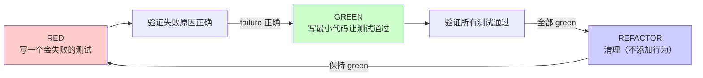
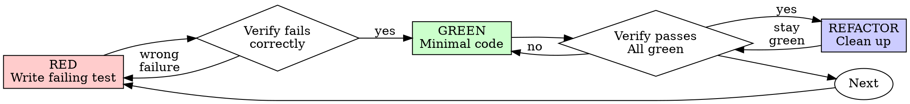

<details>
<summary>相关源文件</summary>

生成本页时使用的主要源文件：

- [skills/test-driven-development/SKILL.md:1-120](../../../project-repos/superpowers/skills/test-driven-development/SKILL.md#L1-L120)
- [skills/test-driven-development/testing-anti-patterns.md:1-50](../../../project-repos/superpowers/skills/test-driven-development/testing-anti-patterns.md#L1-L50)

</details>

# Test-Driven Development

TDD 是 Superpowers 的核心工程纪律之一——在写任何产品代码之前，必须先写一个会失败的测试，看着它失败，然后写最小代码让它通过。

**为什么这个铁律这么重要？** 测试后写的代码无法证明它测试的是正确的东西——它测试的是你实际写的内容，而非你应该写的内容。TDD 强制你先声明期望行为，这使得测试真正成为行为的规格文档，而非代码的附属品。

## RED-GREEN-REFACTOR 循环



**RED 阶段必须包含**：
- 单一行为
- 清晰的测试名描述期望行为
- 使用真实代码（非 Mock，除非不可避免）

**VERIFICATION 是强制性的**：每个阶段完成后必须运行测试，确认输出符合预期。跳过验证等于没有执行 TDD。

Sources: [skills/test-driven-development/SKILL.md:30-70](../../../project-repos/superpowers/skills/test-driven-development/SKILL.md#L30-L70)

<details class="source-snippets">
<summary>引用源码</summary>

<!-- source-snippets:start -->

#### `skills/test-driven-development/SKILL.md:30-70`

````markdown

## The Iron Law

```
NO PRODUCTION CODE WITHOUT A FAILING TEST FIRST
```

Write code before the test? Delete it. Start over.

**No exceptions:**
- Don't keep it as "reference"
- Don't "adapt" it while writing tests
- Don't look at it
- Delete means delete

Implement fresh from tests. Period.

## Red-Green-Refactor



````

<!-- source-snippets:end -->
</details>

## 测试命名的重要性

测试名是行为的规格声明，不是对实现的描述：

| 好的命名 | 坏的命名 |
|---------|---------|
| `test('retries failed operations 3 times')` | `test('retry works')` |
| `test('rejects empty email')` | `test('test1')` |
| `test('returns null for missing key')` | `test('null case')` |

好的测试名让人在只看到测试失败消息时就知道系统哪里出了问题。

## 测试 Anti-Patterns

`testing-anti-patterns.md` 列举了常见错误：

**Mock 滥用**：测试 Mock 的行为而非真实代码。正确的做法是尽量使用真实代码，只在外部依赖不可控时（如网络调用、文件系统）才使用 Mock。

**添加测试专用的生产代码方法**：为了方便测试而给产品类添加额外方法，破坏了封装性。

**重复断言掩盖问题**：一个测试中大量断言，当第一个失败时无法看到后续是否也有问题。

Sources: [skills/test-driven-development/testing-anti-patterns.md:1-50](../../../project-repos/superpowers/skills/test-driven-development/testing-anti-patterns.md#L1-L50)

<details class="source-snippets">
<summary>引用源码</summary>

<!-- source-snippets:start -->

#### `skills/test-driven-development/testing-anti-patterns.md:1-50`

````markdown
# Testing Anti-Patterns

**Load this reference when:** writing or changing tests, adding mocks, or tempted to add test-only methods to production code.

## Overview

Tests must verify real behavior, not mock behavior. Mocks are a means to isolate, not the thing being tested.

**Core principle:** Test what the code does, not what the mocks do.

**Following strict TDD prevents these anti-patterns.**

## The Iron Laws

```
1. NEVER test mock behavior
2. NEVER add test-only methods to production classes
3. NEVER mock without understanding dependencies
```

## Anti-Pattern 1: Testing Mock Behavior

**The violation:**
```typescript
// ❌ BAD: Testing that the mock exists
test('renders sidebar', () => {
  render(<Page />);
  expect(screen.getByTestId('sidebar-mock')).toBeInTheDocument();
});
```

**Why this is wrong:**
- You're verifying the mock works, not that the component works
- Test passes when mock is present, fails when it's not
- Tells you nothing about real behavior

**your human partner's correction:** "Are we testing the behavior of a mock?"

**The fix:**
```typescript
// ✅ GOOD: Test real component or don't mock it
test('renders sidebar', () => {
  render(<Page />);  // Don't mock sidebar
  expect(screen.getByRole('navigation')).toBeInTheDocument();
});

// OR if sidebar must be mocked for isolation:
// Don't assert on the mock - test Page's behavior with sidebar present
```

````

<!-- source-snippets:end -->
</details>

## 铁律与"No exceptions"

TDD 铁律后面跟着"No exceptions"清单，明确禁止所有常见的绕过尝试：

```markdown
Write code before the test? Delete it. Start over.

No exceptions:
- Don't keep it as "reference"
- Don't "adapt" it while writing tests
- Don't look at it
- Delete means delete
```

这是针对智能体最擅长的"自我合理化"行为的直接防御。

## 常见 Rationalization 对照表

| 智能体的想法 | 现实 |
|------------|------|
| "太简单了，不需要测试" | 简单代码也会坏。测试只需要 30 秒。 |
| "之后手动测试就够了" | 手动测试是随机的，不能重跑，没有记录。 |
| "测试之后写也能达到同样目标" | 测试后写 = 回答"这实现了什么"。测试先写 = 回答"这应该做什么"。 |
| "删掉 X 小时的工作太浪费了" | 沉没成本谬误。保留无法信任的代码是技术债务。 |

## 相关页面

- [Verification](verification) — 发现 bug 时的 TDD 应用（写失败测试重现 bug）
- [Subagent-Driven Development](subagent-driven-development) — SDD 中子任务强制使用 TDD
- [Systematic Debugging](verification) — TDD 循环与调试流程的整合
