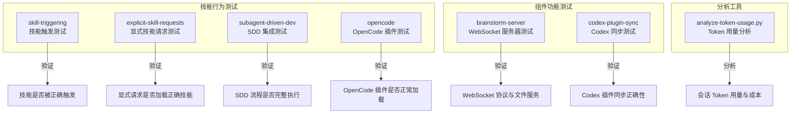

<details>
<summary>相关源文件</summary>

生成本页时使用的主要源文件：

- [docs/testing.md](https://github.com/obra/superpowers/blob/main/docs/testing.md)
- [tests/claude-code/run-skill-tests.sh](https://github.com/obra/superpowers/blob/main/tests/claude-code/run-skill-tests.sh)
- [tests/claude-code/test-helpers.sh](https://github.com/obra/superpowers/blob/main/tests/claude-code/test-helpers.sh)
- [tests/claude-code/test-subagent-driven-development.sh](https://github.com/obra/superpowers/blob/main/tests/claude-code/test-subagent-driven-development.sh)
- [tests/claude-code/test-subagent-driven-development-integration.sh](https://github.com/obra/superpowers/blob/main/tests/claude-code/test-subagent-driven-development-integration.sh)
- [tests/claude-code/analyze-token-usage.py](https://github.com/obra/superpowers/blob/main/tests/claude-code/analyze-token-usage.py)
- [tests/brainstorm-server/server.test.js](https://github.com/obra/superpowers/blob/main/tests/brainstorm-server/server.test.js)
- [tests/brainstorm-server/ws-protocol.test.js](https://github.com/obra/superpowers/blob/main/tests/brainstorm-server/ws-protocol.test.js)
- [tests/skill-triggering/run-test.sh](https://github.com/obra/superpowers/blob/main/tests/skill-triggering/run-test.sh)
- [tests/explicit-skill-requests/run-test.sh](https://github.com/obra/superpowers/blob/main/tests/explicit-skill-requests/run-test.sh)
- [tests/opencode/run-tests.sh](https://github.com/obra/superpowers/blob/main/tests/opencode/run-tests.sh)

</details>

# 测试与质量保障

Superpowers 的测试体系分为两层：**技能行为测试**（验证代理是否正确触发和遵循技能）和**组件功能测试**（验证可视化伴侣等组件的技术正确性）。由于技能本质上是影响代理行为的文档，其测试方式不同于传统软件——需要运行真实的编码代理会话并分析会话记录。

## 测试架构



Sources: [docs/testing.md:1-50](../../../project-repos/superpowers/docs/testing.md#L1-L50), [00-repo-inventory.md](../00-repo-inventory.md)

<details class="source-snippets">
<summary>引用源码</summary>

<!-- source-snippets:start -->

#### `docs/testing.md:1-50`

````markdown
# Testing Superpowers Skills

This document describes how to test Superpowers skills, particularly the integration tests for complex skills like `subagent-driven-development`.

## Overview

Testing skills that involve subagents, workflows, and complex interactions requires running actual Claude Code sessions in headless mode and verifying their behavior through session transcripts.

## Test Structure

```
tests/
├── claude-code/
│   ├── test-helpers.sh                    # Shared test utilities
│   ├── test-subagent-driven-development-integration.sh
│   ├── analyze-token-usage.py             # Token analysis tool
│   └── run-skill-tests.sh                 # Test runner (if exists)
```

## Running Tests

### Integration Tests

Integration tests execute real Claude Code sessions with actual skills:

```bash
# Run the subagent-driven-development integration test
cd tests/claude-code
./test-subagent-driven-development-integration.sh
```

**Note:** Integration tests can take 10-30 minutes as they execute real implementation plans with multiple subagents.

### Requirements

- Must run from the **superpowers plugin directory** (not from temp directories)
- Claude Code must be installed and available as `claude` command
- Local dev marketplace must be enabled: `"superpowers@superpowers-dev": true` in `~/.claude/settings.json`

## Integration Test: subagent-driven-development

### What It Tests

The integration test verifies the `subagent-driven-development` skill correctly:

1. **Plan Loading**: Reads the plan once at the beginning
2. **Full Task Text**: Provides complete task descriptions to subagents (doesn't make them read files)
3. **Self-Review**: Ensures subagents perform self-review before reporting
4. **Review Order**: Runs spec compliance review before code quality review
5. **Review Loops**: Uses review loops when issues are found
````

#### `00-repo-inventory.md`

```markdown
# 00 - 仓库盘点

## Source

- Path: `/Users/bytedance/workspace/deepwiki/project-repos/superpowers`
- Remote: `https://github.com/obra/superpowers`
- Branch: `main`
- Commit: `e7a2d16476bf042e9add4699c9d018a90f86e4a6`

## File Summary

- Files scanned: 147
- Top-level directories: `.claude-plugin`, `.codex`, `.codex-plugin`, `.cursor-plugin`, `.github`, `.opencode`, `agents`, `assets`, `commands`, `docs`, `hooks`, `scripts`, `skills`, `tests`

| Extension | Count |
|-----------|------:|
| `.md` | 74 |
| `.sh` | 28 |
| `.txt` | 15 |
| `.json` | 11 |
| `.js` | 5 |
| `[no extension]` | 4 |
| `.yml` | 2 |
| `.png` | 1 |
| `.svg` | 1 |
| `.cmd` | 1 |
| `.html` | 1 |
| `.cjs` | 1 |
| `.ts` | 1 |
| `.dot` | 1 |
| `.py` | 1 |

## Manifests and Build Files

- `package.json`
- `tests/brainstorm-server/package-lock.json`
- `tests/brainstorm-server/package.json`

## Documentation

- `CODE_OF_CONDUCT.md`
- `README.md`
- `docs/README.codex.md`
- `docs/README.opencode.md`
- `docs/plans/2025-11-22-opencode-support-design.md`
- `docs/plans/2025-11-22-opencode-support-implementation.md`
- `docs/plans/2025-11-28-skills-improvements-from-user-feedback.md`
- `docs/plans/2026-01-17-visual-brainstorming.md`
- `docs/superpowers/plans/2026-01-22-document-review-system.md`
- `docs/superpowers/plans/2026-02-19-visual-brainstorming-refactor.md`
- `docs/superpowers/plans/2026-03-11-zero-dep-brainstorm-server.md`
- `docs/superpowers/plans/2026-03-23-codex-app-compatibility.md`
- `docs/superpowers/specs/2026-01-22-document-review-system-design.md`
- `docs/superpowers/specs/2026-02-19-visual-brainstorming-refactor-design.md`
- `docs/superpowers/specs/2026-03-11-zero-dep-brainstorm-server-design.md`
- `docs/superpowers/specs/2026-03-23-codex-app-compatibility-design.md`
- `docs/testing.md`
- `docs/windows/polyglot-hooks.md`
- `tests/claude-code/README.md`

## CI and Automation

- None detected

## Tests

- `tests/brainstorm-server/package-lock.json`
- `tests/brainstorm-server/package.json`
- `tests/brainstorm-server/server.test.js`
- `tests/brainstorm-server/windows-lifecycle.test.sh`
- `tests/brainstorm-server/ws-protocol.test.js`
- `tests/claude-code/README.md`
- `tests/claude-code/analyze-token-usage.py`
- `tests/claude-code/run-skill-tests.sh`
- `tests/claude-code/test-document-review-system.sh`
- `tests/claude-code/test-helpers.sh`
- `tests/claude-code/test-subagent-driven-development-integration.sh`
- `tests/claude-code/test-subagent-driven-development.sh`
- `tests/codex-plugin-sync/test-sync-to-codex-plugin.sh`
- `tests/explicit-skill-requests/prompts/action-oriented.txt`
- `tests/explicit-skill-requests/prompts/after-planning-flow.txt`
- `tests/explicit-skill-requests/prompts/claude-suggested-it.txt`
- `tests/explicit-skill-requests/prompts/i-know-what-sdd-means.txt`
- `tests/explicit-skill-requests/prompts/mid-conversation-execute-plan.txt`
- `tests/explicit-skill-requests/prompts/please-use-brainstorming.txt`
- `tests/explicit-skill-requests/prompts/skip-formalities.txt`
- `tests/explicit-skill-requests/prompts/subagent-driven-development-please.txt`
- `tests/explicit-skill-requests/prompts/use-systematic-debugging.txt`
- `tests/explicit-skill-requests/run-all.sh`
- `tests/explicit-skill-requests/run-claude-describes-sdd.sh`
- `tests/explicit-skill-requests/run-extended-multiturn-test.sh`
- `tests/explicit-skill-requests/run-haiku-test.sh`
- `tests/explicit-skill-requests/run-multiturn-test.sh`
- `tests/explicit-skill-requests/run-test.sh`
- `tests/opencode/run-tests.sh`
- `tests/opencode/setup.sh`
- `tests/opencode/test-plugin-loading.sh`
- `tests/opencode/test-priority.sh`
- `tests/opencode/test-tools.sh`
- `tests/skill-triggering/prompts/dispatching-parallel-agents.txt`
- `tests/skill-triggering/prompts/executing-plans.txt`
- `tests/skill-triggering/prompts/requesting-code-review.txt`
- `tests/skill-triggering/prompts/systematic-debugging.txt`
- `tests/skill-triggering/prompts/test-driven-development.txt`
- `tests/skill-triggering/prompts/writing-plans.txt`
- `tests/skill-triggering/run-all.sh`
- `tests/skill-triggering/run-test.sh`
- `tests/subagent-driven-dev/go-fractals/design.md`
- `tests/subagent-driven-dev/go-fractals/plan.md`
- `tests/subagent-driven-dev/go-fractals/scaffold.sh`
- `tests/subagent-driven-dev/run-test.sh`
- `tests/subagent-driven-dev/svelte-todo/design.md`
- `tests/subagent-driven-dev/svelte-todo/plan.md`
- `tests/subagent-driven-dev/svelte-todo/scaffold.sh`

## Skills

- `skills/brainstorming/SKILL.md`
- `skills/dispatching-parallel-agents/SKILL.md`
- `skills/executing-plans/SKILL.md`
```

<!-- source-snippets:end -->
</details>

## 技能触发测试（skill-triggering）

验证代理在收到特定提示时是否自动触发正确的技能。

### 测试的技能

- dispatching-parallel-agents
- executing-plans
- requesting-code-review
- systematic-debugging
- test-driven-development
- writing-plans

### 运行方式

```bash
cd tests/skill-triggering
./run-all.sh        # 运行所有触发测试
./run-test.sh       # 运行单个测试
```

每个测试向代理发送一个提示词（如 `tests/skill-triggering/prompts/systematic-debugging.txt`），然后验证代理是否调用了 Skill 工具加载对应技能。

Sources: [tests/skill-triggering/run-test.sh](../../../project-repos/superpowers/tests/skill-triggering/run-test.sh), [tests/skill-triggering/prompts/](../../../project-repos/superpowers/tests/skill-triggering/prompts)

<details class="source-snippets">
<summary>引用源码</summary>

<!-- source-snippets:start -->

#### `tests/skill-triggering/run-test.sh`

```bash
#!/usr/bin/env bash
# Test skill triggering with naive prompts
# Usage: ./run-test.sh <skill-name> <prompt-file>
#
# Tests whether Claude triggers a skill based on a natural prompt
# (without explicitly mentioning the skill)

set -e

SKILL_NAME="$1"
PROMPT_FILE="$2"
MAX_TURNS="${3:-3}"

if [ -z "$SKILL_NAME" ] || [ -z "$PROMPT_FILE" ]; then
    echo "Usage: $0 <skill-name> <prompt-file> [max-turns]"
    echo "Example: $0 systematic-debugging ./test-prompts/debugging.txt"
    exit 1
fi

# Get the directory where this script lives (should be tests/skill-triggering)
SCRIPT_DIR="$(cd "$(dirname "${BASH_SOURCE[0]}")" && pwd)"
# Get the superpowers plugin root (two levels up from tests/skill-triggering)
PLUGIN_DIR="$(cd "$SCRIPT_DIR/../.." && pwd)"

TIMESTAMP=$(date +%s)
OUTPUT_DIR="/tmp/superpowers-tests/${TIMESTAMP}/skill-triggering/${SKILL_NAME}"
mkdir -p "$OUTPUT_DIR"

# Read prompt from file
PROMPT=$(cat "$PROMPT_FILE")

echo "=== Skill Triggering Test ==="
echo "Skill: $SKILL_NAME"
echo "Prompt file: $PROMPT_FILE"
echo "Max turns: $MAX_TURNS"
echo "Output dir: $OUTPUT_DIR"
echo ""

# Copy prompt for reference
cp "$PROMPT_FILE" "$OUTPUT_DIR/prompt.txt"

# Run Claude
LOG_FILE="$OUTPUT_DIR/claude-output.json"
cd "$OUTPUT_DIR"

echo "Plugin dir: $PLUGIN_DIR"
echo "Running claude -p with naive prompt..."
timeout 300 claude -p "$PROMPT" \
    --plugin-dir "$PLUGIN_DIR" \
    --dangerously-skip-permissions \
    --max-turns "$MAX_TURNS" \
    --output-format stream-json \
    > "$LOG_FILE" 2>&1 || true

echo ""
echo "=== Results ==="

# Check if skill was triggered (look for Skill tool invocation)
# In stream-json, tool invocations have "name":"Skill" (not "tool":"Skill")
# Match either "skill":"skillname" or "skill":"namespace:skillname"
SKILL_PATTERN='"skill":"([^"]*:)?'"${SKILL_NAME}"'"'
if grep -q '"name":"Skill"' "$LOG_FILE" && grep -qE "$SKILL_PATTERN" "$LOG_FILE"; then
    echo "✅ PASS: Skill '$SKILL_NAME' was triggered"
    TRIGGERED=true
else
    echo "❌ FAIL: Skill '$SKILL_NAME' was NOT triggered"
    TRIGGERED=false
fi

# Show what skills WERE triggered
echo ""
echo "Skills triggered in this run:"
grep -o '"skill":"[^"]*"' "$LOG_FILE" 2>/dev/null | sort -u || echo "  (none)"

# Show first assistant message
echo ""
echo "First assistant response (truncated):"
grep '"type":"assistant"' "$LOG_FILE" | head -1 | jq -r '.message.content[0].text // .message.content' 2>/dev/null | head -c 500 || echo "  (could not extract)"

echo ""
echo "Full log: $LOG_FILE"
echo "Timestamp: $TIMESTAMP"

if [ "$TRIGGERED" = "true" ]; then
    exit 0
else
    exit 1
fi
```

#### `tests/skill-triggering/prompts/`

> 引用目标是目录，无法展开源码片段：`tests/skill-triggering/prompts/`

<!-- source-snippets:end -->
</details>

## 显式技能请求测试（explicit-skill-requests）

验证用户以不同方式显式请求技能时，代理是否正确响应。

### 测试场景

| 提示词文件 | 场景 |
|-----------|------|
| `action-oriented.txt` | 行动导向的请求 |
| `after-planning-flow.txt` | 计划流程后的请求 |
| `claude-suggested-it.txt` | Claude 建议使用技能 |
| `i-know-what-sdd-means.txt` | 用户知道 SDD 含义 |
| `mid-conversation-execute-plan.txt` | 对话中途执行计划 |
| `please-use-brainstorming.txt` | 请求使用头脑风暴 |
| `skip-formalities.txt` | 跳过形式直接执行 |
| `subagent-driven-development-please.txt` | 显式请求 SDD |
| `use-systematic-debugging.txt` | 请求使用系统化调试 |

### 运行方式

```bash
cd tests/explicit-skill-requests
./run-all.sh
./run-test.sh
./run-haiku-test.sh          # 使用 Haiku 模型
./run-multiturn-test.sh      # 多轮对话测试
./run-extended-multiturn-test.sh  # 扩展多轮测试
```

Sources: [tests/explicit-skill-requests/run-test.sh](../../../project-repos/superpowers/tests/explicit-skill-requests/run-test.sh), [tests/explicit-skill-requests/prompts/](../../../project-repos/superpowers/tests/explicit-skill-requests/prompts)

<details class="source-snippets">
<summary>引用源码</summary>

<!-- source-snippets:start -->

#### `tests/explicit-skill-requests/run-test.sh`

```bash
#!/usr/bin/env bash
# Test explicit skill requests (user names a skill directly)
# Usage: ./run-test.sh <skill-name> <prompt-file>
#
# Tests whether Claude invokes a skill when the user explicitly requests it by name
# (without using the plugin namespace prefix)
#
# Uses isolated HOME to avoid user context interference

set -e

SKILL_NAME="$1"
PROMPT_FILE="$2"
MAX_TURNS="${3:-3}"

if [ -z "$SKILL_NAME" ] || [ -z "$PROMPT_FILE" ]; then
    echo "Usage: $0 <skill-name> <prompt-file> [max-turns]"
    echo "Example: $0 subagent-driven-development ./prompts/subagent-driven-development-please.txt"
    exit 1
fi

# Get the directory where this script lives
SCRIPT_DIR="$(cd "$(dirname "${BASH_SOURCE[0]}")" && pwd)"
# Get the superpowers plugin root (two levels up)
PLUGIN_DIR="$(cd "$SCRIPT_DIR/../.." && pwd)"

TIMESTAMP=$(date +%s)
OUTPUT_DIR="/tmp/superpowers-tests/${TIMESTAMP}/explicit-skill-requests/${SKILL_NAME}"
mkdir -p "$OUTPUT_DIR"

# Read prompt from file
PROMPT=$(cat "$PROMPT_FILE")

echo "=== Explicit Skill Request Test ==="
echo "Skill: $SKILL_NAME"
echo "Prompt file: $PROMPT_FILE"
echo "Max turns: $MAX_TURNS"
echo "Output dir: $OUTPUT_DIR"
echo ""

# Copy prompt for reference
cp "$PROMPT_FILE" "$OUTPUT_DIR/prompt.txt"

# Create a minimal project directory for the test
PROJECT_DIR="$OUTPUT_DIR/project"
mkdir -p "$PROJECT_DIR/docs/superpowers/plans"

# Create a dummy plan file for mid-conversation tests
cat > "$PROJECT_DIR/docs/superpowers/plans/auth-system.md" << 'EOF'
# Auth System Implementation Plan

## Task 1: Add User Model
Create user model with email and password fields.

## Task 2: Add Auth Routes
Create login and register endpoints.

## Task 3: Add JWT Middleware
Protect routes with JWT validation.
EOF

# Run Claude with isolated environment
LOG_FILE="$OUTPUT_DIR/claude-output.json"
cd "$PROJECT_DIR"

echo "Plugin dir: $PLUGIN_DIR"
echo "Running claude -p with explicit skill request..."
echo "Prompt: $PROMPT"
echo ""

timeout 300 claude -p "$PROMPT" \
    --plugin-dir "$PLUGIN_DIR" \
    --dangerously-skip-permissions \
    --max-turns "$MAX_TURNS" \
    --output-format stream-json \
    > "$LOG_FILE" 2>&1 || true

echo ""
echo "=== Results ==="

# Check if skill was triggered (look for Skill tool invocation)
# Match either "skill":"skillname" or "skill":"namespace:skillname"
SKILL_PATTERN='"skill":"([^"]*:)?'"${SKILL_NAME}"'"'
if grep -q '"name":"Skill"' "$LOG_FILE" && grep -qE "$SKILL_PATTERN" "$LOG_FILE"; then
    echo "PASS: Skill '$SKILL_NAME' was triggered"
    TRIGGERED=true
else
    echo "FAIL: Skill '$SKILL_NAME' was NOT triggered"
    TRIGGERED=false
fi

# Show what skills WERE triggered
echo ""
echo "Skills triggered in this run:"
grep -o '"skill":"[^"]*"' "$LOG_FILE" 2>/dev/null | sort -u || echo "  (none)"

# Check if Claude took action BEFORE invoking the skill (the failure mode)
echo ""
echo "Checking for premature action..."

# Look for tool invocations before the Skill invocation
# This detects the failure mode where Claude starts doing work without loading the skill
FIRST_SKILL_LINE=$(grep -n '"name":"Skill"' "$LOG_FILE" | head -1 | cut -d: -f1)
if [ -n "$FIRST_SKILL_LINE" ]; then
    # Check if any non-Skill, non-system tools were invoked before the first Skill invocation
    # Filter out system messages, TodoWrite (planning is ok), and other non-action tools
    PREMATURE_TOOLS=$(head -n "$FIRST_SKILL_LINE" "$LOG_FILE" | \
        grep '"type":"tool_use"' | \
        grep -v '"name":"Skill"' | \
        grep -v '"name":"TodoWrite"' || true)
    if [ -n "$PREMATURE_TOOLS" ]; then
        echo "WARNING: Tools invoked BEFORE Skill tool:"
        echo "$PREMATURE_TOOLS" | head -5
        echo ""
        echo "This indicates Claude started working before loading the requested skill."
    else
        echo "OK: No premature tool invocations detected"
    fi
else
    echo "WARNING: No Skill invocation found at all"
```

#### `tests/explicit-skill-requests/prompts/`

> 引用目标是目录，无法展开源码片段：`tests/explicit-skill-requests/prompts/`

<!-- source-snippets:end -->
</details>

## SDD 集成测试

最复杂的测试——验证 `subagent-driven-development` 技能在真实会话中的完整行为。

### 验证项

1. **计划加载**：在开始时读取一次计划
2. **完整任务文本**：向子代理提供完整任务描述（不让它们读文件）
3. **自审**：子代理在报告前执行自审
4. **审查顺序**：先规格合规审查，后代码质量审查
5. **审查循环**：发现问题时使用审查循环
6. **独立验证**：规格审查者独立阅读代码，不信任实施者报告

### 工作原理

1. 创建临时 Node.js 项目和最小实施计划
2. 以无头模式运行 Claude Code
3. 解析会话记录（`.jsonl` 文件）验证行为
4. 分析 Token 用量

### 典型输出

```
=== Verification Tests ===

Test 1: Skill tool invoked...        [PASS]
Test 2: Subagents dispatched...      [PASS] 7 subagents
Test 3: Task tracking...             [PASS] TodoWrite used 5 time(s)
Test 6: Implementation verification... [PASS]
Test 7: Git commit history...        [PASS] 3 commits
Test 8: No extra features added...   [PASS]

Token Usage: ~$4.67 (at $3/$15 per M tokens)
```

Sources: [docs/testing.md:50-200](../../../project-repos/superpowers/docs/testing.md#L50-L200), [tests/claude-code/test-subagent-driven-development-integration.sh](../../../project-repos/superpowers/tests/claude-code/test-subagent-driven-development-integration.sh)

<details class="source-snippets">
<summary>引用源码</summary>

<!-- source-snippets:start -->

#### `docs/testing.md:50-200`

````markdown
5. **Review Loops**: Uses review loops when issues are found
6. **Independent Verification**: Spec reviewer reads code independently, doesn't trust implementer reports

### How It Works

1. **Setup**: Creates a temporary Node.js project with a minimal implementation plan
2. **Execution**: Runs Claude Code in headless mode with the skill
3. **Verification**: Parses the session transcript (`.jsonl` file) to verify:
   - Skill tool was invoked
   - Subagents were dispatched (Task tool)
   - TodoWrite was used for tracking
   - Implementation files were created
   - Tests pass
   - Git commits show proper workflow
4. **Token Analysis**: Shows token usage breakdown by subagent

### Test Output

```
========================================
 Integration Test: subagent-driven-development
========================================

Test project: /tmp/tmp.xyz123

=== Verification Tests ===

Test 1: Skill tool invoked...
  [PASS] subagent-driven-development skill was invoked

Test 2: Subagents dispatched...
  [PASS] 7 subagents dispatched

Test 3: Task tracking...
  [PASS] TodoWrite used 5 time(s)

Test 6: Implementation verification...
  [PASS] src/math.js created
  [PASS] add function exists
  [PASS] multiply function exists
  [PASS] test/math.test.js created
  [PASS] Tests pass

Test 7: Git commit history...
  [PASS] Multiple commits created (3 total)

Test 8: No extra features added...
  [PASS] No extra features added

=========================================
 Token Usage Analysis
=========================================

Usage Breakdown:
----------------------------------------------------------------------------------------------------
Agent           Description                          Msgs      Input     Output      Cache     Cost
----------------------------------------------------------------------------------------------------
main            Main session (coordinator)             34         27      3,996  1,213,703 $   4.09
3380c209        implementing Task 1: Create Add Function     1          2        787     24,989 $   0.09
34b00fde        implementing Task 2: Create Multiply Function     1          4        644     25,114 $   0.09
3801a732        reviewing whether an implementation matches...   1          5        703     25,742 $   0.09
4c142934        doing a final code review...                    1          6        854     25,319 $   0.09
5f017a42        a code reviewer. Review Task 2...               1          6        504     22,949 $   0.08
a6b7fbe4        a code reviewer. Review Task 1...               1          6        515     22,534 $   0.08
f15837c0        reviewing whether an implementation matches...   1          6        416     22,485 $   0.07
----------------------------------------------------------------------------------------------------

TOTALS:
  Total messages:         41
  Input tokens:           62
  Output tokens:          8,419
  Cache creation tokens:  132,742
  Cache read tokens:      1,382,835

  Total input (incl cache): 1,515,639
  Total tokens:             1,524,058

  Estimated cost: $4.67
  (at $3/$15 per M tokens for input/output)

========================================
 Test Summary
========================================

STATUS: PASSED
```

## Token Analysis Tool

### Usage

Analyze token usage from any Claude Code session:

```bash
python3 tests/claude-code/analyze-token-usage.py ~/.claude/projects/&lt;project-dir&gt;/&lt;session-id&gt;.jsonl
```

### Finding Session Files

Session transcripts are stored in `~/.claude/projects/` with the working directory path encoded:

```bash
# Example for /Users/jesse/Documents/GitHub/superpowers/superpowers
SESSION_DIR="$HOME/.claude/projects/-Users-jesse-Documents-GitHub-superpowers-superpowers"

# Find recent sessions
ls -lt "$SESSION_DIR"/*.jsonl | head -5
```

### What It Shows

- **Main session usage**: Token usage by the coordinator (you or main Claude instance)
- **Per-subagent breakdown**: Each Task invocation with:
  - Agent ID
  - Description (extracted from prompt)
  - Message count
  - Input/output tokens
  - Cache usage
  - Estimated cost
- **Totals**: Overall token usage and cost estimate
... snippet truncated ...
````

#### `tests/claude-code/test-subagent-driven-development-integration.sh`

````bash
#!/usr/bin/env bash
# Integration Test: subagent-driven-development workflow
# Actually executes a plan and verifies the new workflow behaviors
set -euo pipefail

SCRIPT_DIR="$(cd "$(dirname "$0")" && pwd)"
source "$SCRIPT_DIR/test-helpers.sh"

echo "========================================"
echo " Integration Test: subagent-driven-development"
echo "========================================"
echo ""
echo "This test executes a real plan using the skill and verifies:"
echo "  1. Plan is read once (not per task)"
echo "  2. Full task text provided to subagents"
echo "  3. Subagents perform self-review"
echo "  4. Spec compliance review before code quality"
echo "  5. Review loops when issues found"
echo "  6. Spec reviewer reads code independently"
echo ""
echo "WARNING: This test may take 10-30 minutes to complete."
echo ""

# Create test project
TEST_PROJECT=$(create_test_project)
echo "Test project: $TEST_PROJECT"

# Trap to cleanup
trap "cleanup_test_project $TEST_PROJECT" EXIT

# Set up minimal Node.js project
cd "$TEST_PROJECT"

cat > package.json <<'EOF'
{
  "name": "test-project",
  "version": "1.0.0",
  "type": "module",
  "scripts": {
    "test": "node --test"
  }
}
EOF

mkdir -p src test docs/superpowers/plans

# Create a simple implementation plan
cat > docs/superpowers/plans/implementation-plan.md <<'EOF'
# Test Implementation Plan

This is a minimal plan to test the subagent-driven-development workflow.

## Task 1: Create Add Function

Create a function that adds two numbers.

**File:** `src/math.js`

**Requirements:**
- Function named `add`
- Takes two parameters: `a` and `b`
- Returns the sum of `a` and `b`
- Export the function

**Implementation:**
```javascript
export function add(a, b) {
  return a + b;
}
```

**Tests:** Create `test/math.test.js` that verifies:
- `add(2, 3)` returns `5`
- `add(0, 0)` returns `0`
- `add(-1, 1)` returns `0`

**Verification:** `npm test`

## Task 2: Create Multiply Function

Create a function that multiplies two numbers.

**File:** `src/math.js` (add to existing file)

**Requirements:**
- Function named `multiply`
- Takes two parameters: `a` and `b`
- Returns the product of `a` and `b`
- Export the function
- DO NOT add any extra features (like power, divide, etc.)

**Implementation:**
```javascript
export function multiply(a, b) {
  return a * b;
}
```

**Tests:** Add to `test/math.test.js`:
- `multiply(2, 3)` returns `6`
- `multiply(0, 5)` returns `0`
- `multiply(-2, 3)` returns `-6`

**Verification:** `npm test`
EOF

# Initialize git repo
git init --quiet
git config user.email "test@test.com"
git config user.name "Test User"
git add .
git commit -m "Initial commit" --quiet

echo ""
echo "Project setup complete. Starting execution..."
echo ""

# Run Claude with subagent-driven-development
# Capture full output to analyze
OUTPUT_FILE="$TEST_PROJECT/claude-output.txt"
````

<!-- source-snippets:end -->
</details>

## Token 用量分析工具

`analyze-token-usage.py` 从 Claude Code 会话记录中提取 Token 用量：

```bash
python3 tests/claude-code/analyze-token-usage.py ~/.claude/projects/<project-dir>/<session-id>.jsonl
```

输出包括：
- 主会话和每个子代理的 Token 用量
- 输入/输出/缓存 Token 分类
- 估算成本

### 关键指标

| 指标 | 含义 |
|------|------|
| 高缓存读取 | 好——提示缓存生效 |
| 主会话高输入 | 预期——控制器持有完整上下文 |
| 子代理成本相似 | 预期——每个获得相似复杂度的任务 |
| 每任务成本 | 典型范围 $0.05-$0.15 |

Sources: [docs/testing.md:100-200](../../../project-repos/superpowers/docs/testing.md#L100-L200), [tests/claude-code/analyze-token-usage.py](../../../project-repos/superpowers/tests/claude-code/analyze-token-usage.py)

<details class="source-snippets">
<summary>引用源码</summary>

<!-- source-snippets:start -->

#### `docs/testing.md:100-200`

````markdown
 Token Usage Analysis
=========================================

Usage Breakdown:
----------------------------------------------------------------------------------------------------
Agent           Description                          Msgs      Input     Output      Cache     Cost
----------------------------------------------------------------------------------------------------
main            Main session (coordinator)             34         27      3,996  1,213,703 $   4.09
3380c209        implementing Task 1: Create Add Function     1          2        787     24,989 $   0.09
34b00fde        implementing Task 2: Create Multiply Function     1          4        644     25,114 $   0.09
3801a732        reviewing whether an implementation matches...   1          5        703     25,742 $   0.09
4c142934        doing a final code review...                    1          6        854     25,319 $   0.09
5f017a42        a code reviewer. Review Task 2...               1          6        504     22,949 $   0.08
a6b7fbe4        a code reviewer. Review Task 1...               1          6        515     22,534 $   0.08
f15837c0        reviewing whether an implementation matches...   1          6        416     22,485 $   0.07
----------------------------------------------------------------------------------------------------

TOTALS:
  Total messages:         41
  Input tokens:           62
  Output tokens:          8,419
  Cache creation tokens:  132,742
  Cache read tokens:      1,382,835

  Total input (incl cache): 1,515,639
  Total tokens:             1,524,058

  Estimated cost: $4.67
  (at $3/$15 per M tokens for input/output)

========================================
 Test Summary
========================================

STATUS: PASSED
```

## Token Analysis Tool

### Usage

Analyze token usage from any Claude Code session:

```bash
python3 tests/claude-code/analyze-token-usage.py ~/.claude/projects/<project-dir>/<session-id>.jsonl
```

### Finding Session Files

Session transcripts are stored in `~/.claude/projects/` with the working directory path encoded:

```bash
# Example for /Users/jesse/Documents/GitHub/superpowers/superpowers
SESSION_DIR="$HOME/.claude/projects/-Users-jesse-Documents-GitHub-superpowers-superpowers"

# Find recent sessions
ls -lt "$SESSION_DIR"/*.jsonl | head -5
```

### What It Shows

- **Main session usage**: Token usage by the coordinator (you or main Claude instance)
- **Per-subagent breakdown**: Each Task invocation with:
  - Agent ID
  - Description (extracted from prompt)
  - Message count
  - Input/output tokens
  - Cache usage
  - Estimated cost
- **Totals**: Overall token usage and cost estimate

### Understanding the Output

- **High cache reads**: Good - means prompt caching is working
- **High input tokens on main**: Expected - coordinator has full context
- **Similar costs per subagent**: Expected - each gets similar task complexity
- **Cost per task**: Typical range is $0.05-$0.15 per subagent depending on task

## Troubleshooting

### Skills Not Loading

**Problem**: Skill not found when running headless tests

**Solutions**:
1. Ensure you're running FROM the superpowers directory: `cd /path/to/superpowers && tests/...`
2. Check `~/.claude/settings.json` has `"superpowers@superpowers-dev": true` in `enabledPlugins`
3. Verify skill exists in `skills/` directory

### Permission Errors

**Problem**: Claude blocked from writing files or accessing directories

**Solutions**:
1. Use `--permission-mode bypassPermissions` flag
2. Use `--add-dir /path/to/temp/dir` to grant access to test directories
3. Check file permissions on test directories

### Test Timeouts

**Problem**: Test takes too long and times out
````

#### `tests/claude-code/analyze-token-usage.py`

```python
#!/usr/bin/env python3
"""
Analyze token usage from Claude Code session transcripts.
Breaks down usage by main session and individual subagents.
"""

import json
import sys
from pathlib import Path
from collections import defaultdict

def analyze_main_session(filepath):
    """Analyze a session file and return token usage broken down by agent."""
    main_usage = {
        'input_tokens': 0,
        'output_tokens': 0,
        'cache_creation': 0,
        'cache_read': 0,
        'messages': 0
    }

    # Track usage per subagent
    subagent_usage = defaultdict(lambda: {
        'input_tokens': 0,
        'output_tokens': 0,
        'cache_creation': 0,
        'cache_read': 0,
        'messages': 0,
        'description': None
    })

    with open(filepath, 'r') as f:
        for line in f:
            try:
                data = json.loads(line)

                # Main session assistant messages
                if data.get('type') == 'assistant' and 'message' in data:
                    main_usage['messages'] += 1
                    msg_usage = data['message'].get('usage', {})
                    main_usage['input_tokens'] += msg_usage.get('input_tokens', 0)
                    main_usage['output_tokens'] += msg_usage.get('output_tokens', 0)
                    main_usage['cache_creation'] += msg_usage.get('cache_creation_input_tokens', 0)
                    main_usage['cache_read'] += msg_usage.get('cache_read_input_tokens', 0)

                # Subagent tool results
                if data.get('type') == 'user' and 'toolUseResult' in data:
                    result = data['toolUseResult']
                    if 'usage' in result and 'agentId' in result:
                        agent_id = result['agentId']
                        usage = result['usage']

                        # Get description from prompt if available
                        if subagent_usage[agent_id]['description'] is None:
                            prompt = result.get('prompt', '')
                            # Extract first line as description
                            first_line = prompt.split('\n')[0] if prompt else f"agent-{agent_id}"
                            if first_line.startswith('You are '):
                                first_line = first_line[8:]  # Remove "You are "
                            subagent_usage[agent_id]['description'] = first_line[:60]

                        subagent_usage[agent_id]['messages'] += 1
                        subagent_usage[agent_id]['input_tokens'] += usage.get('input_tokens', 0)
                        subagent_usage[agent_id]['output_tokens'] += usage.get('output_tokens', 0)
                        subagent_usage[agent_id]['cache_creation'] += usage.get('cache_creation_input_tokens', 0)
                        subagent_usage[agent_id]['cache_read'] += usage.get('cache_read_input_tokens', 0)
            except Exception:
                pass

    return main_usage, dict(subagent_usage)

def format_tokens(n):
    """Format token count with thousands separators."""
    return f"{n:,}"

def calculate_cost(usage, input_cost_per_m=3.0, output_cost_per_m=15.0):
    """Calculate estimated cost in dollars."""
    total_input = usage['input_tokens'] + usage['cache_creation'] + usage['cache_read']
    input_cost = total_input * input_cost_per_m / 1_000_000
    output_cost = usage['output_tokens'] * output_cost_per_m / 1_000_000
    return input_cost + output_cost

def main():
    if len(sys.argv) < 2:
        print("Usage: analyze-token-usage.py &lt;session-file.jsonl&gt;")
        sys.exit(1)

    main_session_file = sys.argv[1]

    if not Path(main_session_file).exists():
        print(f"Error: Session file not found: {main_session_file}")
        sys.exit(1)

    # Analyze the session
    main_usage, subagent_usage = analyze_main_session(main_session_file)

    print("=" * 100)
    print("TOKEN USAGE ANALYSIS")
    print("=" * 100)
    print()

    # Print breakdown
    print("Usage Breakdown:")
    print("-" * 100)
    print(f"{'Agent':&lt;15} {'Description':&lt;35} {'Msgs':&gt;5} {'Input':&gt;10} {'Output':>10} {'Cache':>10} {'Cost':>8}")
    print("-" * 100)

    # Main session
    cost = calculate_cost(main_usage)
    print(f"{'main':<15} {'Main session (coordinator)':<35} "
          f"{main_usage['messages']:>5} "
          f"{format_tokens(main_usage['input_tokens']):>10} "
          f"{format_tokens(main_usage['output_tokens']):>10} "
          f"{format_tokens(main_usage['cache_read']):>10} "
          f"${cost:>7.2f}")

    # Subagents (sorted by agent ID)
    for agent_id in sorted(subagent_usage.keys()):
        usage = subagent_usage[agent_id]
        cost = calculate_cost(usage)
```

<!-- source-snippets:end -->
</details>

## 可视化伴侣测试

### 服务器功能测试（server.test.js）

测试 HTTP 文件服务器的核心功能。

### WebSocket 协议测试（ws-protocol.test.js）

测试 RFC 6455 WebSocket 协议实现：
- 帧编码/解码
- 握手流程
- 消息传输
- 连接管理

### Windows 生命周期测试（windows-lifecycle.test.sh）

测试服务器在 Windows 环境下的启动和停止。

Sources: [tests/brainstorm-server/server.test.js](../../../project-repos/superpowers/tests/brainstorm-server/server.test.js), [tests/brainstorm-server/ws-protocol.test.js](../../../project-repos/superpowers/tests/brainstorm-server/ws-protocol.test.js)

<details class="source-snippets">
<summary>引用源码</summary>

<!-- source-snippets:start -->

#### `tests/brainstorm-server/server.test.js`

```javascript
/**
 * Integration tests for the brainstorm server.
 *
 * Tests the full server behavior: HTTP serving, WebSocket communication,
 * file watching, and the brainstorming workflow.
 *
 * Uses the `ws` npm package as a test client (test-only dependency,
 * not shipped to end users).
 */

const { spawn } = require('child_process');
const http = require('http');
const WebSocket = require('ws');
const fs = require('fs');
const path = require('path');
const assert = require('assert');

const SERVER_PATH = path.join(__dirname, '../../skills/brainstorming/scripts/server.cjs');
const TEST_PORT = 3334;
const TEST_DIR = '/tmp/brainstorm-test';
const CONTENT_DIR = path.join(TEST_DIR, 'content');
const STATE_DIR = path.join(TEST_DIR, 'state');

function cleanup() {
  if (fs.existsSync(TEST_DIR)) {
    fs.rmSync(TEST_DIR, { recursive: true });
  }
}

async function sleep(ms) {
  return new Promise(resolve => setTimeout(resolve, ms));
}

async function fetch(url) {
  return new Promise((resolve, reject) => {
    http.get(url, (res) => {
      let data = '';
      res.on('data', chunk => data += chunk);
      res.on('end', () => resolve({
        status: res.statusCode,
        headers: res.headers,
        body: data
      }));
    }).on('error', reject);
  });
}

function startServer() {
  return spawn('node', [SERVER_PATH], {
    env: { ...process.env, BRAINSTORM_PORT: TEST_PORT, BRAINSTORM_DIR: TEST_DIR }
  });
}

async function waitForServer(server) {
  let stdout = '';
  let stderr = '';

  return new Promise((resolve, reject) => {
    server.stdout.on('data', (data) => {
      stdout += data.toString();
      if (stdout.includes('server-started')) {
        resolve({ stdout, stderr, getStdout: () => stdout });
      }
    });
    server.stderr.on('data', (data) => { stderr += data.toString(); });
    server.on('error', reject);

    setTimeout(() => reject(new Error(`Server didn't start. stderr: ${stderr}`)), 5000);
  });
}

async function runTests() {
  cleanup();

  const server = startServer();
  let stdoutAccum = '';
  server.stdout.on('data', (data) => { stdoutAccum += data.toString(); });

  const { stdout: initialStdout } = await waitForServer(server);
  let passed = 0;
  let failed = 0;

  function test(name, fn) {
    return fn().then(() => {
      console.log(`  PASS: ${name}`);
      passed++;
    }).catch(e => {
      console.log(`  FAIL: ${name}`);
      console.log(`    ${e.message}`);
      failed++;
    });
  }

  try {
    // ========== Server Startup ==========
    console.log('\n--- Server Startup ---');

    await test('outputs server-started JSON on startup', () => {
      const msg = JSON.parse(initialStdout.trim());
      assert.strictEqual(msg.type, 'server-started');
      assert.strictEqual(msg.port, TEST_PORT);
      assert(msg.url, 'Should include URL');
      assert(msg.screen_dir, 'Should include screen_dir');
      return Promise.resolve();
    });

    await test('writes server-info to state/', () => {
      const infoPath = path.join(STATE_DIR, 'server-info');
      assert(fs.existsSync(infoPath), 'state/server-info should exist');
      const info = JSON.parse(fs.readFileSync(infoPath, 'utf-8').trim());
      assert.strictEqual(info.type, 'server-started');
      assert.strictEqual(info.port, TEST_PORT);
      assert.strictEqual(info.screen_dir, CONTENT_DIR, 'screen_dir should point to content/');
      assert.strictEqual(info.state_dir, STATE_DIR, 'state_dir should point to state/');
      return Promise.resolve();
    });

    // ========== HTTP Serving ==========
    console.log('\n--- HTTP Serving ---');

```

#### `tests/brainstorm-server/ws-protocol.test.js`

```javascript
/**
 * Unit tests for the zero-dependency WebSocket protocol implementation.
 *
 * Tests the WebSocket frame encoding/decoding, handshake computation,
 * and protocol-level behavior independent of the HTTP server.
 *
 * The module under test exports:
 *   - computeAcceptKey(clientKey) -> string
 *   - encodeFrame(opcode, payload) -> Buffer
 *   - decodeFrame(buffer) -> { opcode, payload, bytesConsumed } | null
 *   - OPCODES: { TEXT, CLOSE, PING, PONG }
 */

const assert = require('assert');
const crypto = require('crypto');
const path = require('path');

// The module under test — will be the new zero-dep server file
const SERVER_PATH = path.join(__dirname, '../../skills/brainstorming/scripts/server.cjs');
let ws;

try {
  ws = require(SERVER_PATH);
} catch (e) {
  // Module doesn't exist yet (TDD — tests written before implementation)
  console.error(`Cannot load ${SERVER_PATH}: ${e.message}`);
  console.error('This is expected if running tests before implementation.');
  process.exit(1);
}

function runTests() {
  let passed = 0;
  let failed = 0;

  function test(name, fn) {
    try {
      fn();
      console.log(`  PASS: ${name}`);
      passed++;
    } catch (e) {
      console.log(`  FAIL: ${name}`);
      console.log(`    ${e.message}`);
      failed++;
    }
  }

  // ========== Handshake ==========
  console.log('\n--- WebSocket Handshake ---');

  test('computeAcceptKey produces correct RFC 6455 accept value', () => {
    // RFC 6455 Section 4.2.2 example
    // The magic GUID is "258EAFA5-E914-47DA-95CA-C5AB0DC85B11"
    const clientKey = 'dGhlIHNhbXBsZSBub25jZQ==';
    const expected = 's3pPLMBiTxaQ9kYGzzhZRbK+xOo=';
    assert.strictEqual(ws.computeAcceptKey(clientKey), expected);
  });

  test('computeAcceptKey produces valid base64 for random keys', () => {
    for (let i = 0; i < 10; i++) {
      const randomKey = crypto.randomBytes(16).toString('base64');
      const result = ws.computeAcceptKey(randomKey);
      // Result should be valid base64
      assert.strictEqual(Buffer.from(result, 'base64').toString('base64'), result);
      // SHA-1 output is 20 bytes, base64 encoded = 28 chars
      assert.strictEqual(result.length, 28);
    }
  });

  // ========== Frame Encoding ==========
  console.log('\n--- Frame Encoding (server -> client) ---');

  test('encodes small text frame (&lt; 126 bytes)', () =&gt; {
    const payload = 'Hello';
    const frame = ws.encodeFrame(ws.OPCODES.TEXT, Buffer.from(payload));
    // FIN bit + TEXT opcode = 0x81, length = 5
    assert.strictEqual(frame[0], 0x81);
    assert.strictEqual(frame[1], 5);
    assert.strictEqual(frame.slice(2).toString(), 'Hello');
    assert.strictEqual(frame.length, 7);
  });

  test('encodes empty text frame', () => {
    const frame = ws.encodeFrame(ws.OPCODES.TEXT, Buffer.alloc(0));
    assert.strictEqual(frame[0], 0x81);
    assert.strictEqual(frame[1], 0);
    assert.strictEqual(frame.length, 2);
  });

  test('encodes medium text frame (126-65535 bytes)', () => {
    const payload = Buffer.alloc(200, 0x41); // 200 'A's
    const frame = ws.encodeFrame(ws.OPCODES.TEXT, payload);
    assert.strictEqual(frame[0], 0x81);
    assert.strictEqual(frame[1], 126); // extended length marker
    assert.strictEqual(frame.readUInt16BE(2), 200);
    assert.strictEqual(frame.slice(4).toString(), payload.toString());
    assert.strictEqual(frame.length, 204);
  });

  test('encodes frame at exactly 126 bytes (boundary)', () => {
    const payload = Buffer.alloc(126, 0x42);
    const frame = ws.encodeFrame(ws.OPCODES.TEXT, payload);
    assert.strictEqual(frame[1], 126); // extended length marker
    assert.strictEqual(frame.readUInt16BE(2), 126);
    assert.strictEqual(frame.length, 130);
  });

  test('encodes frame at exactly 125 bytes (max small)', () => {
    const payload = Buffer.alloc(125, 0x43);
    const frame = ws.encodeFrame(ws.OPCODES.TEXT, payload);
    assert.strictEqual(frame[1], 125);
    assert.strictEqual(frame.length, 127);
  });

  test('encodes large frame (> 65535 bytes)', () => {
    const payload = Buffer.alloc(70000, 0x44);
    const frame = ws.encodeFrame(ws.OPCODES.TEXT, payload);
    assert.strictEqual(frame[0], 0x81);
    assert.strictEqual(frame[1], 127); // 64-bit length marker
    // 8-byte extended length at offset 2
    const len = Number(frame.readBigUInt64BE(2));
```

<!-- source-snippets:end -->
</details>

## OpenCode 插件测试

验证 OpenCode 插件的加载、优先级和工具功能：

```bash
cd tests/opencode
./setup.sh                    # 环境设置
./run-tests.sh                # 运行所有测试
./test-plugin-loading.sh      # 插件加载测试
./test-priority.sh            # 优先级测试
./test-tools.sh               # 工具功能测试
```

Sources: [tests/opencode/run-tests.sh](../../../project-repos/superpowers/tests/opencode/run-tests.sh)

<details class="source-snippets">
<summary>引用源码</summary>

<!-- source-snippets:start -->

#### `tests/opencode/run-tests.sh`

```bash
#!/usr/bin/env bash
# Main test runner for OpenCode plugin test suite
# Runs all tests and reports results
set -euo pipefail

SCRIPT_DIR="$(cd "$(dirname "$0")" && pwd)"
cd "$SCRIPT_DIR"

echo "========================================"
echo " OpenCode Plugin Test Suite"
echo "========================================"
echo ""
echo "Repository: $(cd ../.. && pwd)"
echo "Test time: $(date)"
echo ""

# Parse command line arguments
RUN_INTEGRATION=false
VERBOSE=false
SPECIFIC_TEST=""

while [[ $# -gt 0 ]]; do
    case $1 in
        --integration|-i)
            RUN_INTEGRATION=true
            shift
            ;;
        --verbose|-v)
            VERBOSE=true
            shift
            ;;
        --test|-t)
            SPECIFIC_TEST="$2"
            shift 2
            ;;
        --help|-h)
            echo "Usage: $0 [options]"
            echo ""
            echo "Options:"
            echo "  --integration, -i  Run integration tests (requires OpenCode)"
            echo "  --verbose, -v      Show verbose output"
            echo "  --test, -t NAME    Run only the specified test"
            echo "  --help, -h         Show this help"
            echo ""
            echo "Tests:"
            echo "  test-plugin-loading.sh  Verify plugin installation and structure"
            echo "  test-tools.sh           Test use_skill and find_skills tools (integration)"
            echo "  test-priority.sh        Test skill priority resolution (integration)"
            exit 0
            ;;
        *)
            echo "Unknown option: $1"
            echo "Use --help for usage information"
            exit 1
            ;;
    esac
done

# List of tests to run (no external dependencies)
tests=(
    "test-plugin-loading.sh"
)

# Integration tests (require OpenCode)
integration_tests=(
    "test-tools.sh"
    "test-priority.sh"
)

# Add integration tests if requested
if [ "$RUN_INTEGRATION" = true ]; then
    tests+=("${integration_tests[@]}")
fi

# Filter to specific test if requested
if [ -n "$SPECIFIC_TEST" ]; then
    tests=("$SPECIFIC_TEST")
fi

# Track results
passed=0
failed=0
skipped=0

# Run each test
for test in "${tests[@]}"; do
    echo "----------------------------------------"
    echo "Running: $test"
    echo "----------------------------------------"

    test_path="$SCRIPT_DIR/$test"

    if [ ! -f "$test_path" ]; then
        echo "  [SKIP] Test file not found: $test"
        skipped=$((skipped + 1))
        continue
    fi

    if [ ! -x "$test_path" ]; then
        echo "  Making $test executable..."
        chmod +x "$test_path"
    fi

    start_time=$(date +%s)

    if [ "$VERBOSE" = true ]; then
        if bash "$test_path"; then
            end_time=$(date +%s)
            duration=$((end_time - start_time))
            echo ""
            echo "  [PASS] $test (${duration}s)"
            passed=$((passed + 1))
        else
            end_time=$(date +%s)
            duration=$((end_time - start_time))
            echo ""
            echo "  [FAIL] $test (${duration}s)"
            failed=$((failed + 1))
        fi
    else
```

<!-- source-snippets:end -->
</details>

## Codex 插件同步测试

验证 `sync-to-codex-plugin.sh` 脚本正确同步上游内容到 Codex 插件仓库。

Sources: [tests/codex-plugin-sync/test-sync-to-codex-plugin.sh](../../../project-repos/superpowers/tests/codex-plugin-sync/test-sync-to-codex-plugin.sh)

<details class="source-snippets">
<summary>引用源码</summary>

<!-- source-snippets:start -->

#### `tests/codex-plugin-sync/test-sync-to-codex-plugin.sh`

```bash
#!/usr/bin/env bash
set -euo pipefail

SCRIPT_DIR="$(cd "$(dirname "$0")" && pwd)"
REPO_ROOT="$(cd "$SCRIPT_DIR/../.." && pwd)"
SYNC_SCRIPT_SOURCE="$REPO_ROOT/scripts/sync-to-codex-plugin.sh"
BASH_UNDER_TEST="/bin/bash"
PACKAGE_VERSION="1.2.3"
MANIFEST_VERSION="9.8.7"

FAILURES=0
TEST_ROOT=""

pass() {
    echo "  [PASS] $1"
}

fail() {
    echo "  [FAIL] $1"
    FAILURES=$((FAILURES + 1))
}

assert_equals() {
    local actual="$1"
    local expected="$2"
    local description="$3"

    if [[ "$actual" == "$expected" ]]; then
        pass "$description"
    else
        fail "$description"
        echo "    expected: $expected"
        echo "    actual:   $actual"
    fi
}

assert_contains() {
    local haystack="$1"
    local needle="$2"
    local description="$3"

    if printf '%s' "$haystack" | grep -Fq -- "$needle"; then
        pass "$description"
    else
        fail "$description"
        echo "    expected to find: $needle"
    fi
}

assert_not_contains() {
    local haystack="$1"
    local needle="$2"
    local description="$3"

    if printf '%s' "$haystack" | grep -Fq -- "$needle"; then
        fail "$description"
        echo "    did not expect to find: $needle"
    else
        pass "$description"
    fi
}

assert_matches() {
    local haystack="$1"
    local pattern="$2"
    local description="$3"

    if printf '%s' "$haystack" | grep -Eq -- "$pattern"; then
        pass "$description"
    else
        fail "$description"
        echo "    expected to match: $pattern"
    fi
}

assert_path_absent() {
    local path="$1"
    local description="$2"

    if [[ ! -e "$path" ]]; then
        pass "$description"
    else
        fail "$description"
        echo "    did not expect path to exist: $path"
    fi
}

assert_branch_absent() {
    local repo="$1"
    local pattern="$2"
    local description="$3"
    local branches

    branches="$(git -C "$repo" branch --list "$pattern")"

    if [[ -z "$branches" ]]; then
        pass "$description"
    else
        fail "$description"
        echo "    did not expect matching branches:"
        echo "$branches" | sed 's/^/      /'
    fi
}

assert_current_branch() {
    local repo="$1"
    local expected="$2"
    local description="$3"
    local actual

    actual="$(git -C "$repo" branch --show-current)"
    assert_equals "$actual" "$expected" "$description"
}

assert_file_equals() {
    local path="$1"
    local expected="$2"
    local description="$3"
    local actual

```

<!-- source-snippets:end -->
</details>

## 相关页面

- [测试驱动与系统化调试](tdd-and-debugging.md)
- [扩展与贡献](extension-and-contribution.md)
