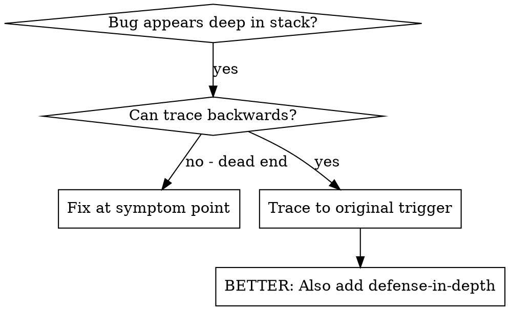

<details>
<summary>相关源文件</summary>

生成本页时使用的主要源文件：

- [skills/systematic-debugging/SKILL.md:1-120](../../../project-repos/superpowers/skills/systematic-debugging/SKILL.md#L1-L120)
- [skills/systematic-debugging/root-cause-tracing.md:1-30](../../../project-repos/superpowers/skills/systematic-debugging/root-cause-tracing.md#L1-L30)
- [skills/verification-before-completion/SKILL.md:1-40](../../../project-repos/superpowers/skills/verification-before-completion/SKILL.md#L1-L40)

</details>

# 验证与调试

Superpowers 的调试方法论基于一个核心原则：**在找到根因之前不能提议修复**。症状修复是失败，不是成功。

## 四阶段调试流程

```mermaid
flowchart TD
    P1["Phase 1: Root Cause Investigation"] --> P2["Phase 2: Pattern Analysis"]
    P2 --> P3["Phase 3: Hypothesis & Testing"]
    P3 --> P4["Phase 4: Implementation"]
    P4 -->|"'3+ 修复失败"|"

    P1 --> A1["仔细阅读错误信息"]
    P1 --> A2["稳定重现问题"]
    P1 --> A3["检查近期变更"]
    P1 --> A4["多组件边界收集证据"]
    P1 --> A5["追踪数据流"]

    P2 --> B1["找类似工作的例子"]
    P2 --> B2["对比参考实现"]
    P2 --> B3["识别差异"]

    P3 --> C1["形成单一假设"]
    P3 --> C2["最小化测试"]
    P3 --> C3["验证后再继续"]

    P4 --> D1["创建失败测试用例"]
    P4 --> D2["实现单一修复"]
    P4 --> D3["验证修复"]

    style P1 fill:#ffcccc
    style P3 fill:#ffcccc
```

**Phase 1（根因调查）是最常被跳过的阶段**，也是导致"修了一个 bug 引入了三个新 bug"的根本原因。

Sources: [skills/systematic-debugging/SKILL.md:20-60](../../../project-repos/superpowers/skills/systematic-debugging/SKILL.md#L20-L60)

<details class="source-snippets">
<summary>引用源码</summary>

<!-- source-snippets:start -->

#### `skills/systematic-debugging/SKILL.md:20-60`

````markdown
```

If you haven't completed Phase 1, you cannot propose fixes.

## When to Use

Use for ANY technical issue:
- Test failures
- Bugs in production
- Unexpected behavior
- Performance problems
- Build failures
- Integration issues

**Use this ESPECIALLY when:**
- Under time pressure (emergencies make guessing tempting)
- "Just one quick fix" seems obvious
- You've already tried multiple fixes
- Previous fix didn't work
- You don't fully understand the issue

**Don't skip when:**
- Issue seems simple (simple bugs have root causes too)
- You're in a hurry (rushing guarantees rework)
- Manager wants it fixed NOW (systematic is faster than thrashing)

## The Four Phases

You MUST complete each phase before proceeding to the next.

### Phase 1: Root Cause Investigation

**BEFORE attempting ANY fix:**

1. **Read Error Messages Carefully**
   - Don't skip past errors or warnings
   - They often contain the exact solution
   - Read stack traces completely
   - Note line numbers, file paths, error codes

2. **Reproduce Consistently**
````

<!-- source-snippets:end -->
</details>

## 多组件边界证据收集

当系统涉及多个组件时（CI → build → signing，API → service → database），Superpowers 要求在提出修复前先收集边界证据：

```bash
# Layer 1: Workflow
echo "=== Secrets available in workflow: ==="
echo "IDENTITY: ${IDENTITY:+SET}${IDENTITY:-UNSET}"

# Layer 2: Build script
echo "=== Env vars in build script: ==="
env | grep IDENTITY || echo "IDENTITY not in environment"

# Layer 3: Signing script
echo "=== Keychain state: ==="
security list-keychains
security find-identity -v
```

这揭示了**数据在哪一层断裂**，而不是盲目猜测哪层有问题。

## 3+ 修复失败 = 架构问题

当同一个问题尝试了 3 次修复都失败时，Systematic Debugging 认为这是架构问题的信号，而不是运气不好：

- 每个修复都在不同地方暴露了新的共享状态/耦合问题
- 修复需要"大规模重构"才能实现
- 每个修复都在其他模块引入了新症状

这种情况下应该停下来，与人类伙伴讨论架构是否从根本上需要重构，而不是继续打补丁。

## Root Cause Tracing（根因追踪）

对于深层调用栈中的 bug，Root Cause Tracing 是一种从症状向源头反向追踪的技术：

1. **坏值在哪里起源？** 追踪到它被创建的地方
2. **谁用坏值调用了这个函数？** 向上追踪
3. **直到找到真正的源头** —— 在源头修复，不在症状处修复

Sources: [skills/systematic-debugging/root-cause-tracing.md:1-30](../../../project-repos/superpowers/skills/systematic-debugging/root-cause-tracing.md#L1-L30)

<details class="source-snippets">
<summary>引用源码</summary>

<!-- source-snippets:start -->

#### `skills/systematic-debugging/root-cause-tracing.md:1-30`

````markdown
# Root Cause Tracing

## Overview

Bugs often manifest deep in the call stack (git init in wrong directory, file created in wrong location, database opened with wrong path). Your instinct is to fix where the error appears, but that's treating a symptom.

**Core principle:** Trace backward through the call chain until you find the original trigger, then fix at the source.

## When to Use



**Use when:**
- Error happens deep in execution (not at entry point)
- Stack trace shows long call chain
- Unclear where invalid data originated
- Need to find which test/code triggers the problem
````

<!-- source-snippets:end -->
</details>

## Verification-Before-Completion

Verification-Before-Completion 是调试完成后的验证技能——确保修复真正有效，而不是"感觉好了"：

```markdown
# Verification Before Completion

## Iron Law
**DO NOT declare victory until you have verified.**

Before marking any task complete, you MUST verify:
- The specific bug no longer occurs
- No new bugs were introduced
- Existing tests still pass
```

这个技能与 TDD 互补：TDD 确保新功能有测试，Verification 确保修复真正有效。

Sources: [skills/verification-before-completion/SKILL.md:1-40](../../../project-repos/superpowers/skills/verification-before-completion/SKILL.md#L1-L40)

<details class="source-snippets">
<summary>引用源码</summary>

<!-- source-snippets:start -->

#### `skills/verification-before-completion/SKILL.md:1-40`

````markdown
---
name: verification-before-completion
description: Use when about to claim work is complete, fixed, or passing, before committing or creating PRs - requires running verification commands and confirming output before making any success claims; evidence before assertions always
---

# Verification Before Completion

## Overview

Claiming work is complete without verification is dishonesty, not efficiency.

**Core principle:** Evidence before claims, always.

**Violating the letter of this rule is violating the spirit of this rule.**

## The Iron Law

```
NO COMPLETION CLAIMS WITHOUT FRESH VERIFICATION EVIDENCE
```

If you haven't run the verification command in this message, you cannot claim it passes.

## The Gate Function

```
BEFORE claiming any status or expressing satisfaction:

1. IDENTIFY: What command proves this claim?
2. RUN: Execute the FULL command (fresh, complete)
3. READ: Full output, check exit code, count failures
4. VERIFY: Does output confirm the claim?
   - If NO: State actual status with evidence
   - If YES: State claim WITH evidence
5. ONLY THEN: Make the claim

Skip any step = lying, not verifying
```

## Common Failures
````

<!-- source-snippets:end -->
</details>

## Red Flags

- "quick fix for now, investigate later"
- "just try changing X and see if it works"
- "add multiple changes, run tests"
- "skip the test, I'll manually verify"
- **"one more fix attempt"（当已经尝试了 2+ 次时）**
- **每个修复都在不同地方暴露了新问题**

## 相关页面

- [TDD](test-driven-development) — TDD 循环如何与调试整合
- [Code Review](code-review) — 评审如何在代码中捕获潜在 bug
