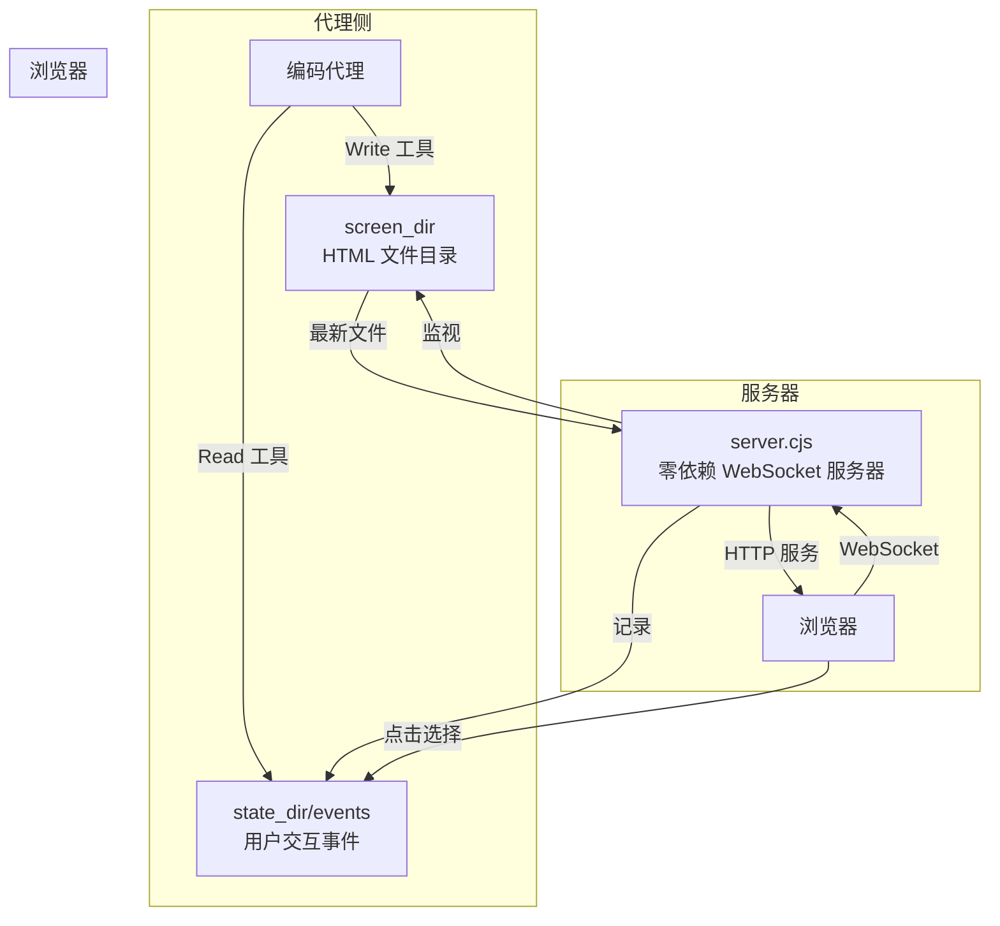
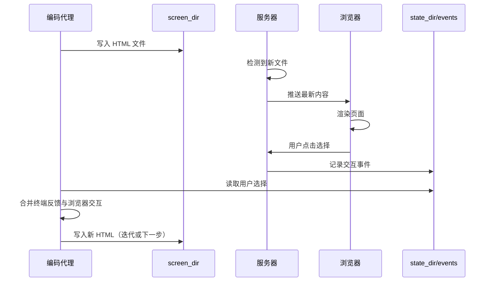

<details>
<summary>相关源文件</summary>

生成本页时使用的主要源文件：

- [skills/brainstorming/SKILL.md](https://github.com/obra/superpowers/blob/main/skills/brainstorming/SKILL.md)
- [skills/brainstorming/visual-companion.md](https://github.com/obra/superpowers/blob/main/skills/brainstorming/visual-companion.md)
- [skills/brainstorming/scripts/server.cjs](https://github.com/obra/superpowers/blob/main/skills/brainstorming/scripts/server.cjs)
- [skills/brainstorming/scripts/helper.js](https://github.com/obra/superpowers/blob/main/skills/brainstorming/scripts/helper.js)
- [skills/brainstorming/scripts/frame-template.html](https://github.com/obra/superpowers/blob/main/skills/brainstorming/scripts/frame-template.html)
- [skills/brainstorming/scripts/start-server.sh](https://github.com/obra/superpowers/blob/main/skills/brainstorming/scripts/start-server.sh)
- [skills/brainstorming/scripts/stop-server.sh](https://github.com/obra/superpowers/blob/main/skills/brainstorming/scripts/stop-server.sh)
- [skills/brainstorming/spec-document-reviewer-prompt.md](https://github.com/obra/superpowers/blob/main/skills/brainstorming/spec-document-reviewer-prompt.md)

</details>

# 可视化头脑风暴伴侣

可视化伴侣是 brainstorming 技能的扩展功能，提供一个基于浏览器的交互界面，用于在头脑风暴过程中展示模型、图表和视觉选项。它是一个零外部依赖的 WebSocket 服务器，代理写入 HTML 文件，浏览器自动展示最新内容，用户点击选择后代理读取交互事件。

## 架构概览



Sources: [skills/brainstorming/visual-companion.md:1-40](../../../project-repos/superpowers/skills/brainstorming/visual-companion.md#L1-L40), [skills/brainstorming/scripts/server.cjs:1-100](../../../project-repos/superpowers/skills/brainstorming/scripts/server.cjs#L1-L100)

<details class="source-snippets">
<summary>引用源码</summary>

<!-- source-snippets:start -->

#### `skills/brainstorming/visual-companion.md:1-40`

````markdown
# Visual Companion Guide

Browser-based visual brainstorming companion for showing mockups, diagrams, and options.

## When to Use

Decide per-question, not per-session. The test: **would the user understand this better by seeing it than reading it?**

**Use the browser** when the content itself is visual:

- **UI mockups** — wireframes, layouts, navigation structures, component designs
- **Architecture diagrams** — system components, data flow, relationship maps
- **Side-by-side visual comparisons** — comparing two layouts, two color schemes, two design directions
- **Design polish** — when the question is about look and feel, spacing, visual hierarchy
- **Spatial relationships** — state machines, flowcharts, entity relationships rendered as diagrams

**Use the terminal** when the content is text or tabular:

- **Requirements and scope questions** — "what does X mean?", "which features are in scope?"
- **Conceptual A/B/C choices** — picking between approaches described in words
- **Tradeoff lists** — pros/cons, comparison tables
- **Technical decisions** — API design, data modeling, architectural approach selection
- **Clarifying questions** — anything where the answer is words, not a visual preference

A question *about* a UI topic is not automatically a visual question. "What kind of wizard do you want?" is conceptual — use the terminal. "Which of these wizard layouts feels right?" is visual — use the browser.

## How It Works

The server watches a directory for HTML files and serves the newest one to the browser. You write HTML content to `screen_dir`, the user sees it in their browser and can click to select options. Selections are recorded to `state_dir/events` that you read on your next turn.

**Content fragments vs full documents:** If your HTML file starts with `<!DOCTYPE` or `<html`, the server serves it as-is (just injects the helper script). Otherwise, the server automatically wraps your content in the frame template — adding the header, CSS theme, selection indicator, and all interactive infrastructure. **Write content fragments by default.** Only write full documents when you need complete control over the page.

## Starting a Session

```bash
# Start server with persistence (mockups saved to project)
scripts/start-server.sh --project-dir /path/to/project

# Returns: {"type":"server-started","port":52341,"url":"http://localhost:52341",
#           "screen_dir":"/path/to/project/.superpowers/brainstorm/12345-1706000000/content",
````

#### `skills/brainstorming/scripts/server.cjs:1-100`

```javascript
const crypto = require('crypto');
const http = require('http');
const fs = require('fs');
const path = require('path');

// ========== WebSocket Protocol (RFC 6455) ==========

const OPCODES = { TEXT: 0x01, CLOSE: 0x08, PING: 0x09, PONG: 0x0A };
const WS_MAGIC = '258EAFA5-E914-47DA-95CA-C5AB0DC85B11';

function computeAcceptKey(clientKey) {
  return crypto.createHash('sha1').update(clientKey + WS_MAGIC).digest('base64');
}

function encodeFrame(opcode, payload) {
  const fin = 0x80;
  const len = payload.length;
  let header;

  if (len < 126) {
    header = Buffer.alloc(2);
    header[0] = fin | opcode;
    header[1] = len;
  } else if (len < 65536) {
    header = Buffer.alloc(4);
    header[0] = fin | opcode;
    header[1] = 126;
    header.writeUInt16BE(len, 2);
  } else {
    header = Buffer.alloc(10);
    header[0] = fin | opcode;
    header[1] = 127;
    header.writeBigUInt64BE(BigInt(len), 2);
  }

  return Buffer.concat([header, payload]);
}

function decodeFrame(buffer) {
  if (buffer.length < 2) return null;

  const secondByte = buffer[1];
  const opcode = buffer[0] & 0x0F;
  const masked = (secondByte & 0x80) !== 0;
  let payloadLen = secondByte & 0x7F;
  let offset = 2;

  if (!masked) throw new Error('Client frames must be masked');

  if (payloadLen === 126) {
    if (buffer.length < 4) return null;
    payloadLen = buffer.readUInt16BE(2);
    offset = 4;
  } else if (payloadLen === 127) {
    if (buffer.length < 10) return null;
    payloadLen = Number(buffer.readBigUInt64BE(2));
    offset = 10;
  }

  const maskOffset = offset;
  const dataOffset = offset + 4;
  const totalLen = dataOffset + payloadLen;
  if (buffer.length < totalLen) return null;

  const mask = buffer.slice(maskOffset, dataOffset);
  const data = Buffer.alloc(payloadLen);
  for (let i = 0; i < payloadLen; i++) {
    data[i] = buffer[dataOffset + i] ^ mask[i % 4];
  }

  return { opcode, payload: data, bytesConsumed: totalLen };
}

// ========== Configuration ==========

const PORT = process.env.BRAINSTORM_PORT || (49152 + Math.floor(Math.random() * 16383));
const HOST = process.env.BRAINSTORM_HOST || '127.0.0.1';
const URL_HOST = process.env.BRAINSTORM_URL_HOST || (HOST === '127.0.0.1' ? 'localhost' : HOST);
const SESSION_DIR = process.env.BRAINSTORM_DIR || '/tmp/brainstorm';
const CONTENT_DIR = path.join(SESSION_DIR, 'content');
const STATE_DIR = path.join(SESSION_DIR, 'state');
let ownerPid = process.env.BRAINSTORM_OWNER_PID ? Number(process.env.BRAINSTORM_OWNER_PID) : null;

const MIME_TYPES = {
  '.html': 'text/html', '.css': 'text/css', '.js': 'application/javascript',
  '.json': 'application/json', '.png': 'image/png', '.jpg': 'image/jpeg',
  '.jpeg': 'image/jpeg', '.gif': 'image/gif', '.svg': 'image/svg+xml'
};

// ========== Templates and Constants ==========

const WAITING_PAGE = <!DOCTYPE html>
&lt;html&gt;
&lt;head&gt;&lt;meta charset="utf-8"&gt;&lt;title&gt;Brainstorm Companion&lt;/title&gt;
&lt;style&gt;body { font-family: system-ui, sans-serif; padding: 2rem; max-width: 800px; margin: 0 auto; }
h1 { color: #333; } p { color: #666; }&lt;/style&gt;
&lt;/head&gt;
&lt;body&gt;&lt;h1>Brainstorm Companion&lt;/h1>
&lt;p>Waiting for the agent to push a screen...&lt;/p>&lt;/body&gt;&lt;/html&gt;;

```

<!-- source-snippets:end -->
</details>

## WebSocket 服务器实现

`server.cjs` 是一个**零外部依赖**的 Node.js 服务器，手动实现了 RFC 6455 WebSocket 协议：

### 核心组件

| 组件 | 功能 |
|------|------|
| `computeAcceptKey()` | WebSocket 握手密钥计算（SHA-1 + magic string） |
| `encodeFrame()` / `decodeFrame()` | WebSocket 帧的编码和解码 |
| HTTP 文件服务器 | 监视 `screen_dir`，自动提供最新 HTML 文件 |
| WebSocket 连接管理 | 处理客户端连接、消息和关闭 |
| 事件记录 | 将用户交互写入 `state_dir/events` |

### 配置

| 环境变量 | 默认值 | 说明 |
|----------|--------|------|
| `BRAINSTORM_PORT` | 随机高端口 (49152-65535) | 服务端口 |
| `BRAINSTORM_HOST` | `127.0.0.1` | 绑定地址 |
| `BRAINSTORM_URL_HOST` | `localhost`（当 HOST 为 127.0.0.1 时） | URL 中显示的主机名 |
| `BRAINSTORM_DIR` | `/tmp/brainstorm` | 会话目录 |
| `BRAINSTORM_OWNER_PID` | — | 所有者进程 PID，用于自动退出 |

Sources: [skills/brainstorming/scripts/server.cjs:25-50](../../../project-repos/superpowers/skills/brainstorming/scripts/server.cjs#L25-L50)

<details class="source-snippets">
<summary>引用源码</summary>

<!-- source-snippets:start -->

#### `skills/brainstorming/scripts/server.cjs:25-50`

```javascript
    header = Buffer.alloc(4);
    header[0] = fin | opcode;
    header[1] = 126;
    header.writeUInt16BE(len, 2);
  } else {
    header = Buffer.alloc(10);
    header[0] = fin | opcode;
    header[1] = 127;
    header.writeBigUInt64BE(BigInt(len), 2);
  }

  return Buffer.concat([header, payload]);
}

function decodeFrame(buffer) {
  if (buffer.length < 2) return null;

  const secondByte = buffer[1];
  const opcode = buffer[0] & 0x0F;
  const masked = (secondByte & 0x80) !== 0;
  let payloadLen = secondByte & 0x7F;
  let offset = 2;

  if (!masked) throw new Error('Client frames must be masked');

  if (payloadLen === 126) {
```

<!-- source-snippets:end -->
</details>

## 交互循环



Sources: [skills/brainstorming/visual-companion.md:60-120](../../../project-repos/superpowers/skills/brainstorming/visual-companion.md#L60-L120)

<details class="source-snippets">
<summary>引用源码</summary>

<!-- source-snippets:start -->

#### `skills/brainstorming/visual-companion.md:60-120`

````markdown
# Windows auto-detects and uses foreground mode, which blocks the tool call.
# Use run_in_background: true on the Bash tool call so the server survives
# across conversation turns.
scripts/start-server.sh --project-dir /path/to/project
```
When calling this via the Bash tool, set `run_in_background: true`. Then read `$STATE_DIR/server-info` on the next turn to get the URL and port.

**Codex:**
```bash
# Codex reaps background processes. The script auto-detects CODEX_CI and
# switches to foreground mode. Run it normally — no extra flags needed.
scripts/start-server.sh --project-dir /path/to/project
```

**Gemini CLI:**
```bash
# Use --foreground and set is_background: true on your shell tool call
# so the process survives across turns
scripts/start-server.sh --project-dir /path/to/project --foreground
```

**Other environments:** The server must keep running in the background across conversation turns. If your environment reaps detached processes, use `--foreground` and launch the command with your platform's background execution mechanism.

If the URL is unreachable from your browser (common in remote/containerized setups), bind a non-loopback host:

```bash
scripts/start-server.sh \
  --project-dir /path/to/project \
  --host 0.0.0.0 \
  --url-host localhost
```

Use `--url-host` to control what hostname is printed in the returned URL JSON.

## The Loop

1. **Check server is alive**, then **write HTML** to a new file in `screen_dir`:
   - Before each write, check that `$STATE_DIR/server-info` exists. If it doesn't (or `$STATE_DIR/server-stopped` exists), the server has shut down — restart it with `start-server.sh` before continuing. The server auto-exits after 30 minutes of inactivity.
   - Use semantic filenames: `platform.html`, `visual-style.html`, `layout.html`
   - **Never reuse filenames** — each screen gets a fresh file
   - Use Write tool — **never use cat/heredoc** (dumps noise into terminal)
   - Server automatically serves the newest file

2. **Tell user what to expect and end your turn:**
   - Remind them of the URL (every step, not just first)
   - Give a brief text summary of what's on screen (e.g., "Showing 3 layout options for the homepage")
   - Ask them to respond in the terminal: "Take a look and let me know what you think. Click to select an option if you'd like."

3. **On your next turn** — after the user responds in the terminal:
   - Read `$STATE_DIR/events` if it exists — this contains the user's browser interactions (clicks, selections) as JSON lines
   - Merge with the user's terminal text to get the full picture
   - The terminal message is the primary feedback; `state_dir/events` provides structured interaction data

4. **Iterate or advance** — if feedback changes current screen, write a new file (e.g., `layout-v2.html`). Only move to the next question when the current step is validated.

5. **Unload when returning to terminal** — when the next step doesn't need the browser (e.g., a clarifying question, a tradeoff discussion), push a waiting screen to clear the stale content:

   ```html
   <!-- filename: waiting.html (or waiting-2.html, etc.) -->
   &lt;div style="display:flex;align-items:center;justify-content:center;min-height:60vh">
     &lt;p class="subtitle">Continuing in terminal...&lt;/p>
````

<!-- source-snippets:end -->
</details>

## 内容模板系统

服务器提供两种模式：

### 内容片段模式（默认）

如果 HTML 文件不以 `<!DOCTYPE` 或 `<html` 开头，服务器自动用 frame template 包装——添加页头、CSS 主题、选择指示器和所有交互基础设施。

### 完整文档模式

如果 HTML 文件以 `<!DOCTYPE` 或 `<html` 开头，服务器原样提供（仅注入 helper 脚本）。

### 可用 CSS 类

| 类名 | 用途 |
|------|------|
| `.options` > `.option` | A/B/C 选择项，支持 `data-choice` 和 `onclick="toggleSelect(this)"` |
| `.options[data-multiselect]` | 多选模式 |
| `.cards` > `.card` | 视觉设计卡片 |
| `.card-image` | 卡片中的模型内容 |
| `.subtitle` | 副标题文本 |

Sources: [skills/brainstorming/visual-companion.md:120-200](../../../project-repos/superpowers/skills/brainstorming/visual-companion.md#L120-L200)

<details class="source-snippets">
<summary>引用源码</summary>

<!-- source-snippets:start -->

#### `skills/brainstorming/visual-companion.md:120-200`

````markdown
     &lt;p class="subtitle">Continuing in terminal...&lt;/p>
   &lt;/div>
   ```

   This prevents the user from staring at a resolved choice while the conversation has moved on. When the next visual question comes up, push a new content file as usual.

6. Repeat until done.

## Writing Content Fragments

Write just the content that goes inside the page. The server wraps it in the frame template automatically (header, theme CSS, selection indicator, and all interactive infrastructure).

**Minimal example:**

```html
&lt;h2>Which layout works better?&lt;/h2>
&lt;p class="subtitle">Consider readability and visual hierarchy&lt;/p>

&lt;div class="options">
  &lt;div class="option" data-choice="a" onclick="toggleSelect(this)">
    &lt;div class="letter">A&lt;/div>
    &lt;div class="content">
      &lt;h3>Single Column&lt;/h3>
      &lt;p>Clean, focused reading experience&lt;/p>
    &lt;/div>
  &lt;/div>
  &lt;div class="option" data-choice="b" onclick="toggleSelect(this)">
    &lt;div class="letter">B&lt;/div>
    &lt;div class="content">
      &lt;h3>Two Column&lt;/h3>
      &lt;p>Sidebar navigation with main content&lt;/p>
    &lt;/div>
  &lt;/div>
&lt;/div>
```

That's it. No `<html>`, no CSS, no `<script>` tags needed. The server provides all of that.

## CSS Classes Available

The frame template provides these CSS classes for your content:

### Options (A/B/C choices)

```html
&lt;div class="options">
  &lt;div class="option" data-choice="a" onclick="toggleSelect(this)">
    &lt;div class="letter">A&lt;/div>
    &lt;div class="content">
      &lt;h3>Title&lt;/h3>
      &lt;p>Description&lt;/p>
    &lt;/div>
  &lt;/div>
&lt;/div>
```

**Multi-select:** Add `data-multiselect` to the container to let users select multiple options. Each click toggles the item. The indicator bar shows the count.

```html
&lt;div class="options" data-multiselect>
  <!-- same option markup — users can select/deselect multiple -->
&lt;/div>
```

### Cards (visual designs)

```html
&lt;div class="cards">
  &lt;div class="card" data-choice="design1" onclick="toggleSelect(this)">
    &lt;div class="card-image"><!-- mockup content -->&lt;/div>
    &lt;div class="card-body">
      &lt;h3>Name&lt;/h3>
      &lt;p>Description&lt;/p>
    &lt;/div>
  &lt;/div>
&lt;/div>
```

### Mockup container

```html
````

<!-- source-snippets:end -->
</details>

## 何时使用浏览器 vs 终端

**逐问题决定，而非逐会话决定**。判断标准：用户通过看比通过读更能理解吗？

| 使用浏览器 | 使用终端 |
|-----------|---------|
| UI 模型、线框图 | 需求和范围问题 |
| 架构图 | 概念性 A/B/C 选择 |
| 并排视觉比较 | 权衡列表 |
| 设计打磨（间距、视觉层次） | 技术决策 |
| 空间关系（状态机、流程图） | 澄清问题 |

关于 UI 的问题不自动是视觉问题。"你想要什么样的向导？"是概念性的——用终端。"哪种向导布局更好？"是视觉性的——用浏览器。

Sources: [skills/brainstorming/visual-companion.md:1-40](../../../project-repos/superpowers/skills/brainstorming/visual-companion.md#L1-L40)

<details class="source-snippets">
<summary>引用源码</summary>

<!-- source-snippets:start -->

#### `skills/brainstorming/visual-companion.md:1-40`

````markdown
# Visual Companion Guide

Browser-based visual brainstorming companion for showing mockups, diagrams, and options.

## When to Use

Decide per-question, not per-session. The test: **would the user understand this better by seeing it than reading it?**

**Use the browser** when the content itself is visual:

- **UI mockups** — wireframes, layouts, navigation structures, component designs
- **Architecture diagrams** — system components, data flow, relationship maps
- **Side-by-side visual comparisons** — comparing two layouts, two color schemes, two design directions
- **Design polish** — when the question is about look and feel, spacing, visual hierarchy
- **Spatial relationships** — state machines, flowcharts, entity relationships rendered as diagrams

**Use the terminal** when the content is text or tabular:

- **Requirements and scope questions** — "what does X mean?", "which features are in scope?"
- **Conceptual A/B/C choices** — picking between approaches described in words
- **Tradeoff lists** — pros/cons, comparison tables
- **Technical decisions** — API design, data modeling, architectural approach selection
- **Clarifying questions** — anything where the answer is words, not a visual preference

A question *about* a UI topic is not automatically a visual question. "What kind of wizard do you want?" is conceptual — use the terminal. "Which of these wizard layouts feels right?" is visual — use the browser.

## How It Works

The server watches a directory for HTML files and serves the newest one to the browser. You write HTML content to `screen_dir`, the user sees it in their browser and can click to select options. Selections are recorded to `state_dir/events` that you read on your next turn.

**Content fragments vs full documents:** If your HTML file starts with `<!DOCTYPE` or `<html`, the server serves it as-is (just injects the helper script). Otherwise, the server automatically wraps your content in the frame template — adding the header, CSS theme, selection indicator, and all interactive infrastructure. **Write content fragments by default.** Only write full documents when you need complete control over the page.

## Starting a Session

```bash
# Start server with persistence (mockups saved to project)
scripts/start-server.sh --project-dir /path/to/project

# Returns: {"type":"server-started","port":52341,"url":"http://localhost:52341",
#           "screen_dir":"/path/to/project/.superpowers/brainstorm/12345-1706000000/content",
````

<!-- source-snippets:end -->
</details>

## 跨平台启动方式

| 平台 | 启动命令 | 注意事项 |
|------|----------|----------|
| Claude Code (macOS/Linux) | `scripts/start-server.sh --project-dir /path` | 默认后台模式 |
| Claude Code (Windows) | `scripts/start-server.sh --project-dir /path` | Bash 工具需设 `run_in_background: true` |
| Codex | `scripts/start-server.sh --project-dir /path` | 自动检测 CODEX_CI，前台模式 |
| Gemini CLI | `scripts/start-server.sh --project-dir /path --foreground` | 需 `is_background: true` |
| 远程/容器 | `--host 0.0.0.0 --url-host localhost` | 绑定非回环地址 |

服务器在 30 分钟不活动后自动退出。如果 `$STATE_DIR/server-info` 不存在或 `$STATE_DIR/server-stopped` 存在，说明服务器已关闭，需要重启。

Sources: [skills/brainstorming/visual-companion.md:40-100](../../../project-repos/superpowers/skills/brainstorming/visual-companion.md#L40-L100)

<details class="source-snippets">
<summary>引用源码</summary>

<!-- source-snippets:start -->

#### `skills/brainstorming/visual-companion.md:40-100`

````markdown
#           "screen_dir":"/path/to/project/.superpowers/brainstorm/12345-1706000000/content",
#           "state_dir":"/path/to/project/.superpowers/brainstorm/12345-1706000000/state"}
```

Save `screen_dir` and `state_dir` from the response. Tell user to open the URL.

**Finding connection info:** The server writes its startup JSON to `$STATE_DIR/server-info`. If you launched the server in the background and didn't capture stdout, read that file to get the URL and port. When using `--project-dir`, check `<project>/.superpowers/brainstorm/` for the session directory.

**Note:** Pass the project root as `--project-dir` so mockups persist in `.superpowers/brainstorm/` and survive server restarts. Without it, files go to `/tmp` and get cleaned up. Remind the user to add `.superpowers/` to `.gitignore` if it's not already there.

**Launching the server by platform:**

**Claude Code (macOS / Linux):**
```bash
# Default mode works — the script backgrounds the server itself
scripts/start-server.sh --project-dir /path/to/project
```

**Claude Code (Windows):**
```bash
# Windows auto-detects and uses foreground mode, which blocks the tool call.
# Use run_in_background: true on the Bash tool call so the server survives
# across conversation turns.
scripts/start-server.sh --project-dir /path/to/project
```
When calling this via the Bash tool, set `run_in_background: true`. Then read `$STATE_DIR/server-info` on the next turn to get the URL and port.

**Codex:**
```bash
# Codex reaps background processes. The script auto-detects CODEX_CI and
# switches to foreground mode. Run it normally — no extra flags needed.
scripts/start-server.sh --project-dir /path/to/project
```

**Gemini CLI:**
```bash
# Use --foreground and set is_background: true on your shell tool call
# so the process survives across turns
scripts/start-server.sh --project-dir /path/to/project --foreground
```

**Other environments:** The server must keep running in the background across conversation turns. If your environment reaps detached processes, use `--foreground` and launch the command with your platform's background execution mechanism.

If the URL is unreachable from your browser (common in remote/containerized setups), bind a non-loopback host:

```bash
scripts/start-server.sh \
  --project-dir /path/to/project \
  --host 0.0.0.0 \
  --url-host localhost
```

Use `--url-host` to control what hostname is printed in the returned URL JSON.

## The Loop

1. **Check server is alive**, then **write HTML** to a new file in `screen_dir`:
   - Before each write, check that `$STATE_DIR/server-info` exists. If it doesn't (or `$STATE_DIR/server-stopped` exists), the server has shut down — restart it with `start-server.sh` before continuing. The server auto-exits after 30 minutes of inactivity.
   - Use semantic filenames: `platform.html`, `visual-style.html`, `layout.html`
   - **Never reuse filenames** — each screen gets a fresh file
   - Use Write tool — **never use cat/heredoc** (dumps noise into terminal)
````

<!-- source-snippets:end -->
</details>

## 规格文档审查

brainstorming 技能还包含一个 `spec-document-reviewer-prompt.md`，用于在头脑风暴完成后对生成的规格文档进行审查，确保文档质量符合标准。

Sources: [skills/brainstorming/spec-document-reviewer-prompt.md](../../../project-repos/superpowers/skills/brainstorming/spec-document-reviewer-prompt.md)

<details class="source-snippets">
<summary>引用源码</summary>

<!-- source-snippets:start -->

#### `skills/brainstorming/spec-document-reviewer-prompt.md`

````markdown
# Spec Document Reviewer Prompt Template

Use this template when dispatching a spec document reviewer subagent.

**Purpose:** Verify the spec is complete, consistent, and ready for implementation planning.

**Dispatch after:** Spec document is written to docs/superpowers/specs/

```
Task tool (general-purpose):
  description: "Review spec document"
  prompt: |
    You are a spec document reviewer. Verify this spec is complete and ready for planning.

    **Spec to review:** [SPEC_FILE_PATH]

    ## What to Check

    | Category | What to Look For |
    |----------|------------------|
    | Completeness | TODOs, placeholders, "TBD", incomplete sections |
    | Consistency | Internal contradictions, conflicting requirements |
    | Clarity | Requirements ambiguous enough to cause someone to build the wrong thing |
    | Scope | Focused enough for a single plan — not covering multiple independent subsystems |
    | YAGNI | Unrequested features, over-engineering |

    ## Calibration

    **Only flag issues that would cause real problems during implementation planning.**
    A missing section, a contradiction, or a requirement so ambiguous it could be
    interpreted two different ways — those are issues. Minor wording improvements,
    stylistic preferences, and "sections less detailed than others" are not.

    Approve unless there are serious gaps that would lead to a flawed plan.

    ## Output Format

    ## Spec Review

    **Status:** Approved | Issues Found

    **Issues (if any):**
    - [Section X]: [specific issue] - [why it matters for planning]

    **Recommendations (advisory, do not block approval):**
    - [suggestions for improvement]
```

**Reviewer returns:** Status, Issues (if any), Recommendations
````

<!-- source-snippets:end -->
</details>

## 相关页面

- [核心工作流](core-workflow.md)
- [系统架构](system-architecture.md)
