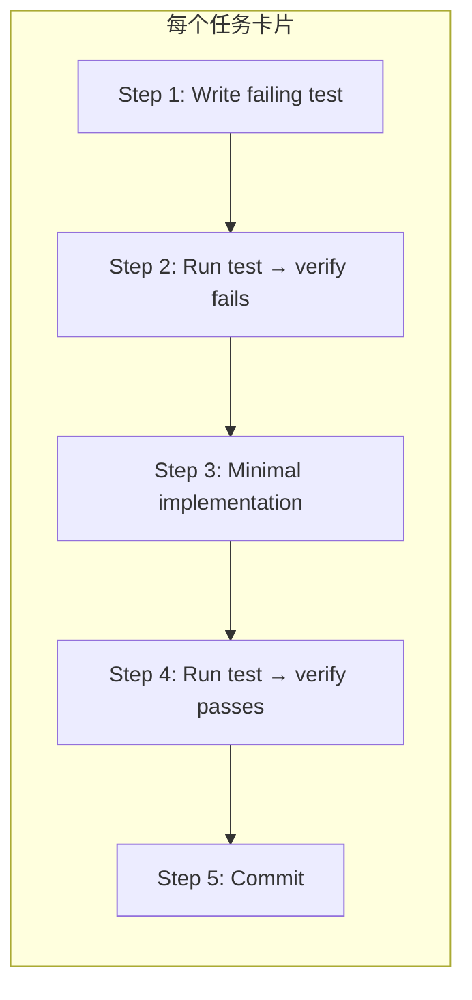

<details>
<summary>相关源文件</summary>

生成本页时使用的主要源文件：

- [skills/writing-plans/SKILL.md:1-120](../../../project-repos/superpowers/skills/writing-plans/SKILL.md#L1-L120)

</details>

# Writing Plans 计划编写

Writing Plans 将设计文档拆解为原子化的任务卡片，每个任务控制在 2-5 分钟完成，包含完整的代码和验证步骤，使一个"缺乏上下文、品味可疑"的初级工程师也能准确执行。

**为什么这样设计？** Superpowers 的核心假设是：执行计划的人（智能体子任务）没有对话历史的上下文，不了解项目规范，也不具备经验判断。Writing Plans 通过提供完整、精确、自包含的指令来弥补这一假设。

## 计划文档结构

每个计划以固定 Header 开头：

```markdown
# [Feature Name] Implementation Plan

> **For agentic workers:** REQUIRED SUB-SKILL: Use superpowers:subagent-driven-development
> (recommended) or superpowers:executing-plans to implement this plan task-by-task.

**Goal:** [One sentence describing what this builds]

**Architecture:** [2-3 sentences about approach]

**Tech Stack:** [Key technologies/libraries]
---
```

Header 中的 `REQUIRED SUB-SKILL` 声明是强制性的——它确保计划的执行者也理解应该使用哪个执行工作流。

## 任务卡片结构



**每个 Step 必须包含**：
- 具体要写入的代码（或精确的命令）
- 预期输出
- 验证方式

不允许出现"TODO"、"类似 Task N"、"添加适当的错误处理"这类占位符。

Sources: [skills/writing-plans/SKILL.md:50-80](../../../project-repos/superpowers/skills/writing-plans/SKILL.md#L50-L80)

<details class="source-snippets">
<summary>引用源码</summary>

<!-- source-snippets:start -->

#### `skills/writing-plans/SKILL.md:50-80`

`````markdown
# [Feature Name] Implementation Plan

> **For agentic workers:** REQUIRED SUB-SKILL: Use superpowers:subagent-driven-development (recommended) or superpowers:executing-plans to implement this plan task-by-task. Steps use checkbox (`- [ ]`) syntax for tracking.

**Goal:** [One sentence describing what this builds]

**Architecture:** [2-3 sentences about approach]

**Tech Stack:** [Key technologies/libraries]

---
```

## Task Structure

````markdown
### Task N: [Component Name]

**Files:**
- Create: `exact/path/to/file.py`
- Modify: `exact/path/to/existing.py:123-145`
- Test: `tests/exact/path/to/test.py`

- [ ] **Step 1: Write the failing test**

```python
def test_specific_behavior():
    result = function(input)
    assert result == expected
```

`````

<!-- source-snippets:end -->
</details>

## 自包含原则（No Placeholders）

DRY（Don't Repeat Yourself）在 Writing Plans 中的含义是：**每个任务必须完整自包含，不引用其他任务的上下文**。这与标准 DRY 不同——通常 DRY 意味着消除重复，但 Writing Plans 的优先级是确保每个任务能独立执行，而不是减少文档重复。

原因：智能体可能不按顺序读取任务。如果 Task 7 说"同上"，但读者先读 Task 7，就会缺失关键上下文。

## 范围检查（Scope Check）

如果 Spec 覆盖多个独立子系统，Writing Plans 会建议将其分解为多个子计划。这是 Brainstorming 阶段应完成的工作——但如果 Brainstorming 没有做充分的范围检查，Writing Plans 提供了最后一道防线。

## 执行选项

计划完成后，智能体提供两个执行选项：

1. **Subagent-Driven（推荐）**：每个任务分派一个子智能体，任务间有两阶段评审
2. **Inline Execution**：在同一会话中批量执行任务，有检查点

两种方式都强制使用 TDD，只是并行度不同。

## 相关页面

- [Brainstorming](brainstorming) — 设计的起源
- [Subagent-Driven Development](subagent-driven-development) — 推荐的执行方式
- [TDD](test-driven-development) — 任务卡片中强制执行的 TDD 流程
