# Symphony DeepWiki — 完整导出

> 生成日期：2026-05-08
> 源码仓库：https://github.com/openai/symphony
> Commit：58cf97da06d556c019ccea20c67f4f77da124bf3

---

<details class="page-metadata">
<summary>页面信息</summary>
- 所属章节：项目概览
- 页面 ID：overview
</details>

# Symphony：自主编码 Agent 的工作编排引擎

你的 Linear 看板上堆了 200 个待办 issue，每一个都是明确的实现任务——修复一个 bug、加一个字段、写一组测试。你逐条点开、在本地拉分支、编码、跑 CI、提 PR。这个循环本身就是体力活。**Symphony 要自动化的正是这个循环。**

它不是又一个 AI Agent 框架。它是一个**工作调度层**——轮询 Linear 上的候选 issue，分配给 Codex agent，为每个任务创建隔离工作区，管理多轮执行、重试与退避，最终产出 PR。全程无人值守，团队只需要审查产出物。

Sources: [SPEC.md:1-50](../../../project-repos/symphony/SPEC.md#L1-L50), [README.md](../../../project-repos/symphony/README.md)

<details class="source-snippets">
<summary>引用源码</summary>

<!-- source-snippets:start -->

#### `SPEC.md:1-50`

```markdown
# Symphony Service Specification

Status: Draft v1 (language-agnostic)

Purpose: Define a service that orchestrates coding agents to get project work done.

## Normative Language

The key words `MUST`, `MUST NOT`, `REQUIRED`, `SHOULD`, `SHOULD NOT`, `RECOMMENDED`, `MAY`, and
`OPTIONAL` in this document are to be interpreted as described in RFC 2119.

`Implementation-defined` means the behavior is part of the implementation contract, but this
specification does not prescribe one universal policy. Implementations MUST document the selected
behavior.

## 1. Problem Statement

Symphony is a long-running automation service that continuously reads work from an issue tracker
(Linear in this specification version), creates an isolated workspace for each issue, and runs a
coding agent session for that issue inside the workspace.

The service solves four operational problems:

- It turns issue execution into a repeatable daemon workflow instead of manual scripts.
- It isolates agent execution in per-issue workspaces so agent commands run only inside per-issue
  workspace directories.
- It keeps the workflow policy in-repo (`WORKFLOW.md`) so teams version the agent prompt and runtime
  settings with their code.
- It provides enough observability to operate and debug multiple concurrent agent runs.

Implementations are expected to document their trust and safety posture explicitly. This
specification does not require a single approval, sandbox, or operator-confirmation policy; some
implementations target trusted environments with a high-trust configuration, while others require
stricter approvals or sandboxing.

Important boundary:

- Symphony is a scheduler/runner and tracker reader.
- Ticket writes (state transitions, comments, PR links) are typically performed by the coding agent
  using tools available in the workflow/runtime environment.
- A successful run can end at a workflow-defined handoff state (for example `Human Review`), not
  necessarily `Done`.

## 2. Goals and Non-Goals

### 2.1 Goals

- Poll the issue tracker on a fixed cadence and dispatch work with bounded concurrency.
- Maintain a single authoritative orchestrator state for dispatch, retries, and reconciliation.
- Create deterministic per-issue workspaces and preserve them across runs.
```

#### `README.md`

```markdown
# Symphony

Symphony turns project work into isolated, autonomous implementation runs, allowing teams to manage
work instead of supervising coding agents.

[](.github/media/symphony-demo.mp4)

_In this [demo video](.github/media/symphony-demo.mp4), Symphony monitors a Linear board for work and spawns agents to handle the tasks. The agents complete the tasks and provide proof of work: CI status, PR review feedback, complexity analysis, and walkthrough videos. When accepted, the agents land the PR safely. Engineers do not need to supervise Codex; they can manage the work at a higher level._

> [!WARNING]
> Symphony is a low-key engineering preview for testing in trusted environments.

## Running Symphony

### Requirements

Symphony works best in codebases that have adopted
[harness engineering](https://openai.com/index/harness-engineering/). Symphony is the next step --
moving from managing coding agents to managing work that needs to get done.

### Option 1. Make your own

Tell your favorite coding agent to build Symphony in a programming language of your choice:

> Implement Symphony according to the following spec:
> https://github.com/openai/symphony/blob/main/SPEC.md

### Option 2. Use our experimental reference implementation

Check out [elixir/README.md](elixir/README.md) for instructions on how to set up your environment
and run the Elixir-based Symphony implementation. You can also ask your favorite coding agent to
help with the setup:

> Set up Symphony for my repository based on
> https://github.com/openai/symphony/blob/main/elixir/README.md

---

## License

This project is licensed under the [Apache License 2.0](LICENSE).
```

<!-- source-snippets:end -->
</details>

---

## 项目定位与核心问题

Symphony 解决的不是"如何让 AI 写代码"，而是"**如何让 AI 批量、可靠地完成项目管理系统里的工作**"。

**人工循环的瓶颈**在于：每个 issue 需要人介入 5 次以上——挑选任务、理解上下文、配置环境、执行、提交。当 AI 编码能力已经足够完成单个任务时，瓶颈转移到了调度和编排。Symphony 填补的正是这个空缺。

**设计哲学**是「低调的工程预览」（engineering preview），面向受信任的开发环境。它不追求通用 Agent 编排，而是紧扣一个场景：**Linear issue 到 GitHub PR 的端到端自动化**。

Sources: [README.md](../../../project-repos/symphony/README.md), [SPEC.md:1-80](../../../project-repos/symphony/SPEC.md#L1-L80)

<details class="source-snippets">
<summary>引用源码</summary>

<!-- source-snippets:start -->

#### `README.md`

```markdown
# Symphony

Symphony turns project work into isolated, autonomous implementation runs, allowing teams to manage
work instead of supervising coding agents.

[](.github/media/symphony-demo.mp4)

_In this [demo video](.github/media/symphony-demo.mp4), Symphony monitors a Linear board for work and spawns agents to handle the tasks. The agents complete the tasks and provide proof of work: CI status, PR review feedback, complexity analysis, and walkthrough videos. When accepted, the agents land the PR safely. Engineers do not need to supervise Codex; they can manage the work at a higher level._

> [!WARNING]
> Symphony is a low-key engineering preview for testing in trusted environments.

## Running Symphony

### Requirements

Symphony works best in codebases that have adopted
[harness engineering](https://openai.com/index/harness-engineering/). Symphony is the next step --
moving from managing coding agents to managing work that needs to get done.

### Option 1. Make your own

Tell your favorite coding agent to build Symphony in a programming language of your choice:

> Implement Symphony according to the following spec:
> https://github.com/openai/symphony/blob/main/SPEC.md

### Option 2. Use our experimental reference implementation

Check out [elixir/README.md](elixir/README.md) for instructions on how to set up your environment
and run the Elixir-based Symphony implementation. You can also ask your favorite coding agent to
help with the setup:

> Set up Symphony for my repository based on
> https://github.com/openai/symphony/blob/main/elixir/README.md

---

## License

This project is licensed under the [Apache License 2.0](LICENSE).
```

#### `SPEC.md:1-80`

```markdown
# Symphony Service Specification

Status: Draft v1 (language-agnostic)

Purpose: Define a service that orchestrates coding agents to get project work done.

## Normative Language

The key words `MUST`, `MUST NOT`, `REQUIRED`, `SHOULD`, `SHOULD NOT`, `RECOMMENDED`, `MAY`, and
`OPTIONAL` in this document are to be interpreted as described in RFC 2119.

`Implementation-defined` means the behavior is part of the implementation contract, but this
specification does not prescribe one universal policy. Implementations MUST document the selected
behavior.

## 1. Problem Statement

Symphony is a long-running automation service that continuously reads work from an issue tracker
(Linear in this specification version), creates an isolated workspace for each issue, and runs a
coding agent session for that issue inside the workspace.

The service solves four operational problems:

- It turns issue execution into a repeatable daemon workflow instead of manual scripts.
- It isolates agent execution in per-issue workspaces so agent commands run only inside per-issue
  workspace directories.
- It keeps the workflow policy in-repo (`WORKFLOW.md`) so teams version the agent prompt and runtime
  settings with their code.
- It provides enough observability to operate and debug multiple concurrent agent runs.

Implementations are expected to document their trust and safety posture explicitly. This
specification does not require a single approval, sandbox, or operator-confirmation policy; some
implementations target trusted environments with a high-trust configuration, while others require
stricter approvals or sandboxing.

Important boundary:

- Symphony is a scheduler/runner and tracker reader.
- Ticket writes (state transitions, comments, PR links) are typically performed by the coding agent
  using tools available in the workflow/runtime environment.
- A successful run can end at a workflow-defined handoff state (for example `Human Review`), not
  necessarily `Done`.

## 2. Goals and Non-Goals

### 2.1 Goals

- Poll the issue tracker on a fixed cadence and dispatch work with bounded concurrency.
- Maintain a single authoritative orchestrator state for dispatch, retries, and reconciliation.
- Create deterministic per-issue workspaces and preserve them across runs.
- Stop active runs when issue state changes make them ineligible.
- Recover from transient failures with exponential backoff.
- Load runtime behavior from a repository-owned `WORKFLOW.md` contract.
- Expose operator-visible observability (at minimum structured logs).
- Support tracker/filesystem-driven restart recovery without requiring a persistent database; exact
  in-memory scheduler state is not restored.

### 2.2 Non-Goals

- Rich web UI or multi-tenant control plane.
- Prescribing a specific dashboard or terminal UI implementation.
- General-purpose workflow engine or distributed job scheduler.
- Built-in business logic for how to edit tickets, PRs, or comments. (That logic lives in the
  workflow prompt and agent tooling.)
- Mandating strong sandbox controls beyond what the coding agent and host OS provide.
- Mandating a single default approval, sandbox, or operator-confirmation posture for all
  implementations.

## 3. System Overview

### 3.1 Main Components

1. `Workflow Loader`
   - Reads `WORKFLOW.md`.
   - Parses YAML front matter and prompt body.
   - Returns `{config, prompt_template}`.

2. `Config Layer`
   - Exposes typed getters for workflow config values.
   - Applies defaults and environment variable indirection.
```

<!-- source-snippets:end -->
</details>

---

## 系统架构总览

下图展示 Symphony 的核心组件关系。Orchestrator 是中枢 GenServer，独占所有运行时状态和调度决策权。其余组件各司其职，通过函数调用和消息传递协作。

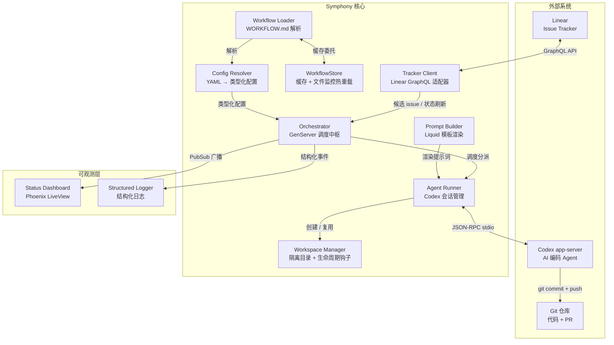

**Orchestrator 是唯一的状态拥有者。** 所有 issue 认领、调度、重试决策都在这一个 GenServer 里序列化完成，彻底避免了分布式状态带来的竞态和重复分派问题。

Sources: [elixir/lib/symphony_elixir/orchestrator.ex](../../../project-repos/symphony/elixir/lib/symphony_elixir/orchestrator.ex), [SPEC.md:Orchestrator 章节](../../../project-repos/symphony/SPEC.md:Orchestrator%20%E7%AB%A0%E8%8A%82)

<details class="source-snippets">
<summary>引用源码</summary>

<!-- source-snippets:start -->

#### `elixir/lib/symphony_elixir/orchestrator.ex`

```
defmodule SymphonyElixir.Orchestrator do
  @moduledoc """
  Polls Linear and dispatches repository copies to Codex-backed workers.
  """

  use GenServer
  require Logger
  import Bitwise, only: [<<<: 2]

  alias SymphonyElixir.{AgentRunner, Config, StatusDashboard, Tracker, Workspace}
  alias SymphonyElixir.Linear.Issue

  @continuation_retry_delay_ms 1_000
  @failure_retry_base_ms 10_000
  # Slightly above the dashboard render interval so "checking now…" can render.
  @poll_transition_render_delay_ms 20
  @empty_codex_totals %{
    input_tokens: 0,
    output_tokens: 0,
    total_tokens: 0,
    seconds_running: 0
  }

  defmodule State do
    @moduledoc """
    Runtime state for the orchestrator polling loop.
    """

    defstruct [
      :poll_interval_ms,
      :max_concurrent_agents,
      :next_poll_due_at_ms,
      :poll_check_in_progress,
      :tick_timer_ref,
      :tick_token,
      running: %{},
      completed: MapSet.new(),
      claimed: MapSet.new(),
      retry_attempts: %{},
      codex_totals: nil,
      codex_rate_limits: nil
    ]
  end

  @spec start_link(keyword()) :: GenServer.on_start()
  def start_link(opts \\ []) do
    name = Keyword.get(opts, :name, __MODULE__)
    GenServer.start_link(__MODULE__, opts, name: name)
  end

  @impl true
  def init(_opts) do
    now_ms = System.monotonic_time(:millisecond)
    config = Config.settings!()

    state = %State{
      poll_interval_ms: config.polling.interval_ms,
      max_concurrent_agents: config.agent.max_concurrent_agents,
      next_poll_due_at_ms: now_ms,
      poll_check_in_progress: false,
      tick_timer_ref: nil,
      tick_token: nil,
      codex_totals: @empty_codex_totals,
      codex_rate_limits: nil
    }

    run_terminal_workspace_cleanup()
    state = schedule_tick(state, 0)

    {:ok, state}
  end

  @impl true
  def handle_info({:tick, tick_token}, %{tick_token: tick_token} = state)
      when is_reference(tick_token) do
    state = refresh_runtime_config(state)

    state = %{
      state
      | poll_check_in_progress: true,
        next_poll_due_at_ms: nil,
        tick_timer_ref: nil,
        tick_token: nil
    }

    notify_dashboard()
    :ok = schedule_poll_cycle_start()
    {:noreply, state}
  end

  def handle_info({:tick, _tick_token}, state), do: {:noreply, state}

  def handle_info(:tick, state) do
    state = refresh_runtime_config(state)

    state = %{
      state
      | poll_check_in_progress: true,
        next_poll_due_at_ms: nil,
        tick_timer_ref: nil,
        tick_token: nil
    }

    notify_dashboard()
    :ok = schedule_poll_cycle_start()
    {:noreply, state}
  end

  def handle_info(:run_poll_cycle, state) do
    state = refresh_runtime_config(state)
    state = maybe_dispatch(state)
    state = schedule_tick(state, state.poll_interval_ms)
    state = %{state | poll_check_in_progress: false}

    notify_dashboard()
    {:noreply, state}
  end

  def handle_info(
        {:DOWN, ref, :process, _pid, reason},
```

#### `SPEC.md:Orchestrator 章节`

> 未找到引用文件：`SPEC.md:Orchestrator 章节`

<!-- source-snippets:end -->
</details>

---

## 端到端数据流

从一个 Linear issue 被创建到最终产出 PR，数据在 Symphony 中经历以下阶段。

```mermaid
flowchart LR
    subgraph S1["1. 轮询发现"]
        A1["定时 Tick 触发"] --> A2["Tracker Client<br/>GraphQL 拉取候选 issue"]
        A2 --> A3["按优先级 + 创建时间排序"]
    end

    subgraph S2["2. 调度分派"]
        A3 --> B1["检查并发槽位<br/>全局 + per-state"]
        B1 --> B2["认领 issue<br/>写入 claimed set"]
        B2 --> B3["Task.Supervisor<br/>启动 Worker"]
    end

    subgraph S3["3. Agent 执行"]
        B3 --> C1["Workspace Manager<br/>创建 / 复用隔离目录"]
        C1 --> C2["执行 after_create<br/>+ before_run 钩子"]
        C2 --> C3["Prompt Builder<br/>Liquid 渲染初始提示词"]
        C3 --> C4["启动 Codex app-server<br/>JSON-RPC over stdio"]
        C4 --> C5["多轮 Turn 循环<br/>最多 max_turns 轮"]
    end

    subgraph S4["4. 结果处理"]
        C5 --> D1{"Turn 结果?"}
        D1 -->|"成功 + issue 仍 active"| C5
        D1 -->|"成功 + issue terminal"| D2["标记完成<br/>执行 after_run 钩子"]
        D1 -->|"失败"| D3["指数退避重试<br/>min 10s * 2^n, max 5min"]
        D1 -->|"Stall 超时"| D3
    end

    subgraph S5["5. 产出交付"]
        D2 --> E1["Codex 已提交代码<br/>+ 推送分支"]
        E1 --> E2["PR 就绪<br/>等待人工 Review"]
    end

    S1 --> S2 --> S3 --> S4 --> S5
```

**关键路径**：Poll Tick --> GraphQL Fetch --> 并发槽位检查 --> Worker 启动 --> 工作区初始化 --> Codex 多轮执行 --> PR 产出。中间任何环节失败，Orchestrator 都会兜底——要么重试，要么跳过本轮等下次 tick。

Sources: [elixir/lib/symphony_elixir/orchestrator.ex](../../../project-repos/symphony/elixir/lib/symphony_elixir/orchestrator.ex), [elixir/lib/symphony_elixir/agent_runner.ex](../../../project-repos/symphony/elixir/lib/symphony_elixir/agent_runner.ex), [SPEC.md:Polling & Scheduling 章节](../../../project-repos/symphony/SPEC.md:Polling%20%26%20Scheduling%20%E7%AB%A0%E8%8A%82)

<details class="source-snippets">
<summary>引用源码</summary>

<!-- source-snippets:start -->

#### `elixir/lib/symphony_elixir/orchestrator.ex`

```
defmodule SymphonyElixir.Orchestrator do
  @moduledoc """
  Polls Linear and dispatches repository copies to Codex-backed workers.
  """

  use GenServer
  require Logger
  import Bitwise, only: [<<<: 2]

  alias SymphonyElixir.{AgentRunner, Config, StatusDashboard, Tracker, Workspace}
  alias SymphonyElixir.Linear.Issue

  @continuation_retry_delay_ms 1_000
  @failure_retry_base_ms 10_000
  # Slightly above the dashboard render interval so "checking now…" can render.
  @poll_transition_render_delay_ms 20
  @empty_codex_totals %{
    input_tokens: 0,
    output_tokens: 0,
    total_tokens: 0,
    seconds_running: 0
  }

  defmodule State do
    @moduledoc """
    Runtime state for the orchestrator polling loop.
    """

    defstruct [
      :poll_interval_ms,
      :max_concurrent_agents,
      :next_poll_due_at_ms,
      :poll_check_in_progress,
      :tick_timer_ref,
      :tick_token,
      running: %{},
      completed: MapSet.new(),
      claimed: MapSet.new(),
      retry_attempts: %{},
      codex_totals: nil,
      codex_rate_limits: nil
    ]
  end

  @spec start_link(keyword()) :: GenServer.on_start()
  def start_link(opts \\ []) do
    name = Keyword.get(opts, :name, __MODULE__)
    GenServer.start_link(__MODULE__, opts, name: name)
  end

  @impl true
  def init(_opts) do
    now_ms = System.monotonic_time(:millisecond)
    config = Config.settings!()

    state = %State{
      poll_interval_ms: config.polling.interval_ms,
      max_concurrent_agents: config.agent.max_concurrent_agents,
      next_poll_due_at_ms: now_ms,
      poll_check_in_progress: false,
      tick_timer_ref: nil,
      tick_token: nil,
      codex_totals: @empty_codex_totals,
      codex_rate_limits: nil
    }

    run_terminal_workspace_cleanup()
    state = schedule_tick(state, 0)

    {:ok, state}
  end

  @impl true
  def handle_info({:tick, tick_token}, %{tick_token: tick_token} = state)
      when is_reference(tick_token) do
    state = refresh_runtime_config(state)

    state = %{
      state
      | poll_check_in_progress: true,
        next_poll_due_at_ms: nil,
        tick_timer_ref: nil,
        tick_token: nil
    }

    notify_dashboard()
    :ok = schedule_poll_cycle_start()
    {:noreply, state}
  end

  def handle_info({:tick, _tick_token}, state), do: {:noreply, state}

  def handle_info(:tick, state) do
    state = refresh_runtime_config(state)

    state = %{
      state
      | poll_check_in_progress: true,
        next_poll_due_at_ms: nil,
        tick_timer_ref: nil,
        tick_token: nil
    }

    notify_dashboard()
    :ok = schedule_poll_cycle_start()
    {:noreply, state}
  end

  def handle_info(:run_poll_cycle, state) do
    state = refresh_runtime_config(state)
    state = maybe_dispatch(state)
    state = schedule_tick(state, state.poll_interval_ms)
    state = %{state | poll_check_in_progress: false}

    notify_dashboard()
    {:noreply, state}
  end

  def handle_info(
        {:DOWN, ref, :process, _pid, reason},
```

#### `elixir/lib/symphony_elixir/agent_runner.ex`

```
defmodule SymphonyElixir.AgentRunner do
  @moduledoc """
  Executes a single Linear issue in its workspace with Codex.
  """

  require Logger
  alias SymphonyElixir.Codex.AppServer
  alias SymphonyElixir.{Config, Linear.Issue, PromptBuilder, Tracker, Workspace}

  @type worker_host :: String.t() | nil

  @spec run(map(), pid() | nil, keyword()) :: :ok | no_return()
  def run(issue, codex_update_recipient \\ nil, opts \\ []) do
    # The orchestrator owns host retries so one worker lifetime never hops machines.
    worker_host = selected_worker_host(Keyword.get(opts, :worker_host), Config.settings!().worker.ssh_hosts)

    Logger.info("Starting agent run for #{issue_context(issue)} worker_host=#{worker_host_for_log(worker_host)}")

    case run_on_worker_host(issue, codex_update_recipient, opts, worker_host) do
      :ok ->
        :ok

      {:error, reason} ->
        Logger.error("Agent run failed for #{issue_context(issue)}: #{inspect(reason)}")
        raise RuntimeError, "Agent run failed for #{issue_context(issue)}: #{inspect(reason)}"
    end
  end

  defp run_on_worker_host(issue, codex_update_recipient, opts, worker_host) do
    Logger.info("Starting worker attempt for #{issue_context(issue)} worker_host=#{worker_host_for_log(worker_host)}")

    case Workspace.create_for_issue(issue, worker_host) do
      {:ok, workspace} ->
        send_worker_runtime_info(codex_update_recipient, issue, worker_host, workspace)

        try do
          with :ok <- Workspace.run_before_run_hook(workspace, issue, worker_host) do
            run_codex_turns(workspace, issue, codex_update_recipient, opts, worker_host)
          end
        after
          Workspace.run_after_run_hook(workspace, issue, worker_host)
        end

      {:error, reason} ->
        {:error, reason}
    end
  end

  defp codex_message_handler(recipient, issue) do
    fn message ->
      send_codex_update(recipient, issue, message)
    end
  end

  defp send_codex_update(recipient, %Issue{id: issue_id}, message)
       when is_binary(issue_id) and is_pid(recipient) do
    send(recipient, {:codex_worker_update, issue_id, message})
    :ok
  end

  defp send_codex_update(_recipient, _issue, _message), do: :ok

  defp send_worker_runtime_info(recipient, %Issue{id: issue_id}, worker_host, workspace)
       when is_binary(issue_id) and is_pid(recipient) and is_binary(workspace) do
    send(
      recipient,
      {:worker_runtime_info, issue_id,
       %{
         worker_host: worker_host,
         workspace_path: workspace
       }}
    )

    :ok
  end

  defp send_worker_runtime_info(_recipient, _issue, _worker_host, _workspace), do: :ok

  defp run_codex_turns(workspace, issue, codex_update_recipient, opts, worker_host) do
    max_turns = Keyword.get(opts, :max_turns, Config.settings!().agent.max_turns)
    issue_state_fetcher = Keyword.get(opts, :issue_state_fetcher, &Tracker.fetch_issue_states_by_ids/1)

    with {:ok, session} <- AppServer.start_session(workspace, worker_host: worker_host) do
      try do
        do_run_codex_turns(session, workspace, issue, codex_update_recipient, opts, issue_state_fetcher, 1, max_turns)
      after
        AppServer.stop_session(session)
      end
    end
  end

  defp do_run_codex_turns(app_session, workspace, issue, codex_update_recipient, opts, issue_state_fetcher, turn_number, max_turns) do
    prompt = build_turn_prompt(issue, opts, turn_number, max_turns)

    with {:ok, turn_session} <-
           AppServer.run_turn(
             app_session,
             prompt,
             issue,
             on_message: codex_message_handler(codex_update_recipient, issue)
           ) do
      Logger.info("Completed agent run for #{issue_context(issue)} session_id=#{turn_session[:session_id]} workspace=#{workspace} turn=#{turn_number}/#{max_turns}")

      case continue_with_issue?(issue, issue_state_fetcher) do
        {:continue, refreshed_issue} when turn_number < max_turns ->
          Logger.info("Continuing agent run for #{issue_context(refreshed_issue)} after normal turn completion turn=#{turn_number}/#{max_turns}")

          do_run_codex_turns(
            app_session,
            workspace,
            refreshed_issue,
            codex_update_recipient,
            opts,
            issue_state_fetcher,
            turn_number + 1,
            max_turns
          )

        {:continue, refreshed_issue} ->
          Logger.info("Reached agent.max_turns for #{issue_context(refreshed_issue)} with issue still active; returning control to orchestrator")
```

#### `SPEC.md:Polling & Scheduling 章节`

> 未找到引用文件：`SPEC.md:Polling & Scheduling 章节`

<!-- source-snippets:end -->
</details>

---

## 七大核心组件

### Orchestrator -- 调度中枢

**单一权威 GenServer**，拥有全部运行时状态：running tasks map、claimed set、retry queue、token 统计。调度循环在定时 tick 中执行：reconcile --> preflight 校验 --> fetch 候选 --> sort --> dispatch。所有状态变更在同一个进程里序列化，零竞态。

Sources: [elixir/lib/symphony_elixir/orchestrator.ex](../../../project-repos/symphony/elixir/lib/symphony_elixir/orchestrator.ex), [SPEC.md:Orchestrator 章节](../../../project-repos/symphony/SPEC.md:Orchestrator%20%E7%AB%A0%E8%8A%82)

<details class="source-snippets">
<summary>引用源码</summary>

<!-- source-snippets:start -->

#### `elixir/lib/symphony_elixir/orchestrator.ex`

```
defmodule SymphonyElixir.Orchestrator do
  @moduledoc """
  Polls Linear and dispatches repository copies to Codex-backed workers.
  """

  use GenServer
  require Logger
  import Bitwise, only: [<<<: 2]

  alias SymphonyElixir.{AgentRunner, Config, StatusDashboard, Tracker, Workspace}
  alias SymphonyElixir.Linear.Issue

  @continuation_retry_delay_ms 1_000
  @failure_retry_base_ms 10_000
  # Slightly above the dashboard render interval so "checking now…" can render.
  @poll_transition_render_delay_ms 20
  @empty_codex_totals %{
    input_tokens: 0,
    output_tokens: 0,
    total_tokens: 0,
    seconds_running: 0
  }

  defmodule State do
    @moduledoc """
    Runtime state for the orchestrator polling loop.
    """

    defstruct [
      :poll_interval_ms,
      :max_concurrent_agents,
      :next_poll_due_at_ms,
      :poll_check_in_progress,
      :tick_timer_ref,
      :tick_token,
      running: %{},
      completed: MapSet.new(),
      claimed: MapSet.new(),
      retry_attempts: %{},
      codex_totals: nil,
      codex_rate_limits: nil
    ]
  end

  @spec start_link(keyword()) :: GenServer.on_start()
  def start_link(opts \\ []) do
    name = Keyword.get(opts, :name, __MODULE__)
    GenServer.start_link(__MODULE__, opts, name: name)
  end

  @impl true
  def init(_opts) do
    now_ms = System.monotonic_time(:millisecond)
    config = Config.settings!()

    state = %State{
      poll_interval_ms: config.polling.interval_ms,
      max_concurrent_agents: config.agent.max_concurrent_agents,
      next_poll_due_at_ms: now_ms,
      poll_check_in_progress: false,
      tick_timer_ref: nil,
      tick_token: nil,
      codex_totals: @empty_codex_totals,
      codex_rate_limits: nil
    }

    run_terminal_workspace_cleanup()
    state = schedule_tick(state, 0)

    {:ok, state}
  end

  @impl true
  def handle_info({:tick, tick_token}, %{tick_token: tick_token} = state)
      when is_reference(tick_token) do
    state = refresh_runtime_config(state)

    state = %{
      state
      | poll_check_in_progress: true,
        next_poll_due_at_ms: nil,
        tick_timer_ref: nil,
        tick_token: nil
    }

    notify_dashboard()
    :ok = schedule_poll_cycle_start()
    {:noreply, state}
  end

  def handle_info({:tick, _tick_token}, state), do: {:noreply, state}

  def handle_info(:tick, state) do
    state = refresh_runtime_config(state)

    state = %{
      state
      | poll_check_in_progress: true,
        next_poll_due_at_ms: nil,
        tick_timer_ref: nil,
        tick_token: nil
    }

    notify_dashboard()
    :ok = schedule_poll_cycle_start()
    {:noreply, state}
  end

  def handle_info(:run_poll_cycle, state) do
    state = refresh_runtime_config(state)
    state = maybe_dispatch(state)
    state = schedule_tick(state, state.poll_interval_ms)
    state = %{state | poll_check_in_progress: false}

    notify_dashboard()
    {:noreply, state}
  end

  def handle_info(
        {:DOWN, ref, :process, _pid, reason},
```

#### `SPEC.md:Orchestrator 章节`

> 未找到引用文件：`SPEC.md:Orchestrator 章节`

<!-- source-snippets:end -->
</details>

### Tracker Client -- Linear 适配器

通过 **GraphQL API** 与 Linear 通信。核心操作三个：`fetch_candidate_issues()`（拉取 active 状态的候选）、`fetch_issues_by_states()`（启动时清理 terminal issue）、`fetch_issue_states_by_ids()`（运行中的 reconciliation 刷新）。适配器模式支持切换到内存实现用于测试。

Sources: [elixir/lib/symphony_elixir/tracker.ex](../../../project-repos/symphony/elixir/lib/symphony_elixir/tracker.ex), [SPEC.md:Issue Tracker Client 章节](../../../project-repos/symphony/SPEC.md:Issue%20Tracker%20Client%20%E7%AB%A0%E8%8A%82)

<details class="source-snippets">
<summary>引用源码</summary>

<!-- source-snippets:start -->

#### `elixir/lib/symphony_elixir/tracker.ex`

```
defmodule SymphonyElixir.Tracker do
  @moduledoc """
  Adapter boundary for issue tracker reads and writes.
  """

  alias SymphonyElixir.Config

  @callback fetch_candidate_issues() :: {:ok, [term()]} | {:error, term()}
  @callback fetch_issues_by_states([String.t()]) :: {:ok, [term()]} | {:error, term()}
  @callback fetch_issue_states_by_ids([String.t()]) :: {:ok, [term()]} | {:error, term()}
  @callback create_comment(String.t(), String.t()) :: :ok | {:error, term()}
  @callback update_issue_state(String.t(), String.t()) :: :ok | {:error, term()}

  @spec fetch_candidate_issues() :: {:ok, [term()]} | {:error, term()}
  def fetch_candidate_issues do
    adapter().fetch_candidate_issues()
  end

  @spec fetch_issues_by_states([String.t()]) :: {:ok, [term()]} | {:error, term()}
  def fetch_issues_by_states(states) do
    adapter().fetch_issues_by_states(states)
  end

  @spec fetch_issue_states_by_ids([String.t()]) :: {:ok, [term()]} | {:error, term()}
  def fetch_issue_states_by_ids(issue_ids) do
    adapter().fetch_issue_states_by_ids(issue_ids)
  end

  @spec create_comment(String.t(), String.t()) :: :ok | {:error, term()}
  def create_comment(issue_id, body) do
    adapter().create_comment(issue_id, body)
  end

  @spec update_issue_state(String.t(), String.t()) :: :ok | {:error, term()}
  def update_issue_state(issue_id, state_name) do
    adapter().update_issue_state(issue_id, state_name)
  end

  @spec adapter() :: module()
  def adapter do
    case Config.settings!().tracker.kind do
      "memory" -> SymphonyElixir.Tracker.Memory
      _ -> SymphonyElixir.Linear.Adapter
    end
  end
end
```

#### `SPEC.md:Issue Tracker Client 章节`

> 未找到引用文件：`SPEC.md:Issue Tracker Client 章节`

<!-- source-snippets:end -->
</details>

### Agent Runner -- Codex 会话管理

负责**完整的 agent 生命周期**：创建工作区、构建提示词、启动 Codex app-server 子进程、执行多轮 turn 循环、处理结果。首轮使用 Prompt Builder 渲染的完整提示词；后续轮次使用精简的 continuation guidance（"从当前工作区状态继续，不要从头开始"）。

Sources: [elixir/lib/symphony_elixir/agent_runner.ex](../../../project-repos/symphony/elixir/lib/symphony_elixir/agent_runner.ex), [SPEC.md:Agent Runner 章节](../../../project-repos/symphony/SPEC.md:Agent%20Runner%20%E7%AB%A0%E8%8A%82)

<details class="source-snippets">
<summary>引用源码</summary>

<!-- source-snippets:start -->

#### `elixir/lib/symphony_elixir/agent_runner.ex`

```
defmodule SymphonyElixir.AgentRunner do
  @moduledoc """
  Executes a single Linear issue in its workspace with Codex.
  """

  require Logger
  alias SymphonyElixir.Codex.AppServer
  alias SymphonyElixir.{Config, Linear.Issue, PromptBuilder, Tracker, Workspace}

  @type worker_host :: String.t() | nil

  @spec run(map(), pid() | nil, keyword()) :: :ok | no_return()
  def run(issue, codex_update_recipient \\ nil, opts \\ []) do
    # The orchestrator owns host retries so one worker lifetime never hops machines.
    worker_host = selected_worker_host(Keyword.get(opts, :worker_host), Config.settings!().worker.ssh_hosts)

    Logger.info("Starting agent run for #{issue_context(issue)} worker_host=#{worker_host_for_log(worker_host)}")

    case run_on_worker_host(issue, codex_update_recipient, opts, worker_host) do
      :ok ->
        :ok

      {:error, reason} ->
        Logger.error("Agent run failed for #{issue_context(issue)}: #{inspect(reason)}")
        raise RuntimeError, "Agent run failed for #{issue_context(issue)}: #{inspect(reason)}"
    end
  end

  defp run_on_worker_host(issue, codex_update_recipient, opts, worker_host) do
    Logger.info("Starting worker attempt for #{issue_context(issue)} worker_host=#{worker_host_for_log(worker_host)}")

    case Workspace.create_for_issue(issue, worker_host) do
      {:ok, workspace} ->
        send_worker_runtime_info(codex_update_recipient, issue, worker_host, workspace)

        try do
          with :ok <- Workspace.run_before_run_hook(workspace, issue, worker_host) do
            run_codex_turns(workspace, issue, codex_update_recipient, opts, worker_host)
          end
        after
          Workspace.run_after_run_hook(workspace, issue, worker_host)
        end

      {:error, reason} ->
        {:error, reason}
    end
  end

  defp codex_message_handler(recipient, issue) do
    fn message ->
      send_codex_update(recipient, issue, message)
    end
  end

  defp send_codex_update(recipient, %Issue{id: issue_id}, message)
       when is_binary(issue_id) and is_pid(recipient) do
    send(recipient, {:codex_worker_update, issue_id, message})
    :ok
  end

  defp send_codex_update(_recipient, _issue, _message), do: :ok

  defp send_worker_runtime_info(recipient, %Issue{id: issue_id}, worker_host, workspace)
       when is_binary(issue_id) and is_pid(recipient) and is_binary(workspace) do
    send(
      recipient,
      {:worker_runtime_info, issue_id,
       %{
         worker_host: worker_host,
         workspace_path: workspace
       }}
    )

    :ok
  end

  defp send_worker_runtime_info(_recipient, _issue, _worker_host, _workspace), do: :ok

  defp run_codex_turns(workspace, issue, codex_update_recipient, opts, worker_host) do
    max_turns = Keyword.get(opts, :max_turns, Config.settings!().agent.max_turns)
    issue_state_fetcher = Keyword.get(opts, :issue_state_fetcher, &Tracker.fetch_issue_states_by_ids/1)

    with {:ok, session} <- AppServer.start_session(workspace, worker_host: worker_host) do
      try do
        do_run_codex_turns(session, workspace, issue, codex_update_recipient, opts, issue_state_fetcher, 1, max_turns)
      after
        AppServer.stop_session(session)
      end
    end
  end

  defp do_run_codex_turns(app_session, workspace, issue, codex_update_recipient, opts, issue_state_fetcher, turn_number, max_turns) do
    prompt = build_turn_prompt(issue, opts, turn_number, max_turns)

    with {:ok, turn_session} <-
           AppServer.run_turn(
             app_session,
             prompt,
             issue,
             on_message: codex_message_handler(codex_update_recipient, issue)
           ) do
      Logger.info("Completed agent run for #{issue_context(issue)} session_id=#{turn_session[:session_id]} workspace=#{workspace} turn=#{turn_number}/#{max_turns}")

      case continue_with_issue?(issue, issue_state_fetcher) do
        {:continue, refreshed_issue} when turn_number < max_turns ->
          Logger.info("Continuing agent run for #{issue_context(refreshed_issue)} after normal turn completion turn=#{turn_number}/#{max_turns}")

          do_run_codex_turns(
            app_session,
            workspace,
            refreshed_issue,
            codex_update_recipient,
            opts,
            issue_state_fetcher,
            turn_number + 1,
            max_turns
          )

        {:continue, refreshed_issue} ->
          Logger.info("Reached agent.max_turns for #{issue_context(refreshed_issue)} with issue still active; returning control to orchestrator")
```

#### `SPEC.md:Agent Runner 章节`

> 未找到引用文件：`SPEC.md:Agent Runner 章节`

<!-- source-snippets:end -->
</details>

### Workspace Manager -- 隔离工作区

每个 issue 映射到一个**独立目录** `<root>/<sanitized_identifier>`。identifier 经过 `safe_identifier/1` 清洗（非 `[A-Za-z0-9._-]` 字符替换为下划线）。路径 containment 校验防止目录逃逸。支持本地和 SSH 远程两种模式。工作区跨 run 复用，不在成功后自动删除。

Sources: [elixir/lib/symphony_elixir/workspace.ex](../../../project-repos/symphony/elixir/lib/symphony_elixir/workspace.ex), [SPEC.md:Workspace Manager 章节](../../../project-repos/symphony/SPEC.md:Workspace%20Manager%20%E7%AB%A0%E8%8A%82)

<details class="source-snippets">
<summary>引用源码</summary>

<!-- source-snippets:start -->

#### `elixir/lib/symphony_elixir/workspace.ex`

```
defmodule SymphonyElixir.Workspace do
  @moduledoc """
  Creates isolated per-issue workspaces for parallel Codex agents.
  """

  require Logger
  alias SymphonyElixir.{Config, PathSafety, SSH}

  @remote_workspace_marker "__SYMPHONY_WORKSPACE__"

  @type worker_host :: String.t() | nil

  @spec create_for_issue(map() | String.t() | nil, worker_host()) ::
          {:ok, Path.t()} | {:error, term()}
  def create_for_issue(issue_or_identifier, worker_host \\ nil) do
    issue_context = issue_context(issue_or_identifier)

    try do
      safe_id = safe_identifier(issue_context.issue_identifier)

      with {:ok, workspace} <- workspace_path_for_issue(safe_id, worker_host),
           :ok <- validate_workspace_path(workspace, worker_host),
           {:ok, workspace, created?} <- ensure_workspace(workspace, worker_host),
           :ok <- maybe_run_after_create_hook(workspace, issue_context, created?, worker_host) do
        {:ok, workspace}
      end
    rescue
      error in [ArgumentError, ErlangError, File.Error] ->
        Logger.error("Workspace creation failed #{issue_log_context(issue_context)} worker_host=#{worker_host_for_log(worker_host)} error=#{Exception.message(error)}")
        {:error, error}
    end
  end

  defp ensure_workspace(workspace, nil) do
    cond do
      File.dir?(workspace) ->
        {:ok, workspace, false}

      File.exists?(workspace) ->
        File.rm_rf!(workspace)
        create_workspace(workspace)

      true ->
        create_workspace(workspace)
    end
  end

  defp ensure_workspace(workspace, worker_host) when is_binary(worker_host) do
    script =
      [
        "set -eu",
        remote_shell_assign("workspace", workspace),
        "if [ -d \"$workspace\" ]; then",
        "  created=0",
        "elif [ -e \"$workspace\" ]; then",
        "  rm -rf \"$workspace\"",
        "  mkdir -p \"$workspace\"",
        "  created=1",
        "else",
        "  mkdir -p \"$workspace\"",
        "  created=1",
        "fi",
        "cd \"$workspace\"",
        "printf '%s\\t%s\\t%s\\n' '#{@remote_workspace_marker}' \"$created\" \"$(pwd -P)\""
      ]
      |> Enum.reject(&(&1 == ""))
      |> Enum.join("\n")

    case run_remote_command(worker_host, script, Config.settings!().hooks.timeout_ms) do
      {:ok, {output, 0}} ->
        parse_remote_workspace_output(output)

      {:ok, {output, status}} ->
        {:error, {:workspace_prepare_failed, worker_host, status, output}}

      {:error, reason} ->
        {:error, reason}
    end
  end

  defp create_workspace(workspace) do
    File.rm_rf!(workspace)
    File.mkdir_p!(workspace)
    {:ok, workspace, true}
  end

  @spec remove(Path.t()) :: {:ok, [String.t()]} | {:error, term(), String.t()}
  def remove(workspace), do: remove(workspace, nil)

  @spec remove(Path.t(), worker_host()) :: {:ok, [String.t()]} | {:error, term(), String.t()}
  def remove(workspace, nil) do
    case File.exists?(workspace) do
      true ->
        case validate_workspace_path(workspace, nil) do
          :ok ->
            maybe_run_before_remove_hook(workspace, nil)
            File.rm_rf(workspace)

          {:error, reason} ->
            {:error, reason, ""}
        end

      false ->
        File.rm_rf(workspace)
    end
  end

  def remove(workspace, worker_host) when is_binary(worker_host) do
    maybe_run_before_remove_hook(workspace, worker_host)

    script =
      [
        remote_shell_assign("workspace", workspace),
        "rm -rf \"$workspace\""
      ]
      |> Enum.join("\n")

    case run_remote_command(worker_host, script, Config.settings!().hooks.timeout_ms) do
      {:ok, {_output, 0}} ->
        {:ok, []}
```

#### `SPEC.md:Workspace Manager 章节`

> 未找到引用文件：`SPEC.md:Workspace Manager 章节`

<!-- source-snippets:end -->
</details>

### Workflow Loader + WorkflowStore -- 配置热重载

解析 `WORKFLOW.md`：YAML front matter（`---` 分隔）变成配置 map，Markdown body 变成 prompt template。**WorkflowStore 是 GenServer 缓存层**，1 秒轮询文件指纹（mtime + size + content hash），指纹变化时触发热重载。重载失败保留 last-known-good 配置，不会中断服务。

Sources: [elixir/lib/symphony_elixir/workflow.ex](../../../project-repos/symphony/elixir/lib/symphony_elixir/workflow.ex), [elixir/lib/symphony_elixir/workflow_store.ex](../../../project-repos/symphony/elixir/lib/symphony_elixir/workflow_store.ex), [SPEC.md:Workflow Loader 章节](../../../project-repos/symphony/SPEC.md:Workflow%20Loader%20%E7%AB%A0%E8%8A%82)

<details class="source-snippets">
<summary>引用源码</summary>

<!-- source-snippets:start -->

#### `elixir/lib/symphony_elixir/workflow.ex`

```
defmodule SymphonyElixir.Workflow do
  @moduledoc """
  Loads workflow configuration and prompt from WORKFLOW.md.
  """

  alias SymphonyElixir.WorkflowStore

  @workflow_file_name "WORKFLOW.md"

  @spec workflow_file_path() :: Path.t()
  def workflow_file_path do
    Application.get_env(:symphony_elixir, :workflow_file_path) ||
      Path.join(File.cwd!(), @workflow_file_name)
  end

  @spec set_workflow_file_path(Path.t()) :: :ok
  def set_workflow_file_path(path) when is_binary(path) do
    Application.put_env(:symphony_elixir, :workflow_file_path, path)
    maybe_reload_store()
    :ok
  end

  @spec clear_workflow_file_path() :: :ok
  def clear_workflow_file_path do
    Application.delete_env(:symphony_elixir, :workflow_file_path)
    maybe_reload_store()
    :ok
  end

  @type loaded_workflow :: %{
          config: map(),
          prompt: String.t(),
          prompt_template: String.t()
        }

  @spec current() :: {:ok, loaded_workflow()} | {:error, term()}
  def current do
    case Process.whereis(WorkflowStore) do
      pid when is_pid(pid) ->
        WorkflowStore.current()

      _ ->
        load()
    end
  end

  @spec load() :: {:ok, loaded_workflow()} | {:error, term()}
  def load do
    load(workflow_file_path())
  end

  @spec load(Path.t()) :: {:ok, loaded_workflow()} | {:error, term()}
  def load(path) when is_binary(path) do
    case File.read(path) do
      {:ok, content} ->
        parse(content)

      {:error, reason} ->
        {:error, {:missing_workflow_file, path, reason}}
    end
  end

  defp parse(content) do
    {front_matter_lines, prompt_lines} = split_front_matter(content)

    case front_matter_yaml_to_map(front_matter_lines) do
      {:ok, front_matter} ->
        prompt = Enum.join(prompt_lines, "\n") |> String.trim()

        {:ok,
         %{
           config: front_matter,
           prompt: prompt,
           prompt_template: prompt
         }}

      {:error, :workflow_front_matter_not_a_map} ->
        {:error, :workflow_front_matter_not_a_map}

      {:error, reason} ->
        {:error, {:workflow_parse_error, reason}}
    end
  end

  defp split_front_matter(content) do
    lines = String.split(content, ~r/\R/, trim: false)

    case lines do
      ["---" | tail] ->
        {front, rest} = Enum.split_while(tail, &(&1 != "---"))

        case rest do
          ["---" | prompt_lines] -> {front, prompt_lines}
          _ -> {front, []}
        end

      _ ->
        {[], lines}
    end
  end

  defp front_matter_yaml_to_map(lines) do
    yaml = Enum.join(lines, "\n")

    if String.trim(yaml) == "" do
      {:ok, %{}}
    else
      case YamlElixir.read_from_string(yaml) do
        {:ok, decoded} when is_map(decoded) -> {:ok, decoded}
        {:ok, _} -> {:error, :workflow_front_matter_not_a_map}
        {:error, reason} -> {:error, reason}
      end
    end
  end

  defp maybe_reload_store do
    if Process.whereis(WorkflowStore) do
      _ = WorkflowStore.force_reload()
    end

```

#### `elixir/lib/symphony_elixir/workflow_store.ex`

```
defmodule SymphonyElixir.WorkflowStore do
  @moduledoc """
  Caches the last known good workflow and reloads it when `WORKFLOW.md` changes.
  """

  use GenServer
  require Logger

  alias SymphonyElixir.Workflow

  @poll_interval_ms 1_000

  defmodule State do
    @moduledoc false

    defstruct [:path, :stamp, :workflow]
  end

  @spec start_link(keyword()) :: GenServer.on_start()
  def start_link(opts \\ []) do
    GenServer.start_link(__MODULE__, opts, name: __MODULE__)
  end

  @spec current() :: {:ok, Workflow.loaded_workflow()} | {:error, term()}
  def current do
    case Process.whereis(__MODULE__) do
      pid when is_pid(pid) ->
        GenServer.call(__MODULE__, :current)

      _ ->
        Workflow.load()
    end
  end

  @spec force_reload() :: :ok | {:error, term()}
  def force_reload do
    case Process.whereis(__MODULE__) do
      pid when is_pid(pid) ->
        GenServer.call(__MODULE__, :force_reload)

      _ ->
        case Workflow.load() do
          {:ok, _workflow} -> :ok
          {:error, reason} -> {:error, reason}
        end
    end
  end

  @impl true
  def init(_opts) do
    case load_state(Workflow.workflow_file_path()) do
      {:ok, state} ->
        schedule_poll()
        {:ok, state}

      {:error, reason} ->
        {:stop, reason}
    end
  end

  @impl true
  def handle_call(:current, _from, %State{} = state) do
    case reload_state(state) do
      {:ok, new_state} ->
        {:reply, {:ok, new_state.workflow}, new_state}

      {:error, _reason, new_state} ->
        {:reply, {:ok, new_state.workflow}, new_state}
    end
  end

  def handle_call(:force_reload, _from, %State{} = state) do
    case reload_state(state) do
      {:ok, new_state} ->
        {:reply, :ok, new_state}

      {:error, reason, new_state} ->
        {:reply, {:error, reason}, new_state}
    end
  end

  @impl true
  def handle_info(:poll, %State{} = state) do
    schedule_poll()

    case reload_state(state) do
      {:ok, new_state} -> {:noreply, new_state}
      {:error, _reason, new_state} -> {:noreply, new_state}
    end
  end

  defp schedule_poll do
    Process.send_after(self(), :poll, @poll_interval_ms)
  end

  defp reload_state(%State{} = state) do
    path = Workflow.workflow_file_path()

    if path != state.path do
      reload_path(path, state)
    else
      reload_current_path(path, state)
    end
  end

  defp reload_path(path, state) do
    case load_state(path) do
      {:ok, new_state} ->
        {:ok, new_state}

      {:error, reason} ->
        log_reload_error(path, reason)
        {:error, reason, state}
    end
  end

  defp reload_current_path(path, state) do
    case current_stamp(path) do
      {:ok, stamp} when stamp == state.stamp ->
        {:ok, state}
```

#### `SPEC.md:Workflow Loader 章节`

> 未找到引用文件：`SPEC.md:Workflow Loader 章节`

<!-- source-snippets:end -->
</details>

### Config Resolver -- 类型化配置

将 YAML front matter 解析为**带类型校验的配置结构**。支持 `$VAR_NAME` 环境变量间接引用。语义校验确保 tracker kind 是 `linear` 或 `memory`、Linear 模式下 API key 和 project slug 必须存在、`codex.command` 非空。

Sources: [elixir/lib/symphony_elixir/config.ex](../../../project-repos/symphony/elixir/lib/symphony_elixir/config.ex), [SPEC.md:Config Resolver 章节](../../../project-repos/symphony/SPEC.md:Config%20Resolver%20%E7%AB%A0%E8%8A%82)

<details class="source-snippets">
<summary>引用源码</summary>

<!-- source-snippets:start -->

#### `elixir/lib/symphony_elixir/config.ex`

```
defmodule SymphonyElixir.Config do
  @moduledoc """
  Runtime configuration loaded from `WORKFLOW.md`.
  """

  alias SymphonyElixir.Config.Schema
  alias SymphonyElixir.Workflow

  @default_prompt_template """
  You are working on a Linear issue.

  Identifier: {{ issue.identifier }}
  Title: {{ issue.title }}

  Body:
  
  {{ issue.description }}
  
  No description provided.
  
  """

  @type codex_runtime_settings :: %{
          approval_policy: String.t() | map(),
          thread_sandbox: String.t(),
          turn_sandbox_policy: map()
        }

  @spec settings() :: {:ok, Schema.t()} | {:error, term()}
  def settings do
    case Workflow.current() do
      {:ok, %{config: config}} when is_map(config) ->
        Schema.parse(config)

      {:error, reason} ->
        {:error, reason}
    end
  end

  @spec settings!() :: Schema.t()
  def settings! do
    case settings() do
      {:ok, settings} ->
        settings

      {:error, reason} ->
        raise ArgumentError, message: format_config_error(reason)
    end
  end

  @spec max_concurrent_agents_for_state(term()) :: pos_integer()
  def max_concurrent_agents_for_state(state_name) when is_binary(state_name) do
    config = settings!()

    Map.get(
      config.agent.max_concurrent_agents_by_state,
      Schema.normalize_issue_state(state_name),
      config.agent.max_concurrent_agents
    )
  end

  def max_concurrent_agents_for_state(_state_name), do: settings!().agent.max_concurrent_agents

  @spec codex_turn_sandbox_policy(Path.t() | nil) :: map()
  def codex_turn_sandbox_policy(workspace \\ nil) do
    case Schema.resolve_runtime_turn_sandbox_policy(settings!(), workspace) do
      {:ok, policy} ->
        policy

      {:error, reason} ->
        raise ArgumentError, message: "Invalid codex turn sandbox policy: #{inspect(reason)}"
    end
  end

  @spec workflow_prompt() :: String.t()
  def workflow_prompt do
    case Workflow.current() do
      {:ok, %{prompt_template: prompt}} ->
        if String.trim(prompt) == "", do: @default_prompt_template, else: prompt

      _ ->
        @default_prompt_template
    end
  end

  @spec server_port() :: non_neg_integer() | nil
  def server_port do
    case Application.get_env(:symphony_elixir, :server_port_override) do
      port when is_integer(port) and port >= 0 -> port
      _ -> settings!().server.port
    end
  end

  @spec validate!() :: :ok | {:error, term()}
  def validate! do
    with {:ok, settings} <- settings() do
      validate_semantics(settings)
    end
  end

  @spec codex_runtime_settings(Path.t() | nil, keyword()) ::
          {:ok, codex_runtime_settings()} | {:error, term()}
  def codex_runtime_settings(workspace \\ nil, opts \\ []) do
    with {:ok, settings} <- settings() do
      with {:ok, turn_sandbox_policy} <-
             Schema.resolve_runtime_turn_sandbox_policy(settings, workspace, opts) do
        {:ok,
         %{
           approval_policy: settings.codex.approval_policy,
           thread_sandbox: settings.codex.thread_sandbox,
           turn_sandbox_policy: turn_sandbox_policy
         }}
      end
    end
  end

  defp validate_semantics(settings) do
    cond do
      is_nil(settings.tracker.kind) ->
        {:error, :missing_tracker_kind}
```

#### `SPEC.md:Config Resolver 章节`

> 未找到引用文件：`SPEC.md:Config Resolver 章节`

<!-- source-snippets:end -->
</details>

### Prompt Builder -- 模板引擎

基于 **Solid**（Elixir 的 Liquid 实现）渲染 agent 提示词。注入两个变量：`issue`（完整的 normalized issue 对象）和 `attempt`（首次为 null，重试时为整数）。**严格模式**：未知变量或 filter 直接报错，不会静默忽略。DateTime 自动转 ISO8601 字符串。

Sources: [elixir/lib/symphony_elixir/prompt_builder.ex](../../../project-repos/symphony/elixir/lib/symphony_elixir/prompt_builder.ex), [SPEC.md:Prompt Construction 章节](../../../project-repos/symphony/SPEC.md:Prompt%20Construction%20%E7%AB%A0%E8%8A%82)

<details class="source-snippets">
<summary>引用源码</summary>

<!-- source-snippets:start -->

#### `elixir/lib/symphony_elixir/prompt_builder.ex`

```
defmodule SymphonyElixir.PromptBuilder do
  @moduledoc """
  Builds agent prompts from Linear issue data.
  """

  alias SymphonyElixir.{Config, Workflow}

  @render_opts [strict_variables: true, strict_filters: true]

  @spec build_prompt(SymphonyElixir.Linear.Issue.t(), keyword()) :: String.t()
  def build_prompt(issue, opts \\ []) do
    template =
      Workflow.current()
      |> prompt_template!()
      |> parse_template!()

    template
    |> Solid.render!(
      %{
        "attempt" => Keyword.get(opts, :attempt),
        "issue" => issue |> Map.from_struct() |> to_solid_map()
      },
      @render_opts
    )
    |> IO.iodata_to_binary()
  end

  defp prompt_template!({:ok, %{prompt_template: prompt}}), do: default_prompt(prompt)

  defp prompt_template!({:error, reason}) do
    raise RuntimeError, "workflow_unavailable: #{inspect(reason)}"
  end

  defp parse_template!(prompt) when is_binary(prompt) do
    Solid.parse!(prompt)
  rescue
    error ->
      reraise %RuntimeError{
                message: "template_parse_error: #{Exception.message(error)} template=#{inspect(prompt)}"
              },
              __STACKTRACE__
  end

  defp to_solid_map(map) when is_map(map) do
    Map.new(map, fn {key, value} -> {to_string(key), to_solid_value(value)} end)
  end

  defp to_solid_value(%DateTime{} = value), do: DateTime.to_iso8601(value)
  defp to_solid_value(%NaiveDateTime{} = value), do: NaiveDateTime.to_iso8601(value)
  defp to_solid_value(%Date{} = value), do: Date.to_iso8601(value)
  defp to_solid_value(%Time{} = value), do: Time.to_iso8601(value)
  defp to_solid_value(%_{} = value), do: value |> Map.from_struct() |> to_solid_map()
  defp to_solid_value(value) when is_map(value), do: to_solid_map(value)
  defp to_solid_value(value) when is_list(value), do: Enum.map(value, &to_solid_value/1)
  defp to_solid_value(value), do: value

  defp default_prompt(prompt) when is_binary(prompt) do
    if String.trim(prompt) == "" do
      Config.workflow_prompt()
    else
      prompt
    end
  end
end
```

#### `SPEC.md:Prompt Construction 章节`

> 未找到引用文件：`SPEC.md:Prompt Construction 章节`

<!-- source-snippets:end -->
</details>

---

## 可选组件

### Status Dashboard -- 实时面板

**Phoenix LiveView** 实现，通过 PubSub 订阅 Orchestrator 的 observability 事件。展示四个区域：运行指标网格（并发数、token 用量、总运行时长）、速率限制快照、运行中会话表（issue 状态、持续时间、turn 数）、重试队列表（退避时间、失败原因）。

Sources: [elixir/lib/symphony_elixir_web/live/dashboard_live.ex](../../../project-repos/symphony/elixir/lib/symphony_elixir_web/live/dashboard_live.ex)

<details class="source-snippets">
<summary>引用源码</summary>

<!-- source-snippets:start -->

#### `elixir/lib/symphony_elixir_web/live/dashboard_live.ex`

```
defmodule SymphonyElixirWeb.DashboardLive do
  @moduledoc """
  Live observability dashboard for Symphony.
  """

  use Phoenix.LiveView, layout: {SymphonyElixirWeb.Layouts, :app}

  alias SymphonyElixirWeb.{Endpoint, ObservabilityPubSub, Presenter}
  @runtime_tick_ms 1_000

  @impl true
  def mount(_params, _session, socket) do
    socket =
      socket
      |> assign(:payload, load_payload())
      |> assign(:now, DateTime.utc_now())

    if connected?(socket) do
      :ok = ObservabilityPubSub.subscribe()
      schedule_runtime_tick()
    end

    {:ok, socket}
  end

  @impl true
  def handle_info(:runtime_tick, socket) do
    schedule_runtime_tick()
    {:noreply, assign(socket, :now, DateTime.utc_now())}
  end

  @impl true
  def handle_info(:observability_updated, socket) do
    {:noreply,
     socket
     |> assign(:payload, load_payload())
     |> assign(:now, DateTime.utc_now())}
  end

  @impl true
  def render(assigns) do
    ~H"""
    <section class="dashboard-shell">
      <header class="hero-card">
        <div class="hero-grid">
          <div>
            <p class="eyebrow">
              Symphony Observability
            </p>
            <h1 class="hero-title">
              Operations Dashboard
            </h1>
            <p class="hero-copy">
              Current state, retry pressure, token usage, and orchestration health for the active Symphony runtime.
            </p>
          </div>

          <div class="status-stack">
            <span class="status-badge status-badge-live">
              <span class="status-badge-dot"></span>
              Live
            </span>
            <span class="status-badge status-badge-offline">
              <span class="status-badge-dot"></span>
              Offline
            </span>
          </div>
        </div>
      </header>

      <%= if @payload[:error] do %>
        <section class="error-card">
          <h2 class="error-title">
            Snapshot unavailable
          </h2>
          <p class="error-copy">
            <strong><%= @payload.error.code %>:</strong> <%= @payload.error.message %>
          </p>
        </section>
      <% else %>
        <section class="metric-grid">
          <article class="metric-card">
            <p class="metric-label">Running</p>
            <p class="metric-value numeric"><%= @payload.counts.running %></p>
            <p class="metric-detail">Active issue sessions in the current runtime.</p>
          </article>

          <article class="metric-card">
            <p class="metric-label">Retrying</p>
            <p class="metric-value numeric"><%= @payload.counts.retrying %></p>
            <p class="metric-detail">Issues waiting for the next retry window.</p>
          </article>

          <article class="metric-card">
            <p class="metric-label">Total tokens</p>
            <p class="metric-value numeric"><%= format_int(@payload.codex_totals.total_tokens) %></p>
            <p class="metric-detail numeric">
              In <%= format_int(@payload.codex_totals.input_tokens) %> / Out <%= format_int(@payload.codex_totals.output_tokens) %>
            </p>
          </article>

          <article class="metric-card">
            <p class="metric-label">Runtime</p>
            <p class="metric-value numeric"><%= format_runtime_seconds(total_runtime_seconds(@payload, @now)) %></p>
            <p class="metric-detail">Total Codex runtime across completed and active sessions.</p>
          </article>
        </section>

        <section class="section-card">
          <div class="section-header">
            <div>
              <h2 class="section-title">Rate limits</h2>
              <p class="section-copy">Latest upstream rate-limit snapshot, when available.</p>
            </div>
          </div>

          <pre class="code-panel"><%= pretty_value(@payload.rate_limits) %></pre>
        </section>

        <section class="section-card">
```

<!-- source-snippets:end -->
</details>

### Log File Writer -- 结构化日志

所有日志携带 `issue_id`、`issue_identifier`、`session_id` 上下文字段。采用稳定的 `key=value` 格式，不记录原始 payload。

Sources: [SPEC.md:Logging & Observability 章节](../../../project-repos/symphony/SPEC.md:Logging%20%26%20Observability%20%E7%AB%A0%E8%8A%82)

<details class="source-snippets">
<summary>引用源码</summary>

<!-- source-snippets:start -->

#### `SPEC.md:Logging & Observability 章节`

> 未找到引用文件：`SPEC.md:Logging & Observability 章节`

<!-- source-snippets:end -->
</details>

---

## 三个关键设计决策

### 为什么用 Elixir？

不是因为时髦，而是因为 **BEAM 虚拟机天然解决了 Symphony 的核心难题**。

**轻量并发**：每个 issue worker 是一个 OTP Task，在 BEAM 的 preemptive scheduler 上运行。同时跑 10 个 agent 不需要线程池或 async/await 地狱——GenServer 消息邮箱天然序列化。**容错隔离**：单个 worker 崩溃不影响其他 worker 和 Orchestrator。Task.Supervisor 自动捕获异常，Orchestrator 的 `handle_info` 处理 `:DOWN` 消息触发重试。**热重载**：WorkflowStore 的文件监控 + 配置热更新是 OTP 的家常便饭，不需要引入额外的 config reload 框架。

一句话：Elixir/OTP 给了 Symphony **"10 个并发 agent + 任意一个可以随时崩溃 + 配置可以随时变更"的运行时模型**，而这正是编码 Agent 编排的核心需求。

Sources: [SPEC.md:设计原则](../../../project-repos/symphony/SPEC.md:%E8%AE%BE%E8%AE%A1%E5%8E%9F%E5%88%99), [elixir/mix.exs](../../../project-repos/symphony/elixir/mix.exs)

<details class="source-snippets">
<summary>引用源码</summary>

<!-- source-snippets:start -->

#### `SPEC.md:设计原则`

> 未找到引用文件：`SPEC.md:设计原则`

#### `elixir/mix.exs`

```
defmodule SymphonyElixir.MixProject do
  use Mix.Project

  def project do
    [
      app: :symphony_elixir,
      version: "0.1.0",
      elixir: "~> 1.19",
      compilers: [:phoenix_live_view] ++ Mix.compilers(),
      start_permanent: Mix.env() == :prod,
      test_coverage: [
        summary: [
          threshold: 100
        ],
        ignore_modules: [
          SymphonyElixir.Config,
          SymphonyElixir.Linear.Client,
          SymphonyElixir.SpecsCheck,
          SymphonyElixir.Orchestrator,
          SymphonyElixir.Orchestrator.State,
          SymphonyElixir.AgentRunner,
          SymphonyElixir.CLI,
          SymphonyElixir.Codex.AppServer,
          SymphonyElixir.Codex.DynamicTool,
          SymphonyElixir.HttpServer,
          SymphonyElixir.StatusDashboard,
          SymphonyElixir.LogFile,
          SymphonyElixir.Workspace,
          SymphonyElixirWeb.DashboardLive,
          SymphonyElixirWeb.Endpoint,
          SymphonyElixirWeb.ErrorHTML,
          SymphonyElixirWeb.ErrorJSON,
          SymphonyElixirWeb.Layouts,
          SymphonyElixirWeb.ObservabilityApiController,
          SymphonyElixirWeb.Presenter,
          SymphonyElixirWeb.StaticAssetController,
          SymphonyElixirWeb.StaticAssets,
          SymphonyElixirWeb.Router,
          SymphonyElixirWeb.Router.Helpers
        ]
      ],
      test_ignore_filters: [
        "test/support/snapshot_support.exs",
        "test/support/test_support.exs"
      ],
      dialyzer: [
        plt_add_apps: [:mix]
      ],
      escript: escript(),
      aliases: aliases(),
      deps: deps()
    ]
  end

  # Run "mix help compile.app" to learn about applications.
  def application do
    [
      mod: {SymphonyElixir.Application, []},
      extra_applications: [:logger]
    ]
  end

  # Run "mix help deps" to learn about dependencies.
  defp deps do
    [
      {:bandit, "~> 1.8"},
      {:floki, ">= 0.30.0", only: :test},
      {:lazy_html, ">= 0.1.0", only: :test},
      {:phoenix, "~> 1.8.0"},
      {:phoenix_html, "~> 4.2"},
      {:phoenix_live_view, "~> 1.1.0"},
      {:req, "~> 0.5"},
      {:jason, "~> 1.4"},
      {:yaml_elixir, "~> 2.12"},
      {:solid, "~> 1.2"},
      {:ecto, "~> 3.13"},
      {:credo, "~> 1.7", only: [:dev, :test], runtime: false},
      {:dialyxir, "~> 1.4", only: [:dev], runtime: false}
    ]
  end

  defp aliases do
    [
      setup: ["deps.get"],
      build: ["escript.build"],
      lint: ["specs.check", "credo --strict"]
    ]
  end

  defp escript do
    [
      app: nil,
      main_module: SymphonyElixir.CLI,
      name: "symphony",
      path: "bin/symphony"
    ]
  end
end
```

<!-- source-snippets:end -->
</details>

### 为什么不用数据库？

Orchestrator 的全部状态——running map、claimed set、retry queue、token 统计——都在 **GenServer 进程内存**里。

**刻意为之的理由**：Symphony 的状态是**短暂的调度状态**，不是业务数据。重启后，retry timer 丢失没关系——下一次 poll tick 会重新发现 active issue 并重新调度。工作区目录持久化在磁盘上且跨 run 复用。Linear 本身就是 issue 状态的 source of truth。换句话说，**tracker 就是数据库，工作区就是文件系统状态**。引入 PostgreSQL 或 Redis 只会增加部署复杂度和一致性维护负担，却不提供真正需要的持久化。

这是 SPEC.md 明确声明的设计决策："Intentionally in-memory for orchestrator state. On restart: no retry timers restored, no running sessions assumed recoverable. Service recovers through startup terminal cleanup and fresh polling."

Sources: [SPEC.md:Failure Model & Recovery 章节](../../../project-repos/symphony/SPEC.md:Failure%20Model%20%26%20Recovery%20%E7%AB%A0%E8%8A%82), [SPEC.md:Key Design Principles](../../../project-repos/symphony/SPEC.md:Key%20Design%20Principles)

<details class="source-snippets">
<summary>引用源码</summary>

<!-- source-snippets:start -->

#### `SPEC.md:Failure Model & Recovery 章节`

> 未找到引用文件：`SPEC.md:Failure Model & Recovery 章节`

#### `SPEC.md:Key Design Principles`

> 未找到引用文件：`SPEC.md:Key Design Principles`

<!-- source-snippets:end -->
</details>

### 为什么是 SPEC 驱动？

SPEC.md 长达 2170 行，定义了 7+2 个组件的完整行为合约——状态机、重试算法、并发控制、安全不变量。**这不是文档，这是规范。**

**语言无关**：任何语言都可以实现 Symphony，只要通过 SPEC 定义的行为测试。当前的 Elixir 版本是"参考实现"，不是唯一实现。**WORKFLOW.md 合约**：仓库拥有自己的运行时配置（轮询间隔、并发数、钩子脚本、prompt 模板），不需要修改 Symphony 源码。这让 Symphony 变成了一个**通用引擎**，适配不同团队和仓库的方式是写不同的 WORKFLOW.md，而不是 fork 代码。

Sources: [SPEC.md:完整文档](../../../project-repos/symphony/SPEC.md:%E5%AE%8C%E6%95%B4%E6%96%87%E6%A1%A3), [SPEC.md:Workflow Specification](../../../project-repos/symphony/SPEC.md:Workflow%20Specification)

<details class="source-snippets">
<summary>引用源码</summary>

<!-- source-snippets:start -->

#### `SPEC.md:完整文档`

> 未找到引用文件：`SPEC.md:完整文档`

#### `SPEC.md:Workflow Specification`

> 未找到引用文件：`SPEC.md:Workflow Specification`

<!-- source-snippets:end -->
</details>

---

## 技术栈速览

| 层次 | 技术 | 用途 |
|------|------|------|
| 运行时 | Elixir 1.19+ / OTP | GenServer, Task.Supervisor, Phoenix.PubSub |
| Web 框架 | Phoenix 1.8 + LiveView 1.1 | 实时 Dashboard |
| HTTP 服务器 | Bandit 1.8 | 轻量 Elixir HTTP |
| 模板引擎 | Solid（Liquid 兼容） | Prompt 渲染 |
| 配置解析 | YamlElixir | WORKFLOW.md front matter |
| 数据库 | 无 | 刻意不用，状态全在 GenServer 内存 |
| Issue Tracker | Linear GraphQL API | 候选 issue 轮询 + 状态同步 |
| AI Agent | Codex app-server | JSON-RPC 2.0 over stdio |
| 代码分析 | Credo + Dialyxir | Lint + 类型检查 |

Sources: [elixir/mix.exs](../../../project-repos/symphony/elixir/mix.exs)

<details class="source-snippets">
<summary>引用源码</summary>

<!-- source-snippets:start -->

#### `elixir/mix.exs`

```
defmodule SymphonyElixir.MixProject do
  use Mix.Project

  def project do
    [
      app: :symphony_elixir,
      version: "0.1.0",
      elixir: "~> 1.19",
      compilers: [:phoenix_live_view] ++ Mix.compilers(),
      start_permanent: Mix.env() == :prod,
      test_coverage: [
        summary: [
          threshold: 100
        ],
        ignore_modules: [
          SymphonyElixir.Config,
          SymphonyElixir.Linear.Client,
          SymphonyElixir.SpecsCheck,
          SymphonyElixir.Orchestrator,
          SymphonyElixir.Orchestrator.State,
          SymphonyElixir.AgentRunner,
          SymphonyElixir.CLI,
          SymphonyElixir.Codex.AppServer,
          SymphonyElixir.Codex.DynamicTool,
          SymphonyElixir.HttpServer,
          SymphonyElixir.StatusDashboard,
          SymphonyElixir.LogFile,
          SymphonyElixir.Workspace,
          SymphonyElixirWeb.DashboardLive,
          SymphonyElixirWeb.Endpoint,
          SymphonyElixirWeb.ErrorHTML,
          SymphonyElixirWeb.ErrorJSON,
          SymphonyElixirWeb.Layouts,
          SymphonyElixirWeb.ObservabilityApiController,
          SymphonyElixirWeb.Presenter,
          SymphonyElixirWeb.StaticAssetController,
          SymphonyElixirWeb.StaticAssets,
          SymphonyElixirWeb.Router,
          SymphonyElixirWeb.Router.Helpers
        ]
      ],
      test_ignore_filters: [
        "test/support/snapshot_support.exs",
        "test/support/test_support.exs"
      ],
      dialyzer: [
        plt_add_apps: [:mix]
      ],
      escript: escript(),
      aliases: aliases(),
      deps: deps()
    ]
  end

  # Run "mix help compile.app" to learn about applications.
  def application do
    [
      mod: {SymphonyElixir.Application, []},
      extra_applications: [:logger]
    ]
  end

  # Run "mix help deps" to learn about dependencies.
  defp deps do
    [
      {:bandit, "~> 1.8"},
      {:floki, ">= 0.30.0", only: :test},
      {:lazy_html, ">= 0.1.0", only: :test},
      {:phoenix, "~> 1.8.0"},
      {:phoenix_html, "~> 4.2"},
      {:phoenix_live_view, "~> 1.1.0"},
      {:req, "~> 0.5"},
      {:jason, "~> 1.4"},
      {:yaml_elixir, "~> 2.12"},
      {:solid, "~> 1.2"},
      {:ecto, "~> 3.13"},
      {:credo, "~> 1.7", only: [:dev, :test], runtime: false},
      {:dialyxir, "~> 1.4", only: [:dev], runtime: false}
    ]
  end

  defp aliases do
    [
      setup: ["deps.get"],
      build: ["escript.build"],
      lint: ["specs.check", "credo --strict"]
    ]
  end

  defp escript do
    [
      app: nil,
      main_module: SymphonyElixir.CLI,
      name: "symphony",
      path: "bin/symphony"
    ]
  end
end
```

<!-- source-snippets:end -->
</details>

---

## 仓库结构

```
symphony/
  SPEC.md                          # 2170 行规范文档（语言无关）
  README.md                        # 项目简介
  elixir/                          # Elixir 参考实现
    mix.exs                        # 项目配置 + 依赖
    lib/
      symphony_elixir/
        orchestrator.ex            # 核心 GenServer 调度中枢
        agent_runner.ex            # Codex 会话管理
        workspace.ex               # 隔离工作区管理
        workflow.ex                # WORKFLOW.md 解析
        workflow_store.ex          # 缓存 + 文件监控热重载
        config.ex                  # 类型化配置解析
        prompt_builder.ex          # Liquid 模板渲染
        tracker.ex                 # Issue Tracker 适配器接口
      symphony_elixir_web/
        live/
          dashboard_live.ex        # Phoenix LiveView 实时面板
    test/                          # 22 个 .exs 测试文件
```

Sources: [GitHub 仓库根目录](../../../project-repos/symphony/GitHub%20%E4%BB%93%E5%BA%93%E6%A0%B9%E7%9B%AE%E5%BD%95)

<details class="source-snippets">
<summary>引用源码</summary>

<!-- source-snippets:start -->

#### `GitHub 仓库根目录`

> 未找到引用文件：`GitHub 仓库根目录`

<!-- source-snippets:end -->
</details>

---

## 并发与容错模型

Symphony 的并发控制分为**两层**。

**全局层**：`max_concurrent_agents` 设定同时运行的 agent 上限（默认 10）。每次 dispatch 前检查 running map 大小，满额则跳过本轮。**Per-state 层**：`max_concurrent_agents_by_state` 按 issue 状态细分配额。例如限制 `todo` 状态最多 3 个并发，`in_progress` 最多 7 个。

**重试策略**是两种退避模式的组合。Codex turn 正常完成但 issue 仍 active 时，使用 **1 秒固定延迟** continuation retry。Worker 异常退出或超时时，使用**指数退避** `min(10000 * 2^(n-1), max_retry_backoff_ms)`，默认上限 5 分钟。

**Stall 检测**：如果一个运行中的 agent 超过 `stall_timeout_ms`（默认 5 分钟）没有产生 Codex 事件，Orchestrator 终止该 worker 并触发重试。

Sources: [SPEC.md:Polling & Scheduling 章节](../../../project-repos/symphony/SPEC.md:Polling%20%26%20Scheduling%20%E7%AB%A0%E8%8A%82), [SPEC.md:Retry & Backoff](../../../project-repos/symphony/SPEC.md:Retry%20%26%20Backoff), [elixir/lib/symphony_elixir/orchestrator.ex](../../../project-repos/symphony/elixir/lib/symphony_elixir/orchestrator.ex)

<details class="source-snippets">
<summary>引用源码</summary>

<!-- source-snippets:start -->

#### `SPEC.md:Polling & Scheduling 章节`

> 未找到引用文件：`SPEC.md:Polling & Scheduling 章节`

#### `SPEC.md:Retry & Backoff`

> 未找到引用文件：`SPEC.md:Retry & Backoff`

#### `elixir/lib/symphony_elixir/orchestrator.ex`

```
defmodule SymphonyElixir.Orchestrator do
  @moduledoc """
  Polls Linear and dispatches repository copies to Codex-backed workers.
  """

  use GenServer
  require Logger
  import Bitwise, only: [<<<: 2]

  alias SymphonyElixir.{AgentRunner, Config, StatusDashboard, Tracker, Workspace}
  alias SymphonyElixir.Linear.Issue

  @continuation_retry_delay_ms 1_000
  @failure_retry_base_ms 10_000
  # Slightly above the dashboard render interval so "checking now…" can render.
  @poll_transition_render_delay_ms 20
  @empty_codex_totals %{
    input_tokens: 0,
    output_tokens: 0,
    total_tokens: 0,
    seconds_running: 0
  }

  defmodule State do
    @moduledoc """
    Runtime state for the orchestrator polling loop.
    """

    defstruct [
      :poll_interval_ms,
      :max_concurrent_agents,
      :next_poll_due_at_ms,
      :poll_check_in_progress,
      :tick_timer_ref,
      :tick_token,
      running: %{},
      completed: MapSet.new(),
      claimed: MapSet.new(),
      retry_attempts: %{},
      codex_totals: nil,
      codex_rate_limits: nil
    ]
  end

  @spec start_link(keyword()) :: GenServer.on_start()
  def start_link(opts \\ []) do
    name = Keyword.get(opts, :name, __MODULE__)
    GenServer.start_link(__MODULE__, opts, name: name)
  end

  @impl true
  def init(_opts) do
    now_ms = System.monotonic_time(:millisecond)
    config = Config.settings!()

    state = %State{
      poll_interval_ms: config.polling.interval_ms,
      max_concurrent_agents: config.agent.max_concurrent_agents,
      next_poll_due_at_ms: now_ms,
      poll_check_in_progress: false,
      tick_timer_ref: nil,
      tick_token: nil,
      codex_totals: @empty_codex_totals,
      codex_rate_limits: nil
    }

    run_terminal_workspace_cleanup()
    state = schedule_tick(state, 0)

    {:ok, state}
  end

  @impl true
  def handle_info({:tick, tick_token}, %{tick_token: tick_token} = state)
      when is_reference(tick_token) do
    state = refresh_runtime_config(state)

    state = %{
      state
      | poll_check_in_progress: true,
        next_poll_due_at_ms: nil,
        tick_timer_ref: nil,
        tick_token: nil
    }

    notify_dashboard()
    :ok = schedule_poll_cycle_start()
    {:noreply, state}
  end

  def handle_info({:tick, _tick_token}, state), do: {:noreply, state}

  def handle_info(:tick, state) do
    state = refresh_runtime_config(state)

    state = %{
      state
      | poll_check_in_progress: true,
        next_poll_due_at_ms: nil,
        tick_timer_ref: nil,
        tick_token: nil
    }

    notify_dashboard()
    :ok = schedule_poll_cycle_start()
    {:noreply, state}
  end

  def handle_info(:run_poll_cycle, state) do
    state = refresh_runtime_config(state)
    state = maybe_dispatch(state)
    state = schedule_tick(state, state.poll_interval_ms)
    state = %{state | poll_check_in_progress: false}

    notify_dashboard()
    {:noreply, state}
  end

  def handle_info(
        {:DOWN, ref, :process, _pid, reason},
```

<!-- source-snippets:end -->
</details>

---

## 安全边界

Symphony 在设计上是一个**受信任环境的工具**。但它仍然强制执行三条文件系统安全不变量。

1. **路径 containment**：工作区目录必须位于 `workspace.root` 配置的根目录之下，通过 canonicalization 检测符号链接逃逸
2. **目录名清洗**：issue identifier 中的危险字符被替换为下划线，防止路径注入
3. **Agent cwd 锁定**：Codex 子进程只在 per-issue 工作区路径下启动

**Secret 处理**采用 `$VAR_NAME` 间接引用模式——WORKFLOW.md 中写 `$LINEAR_API_KEY`，运行时从环境变量解析。API token 不出现在日志中，校验 secret 存在性时不打印值。

Sources: [SPEC.md:Security & Operational Safety 章节](../../../project-repos/symphony/SPEC.md:Security%20%26%20Operational%20Safety%20%E7%AB%A0%E8%8A%82), [elixir/lib/symphony_elixir/workspace.ex](../../../project-repos/symphony/elixir/lib/symphony_elixir/workspace.ex)

<details class="source-snippets">
<summary>引用源码</summary>

<!-- source-snippets:start -->

#### `SPEC.md:Security & Operational Safety 章节`

> 未找到引用文件：`SPEC.md:Security & Operational Safety 章节`

#### `elixir/lib/symphony_elixir/workspace.ex`

```
defmodule SymphonyElixir.Workspace do
  @moduledoc """
  Creates isolated per-issue workspaces for parallel Codex agents.
  """

  require Logger
  alias SymphonyElixir.{Config, PathSafety, SSH}

  @remote_workspace_marker "__SYMPHONY_WORKSPACE__"

  @type worker_host :: String.t() | nil

  @spec create_for_issue(map() | String.t() | nil, worker_host()) ::
          {:ok, Path.t()} | {:error, term()}
  def create_for_issue(issue_or_identifier, worker_host \\ nil) do
    issue_context = issue_context(issue_or_identifier)

    try do
      safe_id = safe_identifier(issue_context.issue_identifier)

      with {:ok, workspace} <- workspace_path_for_issue(safe_id, worker_host),
           :ok <- validate_workspace_path(workspace, worker_host),
           {:ok, workspace, created?} <- ensure_workspace(workspace, worker_host),
           :ok <- maybe_run_after_create_hook(workspace, issue_context, created?, worker_host) do
        {:ok, workspace}
      end
    rescue
      error in [ArgumentError, ErlangError, File.Error] ->
        Logger.error("Workspace creation failed #{issue_log_context(issue_context)} worker_host=#{worker_host_for_log(worker_host)} error=#{Exception.message(error)}")
        {:error, error}
    end
  end

  defp ensure_workspace(workspace, nil) do
    cond do
      File.dir?(workspace) ->
        {:ok, workspace, false}

      File.exists?(workspace) ->
        File.rm_rf!(workspace)
        create_workspace(workspace)

      true ->
        create_workspace(workspace)
    end
  end

  defp ensure_workspace(workspace, worker_host) when is_binary(worker_host) do
    script =
      [
        "set -eu",
        remote_shell_assign("workspace", workspace),
        "if [ -d \"$workspace\" ]; then",
        "  created=0",
        "elif [ -e \"$workspace\" ]; then",
        "  rm -rf \"$workspace\"",
        "  mkdir -p \"$workspace\"",
        "  created=1",
        "else",
        "  mkdir -p \"$workspace\"",
        "  created=1",
        "fi",
        "cd \"$workspace\"",
        "printf '%s\\t%s\\t%s\\n' '#{@remote_workspace_marker}' \"$created\" \"$(pwd -P)\""
      ]
      |> Enum.reject(&(&1 == ""))
      |> Enum.join("\n")

    case run_remote_command(worker_host, script, Config.settings!().hooks.timeout_ms) do
      {:ok, {output, 0}} ->
        parse_remote_workspace_output(output)

      {:ok, {output, status}} ->
        {:error, {:workspace_prepare_failed, worker_host, status, output}}

      {:error, reason} ->
        {:error, reason}
    end
  end

  defp create_workspace(workspace) do
    File.rm_rf!(workspace)
    File.mkdir_p!(workspace)
    {:ok, workspace, true}
  end

  @spec remove(Path.t()) :: {:ok, [String.t()]} | {:error, term(), String.t()}
  def remove(workspace), do: remove(workspace, nil)

  @spec remove(Path.t(), worker_host()) :: {:ok, [String.t()]} | {:error, term(), String.t()}
  def remove(workspace, nil) do
    case File.exists?(workspace) do
      true ->
        case validate_workspace_path(workspace, nil) do
          :ok ->
            maybe_run_before_remove_hook(workspace, nil)
            File.rm_rf(workspace)

          {:error, reason} ->
            {:error, reason, ""}
        end

      false ->
        File.rm_rf(workspace)
    end
  end

  def remove(workspace, worker_host) when is_binary(worker_host) do
    maybe_run_before_remove_hook(workspace, worker_host)

    script =
      [
        remote_shell_assign("workspace", workspace),
        "rm -rf \"$workspace\""
      ]
      |> Enum.join("\n")

    case run_remote_command(worker_host, script, Config.settings!().hooks.timeout_ms) do
      {:ok, {_output, 0}} ->
        {:ok, []}
```

<!-- source-snippets:end -->
</details>

---

## 相关页面

- [02 - SPEC.md 规范深度解读](02-spec-deep-dive.md) -- 2170 行规范的核心概念、状态机、算法详解
- [03 - Orchestrator 调度引擎](03-orchestrator.md) -- GenServer 状态结构、poll 循环、dispatch 算法、reconciliation
- [04 - Agent Runner 与 Codex 协议](04-agent-runner.md) -- 工作区创建、多轮 turn 执行、JSON-RPC 协议细节
- [05 - Workflow 配置系统](05-workflow-config.md) -- WORKFLOW.md 格式、Config 解析管线、热重载机制
- [06 - Linear 集成](06-linear-integration.md) -- GraphQL 查询、issue 归一化、状态映射
- [07 - Phoenix LiveView Dashboard](07-dashboard.md) -- 实时面板架构、PubSub 事件流、UI 组件
- [08 - 部署与运维](08-deployment.md) -- 环境配置、SSH Worker 扩展、安全加固建议


---

<details class="page-metadata">
<summary>页面元数据</summary>

| 属性 | 值 |
|---|---|
| 页面类型 | 架构分析 |
| 主题 | 系统架构与 OTP 进程模型 |
| 核心源文件 | `lib/symphony_elixir.ex`, `lib/symphony_elixir/orchestrator.ex` |
| 关联页面 | [01-executive-summary](01-executive-summary.md), [03-orchestrator-deep-dive](03-orchestrator-deep-dive.md), [04-worker-lifecycle](04-worker-lifecycle.md) |

</details>

# 系统架构与进程模型

Symphony 是 OpenAI 为编码 Agent 编排场景构建的参考实现。它选择 **Elixir/OTP** 作为运行时并非偶然——编码 Agent 编排的核心挑战恰好落在 OTP 的设计甜区：**大量并发且相互独立的 worker 任务**、**单个 worker 崩溃不得拖垮整个系统**、**实时状态广播与可观测性**。OTP 的 Supervisor 树、GenServer 状态机、PubSub 消息总线，以及 "let it crash" 哲学，为这些需求提供了开箱即用的原语，而不需要自行搭建进程管理、心跳探测或消息队列中间件。

本文从三个层面拆解 Symphony 的运行时架构：**OTP 监督树拓扑**、**进程间通信模式**、**端到端数据流**。

---

## OTP 监督树

Symphony 的 Application 模块（`lib/symphony_elixir.ex`）在启动时声明了一棵扁平的 **one_for_one** 监督树，包含六个子进程。

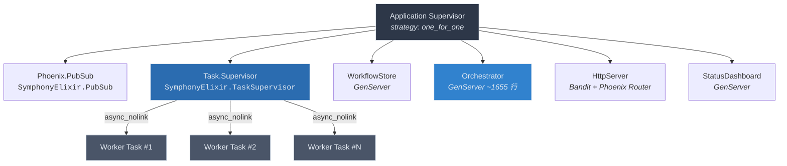

**关键设计决策**：

- **`one_for_one` 策略**：任何一个子进程崩溃时，**只重启该进程本身**，不影响兄弟进程。这意味着 HttpServer 挂掉不会重启 Orchestrator，WorkflowStore 重载失败不会中断正在执行的 Worker。
- **Task.Supervisor 独立于 Orchestrator**：Worker Task 通过 `Task.Supervisor.async_nolink/3` 启动。`nolink` 意味着 Worker 崩溃时，其 exit signal **不会传播给 Orchestrator**——Orchestrator 仅收到一个 `:DOWN` 消息，可以从容地做清理和重试决策，而非被迫跟着崩溃。
- **无外部存储依赖**：所有运行时状态（运行中的 issue、重试计数、速率限制信息）都存放在 Orchestrator GenServer 的内存 State struct 中。没有 Redis、没有 PostgreSQL、没有文件系统持久化。这是一个**有意的简化**——进程重启意味着状态归零，但对于"从 Linear 重新拉取 issue 列表"的场景，这完全可接受。

> **源码参考**：`lib/symphony_elixir.ex` — `start/2` 函数中的 `children` 列表定义了完整的监督树拓扑。

---

## 六大核心进程

### Phoenix.PubSub

**职责**：进程间事件分发总线。Orchestrator 将状态快照、worker 完成事件等广播到 PubSub topic；StatusDashboard 和 LiveView 前端订阅这些 topic 以实现实时更新。

**为什么不直接 send/2**：PubSub 解耦了生产者和消费者。Orchestrator 不需要知道有多少个 Dashboard 实例或 LiveView 连接在监听——它只管往 topic 里广播，订阅者按需消费。

### Task.Supervisor

**职责**：管理所有 Worker Task 的生命周期。每个 Linear issue 被调度执行时，Orchestrator 调用 `Task.Supervisor.async_nolink(SymphonyElixir.TaskSupervisor, fn -> ... end)` 来启动一个独立的 Task 进程。

**隔离保证**：`async_nolink` 确保 Worker Task 与 Orchestrator 之间没有 link 关系。Worker 异常退出时：
1. Task.Supervisor 不会尝试重启它（Task 默认是 `:temporary`）
2. Orchestrator 通过 `Process.monitor/1` 得到的 `:DOWN` 消息感知到崩溃
3. Orchestrator 在自己的 `handle_info({:DOWN, ...})` 中执行清理和重试逻辑

### WorkflowStore

**职责**：GenServer，负责解析 `WORKFLOW.md` 文件并缓存解析结果。同时通过文件系统监控（file watcher）检测配置变更，触发**热重载**——用户修改 workflow 定义后无需重启服务。

**与 Orchestrator 的交互**：WorkflowStore 不直接推送变更给 Orchestrator。Orchestrator 在每次 poll tick 时主动从 WorkflowStore 读取最新配置，实现了**拉模式**的松耦合。

### Orchestrator

**职责**：Symphony 的**大脑**。这个约 1655 行的 GenServer 承担了核心调度职责：

- **定时轮询 Linear API**（通过 GraphQL）获取待处理的 issue
- **并发调度**：根据 `max_concurrent` 限制决定是否派发新的 Worker
- **生命周期跟踪**：通过 State struct 维护 `running`、`claimed`、`completed_this_session` 等 MapSet/Map
- **重试管理**：通过 `retry_attempts` map 追踪每个 issue 的重试次数和策略
- **速率限制感知**：通过 `codex_totals` 和 `codex_rate_limits` 字段跟踪 Codex API 的用量和限流信息
- **可观测性广播**：每次状态变更后通过 PubSub 发送 snapshot

### HttpServer

**职责**：基于 **Bandit**（纯 Elixir HTTP 服务器）+ **Phoenix Router** 构建，同时服务：
- **LiveView Dashboard**：浏览器可实时查看 Orchestrator 状态
- **REST API**：供外部系统查询状态或触发操作

### StatusDashboard

**职责**：GenServer，维护 Dashboard 的**数据快照**。它订阅 PubSub 事件，将 Orchestrator 广播的原始事件聚合为 Dashboard 友好的视图模型，供 LiveView 渲染。

---

## Orchestrator State Struct

Orchestrator 的全部运行时状态封装在一个 `%State{}` struct 中。理解这个 struct 就理解了 Symphony 的调度核心。

| 字段 | 类型 | 语义 |
|---|---|---|
| `running` | MapSet | 当前正在执行的 issue 标识符集合 |
| `claimed` | MapSet | 已认领但可能尚未开始执行的 issue 标识符集合 |
| `monitors` | Map (ref => id) | Process monitor 引用到 issue 标识符的映射，用于 `:DOWN` 消息路由 |
| `retry_attempts` | Map (id => RetryEntry) | 每个 issue 的重试次数和重试策略信息 |
| `completed_this_session` | Map (id => outcome) | 本次 session 内已完成的 issue 及其结果 |
| `codex_totals` | Map (key => %{input, output}) | Codex API 的 token 用量累计 |
| `codex_rate_limits` | any | 最新的 Codex API 速率限制信息 |
| `poll_interval_ms` | integer | 轮询 Linear API 的间隔毫秒数 |
| `max_concurrent` | integer | 最大并发 Worker 数 |
| `consecutive_empty_polls` | integer | 连续空轮询计数（用于自适应退避） |
| `config_ok?` | boolean | 配置是否有效的标志位 |

**无外部持久化**意味着：进程重启后 `running`、`claimed` 等字段归零。但由于 Orchestrator 每次 tick 都会重新从 Linear API 拉取 issue 列表，这种"遗忘"是安全的——重启后的首次 poll 会重建 claimed 集合。

> **源码参考**：`lib/symphony_elixir/orchestrator.ex` — `defstruct` 定义和 `handle_info(:tick, ...)` 中的调度逻辑。

---

## 进程间通信模式

六个进程之间的通信遵循清晰的模式边界，没有"任意进程对任意进程"的混乱消息流。

```mermaid
flowchart LR
    subgraph SUP["监督树"]
        Orch["Orchestrator<br/>GenServer"]
        TaskSup["Task.Supervisor"]
        WS["WorkflowStore<br/>GenServer"]
        PubSub["Phoenix.PubSub"]
        Dash["StatusDashboard<br/>GenServer"]
        Http["HttpServer"]
    end

    subgraph WORKERS["Worker 进程池"]
        W1["Worker Task"]
        W2["Worker Task"]
    end

    Orch -- "async_nolink 启动" --> TaskSup
    TaskSup -- "spawn" --> W1
    TaskSup -- "spawn" --> W2

    W1 -. "send("pid, ❴:codex_worker_update, ...❵")" .-> Orch
    W2 -. "send("pid, ❴:codex_worker_update, ...❵")" .-> Orch
    W1 -. ":DOWN message" .-> Orch
    W2 -. ":DOWN message" .-> Orch

    Orch -- "broadcast snapshot" --> PubSub
    PubSub -- "subscribe" --> Dash
    PubSub -- "subscribe" --> Http

    Orch -. "GenServer.call 读取配置" .-> WS
```

**四种通信路径**：

1. **Orchestrator --> Worker**（启动）：Orchestrator 调用 `Task.Supervisor.async_nolink/3`，传入要执行的函数闭包。这是唯一的"下行"通信——之后 Orchestrator 不再主动给 Worker 发消息。

2. **Worker --> Orchestrator**（实时更新）：Worker 在执行过程中通过 `send(orchestrator_pid, {:codex_worker_update, ...})` 向 Orchestrator 推送进度更新。这是**直接 send**，不走 PubSub，因为这是 1:1 的定向通信且对延迟敏感。

3. **Worker --> Orchestrator**（终止信号）：Worker 进程退出（正常完成或崩溃）时，Orchestrator 通过 `Process.monitor/1` 注册的 monitor 收到 `:DOWN` 消息。Orchestrator 在 `handle_info({:DOWN, ref, :process, _pid, reason})` 中通过 `monitors` map 查找对应的 issue 标识符，执行清理。

4. **Orchestrator --> Dashboard**（状态广播）：Orchestrator 通过 `Phoenix.PubSub.broadcast/3` 发送状态快照。StatusDashboard 和 LiveView 进程订阅对应 topic，接收更新。这是**扇出**模式——一次广播，多个消费者。

5. **Orchestrator --> WorkflowStore**（配置读取）：Orchestrator 在 tick 回调中通过 `GenServer.call/2` 同步读取 WorkflowStore 的最新配置。这是**拉模式**——不是 WorkflowStore 推配置给 Orchestrator，而是 Orchestrator 按需拉取。

---

## 端到端数据流

从外部 issue 进入系统到最终执行完成，数据流经以下路径：

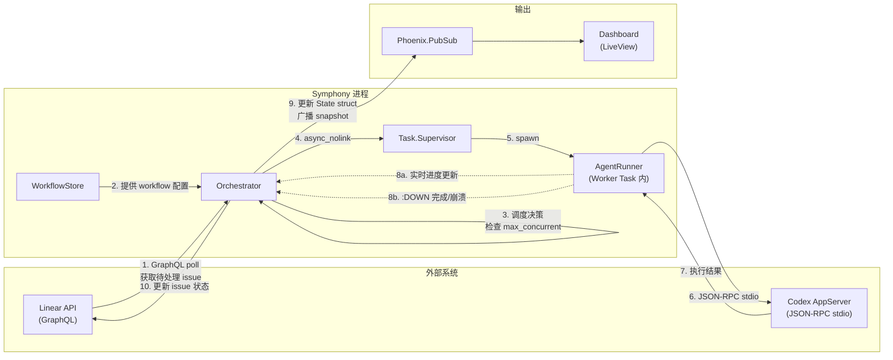

**逐步拆解**：

**第 1 步 -- 轮询**：Orchestrator 的 `:tick` 定时器触发后，通过 GraphQL 请求 Linear API 获取当前待处理的 issue 列表。轮询间隔由 `poll_interval_ms` 控制，`consecutive_empty_polls` 计数器用于自适应退避——连续多次空轮询后自动延长间隔。

**第 2-3 步 -- 调度决策**：Orchestrator 从 WorkflowStore 读取最新的 workflow 配置，然后对比当前 `running` MapSet 的大小和 `max_concurrent` 限制，决定是否可以派发新任务。已在 `claimed` 或 `completed_this_session` 中的 issue 会被跳过。

**第 4-5 步 -- Worker 启动**：通过 `Task.Supervisor.async_nolink/3` 在 Task.Supervisor 下启动一个新进程。Orchestrator 同时调用 `Process.monitor/1` 获取 monitor 引用，存入 `monitors` map。

**第 6-7 步 -- Agent 执行**：Worker Task 内部的 AgentRunner 通过 **JSON-RPC over stdio** 与 Codex AppServer 通信。这是一个阻塞调用——Worker 进程在等待 Codex 响应期间挂起，但由于每个 Worker 是独立进程，不影响其他 Worker 或 Orchestrator。

**第 8 步 -- 结果回传**：Worker 执行过程中通过 `send/2` 向 Orchestrator 推送实时更新（8a）。执行完成或崩溃时，monitor 机制自动向 Orchestrator 发送 `:DOWN` 消息（8b）。

**第 9-10 步 -- 收尾**：Orchestrator 更新内部 State struct（从 `running` 移除、写入 `completed_this_session`），通过 PubSub 广播最新状态快照，并向 Linear API 回写 issue 状态。

---

## 容错与隔离设计

Symphony 的容错策略可以总结为一句话：**让 Worker 放心崩溃，Orchestrator 负责收拾**。

| 故障场景 | 系统行为 |
|---|---|
| 单个 Worker Task 崩溃 | Orchestrator 收到 `:DOWN`，从 `running` 移除，查询 `retry_attempts` 决定是否重试 |
| Codex AppServer 无响应 | Worker Task 阻塞直至超时，最终异常退出，走上述 `:DOWN` 路径 |
| Orchestrator 自身崩溃 | Supervisor 按 `one_for_one` 重启；State 归零，下次 tick 重新从 Linear 拉取重建 |
| WorkflowStore 崩溃 | Supervisor 重启，重新解析 WORKFLOW.md；Orchestrator 下次 tick 读到新实例 |
| HttpServer 崩溃 | Supervisor 重启；不影响 Orchestrator 调度，仅 Dashboard 短暂不可用 |
| PubSub 崩溃 | Supervisor 重启；Dashboard 暂时收不到更新，Orchestrator 调度不受影响 |

这种隔离性来自三个层面的协同：
- **Supervisor `one_for_one`** 保证故障不级联
- **`async_nolink`** 保证 Worker 崩溃不拖垮 Orchestrator
- **无共享状态** 保证任何进程重启后都能从外部数据源（Linear API、WORKFLOW.md 文件）重建状态

---

## 设计权衡

**纯内存状态，无持久化**：如果 Orchestrator 进程重启，所有 `running`、`retry_attempts` 等信息丢失。这是可接受的——Linear API 是 issue 状态的 source of truth，重启后首次 poll 即可重建。但这也意味着 retry_attempts 的计数会被重置，一个持续失败的 issue 在 Orchestrator 重启后会重新获得完整的重试配额。

**单 Orchestrator 瓶颈**：所有调度逻辑集中在一个 GenServer 中，它是串行处理消息的。在极端高并发场景下，Orchestrator 的 mailbox 可能成为瓶颈。但对于"编码 Agent 编排"这个场景，并发度通常在几十到上百的量级，单 GenServer 的吞吐量绑绑有余。

**PubSub 的 at-most-once 语义**：Phoenix.PubSub 不保证消息送达。如果 Dashboard 进程在广播时恰好不可用，那条 snapshot 就丢了。对于 Dashboard 这种"展示最新状态"的场景，丢一条不影响正确性——下次广播就会带来最新快照。

---

## 相关页面

- [01-executive-summary](01-executive-summary.md) -- 项目概览与定位
- [03-orchestrator-deep-dive](03-orchestrator-deep-dive.md) -- Orchestrator GenServer 的 tick 循环、调度算法与重试策略详解
- [04-worker-lifecycle](04-worker-lifecycle.md) -- Worker Task 的启动、执行、更新上报与终止流程
- [05-workflow-configuration](05-workflow-configuration.md) -- WORKFLOW.md 的语法、解析与热重载机制


---

<details class="page-metadata">
  <summary>页面元数据</summary>

  | 属性 | 值 |
  |------|-----|
  | 页面编号 | 03 |
  | 标题 | 编排状态机与调度引擎 |
  | 主要源文件 | `elixir/lib/symphony_elixir/orchestrator.ex` |
  | 规范引用 | `SPEC.md:389-520` |
  | 关联页面 | [02 - 架构总览](02-architecture-overview.md), [04 - Worker 执行模型](04-worker-execution-model.md) |
</details>

# 编排状态机与调度引擎

Orchestrator 是 Symphony 的大脑——它决定哪个 issue 在什么时候、由谁来执行。整个模块实现为一个约 1655 行的 Elixir GenServer（`orchestrator.ex`），内部维护着一台 **Issue 状态机**、一个 **轮询调度循环** 和一套 **多层重试策略**，三者协同驱动 issue 从"被发现"到"被完成"的全部生命周期。

---

## Issue 状态机

每个进入 Orchestrator 视野的 issue 都严格经过五个状态。状态转换由 Orchestrator 内部事件驱动，外部不可直接跳转。

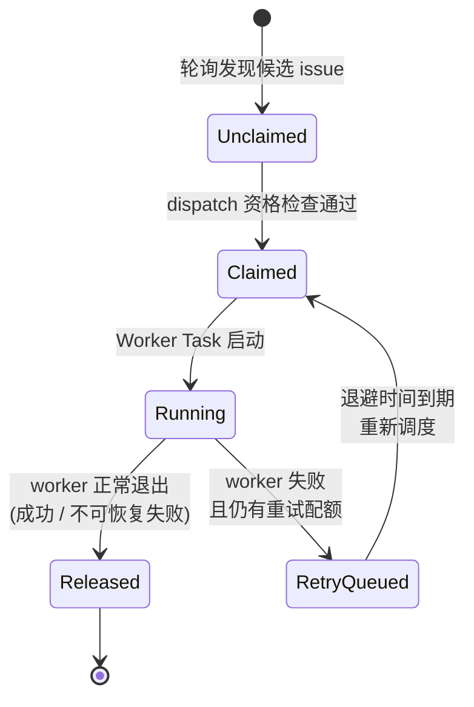

**五个状态的语义：**

- **Unclaimed** — issue 出现在候选列表中，尚未被任何 Orchestrator 实例认领。这是轮询调度循环的起点。
- **Claimed** — Orchestrator 通过 dispatch 资格检查后将 issue 标记为"已认领"，加入 claimed set。此时 worker 尚未启动，但其他 Orchestrator 实例不会再选择这个 issue。
- **Running** — `Task.Supervisor.async_nolink` 已经启动了 worker 进程，monitor 已设置。issue 正在被实际处理。
- **RetryQueued** — worker 异常退出，但 attempt count 未达到 `agent.max_attempts` 上限。issue 进入退避等待队列，等待重新调度。
- **Released** — 终态。worker 完成执行（无论成功与否），issue 从所有活跃集合中移除。

**关键设计约束：** 状态转换是单向的——不存在从 Released 回到 Unclaimed 的路径。一个 issue 在单次 session 中被标记为 completed 后，即使 Linear 端状态发生变化，Orchestrator 也不会重新拾取它（`not completed?` 过滤器）。

---

## 轮询调度循环

Orchestrator 不依赖外部推送，而是通过 **自调度的 `:tick` 消息** 驱动整个调度循环。每次 tick 触发 `handle_info(:tick, state)`，执行一条完整的调度管线。

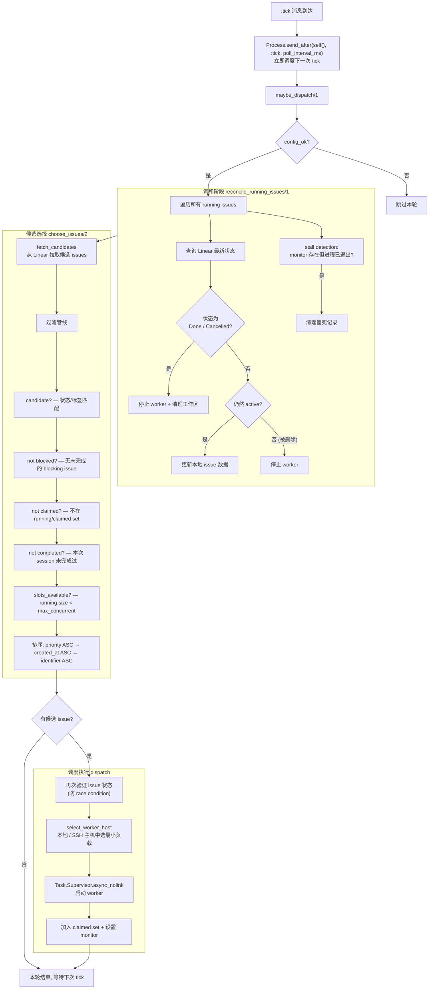

**调度管线的三个关键阶段：**

**1. 调和（Reconciliation）** 是每轮 tick 的第一步。Orchestrator 不信任本地缓存，而是主动向 Linear API 查询每个 running issue 的最新状态。这保证了即使 Linear 端发生了人工干预（手动关闭 issue、删除 issue），Orchestrator 也能及时做出反应。**Stall detection** 是调和阶段的安全网——如果一个 issue 的 monitor 仍然存在但对应的 worker 进程已经退出（例如 BEAM VM 内部异常），调和逻辑会清理这些僵死记录，防止 slot 被永久占用。

**2. 候选选择（Choose Issues）** 采用 **五层过滤管线** 逐步缩小范围。过滤顺序是精心设计的：先做轻量级的集合查找（`not claimed?`、`not completed?`），再做需要遍历依赖关系的检查（`not blocked?`），最后才检查全局约束（`slots_available?`）。排序规则确保**高优先级、先创建的 issue 优先被处理**，`identifier` 作为最终的确定性 tiebreaker。

**3. 调度执行（Dispatch）** 开始前会**再次验证 issue 状态**，因为从 fetch candidates 到 dispatch 之间可能已经过去了若干毫秒，issue 状态可能已被其他 Orchestrator 实例或人工操作改变。`select_worker_host` 在本地节点和配置的 SSH 远程主机之间选择当前负载最低的目标，实现简单的负载均衡。

---

## 重试策略

Worker 退出后，Orchestrator 根据退出类型和剩余配额决定是否重试。两种重试路径有完全不同的语义和退避策略。

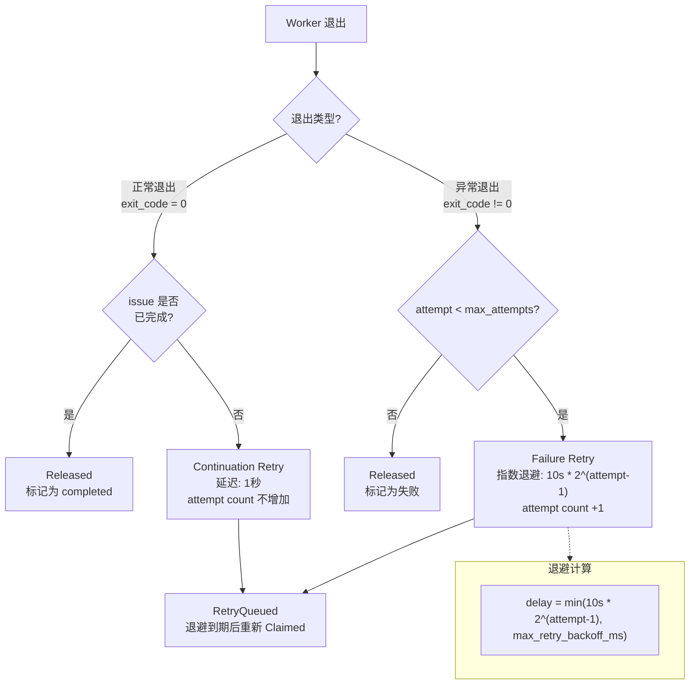

**Continuation retry 与 Failure retry 的根本区别：**

- **Continuation retry** 处理的场景是 worker 正常退出了（进程级别没有错误），但 issue 本身还没做完。典型情况是 Codex worker 在单次调用中用尽了 token 额度或遇到了上下文长度限制——它干净地退出，但任务还需要继续。这种情况下 **1 秒延迟、不增加 attempt count**，因为这不是"失败"，而是"分段完成"。
- **Failure retry** 处理的是真正的异常——worker crash、非零退出码、超时等。每次 failure retry 都会 **增加 attempt count** 并使用 **指数退避**：第 1 次重试等 10 秒，第 2 次等 20 秒，第 3 次等 40 秒，以此类推，直到达到 `max_retry_backoff_ms` 上限。

**`agent.max_attempts`**（默认值 3）控制的是 failure retry 的次数上限。Continuation retry 不受此限制——理论上一个 issue 可以被 continuation retry 无限次（实际上受 Linear 端状态变化和调和逻辑约束）。

---

## Token 统计与追踪

Orchestrator 在调度之外还承担着 **token 使用量的聚合追踪** 职责。Worker 在执行过程中会周期性地上报 Codex token 使用量，Orchestrator 负责解析、计算增量并记录。

**数据提取逻辑** 需要处理多种 payload 格式——worker 上报的数据可能是 `codex_response` 内嵌套的 `usage` 对象，也可能是扁平结构直接包含 `input_tokens` / `output_tokens`。Orchestrator 对两种格式做了统一处理。

**增量计算** 采用 `delta = 新总量 - 上次记录的总量` 的方式。这意味着即使 worker 多次上报同一个累计值（网络重传或幂等上报），Orchestrator 计算出的增量也是零，不会导致重复计数。计算出的 delta 用于 **dashboard 实时展示** 和 **rate limit 追踪**——当某个 worker 的 token 消耗接近限额时，Orchestrator 可以据此调整调度策略。

---

## 设计权衡与约束

**轮询 vs 事件驱动。** Orchestrator 选择了轮询模型而非 webhook/事件驱动。这意味着状态变化的感知存在最多一个 `poll_interval_ms` 的延迟，但换来了更简单的错误恢复——不需要处理 webhook 丢失、乱序、重放等问题。调和阶段的存在进一步降低了对实时性的依赖。

**单次 session 完成标记。** `not completed?` 过滤器意味着 Orchestrator 重启后（新 session），之前标记为 completed 的 issue 可以被重新拾取。这是有意为之——如果 issue 在 Linear 端重新变为 active 状态，新的 Orchestrator session 应该能够感知并处理它。

**`async_nolink` 的隔离性。** 使用 `Task.Supervisor.async_nolink` 而非 `async` 意味着 worker 的崩溃不会级联到 Orchestrator 进程。Orchestrator 通过 monitor 得知 worker 退出，而非通过 link 收到 EXIT 信号。这是整个系统容错设计的关键一环。

---

## Sources

| 来源 | 内容 |
|------|------|
| `elixir/lib/symphony_elixir/orchestrator.ex` | 核心状态机、调度循环、重试策略、token 统计的全部实现（约 1655 行） |
| `SPEC.md:389-520` | 编排状态机的规范定义，包括状态枚举、转换规则和调和逻辑 |

---

## 相关页面

- [02 - 架构总览](02-architecture-overview.md) — Orchestrator 在 Symphony 整体架构中的位置
- [04 - Worker 执行模型](04-worker-execution-model.md) — Worker Task 的启动、执行和退出机制
- [05 - 配置与工作流](05-configuration-workflow.md) — `WORKFLOW.md` 配置如何影响候选 issue 的筛选
- [06 - Linear 集成](06-linear-integration.md) — 调和阶段依赖的 Linear API 交互细节


---

<details class="page-metadata">
  <summary>页面元数据</summary>

  - **目标仓库**: openai/symphony
  - **文档范围**: WORKFLOW.md 合约格式、配置解析管线、热重载机制、Prompt 模板引擎
  - **关键源码**: `elixir/lib/symphony_elixir/workflow.ex`, `config.ex`, `config/schema.ex`, `prompt_builder.ex`, `workflow_store.ex`
  - **规范章节**: SPEC.md 5.2 -- 5.4, 6.1 -- 6.3
  - **最后更新**: 2026-05-08
</details>

# 工作流定义与配置系统

## 配置即合约：为什么让仓库持有自己的配置

Symphony 的配置体系遵循一个核心设计原则：**配置不住在服务端，住在被管理的仓库里**。每个接入 Symphony 的代码仓库在根目录放置一个 `WORKFLOW.md` 文件，它同时承担配置清单和 prompt 模板两个职责。

这个决策带来三个直接好处：

- **版本可追溯** -- 配置随代码一起 commit，团队可以用 `git blame` 审计每一次行为变更。
- **团队自治** -- 不同仓库可以定义完全不同的 tracker 设置、并发策略、hooks 脚本，无需协调中心化的配置服务。
- **零部署切换** -- 修改 `WORKFLOW.md` 后 Symphony 自动热重载，无需重启服务或重新部署。

SPEC.md 对此的表述是："The specification intentionally keeps workflow definition in the repository, version-controlled alongside code, to maintain team-specific agent behavior and runtime settings together."

---

## WORKFLOW.md 文件结构

`WORKFLOW.md` 采用 **YAML front matter + Markdown body** 的双段格式。前半段是被 `---` 分隔符包裹的 YAML 配置块，后半段是 Liquid 兼容的 prompt 模板。

下图展示了文件的逻辑结构，以及各段落与系统组件之间的对应关系。

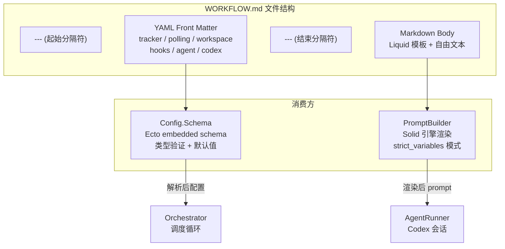

**解读**：YAML front matter 经过 Schema 层的类型校验后成为 Orchestrator 的运行时配置；Markdown body 则由 PromptBuilder 结合 issue 上下文渲染为每次 agent 运行的具体 prompt。两条路径互不干扰，各自独立失败。

如果文件不以 `---` 开头，整个文件内容被视为 prompt body，配置部分为空 map，全部使用默认值。

---

## 配置解析管线

从磁盘上的 `WORKFLOW.md` 到内存中可用的配置对象，经过一条五步管线。任何一步失败都会阻止配置生效，但不会导致服务崩溃。

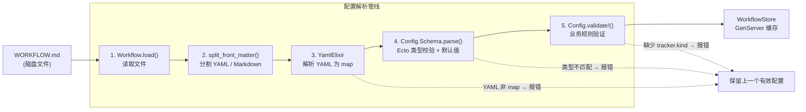

**各步骤详解**：

**步骤 1 -- 文件读取**：`Workflow.load/0` 从应用配置或默认路径（当前工作目录下的 `WORKFLOW.md`）读取文件内容。路径支持 `~` 展开和 `$VAR` 环境变量引用。

**步骤 2 -- Front Matter 分割**：`split_front_matter/3` 查找首尾 `---` 分隔符，将文件拆为 YAML 字符串和 Markdown 字符串。返回的 workflow 对象包含 `config`（配置 map）和 `prompt_template`（模板文本）两个字段。

**步骤 3 -- YAML 解析**：调用 `YamlElixir.read_from_string/1` 将 YAML 转为 Elixir map。**规范要求 YAML 必须解码为 map/object**，非 map 结构（如数组或纯标量）直接报错。

**步骤 4 -- Schema 校验**：`Config.Schema.parse/1` 通过 Ecto embedded schema 对配置 map 做类型强转和默认值填充。每个配置段（tracker, polling, workspace 等）都是独立的 embedded schema，嵌套在根 schema 中。未识别的顶层 key 被忽略（forward compatibility）。

**步骤 5 -- 语义验证**：`Config.validate!/0` 执行业务规则检查。包括：`tracker.kind` 必须存在且值为 `"linear"` 或 `"memory"`；Linear tracker 必须提供 `api_key` 和 `project_slug`；`codex.command` 不能为空。

---

## 完整配置字段参考

以下表格覆盖 `WORKFLOW.md` front matter 中所有可用字段，按配置段分组。

### tracker -- 任务追踪器

| 字段 | 类型 | 默认值 | 说明 |
|------|------|--------|------|
| `kind` | string | **必填** | 追踪器类型，当前支持 `"linear"` 和 `"memory"` |
| `endpoint` | string | `https://api.linear.app/graphql` | Linear API 端点地址 |
| `api_key` | string | -- | API 密钥，支持 `$VAR` 引用环境变量 |
| `project_slug` | string | **Linear 必填** | Linear 项目标识符 |
| `assignee` | string | -- | issue 指派人 |
| `active_states` | string[] | `["Todo", "In Progress"]` | 被视为"活跃"的 issue 状态列表 |
| `terminal_states` | string[] | `["Closed", "Cancelled", "Canceled", "Duplicate", "Done"]` | 被视为"终态"的 issue 状态列表 |

### polling -- 轮询策略

| 字段 | 类型 | 默认值 | 说明 |
|------|------|--------|------|
| `interval_ms` | integer | `30000` | 轮询间隔（毫秒），必须大于零；运行时动态生效 |

### workspace -- 工作空间

| 字段 | 类型 | 默认值 | 说明 |
|------|------|--------|------|
| `root` | string | 系统临时目录 + `symphony_workspaces` | 工作空间根目录，支持 `~` 展开和 `$VAR` 引用；相对路径相对于 `WORKFLOW.md` 所在目录解析 |

### hooks -- 生命周期钩子

| 字段 | 类型 | 默认值 | 说明 |
|------|------|--------|------|
| `after_create` | string | `nil` | 工作空间**首次创建**后执行；失败则中止创建 |
| `before_run` | string | `nil` | 每次 agent 尝试**开始前**执行；失败则中止当前尝试 |
| `after_run` | string | `nil` | 每次 agent 尝试**结束后**执行；失败仅记录日志 |
| `before_remove` | string | `nil` | 工作空间**删除前**执行；失败不阻止清理 |
| `timeout_ms` | integer | `60000` | 所有 hook 的统一超时时间（毫秒） |

**hook 失败语义不对称**：`after_create` 和 `before_run` 的失败会中止操作流程（"hard fail"），而 `after_run` 和 `before_remove` 的失败只会被日志记录（"soft fail"）。这个设计确保环境准备阶段的错误被严格拦截，而清理阶段的错误不会导致资源泄漏。

### agent -- Agent 执行参数

| 字段 | 类型 | 默认值 | 说明 |
|------|------|--------|------|
| `max_concurrent_agents` | integer | `10` | 最大并发 agent 数；运行时动态生效 |
| `max_turns` | integer | `20` | 单次 worker 会话的最大轮次 |
| `max_retry_backoff_ms` | integer | `300000` | 指数退避上限（5 分钟） |
| `max_concurrent_agents_by_state` | map | `{}` | 按 issue 状态细分的并发上限，如 `{"Todo": 5, "In Progress": 3}` |

### codex -- Codex 运行时

| 字段 | 类型 | 默认值 | 说明 |
|------|------|--------|------|
| `command` | string | `"codex app-server"` | 启动命令，通过 `bash -lc` 执行 |
| `approval_policy` | string \| map | 实现定义 | 审批策略 |
| `thread_sandbox` | string | `"workspace-write"` | 线程级沙箱策略 |
| `turn_sandbox_policy` | map | 实现定义 | 轮次级沙箱策略 |
| `turn_timeout_ms` | integer | `3600000` | 单轮超时（1 小时） |
| `read_timeout_ms` | integer | `5000` | 读取超时（5 秒） |
| `stall_timeout_ms` | integer | `300000` | 停滞检测超时（5 分钟）；设为 <= 0 禁用 |

### worker -- Worker 节点（SSH 分布式）

| 字段 | 类型 | 默认值 | 说明 |
|------|------|--------|------|
| `ssh_hosts` | string[] | `[]` | SSH worker 主机列表 |
| `max_concurrent_agents_per_host` | integer | -- | 每台主机的最大并发 agent 数，必须大于零 |

### observability -- 可观测性

| 字段 | 类型 | 默认值 | 说明 |
|------|------|--------|------|
| `dashboard_enabled` | boolean | `true` | 是否启用状态仪表盘 |
| `refresh_ms` | integer | `1000` | 仪表盘数据刷新间隔 |
| `render_interval_ms` | integer | `16` | UI 渲染间隔（约 60fps） |

### server -- HTTP 服务

| 字段 | 类型 | 默认值 | 说明 |
|------|------|--------|------|
| `port` | integer | -- | 监听端口，>= 0 |
| `host` | string | `"127.0.0.1"` | 绑定地址 |

---

## 环境变量与路径解析

配置值中的 `$VAR_NAME` 语法触发**显式环境变量解析**。关键规则：

- **环境变量不会全局覆盖 YAML 值**。只有当配置值本身包含 `$VAR` 时才进行替换。
- `~` 在路径类字段中被展开为用户 home 目录。
- **相对路径**相对于 `WORKFLOW.md` 文件所在目录解析，最终一律规范化为绝对路径。

实际使用中最常见的场景是 `tracker.api_key` 引用 `$LINEAR_API_KEY` 环境变量，避免将密钥明文写入仓库。

---

## WorkflowStore 热重载机制

`WorkflowStore` 是一个 GenServer 进程，负责缓存解析后的 workflow 对象并自动检测文件变更。

**变更检测策略**：采用轮询而非 inotify。每 **1000ms** 生成一次文件指纹，指纹由三个分量组成：

1. 文件修改时间戳（mtime）
2. 文件大小
3. 内容哈希（`:erlang.phash2`）

三个分量中任何一个发生变化，触发完整的重新解析流程。

**容错设计**：如果重新解析失败（YAML 格式错误、Schema 校验不通过等），**保留上一个有效配置继续运行**，同时输出 operator-visible 错误日志。这保证了即使有人提交了一个格式错误的 `WORKFLOW.md`，系统不会中断服务。

**动态生效的字段**：轮询间隔（`polling.interval_ms`）、并发上限（`agent.max_concurrent_agents`）、活跃/终态列表、hooks 脚本、prompt 模板内容 -- 这些都会在下一个 orchestrator tick 时自动读取新值。

---

## Prompt 模板引擎

Markdown body 部分通过 **Solid 库**（Liquid 兼容的 Elixir 模板引擎）渲染。

**严格模式**：渲染选项为 `strict_variables: true, strict_filters: true`。模板中引用不存在的变量或过滤器时**直接报错**，而非静默忽略。这个设计把模板错误前置到开发阶段而非运行时。

**模板变量**：

| 变量 | 类型 | 说明 |
|------|------|------|
| `issue` | object | 规范化的 issue 对象，包含 `identifier`, `title`, `description`, `priority`, `state`, `labels`, `blockers`, `url` 等字段 |
| `attempt` | integer \| nil | 首次运行时为 `nil`，重试/续跑时为正整数 |

**类型序列化**：`PromptBuilder` 的 `to_solid_value/1` 函数递归地将 Elixir 结构转换为 Liquid 兼容格式。`DateTime` 转为 ISO8601 字符串；struct 先 `Map.from_struct/1` 再递归处理；map 的 key 统一转为字符串。

**默认 prompt 兜底**：当 `WORKFLOW.md` 的 Markdown body 为空时，Config 模块提供一个内置的最小模板（包含 `issue.identifier`、`issue.title`、`issue.description` 等 Liquid 变量占位符）。但**文件读取/解析失败不会静默降级为默认 prompt** -- 这属于配置错误，必须被显式处理。

---

## Dispatch Preflight 验证

每个调度 tick 开始前，Orchestrator 执行一组预检验证。验证不通过时跳过当前 tick 的调度，但维持既有 agent 的正常运行。

| 检查项 | 失败后果 |
|--------|---------|
| `WORKFLOW.md` 可读且解析成功 | 跳过调度 |
| `tracker.kind` 存在且为支持的值 | 跳过调度 |
| `tracker.api_key` 经 `$` 展开后非空 | 跳过调度 |
| `tracker.project_slug` 存在（Linear tracker 时） | 跳过调度 |
| `codex.command` 非空 | 跳过调度 |

**启动时验证**更为严格：如果以上任何一项失败，服务直接拒绝启动并输出 operator-visible 错误。

---

## 实际 WORKFLOW.md 示例

Symphony 自身的 Elixir 参考实现仓库（`elixir/WORKFLOW.md`）提供了一个完整的生产级示例：

```yaml
---
tracker:
  kind: linear
  project_slug: "symphony-0c79b11b75ea"
  active_states:
    - Todo
    - In Progress
    - Merging
    - Rework
  terminal_states:
    - Closed
    - Cancelled
    - Canceled
    - Duplicate
    - Done
polling:
  interval_ms: 5000
workspace:
  root: ~/code/symphony-workspaces
hooks:
  after_create: |
    git clone --depth 1 https://github.com/openai/symphony .
    if command -v mise >/dev/null 2>&1; then
      cd elixir && mise trust && mise exec -- mix deps.get
    fi
  before_remove: |
    cd elixir && mise exec -- mix workspace.before_remove
agent:
  max_concurrent_agents: 10
  max_turns: 20
codex:
  command: codex --config shell_environment_policy.inherit=all ...
  approval_policy: never
  thread_sandbox: workspace-write
  turn_sandbox_policy:
    type: workspaceWrite
---
```

值得注意的细节：

- **`active_states` 扩展了默认值**，增加了 `Merging` 和 `Rework` 两个自定义状态，反映了 Symphony 团队自身的 Linear 工作流。
- **`polling.interval_ms` 设为 5000**（5 秒），远低于默认的 30 秒，适用于开发迭代期间需要快速响应的场景。
- **`after_create` hook** 在创建工作空间后自动 clone 仓库并安装依赖（通过 `mise` 工具链管理器）。
- **`before_remove` hook** 在清理前执行自定义的 Mix task，用于资源回收。

---

## Sources

| 源 | 内容 |
|----|------|
| `elixir/lib/symphony_elixir/workflow.ex` | WORKFLOW.md 文件读取、front matter 分割、YAML 解析 |
| `elixir/lib/symphony_elixir/config.ex` | 配置验证、语义检查、默认 prompt 模板 |
| `elixir/lib/symphony_elixir/config/schema.ex` | Ecto embedded schema 定义、字段类型与默认值、changeset 校验 |
| `elixir/lib/symphony_elixir/prompt_builder.ex` | Solid/Liquid 模板渲染、strict 模式、类型序列化 |
| `elixir/lib/symphony_elixir/workflow_store.ex` | GenServer 缓存、轮询检测、热重载容错 |
| SPEC.md 5.2 -- 5.4 | WORKFLOW.md 格式规范、prompt 模板合约 |
| SPEC.md 6.1 -- 6.3 | 配置解析管线、动态重载语义、dispatch preflight 验证 |
| `elixir/WORKFLOW.md` | 参考实现的生产级 WORKFLOW.md 示例 |

---

## 相关页面

- [03 - 核心调度循环](./03-core-loop.md) -- Orchestrator 如何消费 WorkflowStore 中的配置
- [05 - Codex 集成与沙箱](./05-codex-integration.md) -- `codex` 配置段如何传递给 Codex app-server
- [06 - Hooks 与工作空间管理](./06-hooks-and-workspace.md) -- hooks 生命周期钩子的执行细节


---

<details class="page-metadata">
  <summary>页面元数据</summary>

  | 属性 | 值 |
  |------|-----|
  | 项目 | openai/symphony |
  | 页面编号 | 05 |
  | 主题 | 工作区隔离与生命周期 |
  | 涉及源码 | `elixir/lib/symphony_elixir/workspace.ex`, `elixir/lib/symphony_elixir/path_safety.ex` |
  | 规范章节 | SPEC.md 9.1 -- 9.5 |
  | 上次更新 | 2026-05-08 |
</details>

# 工作区隔离与生命周期

Symphony 的核心场景是**多个 Codex Agent 并行处理不同 issue**。如果两个 agent 共享同一个文件系统目录，一个 agent 的 `git checkout feature-A` 会立即破坏另一个正在 `feature-B` 上编译的 agent 的工作树。这不是边缘情况，而是并行执行的常态。

`Workspace` 模块（`workspace.ex`，约 483 行）的职责很明确：**为每个 issue 创建独立的文件系统沙箱，管理其生命周期，并在安全边界内完成所有操作**。本页覆盖创建、验证、钩子执行、远程模式和清理的完整流程。

---

## 工作区生命周期

从 issue 进入系统到工作区被回收，一个工作区会经历以下阶段。

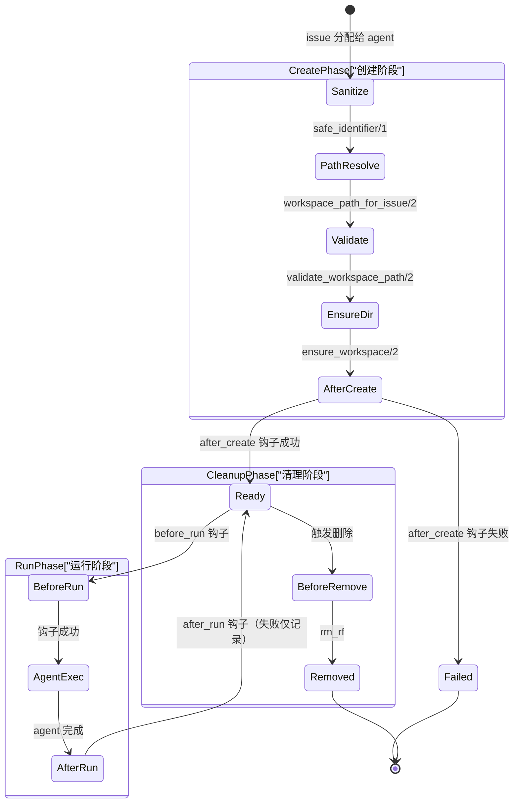

上图展示了工作区从创建到销毁的完整状态流转。**创建阶段**是最关键的，任何一步失败都会中止 agent 启动。**运行阶段**可以循环多次（同一 issue 重试时复用已有工作区）。**清理阶段**中 `before_remove` 钩子的失败不会阻止删除操作。

---

## 创建流程详解

`create_for_issue/2` 是工作区创建的入口，它按严格顺序执行五个步骤：

**1. 标识符清洗** -- `safe_identifier/1` 将 issue identifier 中所有非 `[A-Za-z0-9._-]` 字符替换为下划线。这保证目录名在任何操作系统上都是安全的，也防止了通过 issue 标题注入路径分隔符的攻击。

```elixir
defp safe_identifier(identifier) do
  String.replace(identifier || "issue", ~r/[^a-zA-Z0-9._-]/, "_")
end
```

**2. 路径拼接** -- `workspace_path_for_issue/2` 将清洗后的标识符拼接到配置的 `workspace.root` 下。本地模式会立即调用 `PathSafety.canonicalize/1` 解析符号链接；远程模式返回原始拼接结果（符号链接解析在远程主机上没有意义）。

**3. 路径安全验证** -- 下一节详述。

**4. 目录确保** -- `ensure_workspace/2` 的本地逻辑：
- 路径已存在且是目录 -- 直接复用，`created? = false`
- 路径已存在但不是目录 -- 删除后重建，`created? = true`
- 路径不存在 -- 创建目录，`created? = true`

**5. 创建后钩子** -- 仅当 `created? = true` 时触发 `after_create` 钩子。典型用途是 `git clone`。

---

## 路径安全验证

路径验证是防御**符号链接逃逸攻击**的关键屏障。攻击场景：如果恶意 issue 标题经过清洗后仍能指向一个符号链接，该链接指向 workspace root 之外的目录（如 `/etc` 或用户 HOME），agent 就会在不受控的位置执行代码。

以下流程图展示了本地模式下 `validate_workspace_path/2` 的完整决策逻辑。

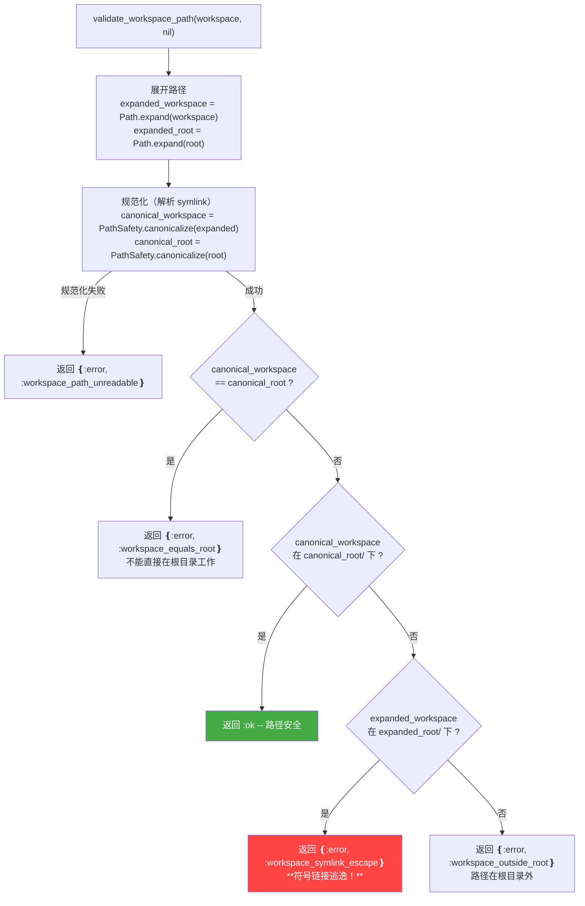

验证逻辑的精妙之处在于**第三个分支**：如果 `expanded` 路径看起来在 root 下（字符串前缀匹配），但 `canonical`（解析 symlink 后的真实路径）不在 root 下，这说明**存在一个 symlink 把路径引向了 root 外部**。这正是符号链接逃逸攻击的特征，系统会明确拒绝并返回 `:workspace_symlink_escape` 错误。

**远程模式的验证则简化为基本的输入清洗**：拒绝空字符串、包含换行符（`\n`、`\r`）或 null 字节（`\0`）的路径。这是因为远程主机上的路径无法从本地解析符号链接。

### PathSafety.canonicalize/1

路径规范化模块（`path_safety.ex`）逐段遍历路径，对每个 segment 调用 `File.lstat/1`：

- **符号链接** -- 读取链接目标（`:file.read_link_all/1`），将目标展开为绝对路径，**递归解析**（处理链式 symlink）
- **普通文件/目录** -- 追加到已解析列表，继续下一个 segment
- **不存在的路径** -- 将剩余 segment 拼接到当前已解析路径（工作区目录在验证时可能尚未创建）
- **权限错误等** -- 返回 `{:error, reason}`

---

## 生命周期钩子

钩子是工作区与外部工具（Git、CI 等）的集成点。SPEC.md 9.4 定义了四种钩子，Symphony 的 Elixir 实现为每种钩子提供了本地和远程两种执行路径。

| 钩子 | 触发时机 | 典型用途 | 失败处理 |
|------|----------|----------|----------|
| `after_create` | 工作区**首次创建**后（`created? = true`） | `git clone <repo>` -- 初始化仓库 | **致命**：返回错误，agent 不启动 |
| `before_run` | 每次 agent 运行**前** | `git fetch origin && git checkout main` -- 重置到最新状态 | **致命**：返回错误，本次运行取消 |
| `after_run` | agent 运行**后** | 提交结果、推送分支、触发 CI | **非致命**：记录日志，不影响结果 |
| `before_remove` | 删除工作区**前** | 归档日志、清理远程资源 | **非致命**：记录日志，删除照常进行 |

### 执行机制

**本地模式**通过 shell 启动钩子命令：

```elixir
System.cmd("sh", ["-lc", command], cd: workspace, stderr_to_stdout: true)
```

`-l` 标志加载登录 shell 的环境变量（如 `PATH`、SSH 密钥代理等），这对 `git` 命令正常工作至关重要。`cd: workspace` 确保命令在正确的工作区目录中执行。

**远程模式**通过 `SSH.run/3` 在远程主机执行相同的命令。

### 超时控制

所有钩子共享一个超时值：`Config.settings!().hooks.timeout_ms`（SPEC 默认 60 秒）。实现采用 Elixir 的 `Task` 模式：

```elixir
task = Task.async(fn -> System.cmd("sh", ["-lc", command], ...) end)

case Task.yield(task, timeout_ms) do
  {:ok, cmd_result} -> handle_hook_command_result(cmd_result, ...)
  nil ->
    Task.shutdown(task, :brutal_kill)
    {:error, {:workspace_hook_timeout, hook_name, timeout_ms}}
end
```

`Task.yield/2` 等待指定时间。如果钩子在时限内完成，正常处理结果；如果超时，`Task.shutdown(task, :brutal_kill)` **立即终止**钩子进程及其所有子进程，返回超时错误。这防止了失控的 `git clone` 或网络操作无限阻塞 agent 调度。

---

## 远程工作区（SSH 模式）

当配置了 `worker_host` 时，Symphony 通过 SSH 在远程主机上管理工作区。这带来了三个额外的复杂度。

**目录创建**使用一段精心构造的 shell 脚本，通过 SSH 发送到远程主机执行。脚本完成后输出 `__SYMPHONY_WORKSPACE__` 标记，Symphony 从 SSH 输出中解析该标记后的内容来确认工作区路径和创建状态。

**波浪号扩展**是远程模式的独特问题。本地的 `Path.expand/1` 解析的是本机的 `HOME`，而远程主机的 `HOME` 可能完全不同。`remote_shell_assign/2` 函数生成一段 shell 代码，在远程主机上正确处理 `~` 和 `~/...` 路径：

```elixir
defp remote_shell_assign(variable_name, raw_path) do
  [
    "#{variable_name}=#{shell_escape(raw_path)}",
    "case \"$#{variable_name}\" in",
    " '~') #{variable_name}=\"$HOME\" ;;",
    " '~/'*) #{variable_name}=\"$HOME/${#{variable_name}#~/}\" ;;",
    "esac"
  ] |> Enum.join("\n")
end
```

**Shell 转义**使用单引号包裹策略（`shell_escape/1`）：将值用单引号括起来，内部的单引号替换为 `'"'"'`（结束单引号 + 双引号包裹的单引号 + 重新开始单引号）。这是 POSIX shell 下最安全的转义方式，防止命令注入。

---

## 清理

**单工作区删除** -- `remove/2`：
1. 验证路径安全（与创建时相同的 `validate_workspace_path/2`）
2. 执行 `before_remove` 钩子（失败仅记录）
3. `File.rm_rf/1`（本地）或 SSH `rm -rf`（远程）

**批量删除** -- `remove_issue_workspaces/2`：
针对某个 issue，遍历所有已配置的 worker host（包括本地），删除该 issue 对应的工作区。这在 issue 关闭或需要强制重置时使用。

清理前的路径安全验证是**不可跳过的**。即使是删除操作，如果路径指向了 workspace root 之外，`rm_rf` 的后果不堪设想。

---

## 安全不变量总结

SPEC.md 9.5 定义了三条硬性安全规则，`Workspace` 模块的每个公开函数都必须遵守：

1. **Agent 只能在 per-issue 工作区路径内启动** -- `create_for_issue/2` 返回的路径是 agent 的执行根目录
2. **工作区路径必须位于配置的 workspace root 内** -- `validate_workspace_path/2` 通过规范化路径 + 前缀匹配 + symlink 逃逸检测三重保障
3. **目录名只包含安全字符** -- `safe_identifier/1` 将 `[^A-Za-z0-9._-]` 替换为下划线，从源头消除路径注入

---

## Sources

- [`elixir/lib/symphony_elixir/workspace.ex`](https://github.com/openai/symphony/blob/main/elixir/lib/symphony_elixir/workspace.ex) -- 工作区管理完整实现
- [`elixir/lib/symphony_elixir/path_safety.ex`](https://github.com/openai/symphony/blob/main/elixir/lib/symphony_elixir/path_safety.ex) -- 路径规范化与 symlink 解析
- [SPEC.md 9.1--9.5](https://github.com/openai/symphony/blob/main/SPEC.md) -- 工作区规范（布局、创建复用、钩子、安全不变量）

---

## 相关页面

- [02 -- 架构总览](./02-architecture-overview.md) -- Workspace 模块在系统中的位置
- [03 -- 配置系统](./03-configuration-system.md) -- `workspace.root` 和 `hooks.timeout_ms` 的配置方式
- [04 -- 会话管理](./04-session-management.md) -- agent 会话如何绑定到特定工作区
- [06 -- SSH 与远程执行](./06-ssh-remote-execution.md) -- 远程工作区依赖的 SSH 基础设施


---

<details class="page-metadata">
<summary>Page Metadata</summary>

| Field | Value |
|---|---|
| Page ID | 06-codex-integration |
| Title | Codex Agent 集成协议 |
| Topic | Symphony 与 Codex app-server 的通信协议、多轮编排、动态工具 |
| Audience | 平台工程师、系统集成者、需要理解 agent 执行链路的开发者 |
| Prerequisites | 了解 JSON-RPC 2.0 基础、Elixir/OTP 进程模型、[Symphony 架构概览](01-executive-summary.md) |
| Sources | `elixir/lib/symphony_elixir/agent_runner.ex`, `elixir/lib/symphony_elixir/codex/app_server.ex`, `elixir/lib/symphony_elixir/codex/dynamic_tool.ex`, `SPEC.md:521-680` |

</details>

# Codex Agent 集成协议

Symphony 和 Codex 之间的关系不是"调用一个 API 然后等结果"。它更像是 **启动一个子进程，然后通过 stdio 管道与它持续对话**。Symphony 扮演的是编排者角色——它决定何时开始、何时继续、何时停止；Codex 扮演的是执行者角色——它在隔离的工作区中读写代码、运行命令、完成任务。两者之间的全部通信，都发生在一条 JSON-RPC 2.0 over stdio 的管道上。

这种设计意味着 Symphony 对 Codex 的控制粒度远超普通 API 调用：它管理进程生命周期、逐行解析流式输出、处理审批请求、注入动态工具，并在每轮结束后根据外部状态（Linear issue 是否仍然活跃）决定是否继续。

本文拆解这条集成链路的三个层面：**AgentRunner 的多轮编排逻辑**、**AppServer 的 JSON-RPC 会话协议**、以及 **Dynamic Tool 的运行时工具注入机制**。

---

## AgentRunner：多轮执行编排

`AgentRunner`（`agent_runner.ex`，约 203 行）是 Symphony 执行一个 issue 的入口。它不直接与 Codex 通信，而是负责 **工作区准备、hook 执行、多轮调度** 这三件事。

**核心执行流程**如下：

1. **选择 worker host** 并创建隔离工作区（`Workspace.create_for_issue`）
2. **执行 before_run hook**——在 Codex 启动前完成环境准备
3. **启动多轮 Codex 会话**（`run_codex_turns`）——这是实际的 agent 执行阶段
4. **执行 after_run hook**——无论成功或失败，清理工作始终执行

### 多轮续跑机制

`run_codex_turns` 的核心逻辑是一个 **递归循环**，每轮（turn）执行后检查是否需要继续。

**Turn 1** 使用 `PromptBuilder` 渲染的完整 prompt，包含 issue 标题、描述、上下文等全部信息。**Turn 2 及之后** 使用精简的 continuation prompt，要求 agent 从当前工作区状态继续，而非重新理解任务。

**每轮结束后**，AgentRunner 会刷新 Linear issue 状态。如果 issue 已被标记为完成（不再是活跃状态），编排器 **提前退出**，不再消耗额外的 turn。这是一个关键的成本控制机制——外部状态变更可以随时终止自动化流程。

下面的时序图展示了 AgentRunner 在一次完整执行中的多轮编排流程。

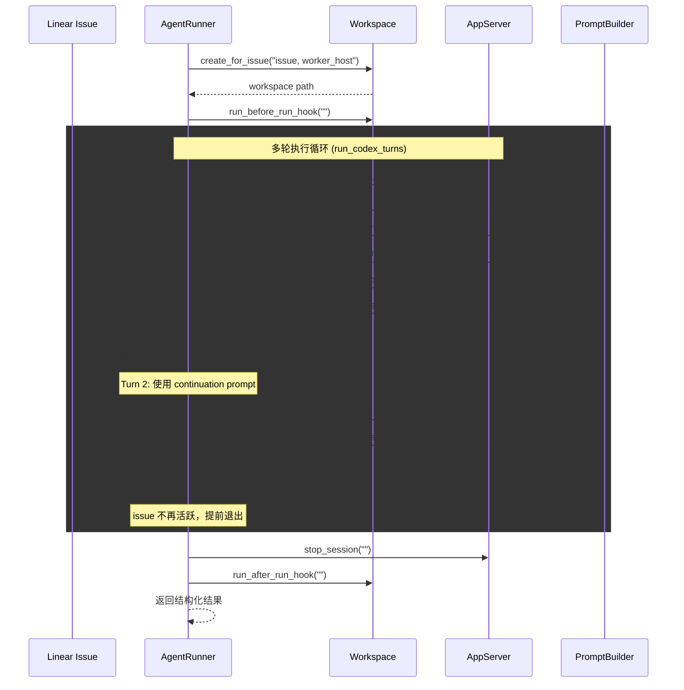

**递归终止条件**有三个：turn 执行出错（返回 `{:error, reason}`）、turn 计数达到 `max_turns` 上限、或 Linear issue 状态变为非活跃。任一条件满足即停止循环。

---

## AppServer：JSON-RPC 2.0 会话协议

`AppServer`（`codex/app_server.ex`，约 1096 行）是 Symphony 与 Codex 之间的 **协议层**。它管理一个 Erlang Port 子进程，通过 stdin/stdout 收发 JSON-RPC 2.0 消息。

### 会话生命周期

一个完整的 AppServer 会话经历以下阶段：

```mermaid
sequenceDiagram
    participant SY as Symphony (AppServer)
    participant CX as Codex (app-server 进程)

    Note over SY: 启动进程
    SY->>CX: start_port (bash -lc / SSH)
    activate CX

    subgraph INIT["初始化握手"]
        SY->>CX: initialize {capabilities, clientInfo}
        CX-->>SY: initialize result
    end

    subgraph THREAD["创建会话线程"]
        SY->>CX: thread/start {approvalPolicy, sandbox, cwd, dynamicTools}
        CX-->>SY: thread/start result {threadId}
    end

    rect rgb("255, 250, 240")
    Note over SY,CX: Turn 循环

    subgraph TURN1["Turn 1"]
        SY->>CX: turn/start {threadId, input, title, approvalPolicy}
        loop 流式处理 stdout
            CX-->>SY: approval/request (可选)
            SY->>CX: approval response
            CX-->>SY: tool/call (可选)
            SY->>CX: tool result
            CX-->>SY: userInput/request (可选)
            SY->>CX: 自动拒绝
        end
        CX-->>SY: turn/completed {usage}
    end

    subgraph TURN2["Turn 2+"]
        SY->>CX: turn/start {continuation prompt}
        CX-->>SY: turn/completed |"turn/failed"| turn/cancelled
    end
    end

    Note over SY: 会话结束
    SY->>CX: stop_port("")
    deactivate CX
```

### 启动方式

AppServer 支持两种启动模式。**本地模式**：通过 `System.cmd("bash", ["-lc", codex_command])` 在工作区目录中直接启动进程。**远程模式**：通过 `SSH.start_port(worker_host, "cd <workspace> && exec <command>")` 在远程 worker 上启动。两种模式之后的 JSON-RPC 通信完全一致。

### 初始化握手

`initialize` 请求传递客户端身份和能力声明。Symphony 声明自己为 `symphony-orchestrator`（版本 `0.1.0`），并启用 `experimentalApi` 能力。Codex 返回确认后，会话进入线程创建阶段。

### 线程创建与配置

`thread/start` 携带四个关键配置：
- **`approvalPolicy`**——控制 agent 执行命令时的审批行为
- **`sandbox`**——线程级沙箱模式
- **`cwd`**——工作目录（隔离的 issue 工作区路径）
- **`dynamicTools`**——客户端工具规格列表（如 `linear_graphql`）

返回的 `threadId` 在后续所有 turn 中复用，确保 Codex 保持上下文连续性。

### JSON-RPC 消息类型

下表列出 AppServer 处理的全部 JSON-RPC 消息类型。

| 消息方法 | 方向 | 用途 | Symphony 的处理方式 |
|---|---|---|---|
| `initialize` | Symphony -> Codex | 握手，传递 capabilities 和 clientInfo | 等待确认响应 |
| `thread/start` | Symphony -> Codex | 创建会话线程，注入工具和策略 | 提取 threadId 保存到 session |
| `turn/start` | Symphony -> Codex | 开始一个 turn，传递 user message | 进入 await_turn_completion 循环 |
| `turn/completed` | Codex -> Symphony | Turn 正常完成 | 提取 token usage，返回成功 |
| `turn/failed` | Codex -> Symphony | Turn 执行失败 | 记录错误，返回失败结果 |
| `turn/cancelled` | Codex -> Symphony | Turn 被取消 | 返回取消状态 |
| `item/commandExecution/requestApproval` | Codex -> Symphony | 请求命令执行审批 | 根据策略自动批准或拒绝 |
| `execCommandApproval` | Codex -> Symphony | 命令审批（旧版格式） | 同上 |
| `applyPatchApproval` | Codex -> Symphony | 补丁应用审批 | 根据策略自动批准或拒绝 |
| `item/fileChange/requestApproval` | Codex -> Symphony | 文件修改审批 | 根据策略自动批准或拒绝 |
| `item/tool/call` | Codex -> Symphony | 客户端动态工具调用 | 执行工具，返回结果 |
| `item/tool/requestUserInput` | Codex -> Symphony | 请求用户输入 | 自动拒绝（非交互式会话） |

### 审批策略

Symphony 的审批处理遵循一个简单原则：**全自动，无人工环节**。

当 `approval_policy` 设为 `"never"` 时，所有审批请求（命令执行、文件修改、补丁应用）都被 **自动批准**。这是 Symphony 的标准运行模式——agent 拥有完全的执行自主权。

对于其他策略值，Symphony **拒绝审批请求并返回错误**。这不是"等待人工审批"，而是直接告诉 agent "这个操作不被允许"。Symphony 的设计中不存在人工审批循环——它是一个全自动系统。

### 用户输入处理

当 Codex 发送 `item/tool/requestUserInput` 请求时，Symphony 的响应是固定的：**自动拒绝**，并附带一条标准消息——`"This is a non-interactive session..."`。这确保 agent 不会因等待输入而无限挂起。

### 流式 stdout 解析

AppServer 通过 Erlang Port 持续读取 Codex 的 stdout 输出。处理机制基于 **二进制缓冲区**：

- **`{:eol, chunk}`**——收到完整行，立即尝试 JSON 解析
- **`{:noeol, chunk}`**——行不完整，追加到 `pending_line` 缓冲区，等待下一段数据

非 JSON 输出（如 Codex 的日志、调试信息）会被记录但不中断协议处理。如果检测到看起来像协议消息但解析失败的行，会触发 `:malformed` 事件告警。

### 超时机制

三层超时保护确保会话不会无限挂起：

- **`read_timeout_ms`**（默认 5000ms）——单次 Port 读取超时
- **`turn_timeout_ms`**（默认 3,600,000ms / 1 小时）——单轮 turn 总超时
- **`stall_timeout_ms`**（默认 300,000ms / 5 分钟）——无输出停滞检测（设为 <=0 可禁用）

---

## Dynamic Tool：运行时工具注入

`DynamicTool`（`codex/dynamic_tool.ex`，约 209 行）实现了 Symphony 向 Codex agent 注入客户端工具的机制。目前唯一实现的动态工具是 **`linear_graphql`**——允许 Codex 在执行过程中直接查询 Linear GraphQL API。

### 为什么需要动态工具

Codex agent 在隔离工作区中运行，没有直接的 Linear API 访问权限。但 agent 在实现过程中可能需要查询 issue 的额外信息（关联 issue、项目上下文、评论历史等）。`linear_graphql` 工具让 agent 能够 **通过 Symphony 的认证凭据** 访问 Linear，而不需要在工作区中暴露 API token。

### 调用流程

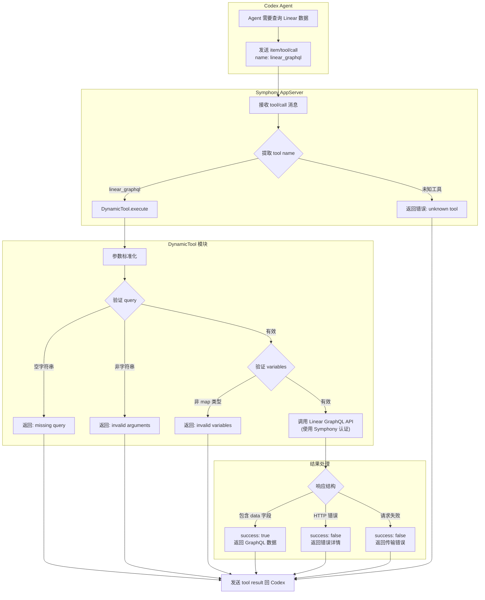

### 工具规格

`linear_graphql` 的工具规格在 `thread/start` 时传递给 Codex，遵循标准的 tool spec 格式：

- **name**: `"linear_graphql"`
- **description**: `"Execute a raw GraphQL query or mutation against Linear using Symphony's configured auth."`
- **input schema**: JSON Schema 对象，要求 `query`（非空字符串，必填）和 `variables`（对象，可选）

### 输入验证

DynamicTool 对参数执行 **防御性标准化**：接受 `"query"` 和 `:query` 两种 key 格式；对 query 字符串做 trim 处理并拒绝空值；variables 默认为空 map。每种验证失败都映射到一个明确的错误原子（如 `:missing_query`、`:invalid_arguments`、`:invalid_variables`），最终转化为包含错误详情的结构化响应返回给 agent。

---

## 设计要点总结

**进程模型而非 API 模型**。Symphony 启动 Codex 为子进程并通过 stdio 通信，这意味着它对 agent 有完整的生命周期控制——可以启动、监听、中断、清理，粒度远超 HTTP API 调用。

**外部状态驱动终止**。多轮循环不仅受 `max_turns` 限制，还受 Linear issue 状态影响。外部人工操作（在 Linear 上关闭 issue）可以即时终止自动化流程，这是人机协作的关键接口。

**全自动审批、零人工输入**。Symphony 的定位是无人值守的自动化系统。审批请求要么全部自动通过，要么直接拒绝——没有"等待人类回复"这条路径。用户输入请求同样被自动拒绝。

**安全的工具注入**。动态工具让 agent 能在执行过程中访问外部服务，但 **认证凭据由 Symphony 持有**，agent 只看到工具接口。这实现了能力授予和凭据隔离的平衡。

---

## Sources

| Source | 说明 |
|---|---|
| `elixir/lib/symphony_elixir/agent_runner.ex` | 高层编排——工作区创建、hook 执行、多轮调度 |
| `elixir/lib/symphony_elixir/codex/app_server.ex` | JSON-RPC 2.0 协议客户端——会话生命周期、消息处理、流式解析 |
| `elixir/lib/symphony_elixir/codex/dynamic_tool.ex` | 动态工具——linear_graphql 实现、参数验证、结果标准化 |
| `SPEC.md` (Section 10) | Agent Runner 协议规范——启动契约、流式处理、超时、审批策略 |
| `SPEC.md` (Section 5.3.6) | Codex 配置——命令、审批策略、沙箱模式、超时参数 |

---

**Related Pages**: [架构概览](01-executive-summary.md) | [工作区管理](04-workspace-management.md) | [Prompt 构建](05-prompt-builder.md) | [Linear 集成](07-linear-integration.md)


---

<details class="page-metadata">
<summary>页面元数据</summary>

| 属性 | 值 |
|---|---|
| 页面编号 | 07 |
| 目标仓库 | openai/symphony |
| 涉及模块 | `Linear.Client`, `Linear.Issue`, `Linear.Adapter` |
| 关键源文件 | `elixir/lib/symphony_elixir/linear/client.ex` (586 行), `elixir/lib/symphony_elixir/linear/issue.ex`, `SPEC.md:681-780` |
| 上游依赖 | Linear GraphQL API (`https://api.linear.app/graphql`) |
| 关联页面 | [06-orchestrator-core](06-orchestrator-core.md), [05-configuration-system](05-configuration-system.md), [08-agent-lifecycle](08-agent-lifecycle.md) |

</details>

# Linear 任务跟踪集成

Symphony 将 **Issue Tracker 视为调度器的唯一输入源**。所有待执行的工作都以 issue 的形式存在于外部系统中，orchestrator 按固定节奏轮询、规范化、过滤，然后决定是否分发给 agent。在当前版本中，**Linear 是唯一受支持的 tracker**，整套集成封装在 `Linear.Client`（586 行 GraphQL 客户端）与 `Linear.Issue`（规范化结构体）两个模块中。

这种"外部系统即事实源"的设计意味着 Symphony 本身**不维护任务队列**——Linear 的 project board 就是队列，issue 的 state 就是状态机。orchestrator 的职责仅仅是：读取、筛选、派发。

---

## 数据流总览

从 Linear API 到 agent 分发，数据经历**轮询、规范化、调度**三个阶段。每个阶段都有明确的输入输出边界。

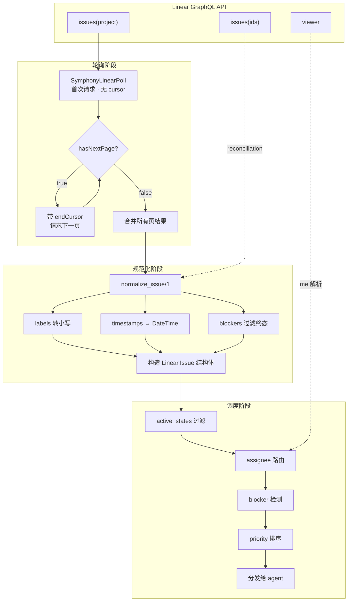

**轮询阶段**通过 `SymphonyLinearPoll` 查询获取项目下的候选 issues，采用 cursor 分页，每页 50 条，递归拉取直到 `hasNextPage = false`。**规范化阶段**将 GraphQL 原始响应转换为内部 `Linear.Issue` 结构体，统一字段格式。**调度阶段**根据 state、assignee、blocker、priority 多维度筛选后，将合格 issue 分发给空闲 agent。

在 reconciliation 场景下（刷新正在运行的 issue 状态），数据直接从 `SymphonyLinearIssuesById` 查询进入规范化阶段，跳过分页逻辑。

---

## GraphQL 查询体系

`Linear.Client` 封装了三条 GraphQL 查询，各司其职。

### 查询用途对照表

| 查询名称 | 触发场景 | 输入参数 | 关键返回字段 | 分页 |
|---|---|---|---|---|
| **`SymphonyLinearPoll`** | 每轮轮询周期 | `projectSlug`, `stateNames`, `first`(50), `after`(cursor) | id, identifier, title, description, priority, state, labels, assignee, inverseRelations, createdAt, updatedAt | 有 (cursor) |
| **`SymphonyLinearIssuesById`** | Reconciliation 刷新 | `ids`(issue ID 列表) | 同上完整字段 + blocker 信息 | 无 |
| **`SymphonyLinearViewer`** | `assignee = "me"` 时 | 无 | viewer.id, viewer.email | 无 |

**`SymphonyLinearPoll`** 是主力查询。它按 `projectSlug` 定位 Linear 项目，按 `stateNames` 过滤 issue 状态（对应配置中的 `active_states`），并通过 `inverseRelations(type: "blocks")` 一次性拉取 blocker 关系，避免 N+1 查询。

**`SymphonyLinearIssuesById`** 在每轮 reconciliation 阶段使用。当 orchestrator 发现有正在运行的 agent 时，会批量查询这些 agent 对应 issue 的最新状态——如果 issue 已被手动关闭或状态变更，orchestrator 据此决定是否终止 agent。

**`SymphonyLinearViewer`** 仅在 tracker 配置了 `assignee: "me"` 时触发。它将字符串 `"me"` 解析为 API key 对应的 Linear 用户 ID，用于后续的 assignee 过滤。

### 分页策略

分页实现采用**递归累积、末尾反转**模式：

1. 首次请求不携带 `after` 参数
2. 检查响应中的 `pageInfo.hasNextPage`
3. 若为 `true`，携带 `pageInfo.endCursor` 发起下一页请求
4. 递归过程中结果以逆序累积（`[new_page | acc]`），全部完成后一次性 `Enum.reverse/1`
5. 每页上限 **50 条**

这种模式避免了列表拼接的 O(n) 开销，在 issue 数量较大时（数百至数千条）保持线性性能。

---

## Issue 规范化

`normalize_issue/1` 函数将 Linear GraphQL 响应中的单个 issue 节点转换为 `Linear.Issue` 结构体。这是**集成层与调度层之间的唯一桥梁**——调度逻辑只认 `Linear.Issue`，不直接接触 GraphQL 数据。

### 字段映射表

| GraphQL 字段 | Issue 结构体字段 | 转换规则 |
|---|---|---|
| `id` | `id` | 直传 |
| `identifier` | `identifier` | 直传（如 `PROJ-123`） |
| `title` | `title` | 直传 |
| `description` | `description` | 直传（可为 nil） |
| `priority` | `priority` | 整数直传（Linear 原始值 0-4，0 = 无优先级，1 = urgent，4 = low） |
| `state.name` | `state` | 直传，用于 `active_states` 过滤 |
| `labels.nodes[].name` | `labels` | **转小写**，实现大小写不敏感匹配 |
| `assignee.id` | `assignee_id` | 直传 |
| `branchName` | `branch_name` | 直传 |
| `url` | `url` | 直传 |
| `createdAt` | `created_at` | ISO8601 → `DateTime` 解析 |
| `updatedAt` | `updated_at` | ISO8601 → `DateTime` 解析 |
| `inverseRelations` | `blocked_by` | 过滤后提取（见下方 blocker 检测） |

**Labels 转小写**是一个关键设计决策。Linear 允许用户自由命名 label（如 `Bug`、`bug`、`BUG`），而 Symphony 的配置中 `include_labels` / `exclude_labels` 也是用户手写的字符串。统一转小写后，匹配逻辑不再受大小写干扰。

**Priority 值** Linear 的原始设计中 `0 = No priority`，`1 = Urgent`，`2 = High`，`3 = Medium`，`4 = Low`。Symphony 直接使用这些整数值进行排序，**数值越小优先级越高**。

---

## Blocker 检测

Blocker 是 Symphony 调度决策中的**硬约束**——被 block 的 issue 不会被分发，无论它的优先级多高、状态多合适。检测逻辑完全在规范化阶段完成。

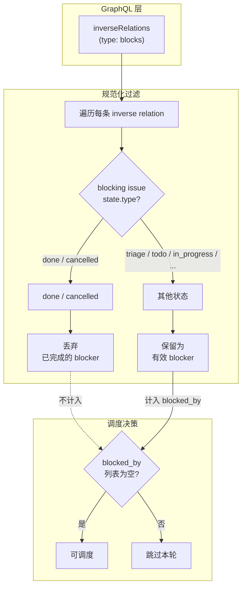

Blocker 检测的核心逻辑可以表述为一条规则：

> **一个 issue 被视为 blocked，当且仅当它存在至少一条 `inverseRelation`，其 relation type 为 `"blocks"` 且对应的 blocking issue 状态类型（`state.type`）既不是 `"done"` 也不是 `"cancelled"`。**

这意味着：
- 如果 blocking issue 已完成（done）或已取消（cancelled），它**不再构成阻塞**
- 只要还有**一个**未终结的 blocker，issue 就不会被分发
- Blocker 信息在每轮轮询时**实时刷新**，不存在缓存导致的滞后

这个设计让团队可以直接在 Linear 中管理依赖关系——完成一个 blocking issue 后，被 block 的 issue 在下一轮轮询中就自动变为可调度状态，无需人工干预。

---

## Assignee 路由

Assignee 路由决定 Symphony 实例**看到哪些 issue**。这是一个过滤机制，不是分配机制——它控制的是输入范围，不是输出目标。

| 配置值 | 行为 | 实现 |
|---|---|---|
| `tracker.assignee = "me"` | 仅处理分配给当前 API key 用户的 issues | 调用 `SymphonyLinearViewer` 获取用户 ID，按 `assignee.id` 过滤 |
| `tracker.assignee = "<email>"` | 仅处理分配给指定邮箱用户的 issues | 按 `assignee.email` 过滤 |
| `tracker.assignee = nil`（未配置） | 处理项目中所有 issues | 不执行 assignee 过滤 |

**`"me"` 解析**是一个两步过程：首先通过 `SymphonyLinearViewer` 查询获取当前 API key 对应的 Linear 用户 ID，然后在轮询结果中按 `assignee.id` 匹配过滤。这比直接传递 `"me"` 到 GraphQL 查询更可靠，因为 Linear API 的 issue 查询不直接支持 `"me"` 语义。

一个典型的多实例部署场景：团队中每个工程师运行自己的 Symphony 实例，各自配置 `assignee: "me"`，这样每个实例只处理分配给自己的 issues，避免重复工作。

---

## 错误处理

`Linear.Client` 的错误处理遵循 **Elixir 的 `{:ok, result}` / `{:error, reason}` 惯例**，但不在客户端层面做重试。

| 错误类型 | 处理方式 | 返回值 |
|---|---|---|
| **GraphQL errors**（查询本身返回 errors 字段） | 提取错误列表，原样上抛 | `{:error, {:linear_graphql_errors, errors}}` |
| **HTTP 错误**（非 200 状态码） | 通过 Req 库标准错误处理，日志中记录截断的响应体（上限 1000 字节） | `{:error, reason}` |
| **配置缺失**（无 API token） | 启动时即失败 | `{:error, :missing_linear_api_token}` |
| **Rate limiting** | 不在 client 层处理 | 由 orchestrator 的轮询间隔自然退避 |

**Rate limiting 的处理值得注意**。Symphony 没有实现传统的指数退避或 429 响应解析。取而代之的是，orchestrator 本身的轮询间隔（默认 30 秒）天然构成了请求频率的上限。对于绝大多数团队规模的 Linear 项目，这个频率远低于 Linear API 的速率限制。

---

## 配置参考

Linear 集成的配置项位于 Symphony 配置文件的 `tracker` 节下：

```yaml
tracker:
  kind: "linear"
  api_key: "$LINEAR_API_KEY"           # 支持环境变量引用
  project_slug: "my-project"           # Linear 项目的 slugId
  assignee: "me"                       # 可选："me" | "<email>" | 不设置
  active_states:                       # 可选，默认 ["Todo", "In Progress"]
    - "Todo"
    - "In Progress"
  terminal_states:                     # 可选，默认 ["Done", "Cancelled", "Canceled", "Closed", "Duplicate"]
    - "Done"
    - "Cancelled"
```

`project_slug` 对应 Linear 中项目的 `slugId`，不是项目名称。可以在 Linear 项目 URL 中找到此值。

---

## 模块结构

Linear 集成由三个模块组成，职责划分清晰：

| 模块 | 文件 | 职责 |
|---|---|---|
| `Linear.Client` | `linear/client.ex`（586 行） | GraphQL 查询封装、HTTP 通信、分页处理、响应规范化 |
| `Linear.Issue` | `linear/issue.ex` | 规范化 issue 结构体定义、`label_names/1` 辅助函数 |
| `Linear.Adapter` | `linear/adapter.ex` | Tracker 行为接口实现，连接 orchestrator 与 client |

`Linear.Adapter` 实现了 Symphony 定义的 tracker 行为接口（behaviour），使得 orchestrator 的调度逻辑与具体的 tracker 实现解耦。未来如果要支持 Jira 或 GitHub Issues，只需新增对应的 adapter 模块，无需修改 orchestrator 代码。

---

## Sources

| 引用 | 说明 |
|---|---|
| [`elixir/lib/symphony_elixir/linear/client.ex`](https://github.com/openai/symphony/blob/main/elixir/lib/symphony_elixir/linear/client.ex) | GraphQL 客户端实现，包含三条查询、分页逻辑、normalize_issue |
| [`elixir/lib/symphony_elixir/linear/issue.ex`](https://github.com/openai/symphony/blob/main/elixir/lib/symphony_elixir/linear/issue.ex) | Issue 结构体定义与类型规范 |
| [`elixir/lib/symphony_elixir/linear/adapter.ex`](https://github.com/openai/symphony/blob/main/elixir/lib/symphony_elixir/linear/adapter.ex) | Tracker 行为接口适配层 |
| [`SPEC.md:681-780`](https://github.com/openai/symphony/blob/main/SPEC.md) | Linear 集成规范定义 |

---

## 相关页面

- [Orchestrator 核心调度](06-orchestrator-core.md) -- 轮询循环、reconciliation、分发决策的上层逻辑
- [配置系统](05-configuration-system.md) -- `tracker` 配置节的完整定义与校验规则
- [Agent 生命周期](08-agent-lifecycle.md) -- issue 被分发后，agent 如何执行与汇报


---

<details class="page-metadata">
<summary>页面元数据</summary>

| 属性 | 值 |
|------|-----|
| 页面编号 | 08 |
| 所属项目 | openai/symphony |
| 覆盖范围 | SSH Worker Extension -- 远程 agent 分发与执行 |
| 关键源文件 | `ssh.ex`, `workspace.ex`, `orchestrator.ex`, `app_server.ex` |
| 规范依据 | SPEC.md Appendix A |
| 关联页面 | [Worker Deployment Models](03-03-worker-deployment-models.md), [Workspace Management](04-03-workspace-management.md), [AppServer Protocol](05-01-appserver-protocol.md) |

</details>

# SSH Worker 扩展架构

当 Symphony 在单机上运行多个 Codex agent 时，**CPU、内存和沙箱隔离**三者共同构成了并行度的天然瓶颈。一台开发机通常只能稳定承载 2--4 个并发 agent；超出这个阈值后，上下文切换开销和内存压力会显著拖慢每个 agent 的执行效率，甚至触发 OOM kill。

SSH Worker Extension 的设计目标非常明确：**Orchestrator 保持单点决策权，而实际的 agent 执行被分发到多台远程主机**。这种架构没有引入额外的分布式协调组件——Orchestrator 仍然是唯一的状态源，远程机器只是"带 SSH 入口的执行容器"。

---

## 本地 vs 远程：执行路径对比

在本地模式下，Orchestrator 直接通过 `Port.open` 启动 Codex 子进程，所有 stdio 通信都走进程间管道。切换到远程模式后，这条管道被 SSH 通道替代——Orchestrator 通过 `SSH.start_port` 在远程主机上启动 Codex，JSON-RPC 消息经由 SSH 的 stdin/stdout 双向传输。

下图展示了两种模式的架构差异。关键区别在于中间层：本地模式是 Erlang Port，远程模式是 SSH Port。

```mermaid
graph TB
  subgraph LOCAL["本地执行模式"]
    O1["Orchestrator"] --> |"dispatch"| AS1["AppServer"]
    AS1 --> |"Port.open"| C1["Codex Agent"]
    C1 --> |"stdio JSON-RPC"| AS1
    C1 --> W1["本地工作区<br/>workspace_root/ISSUE_ID"]
  end

  subgraph REMOTE["远程执行模式"]
    O2["Orchestrator"] --> |"dispatch + select_worker_host"| AS2["AppServer"]
    AS2 --> |"SSH.start_port"| SSH["SSH 通道"]
    SSH --> |"cd workspace && exec codex"| C2["远程 Codex Agent"]
    C2 --> |"stdio JSON-RPC via SSH"| SSH
    SSH --> AS2
    C2 --> W2["远程工作区<br/>remote:workspace_root/ISSUE_ID"]
  end

  style LOCAL fill:#f0f4ff,stroke:#4a6fa5
  style REMOTE fill:#fff4f0,stroke:#a56a4a
```

两种模式对 AppServer 上层完全透明——无论 Codex 跑在本地还是远程，Orchestrator 的 turn 管理、重试逻辑和状态追踪代码都不需要区分。这是 `SSH.start_port` 返回标准 Erlang Port 所带来的抽象优势。

---

## SSH 模块：薄封装层

`ssh.ex` 大约 100 行代码，是对系统 `ssh` 可执行文件的 **thin wrapper**，提供三个公开函数。

**`run/3`** 用于同步执行远程命令。内部调用 `System.cmd(ssh_executable, ssh_args(host, command), opts)`，返回 `{:ok, {output, exit_code}}` 或 `{:error, reason}`。典型用途：远程工作区的创建与清理。

**`start_port/3`** 用于异步 stdio 通信。通过 `Port.open({:spawn_executable, ssh}, port_opts)` 建立双向管道，返回标准 Erlang Port。这是远程 Codex 启动的核心通道——JSON-RPC 消息在这条管道上流动。

**`remote_shell_command/1`** 将裸命令包装为 `bash -lc '<command>'`。`-l` 保证加载远程用户的 login profile（PATH、环境变量等），`-c` 指定要执行的命令字符串。

### Host 目标解析

`parse_target/1` 负责将用户配置的 host 字符串拆分为 destination 和 port 两部分：

| 输入格式 | 解析结果 | 说明 |
|---------|---------|------|
| `dev-server` | destination=`dev-server`, port=`nil` | 使用默认 22 端口 |
| `dev-server:2222` | destination=`dev-server`, port=`2222` | 自定义端口，自动添加 `-p 2222` |
| `[::1]:2222` | destination=`[::1]`, port=`2222` | IPv6 bracketed host 检测 |
| `user@host:2222` | destination=`user@host`, port=`2222` | 带用户名的目标 |

解析使用正则 `~r/^(.*):(\d+)$/` 匹配末尾的 `:port`，并通过 `bracketed_host?/1` 和 `valid_port_destination?/1` 排除误匹配（例如纯 IPv6 地址中的冒号）。

### 安全：shell 转义

所有传递给远程 shell 的值都经过 `shell_escape/1` 处理：用**单引号包裹**整个字符串，内部的单引号转义为 `'"'"'`（结束单引号、双引号包裹单引号字符、重新开始单引号）。这是 POSIX shell 中防注入的标准做法。

---

## Worker Host 选择算法

当 `worker.ssh_hosts` 配置了多台远程主机时，Orchestrator 在每次 dispatch 前必须选择一台目标机器。`select_worker_host/2` 实现了一个**最小负载优先 + 重试偏好**的选择策略。

下图是完整的决策流程。

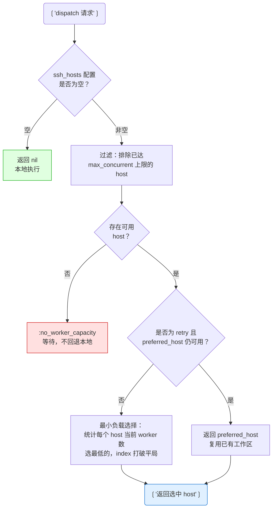

几个关键设计决定值得注意：

**容量隔离**。`worker.max_concurrent_agents_per_host` 是硬上限，通过 `worker_host_slots_available?/2` 在选择前过滤。当所有 host 都满载时，返回 `:no_worker_capacity` 让 dispatch **等待而非回退到本地执行**——这避免了单机被意外过载。

**重试偏好**。`pick_retry_worker_host/2` 在 retry dispatch 时优先选择上一次的 host。原因很实际：远程工作区是 host-local 的，同一台机器上可能仍保留着上一轮的 git 历史和依赖缓存，冷启动代价更低。

**负载均衡**。`least_loaded_worker_host/2` 统计 `state.running` 中每台 host 的 worker 数，选最少的。相同负载时用配置中的 index 打破平局——这保证了选择的确定性。

---

## 远程工作区管理

远程工作区的生命周期通过 SSH 命令控制，核心逻辑在 `workspace.ex` 中。

### 创建：ensure_workspace

`ensure_workspace(workspace, worker_host)` 通过 `SSH.run` 在远程主机上执行一段 shell 脚本。脚本的关键步骤：

1. **路径扩展**。`remote_shell_assign/2` 函数生成 shell 赋值语句，处理 `~` 到 `$HOME` 的扩展——因为 Elixir 端无法直接解析远程用户的 home 目录。
2. **目录创建**。检查目录是否存在，不存在则 `mkdir -p`；存在但为文件则先移除。
3. **输出标记**。脚本最终输出 `__SYMPHONY_WORKSPACE__\t<status>\t<canonical_path>`，由 `parse_remote_workspace_output/1` 解析。`status` 为 `0`（已存在）或 `1`（新建）。

**路径验证的简化处理**。本地模式下，`PathSafety` 通过 `File.realpath` 做 symlink 解析和目录穿越检查。但远程场景中无法调用远程文件系统的 canonicalize，因此 `validate_workspace_path/2` 退化为轻量检查：**非空 + 无控制字符**（换行、回车、null byte）。这是有意为之的安全折中——SPEC 中也明确指出"remote path resolution matters more once execution crosses a machine boundary"。

### 清理：remove 与 remove_issue_workspaces

**`remove(workspace, worker_host)`** 在执行 `before_remove` 钩子后，通过 SSH 运行 `rm -rf` 删除远程工作区目录。

**`remove_issue_workspaces(identifier, worker_host)`** 扫描指定 host 上属于某个 issue 的所有工作区并逐一删除。当 issue 达到终态（merged、closed）时，Orchestrator 调用此函数在**所有相关 host** 上清理残留。

---

## 远程 Codex 启动

`app_server.ex` 中，当 `worker_host` 非 nil 时，`start_port/2` 走远程分支。

启动流程：

1. **构建远程命令**。`remote_launch_command/1` 生成 `cd <workspace> && exec <codex_command>`。`cd` 确保 Codex 在正确的工作区目录下启动；`exec` 替换 shell 进程，避免多余的进程层级。
2. **建立 SSH Port**。`SSH.start_port(worker_host, remote_command, line: @port_line_bytes)` 返回 Erlang Port。此后 AppServer 通过 `Port.command` 发送 JSON-RPC 请求，通过 `{port, {:data, data}}` 消息接收响应。
3. **元数据记录**。`worker_host` 被写入运行元数据 `Map.put(base_metadata, :worker_host, host)`，用于 Dashboard 展示和日志追踪。

SSH Port 上的数据流与本地 Port 完全一致——都是 line-buffered 的 JSON-RPC。AppServer 的 `handle_info` 回调不区分 Port 来源，这是远程执行对上层透明的关键。

### 远程钩子执行

生命周期钩子（`before_run`、`after_run` 等）在远程场景中也通过 SSH 执行。`run_hook/5` 接收 `worker_host` 参数，将钩子命令发送到远程主机的工作区目录下运行。超时控制使用 `Task.yield/2` + `Task.shutdown(:brutal_kill)` 模式，确保挂起的远程命令不会无限阻塞 Orchestrator。

---

## SSH 配置

### worker.ssh_hosts 配置

在 Symphony 配置文件中声明远程 host 列表：

```yaml
worker:
  ssh_hosts:
    - "dev-gpu-01"
    - "dev-gpu-02:2222"
    - "builder@ci-node-03"
  max_concurrent_agents_per_host: 4
```

每个条目支持 `host`、`host:port`、`user@host:port` 格式。端口后缀由 `parse_target/1` 自动解析为 `-p` 参数。

### 自定义 SSH config

通过环境变量 `SYMPHONY_SSH_CONFIG` 指定自定义 SSH 配置文件路径：

```bash
export SYMPHONY_SSH_CONFIG="$HOME/.ssh/symphony_config"
```

设置后，所有 SSH 调用会附加 `-F <path>` 参数。典型用途：为不同远程 host 配置不同的密钥、跳板机或 ProxyCommand，而不污染用户的默认 `~/.ssh/config`。

### 远程 host 前置条件

SPEC Appendix A 要求每台远程 host 满足与本地相同的基本契约：

- **可达的 shell**：SSH 连接成功且能执行 `bash -lc`
- **可写的 workspace root**：`workspace.root` 路径在远程主机上存在且可写
- **Codex 可执行文件**：`codex.command` 配置的命令在远程 PATH 中可用
- **认证与仓库访问**：git credentials、API keys 等在远程环境中已配置

---

## 分布式场景下的注意事项

SSH Worker Extension 有意保持架构简单，但引入远程执行后有几个固有的分布式问题需要运维侧关注。

**环境漂移**。各 host 的 Codex 版本、系统依赖、git 配置可能不一致。SPEC 建议将远程 host 视为同质化节点，通过配置管理工具（Ansible、Puppet）保持一致。

**工作区局部性**。工作区是 host-local 的——切换 host 意味着冷启动。除非使用共享存储（NFS、EFS），否则 retry 到不同 host 会丢失上一轮的中间状态。这也是 retry 偏好机制存在的原因。

**故障语义区分**。Orchestrator 需要区分 SSH 连接失败（host 不可达）和 agent 执行失败（Codex 报错）。前者可以 failover 到其他 host，后者应作为正常 retry 处理。`start_port` 返回 `{:error, reason}` 时的 reason 类型是区分依据。

**清理可观测性**。`remove_issue_workspaces` 在所有相关 host 上执行清理，但如果某台 host 临时离线，清理会静默失败。运维侧需要定期检查远程 host 上的残留工作区。

---

## Sources

| 源文件 | 职责 |
|--------|------|
| [`elixir/lib/symphony_elixir/ssh.ex`](https://github.com/openai/symphony/blob/main/elixir/lib/symphony_elixir/ssh.ex) | SSH 封装：`run/3`, `start_port/3`, `parse_target/1`, `shell_escape/1` |
| [`elixir/lib/symphony_elixir/workspace.ex`](https://github.com/openai/symphony/blob/main/elixir/lib/symphony_elixir/workspace.ex) | 远程工作区创建、清理、路径验证 |
| [`elixir/lib/symphony_elixir/orchestrator.ex`](https://github.com/openai/symphony/blob/main/elixir/lib/symphony_elixir/orchestrator.ex) | `select_worker_host/2`、负载均衡、容量管理 |
| [`elixir/lib/symphony_elixir/codex/app_server.ex`](https://github.com/openai/symphony/blob/main/elixir/lib/symphony_elixir/codex/app_server.ex) | 远程 Codex 启动、SSH Port JSON-RPC 通信 |
| [`SPEC.md` Appendix A](https://github.com/openai/symphony/blob/main/SPEC.md) | SSH Worker Extension 规范 |


---

<details class="page-metadata">
<summary>Page Metadata</summary>

| Field | Value |
|---|---|
| Page ID | 09-observability |
| Title | 可观测性与实时仪表盘 |
| Scope | Phoenix LiveView Dashboard、PubSub 事件系统、结构化日志、HTTP API |
| Sources | `elixir/lib/symphony_elixir_web/live/dashboard_live.ex`, `elixir/lib/symphony_elixir/status_dashboard.ex`, `elixir/lib/symphony_elixir_web/observability_pubsub.ex`, `elixir/lib/symphony_elixir/log_file.ex`, `elixir/lib/symphony_elixir_web/presenter.ex`, `elixir/lib/symphony_elixir_web/router.ex`, `elixir/lib/symphony_elixir/http_server.ex`, `elixir/lib/symphony_elixir_web/controllers/observability_api_controller.ex`, `SPEC.md` (Sections 12, 17) |
| Related Pages | [02-architecture-overview](02-architecture-overview.md), [03-orchestrator-core](03-orchestrator-core.md), [08-resilience-retry-engine](08-resilience-retry-engine.md) |

</details>

# 可观测性与实时仪表盘

**看不见的 agent 是危险的 agent。** 当自主编码系统在后台同时处理数十个 issue、发起 API 调用、消耗 token 预算时，运维团队如果只能依赖事后日志排查，就等于在盲飞。Symphony 的可观测性体系正是为解决这个问题而设计：通过 **Phoenix LiveView 实时仪表盘**、**PubSub 推送事件流** 和 **结构化磁盘日志** 三层机制，让 orchestrator 的每一次状态变迁对运维者完全透明。

这套体系遵循一条核心设计原则——**可观测性组件的故障不得影响编排逻辑**。Dashboard 崩溃、日志写入失败、API 超时，这些都不会导致 orchestrator 停止调度。可观测性是"尽力而为"的旁路，不是关键路径上的依赖。

---

## 事件流架构

在深入各组件之前，先建立全局视角：orchestrator 状态变更如何流向三个消费端。

```mermaid
flowchart LR
    subgraph ORC["Orchestrator 核心"]
        O[Orchestrator GenServer]
        S["snapshot/1"]
    end

    subgraph PUB["PubSub 事件总线"]
        PS["Phoenix.PubSub"]
        T["Topic: observability:dashboard"]
    end

    subgraph CONSUMERS["消费端"]
        D["LiveView Dashboard<br/>(实时 Web UI)"]
        API["REST API<br/>(/api/v1/state)"]
        LOG["LogFile<br/>(结构化磁盘日志)"]
    end

    O -- "notify_dashboard("")" --> SD[StatusDashboard GenServer]
    SD -- "broadcast_update("")" --> PS
    PS -- ":observability_updated" --> T
    T -- "WebSocket 推送" --> D
    SD -- "snapshot_payload/0" --> API
    O -- "Logger 结构化输出" --> LOG
    S -. "同步查询" .-> SD
```

**关键路径说明：** Orchestrator 在完成轮询、worker 启停、token 更新、重试调度等关键状态转换后，调用 `notify_dashboard/0`。该调用触发 `StatusDashboard` GenServer 广播 PubSub 消息，LiveView 进程收到消息后拉取最新 snapshot 并推送给浏览器。整个链路是 **push-based** 的——不需要前端轮询后端。

---

## PubSub 事件系统

**`ObservabilityPubSub`**（`symphony_elixir_web/observability_pubsub.ex`）是事件广播的薄封装层，职责极其单一：

| 属性 | 值 |
|---|---|
| **PubSub 实例** | `SymphonyElixir.PubSub` |
| **Topic** | `"observability:dashboard"` |
| **消息类型** | `:observability_updated`（原子，无载荷） |

两个公开函数：

- **`subscribe/0`** — 将调用进程订阅到 topic。LiveView 在 `mount/3` 连接阶段调用。
- **`broadcast_update/0`** — 向所有订阅者广播 `:observability_updated`。内部先检查 PubSub 进程是否存活（`Process.whereis/1`），不存在时静默返回 `:ok`，绝不抛异常。

这个"消息不携带数据"的设计是 **刻意的**：PubSub 消息只充当通知信号，接收方自行向 `StatusDashboard` 拉取最新 snapshot。这避免了在高频更新下通过 PubSub 传输大体积数据的开销。

---

## StatusDashboard GenServer

**`StatusDashboard`**（`symphony_elixir/status_dashboard.ex`）是可观测性体系的中枢，在 PubSub 通知与数据消费之间充当缓存和节流层。

### 核心状态结构

```elixir
defstruct [
  :refresh_ms,                # 自动刷新间隔
  :enabled,                   # 是否启用
  :render_interval_ms,        # 最小渲染间隔（防抖）
  :refresh_ms_override,       # 运行时配置覆盖
  :enabled_override,
  :render_interval_ms_override,
  :render_fun,                # 渲染回调函数
  :token_samples,             # token 吞吐量采样点
  :last_tps_second,           # 上次 TPS 计算时间
  :last_tps_value,            # 上次 TPS 值
  :last_rendered_content,     # 缓存的渲染内容
  :last_rendered_at_ms,       # 上次渲染时间戳
  :pending_content,           # 待刷新内容
  :flush_timer_ref,           # 防抖定时器引用
  :last_snapshot_fingerprint  # snapshot 指纹（去重用）
]
```

### 消息处理

| 消息 | 触发方式 | 行为 |
|---|---|---|
| `:tick` | 定时器周期触发 | 刷新配置、条件性重新渲染、调度下一次 tick |
| `:refresh` | `notify_update/1` 外部调用 | 强制立即重新渲染 |
| `:flush_render` | 防抖定时器到期 | 执行延迟渲染，防止高频状态变更导致过多屏幕刷新 |

### 公开 API

- **`notify_update(server)`** — 广播 PubSub 更新 + 发送 `:refresh` 消息给自身
- **`snapshot_payload/0`** — 调用 `Orchestrator.snapshot/0` 获取当前状态，返回结构化 map
- **`render_offline_status/0`** — orchestrator 不可用时的降级展示

**防抖机制** 值得注意：当 orchestrator 在短时间内连续触发多次 `notify_update`（例如批量 worker 启动），StatusDashboard 不会对每次通知都重新渲染。它通过 `flush_timer_ref` 实现时间窗口内的合并，`render_interval_ms` 是最小渲染间隔。

---

## Snapshot 数据结构

Snapshot 是整个可观测性体系的**核心数据契约**——Dashboard、API、Presenter 都消费同一份 snapshot。

| 字段 | 类型 | 说明 |
|---|---|---|
| `running` | `[map]` | 运行中的 agent session 列表 |
| `retrying` | `[map]` | 重试队列中的 issue 列表 |
| `codex_totals` | `map` | token 累计用量（`input_tokens`, `output_tokens`, `total_tokens`, `seconds_running`） |
| `rate_limits` | `map \| nil` | 最新的上游 rate limit 信息 |
| `polling` | `map` | 轮询状态（`checking?`, `next_poll_in_ms`, `poll_interval_ms`） |

### Running 条目字段

每个 running session 包含丰富的运行时上下文：

| 字段 | 说明 |
|---|---|
| `issue_id` / `identifier` | issue 标识 |
| `state` | 当前状态 |
| `worker_host` | worker 运行主机 |
| `workspace_path` | 工作区路径 |
| `session_id` | 格式 `<thread_id>-<turn_id>` |
| `turn_count` | 对话轮次数 |
| `started_at` | 启动时间 |
| `last_codex_timestamp` | 最后一次 agent 活动时间 |
| `last_codex_message` | 最后一条 agent 消息 |
| `last_codex_event` | 最后一个 agent 事件 |
| `runtime_seconds` | 累计运行时长 |
| token 字段 | `input_tokens`, `output_tokens`, `total_tokens` |

### Retrying 条目字段

| 字段 | 说明 |
|---|---|
| `issue_id` / `identifier` | issue 标识 |
| `attempt` | 当前重试次数 |
| `due_at` | 下次重试时间（毫秒偏移） |
| `error` | 关联的错误信息 |
| `worker_host` / `workspace_path` | worker 上下文 |

---

## Phoenix LiveView Dashboard

**`DashboardLive`**（`symphony_elixir_web/live/dashboard_live.ex`）是面向运维的实时 Web UI，通过 WebSocket 实现亚秒级状态刷新。

### 数据刷新流程

```mermaid
sequenceDiagram
    participant B as 浏览器
    participant LV as DashboardLive<br/>(LiveView 进程)
    participant PS as ObservabilityPubSub
    participant SD as StatusDashboard
    participant ORC as Orchestrator

    Note over LV: mount/3 连接阶段
    LV->>PS: subscribe("")
    LV->>SD: snapshot_payload("")
    SD->>ORC: snapshot("")
    ORC-->>SD: %{running, retrying, ...}
    SD-->>LV: {:ok, payload}
    LV->>B: 初始 HTML 渲染

    Note over ORC: 状态变更发生
    ORC->>SD: notify_dashboard("")
    SD->>PS: broadcast_update("")
    PS-->>LV: :observability_updated
    LV->>SD: snapshot_payload("")
    SD->>ORC: snapshot("")
    ORC-->>SD: 最新 snapshot
    SD-->>LV: {:ok, payload}
    LV->>B: DOM diff 推送

    Note over LV: 每秒 runtime tick
    LV->>LV: :tick (更新 :now)
    LV->>B: 运行时长实时递增
```

**三层刷新机制：**

1. **事件驱动刷新** — PubSub 推送 `:observability_updated` 时，LiveView 重新拉取 snapshot 并通过 WebSocket 发送 DOM diff。这是主刷新路径。
2. **秒级 tick** — 每 1000ms 触发一次 `:tick`，仅更新 `:now` assign，使界面上的"运行时长"字段实时递增，无需重新查询 orchestrator。
3. **首次渲染** — `mount/3` 阶段同步获取初始 payload，确保用户打开页面就能看到完整状态。

### Dashboard UI 组成

| 区域 | 内容 |
|---|---|
| **头部状态栏** | "Symphony Observability" 标题 + Live/Offline 状态徽章 |
| **指标卡片网格** | 运行中数量、重试中数量、总 token 消耗（含 input/output 明细）、累计运行时长 |
| **Rate Limits 区域** | 上游 API 限流信息的格式化展示 |
| **Running Sessions 表** | 6列：issue ID、状态徽章、session ID（带复制按钮）、运行时长/轮次、最后 agent 活动、token 消耗 |
| **Retry Queue 表** | 4列：issue ID、重试次数、计划重试时间、错误信息 |

当无活跃 session 或重试队列为空时，各区域展示对应的空状态提示。

---

## HTTP Server 与 REST API

### HTTP Server 启动

**`HttpServer`**（`symphony_elixir/http_server.ex`）使用 **Bandit** 作为底层 HTTP 服务器，通过 Phoenix Endpoint 间接启动。

**端口配置优先级：** 函数参数 > `Config.server_port()` > 不启动（返回 `:ignore`）

**安全默认值：**
- 绑定地址默认为 `127.0.0.1`（loopback），除非显式配置为其他地址
- 每次启动生成 48 字节随机 `secret_key_base`（`crypto.strong_rand_bytes`）
- 端口值必须是 `>= 0` 的整数，否则不启动

### 路由表

| 方法 | 路径 | 处理器 | 说明 |
|---|---|---|---|
| GET | `/` | `DashboardLive` | LiveView 实时仪表盘（经 browser pipeline） |
| GET | `/api/v1/state` | `ObservabilityApiController.state` | 系统状态 JSON |
| POST | `/api/v1/refresh` | `ObservabilityApiController.refresh` | 触发立即轮询（返回 202） |
| GET | `/api/v1/:issue_identifier` | `ObservabilityApiController.issue` | 单个 issue 详情 |
| * | `/dashboard.css`, `/vendor/*` | `StaticAssetController` | 静态资源 |
| * | 其他 | | 405 Method Not Allowed 或 404 Not Found |

### API 响应格式

**`GET /api/v1/state`** 返回：

```json
{
  "timestamp": "2025-01-15T10:30:00Z",
  "counts": { "running": 3, "retrying": 1 },
  "running": [
    {
      "issue_id": "PROJ-42",
      "identifier": "proj-42",
      "state": "running",
      "session_id": "thread_abc-turn_2",
      "turn_count": 5,
      "started_at": "2025-01-15T10:25:00Z",
      "tokens": { "input": 12000, "output": 3400, "total": 15400 }
    }
  ],
  "retrying": [
    {
      "identifier": "proj-17",
      "attempt": 2,
      "due_at": "2025-01-15T10:32:00Z",
      "error": "CI check failed"
    }
  ],
  "codex_totals": {
    "input_tokens": 150000,
    "output_tokens": 42000,
    "total_tokens": 192000,
    "seconds_running": 3600
  },
  "rate_limits": { ... }
}
```

**错误响应统一格式：**

```json
{
  "error": {
    "code": "issue_not_found",
    "message": "No issue found with identifier 'proj-99'"
  }
}
```

`ObservabilityApiController` 从 Endpoint 配置中读取 `orchestrator` 和 `snapshot_timeout_ms`（默认 15 秒）。

---

## Presenter 展示层

**`Presenter`**（`symphony_elixir_web/presenter.ex`）负责将 orchestrator 原始 snapshot 转换为 API 和 Dashboard 可消费的结构化载荷。

**核心转换函数：**

- **`state_payload/2`** — 调用 `Orchestrator.snapshot/2`，将 running/retrying 列表映射为标准化 map，附加时间戳和计数
- **`issue_payload/3`** — 定位特定 issue，返回状态、工作区信息、重试次数、错误数据
- **`refresh_payload/1`** — 触发 orchestrator 立即轮询

**格式化工具：**

| 函数 | 用途 |
|---|---|
| `iso8601/1` | DateTime 转 ISO8601 字符串（秒精度） |
| `due_at_iso8601/1` | 毫秒偏移量转未来重试时间 |
| `summarize_message/1` | 委托给 `StatusDashboard.humanize_codex_message/1` 生成可读摘要 |

**错误处理：** `state_payload` 对 snapshot 超时和不可用做了显式处理，确保 API 在 orchestrator 异常时依然返回有意义的错误信息而非崩溃。

---

## 结构化日志

**`LogFile`**（`symphony_elixir/log_file.ex`）提供基于 OTP `disk_log` 的 **旋转式文件日志**，作为实时 Dashboard 的持久化补充。

### 配置

| 参数 | 环境变量键 | 默认值 |
|---|---|---|
| 日志路径 | `:log_file` | `log/symphony.log` |
| 单文件大小上限 | `:log_file_max_bytes` | 10 MB |
| 保留文件数 | `:log_file_max_files` | 5 |

### 行为特征

- **日志级别：** `:all`（捕获所有级别）
- **格式：** 单行格式（`single_line: true`），每行一个结构化日志条目
- **旋转方式：** `:wrap` 模式——达到大小上限后自动轮转到下一个文件
- **Handler ID：** `:symphony_disk_log`
- **接管行为：** 配置成功后移除默认 console handler，日志仅写入文件

### 日志上下文字段

按照 SPEC.md 规范，所有 issue 相关日志 **必须** 包含：
- `issue_id` — issue 在 tracker 中的标识
- `issue_identifier` — 人类可读的 issue 标识符

所有 agent session 日志 **必须** 包含：
- `session_id` — 格式为 `<thread_id>-<turn_id>`

消息格式遵循稳定的 key-value 惯例，包含操作结果（completed / failed / retrying）和简明失败原因。

---

## 故障隔离设计

可观测性体系的一个关键设计目标是 **不成为系统的单点故障**。以下是各组件的故障隔离策略：

| 组件 | 故障场景 | 行为 |
|---|---|---|
| **PubSub** | 进程不存在 | `broadcast_update/0` 静默返回 `:ok` |
| **StatusDashboard** | snapshot 超时 | 返回错误元组，不阻塞 orchestrator |
| **LiveView** | WebSocket 断连 | 浏览器自动重连，重新 mount |
| **API** | orchestrator 不可用 | 返回 503，不崩溃 |
| **LogFile** | 磁盘写入失败 | 通过剩余 sink 发出警告，编排继续 |
| **Dashboard 渲染** | 异常 | 展示 offline 状态，不影响数据流 |

SPEC.md 明确要求：**"Dashboard/log failures do not crash orchestrator."**

---

## 部署与运维

### 启用 HTTP Server

三种配置方式（任选其一）：

1. **CLI 参数：** `--port 4000`
2. **WORKFLOW.md front matter：** `server.port: 4000`
3. **临时端口（开发用）：** `--port 0`（系统分配可用端口）

### Token 核算规则

SPEC.md 对 Dashboard 中的 token 统计有明确规范：

- **优先使用绝对线程总量**（而非增量式载荷）
- **忽略 delta 式数据** 以避免重复计算
- **运行时长** 在 snapshot/render 时实时聚合：已结束 session 的累计时长 + 活跃 session 的当前经过时长
- **Rate limit** 追踪最新一次 agent 更新携带的限流载荷

### 外部 Dashboard URL

通过 `codex.dashboard_url` 配置项，可以将 Dashboard 的 URL 暴露给外部系统（如工单系统的评论中嵌入 Dashboard 链接），方便团队快速跳转查看 issue 的实时处理状态。

---

## Sources

| Source | 说明 |
|---|---|
| [`dashboard_live.ex`](https://github.com/openai/symphony/blob/main/elixir/lib/symphony_elixir_web/live/dashboard_live.ex) | Phoenix LiveView 仪表盘实现 |
| [`status_dashboard.ex`](https://github.com/openai/symphony/blob/main/elixir/lib/symphony_elixir/status_dashboard.ex) | StatusDashboard GenServer |
| [`observability_pubsub.ex`](https://github.com/openai/symphony/blob/main/elixir/lib/symphony_elixir_web/observability_pubsub.ex) | PubSub 事件广播封装 |
| [`log_file.ex`](https://github.com/openai/symphony/blob/main/elixir/lib/symphony_elixir/log_file.ex) | 旋转式磁盘日志配置 |
| [`presenter.ex`](https://github.com/openai/symphony/blob/main/elixir/lib/symphony_elixir_web/presenter.ex) | Snapshot 数据转换层 |
| [`router.ex`](https://github.com/openai/symphony/blob/main/elixir/lib/symphony_elixir_web/router.ex) | HTTP 路由定义 |
| [`http_server.ex`](https://github.com/openai/symphony/blob/main/elixir/lib/symphony_elixir/http_server.ex) | Bandit HTTP 服务器启动 |
| [`observability_api_controller.ex`](https://github.com/openai/symphony/blob/main/elixir/lib/symphony_elixir_web/controllers/observability_api_controller.ex) | REST API 控制器 |
| [`orchestrator.ex`](https://github.com/openai/symphony/blob/main/elixir/lib/symphony_elixir/orchestrator.ex) | `snapshot/1` 和 `notify_dashboard/0` 定义 |
| [`SPEC.md`](https://github.com/openai/symphony/blob/main/SPEC.md) | Section 12 (HTTP Server), Section 17.8 (Validation) — Logging 和 Observability 规范 |


---

<details class="page-metadata">
<summary>页面元数据</summary>

- **目标读者**: 贡献者、架构师、CI/CD 运维
- **知识前提**: Elixir/OTP 基础、ExUnit 框架、Docker 基本操作
- **对应源码**: `elixir/test/`、`elixir/mix.exs`、`elixir/Makefile`、`.github/workflows/`
- **SPEC 章节**: Section 17 (Test and Validation Matrix)、Section 18 (Implementation Checklist)

</details>

# 测试体系与质量门禁

Symphony 的核心挑战不在于编写业务逻辑——而在于**编排不可控的外部系统**。它管理 AI agent 的生命周期、与 Linear 做状态同步、通过 SSH 调度远程 worker、处理速率限制和指数退避。当被测对象本身就是"管理 AI agent 的调度器"时，传统的单元测试边界变得模糊：一个 Orchestrator 的"单元"涉及状态机、子进程管理、GraphQL 通信和文件系统操作的交织。

Symphony 的测试策略回应了这个挑战：**用 22 个测试文件构建从纯函数验证到 Docker 容器编排的完整频谱**，同时用 100% 覆盖率门槛和多层静态分析保证代码质量。

## 测试金字塔

Symphony 的测试体系按验证粒度分为三层，从快速反馈的单元测试到完整环境的端到端验证逐级递进。

```mermaid
graph TB
    subgraph E2E["端到端测试"]
        e2e_local["本地 Worker 测试"]
        e2e_ssh["SSH Worker 测试"]
        e2e_docker["Docker 多容器编排"]
    end

    subgraph INT["集成测试"]
        int_ws["工作区 + 配置集成"]
        int_ext["扩展功能集成"]
        int_app["AppServer 协议"]
        int_pubsub["PubSub 可观测性"]
        int_snap["仪表盘快照"]
    end

    subgraph UNIT["单元测试"]
        unit_core["核心逻辑 (~80 cases)"]
        unit_orch["Orchestrator 状态 (37 cases)"]
        unit_tool["动态工具 (17 cases)"]
        unit_cli["CLI 入口"]
        unit_ssh["SSH 模块"]
        unit_log["日志文件"]
        unit_spec["规范检查"]
    end

    E2E --> INT --> UNIT

    style E2E fill:#e8d5e8,stroke:#8b4789
    style INT fill:#d5e8f0,stroke:#4682b4
    style UNIT fill:#d5f0d5,stroke:#228b22
```

**底层（单元测试）** 覆盖核心调度逻辑、状态机转换、Prompt 模板渲染、Token 计量、重试退避算法等纯函数或轻量状态操作。这些测试不依赖外部服务，毫秒级执行。

**中层（集成测试）** 验证多个模块协作：工作区生命周期管理与配置层的联动、AppServer 与 Codex 的协议交互、PubSub 事件在仪表盘上的正确呈现。这些测试使用临时目录和 Mock 进程模拟真实环境。

**顶层（端到端测试）** 启动完整的 Docker 容器集群，创建真实的 Linear 项目和 Issue，通过 SSH 调度远程 worker 执行任务，验证文件创建、评论发布、Issue 状态流转的全链路正确性。

## 测试文件用途对照

| 测试文件 | 用例数 | 层级 | 验证范围 |
|----------|--------|------|----------|
| `core_test.exs` | ~80 | 单元 | 配置加载、状态调和、Orchestrator 调度、Prompt 构建、AgentRunner 生命周期 |
| `orchestrator_status_test.exs` | 37 | 单元 | 快照超时、Codex 状态捕获、Token 计量、速率限制、仪表盘渲染 |
| `workspace_and_config_test.exs` | 47 | 集成 | 工作区 Bootstrap、路径安全校验、SSH 远程操作、配置解析、Linear API 归一化 |
| `dynamic_tool_test.exs` | 17 | 单元 | `linear_graphql` 工具的 GraphQL 执行、输入验证、错误处理、传输故障 |
| `extensions_test.exs` | 12 | 集成 | Workflow Store 热重载、Tracker 适配器委托、Observability API、Dashboard LiveView |
| `app_server_test.exs` | -- | 集成 | Codex 启动配置、Sandbox 策略、自定义参数传递 |
| `cli_test.exs` | -- | 单元 | CLI 入口参数解析、子命令路由 |
| `ssh_test.exs` | -- | 单元 | SSH 连接管理、Host 别名解析、故障隔离 |
| `specs_check_test.exs` | -- | 单元 | SPEC.md 合规性校验的 Mix Task |
| `log_file_test.exs` | -- | 单元 | 结构化日志写入、文件轮转 |
| `observability_pubsub_test.exs` | -- | 集成 | PubSub 事件广播、订阅者接收验证 |
| `status_dashboard_snapshot_test.exs` | 5 场景 | 集成 | 仪表盘快照比对（idle / busy / backoff / credits 等） |
| `live_e2e_test.exs` | 2 | E2E | 本地 Worker + SSH Worker 全链路验证 |

## 快照测试机制

Symphony 对状态仪表盘采用**快照测试**（Snapshot Testing）策略——将渲染后的终端输出与预存基线逐字节比对，确保任何 UI 变更都是显式的。

快照文件存放在 `test/fixtures/status_dashboard_snapshots/` 目录下，每个场景包含两个文件：

- **`.snapshot.txt`** -- 期望的终端输出（ANSI 转义序列已转为 `\e` 可读记法）
- **`.evidence.md`** -- 场景描述文档，说明该快照对应的系统状态

**覆盖的 5 个场景**：

| 场景 | 系统状态 | 验证重点 |
|------|----------|----------|
| `idle` | 无运行/重试任务 | 空状态正确渲染 |
| `idle_with_dashboard_url` | 空闲 + 配置了可观测性 URL | URL 正确显示 |
| `super_busy` | 多并发任务、高 Token 消耗、速率限制 | 吞吐量展示、颜色编码 |
| `backoff_queue` | 多任务处于退避重试 | 退避间隔、队列排序 |
| `credits_unlimited` | 优先级账户无限额度 | 额度展示差异 |

快照更新流程由 `snapshot_support.exs` 中的 `Snapshot` 模块驱动：

- **正常运行**：读取 `.snapshot.txt`，归一化换行符后与当前渲染结果比对，不匹配则测试失败
- **更新模式**：设置 `UPDATE_SNAPSHOTS=1 mix test` 后写入新基线文件
- **ANSI 处理**：`escape_ansi/1` 将转义序列转为可读格式，`strip_ansi/1` 完全移除，保证跨终端一致性

## 端到端测试环境

E2E 测试是 Symphony 测试体系中最重的一层——它验证的不是某个模块，而是**整个系统作为调度器的行为**：从 Linear 创建 Issue 到 agent 完成任务、提交结果、流转状态的全链路。

**环境要求**：

- Docker + Docker Compose
- 有效的 `LINEAR_API_KEY` 和 `OPENAI_API_KEY`
- 环境变量 `SYMPHONY_RUN_LIVE_E2E=1` 开启（默认跳过）

**Docker 基础设施**（`test/support/live_e2e_docker/`）：

| 文件 | 用途 |
|------|------|
| `Dockerfile` | 构建包含 Elixir 运行时 + SSH Server 的 worker 镜像 |
| `docker-compose.yml` | 编排 `worker1` / `worker2` 两个容器，各映射独立 SSH 端口 |
| `live_worker_entrypoint.sh` | Worker 容器入口脚本 |
| `symphony-live-worker.conf` | SSH 服务配置 |

**测试执行流程**：

1. 动态生成 Ed25519 SSH 密钥对
2. 预留 TCP 端口避免冲突
3. 通过 Docker Compose 启动 worker 容器，注入认证凭据
4. 生成临时 SSH Config 指向测试密钥
5. 轮询 SSH 连接直到 worker 就绪
6. 创建 Linear 项目和 Issue，触发 agent 调度
7. 验证：文件创建、GraphQL 查询、评论发布、Issue 状态流转
8. 清理容器和临时文件

**两个核心场景**：

- **本地 Worker 测试** -- agent 在本机执行，验证 Codex 集成和 Linear 状态同步
- **SSH Worker 测试** -- agent 通过 SSH 在 Docker 容器中执行，验证远程调度、密钥认证、端口映射的完整链路

## CI 管线

Symphony 的持续集成由两条 GitHub Actions 管线组成，分别负责代码质量和 PR 流程规范。

```mermaid
graph LR
    subgraph TRIGGER["触发条件"]
        pr["Pull Request"]
        push_main["Push to main"]
    end

    subgraph MAKE_ALL["make-all 管线"]
        checkout["Checkout 代码"]
        mise["mise 安装工具链"]
        cache["缓存 deps + _build"]
        make["make all"]
    end

    subgraph MAKE_STEPS["make all 展开"]
        deps["mix deps.get"]
        compile["mix compile --warnings-as-errors"]
        fmt["mix format --check-formatted"]
        lint["mix credo --strict"]
        test["mix test --cover"]
        dialyzer["mix dialyzer"]
    end

    subgraph PR_LINT["PR 描述检查管线"]
        pr_checkout["Checkout 代码"]
        pr_mise["mise 安装工具链"]
        pr_body["提取 PR Body"]
        pr_check["mix pr_body.check"]
    end

    pr --> MAKE_ALL
    push_main --> MAKE_ALL
    pr --> PR_LINT

    MAKE_ALL --> MAKE_STEPS

    style TRIGGER fill:#fff3cd,stroke:#856404
    style MAKE_ALL fill:#d5e8f0,stroke:#4682b4
    style MAKE_STEPS fill:#d5f0d5,stroke:#228b22
    style PR_LINT fill:#e8d5e8,stroke:#8b4789
```

**make-all 管线** 在每次 PR 和 main 分支 push 时触发，执行完整的质量检查流水线。依赖缓存基于 `mix.lock` 哈希，工具链通过 mise 管理。`make all` 等价于 `make ci`，按固定顺序执行六个阶段——任何一步失败即终止管线。

**PR 描述检查管线** 在 PR 创建、编辑、重新打开、同步时触发。它将 PR Body 导出为 Markdown 文件，通过自定义 Mix Task `mix pr_body.check` 校验格式合规性，确保每个 PR 都符合项目约定的描述结构。

## 代码质量工具链

Symphony 在 CI 中叠加了**四层质量门禁**，从格式到类型安全逐级递进：

| 工具 | 版本 | 作用 | 执行方式 |
|------|------|------|----------|
| **`mix format`** | 内置 | 代码格式统一 | `--check-formatted` 检查模式 |
| **Credo** | `~> 1.7` | 静态分析 / 代码风格 | `--strict` 模式，零容忍 |
| **Dialyxir** | `~> 1.4` | 类型检查（Dialyzer） | 基于成功类型推断 |
| **`mix specs.check`** | 自定义 | SPEC.md 合规性校验 | 验证实现与规范一致 |

**Credo `--strict` 模式** 意味着所有 Priority C（低优先级）的建议也被视为错误。这比大多数 Elixir 项目更严格——它强制执行命名约定、模块文档、函数复杂度限制等规则。

**Dialyzer** 通过 Dialyxir 集成，对 Elixir 代码进行成功类型分析。虽然 Elixir 是动态类型语言，Dialyzer 能捕获类型不匹配、无法到达的代码分支、模式匹配遗漏等问题。

**`mix specs.check`** 是 Symphony 的特色——它将 `SPEC.md` 规范文档视为可执行的合规清单，自动检查实现是否满足规范定义的行为约束。

## 覆盖率策略

Symphony 在 `mix.exs` 中设置了 **`threshold: 100`** 的覆盖率目标——但这不是"100% 全代码覆盖"。它的策略是**通过 `ignore_modules` 排除难以单元测试的模块，然后对剩余代码要求 100% 覆盖**。

**被排除的 22 个模块分为四类**：

| 分类 | 排除模块 | 排除原因 |
|------|----------|----------|
| **运行时状态** | `Config`、`Orchestrator`、`Orchestrator.State`、`AgentRunner` | 强依赖进程状态和外部服务，通过 E2E 覆盖 |
| **I/O 边界** | `CLI`、`LogFile`、`Workspace` | 涉及文件系统、终端、子进程操作 |
| **外部集成** | `Linear.Client`、`Codex.AppServer`、`Codex.DynamicTool` | 依赖 Linear API / Codex 运行时 |
| **Web 层** | `HttpServer`、`StatusDashboard`、`DashboardLive`、`Endpoint`、`Router` 等 12 个模块 | Phoenix Web 层通过集成测试和快照测试覆盖 |

这种"**分而治之**"的覆盖率策略比盲目追求全局 100% 更务实：

- 纯逻辑代码（调度算法、Prompt 渲染、Token 计量）**必须**被单元测试完全覆盖
- I/O 密集和状态密集的模块通过集成测试和 E2E 测试覆盖，不纳入覆盖率统计
- CI 管线中 `mix test --cover` 对非排除代码执行 100% 门槛检查

## SPEC 合规测试矩阵

`SPEC.md` Section 17 定义了三级测试合规矩阵，所有 Symphony 实现（不限于 Elixir 参考实现）都必须满足：

**Core Conformance（核心合规，必选）**：
- Workflow 文件路径优先级：显式路径 > 默认搜索
- 配置热重载不需重启
- 缺省值正确应用
- 工作区路径沙箱化：禁止符号链接逃逸
- 调度排序：优先级 > 创建时间
- 正常退出触发短间隔续跑重试

**Extension Conformance（扩展合规，按需）**：
- HTTP 快照 API 返回运行行、重试行、Token 总量、速率限制
- 客户端工具对不支持的调用不阻塞会话

**Real Integration Profile（集成验证，推荐）**：
- 使用真实 Tracker 凭据的端到端测试
- 测试标识隔离 + Tracker 产物清理
- 不可用时**标记为 skipped，而非静默 pass**

## Codex Skills: AI 辅助开发技能

`.codex/skills/` 目录下包含 6 个**技能卡**，它们不是生产代码——而是给 Codex agent 的操作指南，确保 Codex 在开发 Symphony 时正确执行 Git 操作和项目流程：

| 技能 | 用途 |
|------|------|
| `commit` | 指导 Codex 正确编写 commit message 和组织变更 |
| `debug` | 指导 Codex 如何调试 Symphony 的 Elixir 代码 |
| `land` | 指导 Codex 完成 PR 合并流程 |
| `linear` | 指导 Codex 与 Linear Issue 交互 |
| `pull` | 指导 Codex 执行 git pull 和 rebase |
| `push` | 指导 Codex 推送代码和创建 PR |

这些技能卡体现了 Symphony 的**元递归特性**：它本身是一个管理 Codex agent 的调度器，而它的开发过程也借助 Codex agent——技能卡确保这个自举循环中的质量一致性。

## Makefile 构建目标速查

| 目标 | 命令 | 用途 |
|------|------|------|
| `make all` | = `make ci` | 完整质量检查（deps + compile + fmt + lint + test + dialyzer） |
| `make test` | `mix test` | 仅运行单元/集成测试 |
| `make coverage` | `mix test --cover` | 测试 + 覆盖率报告 |
| `make e2e` | `SYMPHONY_RUN_LIVE_E2E=1 mix test test/.../live_e2e_test.exs` | 端到端测试（需 Docker + API Keys） |
| `make lint` | `mix credo --strict` | 静态分析 |
| `make fmt-check` | `mix format --check-formatted` | 格式检查 |
| `make dialyzer` | `mix dialyzer` | 类型检查 |

## Sources

- `elixir/test/` -- 全部 22 个测试文件
- `elixir/test/fixtures/status_dashboard_snapshots/` -- 5 个快照场景
- `elixir/test/support/snapshot_support.exs` -- 快照比对工具
- `elixir/test/support/live_e2e_docker/` -- E2E Docker 环境
- `elixir/mix.exs` -- 覆盖率配置、依赖声明
- `elixir/Makefile` -- CI 构建目标
- `.github/workflows/make-all.yml` -- 主 CI 管线
- `.github/workflows/pr-description-lint.yml` -- PR 描述检查管线
- `.codex/skills/` -- 6 个 Codex 技能卡
- `SPEC.md` Section 17-18 -- 测试矩阵与合规清单

---

**相关页面**：
- [核心架构](03-core-architecture.md) -- Orchestrator、AgentRunner 等被测模块的设计
- [配置系统](05-configuration.md) -- 配置加载与验证逻辑的详细说明
- [可观测性](08-observability.md) -- 仪表盘和 PubSub 的运行时行为
- [部署指南](09-operational-guide.md) -- 生产环境的 E2E 验证流程


---

