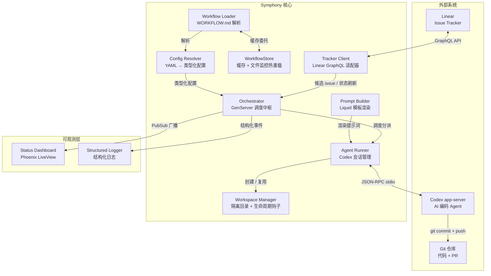

<details class="page-metadata">
<summary>页面信息</summary>
- 所属章节：项目概览
- 页面 ID：overview
</details>

# Symphony：自主编码 Agent 的工作编排引擎

你的 Linear 看板上堆了 200 个待办 issue，每一个都是明确的实现任务——修复一个 bug、加一个字段、写一组测试。你逐条点开、在本地拉分支、编码、跑 CI、提 PR。这个循环本身就是体力活。**Symphony 要自动化的正是这个循环。**

它不是又一个 AI Agent 框架。它是一个**工作调度层**——轮询 Linear 上的候选 issue，分配给 Codex agent，为每个任务创建隔离工作区，管理多轮执行、重试与退避，最终产出 PR。全程无人值守，团队只需要审查产出物。

Sources: [SPEC.md:1-50](../../../project-repos/symphony/SPEC.md#L1-L50), [README.md](../../../project-repos/symphony/README.md)

<details class="source-snippets">
<summary>引用源码</summary>

<!-- source-snippets:start -->

#### `SPEC.md:1-50`

```markdown
# Symphony Service Specification

Status: Draft v1 (language-agnostic)

Purpose: Define a service that orchestrates coding agents to get project work done.

## Normative Language

The key words `MUST`, `MUST NOT`, `REQUIRED`, `SHOULD`, `SHOULD NOT`, `RECOMMENDED`, `MAY`, and
`OPTIONAL` in this document are to be interpreted as described in RFC 2119.

`Implementation-defined` means the behavior is part of the implementation contract, but this
specification does not prescribe one universal policy. Implementations MUST document the selected
behavior.

## 1. Problem Statement

Symphony is a long-running automation service that continuously reads work from an issue tracker
(Linear in this specification version), creates an isolated workspace for each issue, and runs a
coding agent session for that issue inside the workspace.

The service solves four operational problems:

- It turns issue execution into a repeatable daemon workflow instead of manual scripts.
- It isolates agent execution in per-issue workspaces so agent commands run only inside per-issue
  workspace directories.
- It keeps the workflow policy in-repo (`WORKFLOW.md`) so teams version the agent prompt and runtime
  settings with their code.
- It provides enough observability to operate and debug multiple concurrent agent runs.

Implementations are expected to document their trust and safety posture explicitly. This
specification does not require a single approval, sandbox, or operator-confirmation policy; some
implementations target trusted environments with a high-trust configuration, while others require
stricter approvals or sandboxing.

Important boundary:

- Symphony is a scheduler/runner and tracker reader.
- Ticket writes (state transitions, comments, PR links) are typically performed by the coding agent
  using tools available in the workflow/runtime environment.
- A successful run can end at a workflow-defined handoff state (for example `Human Review`), not
  necessarily `Done`.

## 2. Goals and Non-Goals

### 2.1 Goals

- Poll the issue tracker on a fixed cadence and dispatch work with bounded concurrency.
- Maintain a single authoritative orchestrator state for dispatch, retries, and reconciliation.
- Create deterministic per-issue workspaces and preserve them across runs.
```

#### `README.md`

```markdown
# Symphony

Symphony turns project work into isolated, autonomous implementation runs, allowing teams to manage
work instead of supervising coding agents.

[](.github/media/symphony-demo.mp4)

_In this [demo video](.github/media/symphony-demo.mp4), Symphony monitors a Linear board for work and spawns agents to handle the tasks. The agents complete the tasks and provide proof of work: CI status, PR review feedback, complexity analysis, and walkthrough videos. When accepted, the agents land the PR safely. Engineers do not need to supervise Codex; they can manage the work at a higher level._

> [!WARNING]
> Symphony is a low-key engineering preview for testing in trusted environments.

## Running Symphony

### Requirements

Symphony works best in codebases that have adopted
[harness engineering](https://openai.com/index/harness-engineering/). Symphony is the next step --
moving from managing coding agents to managing work that needs to get done.

### Option 1. Make your own

Tell your favorite coding agent to build Symphony in a programming language of your choice:

> Implement Symphony according to the following spec:
> https://github.com/openai/symphony/blob/main/SPEC.md

### Option 2. Use our experimental reference implementation

Check out [elixir/README.md](elixir/README.md) for instructions on how to set up your environment
and run the Elixir-based Symphony implementation. You can also ask your favorite coding agent to
help with the setup:

> Set up Symphony for my repository based on
> https://github.com/openai/symphony/blob/main/elixir/README.md

---

## License

This project is licensed under the [Apache License 2.0](LICENSE).
```

<!-- source-snippets:end -->
</details>

---

## 项目定位与核心问题

Symphony 解决的不是"如何让 AI 写代码"，而是"**如何让 AI 批量、可靠地完成项目管理系统里的工作**"。

**人工循环的瓶颈**在于：每个 issue 需要人介入 5 次以上——挑选任务、理解上下文、配置环境、执行、提交。当 AI 编码能力已经足够完成单个任务时，瓶颈转移到了调度和编排。Symphony 填补的正是这个空缺。

**设计哲学**是「低调的工程预览」（engineering preview），面向受信任的开发环境。它不追求通用 Agent 编排，而是紧扣一个场景：**Linear issue 到 GitHub PR 的端到端自动化**。

Sources: [README.md](../../../project-repos/symphony/README.md), [SPEC.md:1-80](../../../project-repos/symphony/SPEC.md#L1-L80)

<details class="source-snippets">
<summary>引用源码</summary>

<!-- source-snippets:start -->

#### `README.md`

```markdown
# Symphony

Symphony turns project work into isolated, autonomous implementation runs, allowing teams to manage
work instead of supervising coding agents.

[](.github/media/symphony-demo.mp4)

_In this [demo video](.github/media/symphony-demo.mp4), Symphony monitors a Linear board for work and spawns agents to handle the tasks. The agents complete the tasks and provide proof of work: CI status, PR review feedback, complexity analysis, and walkthrough videos. When accepted, the agents land the PR safely. Engineers do not need to supervise Codex; they can manage the work at a higher level._

> [!WARNING]
> Symphony is a low-key engineering preview for testing in trusted environments.

## Running Symphony

### Requirements

Symphony works best in codebases that have adopted
[harness engineering](https://openai.com/index/harness-engineering/). Symphony is the next step --
moving from managing coding agents to managing work that needs to get done.

### Option 1. Make your own

Tell your favorite coding agent to build Symphony in a programming language of your choice:

> Implement Symphony according to the following spec:
> https://github.com/openai/symphony/blob/main/SPEC.md

### Option 2. Use our experimental reference implementation

Check out [elixir/README.md](elixir/README.md) for instructions on how to set up your environment
and run the Elixir-based Symphony implementation. You can also ask your favorite coding agent to
help with the setup:

> Set up Symphony for my repository based on
> https://github.com/openai/symphony/blob/main/elixir/README.md

---

## License

This project is licensed under the [Apache License 2.0](LICENSE).
```

#### `SPEC.md:1-80`

```markdown
# Symphony Service Specification

Status: Draft v1 (language-agnostic)

Purpose: Define a service that orchestrates coding agents to get project work done.

## Normative Language

The key words `MUST`, `MUST NOT`, `REQUIRED`, `SHOULD`, `SHOULD NOT`, `RECOMMENDED`, `MAY`, and
`OPTIONAL` in this document are to be interpreted as described in RFC 2119.

`Implementation-defined` means the behavior is part of the implementation contract, but this
specification does not prescribe one universal policy. Implementations MUST document the selected
behavior.

## 1. Problem Statement

Symphony is a long-running automation service that continuously reads work from an issue tracker
(Linear in this specification version), creates an isolated workspace for each issue, and runs a
coding agent session for that issue inside the workspace.

The service solves four operational problems:

- It turns issue execution into a repeatable daemon workflow instead of manual scripts.
- It isolates agent execution in per-issue workspaces so agent commands run only inside per-issue
  workspace directories.
- It keeps the workflow policy in-repo (`WORKFLOW.md`) so teams version the agent prompt and runtime
  settings with their code.
- It provides enough observability to operate and debug multiple concurrent agent runs.

Implementations are expected to document their trust and safety posture explicitly. This
specification does not require a single approval, sandbox, or operator-confirmation policy; some
implementations target trusted environments with a high-trust configuration, while others require
stricter approvals or sandboxing.

Important boundary:

- Symphony is a scheduler/runner and tracker reader.
- Ticket writes (state transitions, comments, PR links) are typically performed by the coding agent
  using tools available in the workflow/runtime environment.
- A successful run can end at a workflow-defined handoff state (for example `Human Review`), not
  necessarily `Done`.

## 2. Goals and Non-Goals

### 2.1 Goals

- Poll the issue tracker on a fixed cadence and dispatch work with bounded concurrency.
- Maintain a single authoritative orchestrator state for dispatch, retries, and reconciliation.
- Create deterministic per-issue workspaces and preserve them across runs.
- Stop active runs when issue state changes make them ineligible.
- Recover from transient failures with exponential backoff.
- Load runtime behavior from a repository-owned `WORKFLOW.md` contract.
- Expose operator-visible observability (at minimum structured logs).
- Support tracker/filesystem-driven restart recovery without requiring a persistent database; exact
  in-memory scheduler state is not restored.

### 2.2 Non-Goals

- Rich web UI or multi-tenant control plane.
- Prescribing a specific dashboard or terminal UI implementation.
- General-purpose workflow engine or distributed job scheduler.
- Built-in business logic for how to edit tickets, PRs, or comments. (That logic lives in the
  workflow prompt and agent tooling.)
- Mandating strong sandbox controls beyond what the coding agent and host OS provide.
- Mandating a single default approval, sandbox, or operator-confirmation posture for all
  implementations.

## 3. System Overview

### 3.1 Main Components

1. `Workflow Loader`
   - Reads `WORKFLOW.md`.
   - Parses YAML front matter and prompt body.
   - Returns `{config, prompt_template}`.

2. `Config Layer`
   - Exposes typed getters for workflow config values.
   - Applies defaults and environment variable indirection.
```

<!-- source-snippets:end -->
</details>

---

## 系统架构总览

下图展示 Symphony 的核心组件关系。Orchestrator 是中枢 GenServer，独占所有运行时状态和调度决策权。其余组件各司其职，通过函数调用和消息传递协作。



**Orchestrator 是唯一的状态拥有者。** 所有 issue 认领、调度、重试决策都在这一个 GenServer 里序列化完成，彻底避免了分布式状态带来的竞态和重复分派问题。

Sources: [elixir/lib/symphony_elixir/orchestrator.ex](../../../project-repos/symphony/elixir/lib/symphony_elixir/orchestrator.ex), [SPEC.md:Orchestrator 章节](../../../project-repos/symphony/SPEC.md:Orchestrator%20%E7%AB%A0%E8%8A%82)

<details class="source-snippets">
<summary>引用源码</summary>

<!-- source-snippets:start -->

#### `elixir/lib/symphony_elixir/orchestrator.ex`

```
defmodule SymphonyElixir.Orchestrator do
  @moduledoc """
  Polls Linear and dispatches repository copies to Codex-backed workers.
  """

  use GenServer
  require Logger
  import Bitwise, only: [<<<: 2]

  alias SymphonyElixir.{AgentRunner, Config, StatusDashboard, Tracker, Workspace}
  alias SymphonyElixir.Linear.Issue

  @continuation_retry_delay_ms 1_000
  @failure_retry_base_ms 10_000
  # Slightly above the dashboard render interval so "checking now…" can render.
  @poll_transition_render_delay_ms 20
  @empty_codex_totals %{
    input_tokens: 0,
    output_tokens: 0,
    total_tokens: 0,
    seconds_running: 0
  }

  defmodule State do
    @moduledoc """
    Runtime state for the orchestrator polling loop.
    """

    defstruct [
      :poll_interval_ms,
      :max_concurrent_agents,
      :next_poll_due_at_ms,
      :poll_check_in_progress,
      :tick_timer_ref,
      :tick_token,
      running: %{},
      completed: MapSet.new(),
      claimed: MapSet.new(),
      retry_attempts: %{},
      codex_totals: nil,
      codex_rate_limits: nil
    ]
  end

  @spec start_link(keyword()) :: GenServer.on_start()
  def start_link(opts \\ []) do
    name = Keyword.get(opts, :name, __MODULE__)
    GenServer.start_link(__MODULE__, opts, name: name)
  end

  @impl true
  def init(_opts) do
    now_ms = System.monotonic_time(:millisecond)
    config = Config.settings!()

    state = %State{
      poll_interval_ms: config.polling.interval_ms,
      max_concurrent_agents: config.agent.max_concurrent_agents,
      next_poll_due_at_ms: now_ms,
      poll_check_in_progress: false,
      tick_timer_ref: nil,
      tick_token: nil,
      codex_totals: @empty_codex_totals,
      codex_rate_limits: nil
    }

    run_terminal_workspace_cleanup()
    state = schedule_tick(state, 0)

    {:ok, state}
  end

  @impl true
  def handle_info({:tick, tick_token}, %{tick_token: tick_token} = state)
      when is_reference(tick_token) do
    state = refresh_runtime_config(state)

    state = %{
      state
      | poll_check_in_progress: true,
        next_poll_due_at_ms: nil,
        tick_timer_ref: nil,
        tick_token: nil
    }

    notify_dashboard()
    :ok = schedule_poll_cycle_start()
    {:noreply, state}
  end

  def handle_info({:tick, _tick_token}, state), do: {:noreply, state}

  def handle_info(:tick, state) do
    state = refresh_runtime_config(state)

    state = %{
      state
      | poll_check_in_progress: true,
        next_poll_due_at_ms: nil,
        tick_timer_ref: nil,
        tick_token: nil
    }

    notify_dashboard()
    :ok = schedule_poll_cycle_start()
    {:noreply, state}
  end

  def handle_info(:run_poll_cycle, state) do
    state = refresh_runtime_config(state)
    state = maybe_dispatch(state)
    state = schedule_tick(state, state.poll_interval_ms)
    state = %{state | poll_check_in_progress: false}

    notify_dashboard()
    {:noreply, state}
  end

  def handle_info(
        {:DOWN, ref, :process, _pid, reason},
```

#### `SPEC.md:Orchestrator 章节`

> 未找到引用文件：`SPEC.md:Orchestrator 章节`

<!-- source-snippets:end -->
</details>

---

## 端到端数据流

从一个 Linear issue 被创建到最终产出 PR，数据在 Symphony 中经历以下阶段。

```mermaid
flowchart LR
    subgraph S1["1. 轮询发现"]
        A1["定时 Tick 触发"] --> A2["Tracker Client<br/>GraphQL 拉取候选 issue"]
        A2 --> A3["按优先级 + 创建时间排序"]
    end

    subgraph S2["2. 调度分派"]
        A3 --> B1["检查并发槽位<br/>全局 + per-state"]
        B1 --> B2["认领 issue<br/>写入 claimed set"]
        B2 --> B3["Task.Supervisor<br/>启动 Worker"]
    end

    subgraph S3["3. Agent 执行"]
        B3 --> C1["Workspace Manager<br/>创建 / 复用隔离目录"]
        C1 --> C2["执行 after_create<br/>+ before_run 钩子"]
        C2 --> C3["Prompt Builder<br/>Liquid 渲染初始提示词"]
        C3 --> C4["启动 Codex app-server<br/>JSON-RPC over stdio"]
        C4 --> C5["多轮 Turn 循环<br/>最多 max_turns 轮"]
    end

    subgraph S4["4. 结果处理"]
        C5 --> D1{"Turn 结果?"}
        D1 -->|"成功 + issue 仍 active"| C5
        D1 -->|"成功 + issue terminal"| D2["标记完成<br/>执行 after_run 钩子"]
        D1 -->|"失败"| D3["指数退避重试<br/>min 10s * 2^n, max 5min"]
        D1 -->|"Stall 超时"| D3
    end

    subgraph S5["5. 产出交付"]
        D2 --> E1["Codex 已提交代码<br/>+ 推送分支"]
        E1 --> E2["PR 就绪<br/>等待人工 Review"]
    end

    S1 --> S2 --> S3 --> S4 --> S5
```



**关键路径**：Poll Tick --> GraphQL Fetch --> 并发槽位检查 --> Worker 启动 --> 工作区初始化 --> Codex 多轮执行 --> PR 产出。中间任何环节失败，Orchestrator 都会兜底——要么重试，要么跳过本轮等下次 tick。

Sources: [elixir/lib/symphony_elixir/orchestrator.ex](../../../project-repos/symphony/elixir/lib/symphony_elixir/orchestrator.ex), [elixir/lib/symphony_elixir/agent_runner.ex](../../../project-repos/symphony/elixir/lib/symphony_elixir/agent_runner.ex), [SPEC.md:Polling & Scheduling 章节](../../../project-repos/symphony/SPEC.md:Polling%20%26%20Scheduling%20%E7%AB%A0%E8%8A%82)

<details class="source-snippets">
<summary>引用源码</summary>

<!-- source-snippets:start -->

#### `elixir/lib/symphony_elixir/orchestrator.ex`

```
defmodule SymphonyElixir.Orchestrator do
  @moduledoc """
  Polls Linear and dispatches repository copies to Codex-backed workers.
  """

  use GenServer
  require Logger
  import Bitwise, only: [<<<: 2]

  alias SymphonyElixir.{AgentRunner, Config, StatusDashboard, Tracker, Workspace}
  alias SymphonyElixir.Linear.Issue

  @continuation_retry_delay_ms 1_000
  @failure_retry_base_ms 10_000
  # Slightly above the dashboard render interval so "checking now…" can render.
  @poll_transition_render_delay_ms 20
  @empty_codex_totals %{
    input_tokens: 0,
    output_tokens: 0,
    total_tokens: 0,
    seconds_running: 0
  }

  defmodule State do
    @moduledoc """
    Runtime state for the orchestrator polling loop.
    """

    defstruct [
      :poll_interval_ms,
      :max_concurrent_agents,
      :next_poll_due_at_ms,
      :poll_check_in_progress,
      :tick_timer_ref,
      :tick_token,
      running: %{},
      completed: MapSet.new(),
      claimed: MapSet.new(),
      retry_attempts: %{},
      codex_totals: nil,
      codex_rate_limits: nil
    ]
  end

  @spec start_link(keyword()) :: GenServer.on_start()
  def start_link(opts \\ []) do
    name = Keyword.get(opts, :name, __MODULE__)
    GenServer.start_link(__MODULE__, opts, name: name)
  end

  @impl true
  def init(_opts) do
    now_ms = System.monotonic_time(:millisecond)
    config = Config.settings!()

    state = %State{
      poll_interval_ms: config.polling.interval_ms,
      max_concurrent_agents: config.agent.max_concurrent_agents,
      next_poll_due_at_ms: now_ms,
      poll_check_in_progress: false,
      tick_timer_ref: nil,
      tick_token: nil,
      codex_totals: @empty_codex_totals,
      codex_rate_limits: nil
    }

    run_terminal_workspace_cleanup()
    state = schedule_tick(state, 0)

    {:ok, state}
  end

  @impl true
  def handle_info({:tick, tick_token}, %{tick_token: tick_token} = state)
      when is_reference(tick_token) do
    state = refresh_runtime_config(state)

    state = %{
      state
      | poll_check_in_progress: true,
        next_poll_due_at_ms: nil,
        tick_timer_ref: nil,
        tick_token: nil
    }

    notify_dashboard()
    :ok = schedule_poll_cycle_start()
    {:noreply, state}
  end

  def handle_info({:tick, _tick_token}, state), do: {:noreply, state}

  def handle_info(:tick, state) do
    state = refresh_runtime_config(state)

    state = %{
      state
      | poll_check_in_progress: true,
        next_poll_due_at_ms: nil,
        tick_timer_ref: nil,
        tick_token: nil
    }

    notify_dashboard()
    :ok = schedule_poll_cycle_start()
    {:noreply, state}
  end

  def handle_info(:run_poll_cycle, state) do
    state = refresh_runtime_config(state)
    state = maybe_dispatch(state)
    state = schedule_tick(state, state.poll_interval_ms)
    state = %{state | poll_check_in_progress: false}

    notify_dashboard()
    {:noreply, state}
  end

  def handle_info(
        {:DOWN, ref, :process, _pid, reason},
```

#### `elixir/lib/symphony_elixir/agent_runner.ex`

```
defmodule SymphonyElixir.AgentRunner do
  @moduledoc """
  Executes a single Linear issue in its workspace with Codex.
  """

  require Logger
  alias SymphonyElixir.Codex.AppServer
  alias SymphonyElixir.{Config, Linear.Issue, PromptBuilder, Tracker, Workspace}

  @type worker_host :: String.t() | nil

  @spec run(map(), pid() | nil, keyword()) :: :ok | no_return()
  def run(issue, codex_update_recipient \\ nil, opts \\ []) do
    # The orchestrator owns host retries so one worker lifetime never hops machines.
    worker_host = selected_worker_host(Keyword.get(opts, :worker_host), Config.settings!().worker.ssh_hosts)

    Logger.info("Starting agent run for #{issue_context(issue)} worker_host=#{worker_host_for_log(worker_host)}")

    case run_on_worker_host(issue, codex_update_recipient, opts, worker_host) do
      :ok ->
        :ok

      {:error, reason} ->
        Logger.error("Agent run failed for #{issue_context(issue)}: #{inspect(reason)}")
        raise RuntimeError, "Agent run failed for #{issue_context(issue)}: #{inspect(reason)}"
    end
  end

  defp run_on_worker_host(issue, codex_update_recipient, opts, worker_host) do
    Logger.info("Starting worker attempt for #{issue_context(issue)} worker_host=#{worker_host_for_log(worker_host)}")

    case Workspace.create_for_issue(issue, worker_host) do
      {:ok, workspace} ->
        send_worker_runtime_info(codex_update_recipient, issue, worker_host, workspace)

        try do
          with :ok <- Workspace.run_before_run_hook(workspace, issue, worker_host) do
            run_codex_turns(workspace, issue, codex_update_recipient, opts, worker_host)
          end
        after
          Workspace.run_after_run_hook(workspace, issue, worker_host)
        end

      {:error, reason} ->
        {:error, reason}
    end
  end

  defp codex_message_handler(recipient, issue) do
    fn message ->
      send_codex_update(recipient, issue, message)
    end
  end

  defp send_codex_update(recipient, %Issue{id: issue_id}, message)
       when is_binary(issue_id) and is_pid(recipient) do
    send(recipient, {:codex_worker_update, issue_id, message})
    :ok
  end

  defp send_codex_update(_recipient, _issue, _message), do: :ok

  defp send_worker_runtime_info(recipient, %Issue{id: issue_id}, worker_host, workspace)
       when is_binary(issue_id) and is_pid(recipient) and is_binary(workspace) do
    send(
      recipient,
      {:worker_runtime_info, issue_id,
       %{
         worker_host: worker_host,
         workspace_path: workspace
       }}
    )

    :ok
  end

  defp send_worker_runtime_info(_recipient, _issue, _worker_host, _workspace), do: :ok

  defp run_codex_turns(workspace, issue, codex_update_recipient, opts, worker_host) do
    max_turns = Keyword.get(opts, :max_turns, Config.settings!().agent.max_turns)
    issue_state_fetcher = Keyword.get(opts, :issue_state_fetcher, &Tracker.fetch_issue_states_by_ids/1)

    with {:ok, session} <- AppServer.start_session(workspace, worker_host: worker_host) do
      try do
        do_run_codex_turns(session, workspace, issue, codex_update_recipient, opts, issue_state_fetcher, 1, max_turns)
      after
        AppServer.stop_session(session)
      end
    end
  end

  defp do_run_codex_turns(app_session, workspace, issue, codex_update_recipient, opts, issue_state_fetcher, turn_number, max_turns) do
    prompt = build_turn_prompt(issue, opts, turn_number, max_turns)

    with {:ok, turn_session} <-
           AppServer.run_turn(
             app_session,
             prompt,
             issue,
             on_message: codex_message_handler(codex_update_recipient, issue)
           ) do
      Logger.info("Completed agent run for #{issue_context(issue)} session_id=#{turn_session[:session_id]} workspace=#{workspace} turn=#{turn_number}/#{max_turns}")

      case continue_with_issue?(issue, issue_state_fetcher) do
        {:continue, refreshed_issue} when turn_number < max_turns ->
          Logger.info("Continuing agent run for #{issue_context(refreshed_issue)} after normal turn completion turn=#{turn_number}/#{max_turns}")

          do_run_codex_turns(
            app_session,
            workspace,
            refreshed_issue,
            codex_update_recipient,
            opts,
            issue_state_fetcher,
            turn_number + 1,
            max_turns
          )

        {:continue, refreshed_issue} ->
          Logger.info("Reached agent.max_turns for #{issue_context(refreshed_issue)} with issue still active; returning control to orchestrator")
```

#### `SPEC.md:Polling & Scheduling 章节`

> 未找到引用文件：`SPEC.md:Polling & Scheduling 章节`

<!-- source-snippets:end -->
</details>

---

## 七大核心组件

### Orchestrator -- 调度中枢

**单一权威 GenServer**，拥有全部运行时状态：running tasks map、claimed set、retry queue、token 统计。调度循环在定时 tick 中执行：reconcile --> preflight 校验 --> fetch 候选 --> sort --> dispatch。所有状态变更在同一个进程里序列化，零竞态。

Sources: [elixir/lib/symphony_elixir/orchestrator.ex](../../../project-repos/symphony/elixir/lib/symphony_elixir/orchestrator.ex), [SPEC.md:Orchestrator 章节](../../../project-repos/symphony/SPEC.md:Orchestrator%20%E7%AB%A0%E8%8A%82)

<details class="source-snippets">
<summary>引用源码</summary>

<!-- source-snippets:start -->

#### `elixir/lib/symphony_elixir/orchestrator.ex`

```
defmodule SymphonyElixir.Orchestrator do
  @moduledoc """
  Polls Linear and dispatches repository copies to Codex-backed workers.
  """

  use GenServer
  require Logger
  import Bitwise, only: [<<<: 2]

  alias SymphonyElixir.{AgentRunner, Config, StatusDashboard, Tracker, Workspace}
  alias SymphonyElixir.Linear.Issue

  @continuation_retry_delay_ms 1_000
  @failure_retry_base_ms 10_000
  # Slightly above the dashboard render interval so "checking now…" can render.
  @poll_transition_render_delay_ms 20
  @empty_codex_totals %{
    input_tokens: 0,
    output_tokens: 0,
    total_tokens: 0,
    seconds_running: 0
  }

  defmodule State do
    @moduledoc """
    Runtime state for the orchestrator polling loop.
    """

    defstruct [
      :poll_interval_ms,
      :max_concurrent_agents,
      :next_poll_due_at_ms,
      :poll_check_in_progress,
      :tick_timer_ref,
      :tick_token,
      running: %{},
      completed: MapSet.new(),
      claimed: MapSet.new(),
      retry_attempts: %{},
      codex_totals: nil,
      codex_rate_limits: nil
    ]
  end

  @spec start_link(keyword()) :: GenServer.on_start()
  def start_link(opts \\ []) do
    name = Keyword.get(opts, :name, __MODULE__)
    GenServer.start_link(__MODULE__, opts, name: name)
  end

  @impl true
  def init(_opts) do
    now_ms = System.monotonic_time(:millisecond)
    config = Config.settings!()

    state = %State{
      poll_interval_ms: config.polling.interval_ms,
      max_concurrent_agents: config.agent.max_concurrent_agents,
      next_poll_due_at_ms: now_ms,
      poll_check_in_progress: false,
      tick_timer_ref: nil,
      tick_token: nil,
      codex_totals: @empty_codex_totals,
      codex_rate_limits: nil
    }

    run_terminal_workspace_cleanup()
    state = schedule_tick(state, 0)

    {:ok, state}
  end

  @impl true
  def handle_info({:tick, tick_token}, %{tick_token: tick_token} = state)
      when is_reference(tick_token) do
    state = refresh_runtime_config(state)

    state = %{
      state
      | poll_check_in_progress: true,
        next_poll_due_at_ms: nil,
        tick_timer_ref: nil,
        tick_token: nil
    }

    notify_dashboard()
    :ok = schedule_poll_cycle_start()
    {:noreply, state}
  end

  def handle_info({:tick, _tick_token}, state), do: {:noreply, state}

  def handle_info(:tick, state) do
    state = refresh_runtime_config(state)

    state = %{
      state
      | poll_check_in_progress: true,
        next_poll_due_at_ms: nil,
        tick_timer_ref: nil,
        tick_token: nil
    }

    notify_dashboard()
    :ok = schedule_poll_cycle_start()
    {:noreply, state}
  end

  def handle_info(:run_poll_cycle, state) do
    state = refresh_runtime_config(state)
    state = maybe_dispatch(state)
    state = schedule_tick(state, state.poll_interval_ms)
    state = %{state | poll_check_in_progress: false}

    notify_dashboard()
    {:noreply, state}
  end

  def handle_info(
        {:DOWN, ref, :process, _pid, reason},
```

#### `SPEC.md:Orchestrator 章节`

> 未找到引用文件：`SPEC.md:Orchestrator 章节`

<!-- source-snippets:end -->
</details>

### Tracker Client -- Linear 适配器

通过 **GraphQL API** 与 Linear 通信。核心操作三个：`fetch_candidate_issues()`（拉取 active 状态的候选）、`fetch_issues_by_states()`（启动时清理 terminal issue）、`fetch_issue_states_by_ids()`（运行中的 reconciliation 刷新）。适配器模式支持切换到内存实现用于测试。

Sources: [elixir/lib/symphony_elixir/tracker.ex](../../../project-repos/symphony/elixir/lib/symphony_elixir/tracker.ex), [SPEC.md:Issue Tracker Client 章节](../../../project-repos/symphony/SPEC.md:Issue%20Tracker%20Client%20%E7%AB%A0%E8%8A%82)

<details class="source-snippets">
<summary>引用源码</summary>

<!-- source-snippets:start -->

#### `elixir/lib/symphony_elixir/tracker.ex`

```
defmodule SymphonyElixir.Tracker do
  @moduledoc """
  Adapter boundary for issue tracker reads and writes.
  """

  alias SymphonyElixir.Config

  @callback fetch_candidate_issues() :: {:ok, [term()]} | {:error, term()}
  @callback fetch_issues_by_states([String.t()]) :: {:ok, [term()]} | {:error, term()}
  @callback fetch_issue_states_by_ids([String.t()]) :: {:ok, [term()]} | {:error, term()}
  @callback create_comment(String.t(), String.t()) :: :ok | {:error, term()}
  @callback update_issue_state(String.t(), String.t()) :: :ok | {:error, term()}

  @spec fetch_candidate_issues() :: {:ok, [term()]} | {:error, term()}
  def fetch_candidate_issues do
    adapter().fetch_candidate_issues()
  end

  @spec fetch_issues_by_states([String.t()]) :: {:ok, [term()]} | {:error, term()}
  def fetch_issues_by_states(states) do
    adapter().fetch_issues_by_states(states)
  end

  @spec fetch_issue_states_by_ids([String.t()]) :: {:ok, [term()]} | {:error, term()}
  def fetch_issue_states_by_ids(issue_ids) do
    adapter().fetch_issue_states_by_ids(issue_ids)
  end

  @spec create_comment(String.t(), String.t()) :: :ok | {:error, term()}
  def create_comment(issue_id, body) do
    adapter().create_comment(issue_id, body)
  end

  @spec update_issue_state(String.t(), String.t()) :: :ok | {:error, term()}
  def update_issue_state(issue_id, state_name) do
    adapter().update_issue_state(issue_id, state_name)
  end

  @spec adapter() :: module()
  def adapter do
    case Config.settings!().tracker.kind do
      "memory" -> SymphonyElixir.Tracker.Memory
      _ -> SymphonyElixir.Linear.Adapter
    end
  end
end
```

#### `SPEC.md:Issue Tracker Client 章节`

> 未找到引用文件：`SPEC.md:Issue Tracker Client 章节`

<!-- source-snippets:end -->
</details>

### Agent Runner -- Codex 会话管理

负责**完整的 agent 生命周期**：创建工作区、构建提示词、启动 Codex app-server 子进程、执行多轮 turn 循环、处理结果。首轮使用 Prompt Builder 渲染的完整提示词；后续轮次使用精简的 continuation guidance（"从当前工作区状态继续，不要从头开始"）。

Sources: [elixir/lib/symphony_elixir/agent_runner.ex](../../../project-repos/symphony/elixir/lib/symphony_elixir/agent_runner.ex), [SPEC.md:Agent Runner 章节](../../../project-repos/symphony/SPEC.md:Agent%20Runner%20%E7%AB%A0%E8%8A%82)

<details class="source-snippets">
<summary>引用源码</summary>

<!-- source-snippets:start -->

#### `elixir/lib/symphony_elixir/agent_runner.ex`

```
defmodule SymphonyElixir.AgentRunner do
  @moduledoc """
  Executes a single Linear issue in its workspace with Codex.
  """

  require Logger
  alias SymphonyElixir.Codex.AppServer
  alias SymphonyElixir.{Config, Linear.Issue, PromptBuilder, Tracker, Workspace}

  @type worker_host :: String.t() | nil

  @spec run(map(), pid() | nil, keyword()) :: :ok | no_return()
  def run(issue, codex_update_recipient \\ nil, opts \\ []) do
    # The orchestrator owns host retries so one worker lifetime never hops machines.
    worker_host = selected_worker_host(Keyword.get(opts, :worker_host), Config.settings!().worker.ssh_hosts)

    Logger.info("Starting agent run for #{issue_context(issue)} worker_host=#{worker_host_for_log(worker_host)}")

    case run_on_worker_host(issue, codex_update_recipient, opts, worker_host) do
      :ok ->
        :ok

      {:error, reason} ->
        Logger.error("Agent run failed for #{issue_context(issue)}: #{inspect(reason)}")
        raise RuntimeError, "Agent run failed for #{issue_context(issue)}: #{inspect(reason)}"
    end
  end

  defp run_on_worker_host(issue, codex_update_recipient, opts, worker_host) do
    Logger.info("Starting worker attempt for #{issue_context(issue)} worker_host=#{worker_host_for_log(worker_host)}")

    case Workspace.create_for_issue(issue, worker_host) do
      {:ok, workspace} ->
        send_worker_runtime_info(codex_update_recipient, issue, worker_host, workspace)

        try do
          with :ok <- Workspace.run_before_run_hook(workspace, issue, worker_host) do
            run_codex_turns(workspace, issue, codex_update_recipient, opts, worker_host)
          end
        after
          Workspace.run_after_run_hook(workspace, issue, worker_host)
        end

      {:error, reason} ->
        {:error, reason}
    end
  end

  defp codex_message_handler(recipient, issue) do
    fn message ->
      send_codex_update(recipient, issue, message)
    end
  end

  defp send_codex_update(recipient, %Issue{id: issue_id}, message)
       when is_binary(issue_id) and is_pid(recipient) do
    send(recipient, {:codex_worker_update, issue_id, message})
    :ok
  end

  defp send_codex_update(_recipient, _issue, _message), do: :ok

  defp send_worker_runtime_info(recipient, %Issue{id: issue_id}, worker_host, workspace)
       when is_binary(issue_id) and is_pid(recipient) and is_binary(workspace) do
    send(
      recipient,
      {:worker_runtime_info, issue_id,
       %{
         worker_host: worker_host,
         workspace_path: workspace
       }}
    )

    :ok
  end

  defp send_worker_runtime_info(_recipient, _issue, _worker_host, _workspace), do: :ok

  defp run_codex_turns(workspace, issue, codex_update_recipient, opts, worker_host) do
    max_turns = Keyword.get(opts, :max_turns, Config.settings!().agent.max_turns)
    issue_state_fetcher = Keyword.get(opts, :issue_state_fetcher, &Tracker.fetch_issue_states_by_ids/1)

    with {:ok, session} <- AppServer.start_session(workspace, worker_host: worker_host) do
      try do
        do_run_codex_turns(session, workspace, issue, codex_update_recipient, opts, issue_state_fetcher, 1, max_turns)
      after
        AppServer.stop_session(session)
      end
    end
  end

  defp do_run_codex_turns(app_session, workspace, issue, codex_update_recipient, opts, issue_state_fetcher, turn_number, max_turns) do
    prompt = build_turn_prompt(issue, opts, turn_number, max_turns)

    with {:ok, turn_session} <-
           AppServer.run_turn(
             app_session,
             prompt,
             issue,
             on_message: codex_message_handler(codex_update_recipient, issue)
           ) do
      Logger.info("Completed agent run for #{issue_context(issue)} session_id=#{turn_session[:session_id]} workspace=#{workspace} turn=#{turn_number}/#{max_turns}")

      case continue_with_issue?(issue, issue_state_fetcher) do
        {:continue, refreshed_issue} when turn_number < max_turns ->
          Logger.info("Continuing agent run for #{issue_context(refreshed_issue)} after normal turn completion turn=#{turn_number}/#{max_turns}")

          do_run_codex_turns(
            app_session,
            workspace,
            refreshed_issue,
            codex_update_recipient,
            opts,
            issue_state_fetcher,
            turn_number + 1,
            max_turns
          )

        {:continue, refreshed_issue} ->
          Logger.info("Reached agent.max_turns for #{issue_context(refreshed_issue)} with issue still active; returning control to orchestrator")
```

#### `SPEC.md:Agent Runner 章节`

> 未找到引用文件：`SPEC.md:Agent Runner 章节`

<!-- source-snippets:end -->
</details>

### Workspace Manager -- 隔离工作区

每个 issue 映射到一个**独立目录** `<root>/<sanitized_identifier>`。identifier 经过 `safe_identifier/1` 清洗（非 `[A-Za-z0-9._-]` 字符替换为下划线）。路径 containment 校验防止目录逃逸。支持本地和 SSH 远程两种模式。工作区跨 run 复用，不在成功后自动删除。

Sources: [elixir/lib/symphony_elixir/workspace.ex](../../../project-repos/symphony/elixir/lib/symphony_elixir/workspace.ex), [SPEC.md:Workspace Manager 章节](../../../project-repos/symphony/SPEC.md:Workspace%20Manager%20%E7%AB%A0%E8%8A%82)

<details class="source-snippets">
<summary>引用源码</summary>

<!-- source-snippets:start -->

#### `elixir/lib/symphony_elixir/workspace.ex`

```
defmodule SymphonyElixir.Workspace do
  @moduledoc """
  Creates isolated per-issue workspaces for parallel Codex agents.
  """

  require Logger
  alias SymphonyElixir.{Config, PathSafety, SSH}

  @remote_workspace_marker "__SYMPHONY_WORKSPACE__"

  @type worker_host :: String.t() | nil

  @spec create_for_issue(map() | String.t() | nil, worker_host()) ::
          {:ok, Path.t()} | {:error, term()}
  def create_for_issue(issue_or_identifier, worker_host \\ nil) do
    issue_context = issue_context(issue_or_identifier)

    try do
      safe_id = safe_identifier(issue_context.issue_identifier)

      with {:ok, workspace} <- workspace_path_for_issue(safe_id, worker_host),
           :ok <- validate_workspace_path(workspace, worker_host),
           {:ok, workspace, created?} <- ensure_workspace(workspace, worker_host),
           :ok <- maybe_run_after_create_hook(workspace, issue_context, created?, worker_host) do
        {:ok, workspace}
      end
    rescue
      error in [ArgumentError, ErlangError, File.Error] ->
        Logger.error("Workspace creation failed #{issue_log_context(issue_context)} worker_host=#{worker_host_for_log(worker_host)} error=#{Exception.message(error)}")
        {:error, error}
    end
  end

  defp ensure_workspace(workspace, nil) do
    cond do
      File.dir?(workspace) ->
        {:ok, workspace, false}

      File.exists?(workspace) ->
        File.rm_rf!(workspace)
        create_workspace(workspace)

      true ->
        create_workspace(workspace)
    end
  end

  defp ensure_workspace(workspace, worker_host) when is_binary(worker_host) do
    script =
      [
        "set -eu",
        remote_shell_assign("workspace", workspace),
        "if [ -d \"$workspace\" ]; then",
        "  created=0",
        "elif [ -e \"$workspace\" ]; then",
        "  rm -rf \"$workspace\"",
        "  mkdir -p \"$workspace\"",
        "  created=1",
        "else",
        "  mkdir -p \"$workspace\"",
        "  created=1",
        "fi",
        "cd \"$workspace\"",
        "printf '%s\\t%s\\t%s\\n' '#{@remote_workspace_marker}' \"$created\" \"$(pwd -P)\""
      ]
      |> Enum.reject(&(&1 == ""))
      |> Enum.join("\n")

    case run_remote_command(worker_host, script, Config.settings!().hooks.timeout_ms) do
      {:ok, {output, 0}} ->
        parse_remote_workspace_output(output)

      {:ok, {output, status}} ->
        {:error, {:workspace_prepare_failed, worker_host, status, output}}

      {:error, reason} ->
        {:error, reason}
    end
  end

  defp create_workspace(workspace) do
    File.rm_rf!(workspace)
    File.mkdir_p!(workspace)
    {:ok, workspace, true}
  end

  @spec remove(Path.t()) :: {:ok, [String.t()]} | {:error, term(), String.t()}
  def remove(workspace), do: remove(workspace, nil)

  @spec remove(Path.t(), worker_host()) :: {:ok, [String.t()]} | {:error, term(), String.t()}
  def remove(workspace, nil) do
    case File.exists?(workspace) do
      true ->
        case validate_workspace_path(workspace, nil) do
          :ok ->
            maybe_run_before_remove_hook(workspace, nil)
            File.rm_rf(workspace)

          {:error, reason} ->
            {:error, reason, ""}
        end

      false ->
        File.rm_rf(workspace)
    end
  end

  def remove(workspace, worker_host) when is_binary(worker_host) do
    maybe_run_before_remove_hook(workspace, worker_host)

    script =
      [
        remote_shell_assign("workspace", workspace),
        "rm -rf \"$workspace\""
      ]
      |> Enum.join("\n")

    case run_remote_command(worker_host, script, Config.settings!().hooks.timeout_ms) do
      {:ok, {_output, 0}} ->
        {:ok, []}
```

#### `SPEC.md:Workspace Manager 章节`

> 未找到引用文件：`SPEC.md:Workspace Manager 章节`

<!-- source-snippets:end -->
</details>

### Workflow Loader + WorkflowStore -- 配置热重载

解析 `WORKFLOW.md`：YAML front matter（`---` 分隔）变成配置 map，Markdown body 变成 prompt template。**WorkflowStore 是 GenServer 缓存层**，1 秒轮询文件指纹（mtime + size + content hash），指纹变化时触发热重载。重载失败保留 last-known-good 配置，不会中断服务。

Sources: [elixir/lib/symphony_elixir/workflow.ex](../../../project-repos/symphony/elixir/lib/symphony_elixir/workflow.ex), [elixir/lib/symphony_elixir/workflow_store.ex](../../../project-repos/symphony/elixir/lib/symphony_elixir/workflow_store.ex), [SPEC.md:Workflow Loader 章节](../../../project-repos/symphony/SPEC.md:Workflow%20Loader%20%E7%AB%A0%E8%8A%82)

<details class="source-snippets">
<summary>引用源码</summary>

<!-- source-snippets:start -->

#### `elixir/lib/symphony_elixir/workflow.ex`

```
defmodule SymphonyElixir.Workflow do
  @moduledoc """
  Loads workflow configuration and prompt from WORKFLOW.md.
  """

  alias SymphonyElixir.WorkflowStore

  @workflow_file_name "WORKFLOW.md"

  @spec workflow_file_path() :: Path.t()
  def workflow_file_path do
    Application.get_env(:symphony_elixir, :workflow_file_path) ||
      Path.join(File.cwd!(), @workflow_file_name)
  end

  @spec set_workflow_file_path(Path.t()) :: :ok
  def set_workflow_file_path(path) when is_binary(path) do
    Application.put_env(:symphony_elixir, :workflow_file_path, path)
    maybe_reload_store()
    :ok
  end

  @spec clear_workflow_file_path() :: :ok
  def clear_workflow_file_path do
    Application.delete_env(:symphony_elixir, :workflow_file_path)
    maybe_reload_store()
    :ok
  end

  @type loaded_workflow :: %{
          config: map(),
          prompt: String.t(),
          prompt_template: String.t()
        }

  @spec current() :: {:ok, loaded_workflow()} | {:error, term()}
  def current do
    case Process.whereis(WorkflowStore) do
      pid when is_pid(pid) ->
        WorkflowStore.current()

      _ ->
        load()
    end
  end

  @spec load() :: {:ok, loaded_workflow()} | {:error, term()}
  def load do
    load(workflow_file_path())
  end

  @spec load(Path.t()) :: {:ok, loaded_workflow()} | {:error, term()}
  def load(path) when is_binary(path) do
    case File.read(path) do
      {:ok, content} ->
        parse(content)

      {:error, reason} ->
        {:error, {:missing_workflow_file, path, reason}}
    end
  end

  defp parse(content) do
    {front_matter_lines, prompt_lines} = split_front_matter(content)

    case front_matter_yaml_to_map(front_matter_lines) do
      {:ok, front_matter} ->
        prompt = Enum.join(prompt_lines, "\n") |> String.trim()

        {:ok,
         %{
           config: front_matter,
           prompt: prompt,
           prompt_template: prompt
         }}

      {:error, :workflow_front_matter_not_a_map} ->
        {:error, :workflow_front_matter_not_a_map}

      {:error, reason} ->
        {:error, {:workflow_parse_error, reason}}
    end
  end

  defp split_front_matter(content) do
    lines = String.split(content, ~r/\R/, trim: false)

    case lines do
      ["---" | tail] ->
        {front, rest} = Enum.split_while(tail, &(&1 != "---"))

        case rest do
          ["---" | prompt_lines] -> {front, prompt_lines}
          _ -> {front, []}
        end

      _ ->
        {[], lines}
    end
  end

  defp front_matter_yaml_to_map(lines) do
    yaml = Enum.join(lines, "\n")

    if String.trim(yaml) == "" do
      {:ok, %{}}
    else
      case YamlElixir.read_from_string(yaml) do
        {:ok, decoded} when is_map(decoded) -> {:ok, decoded}
        {:ok, _} -> {:error, :workflow_front_matter_not_a_map}
        {:error, reason} -> {:error, reason}
      end
    end
  end

  defp maybe_reload_store do
    if Process.whereis(WorkflowStore) do
      _ = WorkflowStore.force_reload()
    end

```

#### `elixir/lib/symphony_elixir/workflow_store.ex`

```
defmodule SymphonyElixir.WorkflowStore do
  @moduledoc """
  Caches the last known good workflow and reloads it when `WORKFLOW.md` changes.
  """

  use GenServer
  require Logger

  alias SymphonyElixir.Workflow

  @poll_interval_ms 1_000

  defmodule State do
    @moduledoc false

    defstruct [:path, :stamp, :workflow]
  end

  @spec start_link(keyword()) :: GenServer.on_start()
  def start_link(opts \\ []) do
    GenServer.start_link(__MODULE__, opts, name: __MODULE__)
  end

  @spec current() :: {:ok, Workflow.loaded_workflow()} | {:error, term()}
  def current do
    case Process.whereis(__MODULE__) do
      pid when is_pid(pid) ->
        GenServer.call(__MODULE__, :current)

      _ ->
        Workflow.load()
    end
  end

  @spec force_reload() :: :ok | {:error, term()}
  def force_reload do
    case Process.whereis(__MODULE__) do
      pid when is_pid(pid) ->
        GenServer.call(__MODULE__, :force_reload)

      _ ->
        case Workflow.load() do
          {:ok, _workflow} -> :ok
          {:error, reason} -> {:error, reason}
        end
    end
  end

  @impl true
  def init(_opts) do
    case load_state(Workflow.workflow_file_path()) do
      {:ok, state} ->
        schedule_poll()
        {:ok, state}

      {:error, reason} ->
        {:stop, reason}
    end
  end

  @impl true
  def handle_call(:current, _from, %State{} = state) do
    case reload_state(state) do
      {:ok, new_state} ->
        {:reply, {:ok, new_state.workflow}, new_state}

      {:error, _reason, new_state} ->
        {:reply, {:ok, new_state.workflow}, new_state}
    end
  end

  def handle_call(:force_reload, _from, %State{} = state) do
    case reload_state(state) do
      {:ok, new_state} ->
        {:reply, :ok, new_state}

      {:error, reason, new_state} ->
        {:reply, {:error, reason}, new_state}
    end
  end

  @impl true
  def handle_info(:poll, %State{} = state) do
    schedule_poll()

    case reload_state(state) do
      {:ok, new_state} -> {:noreply, new_state}
      {:error, _reason, new_state} -> {:noreply, new_state}
    end
  end

  defp schedule_poll do
    Process.send_after(self(), :poll, @poll_interval_ms)
  end

  defp reload_state(%State{} = state) do
    path = Workflow.workflow_file_path()

    if path != state.path do
      reload_path(path, state)
    else
      reload_current_path(path, state)
    end
  end

  defp reload_path(path, state) do
    case load_state(path) do
      {:ok, new_state} ->
        {:ok, new_state}

      {:error, reason} ->
        log_reload_error(path, reason)
        {:error, reason, state}
    end
  end

  defp reload_current_path(path, state) do
    case current_stamp(path) do
      {:ok, stamp} when stamp == state.stamp ->
        {:ok, state}
```

#### `SPEC.md:Workflow Loader 章节`

> 未找到引用文件：`SPEC.md:Workflow Loader 章节`

<!-- source-snippets:end -->
</details>

### Config Resolver -- 类型化配置

将 YAML front matter 解析为**带类型校验的配置结构**。支持 `$VAR_NAME` 环境变量间接引用。语义校验确保 tracker kind 是 `linear` 或 `memory`、Linear 模式下 API key 和 project slug 必须存在、`codex.command` 非空。

Sources: [elixir/lib/symphony_elixir/config.ex](../../../project-repos/symphony/elixir/lib/symphony_elixir/config.ex), [SPEC.md:Config Resolver 章节](../../../project-repos/symphony/SPEC.md:Config%20Resolver%20%E7%AB%A0%E8%8A%82)

<details class="source-snippets">
<summary>引用源码</summary>

<!-- source-snippets:start -->

#### `elixir/lib/symphony_elixir/config.ex`

```
defmodule SymphonyElixir.Config do
  @moduledoc """
  Runtime configuration loaded from `WORKFLOW.md`.
  """

  alias SymphonyElixir.Config.Schema
  alias SymphonyElixir.Workflow

  @default_prompt_template """
  You are working on a Linear issue.

  Identifier: {{ issue.identifier }}
  Title: {{ issue.title }}

  Body:
  
  {{ issue.description }}
  
  No description provided.
  
  """

  @type codex_runtime_settings :: %{
          approval_policy: String.t() | map(),
          thread_sandbox: String.t(),
          turn_sandbox_policy: map()
        }

  @spec settings() :: {:ok, Schema.t()} | {:error, term()}
  def settings do
    case Workflow.current() do
      {:ok, %{config: config}} when is_map(config) ->
        Schema.parse(config)

      {:error, reason} ->
        {:error, reason}
    end
  end

  @spec settings!() :: Schema.t()
  def settings! do
    case settings() do
      {:ok, settings} ->
        settings

      {:error, reason} ->
        raise ArgumentError, message: format_config_error(reason)
    end
  end

  @spec max_concurrent_agents_for_state(term()) :: pos_integer()
  def max_concurrent_agents_for_state(state_name) when is_binary(state_name) do
    config = settings!()

    Map.get(
      config.agent.max_concurrent_agents_by_state,
      Schema.normalize_issue_state(state_name),
      config.agent.max_concurrent_agents
    )
  end

  def max_concurrent_agents_for_state(_state_name), do: settings!().agent.max_concurrent_agents

  @spec codex_turn_sandbox_policy(Path.t() | nil) :: map()
  def codex_turn_sandbox_policy(workspace \\ nil) do
    case Schema.resolve_runtime_turn_sandbox_policy(settings!(), workspace) do
      {:ok, policy} ->
        policy

      {:error, reason} ->
        raise ArgumentError, message: "Invalid codex turn sandbox policy: #{inspect(reason)}"
    end
  end

  @spec workflow_prompt() :: String.t()
  def workflow_prompt do
    case Workflow.current() do
      {:ok, %{prompt_template: prompt}} ->
        if String.trim(prompt) == "", do: @default_prompt_template, else: prompt

      _ ->
        @default_prompt_template
    end
  end

  @spec server_port() :: non_neg_integer() | nil
  def server_port do
    case Application.get_env(:symphony_elixir, :server_port_override) do
      port when is_integer(port) and port >= 0 -> port
      _ -> settings!().server.port
    end
  end

  @spec validate!() :: :ok | {:error, term()}
  def validate! do
    with {:ok, settings} <- settings() do
      validate_semantics(settings)
    end
  end

  @spec codex_runtime_settings(Path.t() | nil, keyword()) ::
          {:ok, codex_runtime_settings()} | {:error, term()}
  def codex_runtime_settings(workspace \\ nil, opts \\ []) do
    with {:ok, settings} <- settings() do
      with {:ok, turn_sandbox_policy} <-
             Schema.resolve_runtime_turn_sandbox_policy(settings, workspace, opts) do
        {:ok,
         %{
           approval_policy: settings.codex.approval_policy,
           thread_sandbox: settings.codex.thread_sandbox,
           turn_sandbox_policy: turn_sandbox_policy
         }}
      end
    end
  end

  defp validate_semantics(settings) do
    cond do
      is_nil(settings.tracker.kind) ->
        {:error, :missing_tracker_kind}
```

#### `SPEC.md:Config Resolver 章节`

> 未找到引用文件：`SPEC.md:Config Resolver 章节`

<!-- source-snippets:end -->
</details>

### Prompt Builder -- 模板引擎

基于 **Solid**（Elixir 的 Liquid 实现）渲染 agent 提示词。注入两个变量：`issue`（完整的 normalized issue 对象）和 `attempt`（首次为 null，重试时为整数）。**严格模式**：未知变量或 filter 直接报错，不会静默忽略。DateTime 自动转 ISO8601 字符串。

Sources: [elixir/lib/symphony_elixir/prompt_builder.ex](../../../project-repos/symphony/elixir/lib/symphony_elixir/prompt_builder.ex), [SPEC.md:Prompt Construction 章节](../../../project-repos/symphony/SPEC.md:Prompt%20Construction%20%E7%AB%A0%E8%8A%82)

<details class="source-snippets">
<summary>引用源码</summary>

<!-- source-snippets:start -->

#### `elixir/lib/symphony_elixir/prompt_builder.ex`

```
defmodule SymphonyElixir.PromptBuilder do
  @moduledoc """
  Builds agent prompts from Linear issue data.
  """

  alias SymphonyElixir.{Config, Workflow}

  @render_opts [strict_variables: true, strict_filters: true]

  @spec build_prompt(SymphonyElixir.Linear.Issue.t(), keyword()) :: String.t()
  def build_prompt(issue, opts \\ []) do
    template =
      Workflow.current()
      |> prompt_template!()
      |> parse_template!()

    template
    |> Solid.render!(
      %{
        "attempt" => Keyword.get(opts, :attempt),
        "issue" => issue |> Map.from_struct() |> to_solid_map()
      },
      @render_opts
    )
    |> IO.iodata_to_binary()
  end

  defp prompt_template!({:ok, %{prompt_template: prompt}}), do: default_prompt(prompt)

  defp prompt_template!({:error, reason}) do
    raise RuntimeError, "workflow_unavailable: #{inspect(reason)}"
  end

  defp parse_template!(prompt) when is_binary(prompt) do
    Solid.parse!(prompt)
  rescue
    error ->
      reraise %RuntimeError{
                message: "template_parse_error: #{Exception.message(error)} template=#{inspect(prompt)}"
              },
              __STACKTRACE__
  end

  defp to_solid_map(map) when is_map(map) do
    Map.new(map, fn {key, value} -> {to_string(key), to_solid_value(value)} end)
  end

  defp to_solid_value(%DateTime{} = value), do: DateTime.to_iso8601(value)
  defp to_solid_value(%NaiveDateTime{} = value), do: NaiveDateTime.to_iso8601(value)
  defp to_solid_value(%Date{} = value), do: Date.to_iso8601(value)
  defp to_solid_value(%Time{} = value), do: Time.to_iso8601(value)
  defp to_solid_value(%_{} = value), do: value |> Map.from_struct() |> to_solid_map()
  defp to_solid_value(value) when is_map(value), do: to_solid_map(value)
  defp to_solid_value(value) when is_list(value), do: Enum.map(value, &to_solid_value/1)
  defp to_solid_value(value), do: value

  defp default_prompt(prompt) when is_binary(prompt) do
    if String.trim(prompt) == "" do
      Config.workflow_prompt()
    else
      prompt
    end
  end
end
```

#### `SPEC.md:Prompt Construction 章节`

> 未找到引用文件：`SPEC.md:Prompt Construction 章节`

<!-- source-snippets:end -->
</details>

---

## 可选组件

### Status Dashboard -- 实时面板

**Phoenix LiveView** 实现，通过 PubSub 订阅 Orchestrator 的 observability 事件。展示四个区域：运行指标网格（并发数、token 用量、总运行时长）、速率限制快照、运行中会话表（issue 状态、持续时间、turn 数）、重试队列表（退避时间、失败原因）。

Sources: [elixir/lib/symphony_elixir_web/live/dashboard_live.ex](../../../project-repos/symphony/elixir/lib/symphony_elixir_web/live/dashboard_live.ex)

<details class="source-snippets">
<summary>引用源码</summary>

<!-- source-snippets:start -->

#### `elixir/lib/symphony_elixir_web/live/dashboard_live.ex`

```
defmodule SymphonyElixirWeb.DashboardLive do
  @moduledoc """
  Live observability dashboard for Symphony.
  """

  use Phoenix.LiveView, layout: {SymphonyElixirWeb.Layouts, :app}

  alias SymphonyElixirWeb.{Endpoint, ObservabilityPubSub, Presenter}
  @runtime_tick_ms 1_000

  @impl true
  def mount(_params, _session, socket) do
    socket =
      socket
      |> assign(:payload, load_payload())
      |> assign(:now, DateTime.utc_now())

    if connected?(socket) do
      :ok = ObservabilityPubSub.subscribe()
      schedule_runtime_tick()
    end

    {:ok, socket}
  end

  @impl true
  def handle_info(:runtime_tick, socket) do
    schedule_runtime_tick()
    {:noreply, assign(socket, :now, DateTime.utc_now())}
  end

  @impl true
  def handle_info(:observability_updated, socket) do
    {:noreply,
     socket
     |> assign(:payload, load_payload())
     |> assign(:now, DateTime.utc_now())}
  end

  @impl true
  def render(assigns) do
    ~H"""
    <section class="dashboard-shell">
      <header class="hero-card">
        <div class="hero-grid">
          <div>
            <p class="eyebrow">
              Symphony Observability
            </p>
            <h1 class="hero-title">
              Operations Dashboard
            </h1>
            <p class="hero-copy">
              Current state, retry pressure, token usage, and orchestration health for the active Symphony runtime.
            </p>
          </div>

          <div class="status-stack">
            <span class="status-badge status-badge-live">
              <span class="status-badge-dot"></span>
              Live
            </span>
            <span class="status-badge status-badge-offline">
              <span class="status-badge-dot"></span>
              Offline
            </span>
          </div>
        </div>
      </header>

      <%= if @payload[:error] do %>
        <section class="error-card">
          <h2 class="error-title">
            Snapshot unavailable
          </h2>
          <p class="error-copy">
            <strong><%= @payload.error.code %>:</strong> <%= @payload.error.message %>
          </p>
        </section>
      <% else %>
        <section class="metric-grid">
          <article class="metric-card">
            <p class="metric-label">Running</p>
            <p class="metric-value numeric"><%= @payload.counts.running %></p>
            <p class="metric-detail">Active issue sessions in the current runtime.</p>
          </article>

          <article class="metric-card">
            <p class="metric-label">Retrying</p>
            <p class="metric-value numeric"><%= @payload.counts.retrying %></p>
            <p class="metric-detail">Issues waiting for the next retry window.</p>
          </article>

          <article class="metric-card">
            <p class="metric-label">Total tokens</p>
            <p class="metric-value numeric"><%= format_int(@payload.codex_totals.total_tokens) %></p>
            <p class="metric-detail numeric">
              In <%= format_int(@payload.codex_totals.input_tokens) %> / Out <%= format_int(@payload.codex_totals.output_tokens) %>
            </p>
          </article>

          <article class="metric-card">
            <p class="metric-label">Runtime</p>
            <p class="metric-value numeric"><%= format_runtime_seconds(total_runtime_seconds(@payload, @now)) %></p>
            <p class="metric-detail">Total Codex runtime across completed and active sessions.</p>
          </article>
        </section>

        <section class="section-card">
          <div class="section-header">
            <div>
              <h2 class="section-title">Rate limits</h2>
              <p class="section-copy">Latest upstream rate-limit snapshot, when available.</p>
            </div>
          </div>

          <pre class="code-panel"><%= pretty_value(@payload.rate_limits) %></pre>
        </section>

        <section class="section-card">
```

<!-- source-snippets:end -->
</details>

### Log File Writer -- 结构化日志

所有日志携带 `issue_id`、`issue_identifier`、`session_id` 上下文字段。采用稳定的 `key=value` 格式，不记录原始 payload。

Sources: [SPEC.md:Logging & Observability 章节](../../../project-repos/symphony/SPEC.md:Logging%20%26%20Observability%20%E7%AB%A0%E8%8A%82)

<details class="source-snippets">
<summary>引用源码</summary>

<!-- source-snippets:start -->

#### `SPEC.md:Logging & Observability 章节`

> 未找到引用文件：`SPEC.md:Logging & Observability 章节`

<!-- source-snippets:end -->
</details>

---

## 三个关键设计决策

### 为什么用 Elixir？

不是因为时髦，而是因为 **BEAM 虚拟机天然解决了 Symphony 的核心难题**。

**轻量并发**：每个 issue worker 是一个 OTP Task，在 BEAM 的 preemptive scheduler 上运行。同时跑 10 个 agent 不需要线程池或 async/await 地狱——GenServer 消息邮箱天然序列化。**容错隔离**：单个 worker 崩溃不影响其他 worker 和 Orchestrator。Task.Supervisor 自动捕获异常，Orchestrator 的 `handle_info` 处理 `:DOWN` 消息触发重试。**热重载**：WorkflowStore 的文件监控 + 配置热更新是 OTP 的家常便饭，不需要引入额外的 config reload 框架。

一句话：Elixir/OTP 给了 Symphony **"10 个并发 agent + 任意一个可以随时崩溃 + 配置可以随时变更"的运行时模型**，而这正是编码 Agent 编排的核心需求。

Sources: [SPEC.md:设计原则](../../../project-repos/symphony/SPEC.md:%E8%AE%BE%E8%AE%A1%E5%8E%9F%E5%88%99), [elixir/mix.exs](../../../project-repos/symphony/elixir/mix.exs)

<details class="source-snippets">
<summary>引用源码</summary>

<!-- source-snippets:start -->

#### `SPEC.md:设计原则`

> 未找到引用文件：`SPEC.md:设计原则`

#### `elixir/mix.exs`

```
defmodule SymphonyElixir.MixProject do
  use Mix.Project

  def project do
    [
      app: :symphony_elixir,
      version: "0.1.0",
      elixir: "~> 1.19",
      compilers: [:phoenix_live_view] ++ Mix.compilers(),
      start_permanent: Mix.env() == :prod,
      test_coverage: [
        summary: [
          threshold: 100
        ],
        ignore_modules: [
          SymphonyElixir.Config,
          SymphonyElixir.Linear.Client,
          SymphonyElixir.SpecsCheck,
          SymphonyElixir.Orchestrator,
          SymphonyElixir.Orchestrator.State,
          SymphonyElixir.AgentRunner,
          SymphonyElixir.CLI,
          SymphonyElixir.Codex.AppServer,
          SymphonyElixir.Codex.DynamicTool,
          SymphonyElixir.HttpServer,
          SymphonyElixir.StatusDashboard,
          SymphonyElixir.LogFile,
          SymphonyElixir.Workspace,
          SymphonyElixirWeb.DashboardLive,
          SymphonyElixirWeb.Endpoint,
          SymphonyElixirWeb.ErrorHTML,
          SymphonyElixirWeb.ErrorJSON,
          SymphonyElixirWeb.Layouts,
          SymphonyElixirWeb.ObservabilityApiController,
          SymphonyElixirWeb.Presenter,
          SymphonyElixirWeb.StaticAssetController,
          SymphonyElixirWeb.StaticAssets,
          SymphonyElixirWeb.Router,
          SymphonyElixirWeb.Router.Helpers
        ]
      ],
      test_ignore_filters: [
        "test/support/snapshot_support.exs",
        "test/support/test_support.exs"
      ],
      dialyzer: [
        plt_add_apps: [:mix]
      ],
      escript: escript(),
      aliases: aliases(),
      deps: deps()
    ]
  end

  # Run "mix help compile.app" to learn about applications.
  def application do
    [
      mod: {SymphonyElixir.Application, []},
      extra_applications: [:logger]
    ]
  end

  # Run "mix help deps" to learn about dependencies.
  defp deps do
    [
      {:bandit, "~> 1.8"},
      {:floki, ">= 0.30.0", only: :test},
      {:lazy_html, ">= 0.1.0", only: :test},
      {:phoenix, "~> 1.8.0"},
      {:phoenix_html, "~> 4.2"},
      {:phoenix_live_view, "~> 1.1.0"},
      {:req, "~> 0.5"},
      {:jason, "~> 1.4"},
      {:yaml_elixir, "~> 2.12"},
      {:solid, "~> 1.2"},
      {:ecto, "~> 3.13"},
      {:credo, "~> 1.7", only: [:dev, :test], runtime: false},
      {:dialyxir, "~> 1.4", only: [:dev], runtime: false}
    ]
  end

  defp aliases do
    [
      setup: ["deps.get"],
      build: ["escript.build"],
      lint: ["specs.check", "credo --strict"]
    ]
  end

  defp escript do
    [
      app: nil,
      main_module: SymphonyElixir.CLI,
      name: "symphony",
      path: "bin/symphony"
    ]
  end
end
```

<!-- source-snippets:end -->
</details>

### 为什么不用数据库？

Orchestrator 的全部状态——running map、claimed set、retry queue、token 统计——都在 **GenServer 进程内存**里。

**刻意为之的理由**：Symphony 的状态是**短暂的调度状态**，不是业务数据。重启后，retry timer 丢失没关系——下一次 poll tick 会重新发现 active issue 并重新调度。工作区目录持久化在磁盘上且跨 run 复用。Linear 本身就是 issue 状态的 source of truth。换句话说，**tracker 就是数据库，工作区就是文件系统状态**。引入 PostgreSQL 或 Redis 只会增加部署复杂度和一致性维护负担，却不提供真正需要的持久化。

这是 SPEC.md 明确声明的设计决策："Intentionally in-memory for orchestrator state. On restart: no retry timers restored, no running sessions assumed recoverable. Service recovers through startup terminal cleanup and fresh polling."

Sources: [SPEC.md:Failure Model & Recovery 章节](../../../project-repos/symphony/SPEC.md:Failure%20Model%20%26%20Recovery%20%E7%AB%A0%E8%8A%82), [SPEC.md:Key Design Principles](../../../project-repos/symphony/SPEC.md:Key%20Design%20Principles)

<details class="source-snippets">
<summary>引用源码</summary>

<!-- source-snippets:start -->

#### `SPEC.md:Failure Model & Recovery 章节`

> 未找到引用文件：`SPEC.md:Failure Model & Recovery 章节`

#### `SPEC.md:Key Design Principles`

> 未找到引用文件：`SPEC.md:Key Design Principles`

<!-- source-snippets:end -->
</details>

### 为什么是 SPEC 驱动？

SPEC.md 长达 2170 行，定义了 7+2 个组件的完整行为合约——状态机、重试算法、并发控制、安全不变量。**这不是文档，这是规范。**

**语言无关**：任何语言都可以实现 Symphony，只要通过 SPEC 定义的行为测试。当前的 Elixir 版本是"参考实现"，不是唯一实现。**WORKFLOW.md 合约**：仓库拥有自己的运行时配置（轮询间隔、并发数、钩子脚本、prompt 模板），不需要修改 Symphony 源码。这让 Symphony 变成了一个**通用引擎**，适配不同团队和仓库的方式是写不同的 WORKFLOW.md，而不是 fork 代码。

Sources: [SPEC.md:完整文档](../../../project-repos/symphony/SPEC.md:%E5%AE%8C%E6%95%B4%E6%96%87%E6%A1%A3), [SPEC.md:Workflow Specification](../../../project-repos/symphony/SPEC.md:Workflow%20Specification)

<details class="source-snippets">
<summary>引用源码</summary>

<!-- source-snippets:start -->

#### `SPEC.md:完整文档`

> 未找到引用文件：`SPEC.md:完整文档`

#### `SPEC.md:Workflow Specification`

> 未找到引用文件：`SPEC.md:Workflow Specification`

<!-- source-snippets:end -->
</details>

---

## 技术栈速览

| 层次 | 技术 | 用途 |
|------|------|------|
| 运行时 | Elixir 1.19+ / OTP | GenServer, Task.Supervisor, Phoenix.PubSub |
| Web 框架 | Phoenix 1.8 + LiveView 1.1 | 实时 Dashboard |
| HTTP 服务器 | Bandit 1.8 | 轻量 Elixir HTTP |
| 模板引擎 | Solid（Liquid 兼容） | Prompt 渲染 |
| 配置解析 | YamlElixir | WORKFLOW.md front matter |
| 数据库 | 无 | 刻意不用，状态全在 GenServer 内存 |
| Issue Tracker | Linear GraphQL API | 候选 issue 轮询 + 状态同步 |
| AI Agent | Codex app-server | JSON-RPC 2.0 over stdio |
| 代码分析 | Credo + Dialyxir | Lint + 类型检查 |

Sources: [elixir/mix.exs](../../../project-repos/symphony/elixir/mix.exs)

<details class="source-snippets">
<summary>引用源码</summary>

<!-- source-snippets:start -->

#### `elixir/mix.exs`

```
defmodule SymphonyElixir.MixProject do
  use Mix.Project

  def project do
    [
      app: :symphony_elixir,
      version: "0.1.0",
      elixir: "~> 1.19",
      compilers: [:phoenix_live_view] ++ Mix.compilers(),
      start_permanent: Mix.env() == :prod,
      test_coverage: [
        summary: [
          threshold: 100
        ],
        ignore_modules: [
          SymphonyElixir.Config,
          SymphonyElixir.Linear.Client,
          SymphonyElixir.SpecsCheck,
          SymphonyElixir.Orchestrator,
          SymphonyElixir.Orchestrator.State,
          SymphonyElixir.AgentRunner,
          SymphonyElixir.CLI,
          SymphonyElixir.Codex.AppServer,
          SymphonyElixir.Codex.DynamicTool,
          SymphonyElixir.HttpServer,
          SymphonyElixir.StatusDashboard,
          SymphonyElixir.LogFile,
          SymphonyElixir.Workspace,
          SymphonyElixirWeb.DashboardLive,
          SymphonyElixirWeb.Endpoint,
          SymphonyElixirWeb.ErrorHTML,
          SymphonyElixirWeb.ErrorJSON,
          SymphonyElixirWeb.Layouts,
          SymphonyElixirWeb.ObservabilityApiController,
          SymphonyElixirWeb.Presenter,
          SymphonyElixirWeb.StaticAssetController,
          SymphonyElixirWeb.StaticAssets,
          SymphonyElixirWeb.Router,
          SymphonyElixirWeb.Router.Helpers
        ]
      ],
      test_ignore_filters: [
        "test/support/snapshot_support.exs",
        "test/support/test_support.exs"
      ],
      dialyzer: [
        plt_add_apps: [:mix]
      ],
      escript: escript(),
      aliases: aliases(),
      deps: deps()
    ]
  end

  # Run "mix help compile.app" to learn about applications.
  def application do
    [
      mod: {SymphonyElixir.Application, []},
      extra_applications: [:logger]
    ]
  end

  # Run "mix help deps" to learn about dependencies.
  defp deps do
    [
      {:bandit, "~> 1.8"},
      {:floki, ">= 0.30.0", only: :test},
      {:lazy_html, ">= 0.1.0", only: :test},
      {:phoenix, "~> 1.8.0"},
      {:phoenix_html, "~> 4.2"},
      {:phoenix_live_view, "~> 1.1.0"},
      {:req, "~> 0.5"},
      {:jason, "~> 1.4"},
      {:yaml_elixir, "~> 2.12"},
      {:solid, "~> 1.2"},
      {:ecto, "~> 3.13"},
      {:credo, "~> 1.7", only: [:dev, :test], runtime: false},
      {:dialyxir, "~> 1.4", only: [:dev], runtime: false}
    ]
  end

  defp aliases do
    [
      setup: ["deps.get"],
      build: ["escript.build"],
      lint: ["specs.check", "credo --strict"]
    ]
  end

  defp escript do
    [
      app: nil,
      main_module: SymphonyElixir.CLI,
      name: "symphony",
      path: "bin/symphony"
    ]
  end
end
```

<!-- source-snippets:end -->
</details>

---

## 仓库结构

```
symphony/
  SPEC.md                          # 2170 行规范文档（语言无关）
  README.md                        # 项目简介
  elixir/                          # Elixir 参考实现
    mix.exs                        # 项目配置 + 依赖
    lib/
      symphony_elixir/
        orchestrator.ex            # 核心 GenServer 调度中枢
        agent_runner.ex            # Codex 会话管理
        workspace.ex               # 隔离工作区管理
        workflow.ex                # WORKFLOW.md 解析
        workflow_store.ex          # 缓存 + 文件监控热重载
        config.ex                  # 类型化配置解析
        prompt_builder.ex          # Liquid 模板渲染
        tracker.ex                 # Issue Tracker 适配器接口
      symphony_elixir_web/
        live/
          dashboard_live.ex        # Phoenix LiveView 实时面板
    test/                          # 22 个 .exs 测试文件
```

Sources: [GitHub 仓库根目录](../../../project-repos/symphony/GitHub%20%E4%BB%93%E5%BA%93%E6%A0%B9%E7%9B%AE%E5%BD%95)

<details class="source-snippets">
<summary>引用源码</summary>

<!-- source-snippets:start -->

#### `GitHub 仓库根目录`

> 未找到引用文件：`GitHub 仓库根目录`

<!-- source-snippets:end -->
</details>

---

## 并发与容错模型

Symphony 的并发控制分为**两层**。

**全局层**：`max_concurrent_agents` 设定同时运行的 agent 上限（默认 10）。每次 dispatch 前检查 running map 大小，满额则跳过本轮。**Per-state 层**：`max_concurrent_agents_by_state` 按 issue 状态细分配额。例如限制 `todo` 状态最多 3 个并发，`in_progress` 最多 7 个。

**重试策略**是两种退避模式的组合。Codex turn 正常完成但 issue 仍 active 时，使用 **1 秒固定延迟** continuation retry。Worker 异常退出或超时时，使用**指数退避** `min(10000 * 2^(n-1), max_retry_backoff_ms)`，默认上限 5 分钟。

**Stall 检测**：如果一个运行中的 agent 超过 `stall_timeout_ms`（默认 5 分钟）没有产生 Codex 事件，Orchestrator 终止该 worker 并触发重试。

Sources: [SPEC.md:Polling & Scheduling 章节](../../../project-repos/symphony/SPEC.md:Polling%20%26%20Scheduling%20%E7%AB%A0%E8%8A%82), [SPEC.md:Retry & Backoff](../../../project-repos/symphony/SPEC.md:Retry%20%26%20Backoff), [elixir/lib/symphony_elixir/orchestrator.ex](../../../project-repos/symphony/elixir/lib/symphony_elixir/orchestrator.ex)

<details class="source-snippets">
<summary>引用源码</summary>

<!-- source-snippets:start -->

#### `SPEC.md:Polling & Scheduling 章节`

> 未找到引用文件：`SPEC.md:Polling & Scheduling 章节`

#### `SPEC.md:Retry & Backoff`

> 未找到引用文件：`SPEC.md:Retry & Backoff`

#### `elixir/lib/symphony_elixir/orchestrator.ex`

```
defmodule SymphonyElixir.Orchestrator do
  @moduledoc """
  Polls Linear and dispatches repository copies to Codex-backed workers.
  """

  use GenServer
  require Logger
  import Bitwise, only: [<<<: 2]

  alias SymphonyElixir.{AgentRunner, Config, StatusDashboard, Tracker, Workspace}
  alias SymphonyElixir.Linear.Issue

  @continuation_retry_delay_ms 1_000
  @failure_retry_base_ms 10_000
  # Slightly above the dashboard render interval so "checking now…" can render.
  @poll_transition_render_delay_ms 20
  @empty_codex_totals %{
    input_tokens: 0,
    output_tokens: 0,
    total_tokens: 0,
    seconds_running: 0
  }

  defmodule State do
    @moduledoc """
    Runtime state for the orchestrator polling loop.
    """

    defstruct [
      :poll_interval_ms,
      :max_concurrent_agents,
      :next_poll_due_at_ms,
      :poll_check_in_progress,
      :tick_timer_ref,
      :tick_token,
      running: %{},
      completed: MapSet.new(),
      claimed: MapSet.new(),
      retry_attempts: %{},
      codex_totals: nil,
      codex_rate_limits: nil
    ]
  end

  @spec start_link(keyword()) :: GenServer.on_start()
  def start_link(opts \\ []) do
    name = Keyword.get(opts, :name, __MODULE__)
    GenServer.start_link(__MODULE__, opts, name: name)
  end

  @impl true
  def init(_opts) do
    now_ms = System.monotonic_time(:millisecond)
    config = Config.settings!()

    state = %State{
      poll_interval_ms: config.polling.interval_ms,
      max_concurrent_agents: config.agent.max_concurrent_agents,
      next_poll_due_at_ms: now_ms,
      poll_check_in_progress: false,
      tick_timer_ref: nil,
      tick_token: nil,
      codex_totals: @empty_codex_totals,
      codex_rate_limits: nil
    }

    run_terminal_workspace_cleanup()
    state = schedule_tick(state, 0)

    {:ok, state}
  end

  @impl true
  def handle_info({:tick, tick_token}, %{tick_token: tick_token} = state)
      when is_reference(tick_token) do
    state = refresh_runtime_config(state)

    state = %{
      state
      | poll_check_in_progress: true,
        next_poll_due_at_ms: nil,
        tick_timer_ref: nil,
        tick_token: nil
    }

    notify_dashboard()
    :ok = schedule_poll_cycle_start()
    {:noreply, state}
  end

  def handle_info({:tick, _tick_token}, state), do: {:noreply, state}

  def handle_info(:tick, state) do
    state = refresh_runtime_config(state)

    state = %{
      state
      | poll_check_in_progress: true,
        next_poll_due_at_ms: nil,
        tick_timer_ref: nil,
        tick_token: nil
    }

    notify_dashboard()
    :ok = schedule_poll_cycle_start()
    {:noreply, state}
  end

  def handle_info(:run_poll_cycle, state) do
    state = refresh_runtime_config(state)
    state = maybe_dispatch(state)
    state = schedule_tick(state, state.poll_interval_ms)
    state = %{state | poll_check_in_progress: false}

    notify_dashboard()
    {:noreply, state}
  end

  def handle_info(
        {:DOWN, ref, :process, _pid, reason},
```

<!-- source-snippets:end -->
</details>

---

## 安全边界

Symphony 在设计上是一个**受信任环境的工具**。但它仍然强制执行三条文件系统安全不变量。

1. **路径 containment**：工作区目录必须位于 `workspace.root` 配置的根目录之下，通过 canonicalization 检测符号链接逃逸
2. **目录名清洗**：issue identifier 中的危险字符被替换为下划线，防止路径注入
3. **Agent cwd 锁定**：Codex 子进程只在 per-issue 工作区路径下启动

**Secret 处理**采用 `$VAR_NAME` 间接引用模式——WORKFLOW.md 中写 `$LINEAR_API_KEY`，运行时从环境变量解析。API token 不出现在日志中，校验 secret 存在性时不打印值。

Sources: [SPEC.md:Security & Operational Safety 章节](../../../project-repos/symphony/SPEC.md:Security%20%26%20Operational%20Safety%20%E7%AB%A0%E8%8A%82), [elixir/lib/symphony_elixir/workspace.ex](../../../project-repos/symphony/elixir/lib/symphony_elixir/workspace.ex)

<details class="source-snippets">
<summary>引用源码</summary>

<!-- source-snippets:start -->

#### `SPEC.md:Security & Operational Safety 章节`

> 未找到引用文件：`SPEC.md:Security & Operational Safety 章节`

#### `elixir/lib/symphony_elixir/workspace.ex`

```
defmodule SymphonyElixir.Workspace do
  @moduledoc """
  Creates isolated per-issue workspaces for parallel Codex agents.
  """

  require Logger
  alias SymphonyElixir.{Config, PathSafety, SSH}

  @remote_workspace_marker "__SYMPHONY_WORKSPACE__"

  @type worker_host :: String.t() | nil

  @spec create_for_issue(map() | String.t() | nil, worker_host()) ::
          {:ok, Path.t()} | {:error, term()}
  def create_for_issue(issue_or_identifier, worker_host \\ nil) do
    issue_context = issue_context(issue_or_identifier)

    try do
      safe_id = safe_identifier(issue_context.issue_identifier)

      with {:ok, workspace} <- workspace_path_for_issue(safe_id, worker_host),
           :ok <- validate_workspace_path(workspace, worker_host),
           {:ok, workspace, created?} <- ensure_workspace(workspace, worker_host),
           :ok <- maybe_run_after_create_hook(workspace, issue_context, created?, worker_host) do
        {:ok, workspace}
      end
    rescue
      error in [ArgumentError, ErlangError, File.Error] ->
        Logger.error("Workspace creation failed #{issue_log_context(issue_context)} worker_host=#{worker_host_for_log(worker_host)} error=#{Exception.message(error)}")
        {:error, error}
    end
  end

  defp ensure_workspace(workspace, nil) do
    cond do
      File.dir?(workspace) ->
        {:ok, workspace, false}

      File.exists?(workspace) ->
        File.rm_rf!(workspace)
        create_workspace(workspace)

      true ->
        create_workspace(workspace)
    end
  end

  defp ensure_workspace(workspace, worker_host) when is_binary(worker_host) do
    script =
      [
        "set -eu",
        remote_shell_assign("workspace", workspace),
        "if [ -d \"$workspace\" ]; then",
        "  created=0",
        "elif [ -e \"$workspace\" ]; then",
        "  rm -rf \"$workspace\"",
        "  mkdir -p \"$workspace\"",
        "  created=1",
        "else",
        "  mkdir -p \"$workspace\"",
        "  created=1",
        "fi",
        "cd \"$workspace\"",
        "printf '%s\\t%s\\t%s\\n' '#{@remote_workspace_marker}' \"$created\" \"$(pwd -P)\""
      ]
      |> Enum.reject(&(&1 == ""))
      |> Enum.join("\n")

    case run_remote_command(worker_host, script, Config.settings!().hooks.timeout_ms) do
      {:ok, {output, 0}} ->
        parse_remote_workspace_output(output)

      {:ok, {output, status}} ->
        {:error, {:workspace_prepare_failed, worker_host, status, output}}

      {:error, reason} ->
        {:error, reason}
    end
  end

  defp create_workspace(workspace) do
    File.rm_rf!(workspace)
    File.mkdir_p!(workspace)
    {:ok, workspace, true}
  end

  @spec remove(Path.t()) :: {:ok, [String.t()]} | {:error, term(), String.t()}
  def remove(workspace), do: remove(workspace, nil)

  @spec remove(Path.t(), worker_host()) :: {:ok, [String.t()]} | {:error, term(), String.t()}
  def remove(workspace, nil) do
    case File.exists?(workspace) do
      true ->
        case validate_workspace_path(workspace, nil) do
          :ok ->
            maybe_run_before_remove_hook(workspace, nil)
            File.rm_rf(workspace)

          {:error, reason} ->
            {:error, reason, ""}
        end

      false ->
        File.rm_rf(workspace)
    end
  end

  def remove(workspace, worker_host) when is_binary(worker_host) do
    maybe_run_before_remove_hook(workspace, worker_host)

    script =
      [
        remote_shell_assign("workspace", workspace),
        "rm -rf \"$workspace\""
      ]
      |> Enum.join("\n")

    case run_remote_command(worker_host, script, Config.settings!().hooks.timeout_ms) do
      {:ok, {_output, 0}} ->
        {:ok, []}
```

<!-- source-snippets:end -->
</details>

---

## 相关页面

- [02 - SPEC.md 规范深度解读](02-spec-deep-dive.md) -- 2170 行规范的核心概念、状态机、算法详解
- [03 - Orchestrator 调度引擎](03-orchestrator.md) -- GenServer 状态结构、poll 循环、dispatch 算法、reconciliation
- [04 - Agent Runner 与 Codex 协议](04-agent-runner.md) -- 工作区创建、多轮 turn 执行、JSON-RPC 协议细节
- [05 - Workflow 配置系统](05-workflow-config.md) -- WORKFLOW.md 格式、Config 解析管线、热重载机制
- [06 - Linear 集成](06-linear-integration.md) -- GraphQL 查询、issue 归一化、状态映射
- [07 - Phoenix LiveView Dashboard](07-dashboard.md) -- 实时面板架构、PubSub 事件流、UI 组件
- [08 - 部署与运维](08-deployment.md) -- 环境配置、SSH Worker 扩展、安全加固建议
