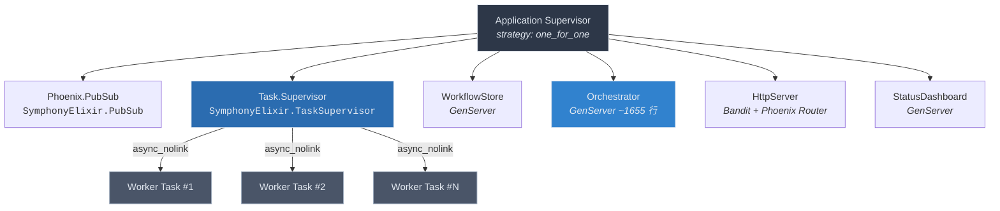
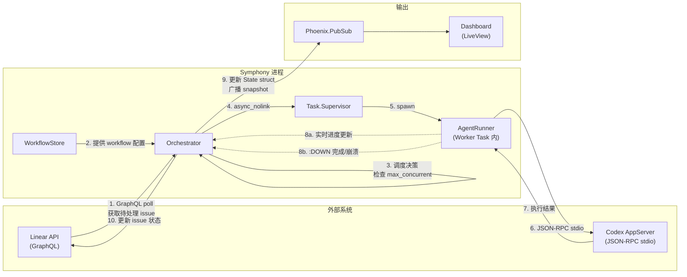

<details class="page-metadata">
<summary>页面元数据</summary>

| 属性 | 值 |
|---|---|
| 页面类型 | 架构分析 |
| 主题 | 系统架构与 OTP 进程模型 |
| 核心源文件 | `lib/symphony_elixir.ex`, `lib/symphony_elixir/orchestrator.ex` |
| 关联页面 | [01-executive-summary](01-executive-summary.md), [03-orchestrator-deep-dive](03-orchestrator-deep-dive.md), [04-worker-lifecycle](04-worker-lifecycle.md) |

</details>

# 系统架构与进程模型

Symphony 是 OpenAI 为编码 Agent 编排场景构建的参考实现。它选择 **Elixir/OTP** 作为运行时并非偶然——编码 Agent 编排的核心挑战恰好落在 OTP 的设计甜区：**大量并发且相互独立的 worker 任务**、**单个 worker 崩溃不得拖垮整个系统**、**实时状态广播与可观测性**。OTP 的 Supervisor 树、GenServer 状态机、PubSub 消息总线，以及 "let it crash" 哲学，为这些需求提供了开箱即用的原语，而不需要自行搭建进程管理、心跳探测或消息队列中间件。

本文从三个层面拆解 Symphony 的运行时架构：**OTP 监督树拓扑**、**进程间通信模式**、**端到端数据流**。

---

## OTP 监督树

Symphony 的 Application 模块（`lib/symphony_elixir.ex`）在启动时声明了一棵扁平的 **one_for_one** 监督树，包含六个子进程。



**关键设计决策**：

- **`one_for_one` 策略**：任何一个子进程崩溃时，**只重启该进程本身**，不影响兄弟进程。这意味着 HttpServer 挂掉不会重启 Orchestrator，WorkflowStore 重载失败不会中断正在执行的 Worker。
- **Task.Supervisor 独立于 Orchestrator**：Worker Task 通过 `Task.Supervisor.async_nolink/3` 启动。`nolink` 意味着 Worker 崩溃时，其 exit signal **不会传播给 Orchestrator**——Orchestrator 仅收到一个 `:DOWN` 消息，可以从容地做清理和重试决策，而非被迫跟着崩溃。
- **无外部存储依赖**：所有运行时状态（运行中的 issue、重试计数、速率限制信息）都存放在 Orchestrator GenServer 的内存 State struct 中。没有 Redis、没有 PostgreSQL、没有文件系统持久化。这是一个**有意的简化**——进程重启意味着状态归零，但对于"从 Linear 重新拉取 issue 列表"的场景，这完全可接受。

> **源码参考**：`lib/symphony_elixir.ex` — `start/2` 函数中的 `children` 列表定义了完整的监督树拓扑。

---

## 六大核心进程

### Phoenix.PubSub

**职责**：进程间事件分发总线。Orchestrator 将状态快照、worker 完成事件等广播到 PubSub topic；StatusDashboard 和 LiveView 前端订阅这些 topic 以实现实时更新。

**为什么不直接 send/2**：PubSub 解耦了生产者和消费者。Orchestrator 不需要知道有多少个 Dashboard 实例或 LiveView 连接在监听——它只管往 topic 里广播，订阅者按需消费。

### Task.Supervisor

**职责**：管理所有 Worker Task 的生命周期。每个 Linear issue 被调度执行时，Orchestrator 调用 `Task.Supervisor.async_nolink(SymphonyElixir.TaskSupervisor, fn -> ... end)` 来启动一个独立的 Task 进程。

**隔离保证**：`async_nolink` 确保 Worker Task 与 Orchestrator 之间没有 link 关系。Worker 异常退出时：
1. Task.Supervisor 不会尝试重启它（Task 默认是 `:temporary`）
2. Orchestrator 通过 `Process.monitor/1` 得到的 `:DOWN` 消息感知到崩溃
3. Orchestrator 在自己的 `handle_info({:DOWN, ...})` 中执行清理和重试逻辑

### WorkflowStore

**职责**：GenServer，负责解析 `WORKFLOW.md` 文件并缓存解析结果。同时通过文件系统监控（file watcher）检测配置变更，触发**热重载**——用户修改 workflow 定义后无需重启服务。

**与 Orchestrator 的交互**：WorkflowStore 不直接推送变更给 Orchestrator。Orchestrator 在每次 poll tick 时主动从 WorkflowStore 读取最新配置，实现了**拉模式**的松耦合。

### Orchestrator

**职责**：Symphony 的**大脑**。这个约 1655 行的 GenServer 承担了核心调度职责：

- **定时轮询 Linear API**（通过 GraphQL）获取待处理的 issue
- **并发调度**：根据 `max_concurrent` 限制决定是否派发新的 Worker
- **生命周期跟踪**：通过 State struct 维护 `running`、`claimed`、`completed_this_session` 等 MapSet/Map
- **重试管理**：通过 `retry_attempts` map 追踪每个 issue 的重试次数和策略
- **速率限制感知**：通过 `codex_totals` 和 `codex_rate_limits` 字段跟踪 Codex API 的用量和限流信息
- **可观测性广播**：每次状态变更后通过 PubSub 发送 snapshot

### HttpServer

**职责**：基于 **Bandit**（纯 Elixir HTTP 服务器）+ **Phoenix Router** 构建，同时服务：
- **LiveView Dashboard**：浏览器可实时查看 Orchestrator 状态
- **REST API**：供外部系统查询状态或触发操作

### StatusDashboard

**职责**：GenServer，维护 Dashboard 的**数据快照**。它订阅 PubSub 事件，将 Orchestrator 广播的原始事件聚合为 Dashboard 友好的视图模型，供 LiveView 渲染。

---

## Orchestrator State Struct

Orchestrator 的全部运行时状态封装在一个 `%State{}` struct 中。理解这个 struct 就理解了 Symphony 的调度核心。

| 字段 | 类型 | 语义 |
|---|---|---|
| `running` | MapSet | 当前正在执行的 issue 标识符集合 |
| `claimed` | MapSet | 已认领但可能尚未开始执行的 issue 标识符集合 |
| `monitors` | Map (ref => id) | Process monitor 引用到 issue 标识符的映射，用于 `:DOWN` 消息路由 |
| `retry_attempts` | Map (id => RetryEntry) | 每个 issue 的重试次数和重试策略信息 |
| `completed_this_session` | Map (id => outcome) | 本次 session 内已完成的 issue 及其结果 |
| `codex_totals` | Map (key => %{input, output}) | Codex API 的 token 用量累计 |
| `codex_rate_limits` | any | 最新的 Codex API 速率限制信息 |
| `poll_interval_ms` | integer | 轮询 Linear API 的间隔毫秒数 |
| `max_concurrent` | integer | 最大并发 Worker 数 |
| `consecutive_empty_polls` | integer | 连续空轮询计数（用于自适应退避） |
| `config_ok?` | boolean | 配置是否有效的标志位 |

**无外部持久化**意味着：进程重启后 `running`、`claimed` 等字段归零。但由于 Orchestrator 每次 tick 都会重新从 Linear API 拉取 issue 列表，这种"遗忘"是安全的——重启后的首次 poll 会重建 claimed 集合。

> **源码参考**：`lib/symphony_elixir/orchestrator.ex` — `defstruct` 定义和 `handle_info(:tick, ...)` 中的调度逻辑。

---

## 进程间通信模式

六个进程之间的通信遵循清晰的模式边界，没有"任意进程对任意进程"的混乱消息流。

```mermaid
flowchart LR
    subgraph SUP["监督树"]
        Orch["Orchestrator<br/>GenServer"]
        TaskSup["Task.Supervisor"]
        WS["WorkflowStore<br/>GenServer"]
        PubSub["Phoenix.PubSub"]
        Dash["StatusDashboard<br/>GenServer"]
        Http["HttpServer"]
    end

    subgraph WORKERS["Worker 进程池"]
        W1["Worker Task"]
        W2["Worker Task"]
    end

    Orch -- "async_nolink 启动" --> TaskSup
    TaskSup -- "spawn" --> W1
    TaskSup -- "spawn" --> W2

    W1 -. "send("pid, ❴:codex_worker_update, ...❵")" .-> Orch
    W2 -. "send("pid, ❴:codex_worker_update, ...❵")" .-> Orch
    W1 -. ":DOWN message" .-> Orch
    W2 -. ":DOWN message" .-> Orch

    Orch -- "broadcast snapshot" --> PubSub
    PubSub -- "subscribe" --> Dash
    PubSub -- "subscribe" --> Http

    Orch -. "GenServer.call 读取配置" .-> WS
```

**四种通信路径**：

1. **Orchestrator --> Worker**（启动）：Orchestrator 调用 `Task.Supervisor.async_nolink/3`，传入要执行的函数闭包。这是唯一的"下行"通信——之后 Orchestrator 不再主动给 Worker 发消息。

2. **Worker --> Orchestrator**（实时更新）：Worker 在执行过程中通过 `send(orchestrator_pid, {:codex_worker_update, ...})` 向 Orchestrator 推送进度更新。这是**直接 send**，不走 PubSub，因为这是 1:1 的定向通信且对延迟敏感。

3. **Worker --> Orchestrator**（终止信号）：Worker 进程退出（正常完成或崩溃）时，Orchestrator 通过 `Process.monitor/1` 注册的 monitor 收到 `:DOWN` 消息。Orchestrator 在 `handle_info({:DOWN, ref, :process, _pid, reason})` 中通过 `monitors` map 查找对应的 issue 标识符，执行清理。

4. **Orchestrator --> Dashboard**（状态广播）：Orchestrator 通过 `Phoenix.PubSub.broadcast/3` 发送状态快照。StatusDashboard 和 LiveView 进程订阅对应 topic，接收更新。这是**扇出**模式——一次广播，多个消费者。

5. **Orchestrator --> WorkflowStore**（配置读取）：Orchestrator 在 tick 回调中通过 `GenServer.call/2` 同步读取 WorkflowStore 的最新配置。这是**拉模式**——不是 WorkflowStore 推配置给 Orchestrator，而是 Orchestrator 按需拉取。

---

## 端到端数据流

从外部 issue 进入系统到最终执行完成，数据流经以下路径：



**逐步拆解**：

**第 1 步 -- 轮询**：Orchestrator 的 `:tick` 定时器触发后，通过 GraphQL 请求 Linear API 获取当前待处理的 issue 列表。轮询间隔由 `poll_interval_ms` 控制，`consecutive_empty_polls` 计数器用于自适应退避——连续多次空轮询后自动延长间隔。

**第 2-3 步 -- 调度决策**：Orchestrator 从 WorkflowStore 读取最新的 workflow 配置，然后对比当前 `running` MapSet 的大小和 `max_concurrent` 限制，决定是否可以派发新任务。已在 `claimed` 或 `completed_this_session` 中的 issue 会被跳过。

**第 4-5 步 -- Worker 启动**：通过 `Task.Supervisor.async_nolink/3` 在 Task.Supervisor 下启动一个新进程。Orchestrator 同时调用 `Process.monitor/1` 获取 monitor 引用，存入 `monitors` map。

**第 6-7 步 -- Agent 执行**：Worker Task 内部的 AgentRunner 通过 **JSON-RPC over stdio** 与 Codex AppServer 通信。这是一个阻塞调用——Worker 进程在等待 Codex 响应期间挂起，但由于每个 Worker 是独立进程，不影响其他 Worker 或 Orchestrator。

**第 8 步 -- 结果回传**：Worker 执行过程中通过 `send/2` 向 Orchestrator 推送实时更新（8a）。执行完成或崩溃时，monitor 机制自动向 Orchestrator 发送 `:DOWN` 消息（8b）。

**第 9-10 步 -- 收尾**：Orchestrator 更新内部 State struct（从 `running` 移除、写入 `completed_this_session`），通过 PubSub 广播最新状态快照，并向 Linear API 回写 issue 状态。

---

## 容错与隔离设计

Symphony 的容错策略可以总结为一句话：**让 Worker 放心崩溃，Orchestrator 负责收拾**。

| 故障场景 | 系统行为 |
|---|---|
| 单个 Worker Task 崩溃 | Orchestrator 收到 `:DOWN`，从 `running` 移除，查询 `retry_attempts` 决定是否重试 |
| Codex AppServer 无响应 | Worker Task 阻塞直至超时，最终异常退出，走上述 `:DOWN` 路径 |
| Orchestrator 自身崩溃 | Supervisor 按 `one_for_one` 重启；State 归零，下次 tick 重新从 Linear 拉取重建 |
| WorkflowStore 崩溃 | Supervisor 重启，重新解析 WORKFLOW.md；Orchestrator 下次 tick 读到新实例 |
| HttpServer 崩溃 | Supervisor 重启；不影响 Orchestrator 调度，仅 Dashboard 短暂不可用 |
| PubSub 崩溃 | Supervisor 重启；Dashboard 暂时收不到更新，Orchestrator 调度不受影响 |

这种隔离性来自三个层面的协同：
- **Supervisor `one_for_one`** 保证故障不级联
- **`async_nolink`** 保证 Worker 崩溃不拖垮 Orchestrator
- **无共享状态** 保证任何进程重启后都能从外部数据源（Linear API、WORKFLOW.md 文件）重建状态

---

## 设计权衡

**纯内存状态，无持久化**：如果 Orchestrator 进程重启，所有 `running`、`retry_attempts` 等信息丢失。这是可接受的——Linear API 是 issue 状态的 source of truth，重启后首次 poll 即可重建。但这也意味着 retry_attempts 的计数会被重置，一个持续失败的 issue 在 Orchestrator 重启后会重新获得完整的重试配额。

**单 Orchestrator 瓶颈**：所有调度逻辑集中在一个 GenServer 中，它是串行处理消息的。在极端高并发场景下，Orchestrator 的 mailbox 可能成为瓶颈。但对于"编码 Agent 编排"这个场景，并发度通常在几十到上百的量级，单 GenServer 的吞吐量绑绑有余。

**PubSub 的 at-most-once 语义**：Phoenix.PubSub 不保证消息送达。如果 Dashboard 进程在广播时恰好不可用，那条 snapshot 就丢了。对于 Dashboard 这种"展示最新状态"的场景，丢一条不影响正确性——下次广播就会带来最新快照。

---

## 相关页面

- [01-executive-summary](01-executive-summary.md) -- 项目概览与定位
- [03-orchestrator-deep-dive](03-orchestrator-deep-dive.md) -- Orchestrator GenServer 的 tick 循环、调度算法与重试策略详解
- [04-worker-lifecycle](04-worker-lifecycle.md) -- Worker Task 的启动、执行、更新上报与终止流程
- [05-workflow-configuration](05-workflow-configuration.md) -- WORKFLOW.md 的语法、解析与热重载机制
