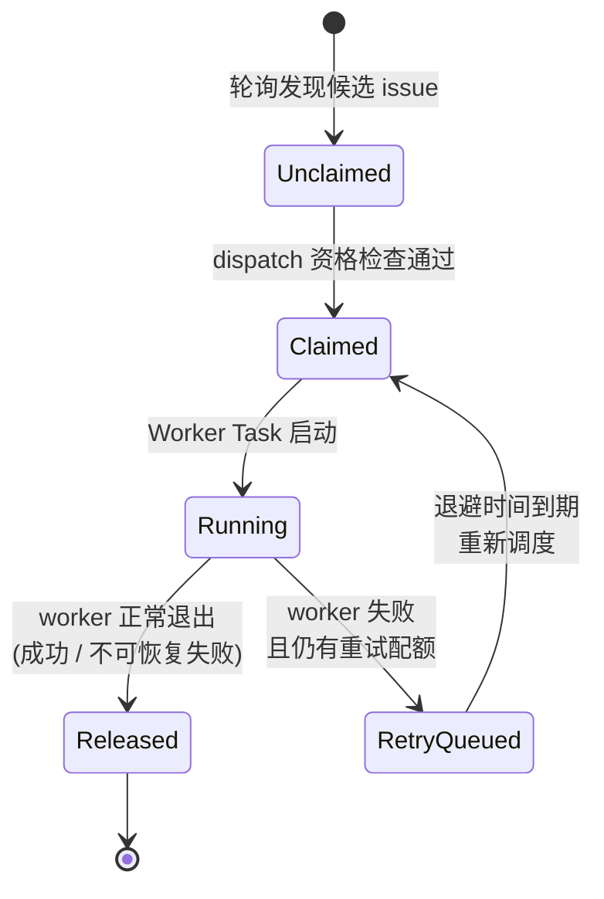
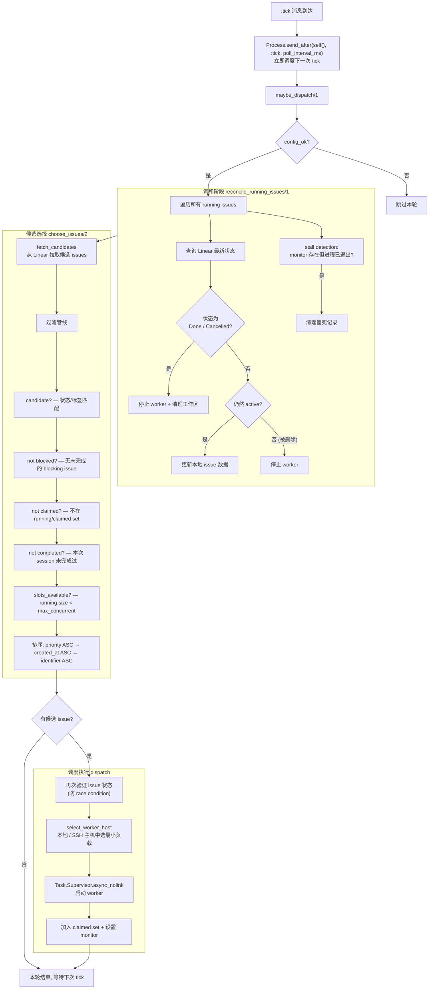
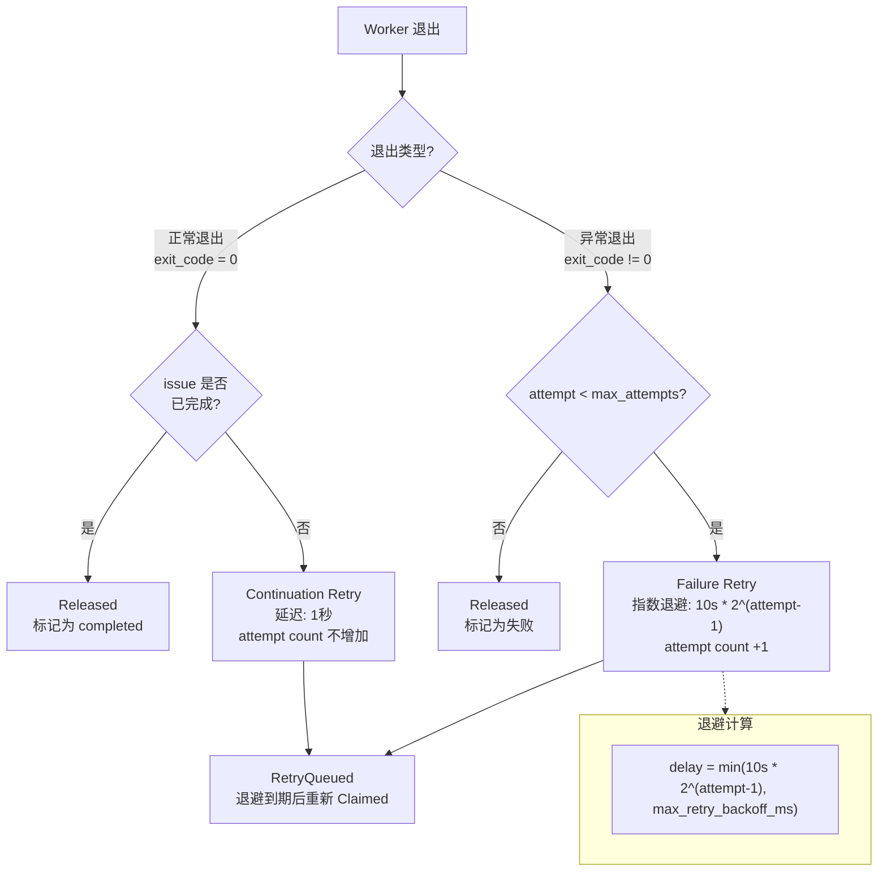

  
页面元数据

  | 属性 | 值 |
  |------|-----|
  | 页面编号 | 03 |
  | 标题 | 编排状态机与调度引擎 |
  | 主要源文件 | `elixir/lib/symphony_elixir/orchestrator.ex` |
  | 规范引用 | `SPEC.md:389-520` |
  | 关联页面 | [02 - 架构总览](02-architecture-overview.md), [04 - Worker 执行模型](04-worker-execution-model.md) |

# 编排状态机与调度引擎

Orchestrator 是 Symphony 的大脑——它决定哪个 issue 在什么时候、由谁来执行。整个模块实现为一个约 1655 行的 Elixir GenServer（`orchestrator.ex`），内部维护着一台 **Issue 状态机**、一个 **轮询调度循环** 和一套 **多层重试策略**，三者协同驱动 issue 从"被发现"到"被完成"的全部生命周期。

---

## Issue 状态机

每个进入 Orchestrator 视野的 issue 都严格经过五个状态。状态转换由 Orchestrator 内部事件驱动，外部不可直接跳转。

**五个状态的语义：**

- **Unclaimed** — issue 出现在候选列表中，尚未被任何 Orchestrator 实例认领。这是轮询调度循环的起点。
- **Claimed** — Orchestrator 通过 dispatch 资格检查后将 issue 标记为"已认领"，加入 claimed set。此时 worker 尚未启动，但其他 Orchestrator 实例不会再选择这个 issue。
- **Running** — `Task.Supervisor.async_nolink` 已经启动了 worker 进程，monitor 已设置。issue 正在被实际处理。
- **RetryQueued** — worker 异常退出，但 attempt count 未达到 `agent.max_attempts` 上限。issue 进入退避等待队列，等待重新调度。
- **Released** — 终态。worker 完成执行（无论成功与否），issue 从所有活跃集合中移除。

**关键设计约束：** 状态转换是单向的——不存在从 Released 回到 Unclaimed 的路径。一个 issue 在单次 session 中被标记为 completed 后，即使 Linear 端状态发生变化，Orchestrator 也不会重新拾取它（`not completed?` 过滤器）。

---

## 轮询调度循环

Orchestrator 不依赖外部推送，而是通过 **自调度的 `:tick` 消息** 驱动整个调度循环。每次 tick 触发 `handle_info(:tick, state)`，执行一条完整的调度管线。

**调度管线的三个关键阶段：**

**1. 调和（Reconciliation）** 是每轮 tick 的第一步。Orchestrator 不信任本地缓存，而是主动向 Linear API 查询每个 running issue 的最新状态。这保证了即使 Linear 端发生了人工干预（手动关闭 issue、删除 issue），Orchestrator 也能及时做出反应。**Stall detection** 是调和阶段的安全网——如果一个 issue 的 monitor 仍然存在但对应的 worker 进程已经退出（例如 BEAM VM 内部异常），调和逻辑会清理这些僵死记录，防止 slot 被永久占用。

**2. 候选选择（Choose Issues）** 采用 **五层过滤管线** 逐步缩小范围。过滤顺序是精心设计的：先做轻量级的集合查找（`not claimed?`、`not completed?`），再做需要遍历依赖关系的检查（`not blocked?`），最后才检查全局约束（`slots_available?`）。排序规则确保**高优先级、先创建的 issue 优先被处理**，`identifier` 作为最终的确定性 tiebreaker。

**3. 调度执行（Dispatch）** 开始前会**再次验证 issue 状态**，因为从 fetch candidates 到 dispatch 之间可能已经过去了若干毫秒，issue 状态可能已被其他 Orchestrator 实例或人工操作改变。`select_worker_host` 在本地节点和配置的 SSH 远程主机之间选择当前负载最低的目标，实现简单的负载均衡。

---

## 重试策略

Worker 退出后，Orchestrator 根据退出类型和剩余配额决定是否重试。两种重试路径有完全不同的语义和退避策略。

**Continuation retry 与 Failure retry 的根本区别：**

- **Continuation retry** 处理的场景是 worker 正常退出了（进程级别没有错误），但 issue 本身还没做完。典型情况是 Codex worker 在单次调用中用尽了 token 额度或遇到了上下文长度限制——它干净地退出，但任务还需要继续。这种情况下 **1 秒延迟、不增加 attempt count**，因为这不是"失败"，而是"分段完成"。
- **Failure retry** 处理的是真正的异常——worker crash、非零退出码、超时等。每次 failure retry 都会 **增加 attempt count** 并使用 **指数退避**：第 1 次重试等 10 秒，第 2 次等 20 秒，第 3 次等 40 秒，以此类推，直到达到 `max_retry_backoff_ms` 上限。

**`agent.max_attempts`**（默认值 3）控制的是 failure retry 的次数上限。Continuation retry 不受此限制——理论上一个 issue 可以被 continuation retry 无限次（实际上受 Linear 端状态变化和调和逻辑约束）。

---

## Token 统计与追踪

Orchestrator 在调度之外还承担着 **token 使用量的聚合追踪** 职责。Worker 在执行过程中会周期性地上报 Codex token 使用量，Orchestrator 负责解析、计算增量并记录。

**数据提取逻辑** 需要处理多种 payload 格式——worker 上报的数据可能是 `codex_response` 内嵌套的 `usage` 对象，也可能是扁平结构直接包含 `input_tokens` / `output_tokens`。Orchestrator 对两种格式做了统一处理。

**增量计算** 采用 `delta = 新总量 - 上次记录的总量` 的方式。这意味着即使 worker 多次上报同一个累计值（网络重传或幂等上报），Orchestrator 计算出的增量也是零，不会导致重复计数。计算出的 delta 用于 **dashboard 实时展示** 和 **rate limit 追踪**——当某个 worker 的 token 消耗接近限额时，Orchestrator 可以据此调整调度策略。

---

## 设计权衡与约束

**轮询 vs 事件驱动。** Orchestrator 选择了轮询模型而非 webhook/事件驱动。这意味着状态变化的感知存在最多一个 `poll_interval_ms` 的延迟，但换来了更简单的错误恢复——不需要处理 webhook 丢失、乱序、重放等问题。调和阶段的存在进一步降低了对实时性的依赖。

**单次 session 完成标记。** `not completed?` 过滤器意味着 Orchestrator 重启后（新 session），之前标记为 completed 的 issue 可以被重新拾取。这是有意为之——如果 issue 在 Linear 端重新变为 active 状态，新的 Orchestrator session 应该能够感知并处理它。

**`async_nolink` 的隔离性。** 使用 `Task.Supervisor.async_nolink` 而非 `async` 意味着 worker 的崩溃不会级联到 Orchestrator 进程。Orchestrator 通过 monitor 得知 worker 退出，而非通过 link 收到 EXIT 信号。这是整个系统容错设计的关键一环。

---

## Sources

| 来源 | 内容 |
|------|------|
| `elixir/lib/symphony_elixir/orchestrator.ex` | 核心状态机、调度循环、重试策略、token 统计的全部实现（约 1655 行） |
| `SPEC.md:389-520` | 编排状态机的规范定义，包括状态枚举、转换规则和调和逻辑 |

---

## 相关页面

- [02 - 架构总览](02-architecture-overview.md) — Orchestrator 在 Symphony 整体架构中的位置
- [04 - Worker 执行模型](04-worker-execution-model.md) — Worker Task 的启动、执行和退出机制
- [05 - 配置与工作流](05-configuration-workflow.md) — `WORKFLOW.md` 配置如何影响候选 issue 的筛选
- [06 - Linear 集成](06-linear-integration.md) — 调和阶段依赖的 Linear API 交互细节
