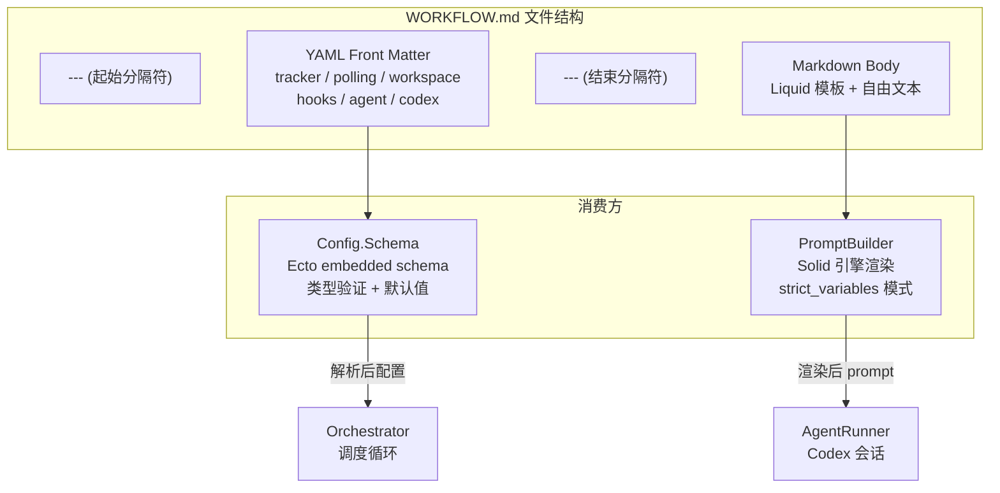
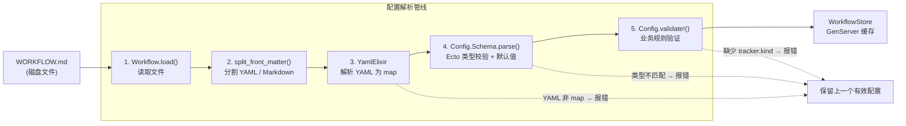

<details class="page-metadata">
  <summary>页面元数据</summary>

  - **目标仓库**: openai/symphony
  - **文档范围**: WORKFLOW.md 合约格式、配置解析管线、热重载机制、Prompt 模板引擎
  - **关键源码**: `elixir/lib/symphony_elixir/workflow.ex`, `config.ex`, `config/schema.ex`, `prompt_builder.ex`, `workflow_store.ex`
  - **规范章节**: SPEC.md 5.2 -- 5.4, 6.1 -- 6.3
  - **最后更新**: 2026-05-08
</details>

# 工作流定义与配置系统

## 配置即合约：为什么让仓库持有自己的配置

Symphony 的配置体系遵循一个核心设计原则：**配置不住在服务端，住在被管理的仓库里**。每个接入 Symphony 的代码仓库在根目录放置一个 `WORKFLOW.md` 文件，它同时承担配置清单和 prompt 模板两个职责。

这个决策带来三个直接好处：

- **版本可追溯** -- 配置随代码一起 commit，团队可以用 `git blame` 审计每一次行为变更。
- **团队自治** -- 不同仓库可以定义完全不同的 tracker 设置、并发策略、hooks 脚本，无需协调中心化的配置服务。
- **零部署切换** -- 修改 `WORKFLOW.md` 后 Symphony 自动热重载，无需重启服务或重新部署。

SPEC.md 对此的表述是："The specification intentionally keeps workflow definition in the repository, version-controlled alongside code, to maintain team-specific agent behavior and runtime settings together."

---

## WORKFLOW.md 文件结构

`WORKFLOW.md` 采用 **YAML front matter + Markdown body** 的双段格式。前半段是被 `---` 分隔符包裹的 YAML 配置块，后半段是 Liquid 兼容的 prompt 模板。

下图展示了文件的逻辑结构，以及各段落与系统组件之间的对应关系。



**解读**：YAML front matter 经过 Schema 层的类型校验后成为 Orchestrator 的运行时配置；Markdown body 则由 PromptBuilder 结合 issue 上下文渲染为每次 agent 运行的具体 prompt。两条路径互不干扰，各自独立失败。

如果文件不以 `---` 开头，整个文件内容被视为 prompt body，配置部分为空 map，全部使用默认值。

---

## 配置解析管线

从磁盘上的 `WORKFLOW.md` 到内存中可用的配置对象，经过一条五步管线。任何一步失败都会阻止配置生效，但不会导致服务崩溃。



**各步骤详解**：

**步骤 1 -- 文件读取**：`Workflow.load/0` 从应用配置或默认路径（当前工作目录下的 `WORKFLOW.md`）读取文件内容。路径支持 `~` 展开和 `$VAR` 环境变量引用。

**步骤 2 -- Front Matter 分割**：`split_front_matter/3` 查找首尾 `---` 分隔符，将文件拆为 YAML 字符串和 Markdown 字符串。返回的 workflow 对象包含 `config`（配置 map）和 `prompt_template`（模板文本）两个字段。

**步骤 3 -- YAML 解析**：调用 `YamlElixir.read_from_string/1` 将 YAML 转为 Elixir map。**规范要求 YAML 必须解码为 map/object**，非 map 结构（如数组或纯标量）直接报错。

**步骤 4 -- Schema 校验**：`Config.Schema.parse/1` 通过 Ecto embedded schema 对配置 map 做类型强转和默认值填充。每个配置段（tracker, polling, workspace 等）都是独立的 embedded schema，嵌套在根 schema 中。未识别的顶层 key 被忽略（forward compatibility）。

**步骤 5 -- 语义验证**：`Config.validate!/0` 执行业务规则检查。包括：`tracker.kind` 必须存在且值为 `"linear"` 或 `"memory"`；Linear tracker 必须提供 `api_key` 和 `project_slug`；`codex.command` 不能为空。

---

## 完整配置字段参考

以下表格覆盖 `WORKFLOW.md` front matter 中所有可用字段，按配置段分组。

### tracker -- 任务追踪器

| 字段 | 类型 | 默认值 | 说明 |
|------|------|--------|------|
| `kind` | string | **必填** | 追踪器类型，当前支持 `"linear"` 和 `"memory"` |
| `endpoint` | string | `https://api.linear.app/graphql` | Linear API 端点地址 |
| `api_key` | string | -- | API 密钥，支持 `$VAR` 引用环境变量 |
| `project_slug` | string | **Linear 必填** | Linear 项目标识符 |
| `assignee` | string | -- | issue 指派人 |
| `active_states` | string[] | `["Todo", "In Progress"]` | 被视为"活跃"的 issue 状态列表 |
| `terminal_states` | string[] | `["Closed", "Cancelled", "Canceled", "Duplicate", "Done"]` | 被视为"终态"的 issue 状态列表 |

### polling -- 轮询策略

| 字段 | 类型 | 默认值 | 说明 |
|------|------|--------|------|
| `interval_ms` | integer | `30000` | 轮询间隔（毫秒），必须大于零；运行时动态生效 |

### workspace -- 工作空间

| 字段 | 类型 | 默认值 | 说明 |
|------|------|--------|------|
| `root` | string | 系统临时目录 + `symphony_workspaces` | 工作空间根目录，支持 `~` 展开和 `$VAR` 引用；相对路径相对于 `WORKFLOW.md` 所在目录解析 |

### hooks -- 生命周期钩子

| 字段 | 类型 | 默认值 | 说明 |
|------|------|--------|------|
| `after_create` | string | `nil` | 工作空间**首次创建**后执行；失败则中止创建 |
| `before_run` | string | `nil` | 每次 agent 尝试**开始前**执行；失败则中止当前尝试 |
| `after_run` | string | `nil` | 每次 agent 尝试**结束后**执行；失败仅记录日志 |
| `before_remove` | string | `nil` | 工作空间**删除前**执行；失败不阻止清理 |
| `timeout_ms` | integer | `60000` | 所有 hook 的统一超时时间（毫秒） |

**hook 失败语义不对称**：`after_create` 和 `before_run` 的失败会中止操作流程（"hard fail"），而 `after_run` 和 `before_remove` 的失败只会被日志记录（"soft fail"）。这个设计确保环境准备阶段的错误被严格拦截，而清理阶段的错误不会导致资源泄漏。

### agent -- Agent 执行参数

| 字段 | 类型 | 默认值 | 说明 |
|------|------|--------|------|
| `max_concurrent_agents` | integer | `10` | 最大并发 agent 数；运行时动态生效 |
| `max_turns` | integer | `20` | 单次 worker 会话的最大轮次 |
| `max_retry_backoff_ms` | integer | `300000` | 指数退避上限（5 分钟） |
| `max_concurrent_agents_by_state` | map | `{}` | 按 issue 状态细分的并发上限，如 `{"Todo": 5, "In Progress": 3}` |

### codex -- Codex 运行时

| 字段 | 类型 | 默认值 | 说明 |
|------|------|--------|------|
| `command` | string | `"codex app-server"` | 启动命令，通过 `bash -lc` 执行 |
| `approval_policy` | string \| map | 实现定义 | 审批策略 |
| `thread_sandbox` | string | `"workspace-write"` | 线程级沙箱策略 |
| `turn_sandbox_policy` | map | 实现定义 | 轮次级沙箱策略 |
| `turn_timeout_ms` | integer | `3600000` | 单轮超时（1 小时） |
| `read_timeout_ms` | integer | `5000` | 读取超时（5 秒） |
| `stall_timeout_ms` | integer | `300000` | 停滞检测超时（5 分钟）；设为 <= 0 禁用 |

### worker -- Worker 节点（SSH 分布式）

| 字段 | 类型 | 默认值 | 说明 |
|------|------|--------|------|
| `ssh_hosts` | string[] | `[]` | SSH worker 主机列表 |
| `max_concurrent_agents_per_host` | integer | -- | 每台主机的最大并发 agent 数，必须大于零 |

### observability -- 可观测性

| 字段 | 类型 | 默认值 | 说明 |
|------|------|--------|------|
| `dashboard_enabled` | boolean | `true` | 是否启用状态仪表盘 |
| `refresh_ms` | integer | `1000` | 仪表盘数据刷新间隔 |
| `render_interval_ms` | integer | `16` | UI 渲染间隔（约 60fps） |

### server -- HTTP 服务

| 字段 | 类型 | 默认值 | 说明 |
|------|------|--------|------|
| `port` | integer | -- | 监听端口，>= 0 |
| `host` | string | `"127.0.0.1"` | 绑定地址 |

---

## 环境变量与路径解析

配置值中的 `$VAR_NAME` 语法触发**显式环境变量解析**。关键规则：

- **环境变量不会全局覆盖 YAML 值**。只有当配置值本身包含 `$VAR` 时才进行替换。
- `~` 在路径类字段中被展开为用户 home 目录。
- **相对路径**相对于 `WORKFLOW.md` 文件所在目录解析，最终一律规范化为绝对路径。

实际使用中最常见的场景是 `tracker.api_key` 引用 `$LINEAR_API_KEY` 环境变量，避免将密钥明文写入仓库。

---

## WorkflowStore 热重载机制

`WorkflowStore` 是一个 GenServer 进程，负责缓存解析后的 workflow 对象并自动检测文件变更。

**变更检测策略**：采用轮询而非 inotify。每 **1000ms** 生成一次文件指纹，指纹由三个分量组成：

1. 文件修改时间戳（mtime）
2. 文件大小
3. 内容哈希（`:erlang.phash2`）

三个分量中任何一个发生变化，触发完整的重新解析流程。

**容错设计**：如果重新解析失败（YAML 格式错误、Schema 校验不通过等），**保留上一个有效配置继续运行**，同时输出 operator-visible 错误日志。这保证了即使有人提交了一个格式错误的 `WORKFLOW.md`，系统不会中断服务。

**动态生效的字段**：轮询间隔（`polling.interval_ms`）、并发上限（`agent.max_concurrent_agents`）、活跃/终态列表、hooks 脚本、prompt 模板内容 -- 这些都会在下一个 orchestrator tick 时自动读取新值。

---

## Prompt 模板引擎

Markdown body 部分通过 **Solid 库**（Liquid 兼容的 Elixir 模板引擎）渲染。

**严格模式**：渲染选项为 `strict_variables: true, strict_filters: true`。模板中引用不存在的变量或过滤器时**直接报错**，而非静默忽略。这个设计把模板错误前置到开发阶段而非运行时。

**模板变量**：

| 变量 | 类型 | 说明 |
|------|------|------|
| `issue` | object | 规范化的 issue 对象，包含 `identifier`, `title`, `description`, `priority`, `state`, `labels`, `blockers`, `url` 等字段 |
| `attempt` | integer \| nil | 首次运行时为 `nil`，重试/续跑时为正整数 |

**类型序列化**：`PromptBuilder` 的 `to_solid_value/1` 函数递归地将 Elixir 结构转换为 Liquid 兼容格式。`DateTime` 转为 ISO8601 字符串；struct 先 `Map.from_struct/1` 再递归处理；map 的 key 统一转为字符串。

**默认 prompt 兜底**：当 `WORKFLOW.md` 的 Markdown body 为空时，Config 模块提供一个内置的最小模板（包含 `issue.identifier`、`issue.title`、`issue.description` 等 Liquid 变量占位符）。但**文件读取/解析失败不会静默降级为默认 prompt** -- 这属于配置错误，必须被显式处理。

---

## Dispatch Preflight 验证

每个调度 tick 开始前，Orchestrator 执行一组预检验证。验证不通过时跳过当前 tick 的调度，但维持既有 agent 的正常运行。

| 检查项 | 失败后果 |
|--------|---------|
| `WORKFLOW.md` 可读且解析成功 | 跳过调度 |
| `tracker.kind` 存在且为支持的值 | 跳过调度 |
| `tracker.api_key` 经 `$` 展开后非空 | 跳过调度 |
| `tracker.project_slug` 存在（Linear tracker 时） | 跳过调度 |
| `codex.command` 非空 | 跳过调度 |

**启动时验证**更为严格：如果以上任何一项失败，服务直接拒绝启动并输出 operator-visible 错误。

---

## 实际 WORKFLOW.md 示例

Symphony 自身的 Elixir 参考实现仓库（`elixir/WORKFLOW.md`）提供了一个完整的生产级示例：

```yaml
---
tracker:
  kind: linear
  project_slug: "symphony-0c79b11b75ea"
  active_states:
    - Todo
    - In Progress
    - Merging
    - Rework
  terminal_states:
    - Closed
    - Cancelled
    - Canceled
    - Duplicate
    - Done
polling:
  interval_ms: 5000
workspace:
  root: ~/code/symphony-workspaces
hooks:
  after_create: |
    git clone --depth 1 https://github.com/openai/symphony .
    if command -v mise >/dev/null 2>&1; then
      cd elixir && mise trust && mise exec -- mix deps.get
    fi
  before_remove: |
    cd elixir && mise exec -- mix workspace.before_remove
agent:
  max_concurrent_agents: 10
  max_turns: 20
codex:
  command: codex --config shell_environment_policy.inherit=all ...
  approval_policy: never
  thread_sandbox: workspace-write
  turn_sandbox_policy:
    type: workspaceWrite
---
```

值得注意的细节：

- **`active_states` 扩展了默认值**，增加了 `Merging` 和 `Rework` 两个自定义状态，反映了 Symphony 团队自身的 Linear 工作流。
- **`polling.interval_ms` 设为 5000**（5 秒），远低于默认的 30 秒，适用于开发迭代期间需要快速响应的场景。
- **`after_create` hook** 在创建工作空间后自动 clone 仓库并安装依赖（通过 `mise` 工具链管理器）。
- **`before_remove` hook** 在清理前执行自定义的 Mix task，用于资源回收。

---

## Sources

| 源 | 内容 |
|----|------|
| `elixir/lib/symphony_elixir/workflow.ex` | WORKFLOW.md 文件读取、front matter 分割、YAML 解析 |
| `elixir/lib/symphony_elixir/config.ex` | 配置验证、语义检查、默认 prompt 模板 |
| `elixir/lib/symphony_elixir/config/schema.ex` | Ecto embedded schema 定义、字段类型与默认值、changeset 校验 |
| `elixir/lib/symphony_elixir/prompt_builder.ex` | Solid/Liquid 模板渲染、strict 模式、类型序列化 |
| `elixir/lib/symphony_elixir/workflow_store.ex` | GenServer 缓存、轮询检测、热重载容错 |
| SPEC.md 5.2 -- 5.4 | WORKFLOW.md 格式规范、prompt 模板合约 |
| SPEC.md 6.1 -- 6.3 | 配置解析管线、动态重载语义、dispatch preflight 验证 |
| `elixir/WORKFLOW.md` | 参考实现的生产级 WORKFLOW.md 示例 |

---

## 相关页面

- [03 - 核心调度循环](./03-core-loop.md) -- Orchestrator 如何消费 WorkflowStore 中的配置
- [05 - Codex 集成与沙箱](./05-codex-integration.md) -- `codex` 配置段如何传递给 Codex app-server
- [06 - Hooks 与工作空间管理](./06-hooks-and-workspace.md) -- hooks 生命周期钩子的执行细节
