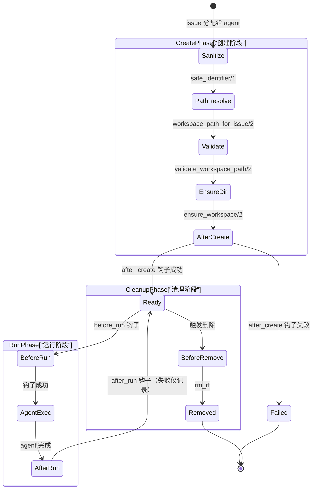
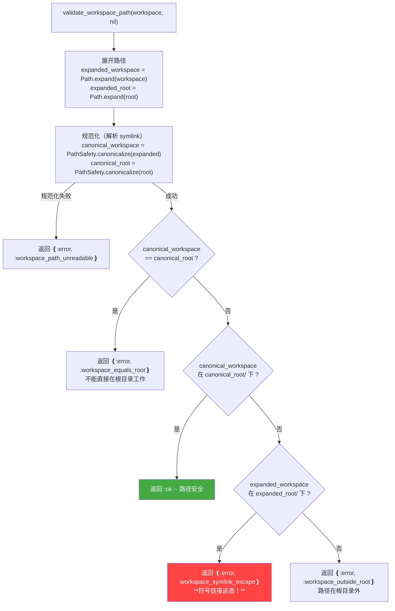

<details class="page-metadata">
  <summary>页面元数据</summary>

  | 属性 | 值 |
  |------|-----|
  | 项目 | openai/symphony |
  | 页面编号 | 05 |
  | 主题 | 工作区隔离与生命周期 |
  | 涉及源码 | `elixir/lib/symphony_elixir/workspace.ex`, `elixir/lib/symphony_elixir/path_safety.ex` |
  | 规范章节 | SPEC.md 9.1 -- 9.5 |
  | 上次更新 | 2026-05-08 |
</details>

# 工作区隔离与生命周期

Symphony 的核心场景是**多个 Codex Agent 并行处理不同 issue**。如果两个 agent 共享同一个文件系统目录，一个 agent 的 `git checkout feature-A` 会立即破坏另一个正在 `feature-B` 上编译的 agent 的工作树。这不是边缘情况，而是并行执行的常态。

`Workspace` 模块（`workspace.ex`，约 483 行）的职责很明确：**为每个 issue 创建独立的文件系统沙箱，管理其生命周期，并在安全边界内完成所有操作**。本页覆盖创建、验证、钩子执行、远程模式和清理的完整流程。

---

## 工作区生命周期

从 issue 进入系统到工作区被回收，一个工作区会经历以下阶段。



上图展示了工作区从创建到销毁的完整状态流转。**创建阶段**是最关键的，任何一步失败都会中止 agent 启动。**运行阶段**可以循环多次（同一 issue 重试时复用已有工作区）。**清理阶段**中 `before_remove` 钩子的失败不会阻止删除操作。

---

## 创建流程详解

`create_for_issue/2` 是工作区创建的入口，它按严格顺序执行五个步骤：

**1. 标识符清洗** -- `safe_identifier/1` 将 issue identifier 中所有非 `[A-Za-z0-9._-]` 字符替换为下划线。这保证目录名在任何操作系统上都是安全的，也防止了通过 issue 标题注入路径分隔符的攻击。

```elixir
defp safe_identifier(identifier) do
  String.replace(identifier || "issue", ~r/[^a-zA-Z0-9._-]/, "_")
end
```

**2. 路径拼接** -- `workspace_path_for_issue/2` 将清洗后的标识符拼接到配置的 `workspace.root` 下。本地模式会立即调用 `PathSafety.canonicalize/1` 解析符号链接；远程模式返回原始拼接结果（符号链接解析在远程主机上没有意义）。

**3. 路径安全验证** -- 下一节详述。

**4. 目录确保** -- `ensure_workspace/2` 的本地逻辑：
- 路径已存在且是目录 -- 直接复用，`created? = false`
- 路径已存在但不是目录 -- 删除后重建，`created? = true`
- 路径不存在 -- 创建目录，`created? = true`

**5. 创建后钩子** -- 仅当 `created? = true` 时触发 `after_create` 钩子。典型用途是 `git clone`。

---

## 路径安全验证

路径验证是防御**符号链接逃逸攻击**的关键屏障。攻击场景：如果恶意 issue 标题经过清洗后仍能指向一个符号链接，该链接指向 workspace root 之外的目录（如 `/etc` 或用户 HOME），agent 就会在不受控的位置执行代码。

以下流程图展示了本地模式下 `validate_workspace_path/2` 的完整决策逻辑。



验证逻辑的精妙之处在于**第三个分支**：如果 `expanded` 路径看起来在 root 下（字符串前缀匹配），但 `canonical`（解析 symlink 后的真实路径）不在 root 下，这说明**存在一个 symlink 把路径引向了 root 外部**。这正是符号链接逃逸攻击的特征，系统会明确拒绝并返回 `:workspace_symlink_escape` 错误。

**远程模式的验证则简化为基本的输入清洗**：拒绝空字符串、包含换行符（`\n`、`\r`）或 null 字节（`\0`）的路径。这是因为远程主机上的路径无法从本地解析符号链接。

### PathSafety.canonicalize/1

路径规范化模块（`path_safety.ex`）逐段遍历路径，对每个 segment 调用 `File.lstat/1`：

- **符号链接** -- 读取链接目标（`:file.read_link_all/1`），将目标展开为绝对路径，**递归解析**（处理链式 symlink）
- **普通文件/目录** -- 追加到已解析列表，继续下一个 segment
- **不存在的路径** -- 将剩余 segment 拼接到当前已解析路径（工作区目录在验证时可能尚未创建）
- **权限错误等** -- 返回 `{:error, reason}`

---

## 生命周期钩子

钩子是工作区与外部工具（Git、CI 等）的集成点。SPEC.md 9.4 定义了四种钩子，Symphony 的 Elixir 实现为每种钩子提供了本地和远程两种执行路径。

| 钩子 | 触发时机 | 典型用途 | 失败处理 |
|------|----------|----------|----------|
| `after_create` | 工作区**首次创建**后（`created? = true`） | `git clone <repo>` -- 初始化仓库 | **致命**：返回错误，agent 不启动 |
| `before_run` | 每次 agent 运行**前** | `git fetch origin && git checkout main` -- 重置到最新状态 | **致命**：返回错误，本次运行取消 |
| `after_run` | agent 运行**后** | 提交结果、推送分支、触发 CI | **非致命**：记录日志，不影响结果 |
| `before_remove` | 删除工作区**前** | 归档日志、清理远程资源 | **非致命**：记录日志，删除照常进行 |

### 执行机制

**本地模式**通过 shell 启动钩子命令：

```elixir
System.cmd("sh", ["-lc", command], cd: workspace, stderr_to_stdout: true)
```

`-l` 标志加载登录 shell 的环境变量（如 `PATH`、SSH 密钥代理等），这对 `git` 命令正常工作至关重要。`cd: workspace` 确保命令在正确的工作区目录中执行。

**远程模式**通过 `SSH.run/3` 在远程主机执行相同的命令。

### 超时控制

所有钩子共享一个超时值：`Config.settings!().hooks.timeout_ms`（SPEC 默认 60 秒）。实现采用 Elixir 的 `Task` 模式：

```elixir
task = Task.async(fn -> System.cmd("sh", ["-lc", command], ...) end)

case Task.yield(task, timeout_ms) do
  {:ok, cmd_result} -> handle_hook_command_result(cmd_result, ...)
  nil ->
    Task.shutdown(task, :brutal_kill)
    {:error, {:workspace_hook_timeout, hook_name, timeout_ms}}
end
```

`Task.yield/2` 等待指定时间。如果钩子在时限内完成，正常处理结果；如果超时，`Task.shutdown(task, :brutal_kill)` **立即终止**钩子进程及其所有子进程，返回超时错误。这防止了失控的 `git clone` 或网络操作无限阻塞 agent 调度。

---

## 远程工作区（SSH 模式）

当配置了 `worker_host` 时，Symphony 通过 SSH 在远程主机上管理工作区。这带来了三个额外的复杂度。

**目录创建**使用一段精心构造的 shell 脚本，通过 SSH 发送到远程主机执行。脚本完成后输出 `__SYMPHONY_WORKSPACE__` 标记，Symphony 从 SSH 输出中解析该标记后的内容来确认工作区路径和创建状态。

**波浪号扩展**是远程模式的独特问题。本地的 `Path.expand/1` 解析的是本机的 `HOME`，而远程主机的 `HOME` 可能完全不同。`remote_shell_assign/2` 函数生成一段 shell 代码，在远程主机上正确处理 `~` 和 `~/...` 路径：

```elixir
defp remote_shell_assign(variable_name, raw_path) do
  [
    "#{variable_name}=#{shell_escape(raw_path)}",
    "case \"$#{variable_name}\" in",
    " '~') #{variable_name}=\"$HOME\" ;;",
    " '~/'*) #{variable_name}=\"$HOME/${#{variable_name}#~/}\" ;;",
    "esac"
  ] |> Enum.join("\n")
end
```

**Shell 转义**使用单引号包裹策略（`shell_escape/1`）：将值用单引号括起来，内部的单引号替换为 `'"'"'`（结束单引号 + 双引号包裹的单引号 + 重新开始单引号）。这是 POSIX shell 下最安全的转义方式，防止命令注入。

---

## 清理

**单工作区删除** -- `remove/2`：
1. 验证路径安全（与创建时相同的 `validate_workspace_path/2`）
2. 执行 `before_remove` 钩子（失败仅记录）
3. `File.rm_rf/1`（本地）或 SSH `rm -rf`（远程）

**批量删除** -- `remove_issue_workspaces/2`：
针对某个 issue，遍历所有已配置的 worker host（包括本地），删除该 issue 对应的工作区。这在 issue 关闭或需要强制重置时使用。

清理前的路径安全验证是**不可跳过的**。即使是删除操作，如果路径指向了 workspace root 之外，`rm_rf` 的后果不堪设想。

---

## 安全不变量总结

SPEC.md 9.5 定义了三条硬性安全规则，`Workspace` 模块的每个公开函数都必须遵守：

1. **Agent 只能在 per-issue 工作区路径内启动** -- `create_for_issue/2` 返回的路径是 agent 的执行根目录
2. **工作区路径必须位于配置的 workspace root 内** -- `validate_workspace_path/2` 通过规范化路径 + 前缀匹配 + symlink 逃逸检测三重保障
3. **目录名只包含安全字符** -- `safe_identifier/1` 将 `[^A-Za-z0-9._-]` 替换为下划线，从源头消除路径注入

---

## Sources

- [`elixir/lib/symphony_elixir/workspace.ex`](https://github.com/openai/symphony/blob/main/elixir/lib/symphony_elixir/workspace.ex) -- 工作区管理完整实现
- [`elixir/lib/symphony_elixir/path_safety.ex`](https://github.com/openai/symphony/blob/main/elixir/lib/symphony_elixir/path_safety.ex) -- 路径规范化与 symlink 解析
- [SPEC.md 9.1--9.5](https://github.com/openai/symphony/blob/main/SPEC.md) -- 工作区规范（布局、创建复用、钩子、安全不变量）

---

## 相关页面

- [02 -- 架构总览](./02-architecture-overview.md) -- Workspace 模块在系统中的位置
- [03 -- 配置系统](./03-configuration-system.md) -- `workspace.root` 和 `hooks.timeout_ms` 的配置方式
- [04 -- 会话管理](./04-session-management.md) -- agent 会话如何绑定到特定工作区
- [06 -- SSH 与远程执行](./06-ssh-remote-execution.md) -- 远程工作区依赖的 SSH 基础设施
