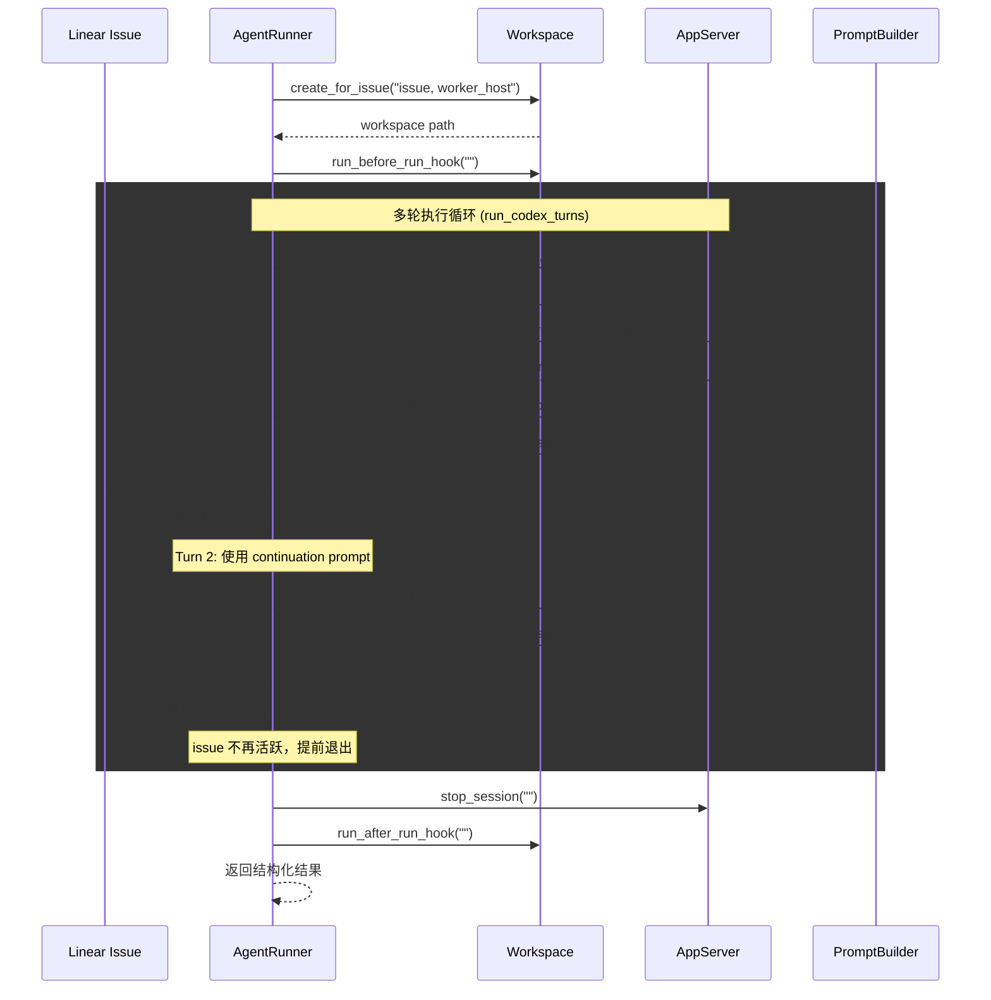
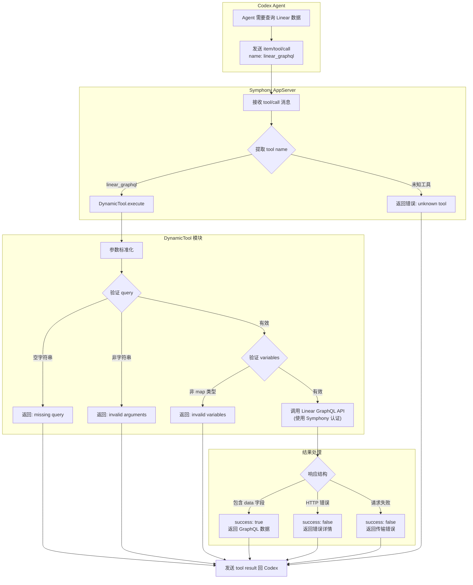

<details class="page-metadata">
<summary>Page Metadata</summary>

| Field | Value |
|---|---|
| Page ID | 06-codex-integration |
| Title | Codex Agent 集成协议 |
| Topic | Symphony 与 Codex app-server 的通信协议、多轮编排、动态工具 |
| Audience | 平台工程师、系统集成者、需要理解 agent 执行链路的开发者 |
| Prerequisites | 了解 JSON-RPC 2.0 基础、Elixir/OTP 进程模型、[Symphony 架构概览](01-executive-summary.md) |
| Sources | `elixir/lib/symphony_elixir/agent_runner.ex`, `elixir/lib/symphony_elixir/codex/app_server.ex`, `elixir/lib/symphony_elixir/codex/dynamic_tool.ex`, `SPEC.md:521-680` |

</details>

# Codex Agent 集成协议

Symphony 和 Codex 之间的关系不是"调用一个 API 然后等结果"。它更像是 **启动一个子进程，然后通过 stdio 管道与它持续对话**。Symphony 扮演的是编排者角色——它决定何时开始、何时继续、何时停止；Codex 扮演的是执行者角色——它在隔离的工作区中读写代码、运行命令、完成任务。两者之间的全部通信，都发生在一条 JSON-RPC 2.0 over stdio 的管道上。

这种设计意味着 Symphony 对 Codex 的控制粒度远超普通 API 调用：它管理进程生命周期、逐行解析流式输出、处理审批请求、注入动态工具，并在每轮结束后根据外部状态（Linear issue 是否仍然活跃）决定是否继续。

本文拆解这条集成链路的三个层面：**AgentRunner 的多轮编排逻辑**、**AppServer 的 JSON-RPC 会话协议**、以及 **Dynamic Tool 的运行时工具注入机制**。

---

## AgentRunner：多轮执行编排

`AgentRunner`（`agent_runner.ex`，约 203 行）是 Symphony 执行一个 issue 的入口。它不直接与 Codex 通信，而是负责 **工作区准备、hook 执行、多轮调度** 这三件事。

**核心执行流程**如下：

1. **选择 worker host** 并创建隔离工作区（`Workspace.create_for_issue`）
2. **执行 before_run hook**——在 Codex 启动前完成环境准备
3. **启动多轮 Codex 会话**（`run_codex_turns`）——这是实际的 agent 执行阶段
4. **执行 after_run hook**——无论成功或失败，清理工作始终执行

### 多轮续跑机制

`run_codex_turns` 的核心逻辑是一个 **递归循环**，每轮（turn）执行后检查是否需要继续。

**Turn 1** 使用 `PromptBuilder` 渲染的完整 prompt，包含 issue 标题、描述、上下文等全部信息。**Turn 2 及之后** 使用精简的 continuation prompt，要求 agent 从当前工作区状态继续，而非重新理解任务。

**每轮结束后**，AgentRunner 会刷新 Linear issue 状态。如果 issue 已被标记为完成（不再是活跃状态），编排器 **提前退出**，不再消耗额外的 turn。这是一个关键的成本控制机制——外部状态变更可以随时终止自动化流程。

下面的时序图展示了 AgentRunner 在一次完整执行中的多轮编排流程。



**递归终止条件**有三个：turn 执行出错（返回 `{:error, reason}`）、turn 计数达到 `max_turns` 上限、或 Linear issue 状态变为非活跃。任一条件满足即停止循环。

---

## AppServer：JSON-RPC 2.0 会话协议

`AppServer`（`codex/app_server.ex`，约 1096 行）是 Symphony 与 Codex 之间的 **协议层**。它管理一个 Erlang Port 子进程，通过 stdin/stdout 收发 JSON-RPC 2.0 消息。

### 会话生命周期

一个完整的 AppServer 会话经历以下阶段：

```mermaid
sequenceDiagram
    participant SY as Symphony (AppServer)
    participant CX as Codex (app-server 进程)

    Note over SY: 启动进程
    SY->>CX: start_port (bash -lc / SSH)
    activate CX

    subgraph INIT["初始化握手"]
        SY->>CX: initialize {capabilities, clientInfo}
        CX-->>SY: initialize result
    end

    subgraph THREAD["创建会话线程"]
        SY->>CX: thread/start {approvalPolicy, sandbox, cwd, dynamicTools}
        CX-->>SY: thread/start result {threadId}
    end

    rect rgb("255, 250, 240")
    Note over SY,CX: Turn 循环

    subgraph TURN1["Turn 1"]
        SY->>CX: turn/start {threadId, input, title, approvalPolicy}
        loop 流式处理 stdout
            CX-->>SY: approval/request (可选)
            SY->>CX: approval response
            CX-->>SY: tool/call (可选)
            SY->>CX: tool result
            CX-->>SY: userInput/request (可选)
            SY->>CX: 自动拒绝
        end
        CX-->>SY: turn/completed {usage}
    end

    subgraph TURN2["Turn 2+"]
        SY->>CX: turn/start {continuation prompt}
        CX-->>SY: turn/completed |"turn/failed"| turn/cancelled
    end
    end

    Note over SY: 会话结束
    SY->>CX: stop_port("")
    deactivate CX
```

### 启动方式

AppServer 支持两种启动模式。**本地模式**：通过 `System.cmd("bash", ["-lc", codex_command])` 在工作区目录中直接启动进程。**远程模式**：通过 `SSH.start_port(worker_host, "cd <workspace> && exec <command>")` 在远程 worker 上启动。两种模式之后的 JSON-RPC 通信完全一致。

### 初始化握手

`initialize` 请求传递客户端身份和能力声明。Symphony 声明自己为 `symphony-orchestrator`（版本 `0.1.0`），并启用 `experimentalApi` 能力。Codex 返回确认后，会话进入线程创建阶段。

### 线程创建与配置

`thread/start` 携带四个关键配置：
- **`approvalPolicy`**——控制 agent 执行命令时的审批行为
- **`sandbox`**——线程级沙箱模式
- **`cwd`**——工作目录（隔离的 issue 工作区路径）
- **`dynamicTools`**——客户端工具规格列表（如 `linear_graphql`）

返回的 `threadId` 在后续所有 turn 中复用，确保 Codex 保持上下文连续性。

### JSON-RPC 消息类型

下表列出 AppServer 处理的全部 JSON-RPC 消息类型。

| 消息方法 | 方向 | 用途 | Symphony 的处理方式 |
|---|---|---|---|
| `initialize` | Symphony -> Codex | 握手，传递 capabilities 和 clientInfo | 等待确认响应 |
| `thread/start` | Symphony -> Codex | 创建会话线程，注入工具和策略 | 提取 threadId 保存到 session |
| `turn/start` | Symphony -> Codex | 开始一个 turn，传递 user message | 进入 await_turn_completion 循环 |
| `turn/completed` | Codex -> Symphony | Turn 正常完成 | 提取 token usage，返回成功 |
| `turn/failed` | Codex -> Symphony | Turn 执行失败 | 记录错误，返回失败结果 |
| `turn/cancelled` | Codex -> Symphony | Turn 被取消 | 返回取消状态 |
| `item/commandExecution/requestApproval` | Codex -> Symphony | 请求命令执行审批 | 根据策略自动批准或拒绝 |
| `execCommandApproval` | Codex -> Symphony | 命令审批（旧版格式） | 同上 |
| `applyPatchApproval` | Codex -> Symphony | 补丁应用审批 | 根据策略自动批准或拒绝 |
| `item/fileChange/requestApproval` | Codex -> Symphony | 文件修改审批 | 根据策略自动批准或拒绝 |
| `item/tool/call` | Codex -> Symphony | 客户端动态工具调用 | 执行工具，返回结果 |
| `item/tool/requestUserInput` | Codex -> Symphony | 请求用户输入 | 自动拒绝（非交互式会话） |

### 审批策略

Symphony 的审批处理遵循一个简单原则：**全自动，无人工环节**。

当 `approval_policy` 设为 `"never"` 时，所有审批请求（命令执行、文件修改、补丁应用）都被 **自动批准**。这是 Symphony 的标准运行模式——agent 拥有完全的执行自主权。

对于其他策略值，Symphony **拒绝审批请求并返回错误**。这不是"等待人工审批"，而是直接告诉 agent "这个操作不被允许"。Symphony 的设计中不存在人工审批循环——它是一个全自动系统。

### 用户输入处理

当 Codex 发送 `item/tool/requestUserInput` 请求时，Symphony 的响应是固定的：**自动拒绝**，并附带一条标准消息——`"This is a non-interactive session..."`。这确保 agent 不会因等待输入而无限挂起。

### 流式 stdout 解析

AppServer 通过 Erlang Port 持续读取 Codex 的 stdout 输出。处理机制基于 **二进制缓冲区**：

- **`{:eol, chunk}`**——收到完整行，立即尝试 JSON 解析
- **`{:noeol, chunk}`**——行不完整，追加到 `pending_line` 缓冲区，等待下一段数据

非 JSON 输出（如 Codex 的日志、调试信息）会被记录但不中断协议处理。如果检测到看起来像协议消息但解析失败的行，会触发 `:malformed` 事件告警。

### 超时机制

三层超时保护确保会话不会无限挂起：

- **`read_timeout_ms`**（默认 5000ms）——单次 Port 读取超时
- **`turn_timeout_ms`**（默认 3,600,000ms / 1 小时）——单轮 turn 总超时
- **`stall_timeout_ms`**（默认 300,000ms / 5 分钟）——无输出停滞检测（设为 <=0 可禁用）

---

## Dynamic Tool：运行时工具注入

`DynamicTool`（`codex/dynamic_tool.ex`，约 209 行）实现了 Symphony 向 Codex agent 注入客户端工具的机制。目前唯一实现的动态工具是 **`linear_graphql`**——允许 Codex 在执行过程中直接查询 Linear GraphQL API。

### 为什么需要动态工具

Codex agent 在隔离工作区中运行，没有直接的 Linear API 访问权限。但 agent 在实现过程中可能需要查询 issue 的额外信息（关联 issue、项目上下文、评论历史等）。`linear_graphql` 工具让 agent 能够 **通过 Symphony 的认证凭据** 访问 Linear，而不需要在工作区中暴露 API token。

### 调用流程



### 工具规格

`linear_graphql` 的工具规格在 `thread/start` 时传递给 Codex，遵循标准的 tool spec 格式：

- **name**: `"linear_graphql"`
- **description**: `"Execute a raw GraphQL query or mutation against Linear using Symphony's configured auth."`
- **input schema**: JSON Schema 对象，要求 `query`（非空字符串，必填）和 `variables`（对象，可选）

### 输入验证

DynamicTool 对参数执行 **防御性标准化**：接受 `"query"` 和 `:query` 两种 key 格式；对 query 字符串做 trim 处理并拒绝空值；variables 默认为空 map。每种验证失败都映射到一个明确的错误原子（如 `:missing_query`、`:invalid_arguments`、`:invalid_variables`），最终转化为包含错误详情的结构化响应返回给 agent。

---

## 设计要点总结

**进程模型而非 API 模型**。Symphony 启动 Codex 为子进程并通过 stdio 通信，这意味着它对 agent 有完整的生命周期控制——可以启动、监听、中断、清理，粒度远超 HTTP API 调用。

**外部状态驱动终止**。多轮循环不仅受 `max_turns` 限制，还受 Linear issue 状态影响。外部人工操作（在 Linear 上关闭 issue）可以即时终止自动化流程，这是人机协作的关键接口。

**全自动审批、零人工输入**。Symphony 的定位是无人值守的自动化系统。审批请求要么全部自动通过，要么直接拒绝——没有"等待人类回复"这条路径。用户输入请求同样被自动拒绝。

**安全的工具注入**。动态工具让 agent 能在执行过程中访问外部服务，但 **认证凭据由 Symphony 持有**，agent 只看到工具接口。这实现了能力授予和凭据隔离的平衡。

---

## Sources

| Source | 说明 |
|---|---|
| `elixir/lib/symphony_elixir/agent_runner.ex` | 高层编排——工作区创建、hook 执行、多轮调度 |
| `elixir/lib/symphony_elixir/codex/app_server.ex` | JSON-RPC 2.0 协议客户端——会话生命周期、消息处理、流式解析 |
| `elixir/lib/symphony_elixir/codex/dynamic_tool.ex` | 动态工具——linear_graphql 实现、参数验证、结果标准化 |
| `SPEC.md` (Section 10) | Agent Runner 协议规范——启动契约、流式处理、超时、审批策略 |
| `SPEC.md` (Section 5.3.6) | Codex 配置——命令、审批策略、沙箱模式、超时参数 |

---

**Related Pages**: [架构概览](01-executive-summary.md) | [工作区管理](04-workspace-management.md) | [Prompt 构建](05-prompt-builder.md) | [Linear 集成](07-linear-integration.md)
