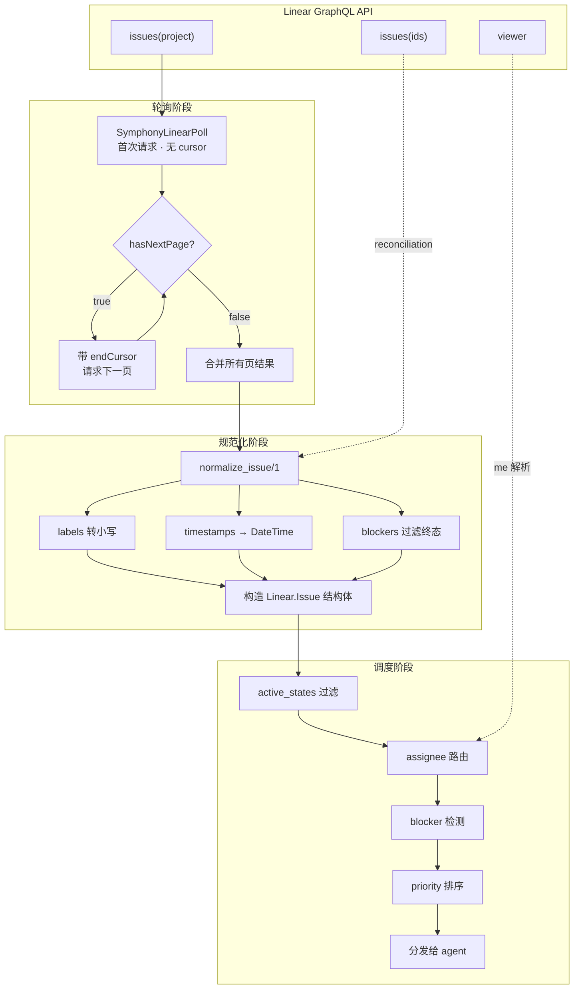
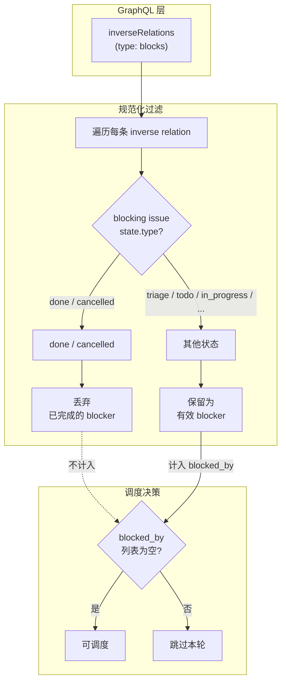

<details class="page-metadata">
<summary>页面元数据</summary>

| 属性 | 值 |
|---|---|
| 页面编号 | 07 |
| 目标仓库 | openai/symphony |
| 涉及模块 | `Linear.Client`, `Linear.Issue`, `Linear.Adapter` |
| 关键源文件 | `elixir/lib/symphony_elixir/linear/client.ex` (586 行), `elixir/lib/symphony_elixir/linear/issue.ex`, `SPEC.md:681-780` |
| 上游依赖 | Linear GraphQL API (`https://api.linear.app/graphql`) |
| 关联页面 | [06-orchestrator-core](06-orchestrator-core.md), [05-configuration-system](05-configuration-system.md), [08-agent-lifecycle](08-agent-lifecycle.md) |

</details>

# Linear 任务跟踪集成

Symphony 将 **Issue Tracker 视为调度器的唯一输入源**。所有待执行的工作都以 issue 的形式存在于外部系统中，orchestrator 按固定节奏轮询、规范化、过滤，然后决定是否分发给 agent。在当前版本中，**Linear 是唯一受支持的 tracker**，整套集成封装在 `Linear.Client`（586 行 GraphQL 客户端）与 `Linear.Issue`（规范化结构体）两个模块中。

这种"外部系统即事实源"的设计意味着 Symphony 本身**不维护任务队列**——Linear 的 project board 就是队列，issue 的 state 就是状态机。orchestrator 的职责仅仅是：读取、筛选、派发。

---

## 数据流总览

从 Linear API 到 agent 分发，数据经历**轮询、规范化、调度**三个阶段。每个阶段都有明确的输入输出边界。



**轮询阶段**通过 `SymphonyLinearPoll` 查询获取项目下的候选 issues，采用 cursor 分页，每页 50 条，递归拉取直到 `hasNextPage = false`。**规范化阶段**将 GraphQL 原始响应转换为内部 `Linear.Issue` 结构体，统一字段格式。**调度阶段**根据 state、assignee、blocker、priority 多维度筛选后，将合格 issue 分发给空闲 agent。

在 reconciliation 场景下（刷新正在运行的 issue 状态），数据直接从 `SymphonyLinearIssuesById` 查询进入规范化阶段，跳过分页逻辑。

---

## GraphQL 查询体系

`Linear.Client` 封装了三条 GraphQL 查询，各司其职。

### 查询用途对照表

| 查询名称 | 触发场景 | 输入参数 | 关键返回字段 | 分页 |
|---|---|---|---|---|
| **`SymphonyLinearPoll`** | 每轮轮询周期 | `projectSlug`, `stateNames`, `first`(50), `after`(cursor) | id, identifier, title, description, priority, state, labels, assignee, inverseRelations, createdAt, updatedAt | 有 (cursor) |
| **`SymphonyLinearIssuesById`** | Reconciliation 刷新 | `ids`(issue ID 列表) | 同上完整字段 + blocker 信息 | 无 |
| **`SymphonyLinearViewer`** | `assignee = "me"` 时 | 无 | viewer.id, viewer.email | 无 |

**`SymphonyLinearPoll`** 是主力查询。它按 `projectSlug` 定位 Linear 项目，按 `stateNames` 过滤 issue 状态（对应配置中的 `active_states`），并通过 `inverseRelations(type: "blocks")` 一次性拉取 blocker 关系，避免 N+1 查询。

**`SymphonyLinearIssuesById`** 在每轮 reconciliation 阶段使用。当 orchestrator 发现有正在运行的 agent 时，会批量查询这些 agent 对应 issue 的最新状态——如果 issue 已被手动关闭或状态变更，orchestrator 据此决定是否终止 agent。

**`SymphonyLinearViewer`** 仅在 tracker 配置了 `assignee: "me"` 时触发。它将字符串 `"me"` 解析为 API key 对应的 Linear 用户 ID，用于后续的 assignee 过滤。

### 分页策略

分页实现采用**递归累积、末尾反转**模式：

1. 首次请求不携带 `after` 参数
2. 检查响应中的 `pageInfo.hasNextPage`
3. 若为 `true`，携带 `pageInfo.endCursor` 发起下一页请求
4. 递归过程中结果以逆序累积（`[new_page | acc]`），全部完成后一次性 `Enum.reverse/1`
5. 每页上限 **50 条**

这种模式避免了列表拼接的 O(n) 开销，在 issue 数量较大时（数百至数千条）保持线性性能。

---

## Issue 规范化

`normalize_issue/1` 函数将 Linear GraphQL 响应中的单个 issue 节点转换为 `Linear.Issue` 结构体。这是**集成层与调度层之间的唯一桥梁**——调度逻辑只认 `Linear.Issue`，不直接接触 GraphQL 数据。

### 字段映射表

| GraphQL 字段 | Issue 结构体字段 | 转换规则 |
|---|---|---|
| `id` | `id` | 直传 |
| `identifier` | `identifier` | 直传（如 `PROJ-123`） |
| `title` | `title` | 直传 |
| `description` | `description` | 直传（可为 nil） |
| `priority` | `priority` | 整数直传（Linear 原始值 0-4，0 = 无优先级，1 = urgent，4 = low） |
| `state.name` | `state` | 直传，用于 `active_states` 过滤 |
| `labels.nodes[].name` | `labels` | **转小写**，实现大小写不敏感匹配 |
| `assignee.id` | `assignee_id` | 直传 |
| `branchName` | `branch_name` | 直传 |
| `url` | `url` | 直传 |
| `createdAt` | `created_at` | ISO8601 → `DateTime` 解析 |
| `updatedAt` | `updated_at` | ISO8601 → `DateTime` 解析 |
| `inverseRelations` | `blocked_by` | 过滤后提取（见下方 blocker 检测） |

**Labels 转小写**是一个关键设计决策。Linear 允许用户自由命名 label（如 `Bug`、`bug`、`BUG`），而 Symphony 的配置中 `include_labels` / `exclude_labels` 也是用户手写的字符串。统一转小写后，匹配逻辑不再受大小写干扰。

**Priority 值** Linear 的原始设计中 `0 = No priority`，`1 = Urgent`，`2 = High`，`3 = Medium`，`4 = Low`。Symphony 直接使用这些整数值进行排序，**数值越小优先级越高**。

---

## Blocker 检测

Blocker 是 Symphony 调度决策中的**硬约束**——被 block 的 issue 不会被分发，无论它的优先级多高、状态多合适。检测逻辑完全在规范化阶段完成。



Blocker 检测的核心逻辑可以表述为一条规则：

> **一个 issue 被视为 blocked，当且仅当它存在至少一条 `inverseRelation`，其 relation type 为 `"blocks"` 且对应的 blocking issue 状态类型（`state.type`）既不是 `"done"` 也不是 `"cancelled"`。**

这意味着：
- 如果 blocking issue 已完成（done）或已取消（cancelled），它**不再构成阻塞**
- 只要还有**一个**未终结的 blocker，issue 就不会被分发
- Blocker 信息在每轮轮询时**实时刷新**，不存在缓存导致的滞后

这个设计让团队可以直接在 Linear 中管理依赖关系——完成一个 blocking issue 后，被 block 的 issue 在下一轮轮询中就自动变为可调度状态，无需人工干预。

---

## Assignee 路由

Assignee 路由决定 Symphony 实例**看到哪些 issue**。这是一个过滤机制，不是分配机制——它控制的是输入范围，不是输出目标。

| 配置值 | 行为 | 实现 |
|---|---|---|
| `tracker.assignee = "me"` | 仅处理分配给当前 API key 用户的 issues | 调用 `SymphonyLinearViewer` 获取用户 ID，按 `assignee.id` 过滤 |
| `tracker.assignee = "<email>"` | 仅处理分配给指定邮箱用户的 issues | 按 `assignee.email` 过滤 |
| `tracker.assignee = nil`（未配置） | 处理项目中所有 issues | 不执行 assignee 过滤 |

**`"me"` 解析**是一个两步过程：首先通过 `SymphonyLinearViewer` 查询获取当前 API key 对应的 Linear 用户 ID，然后在轮询结果中按 `assignee.id` 匹配过滤。这比直接传递 `"me"` 到 GraphQL 查询更可靠，因为 Linear API 的 issue 查询不直接支持 `"me"` 语义。

一个典型的多实例部署场景：团队中每个工程师运行自己的 Symphony 实例，各自配置 `assignee: "me"`，这样每个实例只处理分配给自己的 issues，避免重复工作。

---

## 错误处理

`Linear.Client` 的错误处理遵循 **Elixir 的 `{:ok, result}` / `{:error, reason}` 惯例**，但不在客户端层面做重试。

| 错误类型 | 处理方式 | 返回值 |
|---|---|---|
| **GraphQL errors**（查询本身返回 errors 字段） | 提取错误列表，原样上抛 | `{:error, {:linear_graphql_errors, errors}}` |
| **HTTP 错误**（非 200 状态码） | 通过 Req 库标准错误处理，日志中记录截断的响应体（上限 1000 字节） | `{:error, reason}` |
| **配置缺失**（无 API token） | 启动时即失败 | `{:error, :missing_linear_api_token}` |
| **Rate limiting** | 不在 client 层处理 | 由 orchestrator 的轮询间隔自然退避 |

**Rate limiting 的处理值得注意**。Symphony 没有实现传统的指数退避或 429 响应解析。取而代之的是，orchestrator 本身的轮询间隔（默认 30 秒）天然构成了请求频率的上限。对于绝大多数团队规模的 Linear 项目，这个频率远低于 Linear API 的速率限制。

---

## 配置参考

Linear 集成的配置项位于 Symphony 配置文件的 `tracker` 节下：

```yaml
tracker:
  kind: "linear"
  api_key: "$LINEAR_API_KEY"           # 支持环境变量引用
  project_slug: "my-project"           # Linear 项目的 slugId
  assignee: "me"                       # 可选："me" | "<email>" | 不设置
  active_states:                       # 可选，默认 ["Todo", "In Progress"]
    - "Todo"
    - "In Progress"
  terminal_states:                     # 可选，默认 ["Done", "Cancelled", "Canceled", "Closed", "Duplicate"]
    - "Done"
    - "Cancelled"
```

`project_slug` 对应 Linear 中项目的 `slugId`，不是项目名称。可以在 Linear 项目 URL 中找到此值。

---

## 模块结构

Linear 集成由三个模块组成，职责划分清晰：

| 模块 | 文件 | 职责 |
|---|---|---|
| `Linear.Client` | `linear/client.ex`（586 行） | GraphQL 查询封装、HTTP 通信、分页处理、响应规范化 |
| `Linear.Issue` | `linear/issue.ex` | 规范化 issue 结构体定义、`label_names/1` 辅助函数 |
| `Linear.Adapter` | `linear/adapter.ex` | Tracker 行为接口实现，连接 orchestrator 与 client |

`Linear.Adapter` 实现了 Symphony 定义的 tracker 行为接口（behaviour），使得 orchestrator 的调度逻辑与具体的 tracker 实现解耦。未来如果要支持 Jira 或 GitHub Issues，只需新增对应的 adapter 模块，无需修改 orchestrator 代码。

---

## Sources

| 引用 | 说明 |
|---|---|
| [`elixir/lib/symphony_elixir/linear/client.ex`](https://github.com/openai/symphony/blob/main/elixir/lib/symphony_elixir/linear/client.ex) | GraphQL 客户端实现，包含三条查询、分页逻辑、normalize_issue |
| [`elixir/lib/symphony_elixir/linear/issue.ex`](https://github.com/openai/symphony/blob/main/elixir/lib/symphony_elixir/linear/issue.ex) | Issue 结构体定义与类型规范 |
| [`elixir/lib/symphony_elixir/linear/adapter.ex`](https://github.com/openai/symphony/blob/main/elixir/lib/symphony_elixir/linear/adapter.ex) | Tracker 行为接口适配层 |
| [`SPEC.md:681-780`](https://github.com/openai/symphony/blob/main/SPEC.md) | Linear 集成规范定义 |

---

## 相关页面

- [Orchestrator 核心调度](06-orchestrator-core.md) -- 轮询循环、reconciliation、分发决策的上层逻辑
- [配置系统](05-configuration-system.md) -- `tracker` 配置节的完整定义与校验规则
- [Agent 生命周期](08-agent-lifecycle.md) -- issue 被分发后，agent 如何执行与汇报
