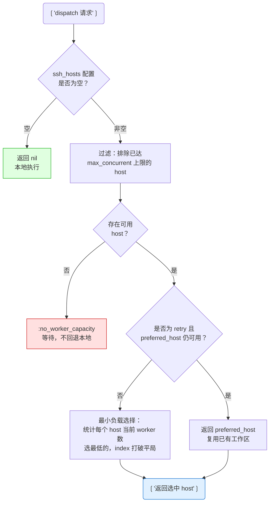

<details class="page-metadata">
<summary>页面元数据</summary>

| 属性 | 值 |
|------|-----|
| 页面编号 | 08 |
| 所属项目 | openai/symphony |
| 覆盖范围 | SSH Worker Extension -- 远程 agent 分发与执行 |
| 关键源文件 | `ssh.ex`, `workspace.ex`, `orchestrator.ex`, `app_server.ex` |
| 规范依据 | SPEC.md Appendix A |
| 关联页面 | [Worker Deployment Models](03-03-worker-deployment-models.md), [Workspace Management](04-03-workspace-management.md), [AppServer Protocol](05-01-appserver-protocol.md) |

</details>

# SSH Worker 扩展架构

当 Symphony 在单机上运行多个 Codex agent 时，**CPU、内存和沙箱隔离**三者共同构成了并行度的天然瓶颈。一台开发机通常只能稳定承载 2--4 个并发 agent；超出这个阈值后，上下文切换开销和内存压力会显著拖慢每个 agent 的执行效率，甚至触发 OOM kill。

SSH Worker Extension 的设计目标非常明确：**Orchestrator 保持单点决策权，而实际的 agent 执行被分发到多台远程主机**。这种架构没有引入额外的分布式协调组件——Orchestrator 仍然是唯一的状态源，远程机器只是"带 SSH 入口的执行容器"。

---

## 本地 vs 远程：执行路径对比

在本地模式下，Orchestrator 直接通过 `Port.open` 启动 Codex 子进程，所有 stdio 通信都走进程间管道。切换到远程模式后，这条管道被 SSH 通道替代——Orchestrator 通过 `SSH.start_port` 在远程主机上启动 Codex，JSON-RPC 消息经由 SSH 的 stdin/stdout 双向传输。

下图展示了两种模式的架构差异。关键区别在于中间层：本地模式是 Erlang Port，远程模式是 SSH Port。

```mermaid
graph TB
  subgraph LOCAL["本地执行模式"]
    O1["Orchestrator"] --> |"dispatch"| AS1["AppServer"]
    AS1 --> |"Port.open"| C1["Codex Agent"]
    C1 --> |"stdio JSON-RPC"| AS1
    C1 --> W1["本地工作区<br/>workspace_root/ISSUE_ID"]
  end

  subgraph REMOTE["远程执行模式"]
    O2["Orchestrator"] --> |"dispatch + select_worker_host"| AS2["AppServer"]
    AS2 --> |"SSH.start_port"| SSH["SSH 通道"]
    SSH --> |"cd workspace && exec codex"| C2["远程 Codex Agent"]
    C2 --> |"stdio JSON-RPC via SSH"| SSH
    SSH --> AS2
    C2 --> W2["远程工作区<br/>remote:workspace_root/ISSUE_ID"]
  end

  style LOCAL fill:#f0f4ff,stroke:#4a6fa5
  style REMOTE fill:#fff4f0,stroke:#a56a4a
```



两种模式对 AppServer 上层完全透明——无论 Codex 跑在本地还是远程，Orchestrator 的 turn 管理、重试逻辑和状态追踪代码都不需要区分。这是 `SSH.start_port` 返回标准 Erlang Port 所带来的抽象优势。

---

## SSH 模块：薄封装层

`ssh.ex` 大约 100 行代码，是对系统 `ssh` 可执行文件的 **thin wrapper**，提供三个公开函数。

**`run/3`** 用于同步执行远程命令。内部调用 `System.cmd(ssh_executable, ssh_args(host, command), opts)`，返回 `{:ok, {output, exit_code}}` 或 `{:error, reason}`。典型用途：远程工作区的创建与清理。

**`start_port/3`** 用于异步 stdio 通信。通过 `Port.open({:spawn_executable, ssh}, port_opts)` 建立双向管道，返回标准 Erlang Port。这是远程 Codex 启动的核心通道——JSON-RPC 消息在这条管道上流动。

**`remote_shell_command/1`** 将裸命令包装为 `bash -lc '<command>'`。`-l` 保证加载远程用户的 login profile（PATH、环境变量等），`-c` 指定要执行的命令字符串。

### Host 目标解析

`parse_target/1` 负责将用户配置的 host 字符串拆分为 destination 和 port 两部分：

| 输入格式 | 解析结果 | 说明 |
|---------|---------|------|
| `dev-server` | destination=`dev-server`, port=`nil` | 使用默认 22 端口 |
| `dev-server:2222` | destination=`dev-server`, port=`2222` | 自定义端口，自动添加 `-p 2222` |
| `[::1]:2222` | destination=`[::1]`, port=`2222` | IPv6 bracketed host 检测 |
| `user@host:2222` | destination=`user@host`, port=`2222` | 带用户名的目标 |

解析使用正则 `~r/^(.*):(\d+)$/` 匹配末尾的 `:port`，并通过 `bracketed_host?/1` 和 `valid_port_destination?/1` 排除误匹配（例如纯 IPv6 地址中的冒号）。

### 安全：shell 转义

所有传递给远程 shell 的值都经过 `shell_escape/1` 处理：用**单引号包裹**整个字符串，内部的单引号转义为 `'"'"'`（结束单引号、双引号包裹单引号字符、重新开始单引号）。这是 POSIX shell 中防注入的标准做法。

---

## Worker Host 选择算法

当 `worker.ssh_hosts` 配置了多台远程主机时，Orchestrator 在每次 dispatch 前必须选择一台目标机器。`select_worker_host/2` 实现了一个**最小负载优先 + 重试偏好**的选择策略。

下图是完整的决策流程。



几个关键设计决定值得注意：

**容量隔离**。`worker.max_concurrent_agents_per_host` 是硬上限，通过 `worker_host_slots_available?/2` 在选择前过滤。当所有 host 都满载时，返回 `:no_worker_capacity` 让 dispatch **等待而非回退到本地执行**——这避免了单机被意外过载。

**重试偏好**。`pick_retry_worker_host/2` 在 retry dispatch 时优先选择上一次的 host。原因很实际：远程工作区是 host-local 的，同一台机器上可能仍保留着上一轮的 git 历史和依赖缓存，冷启动代价更低。

**负载均衡**。`least_loaded_worker_host/2` 统计 `state.running` 中每台 host 的 worker 数，选最少的。相同负载时用配置中的 index 打破平局——这保证了选择的确定性。

---

## 远程工作区管理

远程工作区的生命周期通过 SSH 命令控制，核心逻辑在 `workspace.ex` 中。

### 创建：ensure_workspace

`ensure_workspace(workspace, worker_host)` 通过 `SSH.run` 在远程主机上执行一段 shell 脚本。脚本的关键步骤：

1. **路径扩展**。`remote_shell_assign/2` 函数生成 shell 赋值语句，处理 `~` 到 `$HOME` 的扩展——因为 Elixir 端无法直接解析远程用户的 home 目录。
2. **目录创建**。检查目录是否存在，不存在则 `mkdir -p`；存在但为文件则先移除。
3. **输出标记**。脚本最终输出 `__SYMPHONY_WORKSPACE__\t<status>\t<canonical_path>`，由 `parse_remote_workspace_output/1` 解析。`status` 为 `0`（已存在）或 `1`（新建）。

**路径验证的简化处理**。本地模式下，`PathSafety` 通过 `File.realpath` 做 symlink 解析和目录穿越检查。但远程场景中无法调用远程文件系统的 canonicalize，因此 `validate_workspace_path/2` 退化为轻量检查：**非空 + 无控制字符**（换行、回车、null byte）。这是有意为之的安全折中——SPEC 中也明确指出"remote path resolution matters more once execution crosses a machine boundary"。

### 清理：remove 与 remove_issue_workspaces

**`remove(workspace, worker_host)`** 在执行 `before_remove` 钩子后，通过 SSH 运行 `rm -rf` 删除远程工作区目录。

**`remove_issue_workspaces(identifier, worker_host)`** 扫描指定 host 上属于某个 issue 的所有工作区并逐一删除。当 issue 达到终态（merged、closed）时，Orchestrator 调用此函数在**所有相关 host** 上清理残留。

---

## 远程 Codex 启动

`app_server.ex` 中，当 `worker_host` 非 nil 时，`start_port/2` 走远程分支。

启动流程：

1. **构建远程命令**。`remote_launch_command/1` 生成 `cd <workspace> && exec <codex_command>`。`cd` 确保 Codex 在正确的工作区目录下启动；`exec` 替换 shell 进程，避免多余的进程层级。
2. **建立 SSH Port**。`SSH.start_port(worker_host, remote_command, line: @port_line_bytes)` 返回 Erlang Port。此后 AppServer 通过 `Port.command` 发送 JSON-RPC 请求，通过 `{port, {:data, data}}` 消息接收响应。
3. **元数据记录**。`worker_host` 被写入运行元数据 `Map.put(base_metadata, :worker_host, host)`，用于 Dashboard 展示和日志追踪。

SSH Port 上的数据流与本地 Port 完全一致——都是 line-buffered 的 JSON-RPC。AppServer 的 `handle_info` 回调不区分 Port 来源，这是远程执行对上层透明的关键。

### 远程钩子执行

生命周期钩子（`before_run`、`after_run` 等）在远程场景中也通过 SSH 执行。`run_hook/5` 接收 `worker_host` 参数，将钩子命令发送到远程主机的工作区目录下运行。超时控制使用 `Task.yield/2` + `Task.shutdown(:brutal_kill)` 模式，确保挂起的远程命令不会无限阻塞 Orchestrator。

---

## SSH 配置

### worker.ssh_hosts 配置

在 Symphony 配置文件中声明远程 host 列表：

```yaml
worker:
  ssh_hosts:
    - "dev-gpu-01"
    - "dev-gpu-02:2222"
    - "builder@ci-node-03"
  max_concurrent_agents_per_host: 4
```

每个条目支持 `host`、`host:port`、`user@host:port` 格式。端口后缀由 `parse_target/1` 自动解析为 `-p` 参数。

### 自定义 SSH config

通过环境变量 `SYMPHONY_SSH_CONFIG` 指定自定义 SSH 配置文件路径：

```bash
export SYMPHONY_SSH_CONFIG="$HOME/.ssh/symphony_config"
```

设置后，所有 SSH 调用会附加 `-F <path>` 参数。典型用途：为不同远程 host 配置不同的密钥、跳板机或 ProxyCommand，而不污染用户的默认 `~/.ssh/config`。

### 远程 host 前置条件

SPEC Appendix A 要求每台远程 host 满足与本地相同的基本契约：

- **可达的 shell**：SSH 连接成功且能执行 `bash -lc`
- **可写的 workspace root**：`workspace.root` 路径在远程主机上存在且可写
- **Codex 可执行文件**：`codex.command` 配置的命令在远程 PATH 中可用
- **认证与仓库访问**：git credentials、API keys 等在远程环境中已配置

---

## 分布式场景下的注意事项

SSH Worker Extension 有意保持架构简单，但引入远程执行后有几个固有的分布式问题需要运维侧关注。

**环境漂移**。各 host 的 Codex 版本、系统依赖、git 配置可能不一致。SPEC 建议将远程 host 视为同质化节点，通过配置管理工具（Ansible、Puppet）保持一致。

**工作区局部性**。工作区是 host-local 的——切换 host 意味着冷启动。除非使用共享存储（NFS、EFS），否则 retry 到不同 host 会丢失上一轮的中间状态。这也是 retry 偏好机制存在的原因。

**故障语义区分**。Orchestrator 需要区分 SSH 连接失败（host 不可达）和 agent 执行失败（Codex 报错）。前者可以 failover 到其他 host，后者应作为正常 retry 处理。`start_port` 返回 `{:error, reason}` 时的 reason 类型是区分依据。

**清理可观测性**。`remove_issue_workspaces` 在所有相关 host 上执行清理，但如果某台 host 临时离线，清理会静默失败。运维侧需要定期检查远程 host 上的残留工作区。

---

## Sources

| 源文件 | 职责 |
|--------|------|
| [`elixir/lib/symphony_elixir/ssh.ex`](https://github.com/openai/symphony/blob/main/elixir/lib/symphony_elixir/ssh.ex) | SSH 封装：`run/3`, `start_port/3`, `parse_target/1`, `shell_escape/1` |
| [`elixir/lib/symphony_elixir/workspace.ex`](https://github.com/openai/symphony/blob/main/elixir/lib/symphony_elixir/workspace.ex) | 远程工作区创建、清理、路径验证 |
| [`elixir/lib/symphony_elixir/orchestrator.ex`](https://github.com/openai/symphony/blob/main/elixir/lib/symphony_elixir/orchestrator.ex) | `select_worker_host/2`、负载均衡、容量管理 |
| [`elixir/lib/symphony_elixir/codex/app_server.ex`](https://github.com/openai/symphony/blob/main/elixir/lib/symphony_elixir/codex/app_server.ex) | 远程 Codex 启动、SSH Port JSON-RPC 通信 |
| [`SPEC.md` Appendix A](https://github.com/openai/symphony/blob/main/SPEC.md) | SSH Worker Extension 规范 |
