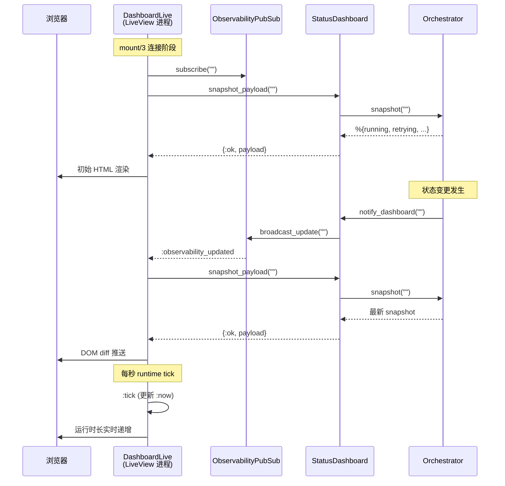

<details class="page-metadata">
<summary>Page Metadata</summary>

| Field | Value |
|---|---|
| Page ID | 09-observability |
| Title | 可观测性与实时仪表盘 |
| Scope | Phoenix LiveView Dashboard、PubSub 事件系统、结构化日志、HTTP API |
| Sources | `elixir/lib/symphony_elixir_web/live/dashboard_live.ex`, `elixir/lib/symphony_elixir/status_dashboard.ex`, `elixir/lib/symphony_elixir_web/observability_pubsub.ex`, `elixir/lib/symphony_elixir/log_file.ex`, `elixir/lib/symphony_elixir_web/presenter.ex`, `elixir/lib/symphony_elixir_web/router.ex`, `elixir/lib/symphony_elixir/http_server.ex`, `elixir/lib/symphony_elixir_web/controllers/observability_api_controller.ex`, `SPEC.md` (Sections 12, 17) |
| Related Pages | [02-architecture-overview](02-architecture-overview.md), [03-orchestrator-core](03-orchestrator-core.md), [08-resilience-retry-engine](08-resilience-retry-engine.md) |

</details>

# 可观测性与实时仪表盘

**看不见的 agent 是危险的 agent。** 当自主编码系统在后台同时处理数十个 issue、发起 API 调用、消耗 token 预算时，运维团队如果只能依赖事后日志排查，就等于在盲飞。Symphony 的可观测性体系正是为解决这个问题而设计：通过 **Phoenix LiveView 实时仪表盘**、**PubSub 推送事件流** 和 **结构化磁盘日志** 三层机制，让 orchestrator 的每一次状态变迁对运维者完全透明。

这套体系遵循一条核心设计原则——**可观测性组件的故障不得影响编排逻辑**。Dashboard 崩溃、日志写入失败、API 超时，这些都不会导致 orchestrator 停止调度。可观测性是"尽力而为"的旁路，不是关键路径上的依赖。

---

## 事件流架构

在深入各组件之前，先建立全局视角：orchestrator 状态变更如何流向三个消费端。

```mermaid
flowchart LR
    subgraph ORC["Orchestrator 核心"]
        O[Orchestrator GenServer]
        S["snapshot/1"]
    end

    subgraph PUB["PubSub 事件总线"]
        PS["Phoenix.PubSub"]
        T["Topic: observability:dashboard"]
    end

    subgraph CONSUMERS["消费端"]
        D["LiveView Dashboard<br/>(实时 Web UI)"]
        API["REST API<br/>(/api/v1/state)"]
        LOG["LogFile<br/>(结构化磁盘日志)"]
    end

    O -- "notify_dashboard("")" --> SD[StatusDashboard GenServer]
    SD -- "broadcast_update("")" --> PS
    PS -- ":observability_updated" --> T
    T -- "WebSocket 推送" --> D
    SD -- "snapshot_payload/0" --> API
    O -- "Logger 结构化输出" --> LOG
    S -. "同步查询" .-> SD
```

**关键路径说明：** Orchestrator 在完成轮询、worker 启停、token 更新、重试调度等关键状态转换后，调用 `notify_dashboard/0`。该调用触发 `StatusDashboard` GenServer 广播 PubSub 消息，LiveView 进程收到消息后拉取最新 snapshot 并推送给浏览器。整个链路是 **push-based** 的——不需要前端轮询后端。

---

## PubSub 事件系统

**`ObservabilityPubSub`**（`symphony_elixir_web/observability_pubsub.ex`）是事件广播的薄封装层，职责极其单一：

| 属性 | 值 |
|---|---|
| **PubSub 实例** | `SymphonyElixir.PubSub` |
| **Topic** | `"observability:dashboard"` |
| **消息类型** | `:observability_updated`（原子，无载荷） |

两个公开函数：

- **`subscribe/0`** — 将调用进程订阅到 topic。LiveView 在 `mount/3` 连接阶段调用。
- **`broadcast_update/0`** — 向所有订阅者广播 `:observability_updated`。内部先检查 PubSub 进程是否存活（`Process.whereis/1`），不存在时静默返回 `:ok`，绝不抛异常。

这个"消息不携带数据"的设计是 **刻意的**：PubSub 消息只充当通知信号，接收方自行向 `StatusDashboard` 拉取最新 snapshot。这避免了在高频更新下通过 PubSub 传输大体积数据的开销。

---

## StatusDashboard GenServer

**`StatusDashboard`**（`symphony_elixir/status_dashboard.ex`）是可观测性体系的中枢，在 PubSub 通知与数据消费之间充当缓存和节流层。

### 核心状态结构

```elixir
defstruct [
  :refresh_ms,                # 自动刷新间隔
  :enabled,                   # 是否启用
  :render_interval_ms,        # 最小渲染间隔（防抖）
  :refresh_ms_override,       # 运行时配置覆盖
  :enabled_override,
  :render_interval_ms_override,
  :render_fun,                # 渲染回调函数
  :token_samples,             # token 吞吐量采样点
  :last_tps_second,           # 上次 TPS 计算时间
  :last_tps_value,            # 上次 TPS 值
  :last_rendered_content,     # 缓存的渲染内容
  :last_rendered_at_ms,       # 上次渲染时间戳
  :pending_content,           # 待刷新内容
  :flush_timer_ref,           # 防抖定时器引用
  :last_snapshot_fingerprint  # snapshot 指纹（去重用）
]
```

### 消息处理

| 消息 | 触发方式 | 行为 |
|---|---|---|
| `:tick` | 定时器周期触发 | 刷新配置、条件性重新渲染、调度下一次 tick |
| `:refresh` | `notify_update/1` 外部调用 | 强制立即重新渲染 |
| `:flush_render` | 防抖定时器到期 | 执行延迟渲染，防止高频状态变更导致过多屏幕刷新 |

### 公开 API

- **`notify_update(server)`** — 广播 PubSub 更新 + 发送 `:refresh` 消息给自身
- **`snapshot_payload/0`** — 调用 `Orchestrator.snapshot/0` 获取当前状态，返回结构化 map
- **`render_offline_status/0`** — orchestrator 不可用时的降级展示

**防抖机制** 值得注意：当 orchestrator 在短时间内连续触发多次 `notify_update`（例如批量 worker 启动），StatusDashboard 不会对每次通知都重新渲染。它通过 `flush_timer_ref` 实现时间窗口内的合并，`render_interval_ms` 是最小渲染间隔。

---

## Snapshot 数据结构

Snapshot 是整个可观测性体系的**核心数据契约**——Dashboard、API、Presenter 都消费同一份 snapshot。

| 字段 | 类型 | 说明 |
|---|---|---|
| `running` | `[map]` | 运行中的 agent session 列表 |
| `retrying` | `[map]` | 重试队列中的 issue 列表 |
| `codex_totals` | `map` | token 累计用量（`input_tokens`, `output_tokens`, `total_tokens`, `seconds_running`） |
| `rate_limits` | `map \| nil` | 最新的上游 rate limit 信息 |
| `polling` | `map` | 轮询状态（`checking?`, `next_poll_in_ms`, `poll_interval_ms`） |

### Running 条目字段

每个 running session 包含丰富的运行时上下文：

| 字段 | 说明 |
|---|---|
| `issue_id` / `identifier` | issue 标识 |
| `state` | 当前状态 |
| `worker_host` | worker 运行主机 |
| `workspace_path` | 工作区路径 |
| `session_id` | 格式 `<thread_id>-<turn_id>` |
| `turn_count` | 对话轮次数 |
| `started_at` | 启动时间 |
| `last_codex_timestamp` | 最后一次 agent 活动时间 |
| `last_codex_message` | 最后一条 agent 消息 |
| `last_codex_event` | 最后一个 agent 事件 |
| `runtime_seconds` | 累计运行时长 |
| token 字段 | `input_tokens`, `output_tokens`, `total_tokens` |

### Retrying 条目字段

| 字段 | 说明 |
|---|---|
| `issue_id` / `identifier` | issue 标识 |
| `attempt` | 当前重试次数 |
| `due_at` | 下次重试时间（毫秒偏移） |
| `error` | 关联的错误信息 |
| `worker_host` / `workspace_path` | worker 上下文 |

---

## Phoenix LiveView Dashboard

**`DashboardLive`**（`symphony_elixir_web/live/dashboard_live.ex`）是面向运维的实时 Web UI，通过 WebSocket 实现亚秒级状态刷新。

### 数据刷新流程



**三层刷新机制：**

1. **事件驱动刷新** — PubSub 推送 `:observability_updated` 时，LiveView 重新拉取 snapshot 并通过 WebSocket 发送 DOM diff。这是主刷新路径。
2. **秒级 tick** — 每 1000ms 触发一次 `:tick`，仅更新 `:now` assign，使界面上的"运行时长"字段实时递增，无需重新查询 orchestrator。
3. **首次渲染** — `mount/3` 阶段同步获取初始 payload，确保用户打开页面就能看到完整状态。

### Dashboard UI 组成

| 区域 | 内容 |
|---|---|
| **头部状态栏** | "Symphony Observability" 标题 + Live/Offline 状态徽章 |
| **指标卡片网格** | 运行中数量、重试中数量、总 token 消耗（含 input/output 明细）、累计运行时长 |
| **Rate Limits 区域** | 上游 API 限流信息的格式化展示 |
| **Running Sessions 表** | 6列：issue ID、状态徽章、session ID（带复制按钮）、运行时长/轮次、最后 agent 活动、token 消耗 |
| **Retry Queue 表** | 4列：issue ID、重试次数、计划重试时间、错误信息 |

当无活跃 session 或重试队列为空时，各区域展示对应的空状态提示。

---

## HTTP Server 与 REST API

### HTTP Server 启动

**`HttpServer`**（`symphony_elixir/http_server.ex`）使用 **Bandit** 作为底层 HTTP 服务器，通过 Phoenix Endpoint 间接启动。

**端口配置优先级：** 函数参数 > `Config.server_port()` > 不启动（返回 `:ignore`）

**安全默认值：**
- 绑定地址默认为 `127.0.0.1`（loopback），除非显式配置为其他地址
- 每次启动生成 48 字节随机 `secret_key_base`（`crypto.strong_rand_bytes`）
- 端口值必须是 `>= 0` 的整数，否则不启动

### 路由表

| 方法 | 路径 | 处理器 | 说明 |
|---|---|---|---|
| GET | `/` | `DashboardLive` | LiveView 实时仪表盘（经 browser pipeline） |
| GET | `/api/v1/state` | `ObservabilityApiController.state` | 系统状态 JSON |
| POST | `/api/v1/refresh` | `ObservabilityApiController.refresh` | 触发立即轮询（返回 202） |
| GET | `/api/v1/:issue_identifier` | `ObservabilityApiController.issue` | 单个 issue 详情 |
| * | `/dashboard.css`, `/vendor/*` | `StaticAssetController` | 静态资源 |
| * | 其他 | | 405 Method Not Allowed 或 404 Not Found |

### API 响应格式

**`GET /api/v1/state`** 返回：

```json
{
  "timestamp": "2025-01-15T10:30:00Z",
  "counts": { "running": 3, "retrying": 1 },
  "running": [
    {
      "issue_id": "PROJ-42",
      "identifier": "proj-42",
      "state": "running",
      "session_id": "thread_abc-turn_2",
      "turn_count": 5,
      "started_at": "2025-01-15T10:25:00Z",
      "tokens": { "input": 12000, "output": 3400, "total": 15400 }
    }
  ],
  "retrying": [
    {
      "identifier": "proj-17",
      "attempt": 2,
      "due_at": "2025-01-15T10:32:00Z",
      "error": "CI check failed"
    }
  ],
  "codex_totals": {
    "input_tokens": 150000,
    "output_tokens": 42000,
    "total_tokens": 192000,
    "seconds_running": 3600
  },
  "rate_limits": { ... }
}
```

**错误响应统一格式：**

```json
{
  "error": {
    "code": "issue_not_found",
    "message": "No issue found with identifier 'proj-99'"
  }
}
```

`ObservabilityApiController` 从 Endpoint 配置中读取 `orchestrator` 和 `snapshot_timeout_ms`（默认 15 秒）。

---

## Presenter 展示层

**`Presenter`**（`symphony_elixir_web/presenter.ex`）负责将 orchestrator 原始 snapshot 转换为 API 和 Dashboard 可消费的结构化载荷。

**核心转换函数：**

- **`state_payload/2`** — 调用 `Orchestrator.snapshot/2`，将 running/retrying 列表映射为标准化 map，附加时间戳和计数
- **`issue_payload/3`** — 定位特定 issue，返回状态、工作区信息、重试次数、错误数据
- **`refresh_payload/1`** — 触发 orchestrator 立即轮询

**格式化工具：**

| 函数 | 用途 |
|---|---|
| `iso8601/1` | DateTime 转 ISO8601 字符串（秒精度） |
| `due_at_iso8601/1` | 毫秒偏移量转未来重试时间 |
| `summarize_message/1` | 委托给 `StatusDashboard.humanize_codex_message/1` 生成可读摘要 |

**错误处理：** `state_payload` 对 snapshot 超时和不可用做了显式处理，确保 API 在 orchestrator 异常时依然返回有意义的错误信息而非崩溃。

---

## 结构化日志

**`LogFile`**（`symphony_elixir/log_file.ex`）提供基于 OTP `disk_log` 的 **旋转式文件日志**，作为实时 Dashboard 的持久化补充。

### 配置

| 参数 | 环境变量键 | 默认值 |
|---|---|---|
| 日志路径 | `:log_file` | `log/symphony.log` |
| 单文件大小上限 | `:log_file_max_bytes` | 10 MB |
| 保留文件数 | `:log_file_max_files` | 5 |

### 行为特征

- **日志级别：** `:all`（捕获所有级别）
- **格式：** 单行格式（`single_line: true`），每行一个结构化日志条目
- **旋转方式：** `:wrap` 模式——达到大小上限后自动轮转到下一个文件
- **Handler ID：** `:symphony_disk_log`
- **接管行为：** 配置成功后移除默认 console handler，日志仅写入文件

### 日志上下文字段

按照 SPEC.md 规范，所有 issue 相关日志 **必须** 包含：
- `issue_id` — issue 在 tracker 中的标识
- `issue_identifier` — 人类可读的 issue 标识符

所有 agent session 日志 **必须** 包含：
- `session_id` — 格式为 `<thread_id>-<turn_id>`

消息格式遵循稳定的 key-value 惯例，包含操作结果（completed / failed / retrying）和简明失败原因。

---

## 故障隔离设计

可观测性体系的一个关键设计目标是 **不成为系统的单点故障**。以下是各组件的故障隔离策略：

| 组件 | 故障场景 | 行为 |
|---|---|---|
| **PubSub** | 进程不存在 | `broadcast_update/0` 静默返回 `:ok` |
| **StatusDashboard** | snapshot 超时 | 返回错误元组，不阻塞 orchestrator |
| **LiveView** | WebSocket 断连 | 浏览器自动重连，重新 mount |
| **API** | orchestrator 不可用 | 返回 503，不崩溃 |
| **LogFile** | 磁盘写入失败 | 通过剩余 sink 发出警告，编排继续 |
| **Dashboard 渲染** | 异常 | 展示 offline 状态，不影响数据流 |

SPEC.md 明确要求：**"Dashboard/log failures do not crash orchestrator."**

---

## 部署与运维

### 启用 HTTP Server

三种配置方式（任选其一）：

1. **CLI 参数：** `--port 4000`
2. **WORKFLOW.md front matter：** `server.port: 4000`
3. **临时端口（开发用）：** `--port 0`（系统分配可用端口）

### Token 核算规则

SPEC.md 对 Dashboard 中的 token 统计有明确规范：

- **优先使用绝对线程总量**（而非增量式载荷）
- **忽略 delta 式数据** 以避免重复计算
- **运行时长** 在 snapshot/render 时实时聚合：已结束 session 的累计时长 + 活跃 session 的当前经过时长
- **Rate limit** 追踪最新一次 agent 更新携带的限流载荷

### 外部 Dashboard URL

通过 `codex.dashboard_url` 配置项，可以将 Dashboard 的 URL 暴露给外部系统（如工单系统的评论中嵌入 Dashboard 链接），方便团队快速跳转查看 issue 的实时处理状态。

---

## Sources

| Source | 说明 |
|---|---|
| [`dashboard_live.ex`](https://github.com/openai/symphony/blob/main/elixir/lib/symphony_elixir_web/live/dashboard_live.ex) | Phoenix LiveView 仪表盘实现 |
| [`status_dashboard.ex`](https://github.com/openai/symphony/blob/main/elixir/lib/symphony_elixir/status_dashboard.ex) | StatusDashboard GenServer |
| [`observability_pubsub.ex`](https://github.com/openai/symphony/blob/main/elixir/lib/symphony_elixir_web/observability_pubsub.ex) | PubSub 事件广播封装 |
| [`log_file.ex`](https://github.com/openai/symphony/blob/main/elixir/lib/symphony_elixir/log_file.ex) | 旋转式磁盘日志配置 |
| [`presenter.ex`](https://github.com/openai/symphony/blob/main/elixir/lib/symphony_elixir_web/presenter.ex) | Snapshot 数据转换层 |
| [`router.ex`](https://github.com/openai/symphony/blob/main/elixir/lib/symphony_elixir_web/router.ex) | HTTP 路由定义 |
| [`http_server.ex`](https://github.com/openai/symphony/blob/main/elixir/lib/symphony_elixir/http_server.ex) | Bandit HTTP 服务器启动 |
| [`observability_api_controller.ex`](https://github.com/openai/symphony/blob/main/elixir/lib/symphony_elixir_web/controllers/observability_api_controller.ex) | REST API 控制器 |
| [`orchestrator.ex`](https://github.com/openai/symphony/blob/main/elixir/lib/symphony_elixir/orchestrator.ex) | `snapshot/1` 和 `notify_dashboard/0` 定义 |
| [`SPEC.md`](https://github.com/openai/symphony/blob/main/SPEC.md) | Section 12 (HTTP Server), Section 17.8 (Validation) — Logging 和 Observability 规范 |
