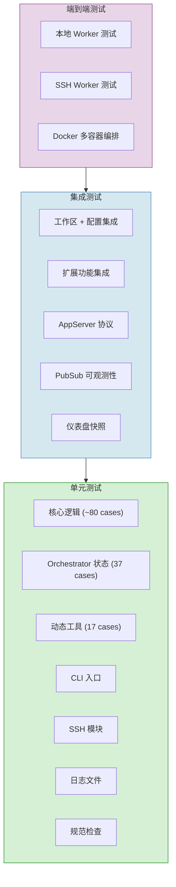
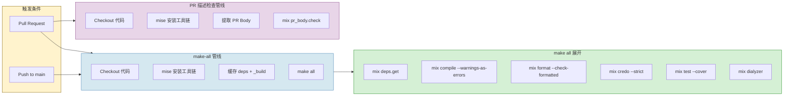

页面元数据

- **目标读者**: 贡献者、架构师、CI/CD 运维
- **知识前提**: Elixir/OTP 基础、ExUnit 框架、Docker 基本操作
- **对应源码**: `elixir/test/`、`elixir/mix.exs`、`elixir/Makefile`、`.github/workflows/`
- **SPEC 章节**: Section 17 (Test and Validation Matrix)、Section 18 (Implementation Checklist)

# 测试体系与质量门禁

Symphony 的核心挑战不在于编写业务逻辑——而在于**编排不可控的外部系统**。它管理 AI agent 的生命周期、与 Linear 做状态同步、通过 SSH 调度远程 worker、处理速率限制和指数退避。当被测对象本身就是"管理 AI agent 的调度器"时，传统的单元测试边界变得模糊：一个 Orchestrator 的"单元"涉及状态机、子进程管理、GraphQL 通信和文件系统操作的交织。

Symphony 的测试策略回应了这个挑战：**用 22 个测试文件构建从纯函数验证到 Docker 容器编排的完整频谱**，同时用 100% 覆盖率门槛和多层静态分析保证代码质量。

## 测试金字塔

Symphony 的测试体系按验证粒度分为三层，从快速反馈的单元测试到完整环境的端到端验证逐级递进。

**底层（单元测试）** 覆盖核心调度逻辑、状态机转换、Prompt 模板渲染、Token 计量、重试退避算法等纯函数或轻量状态操作。这些测试不依赖外部服务，毫秒级执行。

**中层（集成测试）** 验证多个模块协作：工作区生命周期管理与配置层的联动、AppServer 与 Codex 的协议交互、PubSub 事件在仪表盘上的正确呈现。这些测试使用临时目录和 Mock 进程模拟真实环境。

**顶层（端到端测试）** 启动完整的 Docker 容器集群，创建真实的 Linear 项目和 Issue，通过 SSH 调度远程 worker 执行任务，验证文件创建、评论发布、Issue 状态流转的全链路正确性。

## 测试文件用途对照

| 测试文件 | 用例数 | 层级 | 验证范围 |
|----------|--------|------|----------|
| `core_test.exs` | ~80 | 单元 | 配置加载、状态调和、Orchestrator 调度、Prompt 构建、AgentRunner 生命周期 |
| `orchestrator_status_test.exs` | 37 | 单元 | 快照超时、Codex 状态捕获、Token 计量、速率限制、仪表盘渲染 |
| `workspace_and_config_test.exs` | 47 | 集成 | 工作区 Bootstrap、路径安全校验、SSH 远程操作、配置解析、Linear API 归一化 |
| `dynamic_tool_test.exs` | 17 | 单元 | `linear_graphql` 工具的 GraphQL 执行、输入验证、错误处理、传输故障 |
| `extensions_test.exs` | 12 | 集成 | Workflow Store 热重载、Tracker 适配器委托、Observability API、Dashboard LiveView |
| `app_server_test.exs` | -- | 集成 | Codex 启动配置、Sandbox 策略、自定义参数传递 |
| `cli_test.exs` | -- | 单元 | CLI 入口参数解析、子命令路由 |
| `ssh_test.exs` | -- | 单元 | SSH 连接管理、Host 别名解析、故障隔离 |
| `specs_check_test.exs` | -- | 单元 | SPEC.md 合规性校验的 Mix Task |
| `log_file_test.exs` | -- | 单元 | 结构化日志写入、文件轮转 |
| `observability_pubsub_test.exs` | -- | 集成 | PubSub 事件广播、订阅者接收验证 |
| `status_dashboard_snapshot_test.exs` | 5 场景 | 集成 | 仪表盘快照比对（idle / busy / backoff / credits 等） |
| `live_e2e_test.exs` | 2 | E2E | 本地 Worker + SSH Worker 全链路验证 |

## 快照测试机制

Symphony 对状态仪表盘采用**快照测试**（Snapshot Testing）策略——将渲染后的终端输出与预存基线逐字节比对，确保任何 UI 变更都是显式的。

快照文件存放在 `test/fixtures/status_dashboard_snapshots/` 目录下，每个场景包含两个文件：

- **`.snapshot.txt`** -- 期望的终端输出（ANSI 转义序列已转为 `\e` 可读记法）
- **`.evidence.md`** -- 场景描述文档，说明该快照对应的系统状态

**覆盖的 5 个场景**：

| 场景 | 系统状态 | 验证重点 |
|------|----------|----------|
| `idle` | 无运行/重试任务 | 空状态正确渲染 |
| `idle_with_dashboard_url` | 空闲 + 配置了可观测性 URL | URL 正确显示 |
| `super_busy` | 多并发任务、高 Token 消耗、速率限制 | 吞吐量展示、颜色编码 |
| `backoff_queue` | 多任务处于退避重试 | 退避间隔、队列排序 |
| `credits_unlimited` | 优先级账户无限额度 | 额度展示差异 |

快照更新流程由 `snapshot_support.exs` 中的 `Snapshot` 模块驱动：

- **正常运行**：读取 `.snapshot.txt`，归一化换行符后与当前渲染结果比对，不匹配则测试失败
- **更新模式**：设置 `UPDATE_SNAPSHOTS=1 mix test` 后写入新基线文件
- **ANSI 处理**：`escape_ansi/1` 将转义序列转为可读格式，`strip_ansi/1` 完全移除，保证跨终端一致性

## 端到端测试环境

E2E 测试是 Symphony 测试体系中最重的一层——它验证的不是某个模块，而是**整个系统作为调度器的行为**：从 Linear 创建 Issue 到 agent 完成任务、提交结果、流转状态的全链路。

**环境要求**：

- Docker + Docker Compose
- 有效的 `LINEAR_API_KEY` 和 `OPENAI_API_KEY`
- 环境变量 `SYMPHONY_RUN_LIVE_E2E=1` 开启（默认跳过）

**Docker 基础设施**（`test/support/live_e2e_docker/`）：

| 文件 | 用途 |
|------|------|
| `Dockerfile` | 构建包含 Elixir 运行时 + SSH Server 的 worker 镜像 |
| `docker-compose.yml` | 编排 `worker1` / `worker2` 两个容器，各映射独立 SSH 端口 |
| `live_worker_entrypoint.sh` | Worker 容器入口脚本 |
| `symphony-live-worker.conf` | SSH 服务配置 |

**测试执行流程**：

1. 动态生成 Ed25519 SSH 密钥对
2. 预留 TCP 端口避免冲突
3. 通过 Docker Compose 启动 worker 容器，注入认证凭据
4. 生成临时 SSH Config 指向测试密钥
5. 轮询 SSH 连接直到 worker 就绪
6. 创建 Linear 项目和 Issue，触发 agent 调度
7. 验证：文件创建、GraphQL 查询、评论发布、Issue 状态流转
8. 清理容器和临时文件

**两个核心场景**：

- **本地 Worker 测试** -- agent 在本机执行，验证 Codex 集成和 Linear 状态同步
- **SSH Worker 测试** -- agent 通过 SSH 在 Docker 容器中执行，验证远程调度、密钥认证、端口映射的完整链路

## CI 管线

Symphony 的持续集成由两条 GitHub Actions 管线组成，分别负责代码质量和 PR 流程规范。

**make-all 管线** 在每次 PR 和 main 分支 push 时触发，执行完整的质量检查流水线。依赖缓存基于 `mix.lock` 哈希，工具链通过 mise 管理。`make all` 等价于 `make ci`，按固定顺序执行六个阶段——任何一步失败即终止管线。

**PR 描述检查管线** 在 PR 创建、编辑、重新打开、同步时触发。它将 PR Body 导出为 Markdown 文件，通过自定义 Mix Task `mix pr_body.check` 校验格式合规性，确保每个 PR 都符合项目约定的描述结构。

## 代码质量工具链

Symphony 在 CI 中叠加了**四层质量门禁**，从格式到类型安全逐级递进：

| 工具 | 版本 | 作用 | 执行方式 |
|------|------|------|----------|
| **`mix format`** | 内置 | 代码格式统一 | `--check-formatted` 检查模式 |
| **Credo** | `~> 1.7` | 静态分析 / 代码风格 | `--strict` 模式，零容忍 |
| **Dialyxir** | `~> 1.4` | 类型检查（Dialyzer） | 基于成功类型推断 |
| **`mix specs.check`** | 自定义 | SPEC.md 合规性校验 | 验证实现与规范一致 |

**Credo `--strict` 模式** 意味着所有 Priority C（低优先级）的建议也被视为错误。这比大多数 Elixir 项目更严格——它强制执行命名约定、模块文档、函数复杂度限制等规则。

**Dialyzer** 通过 Dialyxir 集成，对 Elixir 代码进行成功类型分析。虽然 Elixir 是动态类型语言，Dialyzer 能捕获类型不匹配、无法到达的代码分支、模式匹配遗漏等问题。

**`mix specs.check`** 是 Symphony 的特色——它将 `SPEC.md` 规范文档视为可执行的合规清单，自动检查实现是否满足规范定义的行为约束。

## 覆盖率策略

Symphony 在 `mix.exs` 中设置了 **`threshold: 100`** 的覆盖率目标——但这不是"100% 全代码覆盖"。它的策略是**通过 `ignore_modules` 排除难以单元测试的模块，然后对剩余代码要求 100% 覆盖**。

**被排除的 22 个模块分为四类**：

| 分类 | 排除模块 | 排除原因 |
|------|----------|----------|
| **运行时状态** | `Config`、`Orchestrator`、`Orchestrator.State`、`AgentRunner` | 强依赖进程状态和外部服务，通过 E2E 覆盖 |
| **I/O 边界** | `CLI`、`LogFile`、`Workspace` | 涉及文件系统、终端、子进程操作 |
| **外部集成** | `Linear.Client`、`Codex.AppServer`、`Codex.DynamicTool` | 依赖 Linear API / Codex 运行时 |
| **Web 层** | `HttpServer`、`StatusDashboard`、`DashboardLive`、`Endpoint`、`Router` 等 12 个模块 | Phoenix Web 层通过集成测试和快照测试覆盖 |

这种"**分而治之**"的覆盖率策略比盲目追求全局 100% 更务实：

- 纯逻辑代码（调度算法、Prompt 渲染、Token 计量）**必须**被单元测试完全覆盖
- I/O 密集和状态密集的模块通过集成测试和 E2E 测试覆盖，不纳入覆盖率统计
- CI 管线中 `mix test --cover` 对非排除代码执行 100% 门槛检查

## SPEC 合规测试矩阵

`SPEC.md` Section 17 定义了三级测试合规矩阵，所有 Symphony 实现（不限于 Elixir 参考实现）都必须满足：

**Core Conformance（核心合规，必选）**：
- Workflow 文件路径优先级：显式路径 > 默认搜索
- 配置热重载不需重启
- 缺省值正确应用
- 工作区路径沙箱化：禁止符号链接逃逸
- 调度排序：优先级 > 创建时间
- 正常退出触发短间隔续跑重试

**Extension Conformance（扩展合规，按需）**：
- HTTP 快照 API 返回运行行、重试行、Token 总量、速率限制
- 客户端工具对不支持的调用不阻塞会话

**Real Integration Profile（集成验证，推荐）**：
- 使用真实 Tracker 凭据的端到端测试
- 测试标识隔离 + Tracker 产物清理
- 不可用时**标记为 skipped，而非静默 pass**

## Codex Skills: AI 辅助开发技能

`.codex/skills/` 目录下包含 6 个**技能卡**，它们不是生产代码——而是给 Codex agent 的操作指南，确保 Codex 在开发 Symphony 时正确执行 Git 操作和项目流程：

| 技能 | 用途 |
|------|------|
| `commit` | 指导 Codex 正确编写 commit message 和组织变更 |
| `debug` | 指导 Codex 如何调试 Symphony 的 Elixir 代码 |
| `land` | 指导 Codex 完成 PR 合并流程 |
| `linear` | 指导 Codex 与 Linear Issue 交互 |
| `pull` | 指导 Codex 执行 git pull 和 rebase |
| `push` | 指导 Codex 推送代码和创建 PR |

这些技能卡体现了 Symphony 的**元递归特性**：它本身是一个管理 Codex agent 的调度器，而它的开发过程也借助 Codex agent——技能卡确保这个自举循环中的质量一致性。

## Makefile 构建目标速查

| 目标 | 命令 | 用途 |
|------|------|------|
| `make all` | = `make ci` | 完整质量检查（deps + compile + fmt + lint + test + dialyzer） |
| `make test` | `mix test` | 仅运行单元/集成测试 |
| `make coverage` | `mix test --cover` | 测试 + 覆盖率报告 |
| `make e2e` | `SYMPHONY_RUN_LIVE_E2E=1 mix test test/.../live_e2e_test.exs` | 端到端测试（需 Docker + API Keys） |
| `make lint` | `mix credo --strict` | 静态分析 |
| `make fmt-check` | `mix format --check-formatted` | 格式检查 |
| `make dialyzer` | `mix dialyzer` | 类型检查 |

## Sources

- `elixir/test/` -- 全部 22 个测试文件
- `elixir/test/fixtures/status_dashboard_snapshots/` -- 5 个快照场景
- `elixir/test/support/snapshot_support.exs` -- 快照比对工具
- `elixir/test/support/live_e2e_docker/` -- E2E Docker 环境
- `elixir/mix.exs` -- 覆盖率配置、依赖声明
- `elixir/Makefile` -- CI 构建目标
- `.github/workflows/make-all.yml` -- 主 CI 管线
- `.github/workflows/pr-description-lint.yml` -- PR 描述检查管线
- `.codex/skills/` -- 6 个 Codex 技能卡
- `SPEC.md` Section 17-18 -- 测试矩阵与合规清单

---

**相关页面**：
- [核心架构](03-core-architecture.md) -- Orchestrator、AgentRunner 等被测模块的设计
- [配置系统](05-configuration.md) -- 配置加载与验证逻辑的详细说明
- [可观测性](08-observability.md) -- 仪表盘和 PubSub 的运行时行为
- [部署指南](09-operational-guide.md) -- 生产环境的 E2E 验证流程
