# tanbiralam/claude-code DeepWiki 全文导出

生成时间：2026-05-19 22:02:12 
源码：https://github.com/tanbiralam/claude-code
Commit：`6f6f12b37f529488b10e53928dd5508bb93535c7`

## 目录

- [项目概览](#项目概览)
- [启动与 CLI 入口](#启动与-CLI-入口)
- [QueryEngine 会话运行时](#QueryEngine-会话运行时)
- [工具系统](#工具系统)
- [权限与 Hook](#权限与-Hook)
- [命令、Skill 与插件](#命令、Skill-与插件)
- [MCP 集成](#MCP-集成)
- [Agent、Task 与远程会话](#Agent、Task-与远程会话)
- [终端 UI 与键位系统](#终端-UI-与键位系统)
- [配置、构建与质量门禁](#配置、构建与质量门禁)
- [数据流、状态与持久化](#数据流、状态与持久化)
- [安全边界与风险点](#安全边界与风险点)

---

相关源文件

生成本页时使用的主要源文件：

- [README.md](../../../project-repos/claude-code/README.md)
- [package.json](../../../project-repos/claude-code/package.json)
- [src/entrypoints/cli.tsx](../../../project-repos/claude-code/src/entrypoints/cli.tsx)
- [src/main.tsx](../../../project-repos/claude-code/src/main.tsx)
- [src/QueryEngine.ts](../../../project-repos/claude-code/src/QueryEngine.ts)
- [src/tools.ts](../../../project-repos/claude-code/src/tools.ts)
- [src/Tool.ts](../../../project-repos/claude-code/src/Tool.ts)
- [src/commands.ts](../../../project-repos/claude-code/src/commands.ts)

# 项目概览

这个仓库不是一个普通的示例 CLI。它归档的是一个 TypeScript/Bun 版本的 Claude Code 终端代理实现，README 明确把来源描述为 2026-03-31 暴露的 source map；因此阅读它时，最有价值的不是复述安装步骤，而是理解一个成熟 coding agent CLI 如何把模型、工具、权限、终端 UI、MCP、Skill 和远程会话拧成一个可运行系统。

核心洞察很直接：Claude Code 的主抽象不是“聊天框”，而是一个带工具调度和权限边界的会话运行时。`main.tsx` 负责把命令行参数、配置、MCP、插件、权限模式和 UI 会话组装起来；`QueryEngine` 持有一轮轮消息、文件缓存、成本、转录和 SDK 输出；`Tool` 则定义模型能触达外部世界时必须经过的能力边界。

**能力全景**：

- **交互式 CLI 与 headless SDK 共用核心**：同一套 QueryEngine 支撑 REPL、`--print`、`stream-json` 和恢复会话。
- **工具是安全边界**：每个工具声明 schema、只读/破坏性、并发安全、权限检查和渲染摘要。
- **权限不是一个弹窗**：规则、Hook、分类器、桥接端和远程渠道共同参与最终 allow/deny/ask。
- **MCP 是一等扩展面**：stdio、SSE、HTTP、WebSocket、IDE、SDK transport 都被归入统一连接与工具发现流程。
- **Skill 被建模成 prompt command**：本地、项目、托管、插件、MCP Skill 最终进入命令系统，再由 `SkillTool` 执行。
- **Agent/Task 让长任务脱离单轮交互**：本地 agent、shell、remote agent、workflow 和 monitor 都落到任务注册与输出文件模型。

这张图给出全局空间感：CLI 启动只是外壳，真实的执行中心在 QueryEngine 和 Tool/Permission/MCP 的交界处。

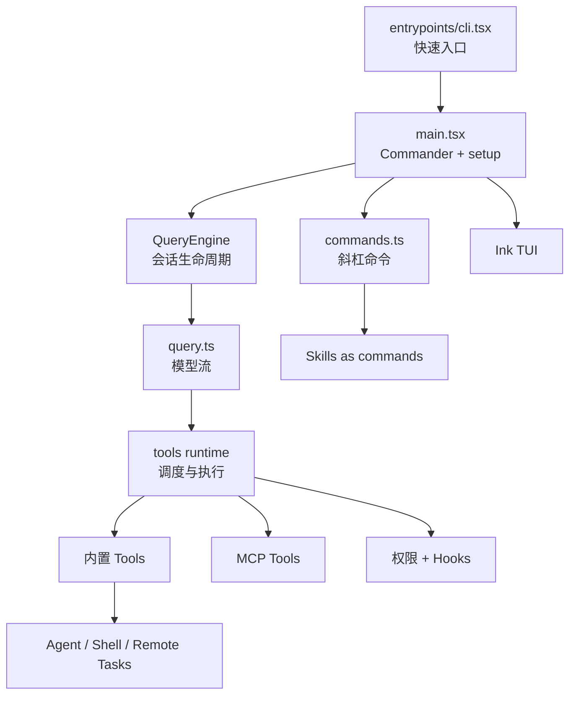

Sources: [README.md:1-16](../../../project-repos/exports/README.md#L1-L16), [README.md:70-80](../../../project-repos/exports/README.md#L70-L80), [package.json:1-12](../../../project-repos/exports/package.json#L1-L12), [src/entrypoints/cli.tsx:28-42](../../../project-repos/exports/src/entrypoints/cli.tsx#L28-L42), [src/main.tsx:884-968](../../../project-repos/exports/src/main.tsx#L884-L968), [src/QueryEngine.ts:175-207](../../../project-repos/exports/src/QueryEngine.ts#L175-L207), [src/Tool.ts:362-430](../../../project-repos/exports/src/Tool.ts#L362-L430)

引用源码

<!-- source-snippets:start -->

#### `README.md:1-16`

> 未找到引用文件：`README.md`

#### `README.md:70-80`

> 未找到引用文件：`README.md`

#### `package.json:1-12`

> 未找到引用文件：`package.json`

#### `src/entrypoints/cli.tsx:28-42`

> 未找到引用文件：`src/entrypoints/cli.tsx`

#### `src/main.tsx:884-968`

> 未找到引用文件：`src/main.tsx`

#### `src/QueryEngine.ts:175-207`

> 未找到引用文件：`src/QueryEngine.ts`

#### `src/Tool.ts:362-430`

> 未找到引用文件：`src/Tool.ts`

<!-- source-snippets:end -->

## 技术栈和规模信号

`package.json` 显示它是 `type: module` 的 Bun 项目，脚本入口指向 `src/entrypoints/cli.tsx`，生产构建用 `bun build` 注入 `MACRO.*` 常量。依赖里同时出现 React/Ink、Commander、Anthropic SDK、MCP SDK、OpenTelemetry、GrowthBook、zod、ws 和 vscode-jsonrpc，说明它不是单纯 API wrapper，而是一个集成终端 UI、协议连接、遥测和本地工程上下文的运行时。

Sources: [package.json:7-12](../../../project-repos/exports/package.json#L7-L12), [package.json:13-85](../../../project-repos/exports/package.json#L13-L85), [README.md:258-272](../../../project-repos/exports/README.md#L258-L272)

引用源码

<!-- source-snippets:start -->

#### `package.json:7-12`

> 未找到引用文件：`package.json`

#### `package.json:13-85`

> 未找到引用文件：`package.json`

#### `README.md:258-272`

> 未找到引用文件：`README.md`

<!-- source-snippets:end -->

## 阅读路线

| 目标 | 建议路径 |
|---|---|
| 想理解启动流程 | `启动与 CLI 入口` → `配置、构建与发布形态` |
| 想理解 agent 主循环 | `QueryEngine 会话运行时` → `工具系统` → `权限与 Hook` |
| 想看扩展机制 | `命令、Skill 与插件` → `MCP 集成` |
| 想看长任务和远程 | `Agent、Task 与远程会话` → `终端 UI 与键位系统` |

## 相关页面

- [启动与 CLI 入口](startup-and-cli.md) — 从 `bun run start` 到 Commander/Ink 的启动路径
- [QueryEngine 会话运行时](query-runtime.md) — 模型请求、消息持久化与上下文组装
- [工具系统](tool-system.md) — 工具注册、默认行为和并发调度

---

相关源文件

生成本页时使用的主要源文件：

- [src/entrypoints/cli.tsx](../../../project-repos/claude-code/src/entrypoints/cli.tsx)
- [src/main.tsx](../../../project-repos/claude-code/src/main.tsx)
- [package.json](../../../project-repos/claude-code/package.json)
- [plugins/bunBundleDev.ts](../../../project-repos/claude-code/plugins/bunBundleDev.ts)
- [bunfig.toml](../../../project-repos/claude-code/bunfig.toml)

# 启动与 CLI 入口

启动层有两个目标：让常见路径尽量少加载模块，同时在真正进入会话前把配置、策略、遥测和远程能力准备好。`src/entrypoints/cli.tsx` 做快速分流，`--version` 这类路径不加载完整 CLI；普通路径再动态导入启动 profiler 和 `main.tsx`。

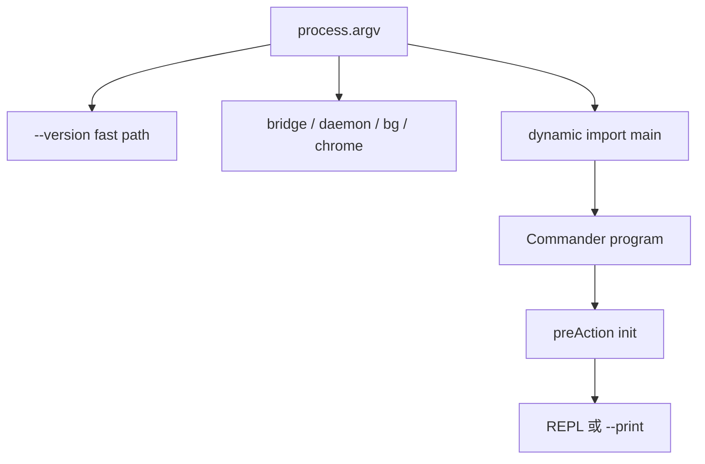

Sources: [src/entrypoints/cli.tsx:28-42](../../../project-repos/exports/src/entrypoints/cli.tsx#L28-L42), [src/entrypoints/cli.tsx:44-71](../../../project-repos/exports/src/entrypoints/cli.tsx#L44-L71), [src/entrypoints/cli.tsx:72-93](../../../project-repos/exports/src/entrypoints/cli.tsx#L72-L93), [src/entrypoints/cli.tsx:108-180](../../../project-repos/exports/src/entrypoints/cli.tsx#L108-L180), [package.json:7-12](../../../project-repos/exports/package.json#L7-L12)

引用源码

<!-- source-snippets:start -->

#### `src/entrypoints/cli.tsx:28-42`

> 未找到引用文件：`src/entrypoints/cli.tsx`

#### `src/entrypoints/cli.tsx:44-71`

> 未找到引用文件：`src/entrypoints/cli.tsx`

#### `src/entrypoints/cli.tsx:72-93`

> 未找到引用文件：`src/entrypoints/cli.tsx`

#### `src/entrypoints/cli.tsx:108-180`

> 未找到引用文件：`src/entrypoints/cli.tsx`

#### `package.json:7-12`

> 未找到引用文件：`package.json`

<!-- source-snippets:end -->

## preAction 是真实初始化阀门

`main.tsx` 没有在注册 Commander 时立刻初始化全部系统，而是把初始化挂到 `preAction`。这能让 `--help` 等路径避开重配置，同时保证实际命令执行前完成 MDM/keychain、`init()`、日志 sink、插件目录、迁移、远程托管设置和 policy limits。

Sources: [src/main.tsx:884-968](../../../project-repos/exports/src/main.tsx#L884-L968)

引用源码

<!-- source-snippets:start -->

#### `src/main.tsx:884-968`

> 未找到引用文件：`src/main.tsx`

<!-- source-snippets:end -->

## print 模式绕开子命令注册

一个不太显眼但重要的性能选择是：`-p/--print` 模式会跳过大量子命令注册。代码注释直接给出原因：mcp/auth/plugin/doctor/update 等 50 多个子命令注册路径会带来启动成本，而 print 模式只需要默认 action。

Sources: [src/main.tsx:3873-3890](../../../project-repos/exports/src/main.tsx#L3873-L3890)

引用源码

<!-- source-snippets:start -->

#### `src/main.tsx:3873-3890`

> 未找到引用文件：`src/main.tsx`

<!-- source-snippets:end -->

## CLI 不是单一入口，而是一组运行模式

主命令之外，源码还保留 server、ssh、open/connect、remote-control 等路径。`server` 会启动 session server、写 lockfile 并托管 session manager；`ssh` 则通过早期 argv rewriting 进入远程部署/隧道流程。这说明 CLI 被设计成可交互终端、headless 子进程、远程控制端和 session server 的共同外壳。

Sources: [src/main.tsx:3960-4037](../../../project-repos/exports/src/main.tsx#L3960-L4037), [src/main.tsx:4040-4052](../../../project-repos/exports/src/main.tsx#L4040-L4052), [src/main.tsx:3810-3869](../../../project-repos/exports/src/main.tsx#L3810-L3869)

引用源码

<!-- source-snippets:start -->

#### `src/main.tsx:3960-4037`

> 未找到引用文件：`src/main.tsx`

#### `src/main.tsx:4040-4052`

> 未找到引用文件：`src/main.tsx`

#### `src/main.tsx:3810-3869`

> 未找到引用文件：`src/main.tsx`

<!-- source-snippets:end -->

## 相关页面

- [项目概览](overview.md) — 先建立整体结构
- [QueryEngine 会话运行时](query-runtime.md) — 启动之后进入的会话核心
- [配置、构建与质量门禁](settings-build-quality.md) — 启动读取的配置和构建方式

---

相关源文件

生成本页时使用的主要源文件：

- [src/QueryEngine.ts](../../../project-repos/claude-code/src/QueryEngine.ts)
- [src/query.ts](../../../project-repos/claude-code/src/query.ts)
- [src/context.ts](../../../project-repos/claude-code/src/context.ts)
- [src/utils/processUserInput/processUserInput.ts](../../../project-repos/claude-code/src/utils/processUserInput/processUserInput.ts)
- [src/utils/sessionStorage.ts](../../../project-repos/claude-code/src/utils/sessionStorage.ts)
- [src/services/api/claude.ts](../../../project-repos/claude-code/src/services/api/claude.ts)

# QueryEngine 会话运行时

QueryEngine 是这个仓库里最像“内核”的对象。它把单轮 prompt 转成可持久化消息流，维护 `mutableMessages`、读文件缓存、总 usage、权限拒绝记录和已发现 Skill 集合，并把用户上下文、系统上下文、工具上下文一起交给底层 `query()`。

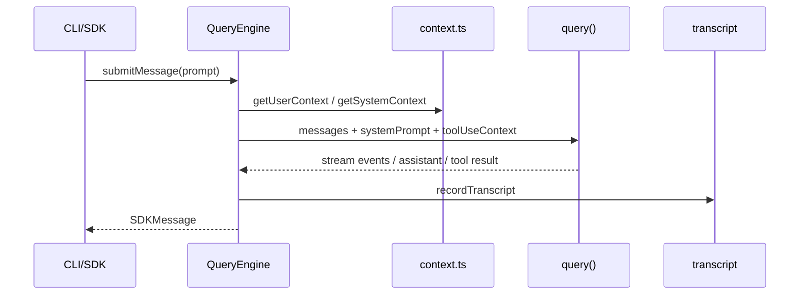

Sources: [src/QueryEngine.ts:130-173](../../../project-repos/exports/src/QueryEngine.ts#L130-L173), [src/QueryEngine.ts:175-207](../../../project-repos/exports/src/QueryEngine.ts#L175-L207), [src/QueryEngine.ts:209-220](../../../project-repos/exports/src/QueryEngine.ts#L209-L220), [src/QueryEngine.ts:675-686](../../../project-repos/exports/src/QueryEngine.ts#L675-L686)

引用源码

<!-- source-snippets:start -->

#### `src/QueryEngine.ts:130-173`

> 未找到引用文件：`src/QueryEngine.ts`

#### `src/QueryEngine.ts:175-207`

> 未找到引用文件：`src/QueryEngine.ts`

#### `src/QueryEngine.ts:209-220`

> 未找到引用文件：`src/QueryEngine.ts`

#### `src/QueryEngine.ts:675-686`

> 未找到引用文件：`src/QueryEngine.ts`

<!-- source-snippets:end -->

## 上下文注入分成系统快照和用户记忆

`context.ts` 把 git 状态作为系统上下文的一部分，同时把 `CLAUDE.md`/memory 文件收集进用户上下文。这里的设计权衡是：git 状态是“会话开始快照”，不会在会话中自动更新；而 `CLAUDE.md` 读取被 `--bare`、环境变量和额外目录控制，避免最小模式下隐式扫描本地项目。

Sources: [src/context.ts:36-111](../../../project-repos/exports/src/context.ts#L36-L111), [src/context.ts:113-149](../../../project-repos/exports/src/context.ts#L113-L149), [src/context.ts:152-188](../../../project-repos/exports/src/context.ts#L152-L188)

引用源码

<!-- source-snippets:start -->

#### `src/context.ts:36-111`

> 未找到引用文件：`src/context.ts`

#### `src/context.ts:113-149`

> 未找到引用文件：`src/context.ts`

#### `src/context.ts:152-188`

> 未找到引用文件：`src/context.ts`

<!-- source-snippets:end -->

## 转录持久化兼顾 SDK 流式输出

QueryEngine 在收到 assistant/user/compact boundary 时更新内存消息，并把 transcript 写到磁盘。一个细节是 assistant message 的持久化采用 fire-and-forget，原因是流式响应里 message_delta 还会补 stop_reason/usage；如果逐块 await，反而会阻塞后续 delta。

Sources: [src/QueryEngine.ts:675-731](../../../project-repos/exports/src/QueryEngine.ts#L675-L731), [src/QueryEngine.ts:757-816](../../../project-repos/exports/src/QueryEngine.ts#L757-L816)

引用源码

<!-- source-snippets:start -->

#### `src/QueryEngine.ts:675-731`

> 未找到引用文件：`src/QueryEngine.ts`

#### `src/QueryEngine.ts:757-816`

> 未找到引用文件：`src/QueryEngine.ts`

<!-- source-snippets:end -->

## 兼容函数 `ask()` 只是 QueryEngine 包装

文件后半保留 `ask()` 风格的生成器函数，但它本质上创建 QueryEngine，再把 `submitMessage()` yield 出去。这是一个迁移形态：外部调用点可以继续用旧函数签名，内部状态管理已经集中到类。

Sources: [src/QueryEngine.ts:1200-1295](../../../project-repos/exports/src/QueryEngine.ts#L1200-L1295)

引用源码

<!-- source-snippets:start -->

#### `src/QueryEngine.ts:1200-1295`

> 未找到引用文件：`src/QueryEngine.ts`

<!-- source-snippets:end -->

## 相关页面

- [启动与 CLI 入口](startup-and-cli.md) — QueryEngine 如何被入口调用
- [工具系统](tool-system.md) — QueryEngine 如何把 toolUseContext 交给工具
- [配置、构建与质量门禁](settings-build-quality.md) — 会话读取配置和上下文

---

相关源文件

生成本页时使用的主要源文件：

- [src/Tool.ts](../../../project-repos/claude-code/src/Tool.ts)
- [src/tools.ts](../../../project-repos/claude-code/src/tools.ts)
- [src/services/tools/toolOrchestration.ts](../../../project-repos/claude-code/src/services/tools/toolOrchestration.ts)
- [src/services/tools/toolExecution.ts](../../../project-repos/claude-code/src/services/tools/toolExecution.ts)
- [src/tools/BashTool/BashTool.tsx](../../../project-repos/claude-code/src/tools/BashTool/BashTool.tsx)
- [src/tools/FileReadTool/FileReadTool.tsx](../../../project-repos/claude-code/src/tools/FileReadTool/FileReadTool.tsx)
- [src/tools/GrepTool/GrepTool.tsx](../../../project-repos/claude-code/src/tools/GrepTool/GrepTool.tsx)

# 工具系统

工具系统把“模型想做事”变成可验证的 TypeScript 合同。每个 Tool 既有 `inputSchema` 和 `call()`，也必须说明是否并发安全、是否只读、是否破坏性、如何做权限检查、如何生成 prompt 和 UI 名称。这个接口让 Bash、文件编辑、MCP、Agent、Skill 这些差异很大的能力被同一个运行时调度。

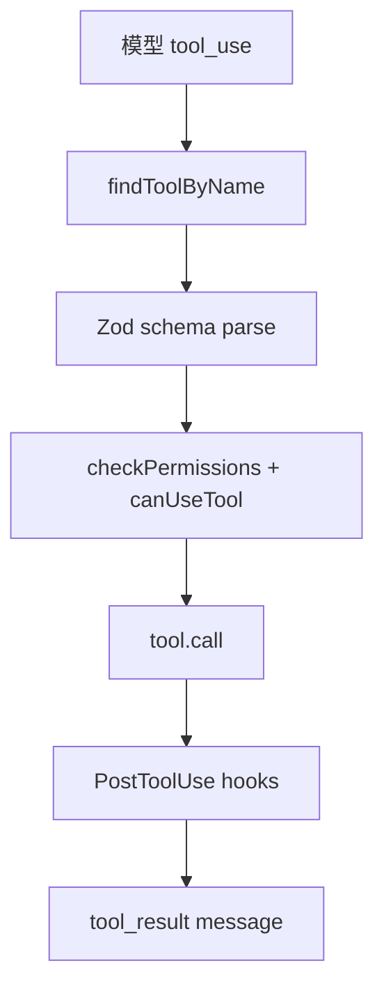

Sources: [src/Tool.ts:362-430](../../../project-repos/exports/src/Tool.ts#L362-L430), [src/Tool.ts:495-540](../../../project-repos/exports/src/Tool.ts#L495-L540), [src/Tool.ts:721-792](../../../project-repos/exports/src/Tool.ts#L721-L792)

引用源码

<!-- source-snippets:start -->

#### `src/Tool.ts:362-430`

> 未找到引用文件：`src/Tool.ts`

#### `src/Tool.ts:495-540`

> 未找到引用文件：`src/Tool.ts`

#### `src/Tool.ts:721-792`

> 未找到引用文件：`src/Tool.ts`

<!-- source-snippets:end -->

## 注册表被 feature flag 和环境共同裁剪

`tools.ts` 是内置工具的事实注册表。它用 `feature('...')`、`process.env.USER_TYPE`、运行时 gate 和懒加载组合出最终工具列表；例如搜索工具会因内嵌 bfs/ugrep 存在而省略，LSP 和 worktree 工具也受环境 gate 控制。

Sources: [src/tools.ts:1-53](../../../project-repos/exports/src/tools.ts#L1-L53), [src/tools.ts:158-183](../../../project-repos/exports/src/tools.ts#L158-L183), [src/tools.ts:193-250](../../../project-repos/exports/src/tools.ts#L193-L250)

引用源码

<!-- source-snippets:start -->

#### `src/tools.ts:1-53`

> 未找到引用文件：`src/tools.ts`

#### `src/tools.ts:158-183`

> 未找到引用文件：`src/tools.ts`

#### `src/tools.ts:193-250`

> 未找到引用文件：`src/tools.ts`

<!-- source-snippets:end -->

## 并发调度只给显式声明安全的工具

`runTools()` 会把连续 tool call 分批：并发安全的批次并行执行，非并发安全工具串行执行。这里不是简单判断只读，而是调用工具自己的 `isConcurrencySafe(parsedInput)`；解析失败或判断抛错都会保守地当成不安全。

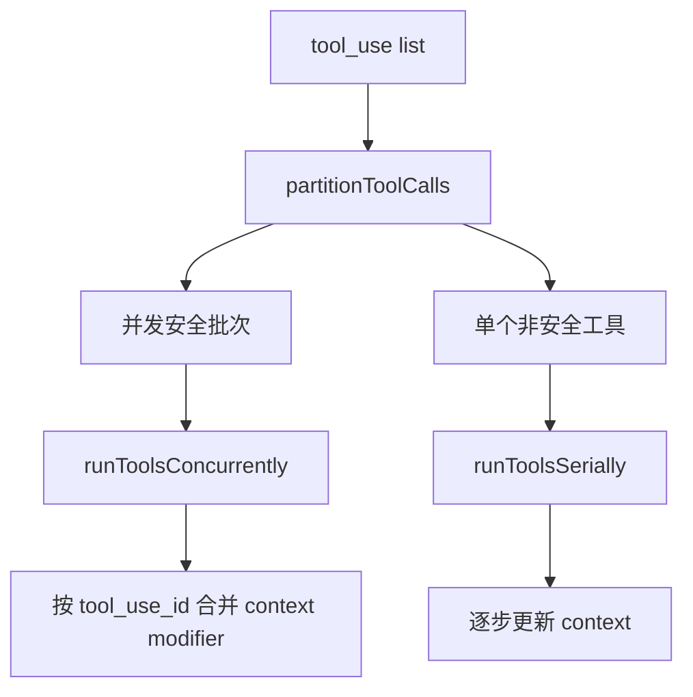

Sources: [src/services/tools/toolOrchestration.ts:19-82](../../../project-repos/exports/src/services/tools/toolOrchestration.ts#L19-L82), [src/services/tools/toolOrchestration.ts:84-116](../../../project-repos/exports/src/services/tools/toolOrchestration.ts#L84-L116), [src/services/tools/toolOrchestration.ts:118-177](../../../project-repos/exports/src/services/tools/toolOrchestration.ts#L118-L177)

引用源码

<!-- source-snippets:start -->

#### `src/services/tools/toolOrchestration.ts:19-82`

> 未找到引用文件：`src/services/tools/toolOrchestration.ts`

#### `src/services/tools/toolOrchestration.ts:84-116`

> 未找到引用文件：`src/services/tools/toolOrchestration.ts`

#### `src/services/tools/toolOrchestration.ts:118-177`

> 未找到引用文件：`src/services/tools/toolOrchestration.ts`

<!-- source-snippets:end -->

## 执行层对未知工具、取消和 schema 缺失都有明确回路

`runToolUse()` 先在当前可见工具里找，再允许 alias fallback 兼容旧 transcript。找不到工具会生成 `tool_use_error`；输入 schema 错误时还会在 ToolSearch 场景下给模型一个“先加载工具 schema”的提示。这是为长会话和 deferred tools 准备的恢复机制。

Sources: [src/services/tools/toolExecution.ts:337-410](../../../project-repos/exports/src/services/tools/toolExecution.ts#L337-L410), [src/services/tools/toolExecution.ts:572-597](../../../project-repos/exports/src/services/tools/toolExecution.ts#L572-L597), [src/services/tools/toolExecution.ts:599-620](../../../project-repos/exports/src/services/tools/toolExecution.ts#L599-L620)

引用源码

<!-- source-snippets:start -->

#### `src/services/tools/toolExecution.ts:337-410`

> 未找到引用文件：`src/services/tools/toolExecution.ts`

#### `src/services/tools/toolExecution.ts:572-597`

> 未找到引用文件：`src/services/tools/toolExecution.ts`

#### `src/services/tools/toolExecution.ts:599-620`

> 未找到引用文件：`src/services/tools/toolExecution.ts`

<!-- source-snippets:end -->

## 相关页面

- [QueryEngine 会话运行时](query-runtime.md) — 工具调度由 QueryEngine 驱动
- [权限与 Hook](permissions-hooks.md) — 工具执行前后的安全边界
- [Agent、Task 与远程会话](agent-task-remote.md) — AgentTool 是工具系统的一部分

---

相关源文件

生成本页时使用的主要源文件：

- [src/Tool.ts](../../../project-repos/claude-code/src/Tool.ts)
- [src/hooks/useCanUseTool.tsx](../../../project-repos/claude-code/src/hooks/useCanUseTool.tsx)
- [src/hooks/toolPermission/PermissionContext.ts](../../../project-repos/claude-code/src/hooks/toolPermission/PermissionContext.ts)
- [src/hooks/toolPermission/handlers/interactiveHandler.ts](../../../project-repos/claude-code/src/hooks/toolPermission/handlers/interactiveHandler.ts)
- [src/hooks/toolPermission/handlers/coordinatorHandler.ts](../../../project-repos/claude-code/src/hooks/toolPermission/handlers/coordinatorHandler.ts)
- [src/utils/permissions/permissions.ts](../../../project-repos/claude-code/src/utils/permissions/permissions.ts)
- [src/utils/permissions/permissionSetup.ts](../../../project-repos/claude-code/src/utils/permissions/permissionSetup.ts)
- [src/services/tools/toolHooks.ts](../../../project-repos/claude-code/src/services/tools/toolHooks.ts)

# 权限与 Hook

权限层不是单个“是否允许”的 if。它把配置规则、permission mode、Hook、bash/auto classifier、交互式 UI、桥接端响应、远程 channel 响应和 agent 场景放进同一条 race。结果只有三类：allow、deny、ask；但 ask 可以被自动检查、用户、Hook 或远程控制端抢先解决。

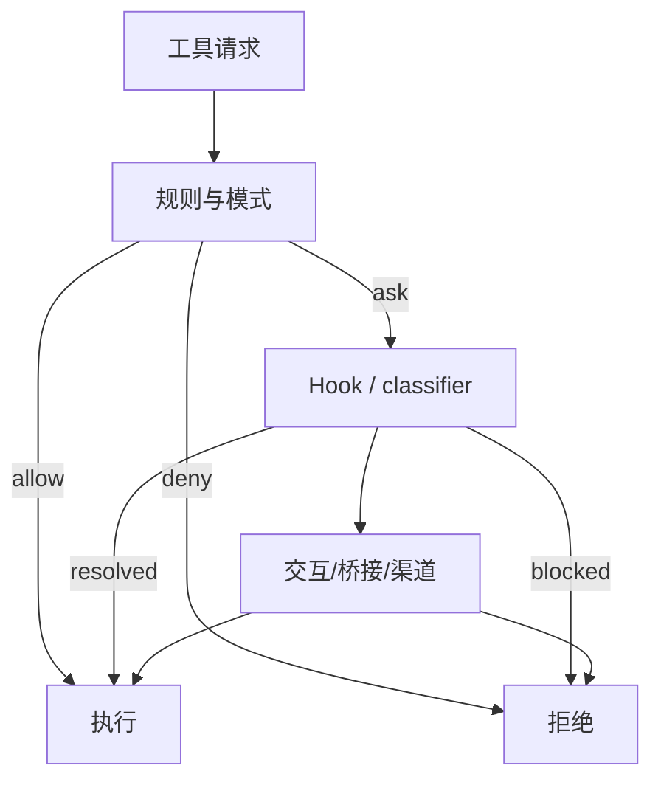

Sources: [src/hooks/useCanUseTool.tsx:27-64](../../../project-repos/exports/src/hooks/useCanUseTool.tsx#L27-L64), [src/hooks/useCanUseTool.tsx:93-168](../../../project-repos/exports/src/hooks/useCanUseTool.tsx#L93-L168), [src/hooks/toolPermission/PermissionContext.ts:96-173](../../../project-repos/exports/src/hooks/toolPermission/PermissionContext.ts#L96-L173)

引用源码

<!-- source-snippets:start -->

#### `src/hooks/useCanUseTool.tsx:27-64`

> 未找到引用文件：`src/hooks/useCanUseTool.tsx`

#### `src/hooks/useCanUseTool.tsx:93-168`

> 未找到引用文件：`src/hooks/useCanUseTool.tsx`

#### `src/hooks/toolPermission/PermissionContext.ts:96-173`

> 未找到引用文件：`src/hooks/toolPermission/PermissionContext.ts`

<!-- source-snippets:end -->

## 规则匹配支持工具级和 MCP server 级

`permissions.ts` 把 allow/deny/ask 规则统一解析成 `PermissionRule`，并通过 `getToolNameForPermissionCheck()` 处理 MCP 前缀。规则 `mcp__server` 可以匹配该 server 下所有工具；这让 MCP 工具不用在权限系统里变成例外。

Sources: [src/utils/permissions/permissions.ts:122-131](../../../project-repos/exports/src/utils/permissions/permissions.ts#L122-L131), [src/utils/permissions/permissions.ts:213-231](../../../project-repos/exports/src/utils/permissions/permissions.ts#L213-L231), [src/utils/permissions/permissions.ts:233-269](../../../project-repos/exports/src/utils/permissions/permissions.ts#L233-L269), [src/utils/permissions/permissions.ts:275-302](../../../project-repos/exports/src/utils/permissions/permissions.ts#L275-L302)

引用源码

<!-- source-snippets:start -->

#### `src/utils/permissions/permissions.ts:122-131`

> 未找到引用文件：`src/utils/permissions/permissions.ts`

#### `src/utils/permissions/permissions.ts:213-231`

> 未找到引用文件：`src/utils/permissions/permissions.ts`

#### `src/utils/permissions/permissions.ts:233-269`

> 未找到引用文件：`src/utils/permissions/permissions.ts`

#### `src/utils/permissions/permissions.ts:275-302`

> 未找到引用文件：`src/utils/permissions/permissions.ts`

<!-- source-snippets:end -->

## 自动模式会剥离危险 allow 规则

`permissionSetup.ts` 对 Bash、PowerShell、Agent 的 auto mode 权限做危险模式检测：全量 Bash、解释器前缀、PowerShell code exec、Agent allow 都被视为会绕过分类器的风险。这是一个关键设计点：auto mode 不是“自动接受已有 allow”，而是要防止用户配置把分类器架空。

Sources: [src/utils/permissions/permissionSetup.ts:84-147](../../../project-repos/exports/src/utils/permissions/permissionSetup.ts#L84-L147), [src/utils/permissions/permissionSetup.ts:149-245](../../../project-repos/exports/src/utils/permissions/permissionSetup.ts#L149-L245)

引用源码

<!-- source-snippets:start -->

#### `src/utils/permissions/permissionSetup.ts:84-147`

> 未找到引用文件：`src/utils/permissions/permissionSetup.ts`

#### `src/utils/permissions/permissionSetup.ts:149-245`

> 未找到引用文件：`src/utils/permissions/permissionSetup.ts`

<!-- source-snippets:end -->

## Hook 既能补上下文，也能改写 MCP 输出

`toolHooks.ts` 的 PostToolUse 路径不仅会展示 Hook 结果，还允许 Hook 阻断继续、追加上下文、取消或在 MCP 工具场景下返回 `updatedMCPToolOutput`。这说明 Hook 不是外部脚本通知，而是会参与下一轮模型输入的控制点。

Sources: [src/services/tools/toolHooks.ts:39-64](../../../project-repos/exports/src/services/tools/toolHooks.ts#L39-L64), [src/services/tools/toolHooks.ts:90-151](../../../project-repos/exports/src/services/tools/toolHooks.ts#L90-L151), [src/services/tools/toolHooks.ts:193-260](../../../project-repos/exports/src/services/tools/toolHooks.ts#L193-L260)

引用源码

<!-- source-snippets:start -->

#### `src/services/tools/toolHooks.ts:39-64`

> 未找到引用文件：`src/services/tools/toolHooks.ts`

#### `src/services/tools/toolHooks.ts:90-151`

> 未找到引用文件：`src/services/tools/toolHooks.ts`

#### `src/services/tools/toolHooks.ts:193-260`

> 未找到引用文件：`src/services/tools/toolHooks.ts`

<!-- source-snippets:end -->

## 相关页面

- [工具系统](tool-system.md) — 权限决策发生在工具执行前
- [MCP 集成](mcp-integration.md) — MCP 工具也进入同一权限模型
- [Agent、Task 与远程会话](agent-task-remote.md) — 后台/远程 agent 会改变权限处理路径

---

相关源文件

生成本页时使用的主要源文件：

- [src/commands.ts](../../../project-repos/claude-code/src/commands.ts)
- [src/skills/loadSkillsDir.ts](../../../project-repos/claude-code/src/skills/loadSkillsDir.ts)
- [src/tools/SkillTool/SkillTool.ts](../../../project-repos/claude-code/src/tools/SkillTool/SkillTool.ts)
- [src/plugins/bundled/index.ts](../../../project-repos/claude-code/src/plugins/bundled/index.ts)
- [src/utils/plugins/loadPluginCommands.ts](../../../project-repos/claude-code/src/utils/plugins/loadPluginCommands.ts)
- [src/services/skillSearch/localSearch.ts](../../../project-repos/claude-code/src/services/skillSearch/localSearch.ts)

# 命令、Skill 与插件

命令系统有两层：用户输入 `/xxx` 的 slash command，以及模型通过 `SkillTool` 调用的 prompt command。源码里的关键不是“命令很多”，而是这些命令来源不同：内置命令、本地 skills、项目 skills、托管 skills、插件 skills、MCP skills，最终都被规整成 `Command`。

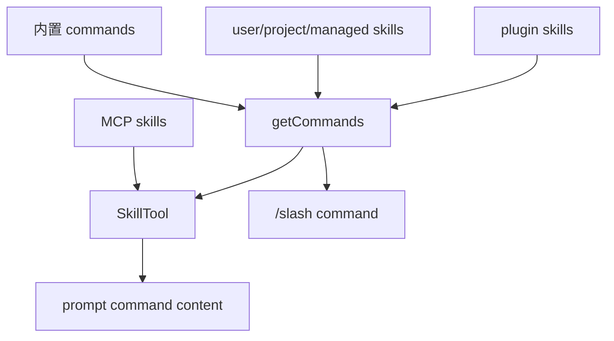

Sources: [src/commands.ts:256-346](../../../project-repos/exports/src/commands.ts#L256-L346), [src/commands.ts:353-398](../../../project-repos/exports/src/commands.ts#L353-L398), [src/commands.ts:541-580](../../../project-repos/exports/src/commands.ts#L541-L580), [src/commands.ts:583-608](../../../project-repos/exports/src/commands.ts#L583-L608)

引用源码

<!-- source-snippets:start -->

#### `src/commands.ts:256-346`

> 未找到引用文件：`src/commands.ts`

#### `src/commands.ts:353-398`

> 未找到引用文件：`src/commands.ts`

#### `src/commands.ts:541-580`

> 未找到引用文件：`src/commands.ts`

#### `src/commands.ts:583-608`

> 未找到引用文件：`src/commands.ts`

<!-- source-snippets:end -->

## Skill frontmatter 被解析成运行约束

`loadSkillsDir.ts` 会解析 `description`、`allowed-tools`、`when_to_use`、`model`、`disable-model-invocation`、`hooks`、`context: fork`、`agent`、`effort` 和 `shell`。Skill 因此不只是 Markdown 片段，而是带工具约束、执行上下文和模型偏好的 prompt command。

Sources: [src/skills/loadSkillsDir.ts:180-265](../../../project-repos/exports/src/skills/loadSkillsDir.ts#L180-L265), [src/skills/loadSkillsDir.ts:270-400](../../../project-repos/exports/src/skills/loadSkillsDir.ts#L270-L400)

引用源码

<!-- source-snippets:start -->

#### `src/skills/loadSkillsDir.ts:180-265`

> 未找到引用文件：`src/skills/loadSkillsDir.ts`

#### `src/skills/loadSkillsDir.ts:270-400`

> 未找到引用文件：`src/skills/loadSkillsDir.ts`

<!-- source-snippets:end -->

## 装载顺序兼顾策略和显式目录

Skill 发现会并行读取 managed、user、project、`--add-dir` 和 legacy commands；`--bare` 则跳过自动发现，只加载显式 add-dir 下的项目 skills。随后按 realpath 去重，避免 symlink 或重叠目录导致重复注入。

Sources: [src/skills/loadSkillsDir.ts:638-675](../../../project-repos/exports/src/skills/loadSkillsDir.ts#L638-L675), [src/skills/loadSkillsDir.ts:677-760](../../../project-repos/exports/src/skills/loadSkillsDir.ts#L677-L760)

引用源码

<!-- source-snippets:start -->

#### `src/skills/loadSkillsDir.ts:638-675`

> 未找到引用文件：`src/skills/loadSkillsDir.ts`

#### `src/skills/loadSkillsDir.ts:677-760`

> 未找到引用文件：`src/skills/loadSkillsDir.ts`

<!-- source-snippets:end -->

## SkillTool 支持 inline 和 fork 两种执行语义

`SkillTool` 会把 MCP skills 合并进可执行命令集合，并可把某个 Skill 放进 forked sub-agent 中执行。fork 路径会准备独立 agent context、记录 telemetry，并把 skill effort 合并到 agent definition。这让复杂 Skill 不必挤在主会话 token 预算里。

Sources: [src/tools/SkillTool/SkillTool.ts:77-94](../../../project-repos/exports/src/tools/SkillTool/SkillTool.ts#L77-L94), [src/tools/SkillTool/SkillTool.ts:118-236](../../../project-repos/exports/src/tools/SkillTool/SkillTool.ts#L118-L236)

引用源码

<!-- source-snippets:start -->

#### `src/tools/SkillTool/SkillTool.ts:77-94`

> 未找到引用文件：`src/tools/SkillTool/SkillTool.ts`

#### `src/tools/SkillTool/SkillTool.ts:118-236`

> 未找到引用文件：`src/tools/SkillTool/SkillTool.ts`

<!-- source-snippets:end -->

## 相关页面

- [启动与 CLI 入口](startup-and-cli.md) — 命令从 Commander 主入口进入
- [MCP 集成](mcp-integration.md) — MCP Skill 也会进入命令/SkillTool
- [工具系统](tool-system.md) — SkillTool 是工具注册表中的工具

---

相关源文件

生成本页时使用的主要源文件：

- [src/services/mcp/client.ts](../../../project-repos/claude-code/src/services/mcp/client.ts)
- [src/services/mcp/config.ts](../../../project-repos/claude-code/src/services/mcp/config.ts)
- [src/services/mcp/types.ts](../../../project-repos/claude-code/src/services/mcp/types.ts)
- [src/services/mcp/mcpStringUtils.ts](../../../project-repos/claude-code/src/services/mcp/mcpStringUtils.ts)
- [src/tools/MCPTool/MCPTool.ts](../../../project-repos/claude-code/src/tools/MCPTool/MCPTool.ts)
- [src/tools/ListMcpResourcesTool/ListMcpResourcesTool.ts](../../../project-repos/claude-code/src/tools/ListMcpResourcesTool/ListMcpResourcesTool.ts)
- [src/tools/ReadMcpResourceTool/ReadMcpResourceTool.ts](../../../project-repos/claude-code/src/tools/ReadMcpResourceTool/ReadMcpResourceTool.ts)

# MCP 集成

MCP 在这里是扩展协议，不是外挂脚本。配置层负责合并手写、插件、claude.ai connector 和企业策略；连接层支持 stdio、SSE、HTTP、WebSocket、IDE、SDK、claude.ai proxy；工具层再把远端 tools/resources/prompts 变成模型可见能力。

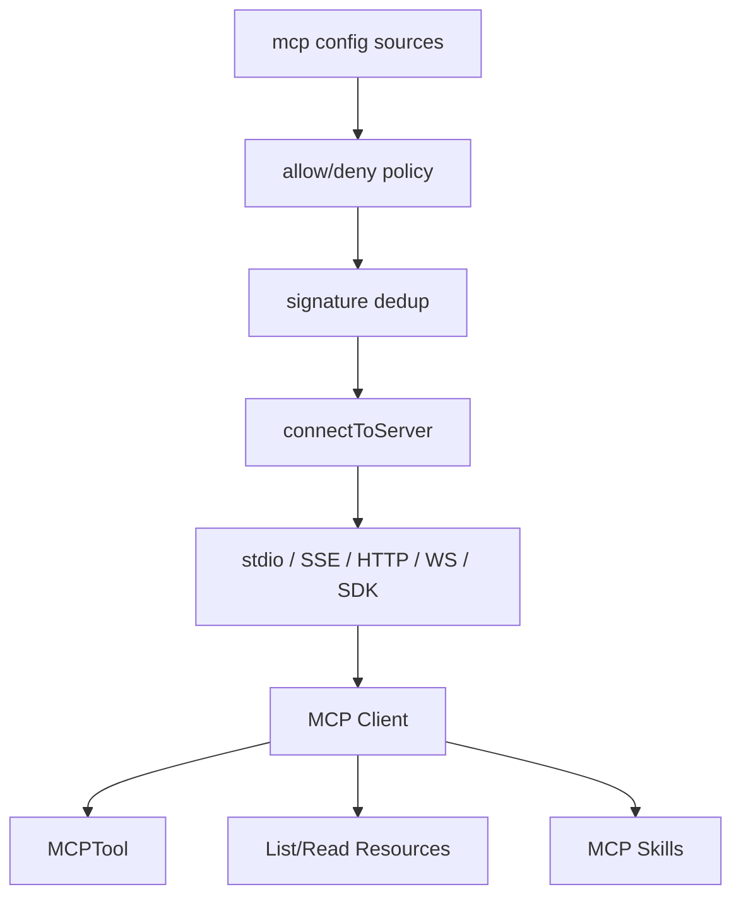

Sources: [src/services/mcp/config.ts:59-131](../../../project-repos/exports/src/services/mcp/config.ts#L59-L131), [src/services/mcp/config.ts:195-265](../../../project-repos/exports/src/services/mcp/config.ts#L195-L265), [src/services/mcp/config.ts:268-309](../../../project-repos/exports/src/services/mcp/config.ts#L268-L309)

引用源码

<!-- source-snippets:start -->

#### `src/services/mcp/config.ts:59-131`

> 未找到引用文件：`src/services/mcp/config.ts`

#### `src/services/mcp/config.ts:195-265`

> 未找到引用文件：`src/services/mcp/config.ts`

#### `src/services/mcp/config.ts:268-309`

> 未找到引用文件：`src/services/mcp/config.ts`

<!-- source-snippets:end -->

## 策略过滤既支持名称，也支持 command 和 URL

企业 allowlist/denylist 不只匹配 serverName；stdio server 可以按 command array 匹配，远程 server 可以按 URL pattern 匹配。denylist 最高优先级，allowlist 为空时等于全部阻断。SDK 类型 server 被特别豁免，因为它不由 CLI 启动进程或网络连接。

Sources: [src/services/mcp/config.ts:336-407](../../../project-repos/exports/src/services/mcp/config.ts#L336-L407), [src/services/mcp/config.ts:410-550](../../../project-repos/exports/src/services/mcp/config.ts#L410-L550)

引用源码

<!-- source-snippets:start -->

#### `src/services/mcp/config.ts:336-407`

> 未找到引用文件：`src/services/mcp/config.ts`

#### `src/services/mcp/config.ts:410-550`

> 未找到引用文件：`src/services/mcp/config.ts`

<!-- source-snippets:end -->

## transport 处理了长连接和代理细节

`client.ts` 的连接逻辑对 SSE 进行了特别处理：普通请求套 60 秒超时，但 EventSource 长连接不能套这个 timeout，否则会断开持续事件流。WebSocket 路径同时兼容 Bun 和 Node `ws`，并带代理、TLS、header 脱敏日志。

Sources: [src/services/mcp/client.ts:146-218](../../../project-repos/exports/src/services/mcp/client.ts#L146-L218), [src/services/mcp/client.ts:552-585](../../../project-repos/exports/src/services/mcp/client.ts#L552-L585), [src/services/mcp/client.ts:595-677](../../../project-repos/exports/src/services/mcp/client.ts#L595-L677), [src/services/mcp/client.ts:708-780](../../../project-repos/exports/src/services/mcp/client.ts#L708-L780)

引用源码

<!-- source-snippets:start -->

#### `src/services/mcp/client.ts:146-218`

> 未找到引用文件：`src/services/mcp/client.ts`

#### `src/services/mcp/client.ts:552-585`

> 未找到引用文件：`src/services/mcp/client.ts`

#### `src/services/mcp/client.ts:595-677`

> 未找到引用文件：`src/services/mcp/client.ts`

#### `src/services/mcp/client.ts:708-780`

> 未找到引用文件：`src/services/mcp/client.ts`

<!-- source-snippets:end -->

## MCP 会话过期有可识别错误

源码专门识别 HTTP 404 + JSON-RPC `-32001` 的 session expired，而不是把所有 404 都当成会话丢失。这种双信号判断减少了错误 URL 或 server 不在线时的误恢复。

Sources: [src/services/mcp/client.ts:161-206](../../../project-repos/exports/src/services/mcp/client.ts#L161-L206)

引用源码

<!-- source-snippets:start -->

#### `src/services/mcp/client.ts:161-206`

> 未找到引用文件：`src/services/mcp/client.ts`

<!-- source-snippets:end -->

## 相关页面

- [命令、Skill 与插件](commands-skills-plugins.md) — MCP prompts/skills 进入命令系统
- [权限与 Hook](permissions-hooks.md) — MCP 工具沿用权限模型
- [Agent、Task 与远程会话](agent-task-remote.md) — Agent 可声明自己的 MCP server

---

相关源文件

生成本页时使用的主要源文件：

- [src/tools/AgentTool/AgentTool.tsx](../../../project-repos/claude-code/src/tools/AgentTool/AgentTool.tsx)
- [src/tools/AgentTool/runAgent.ts](../../../project-repos/claude-code/src/tools/AgentTool/runAgent.ts)
- [src/Task.ts](../../../project-repos/claude-code/src/Task.ts)
- [src/tasks.ts](../../../project-repos/claude-code/src/tasks.ts)
- [src/remote/RemoteSessionManager.ts](../../../project-repos/claude-code/src/remote/RemoteSessionManager.ts)
- [src/remote/SessionsWebSocket.ts](../../../project-repos/claude-code/src/remote/SessionsWebSocket.ts)
- [src/main.tsx](../../../project-repos/claude-code/src/main.tsx)

# Agent、Task 与远程会话

Agent 和 Task 把“长时间执行”从单个 tool result 中拆出来。AgentTool 可以同步返回，也可以后台运行、远程运行、worktree 隔离或作为 teammate 参与多 agent 协作；Task 则给这些后台实体统一 ID、状态、输出文件和 kill 接口。

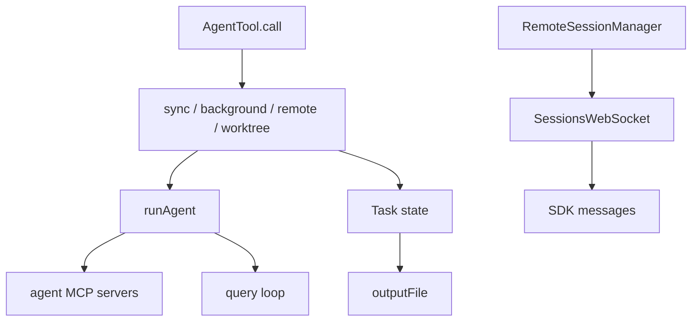

Sources: [src/tools/AgentTool/AgentTool.tsx:81-155](../../../project-repos/exports/src/tools/AgentTool/AgentTool.tsx#L81-L155), [src/tools/AgentTool/AgentTool.tsx:196-260](../../../project-repos/exports/src/tools/AgentTool/AgentTool.tsx#L196-L260), [src/Task.ts:6-29](../../../project-repos/exports/src/Task.ts#L6-L29), [src/Task.ts:44-76](../../../project-repos/exports/src/Task.ts#L44-L76), [src/tasks.ts:17-38](../../../project-repos/exports/src/tasks.ts#L17-L38)

引用源码

<!-- source-snippets:start -->

#### `src/tools/AgentTool/AgentTool.tsx:81-155`

> 未找到引用文件：`src/tools/AgentTool/AgentTool.tsx`

#### `src/tools/AgentTool/AgentTool.tsx:196-260`

> 未找到引用文件：`src/tools/AgentTool/AgentTool.tsx`

#### `src/Task.ts:6-29`

> 未找到引用文件：`src/Task.ts`

#### `src/Task.ts:44-76`

> 未找到引用文件：`src/Task.ts`

#### `src/tasks.ts:17-38`

> 未找到引用文件：`src/tasks.ts`

<!-- source-snippets:end -->

## Agent 可以声明自己的 MCP 依赖

`runAgent.ts` 在 agent 启动时会读取 agent definition 里的 `mcpServers`，引用已有配置或内联定义，然后连接并拉取 tools。内联 server 在 agent 完成时清理，引用父级配置的 shared client 不清理；这个区别避免了子 agent 误关主会话的 MCP 连接。

Sources: [src/tools/AgentTool/runAgent.ts:85-127](../../../project-repos/exports/src/tools/AgentTool/runAgent.ts#L85-L127), [src/tools/AgentTool/runAgent.ts:129-218](../../../project-repos/exports/src/tools/AgentTool/runAgent.ts#L129-L218)

引用源码

<!-- source-snippets:start -->

#### `src/tools/AgentTool/runAgent.ts:85-127`

> 未找到引用文件：`src/tools/AgentTool/runAgent.ts`

#### `src/tools/AgentTool/runAgent.ts:129-218`

> 未找到引用文件：`src/tools/AgentTool/runAgent.ts`

<!-- source-snippets:end -->

## 远程会话把消息流和权限流分开

`RemoteSessionManager` 用 WebSocket 接收 SDKMessage 和 control request，用 HTTP POST 发用户消息。权限请求不是普通聊天消息，而是 control_request；pending map 保存 request_id，允许远端取消或用户响应后回传 allow/deny。

Sources: [src/remote/RemoteSessionManager.ts:87-103](../../../project-repos/exports/src/remote/RemoteSessionManager.ts#L87-L103), [src/remote/RemoteSessionManager.ts:143-183](../../../project-repos/exports/src/remote/RemoteSessionManager.ts#L143-L183), [src/remote/RemoteSessionManager.ts:186-260](../../../project-repos/exports/src/remote/RemoteSessionManager.ts#L186-L260)

引用源码

<!-- source-snippets:start -->

#### `src/remote/RemoteSessionManager.ts:87-103`

> 未找到引用文件：`src/remote/RemoteSessionManager.ts`

#### `src/remote/RemoteSessionManager.ts:143-183`

> 未找到引用文件：`src/remote/RemoteSessionManager.ts`

#### `src/remote/RemoteSessionManager.ts:186-260`

> 未找到引用文件：`src/remote/RemoteSessionManager.ts`

<!-- source-snippets:end -->

## WebSocket 恢复策略区分临时和永久关闭

`SessionsWebSocket` 对 4003 unauthorized 这类永久关闭停止重连；对 4001 session not found 保留有限重试窗口，因为 compaction 时后端可能短暂认为 session stale。这个细节说明远程会话要兼容长上下文压缩造成的短暂不可用。

Sources: [src/remote/SessionsWebSocket.ts:17-36](../../../project-repos/exports/src/remote/SessionsWebSocket.ts#L17-L36), [src/remote/SessionsWebSocket.ts:74-119](../../../project-repos/exports/src/remote/SessionsWebSocket.ts#L74-L119), [src/remote/SessionsWebSocket.ts:231-260](../../../project-repos/exports/src/remote/SessionsWebSocket.ts#L231-L260)

引用源码

<!-- source-snippets:start -->

#### `src/remote/SessionsWebSocket.ts:17-36`

> 未找到引用文件：`src/remote/SessionsWebSocket.ts`

#### `src/remote/SessionsWebSocket.ts:74-119`

> 未找到引用文件：`src/remote/SessionsWebSocket.ts`

#### `src/remote/SessionsWebSocket.ts:231-260`

> 未找到引用文件：`src/remote/SessionsWebSocket.ts`

<!-- source-snippets:end -->

## 相关页面

- [工具系统](tool-system.md) — AgentTool 作为模型可调用工具
- [MCP 集成](mcp-integration.md) — Agent 可以拥有额外 MCP server
- [终端 UI 与键位系统](terminal-ui-keybindings.md) — 远程和后台任务如何反映到 UI

---

相关源文件

生成本页时使用的主要源文件：

- [src/ink.ts](../../../project-repos/claude-code/src/ink.ts)
- [src/ink/screen.ts](../../../project-repos/claude-code/src/ink/screen.ts)
- [src/keybindings/defaultBindings.ts](../../../project-repos/claude-code/src/keybindings/defaultBindings.ts)
- [src/keybindings/resolver.ts](../../../project-repos/claude-code/src/keybindings/resolver.ts)
- [src/keybindings/parser.ts](../../../project-repos/claude-code/src/keybindings/parser.ts)
- [src/keybindings/loadUserBindings.ts](../../../project-repos/claude-code/src/keybindings/loadUserBindings.ts)
- [src/components/permissions/PermissionRequest.tsx](../../../project-repos/claude-code/src/components/permissions/PermissionRequest.tsx)

# 终端 UI 与键位系统

UI 层的重点不是 React 组件数量，而是终端渲染的约束：字符、ANSI 样式、超链接、选择区域和键盘协议都需要稳定处理。项目把 Ink 包了一层主题系统，并在底层 screen 里做 char/style pool，减少重复字符串和 ANSI transition 计算。

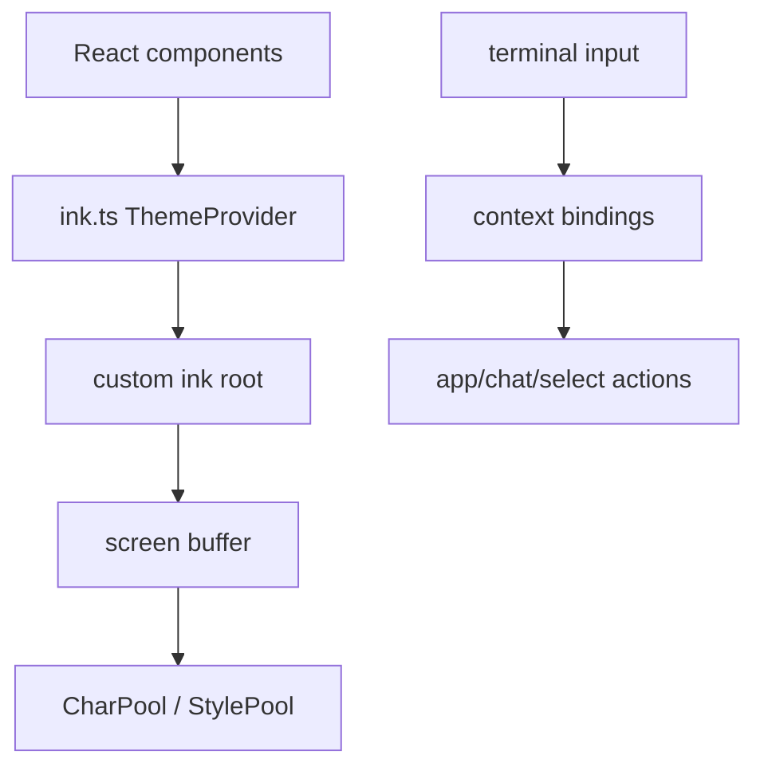

Sources: [src/ink.ts:1-31](../../../project-repos/exports/src/ink.ts#L1-L31), [src/ink.ts:33-85](../../../project-repos/exports/src/ink.ts#L33-L85), [src/ink/screen.ts:15-53](../../../project-repos/exports/src/ink/screen.ts#L15-L53), [src/ink/screen.ts:112-162](../../../project-repos/exports/src/ink/screen.ts#L112-L162)

引用源码

<!-- source-snippets:start -->

#### `src/ink.ts:1-31`

> 未找到引用文件：`src/ink.ts`

#### `src/ink.ts:33-85`

> 未找到引用文件：`src/ink.ts`

#### `src/ink/screen.ts:15-53`

> 未找到引用文件：`src/ink/screen.ts`

#### `src/ink/screen.ts:112-162`

> 未找到引用文件：`src/ink/screen.ts`

<!-- source-snippets:end -->

## 键位系统按上下文解析，用户覆盖后者优先

默认键位按 Global、Chat、Settings、Confirmation、Scroll 等上下文分块。解析时只看当前 active contexts，单键匹配采用“最后一个 wins”，这让用户配置可以覆盖默认绑定。

Sources: [src/keybindings/defaultBindings.ts:32-61](../../../project-repos/exports/src/keybindings/defaultBindings.ts#L32-L61), [src/keybindings/defaultBindings.ts:63-98](../../../project-repos/exports/src/keybindings/defaultBindings.ts#L63-L98), [src/keybindings/defaultBindings.ts:130-188](../../../project-repos/exports/src/keybindings/defaultBindings.ts#L130-L188), [src/keybindings/resolver.ts:22-61](../../../project-repos/exports/src/keybindings/resolver.ts#L22-L61)

引用源码

<!-- source-snippets:start -->

#### `src/keybindings/defaultBindings.ts:32-61`

> 未找到引用文件：`src/keybindings/defaultBindings.ts`

#### `src/keybindings/defaultBindings.ts:63-98`

> 未找到引用文件：`src/keybindings/defaultBindings.ts`

#### `src/keybindings/defaultBindings.ts:130-188`

> 未找到引用文件：`src/keybindings/defaultBindings.ts`

#### `src/keybindings/resolver.ts:22-61`

> 未找到引用文件：`src/keybindings/resolver.ts`

<!-- source-snippets:end -->

## chord 解析避免前缀误吞键

`resolveKeyWithChordState()` 支持 `ctrl+x ctrl+k` 这样的多键 chord。一个非显眼细节是：它先按 chord 字符串聚合 winner，让后来的 null override 可以真正解绑默认 chord，否则 prefix 仍会进入等待状态并吞掉用户想保留的单键绑定。

Sources: [src/keybindings/resolver.ts:79-118](../../../project-repos/exports/src/keybindings/resolver.ts#L79-L118), [src/keybindings/resolver.ts:154-244](../../../project-repos/exports/src/keybindings/resolver.ts#L154-L244)

引用源码

<!-- source-snippets:start -->

#### `src/keybindings/resolver.ts:79-118`

> 未找到引用文件：`src/keybindings/resolver.ts`

#### `src/keybindings/resolver.ts:154-244`

> 未找到引用文件：`src/keybindings/resolver.ts`

<!-- source-snippets:end -->

## Windows/Kitty 协议差异被编码进默认绑定

默认绑定里针对 Windows Terminal VT mode、Bun/Node 版本、Kitty 协议和平台差异选择不同快捷键。例如图片粘贴在 Windows 用 `alt+v`，其他平台用 `ctrl+v`；模式切换在不支持 VT 的 Windows 终端改用 `meta+m`。

Sources: [src/keybindings/defaultBindings.ts:12-30](../../../project-repos/exports/src/keybindings/defaultBindings.ts#L12-L30), [src/keybindings/defaultBindings.ts:50-60](../../../project-repos/exports/src/keybindings/defaultBindings.ts#L50-L60), [src/keybindings/defaultBindings.ts:204-211](../../../project-repos/exports/src/keybindings/defaultBindings.ts#L204-L211)

引用源码

<!-- source-snippets:start -->

#### `src/keybindings/defaultBindings.ts:12-30`

> 未找到引用文件：`src/keybindings/defaultBindings.ts`

#### `src/keybindings/defaultBindings.ts:50-60`

> 未找到引用文件：`src/keybindings/defaultBindings.ts`

#### `src/keybindings/defaultBindings.ts:204-211`

> 未找到引用文件：`src/keybindings/defaultBindings.ts`

<!-- source-snippets:end -->

## 相关页面

- [启动与 CLI 入口](startup-and-cli.md) — CLI 最终挂载 Ink REPL
- [权限与 Hook](permissions-hooks.md) — 权限弹窗是 UI 队列的一部分
- [Agent、Task 与远程会话](agent-task-remote.md) — 任务状态需要在终端中呈现

---

相关源文件

生成本页时使用的主要源文件：

- [package.json](../../../project-repos/claude-code/package.json)
- [bunfig.toml](../../../project-repos/claude-code/bunfig.toml)
- [tsconfig.json](../../../project-repos/claude-code/tsconfig.json)
- [src/utils/settings/settings.ts](../../../project-repos/claude-code/src/utils/settings/settings.ts)
- [src/services/mcp/config.ts](../../../project-repos/claude-code/src/services/mcp/config.ts)
- [src/migrations/migrateAutoUpdatesToSettings.ts](../../../project-repos/claude-code/src/migrations/migrateAutoUpdatesToSettings.ts)
- [src/services/analytics/growthbook.ts](../../../project-repos/claude-code/src/services/analytics/growthbook.ts)

# 配置、构建与质量门禁

配置层服务的是可控启动，而不是简单读取 JSON。源码把 policy/user/project/local/flag settings 分层处理，托管设置还支持 drop-in 目录按文件名顺序合并。MCP 配置写入 `.mcp.json` 时保留权限、写临时文件、datasync、再 rename，失败时只清理明确的 temp 文件。

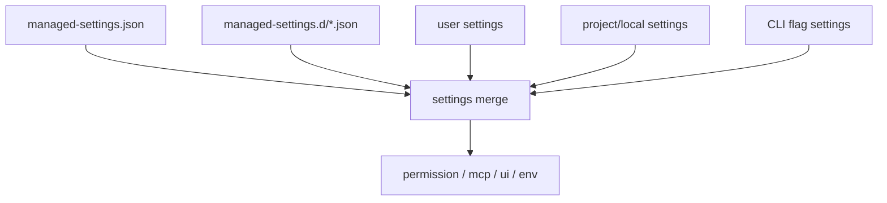

Sources: [src/utils/settings/settings.ts:55-121](../../../project-repos/exports/src/utils/settings/settings.ts#L55-L121), [src/utils/settings/settings.ts:172-231](../../../project-repos/exports/src/utils/settings/settings.ts#L172-L231), [src/utils/settings/settings.ts:233-260](../../../project-repos/exports/src/utils/settings/settings.ts#L233-L260)

引用源码

<!-- source-snippets:start -->

#### `src/utils/settings/settings.ts:55-121`

> 未找到引用文件：`src/utils/settings/settings.ts`

#### `src/utils/settings/settings.ts:172-231`

> 未找到引用文件：`src/utils/settings/settings.ts`

#### `src/utils/settings/settings.ts:233-260`

> 未找到引用文件：`src/utils/settings/settings.ts`

<!-- source-snippets:end -->

## MCP 写配置采用原子替换

`writeMcpjsonFile()` 会读取现有 `.mcp.json` 权限，写入带 pid/time 的临时文件，`datasync()` 后再 `rename()`。如果 rename 失败，只 unlink 那个明确 temp path；这保证不会批量清理目录，也降低写坏配置的概率。

Sources: [src/services/mcp/config.ts:83-131](../../../project-repos/exports/src/services/mcp/config.ts#L83-L131)

引用源码

<!-- source-snippets:start -->

#### `src/services/mcp/config.ts:83-131`

> 未找到引用文件：`src/services/mcp/config.ts`

<!-- source-snippets:end -->

## 构建脚本依赖 Bun 的 define 注入

`package.json` 的 build 命令使用 `bun build src/entrypoints/cli.tsx --target bun`，同时注入 `MACRO.VERSION`、`MACRO.BUILD_TIME`、`MACRO.PACKAGE_URL` 等编译期常量。README 也说明 `bun:bundle` feature flag 会通过本地 plugin shim 让未启用代码默认 false。

Sources: [package.json:7-12](../../../project-repos/exports/package.json#L7-L12), [README.md:62-67](../../../project-repos/exports/README.md#L62-L67)

引用源码

<!-- source-snippets:start -->

#### `package.json:7-12`

> 未找到引用文件：`package.json`

#### `README.md:62-67`

> 未找到引用文件：`README.md`

<!-- source-snippets:end -->

## 质量门禁以 TypeScript 为主

仓库脚本只暴露 `typecheck`，测试文件非常少；这意味着可验证质量主要依赖 TypeScript strict、schema 校验、局部运行时保护和大量 feature gate 分支。对于读者来说，理解 `buildTool` 的默认值、settings schema 和 permission rule 过滤，比寻找传统单元测试更能解释项目可靠性边界。

Sources: [package.json:7-12](../../../project-repos/exports/package.json#L7-L12), [package.json:87-102](../../../project-repos/exports/package.json#L87-L102), [src/Tool.ts:743-792](../../../project-repos/exports/src/Tool.ts#L743-L792), [src/utils/settings/settings.ts:213-227](../../../project-repos/exports/src/utils/settings/settings.ts#L213-L227)

引用源码

<!-- source-snippets:start -->

#### `package.json:7-12`

> 未找到引用文件：`package.json`

#### `package.json:87-102`

> 未找到引用文件：`package.json`

#### `src/Tool.ts:743-792`

> 未找到引用文件：`src/Tool.ts`

#### `src/utils/settings/settings.ts:213-227`

> 未找到引用文件：`src/utils/settings/settings.ts`

<!-- source-snippets:end -->

## 相关页面

- [启动与 CLI 入口](startup-and-cli.md) — 配置在 preAction 和 action 中生效
- [权限与 Hook](permissions-hooks.md) — 权限规则来源于 settings
- [MCP 集成](mcp-integration.md) — MCP server 配置也受 settings 策略控制

---

相关源文件

生成本页时使用的主要源文件：

- [src/QueryEngine.ts](../../../project-repos/claude-code/src/QueryEngine.ts)
- [src/context.ts](../../../project-repos/claude-code/src/context.ts)
- [src/bootstrap/state.ts](../../../project-repos/claude-code/src/bootstrap/state.ts)
- [src/state/AppState.ts](../../../project-repos/claude-code/src/state/AppState.ts)
- [src/history.ts](../../../project-repos/claude-code/src/history.ts)
- [src/utils/sessionStorage.ts](../../../project-repos/claude-code/src/utils/sessionStorage.ts)
- [src/utils/fileStateCache.ts](../../../project-repos/claude-code/src/utils/fileStateCache.ts)
- [src/Task.ts](../../../project-repos/claude-code/src/Task.ts)

# 数据流、状态与持久化

Claude Code 的状态分成三类：会话消息、运行时 UI/AppState、以及外部可恢复的磁盘状态。这个分层让 REPL 可以持有丰富 UI 状态，同时 SDK/headless 路径仍然能通过 transcript、file cache 和 task output 文件恢复上下文。

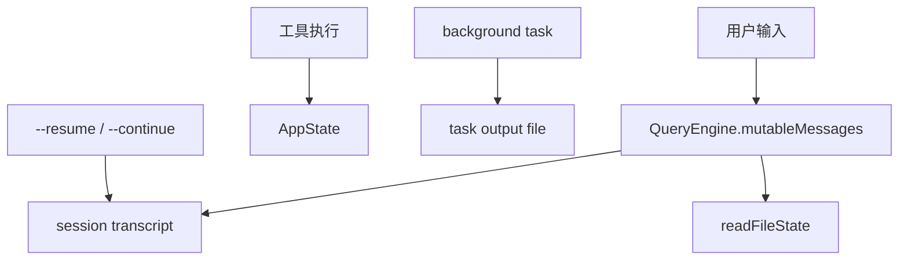

Sources: [src/QueryEngine.ts:184-207](../../../project-repos/exports/src/QueryEngine.ts#L184-L207), [src/QueryEngine.ts:641-655](../../../project-repos/exports/src/QueryEngine.ts#L641-L655), [src/QueryEngine.ts:675-731](../../../project-repos/exports/src/QueryEngine.ts#L675-L731), [src/Task.ts:44-57](../../../project-repos/exports/src/Task.ts#L44-L57), [src/Task.ts:108-125](../../../project-repos/exports/src/Task.ts#L108-L125)

引用源码

<!-- source-snippets:start -->

#### `src/QueryEngine.ts:184-207`

> 未找到引用文件：`src/QueryEngine.ts`

#### `src/QueryEngine.ts:641-655`

> 未找到引用文件：`src/QueryEngine.ts`

#### `src/QueryEngine.ts:675-731`

> 未找到引用文件：`src/QueryEngine.ts`

#### `src/Task.ts:44-57`

> 未找到引用文件：`src/Task.ts`

#### `src/Task.ts:108-125`

> 未找到引用文件：`src/Task.ts`

<!-- source-snippets:end -->

## file history 在用户消息边界建快照

QueryEngine 在持久化会话时，会对可选择的用户消息建立 file history snapshot。这表明文件回滚不是每次工具写入都立即单独暴露，而是挂在对话消息边界上，适合实现“恢复到某条用户消息”这样的功能。

Sources: [src/QueryEngine.ts:641-655](../../../project-repos/exports/src/QueryEngine.ts#L641-L655), [src/main.tsx:990-1000](../../../project-repos/exports/src/main.tsx#L990-L1000)

引用源码

<!-- source-snippets:start -->

#### `src/QueryEngine.ts:641-655`

> 未找到引用文件：`src/QueryEngine.ts`

#### `src/main.tsx:990-1000`

> 未找到引用文件：`src/main.tsx`

<!-- source-snippets:end -->

## resume 前会清会话缓存

`--continue` 路径在加载最近会话前会导入并调用 `clearSessionCaches()`，确保恢复时重新发现文件和 Skill，而不是沿用旧缓存。这是长生命周期 CLI 常见的隐性坑点：缓存对单会话有益，但跨恢复边界必须失效。

Sources: [src/main.tsx:3101-3146](../../../project-repos/exports/src/main.tsx#L3101-L3146)

引用源码

<!-- source-snippets:start -->

#### `src/main.tsx:3101-3146`

> 未找到引用文件：`src/main.tsx`

<!-- source-snippets:end -->

## 相关页面

- [QueryEngine 会话运行时](query-runtime.md) — 消息和转录的主链路
- [Agent、Task 与远程会话](agent-task-remote.md) — 后台任务状态和输出文件
- [配置、构建与质量门禁](settings-build-quality.md) — settings 与运行时状态的关系

---

相关源文件

生成本页时使用的主要源文件：

- [README.md](../../../project-repos/claude-code/README.md)
- [src/main.tsx](../../../project-repos/claude-code/src/main.tsx)
- [src/utils/permissions/permissionSetup.ts](../../../project-repos/claude-code/src/utils/permissions/permissionSetup.ts)
- [src/services/mcp/config.ts](../../../project-repos/claude-code/src/services/mcp/config.ts)
- [src/remote/SessionsWebSocket.ts](../../../project-repos/claude-code/src/remote/SessionsWebSocket.ts)
- [src/services/mcp/client.ts](../../../project-repos/claude-code/src/services/mcp/client.ts)
- [src/hooks/toolPermission/handlers/interactiveHandler.ts](../../../project-repos/claude-code/src/hooks/toolPermission/handlers/interactiveHandler.ts)

# 安全边界与风险点

这个仓库的第一层风险来自来源本身：README 明确写出它归档的是泄露源码。因此这份 wiki 只做架构级说明和短行号引用，不把源码大段复制成文档内容。第二层风险来自能力本身：CLI 可以执行 shell、读写文件、连 MCP、启动远程会话，所以权限和策略层才是核心。

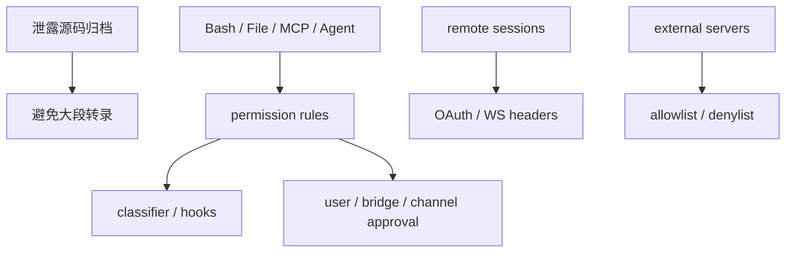

Sources: [README.md:1-16](../../../project-repos/exports/README.md#L1-L16), [README.md:62-67](../../../project-repos/exports/README.md#L62-L67), [src/main.tsx:968-1006](../../../project-repos/exports/src/main.tsx#L968-L1006)

引用源码

<!-- source-snippets:start -->

#### `README.md:1-16`

> 未找到引用文件：`README.md`

#### `README.md:62-67`

> 未找到引用文件：`README.md`

#### `src/main.tsx:968-1006`

> 未找到引用文件：`src/main.tsx`

<!-- source-snippets:end -->

## bypass permissions 被入口直接暴露，但有建议语义

CLI help 中 `--dangerously-skip-permissions` 明确存在，并建议只在无互联网沙箱里使用。权限 setup 又会对 auto mode 下的危险 Bash/PowerShell/Agent allow 做剥离，说明项目同时支持高权限运行和防误配收紧。

Sources: [src/main.tsx:968-1000](../../../project-repos/exports/src/main.tsx#L968-L1000), [src/utils/permissions/permissionSetup.ts:84-147](../../../project-repos/exports/src/utils/permissions/permissionSetup.ts#L84-L147), [src/utils/permissions/permissionSetup.ts:149-245](../../../project-repos/exports/src/utils/permissions/permissionSetup.ts#L149-L245)

引用源码

<!-- source-snippets:start -->

#### `src/main.tsx:968-1000`

> 未找到引用文件：`src/main.tsx`

#### `src/utils/permissions/permissionSetup.ts:84-147`

> 未找到引用文件：`src/utils/permissions/permissionSetup.ts`

#### `src/utils/permissions/permissionSetup.ts:149-245`

> 未找到引用文件：`src/utils/permissions/permissionSetup.ts`

<!-- source-snippets:end -->

## MCP 策略优先级是防扩展面失控的关键

MCP allow/deny 支持按名称、命令、URL 控制，且 denylist 绝对优先。插件和 claude.ai connector 还会做 signature 去重，避免同一个 server 通过不同命名重复暴露工具和浪费上下文。

Sources: [src/services/mcp/config.ts:195-309](../../../project-repos/exports/src/services/mcp/config.ts#L195-L309), [src/services/mcp/config.ts:336-550](../../../project-repos/exports/src/services/mcp/config.ts#L336-L550)

引用源码

<!-- source-snippets:start -->

#### `src/services/mcp/config.ts:195-309`

> 未找到引用文件：`src/services/mcp/config.ts`

#### `src/services/mcp/config.ts:336-550`

> 未找到引用文件：`src/services/mcp/config.ts`

<!-- source-snippets:end -->

## 远程 WebSocket 使用 bearer header，并区分永久失败

远程 session 订阅 URL 来自 OAuth base API，连接时带 `Authorization: Bearer` 和 `anthropic-version`。close code 4003 被视为永久 unauthorized；4001 只有限重试，避免 compaction 期间短暂失联立刻毁掉会话。

Sources: [src/remote/SessionsWebSocket.ts:74-119](../../../project-repos/exports/src/remote/SessionsWebSocket.ts#L74-L119), [src/remote/SessionsWebSocket.ts:231-260](../../../project-repos/exports/src/remote/SessionsWebSocket.ts#L231-L260)

引用源码

<!-- source-snippets:start -->

#### `src/remote/SessionsWebSocket.ts:74-119`

> 未找到引用文件：`src/remote/SessionsWebSocket.ts`

#### `src/remote/SessionsWebSocket.ts:231-260`

> 未找到引用文件：`src/remote/SessionsWebSocket.ts`

<!-- source-snippets:end -->

## 相关页面

- [权限与 Hook](permissions-hooks.md) — 大部分安全边界由权限层执行
- [MCP 集成](mcp-integration.md) — MCP 连接和策略过滤
- [启动与 CLI 入口](startup-and-cli.md) — 危险 flag 和模式在入口暴露
