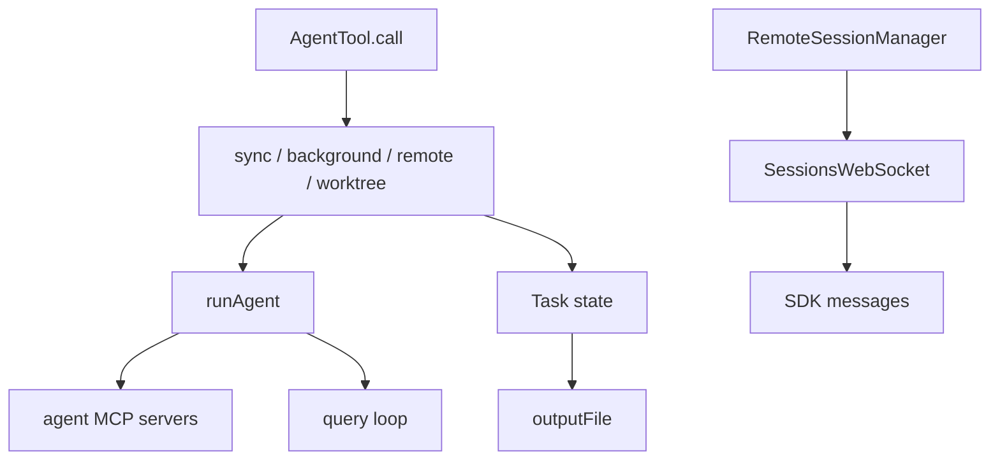

相关源文件

生成本页时使用的主要源文件：

- [src/tools/AgentTool/AgentTool.tsx](../../../project-repos/claude-code/src/tools/AgentTool/AgentTool.tsx)
- [src/tools/AgentTool/runAgent.ts](../../../project-repos/claude-code/src/tools/AgentTool/runAgent.ts)
- [src/Task.ts](../../../project-repos/claude-code/src/Task.ts)
- [src/tasks.ts](../../../project-repos/claude-code/src/tasks.ts)
- [src/remote/RemoteSessionManager.ts](../../../project-repos/claude-code/src/remote/RemoteSessionManager.ts)
- [src/remote/SessionsWebSocket.ts](../../../project-repos/claude-code/src/remote/SessionsWebSocket.ts)
- [src/main.tsx](../../../project-repos/claude-code/src/main.tsx)

# Agent、Task 与远程会话

Agent 和 Task 把“长时间执行”从单个 tool result 中拆出来。AgentTool 可以同步返回，也可以后台运行、远程运行、worktree 隔离或作为 teammate 参与多 agent 协作；Task 则给这些后台实体统一 ID、状态、输出文件和 kill 接口。

Sources: [src/tools/AgentTool/AgentTool.tsx:81-155](../../../project-repos/pages/src/tools/AgentTool/AgentTool.tsx#L81-L155), [src/tools/AgentTool/AgentTool.tsx:196-260](../../../project-repos/pages/src/tools/AgentTool/AgentTool.tsx#L196-L260), [src/Task.ts:6-29](../../../project-repos/pages/src/Task.ts#L6-L29), [src/Task.ts:44-76](../../../project-repos/pages/src/Task.ts#L44-L76), [src/tasks.ts:17-38](../../../project-repos/pages/src/tasks.ts#L17-L38)

引用源码

<!-- source-snippets:start -->

#### `src/tools/AgentTool/AgentTool.tsx:81-155`

> 未找到引用文件：`src/tools/AgentTool/AgentTool.tsx`

#### `src/tools/AgentTool/AgentTool.tsx:196-260`

> 未找到引用文件：`src/tools/AgentTool/AgentTool.tsx`

#### `src/Task.ts:6-29`

> 未找到引用文件：`src/Task.ts`

#### `src/Task.ts:44-76`

> 未找到引用文件：`src/Task.ts`

#### `src/tasks.ts:17-38`

> 未找到引用文件：`src/tasks.ts`

<!-- source-snippets:end -->

## Agent 可以声明自己的 MCP 依赖

`runAgent.ts` 在 agent 启动时会读取 agent definition 里的 `mcpServers`，引用已有配置或内联定义，然后连接并拉取 tools。内联 server 在 agent 完成时清理，引用父级配置的 shared client 不清理；这个区别避免了子 agent 误关主会话的 MCP 连接。

Sources: [src/tools/AgentTool/runAgent.ts:85-127](../../../project-repos/pages/src/tools/AgentTool/runAgent.ts#L85-L127), [src/tools/AgentTool/runAgent.ts:129-218](../../../project-repos/pages/src/tools/AgentTool/runAgent.ts#L129-L218)

引用源码

<!-- source-snippets:start -->

#### `src/tools/AgentTool/runAgent.ts:85-127`

> 未找到引用文件：`src/tools/AgentTool/runAgent.ts`

#### `src/tools/AgentTool/runAgent.ts:129-218`

> 未找到引用文件：`src/tools/AgentTool/runAgent.ts`

<!-- source-snippets:end -->

## 远程会话把消息流和权限流分开

`RemoteSessionManager` 用 WebSocket 接收 SDKMessage 和 control request，用 HTTP POST 发用户消息。权限请求不是普通聊天消息，而是 control_request；pending map 保存 request_id，允许远端取消或用户响应后回传 allow/deny。

Sources: [src/remote/RemoteSessionManager.ts:87-103](../../../project-repos/pages/src/remote/RemoteSessionManager.ts#L87-L103), [src/remote/RemoteSessionManager.ts:143-183](../../../project-repos/pages/src/remote/RemoteSessionManager.ts#L143-L183), [src/remote/RemoteSessionManager.ts:186-260](../../../project-repos/pages/src/remote/RemoteSessionManager.ts#L186-L260)

引用源码

<!-- source-snippets:start -->

#### `src/remote/RemoteSessionManager.ts:87-103`

> 未找到引用文件：`src/remote/RemoteSessionManager.ts`

#### `src/remote/RemoteSessionManager.ts:143-183`

> 未找到引用文件：`src/remote/RemoteSessionManager.ts`

#### `src/remote/RemoteSessionManager.ts:186-260`

> 未找到引用文件：`src/remote/RemoteSessionManager.ts`

<!-- source-snippets:end -->

## WebSocket 恢复策略区分临时和永久关闭

`SessionsWebSocket` 对 4003 unauthorized 这类永久关闭停止重连；对 4001 session not found 保留有限重试窗口，因为 compaction 时后端可能短暂认为 session stale。这个细节说明远程会话要兼容长上下文压缩造成的短暂不可用。

Sources: [src/remote/SessionsWebSocket.ts:17-36](../../../project-repos/pages/src/remote/SessionsWebSocket.ts#L17-L36), [src/remote/SessionsWebSocket.ts:74-119](../../../project-repos/pages/src/remote/SessionsWebSocket.ts#L74-L119), [src/remote/SessionsWebSocket.ts:231-260](../../../project-repos/pages/src/remote/SessionsWebSocket.ts#L231-L260)

引用源码

<!-- source-snippets:start -->

#### `src/remote/SessionsWebSocket.ts:17-36`

> 未找到引用文件：`src/remote/SessionsWebSocket.ts`

#### `src/remote/SessionsWebSocket.ts:74-119`

> 未找到引用文件：`src/remote/SessionsWebSocket.ts`

#### `src/remote/SessionsWebSocket.ts:231-260`

> 未找到引用文件：`src/remote/SessionsWebSocket.ts`

<!-- source-snippets:end -->

## 相关页面

- [工具系统](tool-system.md) — AgentTool 作为模型可调用工具
- [MCP 集成](mcp-integration.md) — Agent 可以拥有额外 MCP server
- [终端 UI 与键位系统](terminal-ui-keybindings.md) — 远程和后台任务如何反映到 UI
