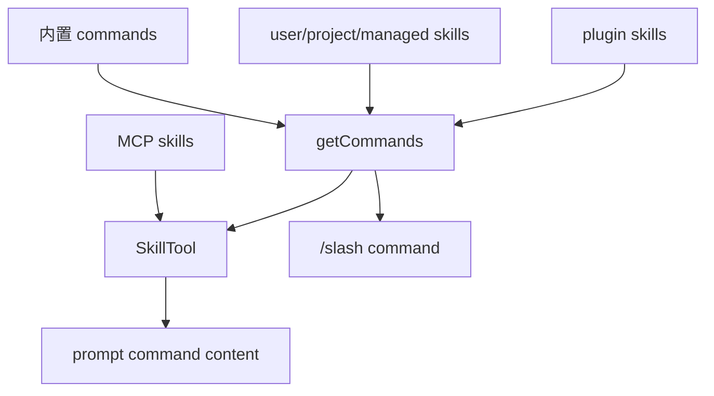

相关源文件

生成本页时使用的主要源文件：

- [src/commands.ts](../../../project-repos/claude-code/src/commands.ts)
- [src/skills/loadSkillsDir.ts](../../../project-repos/claude-code/src/skills/loadSkillsDir.ts)
- [src/tools/SkillTool/SkillTool.ts](../../../project-repos/claude-code/src/tools/SkillTool/SkillTool.ts)
- [src/plugins/bundled/index.ts](../../../project-repos/claude-code/src/plugins/bundled/index.ts)
- [src/utils/plugins/loadPluginCommands.ts](../../../project-repos/claude-code/src/utils/plugins/loadPluginCommands.ts)
- [src/services/skillSearch/localSearch.ts](../../../project-repos/claude-code/src/services/skillSearch/localSearch.ts)

# 命令、Skill 与插件

命令系统有两层：用户输入 `/xxx` 的 slash command，以及模型通过 `SkillTool` 调用的 prompt command。源码里的关键不是“命令很多”，而是这些命令来源不同：内置命令、本地 skills、项目 skills、托管 skills、插件 skills、MCP skills，最终都被规整成 `Command`。

Sources: [src/commands.ts:256-346](../../../project-repos/pages/src/commands.ts#L256-L346), [src/commands.ts:353-398](../../../project-repos/pages/src/commands.ts#L353-L398), [src/commands.ts:541-580](../../../project-repos/pages/src/commands.ts#L541-L580), [src/commands.ts:583-608](../../../project-repos/pages/src/commands.ts#L583-L608)

引用源码

<!-- source-snippets:start -->

#### `src/commands.ts:256-346`

> 未找到引用文件：`src/commands.ts`

#### `src/commands.ts:353-398`

> 未找到引用文件：`src/commands.ts`

#### `src/commands.ts:541-580`

> 未找到引用文件：`src/commands.ts`

#### `src/commands.ts:583-608`

> 未找到引用文件：`src/commands.ts`

<!-- source-snippets:end -->

## Skill frontmatter 被解析成运行约束

`loadSkillsDir.ts` 会解析 `description`、`allowed-tools`、`when_to_use`、`model`、`disable-model-invocation`、`hooks`、`context: fork`、`agent`、`effort` 和 `shell`。Skill 因此不只是 Markdown 片段，而是带工具约束、执行上下文和模型偏好的 prompt command。

Sources: [src/skills/loadSkillsDir.ts:180-265](../../../project-repos/pages/src/skills/loadSkillsDir.ts#L180-L265), [src/skills/loadSkillsDir.ts:270-400](../../../project-repos/pages/src/skills/loadSkillsDir.ts#L270-L400)

引用源码

<!-- source-snippets:start -->

#### `src/skills/loadSkillsDir.ts:180-265`

> 未找到引用文件：`src/skills/loadSkillsDir.ts`

#### `src/skills/loadSkillsDir.ts:270-400`

> 未找到引用文件：`src/skills/loadSkillsDir.ts`

<!-- source-snippets:end -->

## 装载顺序兼顾策略和显式目录

Skill 发现会并行读取 managed、user、project、`--add-dir` 和 legacy commands；`--bare` 则跳过自动发现，只加载显式 add-dir 下的项目 skills。随后按 realpath 去重，避免 symlink 或重叠目录导致重复注入。

Sources: [src/skills/loadSkillsDir.ts:638-675](../../../project-repos/pages/src/skills/loadSkillsDir.ts#L638-L675), [src/skills/loadSkillsDir.ts:677-760](../../../project-repos/pages/src/skills/loadSkillsDir.ts#L677-L760)

引用源码

<!-- source-snippets:start -->

#### `src/skills/loadSkillsDir.ts:638-675`

> 未找到引用文件：`src/skills/loadSkillsDir.ts`

#### `src/skills/loadSkillsDir.ts:677-760`

> 未找到引用文件：`src/skills/loadSkillsDir.ts`

<!-- source-snippets:end -->

## SkillTool 支持 inline 和 fork 两种执行语义

`SkillTool` 会把 MCP skills 合并进可执行命令集合，并可把某个 Skill 放进 forked sub-agent 中执行。fork 路径会准备独立 agent context、记录 telemetry，并把 skill effort 合并到 agent definition。这让复杂 Skill 不必挤在主会话 token 预算里。

Sources: [src/tools/SkillTool/SkillTool.ts:77-94](../../../project-repos/pages/src/tools/SkillTool/SkillTool.ts#L77-L94), [src/tools/SkillTool/SkillTool.ts:118-236](../../../project-repos/pages/src/tools/SkillTool/SkillTool.ts#L118-L236)

引用源码

<!-- source-snippets:start -->

#### `src/tools/SkillTool/SkillTool.ts:77-94`

> 未找到引用文件：`src/tools/SkillTool/SkillTool.ts`

#### `src/tools/SkillTool/SkillTool.ts:118-236`

> 未找到引用文件：`src/tools/SkillTool/SkillTool.ts`

<!-- source-snippets:end -->

## 相关页面

- [启动与 CLI 入口](startup-and-cli.md) — 命令从 Commander 主入口进入
- [MCP 集成](mcp-integration.md) — MCP Skill 也会进入命令/SkillTool
- [工具系统](tool-system.md) — SkillTool 是工具注册表中的工具
