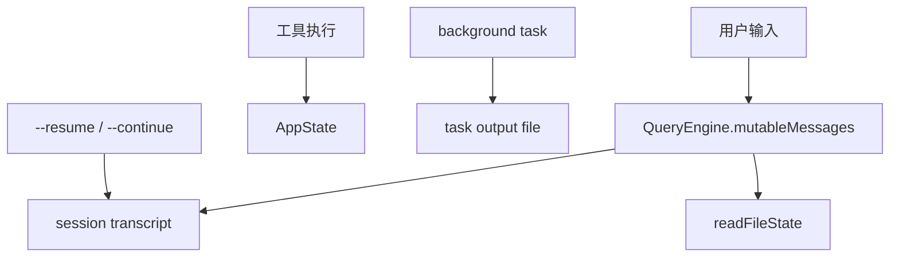

相关源文件

生成本页时使用的主要源文件：

- [src/QueryEngine.ts](../../../project-repos/claude-code/src/QueryEngine.ts)
- [src/context.ts](../../../project-repos/claude-code/src/context.ts)
- [src/bootstrap/state.ts](../../../project-repos/claude-code/src/bootstrap/state.ts)
- [src/state/AppState.ts](../../../project-repos/claude-code/src/state/AppState.ts)
- [src/history.ts](../../../project-repos/claude-code/src/history.ts)
- [src/utils/sessionStorage.ts](../../../project-repos/claude-code/src/utils/sessionStorage.ts)
- [src/utils/fileStateCache.ts](../../../project-repos/claude-code/src/utils/fileStateCache.ts)
- [src/Task.ts](../../../project-repos/claude-code/src/Task.ts)

# 数据流、状态与持久化

Claude Code 的状态分成三类：会话消息、运行时 UI/AppState、以及外部可恢复的磁盘状态。这个分层让 REPL 可以持有丰富 UI 状态，同时 SDK/headless 路径仍然能通过 transcript、file cache 和 task output 文件恢复上下文。

Sources: [src/QueryEngine.ts:184-207](../../../project-repos/pages/src/QueryEngine.ts#L184-L207), [src/QueryEngine.ts:641-655](../../../project-repos/pages/src/QueryEngine.ts#L641-L655), [src/QueryEngine.ts:675-731](../../../project-repos/pages/src/QueryEngine.ts#L675-L731), [src/Task.ts:44-57](../../../project-repos/pages/src/Task.ts#L44-L57), [src/Task.ts:108-125](../../../project-repos/pages/src/Task.ts#L108-L125)

引用源码

<!-- source-snippets:start -->

#### `src/QueryEngine.ts:184-207`

> 未找到引用文件：`src/QueryEngine.ts`

#### `src/QueryEngine.ts:641-655`

> 未找到引用文件：`src/QueryEngine.ts`

#### `src/QueryEngine.ts:675-731`

> 未找到引用文件：`src/QueryEngine.ts`

#### `src/Task.ts:44-57`

> 未找到引用文件：`src/Task.ts`

#### `src/Task.ts:108-125`

> 未找到引用文件：`src/Task.ts`

<!-- source-snippets:end -->

## file history 在用户消息边界建快照

QueryEngine 在持久化会话时，会对可选择的用户消息建立 file history snapshot。这表明文件回滚不是每次工具写入都立即单独暴露，而是挂在对话消息边界上，适合实现“恢复到某条用户消息”这样的功能。

Sources: [src/QueryEngine.ts:641-655](../../../project-repos/pages/src/QueryEngine.ts#L641-L655), [src/main.tsx:990-1000](../../../project-repos/pages/src/main.tsx#L990-L1000)

引用源码

<!-- source-snippets:start -->

#### `src/QueryEngine.ts:641-655`

> 未找到引用文件：`src/QueryEngine.ts`

#### `src/main.tsx:990-1000`

> 未找到引用文件：`src/main.tsx`

<!-- source-snippets:end -->

## resume 前会清会话缓存

`--continue` 路径在加载最近会话前会导入并调用 `clearSessionCaches()`，确保恢复时重新发现文件和 Skill，而不是沿用旧缓存。这是长生命周期 CLI 常见的隐性坑点：缓存对单会话有益，但跨恢复边界必须失效。

Sources: [src/main.tsx:3101-3146](../../../project-repos/pages/src/main.tsx#L3101-L3146)

引用源码

<!-- source-snippets:start -->

#### `src/main.tsx:3101-3146`

> 未找到引用文件：`src/main.tsx`

<!-- source-snippets:end -->

## 相关页面

- [QueryEngine 会话运行时](query-runtime.md) — 消息和转录的主链路
- [Agent、Task 与远程会话](agent-task-remote.md) — 后台任务状态和输出文件
- [配置、构建与质量门禁](settings-build-quality.md) — settings 与运行时状态的关系
