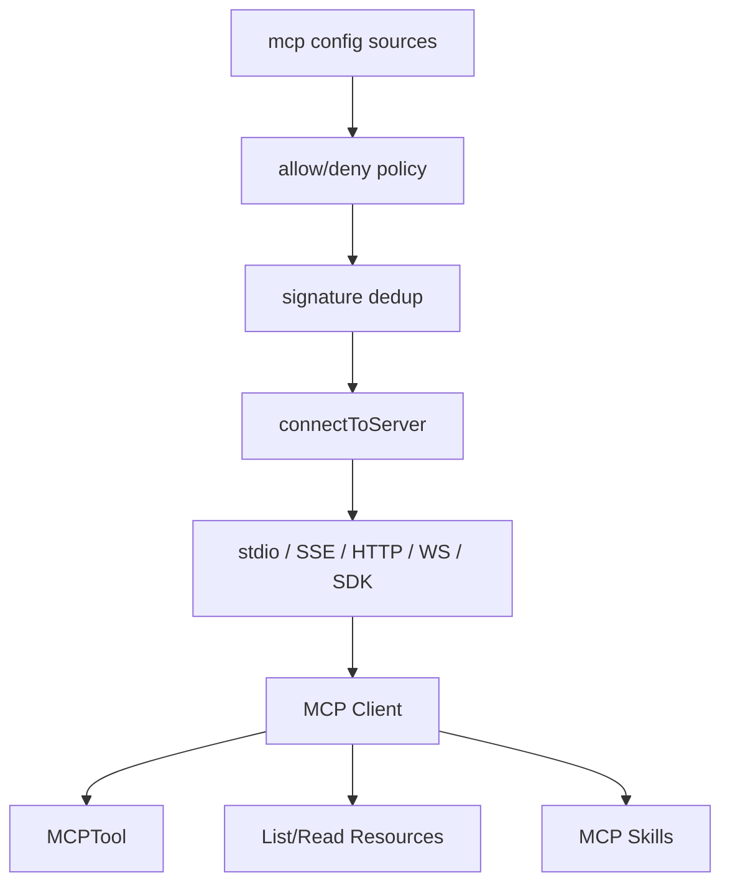

相关源文件

生成本页时使用的主要源文件：

- [src/services/mcp/client.ts](../../../project-repos/claude-code/src/services/mcp/client.ts)
- [src/services/mcp/config.ts](../../../project-repos/claude-code/src/services/mcp/config.ts)
- [src/services/mcp/types.ts](../../../project-repos/claude-code/src/services/mcp/types.ts)
- [src/services/mcp/mcpStringUtils.ts](../../../project-repos/claude-code/src/services/mcp/mcpStringUtils.ts)
- [src/tools/MCPTool/MCPTool.ts](../../../project-repos/claude-code/src/tools/MCPTool/MCPTool.ts)
- [src/tools/ListMcpResourcesTool/ListMcpResourcesTool.ts](../../../project-repos/claude-code/src/tools/ListMcpResourcesTool/ListMcpResourcesTool.ts)
- [src/tools/ReadMcpResourceTool/ReadMcpResourceTool.ts](../../../project-repos/claude-code/src/tools/ReadMcpResourceTool/ReadMcpResourceTool.ts)

# MCP 集成

MCP 在这里是扩展协议，不是外挂脚本。配置层负责合并手写、插件、claude.ai connector 和企业策略；连接层支持 stdio、SSE、HTTP、WebSocket、IDE、SDK、claude.ai proxy；工具层再把远端 tools/resources/prompts 变成模型可见能力。

Sources: [src/services/mcp/config.ts:59-131](../../../project-repos/pages/src/services/mcp/config.ts#L59-L131), [src/services/mcp/config.ts:195-265](../../../project-repos/pages/src/services/mcp/config.ts#L195-L265), [src/services/mcp/config.ts:268-309](../../../project-repos/pages/src/services/mcp/config.ts#L268-L309)

引用源码

<!-- source-snippets:start -->

#### `src/services/mcp/config.ts:59-131`

> 未找到引用文件：`src/services/mcp/config.ts`

#### `src/services/mcp/config.ts:195-265`

> 未找到引用文件：`src/services/mcp/config.ts`

#### `src/services/mcp/config.ts:268-309`

> 未找到引用文件：`src/services/mcp/config.ts`

<!-- source-snippets:end -->

## 策略过滤既支持名称，也支持 command 和 URL

企业 allowlist/denylist 不只匹配 serverName；stdio server 可以按 command array 匹配，远程 server 可以按 URL pattern 匹配。denylist 最高优先级，allowlist 为空时等于全部阻断。SDK 类型 server 被特别豁免，因为它不由 CLI 启动进程或网络连接。

Sources: [src/services/mcp/config.ts:336-407](../../../project-repos/pages/src/services/mcp/config.ts#L336-L407), [src/services/mcp/config.ts:410-550](../../../project-repos/pages/src/services/mcp/config.ts#L410-L550)

引用源码

<!-- source-snippets:start -->

#### `src/services/mcp/config.ts:336-407`

> 未找到引用文件：`src/services/mcp/config.ts`

#### `src/services/mcp/config.ts:410-550`

> 未找到引用文件：`src/services/mcp/config.ts`

<!-- source-snippets:end -->

## transport 处理了长连接和代理细节

`client.ts` 的连接逻辑对 SSE 进行了特别处理：普通请求套 60 秒超时，但 EventSource 长连接不能套这个 timeout，否则会断开持续事件流。WebSocket 路径同时兼容 Bun 和 Node `ws`，并带代理、TLS、header 脱敏日志。

Sources: [src/services/mcp/client.ts:146-218](../../../project-repos/pages/src/services/mcp/client.ts#L146-L218), [src/services/mcp/client.ts:552-585](../../../project-repos/pages/src/services/mcp/client.ts#L552-L585), [src/services/mcp/client.ts:595-677](../../../project-repos/pages/src/services/mcp/client.ts#L595-L677), [src/services/mcp/client.ts:708-780](../../../project-repos/pages/src/services/mcp/client.ts#L708-L780)

引用源码

<!-- source-snippets:start -->

#### `src/services/mcp/client.ts:146-218`

> 未找到引用文件：`src/services/mcp/client.ts`

#### `src/services/mcp/client.ts:552-585`

> 未找到引用文件：`src/services/mcp/client.ts`

#### `src/services/mcp/client.ts:595-677`

> 未找到引用文件：`src/services/mcp/client.ts`

#### `src/services/mcp/client.ts:708-780`

> 未找到引用文件：`src/services/mcp/client.ts`

<!-- source-snippets:end -->

## MCP 会话过期有可识别错误

源码专门识别 HTTP 404 + JSON-RPC `-32001` 的 session expired，而不是把所有 404 都当成会话丢失。这种双信号判断减少了错误 URL 或 server 不在线时的误恢复。

Sources: [src/services/mcp/client.ts:161-206](../../../project-repos/pages/src/services/mcp/client.ts#L161-L206)

引用源码

<!-- source-snippets:start -->

#### `src/services/mcp/client.ts:161-206`

> 未找到引用文件：`src/services/mcp/client.ts`

<!-- source-snippets:end -->

## 相关页面

- [命令、Skill 与插件](commands-skills-plugins.md) — MCP prompts/skills 进入命令系统
- [权限与 Hook](permissions-hooks.md) — MCP 工具沿用权限模型
- [Agent、Task 与远程会话](agent-task-remote.md) — Agent 可声明自己的 MCP server
