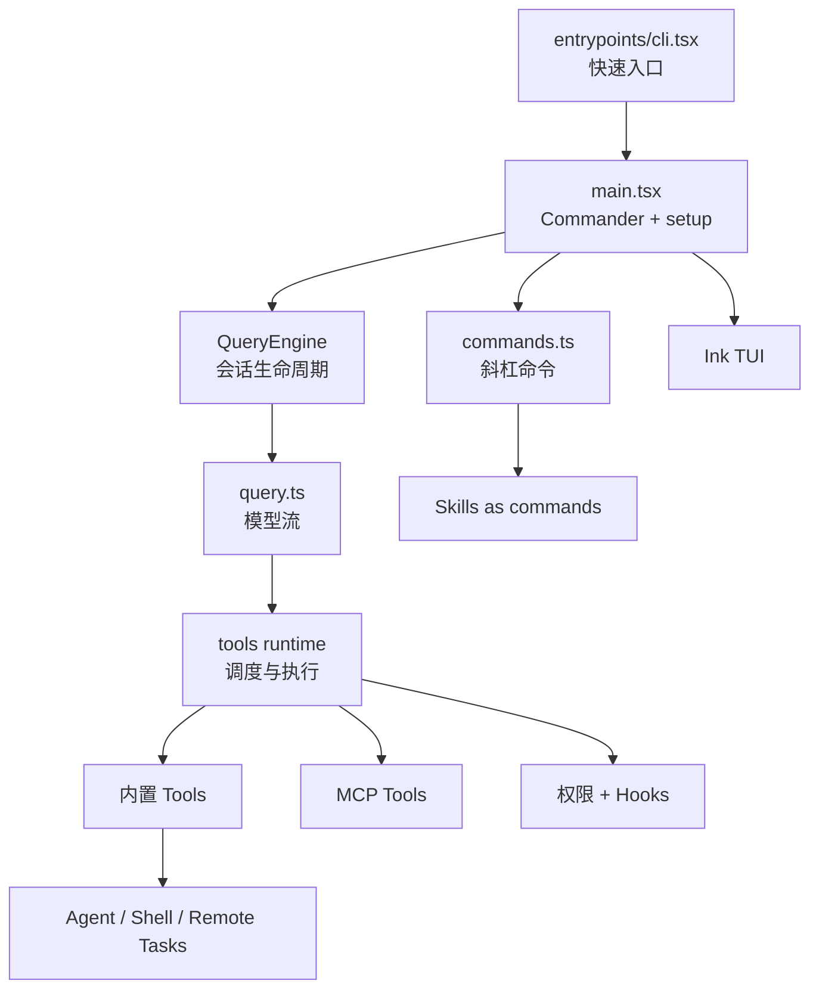

相关源文件

生成本页时使用的主要源文件：

- [README.md](../../../project-repos/claude-code/README.md)
- [package.json](../../../project-repos/claude-code/package.json)
- [src/entrypoints/cli.tsx](../../../project-repos/claude-code/src/entrypoints/cli.tsx)
- [src/main.tsx](../../../project-repos/claude-code/src/main.tsx)
- [src/QueryEngine.ts](../../../project-repos/claude-code/src/QueryEngine.ts)
- [src/tools.ts](../../../project-repos/claude-code/src/tools.ts)
- [src/Tool.ts](../../../project-repos/claude-code/src/Tool.ts)
- [src/commands.ts](../../../project-repos/claude-code/src/commands.ts)

# 项目概览

这个仓库不是一个普通的示例 CLI。它归档的是一个 TypeScript/Bun 版本的 Claude Code 终端代理实现，README 明确把来源描述为 2026-03-31 暴露的 source map；因此阅读它时，最有价值的不是复述安装步骤，而是理解一个成熟 coding agent CLI 如何把模型、工具、权限、终端 UI、MCP、Skill 和远程会话拧成一个可运行系统。

核心洞察很直接：Claude Code 的主抽象不是“聊天框”，而是一个带工具调度和权限边界的会话运行时。`main.tsx` 负责把命令行参数、配置、MCP、插件、权限模式和 UI 会话组装起来；`QueryEngine` 持有一轮轮消息、文件缓存、成本、转录和 SDK 输出；`Tool` 则定义模型能触达外部世界时必须经过的能力边界。

**能力全景**：

- **交互式 CLI 与 headless SDK 共用核心**：同一套 QueryEngine 支撑 REPL、`--print`、`stream-json` 和恢复会话。
- **工具是安全边界**：每个工具声明 schema、只读/破坏性、并发安全、权限检查和渲染摘要。
- **权限不是一个弹窗**：规则、Hook、分类器、桥接端和远程渠道共同参与最终 allow/deny/ask。
- **MCP 是一等扩展面**：stdio、SSE、HTTP、WebSocket、IDE、SDK transport 都被归入统一连接与工具发现流程。
- **Skill 被建模成 prompt command**：本地、项目、托管、插件、MCP Skill 最终进入命令系统，再由 `SkillTool` 执行。
- **Agent/Task 让长任务脱离单轮交互**：本地 agent、shell、remote agent、workflow 和 monitor 都落到任务注册与输出文件模型。

这张图给出全局空间感：CLI 启动只是外壳，真实的执行中心在 QueryEngine 和 Tool/Permission/MCP 的交界处。

Sources: [README.md:1-16](../../../project-repos/pages/README.md#L1-L16), [README.md:70-80](../../../project-repos/pages/README.md#L70-L80), [package.json:1-12](../../../project-repos/pages/package.json#L1-L12), [src/entrypoints/cli.tsx:28-42](../../../project-repos/pages/src/entrypoints/cli.tsx#L28-L42), [src/main.tsx:884-968](../../../project-repos/pages/src/main.tsx#L884-L968), [src/QueryEngine.ts:175-207](../../../project-repos/pages/src/QueryEngine.ts#L175-L207), [src/Tool.ts:362-430](../../../project-repos/pages/src/Tool.ts#L362-L430)

引用源码

<!-- source-snippets:start -->

#### `README.md:1-16`

> 未找到引用文件：`README.md`

#### `README.md:70-80`

> 未找到引用文件：`README.md`

#### `package.json:1-12`

> 未找到引用文件：`package.json`

#### `src/entrypoints/cli.tsx:28-42`

> 未找到引用文件：`src/entrypoints/cli.tsx`

#### `src/main.tsx:884-968`

> 未找到引用文件：`src/main.tsx`

#### `src/QueryEngine.ts:175-207`

> 未找到引用文件：`src/QueryEngine.ts`

#### `src/Tool.ts:362-430`

> 未找到引用文件：`src/Tool.ts`

<!-- source-snippets:end -->

## 技术栈和规模信号

`package.json` 显示它是 `type: module` 的 Bun 项目，脚本入口指向 `src/entrypoints/cli.tsx`，生产构建用 `bun build` 注入 `MACRO.*` 常量。依赖里同时出现 React/Ink、Commander、Anthropic SDK、MCP SDK、OpenTelemetry、GrowthBook、zod、ws 和 vscode-jsonrpc，说明它不是单纯 API wrapper，而是一个集成终端 UI、协议连接、遥测和本地工程上下文的运行时。

Sources: [package.json:7-12](../../../project-repos/pages/package.json#L7-L12), [package.json:13-85](../../../project-repos/pages/package.json#L13-L85), [README.md:258-272](../../../project-repos/pages/README.md#L258-L272)

引用源码

<!-- source-snippets:start -->

#### `package.json:7-12`

> 未找到引用文件：`package.json`

#### `package.json:13-85`

> 未找到引用文件：`package.json`

#### `README.md:258-272`

> 未找到引用文件：`README.md`

<!-- source-snippets:end -->

## 阅读路线

| 目标 | 建议路径 |
|---|---|
| 想理解启动流程 | `启动与 CLI 入口` → `配置、构建与发布形态` |
| 想理解 agent 主循环 | `QueryEngine 会话运行时` → `工具系统` → `权限与 Hook` |
| 想看扩展机制 | `命令、Skill 与插件` → `MCP 集成` |
| 想看长任务和远程 | `Agent、Task 与远程会话` → `终端 UI 与键位系统` |

## 相关页面

- [启动与 CLI 入口](startup-and-cli.md) — 从 `bun run start` 到 Commander/Ink 的启动路径
- [QueryEngine 会话运行时](query-runtime.md) — 模型请求、消息持久化与上下文组装
- [工具系统](tool-system.md) — 工具注册、默认行为和并发调度
