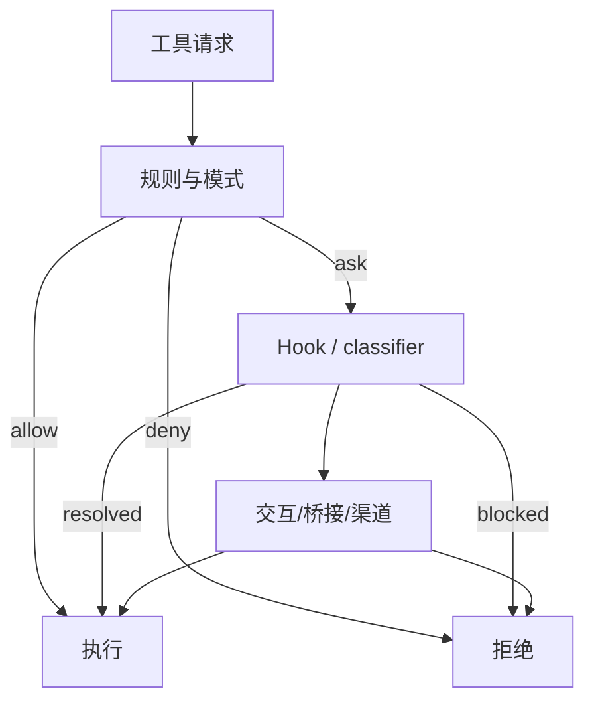

相关源文件

生成本页时使用的主要源文件：

- [src/Tool.ts](../../../project-repos/claude-code/src/Tool.ts)
- [src/hooks/useCanUseTool.tsx](../../../project-repos/claude-code/src/hooks/useCanUseTool.tsx)
- [src/hooks/toolPermission/PermissionContext.ts](../../../project-repos/claude-code/src/hooks/toolPermission/PermissionContext.ts)
- [src/hooks/toolPermission/handlers/interactiveHandler.ts](../../../project-repos/claude-code/src/hooks/toolPermission/handlers/interactiveHandler.ts)
- [src/hooks/toolPermission/handlers/coordinatorHandler.ts](../../../project-repos/claude-code/src/hooks/toolPermission/handlers/coordinatorHandler.ts)
- [src/utils/permissions/permissions.ts](../../../project-repos/claude-code/src/utils/permissions/permissions.ts)
- [src/utils/permissions/permissionSetup.ts](../../../project-repos/claude-code/src/utils/permissions/permissionSetup.ts)
- [src/services/tools/toolHooks.ts](../../../project-repos/claude-code/src/services/tools/toolHooks.ts)

# 权限与 Hook

权限层不是单个“是否允许”的 if。它把配置规则、permission mode、Hook、bash/auto classifier、交互式 UI、桥接端响应、远程 channel 响应和 agent 场景放进同一条 race。结果只有三类：allow、deny、ask；但 ask 可以被自动检查、用户、Hook 或远程控制端抢先解决。

Sources: [src/hooks/useCanUseTool.tsx:27-64](../../../project-repos/pages/src/hooks/useCanUseTool.tsx#L27-L64), [src/hooks/useCanUseTool.tsx:93-168](../../../project-repos/pages/src/hooks/useCanUseTool.tsx#L93-L168), [src/hooks/toolPermission/PermissionContext.ts:96-173](../../../project-repos/pages/src/hooks/toolPermission/PermissionContext.ts#L96-L173)

引用源码

<!-- source-snippets:start -->

#### `src/hooks/useCanUseTool.tsx:27-64`

> 未找到引用文件：`src/hooks/useCanUseTool.tsx`

#### `src/hooks/useCanUseTool.tsx:93-168`

> 未找到引用文件：`src/hooks/useCanUseTool.tsx`

#### `src/hooks/toolPermission/PermissionContext.ts:96-173`

> 未找到引用文件：`src/hooks/toolPermission/PermissionContext.ts`

<!-- source-snippets:end -->

## 规则匹配支持工具级和 MCP server 级

`permissions.ts` 把 allow/deny/ask 规则统一解析成 `PermissionRule`，并通过 `getToolNameForPermissionCheck()` 处理 MCP 前缀。规则 `mcp__server` 可以匹配该 server 下所有工具；这让 MCP 工具不用在权限系统里变成例外。

Sources: [src/utils/permissions/permissions.ts:122-131](../../../project-repos/pages/src/utils/permissions/permissions.ts#L122-L131), [src/utils/permissions/permissions.ts:213-231](../../../project-repos/pages/src/utils/permissions/permissions.ts#L213-L231), [src/utils/permissions/permissions.ts:233-269](../../../project-repos/pages/src/utils/permissions/permissions.ts#L233-L269), [src/utils/permissions/permissions.ts:275-302](../../../project-repos/pages/src/utils/permissions/permissions.ts#L275-L302)

引用源码

<!-- source-snippets:start -->

#### `src/utils/permissions/permissions.ts:122-131`

> 未找到引用文件：`src/utils/permissions/permissions.ts`

#### `src/utils/permissions/permissions.ts:213-231`

> 未找到引用文件：`src/utils/permissions/permissions.ts`

#### `src/utils/permissions/permissions.ts:233-269`

> 未找到引用文件：`src/utils/permissions/permissions.ts`

#### `src/utils/permissions/permissions.ts:275-302`

> 未找到引用文件：`src/utils/permissions/permissions.ts`

<!-- source-snippets:end -->

## 自动模式会剥离危险 allow 规则

`permissionSetup.ts` 对 Bash、PowerShell、Agent 的 auto mode 权限做危险模式检测：全量 Bash、解释器前缀、PowerShell code exec、Agent allow 都被视为会绕过分类器的风险。这是一个关键设计点：auto mode 不是“自动接受已有 allow”，而是要防止用户配置把分类器架空。

Sources: [src/utils/permissions/permissionSetup.ts:84-147](../../../project-repos/pages/src/utils/permissions/permissionSetup.ts#L84-L147), [src/utils/permissions/permissionSetup.ts:149-245](../../../project-repos/pages/src/utils/permissions/permissionSetup.ts#L149-L245)

引用源码

<!-- source-snippets:start -->

#### `src/utils/permissions/permissionSetup.ts:84-147`

> 未找到引用文件：`src/utils/permissions/permissionSetup.ts`

#### `src/utils/permissions/permissionSetup.ts:149-245`

> 未找到引用文件：`src/utils/permissions/permissionSetup.ts`

<!-- source-snippets:end -->

## Hook 既能补上下文，也能改写 MCP 输出

`toolHooks.ts` 的 PostToolUse 路径不仅会展示 Hook 结果，还允许 Hook 阻断继续、追加上下文、取消或在 MCP 工具场景下返回 `updatedMCPToolOutput`。这说明 Hook 不是外部脚本通知，而是会参与下一轮模型输入的控制点。

Sources: [src/services/tools/toolHooks.ts:39-64](../../../project-repos/pages/src/services/tools/toolHooks.ts#L39-L64), [src/services/tools/toolHooks.ts:90-151](../../../project-repos/pages/src/services/tools/toolHooks.ts#L90-L151), [src/services/tools/toolHooks.ts:193-260](../../../project-repos/pages/src/services/tools/toolHooks.ts#L193-L260)

引用源码

<!-- source-snippets:start -->

#### `src/services/tools/toolHooks.ts:39-64`

> 未找到引用文件：`src/services/tools/toolHooks.ts`

#### `src/services/tools/toolHooks.ts:90-151`

> 未找到引用文件：`src/services/tools/toolHooks.ts`

#### `src/services/tools/toolHooks.ts:193-260`

> 未找到引用文件：`src/services/tools/toolHooks.ts`

<!-- source-snippets:end -->

## 相关页面

- [工具系统](tool-system.md) — 权限决策发生在工具执行前
- [MCP 集成](mcp-integration.md) — MCP 工具也进入同一权限模型
- [Agent、Task 与远程会话](agent-task-remote.md) — 后台/远程 agent 会改变权限处理路径
