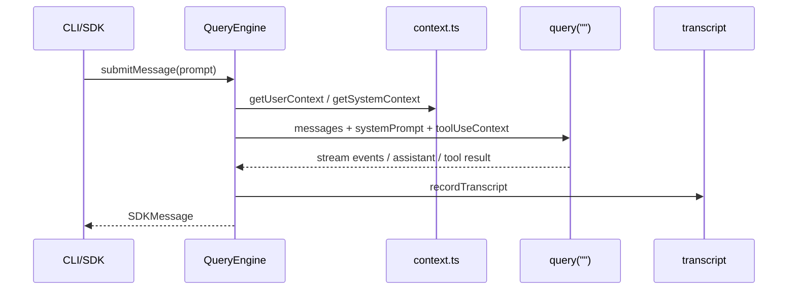

相关源文件

生成本页时使用的主要源文件：

- [src/QueryEngine.ts](../../../project-repos/claude-code/src/QueryEngine.ts)
- [src/query.ts](../../../project-repos/claude-code/src/query.ts)
- [src/context.ts](../../../project-repos/claude-code/src/context.ts)
- [src/utils/processUserInput/processUserInput.ts](../../../project-repos/claude-code/src/utils/processUserInput/processUserInput.ts)
- [src/utils/sessionStorage.ts](../../../project-repos/claude-code/src/utils/sessionStorage.ts)
- [src/services/api/claude.ts](../../../project-repos/claude-code/src/services/api/claude.ts)

# QueryEngine 会话运行时

QueryEngine 是这个仓库里最像“内核”的对象。它把单轮 prompt 转成可持久化消息流，维护 `mutableMessages`、读文件缓存、总 usage、权限拒绝记录和已发现 Skill 集合，并把用户上下文、系统上下文、工具上下文一起交给底层 `query()`。

Sources: [src/QueryEngine.ts:130-173](../../../project-repos/pages/src/QueryEngine.ts#L130-L173), [src/QueryEngine.ts:175-207](../../../project-repos/pages/src/QueryEngine.ts#L175-L207), [src/QueryEngine.ts:209-220](../../../project-repos/pages/src/QueryEngine.ts#L209-L220), [src/QueryEngine.ts:675-686](../../../project-repos/pages/src/QueryEngine.ts#L675-L686)

引用源码

<!-- source-snippets:start -->

#### `src/QueryEngine.ts:130-173`

> 未找到引用文件：`src/QueryEngine.ts`

#### `src/QueryEngine.ts:175-207`

> 未找到引用文件：`src/QueryEngine.ts`

#### `src/QueryEngine.ts:209-220`

> 未找到引用文件：`src/QueryEngine.ts`

#### `src/QueryEngine.ts:675-686`

> 未找到引用文件：`src/QueryEngine.ts`

<!-- source-snippets:end -->

## 上下文注入分成系统快照和用户记忆

`context.ts` 把 git 状态作为系统上下文的一部分，同时把 `CLAUDE.md`/memory 文件收集进用户上下文。这里的设计权衡是：git 状态是“会话开始快照”，不会在会话中自动更新；而 `CLAUDE.md` 读取被 `--bare`、环境变量和额外目录控制，避免最小模式下隐式扫描本地项目。

Sources: [src/context.ts:36-111](../../../project-repos/pages/src/context.ts#L36-L111), [src/context.ts:113-149](../../../project-repos/pages/src/context.ts#L113-L149), [src/context.ts:152-188](../../../project-repos/pages/src/context.ts#L152-L188)

引用源码

<!-- source-snippets:start -->

#### `src/context.ts:36-111`

> 未找到引用文件：`src/context.ts`

#### `src/context.ts:113-149`

> 未找到引用文件：`src/context.ts`

#### `src/context.ts:152-188`

> 未找到引用文件：`src/context.ts`

<!-- source-snippets:end -->

## 转录持久化兼顾 SDK 流式输出

QueryEngine 在收到 assistant/user/compact boundary 时更新内存消息，并把 transcript 写到磁盘。一个细节是 assistant message 的持久化采用 fire-and-forget，原因是流式响应里 message_delta 还会补 stop_reason/usage；如果逐块 await，反而会阻塞后续 delta。

Sources: [src/QueryEngine.ts:675-731](../../../project-repos/pages/src/QueryEngine.ts#L675-L731), [src/QueryEngine.ts:757-816](../../../project-repos/pages/src/QueryEngine.ts#L757-L816)

引用源码

<!-- source-snippets:start -->

#### `src/QueryEngine.ts:675-731`

> 未找到引用文件：`src/QueryEngine.ts`

#### `src/QueryEngine.ts:757-816`

> 未找到引用文件：`src/QueryEngine.ts`

<!-- source-snippets:end -->

## 兼容函数 `ask()` 只是 QueryEngine 包装

文件后半保留 `ask()` 风格的生成器函数，但它本质上创建 QueryEngine，再把 `submitMessage()` yield 出去。这是一个迁移形态：外部调用点可以继续用旧函数签名，内部状态管理已经集中到类。

Sources: [src/QueryEngine.ts:1200-1295](../../../project-repos/pages/src/QueryEngine.ts#L1200-L1295)

引用源码

<!-- source-snippets:start -->

#### `src/QueryEngine.ts:1200-1295`

> 未找到引用文件：`src/QueryEngine.ts`

<!-- source-snippets:end -->

## 相关页面

- [启动与 CLI 入口](startup-and-cli.md) — QueryEngine 如何被入口调用
- [工具系统](tool-system.md) — QueryEngine 如何把 toolUseContext 交给工具
- [配置、构建与质量门禁](settings-build-quality.md) — 会话读取配置和上下文
