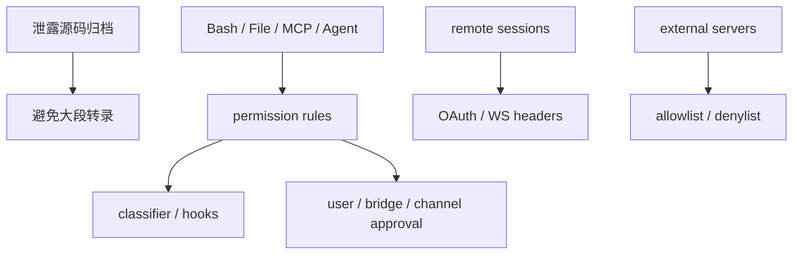

相关源文件

生成本页时使用的主要源文件：

- [README.md](../../../project-repos/claude-code/README.md)
- [src/main.tsx](../../../project-repos/claude-code/src/main.tsx)
- [src/utils/permissions/permissionSetup.ts](../../../project-repos/claude-code/src/utils/permissions/permissionSetup.ts)
- [src/services/mcp/config.ts](../../../project-repos/claude-code/src/services/mcp/config.ts)
- [src/remote/SessionsWebSocket.ts](../../../project-repos/claude-code/src/remote/SessionsWebSocket.ts)
- [src/services/mcp/client.ts](../../../project-repos/claude-code/src/services/mcp/client.ts)
- [src/hooks/toolPermission/handlers/interactiveHandler.ts](../../../project-repos/claude-code/src/hooks/toolPermission/handlers/interactiveHandler.ts)

# 安全边界与风险点

这个仓库的第一层风险来自来源本身：README 明确写出它归档的是泄露源码。因此这份 wiki 只做架构级说明和短行号引用，不把源码大段复制成文档内容。第二层风险来自能力本身：CLI 可以执行 shell、读写文件、连 MCP、启动远程会话，所以权限和策略层才是核心。

Sources: [README.md:1-16](../../../project-repos/pages/README.md#L1-L16), [README.md:62-67](../../../project-repos/pages/README.md#L62-L67), [src/main.tsx:968-1006](../../../project-repos/pages/src/main.tsx#L968-L1006)

引用源码

<!-- source-snippets:start -->

#### `README.md:1-16`

> 未找到引用文件：`README.md`

#### `README.md:62-67`

> 未找到引用文件：`README.md`

#### `src/main.tsx:968-1006`

> 未找到引用文件：`src/main.tsx`

<!-- source-snippets:end -->

## bypass permissions 被入口直接暴露，但有建议语义

CLI help 中 `--dangerously-skip-permissions` 明确存在，并建议只在无互联网沙箱里使用。权限 setup 又会对 auto mode 下的危险 Bash/PowerShell/Agent allow 做剥离，说明项目同时支持高权限运行和防误配收紧。

Sources: [src/main.tsx:968-1000](../../../project-repos/pages/src/main.tsx#L968-L1000), [src/utils/permissions/permissionSetup.ts:84-147](../../../project-repos/pages/src/utils/permissions/permissionSetup.ts#L84-L147), [src/utils/permissions/permissionSetup.ts:149-245](../../../project-repos/pages/src/utils/permissions/permissionSetup.ts#L149-L245)

引用源码

<!-- source-snippets:start -->

#### `src/main.tsx:968-1000`

> 未找到引用文件：`src/main.tsx`

#### `src/utils/permissions/permissionSetup.ts:84-147`

> 未找到引用文件：`src/utils/permissions/permissionSetup.ts`

#### `src/utils/permissions/permissionSetup.ts:149-245`

> 未找到引用文件：`src/utils/permissions/permissionSetup.ts`

<!-- source-snippets:end -->

## MCP 策略优先级是防扩展面失控的关键

MCP allow/deny 支持按名称、命令、URL 控制，且 denylist 绝对优先。插件和 claude.ai connector 还会做 signature 去重，避免同一个 server 通过不同命名重复暴露工具和浪费上下文。

Sources: [src/services/mcp/config.ts:195-309](../../../project-repos/pages/src/services/mcp/config.ts#L195-L309), [src/services/mcp/config.ts:336-550](../../../project-repos/pages/src/services/mcp/config.ts#L336-L550)

引用源码

<!-- source-snippets:start -->

#### `src/services/mcp/config.ts:195-309`

> 未找到引用文件：`src/services/mcp/config.ts`

#### `src/services/mcp/config.ts:336-550`

> 未找到引用文件：`src/services/mcp/config.ts`

<!-- source-snippets:end -->

## 远程 WebSocket 使用 bearer header，并区分永久失败

远程 session 订阅 URL 来自 OAuth base API，连接时带 `Authorization: Bearer` 和 `anthropic-version`。close code 4003 被视为永久 unauthorized；4001 只有限重试，避免 compaction 期间短暂失联立刻毁掉会话。

Sources: [src/remote/SessionsWebSocket.ts:74-119](../../../project-repos/pages/src/remote/SessionsWebSocket.ts#L74-L119), [src/remote/SessionsWebSocket.ts:231-260](../../../project-repos/pages/src/remote/SessionsWebSocket.ts#L231-L260)

引用源码

<!-- source-snippets:start -->

#### `src/remote/SessionsWebSocket.ts:74-119`

> 未找到引用文件：`src/remote/SessionsWebSocket.ts`

#### `src/remote/SessionsWebSocket.ts:231-260`

> 未找到引用文件：`src/remote/SessionsWebSocket.ts`

<!-- source-snippets:end -->

## 相关页面

- [权限与 Hook](permissions-hooks.md) — 大部分安全边界由权限层执行
- [MCP 集成](mcp-integration.md) — MCP 连接和策略过滤
- [启动与 CLI 入口](startup-and-cli.md) — 危险 flag 和模式在入口暴露
